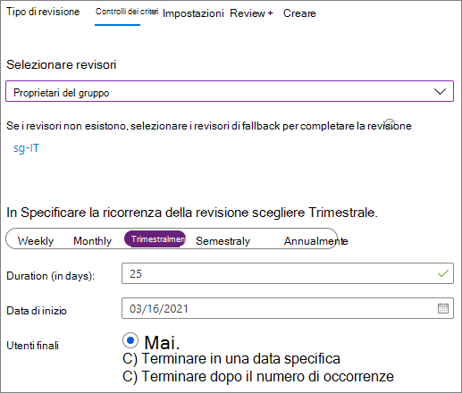
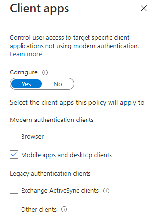
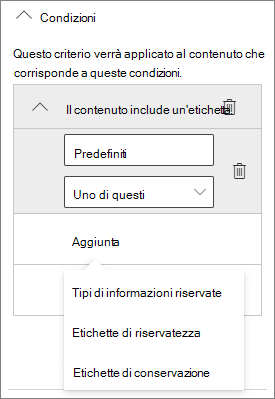
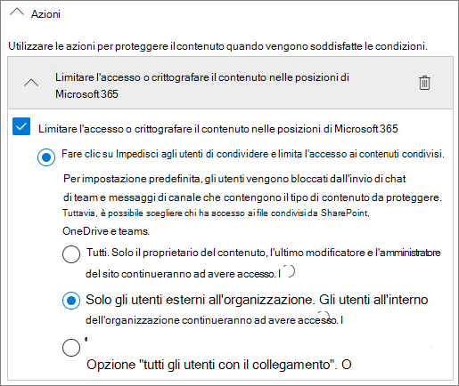

# Creare un ambiente di condivisione guest sicuro

In questo articolo verranno descritte varie opzioni per la creazione di un ambiente di condivisione guest sicuro in Microsoft 365. Si tratta di esempi pensati per offrire una panoramica delle opzioni disponibili. È possibile usare queste procedure in diverse combinazioni per soddisfare le esigenze di sicurezza e conformità della propria organizzazione.

In questo articolo sono inclusi gli argomenti seguenti:

- Configurazione dell'autenticazione a più fattori per i guest.
- Configurazione di condizioni per l'utilizzo per gli utenti guest.
- Configurazione di verifiche trimestrali dell'accesso guest per controllare periodicamente se per gli utenti guest continuano a essere necessarie autorizzazioni per team e siti.
- Limitazione degli utenti guest all'accesso solo Web per i dispositivi non gestiti.
- Configurazione di criteri di timeout della sessione per assicurarsi che gli utenti guest eseguano l'autenticazione quotidianamente.
- Creazione di un tipo di informazioni sensibili per un progetto estremamente riservato.
- Assegnazione automatica di un'etichetta di riservatezza ai documenti che contengono un tipo di informazioni sensibili.
- Rimozione automatica dell'accesso guest dai file con un'etichetta di riservatezza.

Alcune delle opzioni descritte in questo articolo richiedono che i guest abbiano un account in Azure Active Directory. Per fare in modo che gli utenti guest siano inclusi nella directory quando si condividono con loro file e cartelle, usare l'[anteprima dell'integrazione di SharePoint e OneDrive con Azure AD B2B](https://docs.microsoft.com/sharepoint/sharepoint-azureb2b-integration-preview).

Si noti che in questo articolo non verranno illustrate le impostazioni per l'abilitazione della condivisione guest. Per informazioni dettagliate su come abilitare la condivisione guest per scenari diversi, vedere [Collaborare con utenti esterni all'organizzazione](collaborate-with-people-outside-your-organization.md).

## Configurare l'autenticazione a più fattori per gli utenti guest

L'autenticazione a più fattori riduce notevolmente la possibilità di compromissione di un account. Dal momento che gli utenti guest possono usare account di posta elettronica personali che non aderiscono a criteri di governance o procedure consigliate, richiedere l'autenticazione a più fattori per i guest è particolarmente importante. Qualora il nome utente e la password di un utente guest fossero rubati, l'uso di un secondo fattore di autenticazione ridurrebbe notevolmente le possibilità che soggetti sconosciuti possano accedere ai siti e ai file dell'organizzazione.

In questo esempio verrà configurata l'autenticazione a più fattori per gli utenti guest usando criteri di accesso condizionale in Azure Active Directory.

Per configurare l'autenticazione a più fattori per i guest

1. Passare a [Criteri di accesso condizionale di Azure](https://portal.azure.com/#blade/Microsoft_AAD_IAM/ConditionalAccessBlade).
2. Nel pannello **Accesso condizionale - Criteri** fare clic su **Nuovi criteri**.
3. Digitare un nome nel campo **Nome**.
4. In **Assegnazioni** fare clic su **Utenti e gruppi**.
5. Nel pannello **Utenti e gruppi**, scegliere **Seleziona utenti e gruppi**, quindi la casella di controllo **Tutti gli utenti guest ed esterni**.
6. In **Assegnazioni** fare clic su **Applicazioni cloud o azioni**.
7. Nel pannello **App cloud o azioni**, selezionare **Tutte le app cloud** nella scheda **Includi**.
8. In **Controlli di accesso** fare clic su **Concedi**.
9. Nel pannello **Concedi** selezionare la casella di controllo **Richiedi autenticazione a più fattori** e quindi fare clic su **Seleziona**.
10. Nel pannello **Nuovo**, in **Abilita criterio** fare clic su **Sì** e quindi su **Crea**.

Ora gli utenti guest dovranno effettuare la registrazione all'autenticazione a più fattori per poter accedere a team, siti o contenuti condivisi.

### Altre informazioni

[Pianificare la distribuzione dell’autenticazione a più fattori di Azure AD](https://docs.microsoft.com/azure/active-directory/authentication/howto-mfa-getstarted)

## Configurare un documento di condizioni per l'utilizzo per gli utenti guest

In alcune situazioni, gli utenti guest non hanno firmato accordi di non divulgazione o altri accordi legali con l'organizzazione. Si può richiedere ai guest di accettare le condizioni per l'utilizzo prima di accedere ai file che sono stati condivisi con loro. Le condizioni per l'utilizzo possono essere visualizzate al primo tentativo di accesso a un file o a un sito condiviso.

Per creare le condizioni di utilizzo, è necessario prima di tutto creare il documento in Word o in un'altra applicazione e quindi salvarlo come file PDF. Successivamente, si potrà caricare il file in Azure AD.

Per creare un documento di condizioni per l'utilizzo di Azure AD

1. Accedere ad Azure come amministratore globale, amministratore della sicurezza o amministratore di accesso condizionale.
2. Passare a [Condizioni per l'utilizzo](https://aka.ms/catou).
3. Fare clic su **Nuove condizioni**.

   

4. Compilare i campi **Nome** e **Nome visualizzato**.
6. Per **Documento sulle Condizioni per l'utilizzo** passare al file PDF creato e selezionarlo.
7. Selezionare la lingua per il documento delle condizioni per l'utilizzo.
8. Impostare **Richiedi agli utenti di espandere le Condizioni per l'utilizzo** su **Attivata**.
9. In **Accesso condizionale**, nell'elenco **Applica con i modelli di criteri per l'accesso condizionale** scegliere **Crea criteri di accesso condizionale in seguito**.
10. Fare clic su **Crea**.

Dopo aver creato le condizioni per l'utilizzo, il passaggio successivo consiste nel creare criteri di accesso condizionale che mostrano il documento agli utenti guest.

Per creare i criteri di accesso condizionale

1. Passare a [Criteri di accesso condizionale di Azure](https://portal.azure.com/#blade/Microsoft_AAD_IAM/ConditionalAccessBlade).
2. Nel pannello **Accesso condizionale - Criteri** fare clic su **Nuovi criteri**.
3. Digitare un nome nella casella **Nome**.
4. In **Assegnazioni** fare clic su **Utenti e gruppi**.
5. Nel pannello **Utenti e gruppi**, scegliere **Seleziona utenti e gruppi**, quindi la casella di controllo **Tutti gli utenti guest ed esterni**.
6. In **Assegnazioni** fare clic su **Applicazioni cloud o azioni**.
7. Nella scheda **Includi** scegliere **Seleziona le app** e quindi fare clic su **Seleziona**.
8. Nel pannello **Seleziona** scegliere **Microsoft Teams**, **Office 365 SharePoint Online** e **Outlook Groups**, quindi fare clic su **Seleziona**.
9. In **Controlli di accesso** fare clic su **Concedi**.
10. Nel pannello **Concedi** selezionare **Condizioni per l'utilizzo guest** e quindi fare clic su **Seleziona**.
11. Nel pannello **Nuovo**, in **Abilita criterio** fare clic su **Sì** e quindi su **Crea**.

Ora, la prima volta che un utente guest tenterà di accedere al contenuto, a un team o a un sito dell'organizzazione, dovrà accettare le condizioni per l'utilizzo.

> [!NOTE]
> L'uso dell’accesso condizionale richiede una licenza di Azure AD Premium P1. Per altre informazioni, vedere [Cos’è l’accesso condizionale](https://docs.microsoft.com/azure/active-directory/conditional-access/overview).

### Ulteriori informazioni

[Condizioni per l'utilizzo di Azure Active Directory](https://docs.microsoft.com/azure/active-directory/conditional-access/terms-of-use)

## Configurare le verifiche di accesso per gli utenti guest

Le verifiche di accesso in Azure AD consentono di automatizzare una revisione periodica dell'accesso degli utenti a diversi team e gruppi. Richiedendo una verifica di accesso per gli utenti guest, ci si può assicurare che questi ultimi non mantengano l'accesso alle informazioni riservate dell'organizzazione più a lungo del necessario.

Le verifiche di accesso possono essere organizzate in programmi. Un programma è un raggruppamento di verifiche di accesso simili, che è possibile usare per organizzare le verifiche di accesso a scopi di reporting e controllo.

Per creare un programma

1. Accedere al portale di Azure e aprire la pagina [Identity Governance](https://portal.azure.com/#blade/Microsoft_AAD_ERM/DashboardBlade).
2. Nel menu a sinistra fare clic su **Programmi**.
3. Fare clic su **Nuovo programma**.
4. Compilare i campi **Nome** e **Descrizione**.
5. Fare clic su **Crea**.

Una volta creato il programma, è possibile creare una verifica di accesso guest e associarla al programma.

Per configurare una verifica di accesso per gli utenti guest

1. Nel menu a sinistra della pagina [Identity Governance](https://portal.azure.com/#blade/Microsoft_AAD_ERM/DashboardBlade) fare clic su **Verifiche di accesso**.
2. Fare clic su **Nuova verifica di accesso**.

   

3. Digitare un nome nella casella **Nome**.
4. Per **Frequenza** scegliere **Trimestrale**.
5. Per **Fine** scegliere **Mai**.
6. Per **Ambito** scegliere **Solo utenti guest**.
7. Fare clic su **Raggruppa**, selezionare i gruppi che si vogliono includere nella verifica di accesso e quindi fare clic su **Seleziona**.
8. In **Programmi** fare clic su **Collegamento al programma**.
9. Nel pannello **Selezionare un programma** scegliere **Programma verifiche accesso guest**
10. Fare clic su **Avvia**.

Verrà creata una revisione di accesso separata per ogni gruppo specificato. I proprietari di ogni gruppo riceveranno un messaggio di posta elettronica trimestrale per approvare o negare l'accesso guest ai propri gruppi.

È importante tenere presente che è possibile concedere ai guest l'accesso a team o gruppi oppure a singoli file e cartelle. Quando si fornisce loro l'accesso a file e cartelle, gli utenti guest possono anche non far parte di un gruppo specifico. Se si vogliono eseguire verifiche di accesso sugli utenti guest che non appartengono a un team o a un gruppo, è possibile creare un gruppo dinamico in Azure AD per includere tutti i guest e quindi creare una verifica di accesso per tale gruppo. I proprietari dei siti possono anche gestire la [scadenza dei guest per il sito](https://support.microsoft.com/office/25bee24f-42ad-4ee8-8402-4186eed74dea)

### Ulteriori informazioni

[Gestire l'accesso guest con le verifiche di accesso di Azure AD](https://docs.microsoft.com/azure/active-directory/governance/manage-guest-access-with-access-reviews)

[Creare una verifica di accesso di gruppi o applicazioni nelle verifiche di accesso di Azure AD](https://docs.microsoft.com/azure/active-directory/governance/create-access-review)

## Configurare l'accesso solo Web per gli utenti guest

Richiedendo agli utenti guest di accedere ai team, ai siti e ai file solo tramite un Web browser, è possibile ridurre la superficie di attacco e semplificare l'amministrazione.

Per i gruppi di Microsoft 365 e Teams, si usano i criteri di accesso condizionale di Azure AD. Per SharePoint, la configurazione si esegue nell'interfaccia di amministrazione di SharePoint. È anche possibile [usare le etichette di riservatezza per limitare gli utenti guest all'accesso solo Web](https://docs.microsoft.com/microsoft-365/compliance/sensitivity-labels-teams-groups-sites).

Per limitare agli utenti guest l’accesso solo Web per gruppi e team:

1. Passare a [Criteri di accesso condizionale di Azure](https://portal.azure.com/#blade/Microsoft_AAD_IAM/ConditionalAccessBlade).
2. Nel pannello **Accesso condizionale - Criteri** selezionare **Nuovi criteri**.
3. Digitare un nome nella casella **Nome**.
4. In **Assegnazioni** fare clic su **Utenti e gruppi**.
5. Nel pannello **Utenti e gruppi**, scegliere **Seleziona utenti e gruppi**, quindi la casella di controllo **Tutti gli utenti guest ed esterni**.
6. In **Assegnazioni** fare clic su **Applicazioni cloud o azioni**.
7. Nella scheda **Includi** scegliere **Seleziona le app** e quindi fare clic su **Seleziona**.
8. Nel pannello **Seleziona** scegliere **Microsoft Teams**, e **Outlook Groups**, quindi fare clic su **Seleziona**.
9. In **Assegnazioni** fare clic su **Condizioni**.
10. Nel pannello **Condizioni** fare clic su **App client**.
11. Nel pannello **App client** fare clic su **Sì** per **Configura** e quindi selezionare le impostazioni **App per dispositivi mobili e client desktop** e **Client Exchange ActiveSync** e **Altri client**. Deselezionare la casella di controllo **Browser**.

    

12. Fare clic su **Fatto**.
13. In **Controlli di accesso** fare clic su **Concedi**.
14. Nel pannello **Concedi** selezionare **Richiedi che i dispositivi siano contrassegnati come conformi** e **Richiedi dispositivo aggiunto ad Azure AD ibrido**.
15. In **Per più controlli** selezionare **Richiedi uno dei controlli selezionati** e quindi fare clic su **Seleziona**.
16. Nel pannello **Nuovo**, in **Abilita criterio** fare clic su **Sì** e quindi su **Crea**.

Per limitare i guest al solo accesso Web per SharePoint

1. Nell'[interfaccia di amministrazione di SharePoint](https://admin.microsoft.com/sharepoint) espandere **Criteri** e quindi fare clic su **Controllo di accesso**.
2. Fare clic su **Dispositivi non gestiti**.
3. Selezionare l'opzione di **Consenti l'accesso limitato, solo sul Web** e quindi fare clic su **Salva**.

Si noti che questa impostazione nell'interfaccia di amministrazione di SharePoint crea un criterio di accesso condizionale di supporto in Azure AD.

## Configurare un timeout della sessione per gli utenti guest

Richiedere ai guest di eseguire l'autenticazione a intervalli regolari può ridurre la possibilità che utenti sconosciuti accedano al contenuto dell'organizzazione se il dispositivo di un utente guest non è mantenuto al sicuro. È possibile configurare un criterio di accesso condizionale di timeout della sessione per gli utenti guest in Azure AD.

Per configurare un criterio di timeout della sessione guest

1. Passare a [Criteri di accesso condizionale di Azure](https://portal.azure.com/#blade/Microsoft_AAD_IAM/ConditionalAccessBlade).
2. Nel pannello **Accesso condizionale - Criteri** selezionare **Nuovi criteri**.
3. Nella casella **Nome** digitare *Timeout sessioni guest*.
4. In **Assegnazioni** fare clic su **Utenti e gruppi**.
5. Nel pannello **Utenti e gruppi**, scegliere **Seleziona utenti e gruppi**, quindi la casella di controllo **Tutti gli utenti guest ed esterni**.
6. In **Assegnazioni** fare clic su **Applicazioni cloud o azioni**.
7. Nella scheda **Includi** scegliere **Seleziona le app** e quindi fare clic su **Seleziona**.
8. Nel pannello **Seleziona** scegliere **Microsoft Teams**, **Office 365 SharePoint Online** e **Outlook Groups**, quindi fare clic su **Seleziona**.
9. In **Controlli di accesso** fare clic su **Sessione**.
10. Nel pannello **Sessione** selezionare **Frequenza di accesso**.
11. Selezionare **1** e **Giorni** per il periodo di tempo e quindi fare clic su **Seleziona**.
12. Nel pannello **Nuovo**, in **Abilita criterio** fare clic su **Sì** e quindi su **Crea**.

## Creare un tipo di informazioni sensibili per un progetto estremamente riservato

I tipi di informazioni sensibili sono stringhe predefinite che è possibile usare nei flussi di lavoro dei criteri per applicare i requisiti di conformità. Il Centro conformità di Microsoft 365 include oltre 100 tipi di informazioni sensibili, tra cui numeri di patente, numeri di carta di credito, numeri di conto corrente bancario e così via.

È possibile creare tipi personalizzati di informazioni sensibili per facilitare la gestione di contenuto specifico dell'organizzazione. In questo esempio verrà creato un tipo di informazioni sensibili personalizzato per un progetto estremamente riservato. Si potrà poi usare questo tipo di informazioni sensibili per applicare automaticamente un'etichetta di riservatezza.

Per creare un tipo di informazioni sensibili

1. Nel riquadro di spostamento sinistro del [Centro conformità Microsoft 365](https://compliance.microsoft.com) espandere **Classificazione** e quindi fare clic su **Tipi di informazioni sensibili**.
2. Fare clic su **Crea**.
3. Per **Nome** e **Descrizione** digitare **Progetto Saturno** e quindi fare clic su **Avanti**.
4. Fare clic su **Aggiungere un elemento**.
5. Nell'elenco **Rilevare il contenuto che contiene** selezionare **Parole chiave** e quindi digitare *Progetto Saturno* nella casella delle parole chiave.
6. Fare clic su **Avanti** e quindi su **Fine**.
7. Se viene chiesto se si vuole testare il tipo di informazioni sensibili, fare clic su **No**.

### Altre informazioni

[Tipi di informazioni sensibili personalizzati](https://docs.microsoft.com/Office365/SecurityCompliance/custom-sensitive-info-types)

## Creare un criterio di applicazione automatica di etichette per assegnare un'etichetta di riservatezza in base a un tipo di informazioni sensibili

Se nell'organizzazione si usano etichette di riservatezza, è possibile applicare automaticamente un'etichetta ai file che contengono tipi di informazioni sensibili definiti. 

Per creare un criterio di applicazione automatica di etichette

1. Aprire l'interfaccia di amministrazione di [Conformità Microsoft 365](https://compliance.microsoft.com).
2. Nel riquadro di spostamento sinistro fare clic su **Protezione delle informazioni**.
3. Nella scheda **Etichettatura automatica** fare clic su **Crea un criterio di applicazione delle etichette automatica**.
4. Nella pagina **Scegli le informazioni a cui applicare questa etichetta** scegliere **Personalizza** e quindi fare clic su **Avanti**.
5. Digitare un nome e una descrizione per il criterio e fare clic su **Avanti**.
6. Nella pagina **Scegli le posizioni in cui applicare l'etichetta** attivare **Siti di SharePoint** e quindi fare clic su **Scegli siti**.
7. Aggiungere gli URL per i siti in cui si vuole attivare l'etichettatura automatica e quindi fare clic su **Fatto**.
8. Fare clic su **Avanti**.
9. Nella pagina **Configura regole comuni o avanzate** scegliere **Regole comuni** e quindi fare clic su **Avanti**.
10. Nella pagina **Definisci le regole per i contenuti di tutte le posizioni** fare clic su **Nuova regola**.
11. Nella pagina **Nuova regola** assegnare un nome alla regola, fare clic su **Aggiungi condizione** e quindi fare clic su **Il contenuto contiene tipi di informazioni sensibili**.
12. Fare clic su **Aggiungi**, selezionare **Tipi di informazioni sensibili**, scegliere i tipi di informazioni sensibili da usare, fare clic su **Aggiungi** e quindi fare clic su **Salva**.
13. Fare clic su **Avanti**.
14. Fare clic su **Scegliere un'etichetta**, selezionare l'etichetta da usare e quindi fare clic su **Aggiungi**.
15. Fare clic su **Avanti**.
16. Lasciare il criterio in modalità di simulazione e fare clic su **Avanti**.
17. Fare clic su **Crea criterio** e quindi su **Fatto**.

Una volta impostato il criterio, se un utente digita "Progetto Saturno" in un documento, il criterio applicherà automaticamente l'etichetta specificata quando analizza il file.

### Altre informazioni

[Applicare automaticamente un'etichetta di riservatezza al contenuto](https://docs.microsoft.com/microsoft-365/compliance/apply-sensitivity-label-automatically)

## Creare un criterio DLP per rimuovere l'accesso guest ai file estremamente riservati

È possibile usare [prevenzione della perdita dei dati (DLP)](https://docs.microsoft.com/microsoft-365/compliance/data-loss-prevention-policies) per impedire la condivisione indesiderata di contenuto riservato da parte dei guest. La prevenzione della perdita dei dati può intervenire sulla base dell'etichetta di riservatezza di un file e rimuovere l'accesso guest.

Per creare una regola DLP

1. Nell'interfaccia di amministrazione di Conformità Microsoft 365 passare alla pagina [Prevenzione della perdita dei dati](https://compliance.microsoft.com/datalossprevention).
2. Fare clic su **Crea criterio**.
3. Scegliere **Personalizzato** e quindi fare clic su **Avanti**.
4. Digitare un nome per il criterio, quindi fare clic su **Avanti**.
5. Nella pagina **Posizioni in cui applicare il criterio** disattivare tutte le impostazioni tranne **Siti di SharePoint** e **Account di OneDrive**, quindi fare clic su **Avanti**.
6. Nella pagina **Definire le impostazioni dei criteri** fare clic su **Avanti**.
7. Nella pagina **Personalizzare regole avanzate di prevenzione della perdita dei dati** fare clic su **Crea regola** e digitare un nome per la regola.
8. In **Condizioni** fare clic su **Aggiungi condizione** e scegliere **Il contenuto include**.
9. Fare clic su **Aggiungi**, scegliere **Etichette di riservatezza**, scegliere le etichette da usare e fare clic su **Aggiungi**.

   

10. In **Azioni** fare clic su **Aggiungi azione** e scegliere **Limita l'accesso o crittografa il contenuto nelle posizioni di Microsoft 365**.
11. Selezionare la casella di controllo **Limita l'accesso o crittografa il contenuto nelle posizioni di Microsoft 365** e quindi scegliere l'opzione **Solo le persone esterne all'organizzazione**.

      

12. Fare clic su **Salva**, quindi su **Avanti**.
13. Scegliere le opzioni di test e fare clic su **Avanti**.
14. Fare clic su **Invia**, quindi su **Fatto**.

È importante notare che il criterio non rimuove l'accesso se il guest è membro del sito o del team nel suo complesso. Se si prevede di avere documenti estremamente riservati in un sito o in un team con utenti guest, è consigliabile usare [canali privati in Teams](https://support.microsoft.com/office/de3e20b0-7494-439c-b7e5-75899ebe6a0e) e consentire l'accesso ai canali privati solo ai membri dell'organizzazione.

## Opzioni aggiuntive

Sono disponibili delle opzioni aggiuntive in Microsoft 365 e Azure Active Directory che possono aiutare a proteggere l'ambiente di condivisione guest.

- È possibile creare un elenco di domini di condivisione consentiti o rifiutati per limitare le persone con cui gli utenti possono condividere contenuti. Per altre informazioni, vedere [Limitare la condivisione di contenuti di SharePoint e OneDrive per dominio](https://docs.microsoft.com/sharepoint/restricted-domains-sharing) e [Consentire o bloccare gli inviti per gli utenti B2B da organizzazioni specifiche](https://docs.microsoft.com/azure/active-directory/b2b/allow-deny-list).
- È possibile porre limiti agli altri tenant di Azure Active Directory a cui gli utenti possono connettersi. Per informazioni, vedere [Utilizzare le restrizioni del tenant per gestire l'accesso alle applicazioni cloud SaaS](https://docs.microsoft.com/azure/active-directory/manage-apps/tenant-restrictions).
- È possibile creare un ambiente gestito in cui i partner possano contribuire alla gestione degli account guest. Per informazioni, vedere [Creare una Extranet B2B con guest gestiti](https://docs.microsoft.com/Office365/Enterprise/b2b-extranet).

## Vedere anche

[Limitare l'esposizione accidentale ai file durante la condivisione con gli utenti guest](share-limit-accidental-exposure.md)

[Procedure consigliate per la condivisione di file e cartelle con utenti non autenticati](best-practices-anonymous-sharing.md)

[Creare una Extranet B2B con guest gestiti](b2b-extranet.md).
