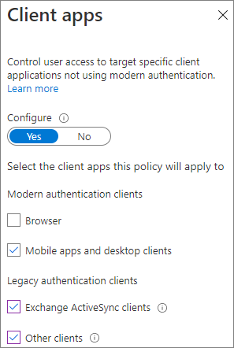

# Creare un ambiente di condivisione guest sicuroCreate a secure guest sharing environment

In questo articolo verranno descritte varie opzioni per la creazione di un ambiente di condivisione guest sicuro in Microsoft 365.In this article, we'll walk through a variety of options for creating a secure guest sharing environment in Microsoft 365. Si tratta di esempi pensati per offrire una panoramica delle opzioni disponibili.These are examples to give you an idea of the options available. È possibile usare queste procedure in diverse combinazioni per soddisfare le esigenze di sicurezza e conformità della propria organizzazione.You can use these procedures in different combinations to meet the security and compliance needs of your organization.

In questo articolo sono inclusi gli argomenti seguenti:This article includes:

- Configurazione dell'autenticazione a più fattori per i guest.Setting up multi-factor authentication for guests.
- Configurazione di condizioni per l'utilizzo per gli utenti guest.Setting up a terms of use for guests.
- Configurazione di verifiche trimestrali dell'accesso guest per controllare periodicamente se per gli utenti guest continuano a essere necessarie autorizzazioni per team e siti.Setting up quarterly guest access reviews to periodically validate whether guests continue to need permissions to teams and sites.
- Limitazione degli utenti guest all'accesso solo Web per i dispositivi non gestiti.Restricting guests to web-only access for unmanaged devices.
- Configurazione di criteri di timeout della sessione per assicurarsi che gli utenti guest eseguano l'autenticazione quotidianamente.Configuring a session timeout policy to ensure guests authenticate daily.
- Creazione di un tipo di informazioni sensibili per un progetto estremamente riservato.Creating a sensitive information type for a highly sensitive project.
- Assegnazione automatica di un'etichetta di riservatezza ai documenti che contengono un tipo di informazioni sensibili.Automatically assigning a sensitivity label to documents that contain a sensitive information type.
- Rimozione automatica dell'accesso guest dai file con un'etichetta di riservatezza.Automatically removing guest access from files with a sensitivity label.

Alcune delle opzioni descritte in questo articolo richiedono che i guest abbiano un account in Azure Active Directory.Some of the options discussed in this article require guests to have an account in Azure Active Directory. Per fare in modo che gli utenti guest siano inclusi nella directory quando si condividono con loro file e cartelle, usare l'[anteprima dell'integrazione di SharePoint e OneDrive con Azure AD B2B](/sharepoint/sharepoint-azureb2b-integration-preview).To ensure that guests are included in the directory when you share files and folders with them, use the [SharePoint and OneDrive integration with Azure AD B2B Preview](/sharepoint/sharepoint-azureb2b-integration-preview).

Si noti che in questo articolo non verranno illustrate le impostazioni per l'abilitazione della condivisione guest.Note that we won't discuss enabling guest sharing settings in this article. Per informazioni dettagliate su come abilitare la condivisione guest per scenari diversi, vedere [Collaborare con utenti esterni all'organizzazione](collaborate-with-people-outside-your-organization.md).See [Collaborating with people outside your organization](collaborate-with-people-outside-your-organization.md) for details about enabling guest sharing for different scenarios.

## Configurare l'autenticazione a più fattori per gli utenti guestSet up multi-factor authentication for guests

L'autenticazione a più fattori riduce notevolmente la possibilità di compromissione di un account.Multi-factor authentication greatly reduces the chances of an account being compromised. Dal momento che gli utenti guest possono usare account di posta elettronica personali che non aderiscono a criteri di governance o procedure consigliate, richiedere l'autenticazione a più fattori per gli utenti guest è particolarmente importante.Since guests may be using personal email accounts that don't adhere to any governance policies or best practices, it's especially important to require multi-factor authentication for guests. Qualora il nome utente e la password di un utente guest fossero rubati, l'uso di un secondo fattore di autenticazione ridurrebbe notevolmente le possibilità che soggetti sconosciuti possano accedere ai siti e ai file dell'utente.If a guest's username and password is stolen, requiring a second factor of authentication greatly reduces the chances of unknown parties gaining access to your sites and files.

In questo esempio verrà configurata l'autenticazione a più fattori per gli utenti guest usando criteri di accesso condizionale in Azure Active Directory.In this example, we'll set up multi-factor authentication for guests by using a conditional access policy in Azure Active Directory.

Per configurare l'autenticazione a più fattori per i guestTo set up multi-factor authentication for guests

1. Passare a [Criteri di accesso condizionale di Azure](https://portal.azure.com/#blade/Microsoft_AAD_IAM/ConditionalAccessBlade).Go to [Azure conditional access policies](https://portal.azure.com/#blade/Microsoft_AAD_IAM/ConditionalAccessBlade).
2. Nel pannello **Accesso condizionale - Criteri** fare clic su **Nuovi criteri**.On the **Conditional Access | Policies** blade, click **New policy**.
3. Digitare un nome nel campo **Nome**.In the **Name** field, type a name.
4. In **Assegnazioni** fare clic su **Utenti e gruppi**.Under **Assignments**, click **Users and groups**.
5. Nel pannello **Utenti e gruppi**, scegliere **Seleziona utenti e gruppi**, quindi la casella di controllo **Tutti gli utenti guest ed esterni**.On the **Users and groups** blade, select **Select users and groups**, select the **All guests and external users** check box.
6. In **Assegnazioni** fare clic su **Applicazioni cloud o azioni**.Under **Assignments**, click **Cloud apps or actions**.
7. Nel pannello **App cloud o azioni**, selezionare **Tutte le app cloud** nella scheda **Includi**.On the **Cloud apps or actions** blade, select **All cloud apps** on the **Include** tab.
8. In **Controlli di accesso** fare clic su **Concedi**.Under **Access controls**, click **Grant**.
9. Nel pannello **Concedi** selezionare la casella di controllo **Richiedi autenticazione a più fattori** e quindi fare clic su **Seleziona**.On the **Grant** blade, select the **Require multi-factor authentication** check box, and then click **Select**.
10. Nel pannello **Nuovo**, in **Abilita criterio** fare clic su **Sì** e quindi su **Crea**.On the **New** blade, under **Enable policy**, click **On**, and then click **Create**.

Ora gli utenti guest dovranno effettuare la registrazione all'autenticazione a più fattori per poter accedere a team, siti o contenuti condivisi.Now, guest will be required to enroll in multi-factor authentication before they can access shared content, sites, or teams.

### Altre informazioniMore information

[Pianificare la distribuzione dell’autenticazione a più fattori di Azure ADPlanning an Azure AD Multi-Factor Authentication deployment](/azure/active-directory/authentication/howto-mfa-getstarted)

## Configurare un documento di condizioni per l'utilizzo per gli utenti guestSet up a terms of use for guests

In alcune situazioni, gli utenti guest potrebbero non aver firmato accordi di non divulgazione o altri accordi legali con l'organizzazione.In some situations guests may not have signed non-disclosure agreements or other legal agreements with your organization. Si può richiedere ai guest di accettare le condizioni per l'utilizzo prima di accedere ai file che sono stati condivisi con loro.You can require guests to agree to a terms of use before accessing files that are shared with them. Le condizioni per l'utilizzo possono essere visualizzate al primo tentativo di accesso a un file o a un sito condiviso.The terms of use can be displayed the first time they attempt to access a shared file or site.

Per creare le condizioni di utilizzo, è necessario prima di tutto creare il documento in Word o in un'altra applicazione e quindi salvarlo come file PDF. Il file verrà quindi caricato in Azure AD.To create a terms of use, you first need to create the document in Word or another authoring program, and then save it as a .pdf file. This file can then be uploaded to Azure AD.

Per creare un documento di condizioni per l'utilizzo di Azure ADTo create an Azure AD terms of use

1. Accedere ad Azure come amministratore globale, amministratore della sicurezza o amministratore di accesso condizionale.Sign in to Azure as a Global Administrator, Security Administrator, or Conditional Access Administrator.
2. Passare a [Condizioni per l'utilizzo](https://aka.ms/catou).Navigate to [Terms of use](https://aka.ms/catou).
3. Fare clic su **Nuove condizioni**.Click **New terms**.

   

4. Compilare i campi **Nome** e **Nome visualizzato**.Type a **Name** and **Display name**.
6. Per **Documento sulle Condizioni per l'utilizzo** passare al file PDF creato e selezionarlo.For **Terms of use document**, browse to the pdf file that you created and select it.
7. Selezionare la lingua per il documento delle condizioni per l'utilizzo.Select the language for your terms of use document.
8. Impostare **Richiedi agli utenti di espandere le Condizioni per l'utilizzo** su **Attivata**.Set **Require users to expand the terms of use** to **On**.
9. In **Accesso condizionale**, nell'elenco **Applica con i modelli di criteri per l'accesso condizionale** scegliere **Crea criteri di accesso condizionale in seguito**.Under **Conditional Access**, in the **Enforce with Conditional Access policy template** list choose **Create conditional access policy later**.
10. Fare clic su **Crea**.Click **Create**.

Dopo aver creato le condizioni per l'utilizzo, il passaggio successivo consiste nel creare criteri di accesso condizionale che mostrano il documento agli utenti guest.Once you've created the terms of use, the next step is to create a conditional access policy that displays the terms of use to guests.

Per creare i criteri di accesso condizionaleTo create a conditional access policy

1. Passare a [Criteri di accesso condizionale di Azure](https://portal.azure.com/#blade/Microsoft_AAD_IAM/ConditionalAccessBlade).Go to [Azure conditional access policies](https://portal.azure.com/#blade/Microsoft_AAD_IAM/ConditionalAccessBlade).
2. Nel pannello **Accesso condizionale - Criteri** fare clic su **Nuovi criteri**.On the **Conditional Access | Policies** blade, click **New policy**.
3. Digitare un nome nella casella **Nome**.In the **Name** box, type a name.
4. In **Assegnazioni** fare clic su **Utenti e gruppi**.Under **Assignments**, click **Users and groups**.
5. Nel pannello **Utenti e gruppi**, scegliere **Seleziona utenti e gruppi**, quindi la casella di controllo **Tutti gli utenti guest ed esterni**.On the **Users and groups** blade, select **Select users and groups**, select the **All guests and external users** check box.
6. In **Assegnazioni** fare clic su **Applicazioni cloud o azioni**.Under **Assignments**, click **Cloud apps or actions**.
7. Nella scheda **Includi** scegliere **Seleziona le app** e quindi fare clic su **Seleziona**.On the **Include** tab, select **Select apps**, and then click **Select**.
8. Nel pannello **Seleziona** scegliere **Microsoft Teams**, **Office 365 SharePoint Online** e **Outlook Groups**, quindi fare clic su **Seleziona**.On the **Select** blade, select **Microsoft Teams**, **Office 365 SharePoint Online**, and **Outlook Groups**, and then click **Select**.
9. In **Controlli di accesso** fare clic su **Concedi**.Under **Access controls**, click **Grant**.
10. Nel pannello **Concedi** selezionare **Condizioni per l'utilizzo guest** e quindi fare clic su **Seleziona**.On the **Grant** blade, select **Guest terms of use**, and then click **Select**.
11. Nel pannello **Nuovo**, in **Abilita criterio** fare clic su **Sì** e quindi su **Crea**.On the **New** blade, under **Enable policy**, click **On**, and then click **Create**.

Ora, la prima volta che un utente guest tenterà di accedere al contenuto, a un team o a un sito dell'organizzazione, dovrà accettare le condizioni per l'utilizzo.Now, the first time a guest attempts to access content or a team or site in your organization, they will be required to accept the terms of use.

> [!NOTE]
> L'uso dell’accesso condizionale richiede una licenza di Azure AD Premium P1.Using Conditional Access requires an Azure AD Premium P1 license. Per altre informazioni, vedere [Cos’è l’accesso condizionale](/azure/active-directory/conditional-access/overview).For more information, see [What is Conditional Access](/azure/active-directory/conditional-access/overview).

### Ulteriori informazioniMore information

[Condizioni per l'utilizzo di Azure Active DirectoryAzure Active Directory terms of use](/azure/active-directory/conditional-access/terms-of-use)

## Configurare le verifiche di accesso per gli utenti guestSet up guest access reviews

Le verifiche di accesso in Azure AD consentono di automatizzare una revisione periodica dell'accesso degli utenti a diversi team e gruppi.With access reviews in Azure AD, you can automate a periodic review of user access to various teams and groups. Richiedendo una verifica di accesso per gli utenti guest, ci si può assicurare che questi ultimi non mantengano l'accesso alle informazioni riservate dell'organizzazione più a lungo del necessario.By requiring an access review for guests specifically, you can help ensure guests do not retain access to your organization's sensitive information for longer than is necessary.

Per configurare una verifica di accesso per gli utenti guestTo set up a guest access review

1. Nel menu a sinistra della pagina [Identity Governance](https://portal.azure.com/#blade/Microsoft_AAD_ERM/DashboardBlade) fare clic su **Verifiche di accesso**.On the [Identity Governance page](https://portal.azure.com/#blade/Microsoft_AAD_ERM/DashboardBlade), in the left menu, click **Access reviews**.
2. Fare clic su **Nuova verifica di accesso**.Click **New access review**.
3. Scegliere l’opzione **Team + Gruppi**.Choose the **Teams + Groups** option.
4. Scegliere l’opzione **Tutti i gruppi di Microsoft 365 con utenti guest**.Choose the **All Microsoft 365 groups with guest users** option. Fare clic su **Seleziona gruppi da escludere** per escludere eventuali gruppi.Click **Select group(s) to exclude** if you want to exclude any groups.
5. Scegliere l’opzione **Solo utenti guest** e quindi fare clic su **Avanti: Verifiche**.Choose the **Guest users only** option, and then click **Next: Reviews**.
6. In **Seleziona revisori** scegliere **Proprietari del gruppo**.Under **Select reviewers**, choose **Group Owner(s)**.
7. Fare clic su **Seleziona revisori di fallback**, scegliere i revisori di fallback e quindi fare clic su **Seleziona**.Click **Select fallback reviewers**, choose who should be the fallback reviewers, and then click **Select**.
8. In **Specificare la ricorrenza della revisione** scegliere **Trimestrale**.Under **Specify recurrence of review**, choose **Quarterly**.
9. Selezionare una data di inizio e una durata.Select a start date and duration.
10. Per **Fine** scegliere **Mai** e quindi fare clic su **Avanti: Impostazioni**.For **End**, choose **Never**, and then click **Next: Settings**.

    

11. Nella scheda **Impostazioni** rivedere le impostazioni di conformità alle regole aziendali.On the **Settings** tab, review the settings for compliance with your business rules.

    

12. Fare clic su **Avanti: Rivedi + Crea**.Click **Next: Review + Create**.
13. Digitare un **Nome verifica** e rivedere le impostazioni.Type a **Review name** and review the settings.
14. Fare clic su **Crea**.Click **Create**.

È importante tenere presente che è possibile concedere ai guest l'accesso a team o gruppi oppure a singoli file e cartelle.It's important to note that guests can be given access to teams or groups, or to individual files and folders. Quando si fornisce loro l'accesso a file e cartelle, gli utenti guest possono anche non far parte di un gruppo specifico.When given access to files and folders, guests may not be added to any particular group. Se si vogliono eseguire verifiche di accesso sugli utenti guest che non appartengono a un team o a un gruppo, è possibile creare un gruppo dinamico in Azure AD per includere tutti gli utenti guest e quindi creare una verifica di accesso per tale gruppo.If you want to do access reviews on guests who don't belong to a team or group, you can create a dynamic group in Azure AD to contain all guests and then create an access review for that group. I proprietari dei siti possono anche gestire la [scadenza dei guest per il sito](https://support.microsoft.com/office/25bee24f-42ad-4ee8-8402-4186eed74dea)Site owners can also manage [guest expiration for the site](https://support.microsoft.com/office/25bee24f-42ad-4ee8-8402-4186eed74dea)

### Ulteriori informazioniMore information

[Gestire l'accesso guest con le verifiche di accesso di Azure ADManage guest access with Azure AD access reviews](/azure/active-directory/governance/manage-guest-access-with-access-reviews)

[Creare una verifica di accesso di gruppi o applicazioni nelle verifiche di accesso di Azure ADCreate an access review of groups or applications in Azure AD access reviews](/azure/active-directory/governance/create-access-review)

## Configurare l'accesso solo Web per gli utenti guestSet up web-only access for guests

Richiedendo agli utenti guest di accedere ai team, ai siti e ai file solo tramite un Web browser, è possibile ridurre la superficie di attacco e semplificare l'amministrazione.You can reduce your attack surface and ease administration by requiring guests to access your teams, sites, and files by using a web browser only.

Per i gruppi di Microsoft 365 e Teams, si usano i criteri di accesso condizionale di Azure AD.For Microsoft 365 Groups and Teams, this is done with an Azure AD conditional access policy. Per SharePoint, la configurazione si esegue nell'interfaccia di amministrazione di SharePoint.For SharePoint, this is configured in the SharePoint admin center. È anche possibile [usare le etichette di riservatezza per limitare gli utenti guest all'accesso solo Web](../compliance/sensitivity-labels-teams-groups-sites.md).(You can also [use sensitivity labels to restrict guests to web-only access](../compliance/sensitivity-labels-teams-groups-sites.md).)

Per limitare agli utenti guest l’accesso solo Web per gruppi e team:To restrict guests to web-only access for Groups and Teams:

1. Passare a [Criteri di accesso condizionale di Azure](https://portal.azure.com/#blade/Microsoft_AAD_IAM/ConditionalAccessBlade).Go to [Azure conditional access policies](https://portal.azure.com/#blade/Microsoft_AAD_IAM/ConditionalAccessBlade).
2. Nel pannello **Accesso condizionale - Criteri** selezionare **Nuovi criteri**.On the **Conditional Access - Policies** blade, click **New policy**.
3. Digitare un nome nella casella **Nome**.In the **Name** box, type a name.
4. In **Assegnazioni** fare clic su **Utenti e gruppi**.Under **Assignments**, click **Users and groups**.
5. Nel pannello **Utenti e gruppi**, scegliere **Seleziona utenti e gruppi**, quindi la casella di controllo **Tutti gli utenti guest ed esterni**.On the **Users and groups** blade, select **Select users and groups**, select the **All guests and external users** check box.
6. In **Assegnazioni** fare clic su **Applicazioni cloud o azioni**.Under **Assignments**, click **Cloud apps or actions**.
7. Nella scheda **Includi** scegliere **Seleziona le app** e quindi fare clic su **Seleziona**.On the **Include** tab, select **Select apps**, and then click **Select**.
8. Nel pannello **Seleziona** scegliere **Microsoft Teams**, e **Outlook Groups**, quindi fare clic su **Seleziona**.On the **Select** blade, select **Microsoft Teams** and **Outlook Groups**, and then click **Select**.
9. In **Assegnazioni** fare clic su **Condizioni**.Under **Assignments**, click **Conditions**.
10. Nel pannello **Condizioni** fare clic su **App client**.On the **Conditions** blade, click **Client apps**.
11. Nel pannello **App client** fare clic su **Sì** per **Configura** e quindi selezionare le impostazioni **App per dispositivi mobili e client desktop** e **Client Exchange ActiveSync** e **Altri client**.On the **Client apps** blade, click **Yes** for **Configure**, and then select the **Mobile apps and desktop clients**, **Exchange ActiveSync clients**, and **Other clients** settings. Deselezionare la casella di controllo **Browser**.Clear the **Browser** check box.

    

12. Fare clic su **Fatto**.Click **Done**.
13. In **Controlli di accesso** fare clic su **Concedi**.Under **Access controls**, click **Grant**.
14. Nel pannello **Concedi** selezionare **Richiedi che i dispositivi siano contrassegnati come conformi** e **Richiedi dispositivo aggiunto ad Azure AD ibrido**.On the **Grant** blade, select **Require device to be marked as compliant** and **Require Hybrid Azure AD joined device**.
15. In **Per più controlli** selezionare **Richiedi uno dei controlli selezionati** e quindi fare clic su **Seleziona**.Under **For multiple controls**, select **Require one of the selected controls**, and then click **Select**.
16. Nel pannello **Nuovo**, in **Abilita criterio** fare clic su **Sì** e quindi su **Crea**.On the **New** blade, under **Enable policy**, click **On**, and then click **Create**.

Per limitare i guest al solo accesso Web per SharePointTo restrict guests to web-ony access for SharePoint

1. Nell'[interfaccia di amministrazione di SharePoint](https://admin.microsoft.com/sharepoint) espandere **Criteri** e quindi fare clic su **Controllo di accesso**.In the [SharePoint admin center](https://admin.microsoft.com/sharepoint), expand **Policies** and click **Access control**.
2. Fare clic su **Dispositivi non gestiti**.Click **Unmanaged devices**.
3. Selezionare l'opzione di **Consenti l'accesso limitato, solo sul Web** e quindi fare clic su **Salva**.Select the **Allow limited, web-only access** option, and then click **Save**.

Si noti che questa impostazione nell'interfaccia di amministrazione di SharePoint crea un criterio di accesso condizionale di supporto in Azure AD.Note that this setting in the SharePoint admin center creates a supporting conditional access policy in Azure AD.

## Configurare un criterio di timeout della sessione per gli utenti guestConfigure a session timeout for guests

Richiedere agli utenti guest di eseguire l'autenticazione a intervalli regolari può ridurre la possibilità che utenti sconosciuti accedano al contenuto dell'organizzazione se il dispositivo di un utente guest non è protetto.Requiring guests to authenticate on a regular basis can reduce the possibility of unknown users accessing your organization's content if a guest's device isn't kept secure. È possibile configurare un criterio di accesso condizionale di timeout della sessione per gli utenti guest in Azure AD.You can configure a session timeout conditional access policy for guests in Azure AD.

Per configurare un criterio di timeout della sessione guestTo configure a guest session timeout policy

1. Passare a [Criteri di accesso condizionale di Azure](https://portal.azure.com/#blade/Microsoft_AAD_IAM/ConditionalAccessBlade).Go to [Azure conditional access policies](https://portal.azure.com/#blade/Microsoft_AAD_IAM/ConditionalAccessBlade).
2. Nel pannello **Accesso condizionale - Criteri** selezionare **Nuovi criteri**.On the **Conditional Access - Policies** blade, click **New policy**.
3. Nella casella **Nome** digitare *Timeout sessioni guest*.In the **Name** box, type *Guest session timeout*.
4. In **Assegnazioni** fare clic su **Utenti e gruppi**.Under **Assignments**, click **Users and groups**.
5. Nel pannello **Utenti e gruppi**, scegliere **Seleziona utenti e gruppi**, quindi la casella di controllo **Tutti gli utenti guest ed esterni**.On the **Users and groups** blade, select **Select users and groups**, select the **All guests and external users** check box.
6. In **Assegnazioni** fare clic su **Applicazioni cloud o azioni**.Under **Assignments**, click **Cloud apps or actions**.
7. Nella scheda **Includi** scegliere **Seleziona le app** e quindi fare clic su **Seleziona**.On the **Include** tab, select **Select apps**, and then click **Select**.
8. Nel pannello **Seleziona** scegliere **Microsoft Teams**, **Office 365 SharePoint Online** e **Outlook Groups**, quindi fare clic su **Seleziona**.On the **Select** blade, select **Microsoft Teams**, **Office 365 SharePoint Online**, and **Outlook Groups**, and then click **Select**.
9. In **Controlli di accesso** fare clic su **Sessione**.Under **Access controls**, click **Session**.
10. Nel pannello **Sessione** selezionare **Frequenza di accesso**.On the **Session** blade, select **Sign-in frequency**.
11. Selezionare **1** e **Giorni** per il periodo di tempo e quindi fare clic su **Seleziona**.Select **1** and **Days** for the time period, and then click **Select**.
12. Nel pannello **Nuovo**, in **Abilita criterio** fare clic su **Sì** e quindi su **Crea**.On the **New** blade, under **Enable policy**, click **On**, and then click **Create**.

## Creare un tipo di informazioni sensibili per un progetto estremamente riservatoCreate a sensitive information type for a highly sensitive project

I tipi di informazioni sensibili sono stringhe predefinite che è possibile usare nei flussi di lavoro dei criteri per applicare i requisiti di conformità.Sensitive information types are predefined strings that can be used in policy workflows to enforce compliance requirements. Il Centro conformità di Microsoft 365 include oltre 100 tipi di informazioni sensibili, tra cui numeri di patente, numeri di carta di credito, numeri di conto corrente bancario e così via.The Microsoft 365 Compliance Center comes with over one hundred sensitive information types, including driver's license numbers, credit card numbers, bank account numbers, etc.

È possibile creare tipi personalizzati di informazioni sensibili per facilitare la gestione di contenuto specifico dell'organizzazione.You can create custom sensitive information types to help manage content specific to your organization. In questo esempio verrà creato un tipo di informazioni sensibili personalizzato per un progetto estremamente riservato.In this example, we'll create a custom sensitive information type for a highly sensitive project. Si potrà poi usare questo tipo di informazioni sensibili per applicare automaticamente un'etichetta di riservatezza.We can then use this sensitive information type to automatically apply a sensitivity label.

Per creare un tipo di informazioni sensibiliTo create a sensitive information type

1. Nel riquadro di spostamento sinistro del [Centro conformità Microsoft 365](https://compliance.microsoft.com) espandere **Classificazione** e quindi fare clic su **Tipi di informazioni sensibili**.In the [Microsoft 365 Compliance Center](https://compliance.microsoft.com), in the left navigation, expand **Classification**, and then click **Sensitive info types**.
2. Fare clic su **Crea**.Click **Create**.
3. Per **Nome** e **Descrizione** digitare **Progetto Saturno** e quindi fare clic su **Avanti**.For **Name** and **Description**, type **Project Saturn**, and then click **Next**.
4. Fare clic su **Aggiungere un elemento**.Click **Add an element**.
5. Nell'elenco **Rilevare il contenuto che contiene** selezionare **Parole chiave** e quindi digitare *Progetto Saturno* nella casella delle parole chiave.On the **Detect content containing** list, select **Keywords**, and then type *Project Saturn* in the keyword box.
6. Fare clic su **Avanti** e quindi su **Fine**.Click **Next**, and then click **Finish**.
7. Se viene chiesto se si vuole testare il tipo di informazioni sensibili, fare clic su **No**.If asked if you would like to test the sensitive information type, click **No**.

### Altre informazioniMore information

[Tipi di informazioni sensibili personalizzatiCustom sensitive information types](/Office365/SecurityCompliance/custom-sensitive-info-types)

## Creare un criterio di applicazione automatica di etichette per assegnare un'etichetta di riservatezza in base a un tipo di informazioni sensibiliCreate an auto-labeling policy to assign a sensitivity label based on a sensitive information type

Se nell'organizzazione si usano etichette di riservatezza, è possibile applicare automaticamente un'etichetta ai file che contengono tipi di informazioni sensibili definiti.If you are using sensitivity labels in your organization, you can automatically apply a label to files that contain defined sensitive information types. 

Per creare un criterio di applicazione automatica di etichetteTo create an auto-labeling policy

1. Aprire l'interfaccia di amministrazione di [Conformità Microsoft 365](https://compliance.microsoft.com).Open the [Microsoft 365 compliance admin center](https://compliance.microsoft.com).
2. Nel riquadro di spostamento sinistro fare clic su **Protezione delle informazioni**.In the left navigation, click **Information protection**.
3. Nella scheda **Etichettatura automatica** fare clic su **Crea un criterio di applicazione delle etichette automatica**.On the **Auto-labeling** tab, click **Create auto-labeling policy**.
4. Nella pagina **Scegli le informazioni a cui applicare questa etichetta** scegliere **Personalizza** e quindi fare clic su **Avanti**.On the **Choose info you want this label applied to** page, choose **Custom** and click **Next**.
5. Digitare un nome e una descrizione per il criterio e fare clic su **Avanti**.Type a name and description for the policy and click **Next**.
6. Nella pagina **Scegli le posizioni in cui applicare l'etichetta** attivare **Siti di SharePoint** e quindi fare clic su **Scegli siti**.On the **Choose locations where you want to apply the label** page, turn on **SharePoint sites** and click **Choose sites**.
7. Aggiungere gli URL per i siti in cui si vuole attivare l'etichettatura automatica e quindi fare clic su **Fatto**.Add the URLs for the sites where you want to turn on auto-labeling and click **Done**.
8. Fare clic su **Avanti**.Click **Next**.
9. Nella pagina **Configura regole comuni o avanzate** scegliere **Regole comuni** e quindi fare clic su **Avanti**.On the **Set up common or advanced rules** page, choose **Common rules** and click **Next**.
10. Nella pagina **Definisci le regole per i contenuti di tutte le posizioni** fare clic su **Nuova regola**.On the **Define rules for content in all locations** page, click **New rule**.
11. Nella pagina **Nuova regola** assegnare un nome alla regola, fare clic su **Aggiungi condizione** e quindi fare clic su **Il contenuto contiene tipi di informazioni sensibili**.On the **New rule** page, give the rule a name, click **Add condition**, and then click **Content contains sensitive info types**.
12. Fare clic su **Aggiungi**, selezionare **Tipi di informazioni sensibili**, scegliere i tipi di informazioni sensibili da usare, fare clic su **Aggiungi** e quindi fare clic su **Salva**.Click **Add**, click **Sensitive info types**, choose the sensitive info types that you want to use, click **Add**, and then click **Save**.
13. Fare clic su **Avanti**.Click **Next**.
14. Fare clic su **Scegliere un'etichetta**, selezionare l'etichetta da usare e quindi fare clic su **Aggiungi**.Click **Choose a label**, select the label you want to use, and then click **Add**.
15. Fare clic su **Avanti**.Click **Next**.
16. Lasciare il criterio in modalità di simulazione e fare clic su **Avanti**.Leave the policy in simulation mode and click **Next**.
17. Fare clic su **Crea criterio** e quindi su **Fatto**.Click **Create policy**, and then click **Done**.

Una volta impostato il criterio, se un utente digita "Progetto Saturno" in un documento, il criterio applicherà automaticamente l'etichetta specificata quando analizza il file.With the policy in place, when a user types "Project Saturn" into a document, the auto-labeling policy will automatically apply the specified label when it scans the file.

### Altre informazioniMore information

[Applicare automaticamente un'etichetta di riservatezza al contenutoApply a sensitivity label to content automatically](../compliance/apply-sensitivity-label-automatically.md)

## Creare un criterio DLP per rimuovere l'accesso guest ai file estremamente riservatiCreate a DLP policy to remove guest access to highly sensitive files

È possibile usare [prevenzione della perdita dei dati (DLP)](../compliance/dlp-learn-about-dlp.md) per impedire la condivisione indesiderata di contenuto riservato da parte dei guest.You can use [data loss prevention (DLP)](../compliance/dlp-learn-about-dlp.md) to prevent unwanted guest sharing of sensitive content. La prevenzione della perdita dei dati può intervenire sulla base dell'etichetta di riservatezza di un file e rimuovere l'accesso guest.Data loss prevention can take action based on a file's sensitivity label and remove guest access.

Per creare una regola DLPTo create a DLP rule

1. Nell'interfaccia di amministrazione di Conformità Microsoft 365 passare alla pagina [Prevenzione della perdita dei dati](https://compliance.microsoft.com/datalossprevention).In the Microsoft 365 compliance admin center, go to the [Data loss prevention page](https://compliance.microsoft.com/datalossprevention).
2. Fare clic su **Crea criterio**.Click **Create policy**.
3. Scegliere **Personalizzato** e quindi fare clic su **Avanti**.Choose **Custom** and click **Next**.
4. Digitare un nome per il criterio, quindi fare clic su **Avanti**.Type a name for the policy and click **Next**.
5. Nella pagina **Posizioni in cui applicare il criterio** disattivare tutte le impostazioni tranne **Siti di SharePoint** e **Account di OneDrive**, quindi fare clic su **Avanti**.On the **Locations to apply the policy** page turn off all settings except **SharePoint sites** and **OneDrive accounts**, and then click **Next**.
6. Nella pagina **Definire le impostazioni dei criteri** fare clic su **Avanti**.On the **Define policy settings** page, click **Next**.
7. Nella pagina **Personalizzare regole avanzate di prevenzione della perdita dei dati** fare clic su **Crea regola** e digitare un nome per la regola.On the **Customize advanced DLP rules** page, click **Create rule** and type a name for the rule.
8. In **Condizioni** fare clic su **Aggiungi condizione** e scegliere **Il contenuto include**.Under **Conditions**, click **Add condition**, and choose **Content contains**.
9. Fare clic su **Aggiungi**, scegliere **Etichette di riservatezza**, scegliere le etichette da usare e fare clic su **Aggiungi**.Click **Add**, choose **Sensitivity labels**, choose the labels you want to use, and click **Add**.

   

10. In **Azioni** fare clic su **Aggiungi azione** e scegliere **Limita l'accesso o crittografa il contenuto nelle posizioni di Microsoft 365**.Under **Actions** click **Add an action** and choose **Restrict access or encrypt the content in Microsoft 365 locations**.
11. Selezionare la casella di controllo **Limita l'accesso o crittografa il contenuto nelle posizioni di Microsoft 365** e quindi scegliere l'opzione **Solo le persone esterne all'organizzazione**.Select the **Restrict access or encrypt the content in Microsoft 365 locations** check box and then choose the **Only people outside your organization** option.

      

12. Fare clic su **Salva**, quindi su **Avanti**.Click **Save** and then click **Next**.
13. Scegliere le opzioni di test e fare clic su **Avanti**.Choose your test options and click **Next**.
14. Fare clic su **Invia**, quindi su **Fatto**.Click **Submit**, and then click **Done**.

È importante notare che il criterio non rimuove l'accesso se il guest è membro del sito o del team nel suo complesso.It's important to note that this policy doesn't remove access if the guest is a member of the site or team as a whole. Se si prevede di avere documenti estremamente riservati in un sito o in un team con utenti guest, è consigliabile usare [canali privati in Teams](https://support.microsoft.com/office/de3e20b0-7494-439c-b7e5-75899ebe6a0e) e consentire l'accesso ai canali privati solo ai membri dell'organizzazione.If you plan to have highly sensitive documents in a site or team with guest members, consider using [private channels in Teams](https://support.microsoft.com/office/de3e20b0-7494-439c-b7e5-75899ebe6a0e) and only allowing members of your organization in the private channels.

## Opzioni aggiuntiveAdditional options

Sono disponibili delle opzioni aggiuntive in Microsoft 365 e Azure Active Directory che possono aiutare a proteggere l'ambiente di condivisione guest.There are some additional options in Microsoft 365 and Azure Active Directory that can help secure your guest sharing environment.

- È possibile creare un elenco di domini di condivisione consentiti o rifiutati per limitare le persone con cui gli utenti possono condividere contenuti.You can create a list of allowed or denied sharing domains to limit who users can share with. Per altre informazioni, vedere [Limitare la condivisione di contenuti di SharePoint e OneDrive per dominio](/sharepoint/restricted-domains-sharing) e [Consentire o bloccare gli inviti per gli utenti B2B da organizzazioni specifiche](/azure/active-directory/b2b/allow-deny-list).See [Restrict sharing of SharePoint and OneDrive content by domain](/sharepoint/restricted-domains-sharing) and [Allow or block invitations to B2B users from specific organizations](/azure/active-directory/b2b/allow-deny-list) for more information.
- È possibile porre limiti agli altri tenant di Azure Active Directory a cui gli utenti possono connettersi.You can limit which other Azure Active Directory tenants your users can connect to. Per informazioni, vedere [Utilizzare le restrizioni del tenant per gestire l'accesso alle applicazioni cloud SaaS](/azure/active-directory/manage-apps/tenant-restrictions).See [Use tenant restrictions to manage access to SaaS cloud applications](/azure/active-directory/manage-apps/tenant-restrictions) for information.
- È possibile creare un ambiente gestito in cui i partner possano contribuire alla gestione degli account guest.You can create a managed environment where partners can help manage guest accounts. Per informazioni, vedere [Creare una Extranet B2B con guest gestiti](/Office365/Enterprise/b2b-extranet).See [Create a B2B extranet with managed guests](/Office365/Enterprise/b2b-extranet) for information.

## Vedere ancheSee Also

[Limitare l'esposizione accidentale ai file durante la condivisione con gli utenti guestLimit accidental exposure to files when sharing with guests](share-limit-accidental-exposure.md)

[Procedure consigliate per la condivisione di file e cartelle con utenti non autenticatiBest practices for sharing files and folders with unauthenticated users](best-practices-anonymous-sharing.md)

[Creare una Extranet B2B con guest gestiti](b2b-extranet.md).[Create a B2B extranet with managed guests](b2b-extranet.md)