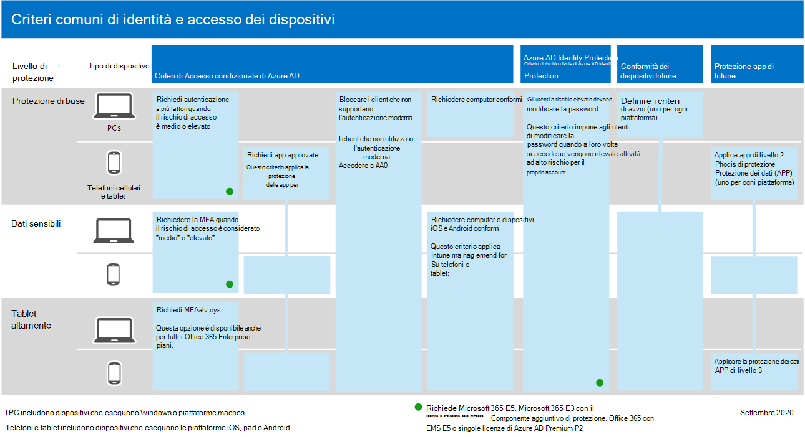

# Configurare le funzionalità di protezione dalle minacce tra Microsoft 365Configure threat protection capabilities across Microsoft 365

Seguire questa procedura per configurare la protezione dalle minacce Microsoft 365.Follow these steps to configure threat protection across Microsoft 365.

## Passaggio 1: Configurare l'autenticazione a più fattori e i criteri di accesso condizionaleStep 1: Set up multi-factor authentication and Conditional Access policies

[L'autenticazione a più](/azure/active-directory/authentication/concept-mfa-howitworks) fattori richiede agli utenti di verificare la propria identità con una chiamata telefonica o un'app di autenticazione.[Multi-factor authentication](/azure/active-directory/authentication/concept-mfa-howitworks) (MFA) requires users to verify their identity with a phone call or an authenticator app. [I criteri di accesso](/azure/active-directory/conditional-access/overview) condizionale definiscono determinati requisiti che devono essere soddisfatti per consentire agli utenti di accedere alle app e ai dati in Microsoft 365.[Conditional access policies](/azure/active-directory/conditional-access/overview) define certain requirements that must be met in order for users to access apps and data in Microsoft 365. I criteri MFA e Accesso condizionale funzionano insieme per proteggere l'organizzazione.MFA and Conditional Access policies work together to protect your organization. Ad esempio, se un utente tenta di accedere da un dispositivo mobile utilizzando un account non abilitato per la MFA e un criterio di accesso condizionale richiede che l'autenticazione a più fattori sia attiva, l'utente non può eseguire l'accesso.For example, if someone attempts to sign in from a mobile device using an account that is not enabled for MFA, and a Conditional Access policy requires MFA to be in effect, that user is prevented from signing in.  

Microsoft ha testato e consigliato un set specifico di accesso condizionale e criteri correlati per proteggere l'accesso a tutte le applicazioni SaaS, in particolare Microsoft 365.Microsoft has tested and recommends a specific set of Conditional Access and related policies for protecting access to all of your SaaS applications, especially Microsoft 365. I criteri sono consigliati per la protezione di base, sensibile e altamente regolamentata.Policies are recommended for baseline, sensitive, and highly regulated protection. Iniziare implementando i criteri per la protezione di base.Begin by implementing the policies for baseline protection.

Vedere una versione più grande di questa 
 [immagine](https://github.com/MicrosoftDocs/microsoft-365-docs/raw/public/microsoft-365/media/microsoft-365-policies-configurations/identity-device-access-policies-byplan.png)
[See a larger version of this image](https://github.com/MicrosoftDocs/microsoft-365-docs/raw/public/microsoft-365/media/microsoft-365-policies-configurations/identity-device-access-policies-byplan.png)

### Per implementare la protezione di base per Microsoft 365To implement baseline protection for Microsoft 365

 

1. [Configurare i prerequisiti, incluso Azure AD Identity Protection.](../security/office-365-security/identity-access-prerequisites.md)[Configure prerequisites, including Azure AD Identity Protection](../security/office-365-security/identity-access-prerequisites.md).
2. [Configurare i criteri comuni di identità e accesso ai dispositivi](../security/office-365-security/identity-access-policies.md) per la protezione di base.[Configure common identity and device access policies](../security/office-365-security/identity-access-policies.md) for baseline protection.
3. Configurare i criteri per gli utenti [guest,](../security/office-365-security/identity-access-policies-guest-access.md) [Microsoft Teams,](../security/office-365-security/teams-access-policies.md) [Exchange Online](../security/office-365-security/secure-email-recommended-policies.md)e [SharePoint Online e OneDrive](../security/office-365-security/sharepoint-file-access-policies.md).Configure policies for [guest users](../security/office-365-security/identity-access-policies-guest-access.md), [Microsoft Teams](../security/office-365-security/teams-access-policies.md), [Exchange Online](../security/office-365-security/secure-email-recommended-policies.md), and [SharePoint Online and OneDrive](../security/office-365-security/sharepoint-file-access-policies.md).

### Ulteriori informazioni sulla protezione delle identitàMore information about protecting identities

- [Configurazioni di identità e accesso dei dispositiviIdentity and device access configurations](../security/office-365-security/microsoft-365-policies-configurations.md)
- [Indicazioni sulla sicurezza per Azure MFASecurity guidance for Azure MFA](/azure/active-directory/authentication/multi-factor-authentication-security-best-practices)

## Passaggio 2: Configurare Microsoft Defender per l'identitàStep 2: Configure Microsoft Defender for Identity

[Microsoft Defender for Identity](/defender-for-identity/what-is) è una soluzione di sicurezza basata sul cloud che funziona con i segnali di Servizi di dominio Active Directory (AD DS) locali per identificare, rilevare e analizzare minacce avanzate, identità compromesse e azioni insider dannose indirizzate all'organizzazione.[Microsoft Defender for Identity](/defender-for-identity/what-is) is a cloud-based security solution that works with your on-premises Active Directory Domain Services (AD DS) signals to identify, detect, and investigate advanced threats, compromised identities, and malicious insider actions directed at your organization.

Microsoft Defender for Identity consente agli analisti delle operazioni di sicurezza (SecOps) e ai professionisti della sicurezza che faticano a rilevare attacchi avanzati in ambienti ibridi per:Microsoft Defender for Identity enables security operations (SecOps) analysts and security professionals struggling to detect advanced attacks in hybrid environments to:

- Monitorare gli utenti, il comportamento delle entità e le attività con l'analisi basata sull'apprendimento.Monitor users, entity behavior, and activities with learning-based analytics.
- Proteggere le identità utente e le credenziali archiviate in Active Directory.Protect user identities and credentials stored in Active Directory.
- Identificare e analizzare le attività utente sospette e gli attacchi avanzati per tutta la kill chain.Identify and investigate suspicious user activities and advanced attacks throughout the kill chain.
- Fornire informazioni chiare sull'incidente in una sequenza temporale semplice per la valutazione veloce.Provide clear incident information on a simple timeline for fast triage.

### Per configurare Microsoft Defender per l'identitàTo set up Microsoft Defender for Identity

 

1. [Configurare Microsoft Defender for Identity per](/azure-advanced-threat-protection/install-atp-step1) proteggere gli ambienti principali.[Set up Microsoft Defender for Identity](/azure-advanced-threat-protection/install-atp-step1) to protect your primary environments.
2. Proteggere tutti i [controller di dominio e](/azure-advanced-threat-protection/atp-sensor-monitoring) le [foreste](/azure-advanced-threat-protection/atp-multi-forest).Protect all your [domain controllers](/azure-advanced-threat-protection/atp-sensor-monitoring) and [forests](/azure-advanced-threat-protection/atp-multi-forest).
3. Integrare [gli avvisi di Microsoft Defender for Identity](/azure-advanced-threat-protection/suspicious-activity-guide?tabs=external) nel flusso di lavoro delle operazioni di sicurezza (SecOps).Integrate [Microsoft Defender for Identity alerts](/azure-advanced-threat-protection/suspicious-activity-guide?tabs=external) into your security operations (SecOps) workflow.

### Altre informazioni su Microsoft Defender for IdentityMore information about Microsoft Defender for Identity

- [Che cosa è Microsoft Defender per identità?What is Microsoft Defender for Identity?](/azure-advanced-threat-protection/what-is-atp)
- [Video: Introduzione a Microsoft Defender for IdentityVideo: Introduction to Microsoft Defender for Identity](https://www.youtube.com/watch?reload=9&v=EGY2m8yU_KE)
- [Distribuzione di Microsoft Defender for IdentityMicrosoft Defender for Identity deployment](/azure-advanced-threat-protection/what-is-atp#whats-next)

## Passaggio 3: attivare Microsoft 365 DefenderStep 3: Turn on Microsoft 365 Defender

[Microsoft 365 Defender](../security/defender/microsoft-365-defender.md) combina i segnali e orchestra le funzionalità in un'unica soluzione.[Microsoft 365 Defender](../security/defender/microsoft-365-defender.md) combines signals and orchestrates capabilities into a single solution. Con la soluzione Microsoft 365 Defender integrata, i professionisti della sicurezza possono unire i segnali di minaccia che ognuno di questi prodotti riceve e determinare l'ambito completo e l'impatto della minaccia; come è entrato nell'ambiente, su cosa ne è interessato e su come attualmente influisce sull'organizzazione.With the integrated Microsoft 365 Defender solution, security professionals can stitch together the threat signals that each of these products receive and determine the full scope and impact of the threat; how it entered the environment, what it's affected, and how it's currently impacting the organization. Microsoft 365 Defender azioni automatiche per impedire o arrestare l'attacco e auto-sanare le cassette postali, gli endpoint e le identità degli utenti interessati.Microsoft 365 Defender takes automatic action to prevent or stop the attack and self-heal affected mailboxes, endpoints, and user identities.

Microsoft 365 Defender unifica avvisi, incidenti, indagini e risposte automatizzate e ricerca avanzata tra i carichi di lavoro (Microsoft Defender for Identity, Microsoft Defender for Office 365, Microsoft Defender for Endpoint e Microsoft Cloud App Security) in un unico riquadro di esperienza di vetro.Microsoft 365 Defender unifies alerts, incidents, automated investigation and response, and advanced hunting across workloads (Microsoft Defender for Identity, Microsoft Defender for Office 365, Microsoft Defender for Endpoint, and Microsoft Cloud App Security) into a single pane of glass experience. Le nuove funzionalità vengono aggiunte continuamente Microsoft 365 Defender; prendere in considerazione la possibilità di acconsentire esplicitamente alla ricezione delle funzionalità di anteprima.New features are added continually to Microsoft 365 Defender; consider opting in to receive preview features.

### Per configurare Microsoft 365 DefenderTo set up Microsoft 365 Defender

 

1. [Esaminare i prerequisiti](../security/defender/prerequisites.md).[Review the prerequisites](../security/defender/prerequisites.md).
2. [Attivare Microsoft 365 Defender](../security/defender/m365d-enable.md).[Turn on Microsoft 365 Defender](../security/defender/m365d-enable.md).
3. [Acconsentire esplicitamente alle funzionalità di anteprima.](../security/defender/preview.md)[Opt in for preview features](../security/defender/preview.md).

### Ulteriori informazioni su Microsoft 365 DefenderMore information about Microsoft 365 Defender

- [Che cos'è Microsoft 365 Defender?What is Microsoft 365 Defender?](../security/defender/microsoft-365-defender.md)
- [Novità di Microsoft 365 DefenderWhat's new in Microsoft 365 Defender](../security/defender/whats-new.md)

## Passaggio 4: Configurare Microsoft Defender per Office 365Step 4: Configure Microsoft Defender for Office 365

[Microsoft Defender per Office 365](../security/office-365-security/defender-for-office-365.md) protegge l'organizzazione da minacce dannose nei messaggi di posta elettronica (allegati e URL), Office documenti e strumenti di collaborazione.[Microsoft Defender for Office 365](../security/office-365-security/defender-for-office-365.md) safeguards your organization against malicious threats in email messages (attachments and URLs), Office documents, and collaboration tools. Nella tabella seguente sono elencate le funzionalità di Microsoft Defender Office 365 e le funzionalità incluse in Microsoft 365 E5:The following table lists Microsoft Defender for Office 365 features and capabilities that are included in Microsoft 365 E5:

 

****

|Funzionalità di configurazione, protezione e rilevamentoConfiguration, protection, and detection capabilities|Funzionalità di automazione, analisi, correzione ed istruzioneAutomation, investigation, remediation, and education capabilities|
|---|---|
|[Allegati sicuriSafe Attachments](../security/office-365-security/safe-attachments.md) 
 [Collegamenti sicuriSafe Links](../security/office-365-security/safe-links.md) 
 [Sicurezza documentiSafe Documents](../security/office-365-security/safe-docs.md) 
 [Allegati sicuri per SharePoint, OneDrive e Microsoft TeamsSafe Attachments for SharePoint, OneDrive, and Microsoft Teams](../security/office-365-security/mdo-for-spo-odb-and-teams.md) 
 [Protezione anti-phishing in Microsoft 365Anti-phishing protection in Microsoft 365](../security/office-365-security/anti-phishing-protection.md)|[Tracker delle minacceThreat Trackers](../security/office-365-security/threat-trackers.md) 
 [Esplora minacceThreat Explorer](../security/office-365-security/threat-explorer.md) 
 [Analisi e risposta automatizzateAutomated investigation and response](../security/office-365-security/office-365-air.md) 
 [Formazione per la simulazione di attacchiAttack simulation training](../security/office-365-security/attack-simulation-training.md)|
|

Con Microsoft Defender per Office 365, le persone all'interno dell'organizzazione possono comunicare e collaborare in modo più sicuro, con protezione dalle minacce per il contenuto di posta elettronica e Office documenti.With Microsoft Defender for Office 365, people across your organization can communicate and collaborate more securely, with threat protection for their email content and Office documents.

### Per configurare Microsoft Defender per Office 365To set up Microsoft Defender for Office 365

 

1. [Configura e configura Microsoft Defender per i criteri Office 365 sicurezza](../security/office-365-security/protect-against-threats.md).[Set up and configure your Microsoft Defender for Office 365 policies](../security/office-365-security/protect-against-threats.md).
2. [Visualizzare e usare Microsoft Defender per Office 365 report](../security/office-365-security/view-reports-for-mdo.md).[View and use your Microsoft Defender for Office 365 reports](../security/office-365-security/view-reports-for-mdo.md).
3. [Usare le funzionalità di analisi e risposta alle minacce.](../security/office-365-security/office-365-ti.md)[Use threat investigation and response capabilities](../security/office-365-security/office-365-ti.md).

### Altre informazioni su Microsoft Defender per Office 365More information about Microsoft Defender for Office 365

- [Panoramica di Microsoft Defender per Office 365Microsoft Defender for Office 365 overview](../security/office-365-security/defender-for-office-365.md)
- [Novità di Microsoft Defender per Office 365What's new in Microsoft Defender for Office 365](../security/office-365-security/whats-new-in-defender-for-office-365.md)

## Passaggio 5: Configurare Microsoft Defender per EndpointStep 5: Configure Microsoft Defender for Endpoint

[Microsoft Defender for Endpoint](/windows/security/threat-protection) protegge i dispositivi delle organizzazioni (denominati anche endpoint) da minacce informatiche, attacchi avanzati e violazioni dei dati.[Microsoft Defender for Endpoint](/windows/security/threat-protection) protects your organizations devices (also referred to as endpoints) from cyberthreats, advanced attacks, and data breaches. I team di sicurezza possono essere più efficienti nella gestione della sicurezza degli endpoint.Security teams can be more efficient in managing the security of their endpoints. Strumenti affidabili consentono alle organizzazioni di tenere il passo con i sistemi senza problemi che utilizzano il rilevamento delle vulnerabilità [con la gestione delle minacce e delle vulnerabilità.](/windows/security/threat-protection/microsoft-defender-atp/next-gen-threat-and-vuln-mgt)Robust tools help organizations keep up with unpatched systems using  vulnerability detection with [Threat and Vulnerability management](/windows/security/threat-protection/microsoft-defender-atp/next-gen-threat-and-vuln-mgt). Le funzionalità di rilevamento e correzione automatizzate, come la riduzione della superficie  di [attacco,](/windows/security/threat-protection/microsoft-defender-atp/overview-attack-surface-reduction)la protezione di nuova [generazione,](/windows/security/threat-protection/windows-defender-antivirus/windows-defender-antivirus-in-windows-10)il rilevamento e la risposta degli [endpoint](/windows/security/threat-protection/microsoft-defender-atp/overview-endpoint-detection-response)e l'analisi e correzione automatizzate consentono di proteggere i dispositivi dal malware.Automated detection and remediation capabilities, such as [attack surface reduction](/windows/security/threat-protection/microsoft-defender-atp/overview-attack-surface-reduction), [next-generation protection](/windows/security/threat-protection/windows-defender-antivirus/windows-defender-antivirus-in-windows-10), [endpoint detection and response](/windows/security/threat-protection/microsoft-defender-atp/overview-endpoint-detection-response), and [automated investigation and remediation](/windows/security/threat-protection/microsoft-defender-atp/automated-investigations) help keep your devices safe from malware. Oltre a queste funzionalità, i clienti possono ricevere notifiche proattive e consultare Microsoft Threat Experts su richiesta, come parte del servizio di ricerca gestita con consenso esplicito.On top of these capabilities, customers can get proactive notifications and consult with Microsoft Threat Experts on demand, as part of the opt-in managed hunting service.

### Configurare Microsoft Defender per EndpointSet up Microsoft Defender for Endpoint

 

1. [Preparare l'ambiente per Microsoft Defender per Endpoint](../security/defender-endpoint/deployment-phases.md).[Prepare your environment for Microsoft Defender for Endpoint](../security/defender-endpoint/deployment-phases.md).
2. [Distribuire Microsoft Defender per Endpoint](../security/defender-endpoint/production-deployment.md).[Deploy Microsoft Defender for Endpoint](../security/defender-endpoint/production-deployment.md).
3. [Onboard al servizio Microsoft Defender for Endpoint](../security/defender-endpoint/onboarding.md).[Onboard to the Microsoft Defender for Endpoint service](../security/defender-endpoint/onboarding.md).
4. [Completare le attività amministrative di sicurezza principali.](../security/defender-endpoint/tvm-security-recommendation.md)[Complete your top security administrative tasks](../security/defender-endpoint/tvm-security-recommendation.md).

### Altre informazioni su Microsoft Defender per EndpointMore information about Microsoft Defender for Endpoint

- [Altre informazioni su Microsoft Defender per Endpoint.](../security/defender-endpoint/microsoft-defender-endpoint.md)[Learn more about Microsoft Defender for Endpoint](../security/defender-endpoint/microsoft-defender-endpoint.md).
- [Prova il laboratorio di valutazione di Microsoft Defender for Endpoint.](../security/defender-endpoint/evaluation-lab.md)[Try the Microsoft Defender for Endpoint evaluation lab](../security/defender-endpoint/evaluation-lab.md).

## Passaggio 6: Configurare Microsoft Cloud App SecurityStep 6: Configure Microsoft Cloud App Security

[Microsoft Cloud App Security](/cloud-app-security) è un Cloud Access Security Broker che supporta la raccolta di log, i connettori API e il proxy inverso.[Microsoft Cloud App Security](/cloud-app-security) is a Cloud Access Security Broker that supports log collection, API connectors, and reverse proxy. Microsoft Cloud App Security offre visibilità avanzata, controllo sui viaggi dei dati e analisi sofisticate per identificare e contrastare le minacce informatiche in tutti i servizi cloud.Microsoft Cloud App Security provides rich visibility, control over data travel, and sophisticated analytics to identify and combat cyberthreats across all your cloud services. Con Microsoft Cloud App Security, le operazioni di sicurezza possono proteggere le informazioni riservate dell'organizzazione, proteggersi da minacce informatiche e anomalie, individuare e monitorare le app che accedono ai dati dell'organizzazione e garantire che le app cloud dell'organizzazione soddisfino i requisiti di conformità.With Microsoft Cloud App Security, your security operations can protect your organization's sensitive information, protect against cyberthreats and anomalies, discover and monitor apps that access your organization's data, and help make sure your organization's cloud apps meet compliance requirements.

### Configurare Microsoft Cloud App SecuritySet up Microsoft Cloud App Security

 

1. [Configurare il portale e altri requisiti di base.](/cloud-app-security/general-setup)[Set up the portal and other basic requirements](/cloud-app-security/general-setup).
2. [Configurare l'individuazione cloud](/cloud-app-security/set-up-cloud-discovery) e [connettere le app](/cloud-app-security/enable-instant-visibility-protection-and-governance-actions-for-your-apps).[Set up cloud discovery](/cloud-app-security/set-up-cloud-discovery) and [connect apps](/cloud-app-security/enable-instant-visibility-protection-and-governance-actions-for-your-apps).
3. [Distribuire il controllo dell'app di accesso condizionale per le app in primo piano.](/cloud-app-security/proxy-deployment-aad)[Deploy Conditional Access App Control for featured apps](/cloud-app-security/proxy-deployment-aad).
4. [Utilizzare gli strumenti di analisi e i dashboard](/cloud-app-security/investigate).[Use the investigation tools and dashboards](/cloud-app-security/investigate).

### Ulteriori informazioni su Microsoft Cloud App SecurityMore information about Microsoft Cloud App Security

- [Esaminare le nuove funzionalità e le nuove funzionalità](/cloud-app-security/release-notes).[Review new features and capabilities](/cloud-app-security/release-notes).
- [Ulteriori informazioni su Microsoft Cloud App Security](/cloud-app-security/what-is-cloud-app-security).[Learn more about Microsoft Cloud App Security](/cloud-app-security/what-is-cloud-app-security).

## Passaggio 7: monitorare lo stato ed eseguire azioniStep 7: Monitor status and take actions

Dopo aver configurato e distribuito i servizi e le funzionalità di protezione dalle minacce, il passaggio successivo consiste nel monitorare i rilevamenti delle minacce ed eseguire le azioni appropriate.After you have set up and deployed your threat protection services and capabilities, your next step is to monitor threat detections, and take appropriate actions. Il punto di partenza migliore è il centro sicurezza Microsoft 365 ( ), in cui è possibile monitorare e gestire la sicurezza tra identità, dati, dispositivi, app e infrastruttura [https://security.microsoft.com](https://security.microsoft.com) Microsoft.Your best starting point is the Microsoft 365 security center ([https://security.microsoft.com](https://security.microsoft.com)), where you can monitor and managing security across your Microsoft identities, data, devices, apps, and infrastructure.

Il Microsoft 365 di sicurezza è destinato agli amministratori della sicurezza e ai team delle operazioni di sicurezza.The Microsoft 365 security center is intended for security admins and security operations teams. Nel centro Microsoft 365 sicurezza, è possibile:In the Microsoft 365 security center, you can:

- Visualizzare l'integrità della sicurezza complessiva dell'organizzazione [con Punteggio sicuro](/microsoft-365/security/defender/microsoft-secure-score).View the overall security health of your organization with [Secure Score](/microsoft-365/security/defender/microsoft-secure-score).
- [Monitorare e visualizzare report](../security/defender-endpoint/threat-protection-reports.md) sullo stato delle identità, dei dati, dei dispositivi, delle app e dell'infrastruttura.[Monitor and view reports](../security/defender-endpoint/threat-protection-reports.md) on the status of your identities, data, devices, apps, and infrastructure.
- Connessione i punti sugli avvisi tramite [eventi imprevisti.](/microsoft-365/security/defender/incident-queue)Connect the dots on alerts through [incidents](/microsoft-365/security/defender/incident-queue).
- Usa [l'analisi e la correzione automatizzate per](../security/defender/m365d-autoir.md) affrontare le minacce.Use [automated investigation and remediation](../security/defender/m365d-autoir.md) to address threats.
- [Ricerca proattiva di minacce,](/microsoft-365/security/defender/advanced-hunting-overview)ad esempio tentativi di intrusione o attività di violazione che interessano la posta elettronica, i dati, i dispositivi e le identità.[Proactively hunt for threats](/microsoft-365/security/defender/advanced-hunting-overview), such as intrusion attempts or breach activity affecting your email, data, devices, and identities.
- [Comprendere le tecniche e le campagne di attacco](/microsoft-365/security/defender/latest-attack-campaigns) più recenti con l'analisi delle minacce.[Understand the latest attack campaigns](/microsoft-365/security/defender/latest-attack-campaigns) and techniques with threat analytics.
- ... e altro ancora!... and more!

### Ulteriori informazioni sul Centro sicurezza Microsoft 365 sicurezzaMore information about the Microsoft 365 security center

- [Introduzione al Centro sicurezza Microsoft 365 sicurezza](../security/defender/overview-security-center.md).[Get started with the Microsoft 365 security center](../security/defender/overview-security-center.md).
- [Monitorare e visualizzare i report](../security/defender/overview-security-center.md).[Monitor and view reports](../security/defender/overview-security-center.md).
- [Vedere i portali di sicurezza in Microsoft 365](../security/defender/portals.md).[See the security portals in Microsoft 365](../security/defender/portals.md).

## Passaggio 8: formare gli utentiStep 8: Train users

Gli utenti della formazione possono risparmiare molto tempo e frustrazione agli utenti e al team delle operazioni di sicurezza.Training users can save your users and security operations team much time and frustration. Gli utenti esperti hanno meno probabilità di aprire allegati o fare clic su collegamenti in messaggi di posta elettronica discutibili e sono più propensi a evitare siti Web sospetti.Savvy users are less likely to open attachments or click links in questionable email messages, and they are more likely to avoid suspicious websites. 

Il manuale della campagna per la [cybersecurity](https://go.microsoft.com/fwlink/?linkid=2015598&amp;clcid=0x409) della scuola Kennedy di Harvard fornisce indicazioni eccellenti su come stabilire una forte cultura della consapevolezza della sicurezza all'interno dell'organizzazione, inclusa la formazione degli utenti per identificare gli attacchi di phishing.The Harvard Kennedy School [Cybersecurity Campaign Handbook](https://go.microsoft.com/fwlink/?linkid=2015598&amp;clcid=0x409) provides excellent guidance on establishing a strong culture of security awareness within your organization, including training users to identify phishing attacks. 

Microsoft 365 fornisce le risorse seguenti per informare gli utenti dell'organizzazione:Microsoft 365 provides the following resources to help inform users in your organization:

 

****

|ConcettiConcept|RisorseResources|
|---|---|
|Microsoft 365Microsoft 365|[Percorsi di apprendimento personalizzabiliCustomizable learning pathways](/office365/customlearning/) 
 Queste risorse possono aiutare a mettere insieme la formazione per gli utenti finali nell'organizzazioneThese resources can help you put together training for end users in your organization|
|Sicurezza di Microsoft 365Microsoft 365 security|[Learning modulo: proteggere l'organizzazione con sicurezza intelligente e integrata da Microsoft 365Learning module: Secure your organization with built-in, intelligent security from Microsoft 365](/learn/modules/security-with-microsoft-365) 
 Questo modulo consente di descrivere in che modo Microsoft 365 di sicurezza funzionano insieme e di articolare i vantaggi di queste funzionalità di sicurezza.This module enables you to describe how Microsoft 365 security features work together and to articulate the benefits of these security features.|
|Autenticazione a più fattoriMulti-factor authentication|[Verifica in due passaggi: qual è la pagina di verifica aggiuntiva?Two-step verification: What is the additional verification page?](/azure/active-directory/user-help/multi-factor-authentication-end-user-first-time) 
 Questo articolo consente agli utenti finali di comprendere cos'è l'autenticazione a più fattori e perché viene utilizzata nell'organizzazione.This article helps end users understand what multi-factor authentication is and why it's being used at your organization.|
|

Oltre a queste indicazioni, Microsoft consiglia agli utenti di eseguire le azioni descritte in questo articolo: Proteggere [l'account](https://support.office.com/article/066d6216-a56b-4f90-9af3-b3a1e9a327d6.aspx)e i dispositivi da hacker e malware.In addition to this guidance, Microsoft recommends that your users take the actions described in this article: [Protect your account and devices from hackers and malware](https://support.office.com/article/066d6216-a56b-4f90-9af3-b3a1e9a327d6.aspx). Queste azioni includono:These actions include:

- Utilizzo di password complesseUsing strong passwords
- Protezione dei dispositiviProtecting devices
- Abilitazione delle funzionalità di sicurezza Windows 10 PC Mac (per dispositivi non gestiti)Enabling security features on Windows 10 and Mac PCs (for unmanaged devices)

Microsoft consiglia inoltre agli utenti di proteggere i propri account di posta elettronica personali seguendo le azioni consigliate negli articoli seguenti:Microsoft also recommends that users protect their personal email accounts by taking the actions recommended in the following articles:

- [Proteggere l'account di posta elettronica Outlook.comHelp protect your Outlook.com email account](https://support.microsoft.com/office/help-protect-your-outlook-com-email-account-a4f20fc5-4307-4ece-8231-6d4d4bd8a9ba)
- [Proteggere l'account Gmail con la verifica in due passaggiProtect your Gmail account with 2-step verification](https://go.microsoft.com/fwlink/?linkid=2015688&amp;clcid=0x409)
