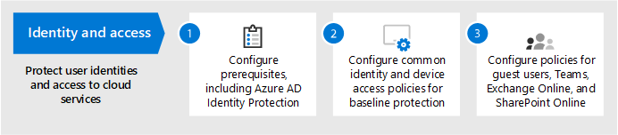
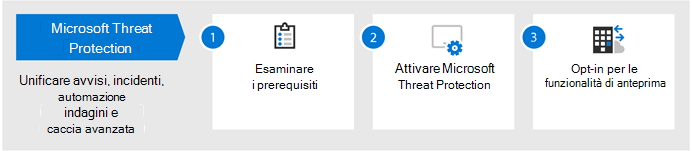
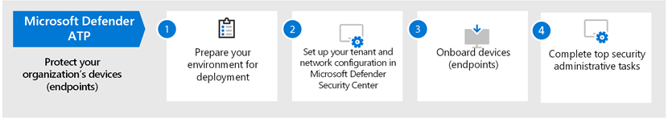

# Configurare le funzionalità di protezione dalle minacce in Microsoft 365Configure threat protection capabilities across Microsoft 365

Seguire questa procedura per configurare la protezione delle minacce in Microsoft 365.Follow these steps to configure threat protection across Microsoft 365.

## Passaggio 1: configurare l'autenticazione a più fattori e i criteri di accesso condizionaleStep 1: Set up multi-factor authentication and conditional access policies

[L'autenticazione](https://docs.microsoft.com/azure/active-directory/authentication/concept-mfa-howitworks) a più fattori richiede agli utenti di verificare la propria identità con una chiamata telefonica o l'app Authenticator.[Multi-factor authentication](https://docs.microsoft.com/azure/active-directory/authentication/concept-mfa-howitworks) (MFA) requires users to verify their identity with a phone call or authenticator app. I [criteri di accesso condizionale](https://docs.microsoft.com/azure/active-directory/conditional-access/overview) definiscono alcuni requisiti che devono essere soddisfatti per consentire agli utenti di accedere alle app e ai dati in Microsoft 365.[Conditional access policies](https://docs.microsoft.com/azure/active-directory/conditional-access/overview) define certain requirements that must be met in order for users to access apps and data in Microsoft 365. I criteri di accesso condizionale e di Mae interagiscono per proteggere l'organizzazione.MFA and conditional access policies work together to protect your organization. Ad esempio, se un utente tenta di eseguire l'accesso da un dispositivo mobile utilizzando un account non abilitato per l'AMF e un criterio di accesso condizionale richiede che l'AMF sia attiva, non sarà possibile eseguire l'accesso.For example, if someone attempts to sign in from a mobile device using an account that  is not enabled for MFA, and a conditional access policy requires MFA to be in effect, that user will be prevented from signing in.  

Microsoft ha testato e raccomandato una serie specifica di criteri di accesso condizionale e relativi per la protezione dell'accesso a tutte le applicazioni SaaS, in particolare Microsoft 365.Microsoft has tested and recommends a specific set of conditional access and related policies for protecting access to all of your SaaS applications, especially Microsoft 365. I criteri sono consigliati per la protezione di base, sensibile e altamente regolamentata.Policies are recommended for baseline, sensitive, and highly regulated protection. Iniziare implementando i criteri per la protezione di base.Begin by implementing the policies for baseline protection. 

 
 [vedere una versione più grande di questa immagine](https://github.com/MicrosoftDocs/microsoft-365-docs/raw/public/microsoft-365/media/microsoft-365-policies-configurations/Identity_device_access_policies_byplan.png)
[See a larger version of this image](https://github.com/MicrosoftDocs/microsoft-365-docs/raw/public/microsoft-365/media/microsoft-365-policies-configurations/Identity_device_access_policies_byplan.png)

### Per implementare la protezione di base per Microsoft 365To implement baseline protection for Microsoft 365

 

1. [Configurare i prerequisiti, inclusa la protezione delle identità di Azure](../security/office-365-security/identity-access-prerequisites.md).[Configure prerequisites, including Azure Identity Protection](../security/office-365-security/identity-access-prerequisites.md).
2. [Configurazione dei criteri comuni di identità e accesso ai dispositivi](../security/office-365-security/identity-access-policies.md) per la protezione della linea di base.[Configure common identity and device access policies](../security/office-365-security/identity-access-policies.md) for baseline protection.
3. Configurare i criteri per [gli utenti Guest](../security/office-365-security/identity-access-policies-guest-access.md), [Microsoft teams](../security/office-365-security/teams-access-policies.md), [Exchange Online](../security/office-365-security/secure-email-recommended-policies.md)e [SharePoint Online e OneDrive](../security/office-365-security/sharepoint-file-access-policies.md).Configure policies for [guest users](../security/office-365-security/identity-access-policies-guest-access.md), [Microsoft Teams](../security/office-365-security/teams-access-policies.md), [Exchange Online](../security/office-365-security/secure-email-recommended-policies.md), and [SharePoint Online and OneDrive](../security/office-365-security/sharepoint-file-access-policies.md).

### Ulteriori informazioni sulla protezione delle identitàMore information about protecting identities

- [Configurazioni di identità e accesso dei dispositiviIdentity and device access configurations](../security/office-365-security/microsoft-365-policies-configurations.md)
- [Linee guida per la sicurezza per Azure MaeSecurity guidance for Azure MFA](https://docs.microsoft.com/azure/active-directory/authentication/multi-factor-authentication-security-best-practices)

## Passaggio 2: configurare Azure Advanced Threat ProtectionStep 2: Configure Azure Advanced Threat Protection

[Azure Advanced Threat Protection](https://docs.microsoft.com/azure-advanced-threat-protection/what-is-atp) (Azure ATP) è una soluzione di sicurezza basata sul cloud che funziona con i segnali di [Azure Active Directory](https://docs.microsoft.com/azure/active-directory/fundamentals/active-directory-whatis) locali per identificare, rilevare ed esaminare le minacce avanzate, le identità compromesse e le azioni Insider dannose indirizzate alla propria organizzazione.[Azure Advanced Threat Protection](https://docs.microsoft.com/azure-advanced-threat-protection/what-is-atp) (Azure ATP) is a cloud-based security solution that works with your on-premises [Azure Active Directory](https://docs.microsoft.com/azure/active-directory/fundamentals/active-directory-whatis) signals to identify, detect, and investigate advanced threats, compromised identities, and malicious insider actions directed at your organization.

Azure ATP consente alle operazioni di sicurezza (secops) di analisti e professionisti della sicurezza che lottano per rilevare attacchi avanzati in ambienti ibridi per:Azure ATP enables security operations (SecOps) analysts and security professionals struggling to detect advanced attacks in hybrid environments to:
- Monitorare gli utenti, il comportamento delle entità e le attività con l'analisi basata sull'apprendimento.Monitor users, entity behavior, and activities with learning-based analytics.
- Proteggere le identità utente e le credenziali archiviate in Active Directory.Protect user identities and credentials stored in Active Directory.
- Identificare e analizzare le attività utente sospette e gli attacchi avanzati per tutta la kill chain.Identify and investigate suspicious user activities and advanced attacks throughout the kill chain.
- Fornire informazioni chiare sull'incidente in una sequenza temporale semplice per la valutazione veloce.Provide clear incident information on a simple timeline for fast triage.

### Per configurare l'ATP di AzureTo set up Azure ATP

 

1. [Configurare](https://docs.microsoft.com/azure-advanced-threat-protection/install-atp-step1) l'ambiente ATP di Azure per proteggere gli ambienti principali.[Set up Azure ATP](https://docs.microsoft.com/azure-advanced-threat-protection/install-atp-step1) to protect your primary environments.
2. Proteggere tutti i [controller di dominio](https://docs.microsoft.com/azure-advanced-threat-protection/atp-sensor-monitoring) e le [foreste](https://docs.microsoft.com/azure-advanced-threat-protection/atp-multi-forest).Protect all your [domain controllers](https://docs.microsoft.com/azure-advanced-threat-protection/atp-sensor-monitoring) and [forests](https://docs.microsoft.com/azure-advanced-threat-protection/atp-multi-forest).
3. Integrare gli [avvisi di Azure ATP](https://docs.microsoft.com/azure-advanced-threat-protection/suspicious-activity-guide?tabs=external) nel flusso di lavoro operazioni di sicurezza (secops).Integrate [Azure ATP alerts](https://docs.microsoft.com/azure-advanced-threat-protection/suspicious-activity-guide?tabs=external) into your security operations (SecOps) workflow.

### Ulteriori informazioni su Azure ATPMore information about Azure ATP

- [Che cos'è Azure ATP?What is Azure ATP?](https://docs.microsoft.com/azure-advanced-threat-protection/what-is-atp)
- [Video: Introduzione a Azure ATPVideo: Introduction to Azure ATP](https://www.youtube.com/watch?reload=9&v=EGY2m8yU_KE)
- [Distribuzione di Azure ATPAzure ATP deployment](https://docs.microsoft.com/azure-advanced-threat-protection/what-is-atp#whats-next)

## Passaggio 3: abilitare Microsoft Threat ProtectionStep 3: Turn on Microsoft Threat Protection

[Microsoft Threat Protection](https://docs.microsoft.com/microsoft-365/security/mtp/microsoft-threat-protection) combina segnali e orchestra le funzionalità in una singola soluzione.[Microsoft Threat Protection](https://docs.microsoft.com/microsoft-365/security/mtp/microsoft-threat-protection) combines signals and orchestrates capabilities into a single solution. Con la soluzione integrata Microsoft Threat Protection, i professionisti della sicurezza possono unire i segnali di minaccia che ognuno di questi prodotti riceve e determina l'intero ambito e l'impatto della minaccia; come è entrata nell'ambiente, cosa ne è interessata e come sta attualmente influenzando l'organizzazione.With the integrated Microsoft Threat Protection solution, security professionals can stitch together the threat signals that each of these products receive and determine the full scope and impact of the threat; how it entered the environment, what it's affected, and how it's currently impacting the organization. Microsoft Threat Protection interviene automaticamente per impedire o arrestare l'attacco e la correzione automatica delle cassette postali, degli endpoint e delle identità degli utenti.Microsoft Threat Protection takes automatic action to prevent or stop the attack and self-heal affected mailboxes, endpoints, and user identities.

Microsoft Threat Protection unifica gli avvisi, gli incidenti, l'analisi automatizzata e la risposta e la ricerca avanzata tra i carichi di lavoro (Azure ATP, Office 365 ATP, Microsoft Defender ATP e Microsoft cloud app Security) in un unico riquadro di Glass Experience.Microsoft Threat Protection unifies alerts, incidents, automated investigation and response, and advanced hunting across workloads (Azure ATP, Office 365 ATP, Microsoft Defender ATP, and Microsoft Cloud App Security) into a single pane of glass experience. Dopo aver configurato uno o più servizi di protezione avanzata dalle minacce, abilitare Microsoft Threat Protection.After you have configured one or more of your advanced threat protection services, turn on Microsoft Threat Protection. Le nuove funzionalità vengono aggiunte continuamente a Microsoft Threat Protection; prendere in considerazione la possibilità di ricevere funzionalità di anteprima.New features are added continually to Microsoft Threat Protection; consider opting in to receive preview features.

### Per configurare Microsoft Threat ProtectionTo set up Microsoft Threat Protection

 

1. [Esaminare i prerequisiti](https://docs.microsoft.com/microsoft-365/security/mtp/prerequisites).[Review the prerequisites](https://docs.microsoft.com/microsoft-365/security/mtp/prerequisites).
2. [Attiva Microsoft Threat Protection](https://docs.microsoft.com/microsoft-365/security/mtp/mtp-enable).[Turn on Microsoft Threat Protection](https://docs.microsoft.com/microsoft-365/security/mtp/mtp-enable).
3. [Opt-in per le funzionalità di anteprima](https://docs.microsoft.com/microsoft-365/security/mtp/preview).[Opt in for preview features](https://docs.microsoft.com/microsoft-365/security/mtp/preview).

### Ulteriori informazioni su Microsoft Threat ProtectionMore information about Microsoft Threat Protection

- [Che cos’è Microsoft Threat Protection?What is Microsoft Threat Protection?](https://docs.microsoft.com/microsoft-365/security/mtp/microsoft-threat-protection)
- [Novità di Microsoft Threat ProtectionWhat's new in Microsoft Threat Protection](https://docs.microsoft.com/microsoft-365/security/mtp/whats-new)

## Passaggio 4: configurare Office 365 Advanced Threat ProtectionStep 4: Configure Office 365 Advanced Threat Protection

[Office 365 Advanced Threat Protection](https://docs.microsoft.com/microsoft-365/security/office-365-security/office-365-atp) (Office 365 ATP) salvaguarda la propria organizzazione dalle minacce dannose nei messaggi di posta elettronica (allegati e URL), nei documenti di Office e negli strumenti di collaborazione.[Office 365 Advanced Threat Protection](https://docs.microsoft.com/microsoft-365/security/office-365-security/office-365-atp) (Office 365 ATP) safeguards your organization against malicious threats in email messages (attachments and URLs), Office documents, and collaboration tools. Nella tabella seguente sono elencate le funzionalità e le funzionalità ATP di Office 365 incluse in Microsoft 365 E5:The following table lists Office 365 ATP features and capabilities that are included in Microsoft 365 E5:

|Funzionalità di configurazione, protezione e rilevamentoConfiguration, protection, and detection capabilities|Funzionalità di automazione, analisi, correzione e formazioneAutomation, investigation, remediation, and education capabilities|
|---|---|
|[Allegati sicuriSafe Attachments](https://docs.microsoft.com/microsoft-365/security/office-365-security/atp-safe-attachments) [Collegamenti sicuriSafe Links](https://docs.microsoft.com/microsoft-365/security/office-365-security/atp-safe-links) [Sicurezza documentiSafe Documents](https://docs.microsoft.com/microsoft-365/security/office-365-security/safe-docs) [ATP per SharePoint, OneDrive e Microsoft TeamsATP for SharePoint, OneDrive, and Microsoft Teams](https://docs.microsoft.com/microsoft-365/security/office-365-security/atp-for-spo-odb-and-teams) [Protezione anti-phishing ATPATP anti-phishing protection](https://docs.microsoft.com/microsoft-365/security/office-365-security/set-up-anti-phishing-policies#exclusive-settings-in-atp-anti-phishing-policies)|[Tracker delle minacceThreat Trackers](https://docs.microsoft.com/microsoft-365/security/office-365-security/threat-trackers) [Esplora minacceThreat Explorer](https://docs.microsoft.com/microsoft-365/security/office-365-security/threat-explorer) [Analisi e risposta automatizzateAutomated investigation and response](https://docs.microsoft.com/microsoft-365/security/office-365-security/office-365-air) [Simulatore di attacchiAttack Simulator](https://docs.microsoft.com/microsoft-365/security/office-365-security/attack-simulator)|
|

Con Office 365 ATP, le persone all'interno dell'organizzazione possono comunicare e collaborare in modo più sicuro, con protezione dalle minacce per il contenuto della posta elettronica e i documenti di Office.With Office 365 ATP, people across your organization can communicate and collaborate more securely, with threat protection for their email content and Office documents.

### Per configurare Office 365 ATPTo set up Office 365 ATP

 

1. [Impostare e configurare i criteri ATP di Office 365](https://docs.microsoft.com/microsoft-365/security/office-365-security/protect-against-threats).[Set up and configure your Office 365 ATP policies](https://docs.microsoft.com/microsoft-365/security/office-365-security/protect-against-threats).
2. [Visualizzare e usare i rapporti ATP di Office 365](https://docs.microsoft.com/microsoft-365/security/office-365-security/view-reports-for-atp).[View and use your Office 365 ATP reports](https://docs.microsoft.com/microsoft-365/security/office-365-security/view-reports-for-atp).
3. [Utilizzare le funzionalità di analisi e risposta alle minacce](https://docs.microsoft.com/microsoft-365/security/office-365-security/office-365-ti).[Use threat investigation and response capabilities](https://docs.microsoft.com/microsoft-365/security/office-365-security/office-365-ti).

### Ulteriori informazioni su Office 365 ATPMore information about Office 365 ATP

- [Panoramica di Office 365 ATPOffice 365 ATP overview](https://docs.microsoft.com/microsoft-365/security/office-365-security/office-365-atp)
- [Novità di Office 365 ATPWhat's new in Office 365 ATP](https://docs.microsoft.com/microsoft-365/security/office-365-security/whats-new-in-office-365-atp)

## Passaggio 5: configurare Microsoft Defender Advanced Threat ProtectionStep 5: Configure Microsoft Defender Advanced Threat Protection

[Microsoft Defender Advanced Threat Protection](https://docs.microsoft.com/windows/security/threat-protection) (Microsoft Defender ATP) protegge i dispositivi delle organizzazioni (definiti anche endpoint) da Cyberthreats, attacchi avanzati e violazioni dei dati.[Microsoft Defender Advanced Threat Protection](https://docs.microsoft.com/windows/security/threat-protection) (Microsoft Defender ATP) protects your organizations devices (also referred to as endpoints) from cyberthreats, advanced attacks, and data breaches. I team di sicurezza possono essere più efficienti nella gestione della sicurezza degli endpoint.Security teams can be more efficient in managing the security of their endpoints. Gli strumenti robusti aiutano le organizzazioni a tenere il passo con i sistemi non inviati usando il rilevamento delle vulnerabilità con la [gestione di minacce e vulnerabilità](https://docs.microsoft.com/windows/security/threat-protection/microsoft-defender-atp/next-gen-threat-and-vuln-mgt).Robust tools help organizations keep up with unpatched systems using  vulnerability detection with [Threat and Vulnerability management](https://docs.microsoft.com/windows/security/threat-protection/microsoft-defender-atp/next-gen-threat-and-vuln-mgt). Le funzionalità di rilevamento e correzione automatizzate, ad esempio la [riduzione della superficie di attacco](https://docs.microsoft.com/windows/security/threat-protection/microsoft-defender-atp/overview-attack-surface-reduction), la protezione di [prossima generazione](https://docs.microsoft.com/windows/security/threat-protection/windows-defender-antivirus/windows-defender-antivirus-in-windows-10), il [rilevamento e la risposta degli endpoint](https://docs.microsoft.com/windows/security/threat-protection/microsoft-defender-atp/overview-endpoint-detection-response)e l' [analisi e la correzione automatizzate](https://docs.microsoft.com/windows/security/threat-protection/microsoft-defender-atp/automated-investigations) consentono di mantenere i dispositivi sicuri da malware.Automated detection and remediation capabilities, such as [attack surface reduction](https://docs.microsoft.com/windows/security/threat-protection/microsoft-defender-atp/overview-attack-surface-reduction), [next-generation protection](https://docs.microsoft.com/windows/security/threat-protection/windows-defender-antivirus/windows-defender-antivirus-in-windows-10), [endpoint detection and response](https://docs.microsoft.com/windows/security/threat-protection/microsoft-defender-atp/overview-endpoint-detection-response), and [automated investigation and remediation](https://docs.microsoft.com/windows/security/threat-protection/microsoft-defender-atp/automated-investigations) help keep your devices safe from malware. Oltre a queste funzionalità, i clienti possono ottenere notifiche proattive e consultarsi con gli esperti di Microsoft Threat su richiesta, come parte del servizio di caccia gestito con consenso esplicito.On top of these capabilities, customers can get proactive notifications and consult with Microsoft Threat Experts on demand, as part of the opt-in managed hunting service. 

### Configurare Microsoft Defender ATPSet up Microsoft Defender ATP

 

1. [Preparare la distribuzione ATP Microsoft Defender](https://docs.microsoft.com/windows/security/threat-protection/microsoft-defender-atp/deployment-phases).[Prepare your Microsoft Defender ATP deployment](https://docs.microsoft.com/windows/security/threat-protection/microsoft-defender-atp/deployment-phases).
2. [Configurare la distribuzione ATP Microsoft DefenderSet up your Microsoft Defender ATP deployment](https://docs.microsoft.com/windows/security/threat-protection/micros.oft-defender-atp/production-deployment)
3. [Onboard to the Microsoft Defender ATP Service](https://docs.microsoft.com/windows/security/threat-protection/microsoft-defender-atp/onboarding).[Onboard to the Microsoft Defender ATP service](https://docs.microsoft.com/windows/security/threat-protection/microsoft-defender-atp/onboarding).
4. [Completare le attività amministrative di sicurezza principali](https://docs.microsoft.com/windows/security/threat-protection/microsoft-defender-atp/tvm-security-recommendation).[Complete your top security administrative tasks](https://docs.microsoft.com/windows/security/threat-protection/microsoft-defender-atp/tvm-security-recommendation).

### Ulteriori informazioni su Microsoft Defender ATPMore information about Microsoft Defender ATP

- [Per ulteriori informazioni, vedere ATP Microsoft Defender](https://docs.microsoft.com/windows/security/threat-protection).[Learn more about Microsoft Defender ATP](https://docs.microsoft.com/windows/security/threat-protection).
- [Provare il Microsoft Defender ATP Evaluation Lab](https://docs.microsoft.com/windows/security/threat-protection/microsoft-defender-atp/evaluation-lab).[Try the Microsoft Defender ATP evaluation lab](https://docs.microsoft.com/windows/security/threat-protection/microsoft-defender-atp/evaluation-lab).

## Passaggio 6: configurare Microsoft cloud app SecurityStep 6: Configure Microsoft Cloud App Security

[Microsoft cloud app Security](https://docs.microsoft.com/cloud-app-security) è un broker di sicurezza per l'accesso cloud che supporta la raccolta di log, i connettori API e il proxy inverso.[Microsoft Cloud App Security](https://docs.microsoft.com/cloud-app-security) is a Cloud Access Security Broker that supports log collection, API connectors, and reverse proxy. Microsoft cloud app Security offre una vasta visibilità, il controllo dei dati di viaggio e analisi sofisticate per identificare e combattere Cyberthreats in tutti i servizi cloud.Microsoft Cloud App Security provides rich visibility, control over data travel, and sophisticated analytics to identify and combat cyberthreats across all your cloud services. Con Microsoft cloud app Security, le operazioni di sicurezza in grado di proteggere le informazioni riservate dell'organizzazione, proteggersi da Cyberthreats e anomalie, individuare e monitorare le app che accedono ai dati dell'organizzazione e contribuire a garantire che le app cloud dell'organizzazione soddisfino i requisiti di conformità.With Microsoft Cloud App Security, your security operations can protect your organization's sensitive information, protect against cyberthreats and anomalies, discover and monitor apps that access your organization's data, and help make sure your organization's cloud apps meet compliance requirements.

### Configurare Microsoft cloud app SecuritySet up Microsoft Cloud App Security

 

1. [Configurare il portale e altri requisiti di base](https://docs.microsoft.com/cloud-app-security/general-setup).[Set up the portal and other basic requirements](https://docs.microsoft.com/cloud-app-security/general-setup).
2. [Configurare le app Cloud Discovery](https://docs.microsoft.com/cloud-app-security/set-up-cloud-discovery) e [Connect](https://docs.microsoft.com/cloud-app-security/enable-instant-visibility-protection-and-governance-actions-for-your-apps).[Set up cloud discovery](https://docs.microsoft.com/cloud-app-security/set-up-cloud-discovery) and [connect apps](https://docs.microsoft.com/cloud-app-security/enable-instant-visibility-protection-and-governance-actions-for-your-apps).
3. [Distribuire il controllo delle app con accesso condizionale per le app in primo piano](https://docs.microsoft.com/cloud-app-security/proxy-deployment-aad).[Deploy conditional access app control for featured apps](https://docs.microsoft.com/cloud-app-security/proxy-deployment-aad).
4. [Utilizzare gli strumenti di analisi e i dashboard](https://docs.microsoft.com/cloud-app-security/investigate).[Use the investigation tools and dashboards](https://docs.microsoft.com/cloud-app-security/investigate).

### Ulteriori informazioni su Microsoft Cloud App SecurityMore information about Microsoft Cloud App Security

- [Esaminare nuove caratteristiche e funzionalità](https://docs.microsoft.com/cloud-app-security/release-notes).[Review new features and capabilities](https://docs.microsoft.com/cloud-app-security/release-notes).
- [Per ulteriori informazioni, vedere Microsoft cloud app Security](https://docs.microsoft.com/cloud-app-security/what-is-cloud-app-security).[Learn more about Microsoft Cloud App Security](https://docs.microsoft.com/cloud-app-security/what-is-cloud-app-security).

## Passaggio 7: monitorare lo stato e intraprendere le azioniStep 7: Monitor status and take actions

Dopo aver configurato e distribuito i servizi e le funzionalità di protezione dalle minacce, il passaggio successivo consiste nel monitorare i rilevamenti delle minacce e nel prendere le azioni appropriate.After you have set up and deployed your threat protection services and capabilities, your next step is to monitor threat detections, and take appropriate actions. Il punto di partenza migliore è Microsoft 365 Security Center ( [https://security.microsoft.com](https://security.microsoft.com) ), in cui è possibile monitorare e gestire la sicurezza tra le identità, i dati, i dispositivi, le app e l'infrastruttura di Microsoft.Your best starting point is the Microsoft 365 security center ([https://security.microsoft.com](https://security.microsoft.com)), where you can monitor and managing security across your Microsoft identities, data, devices, apps, and infrastructure. 

Microsoft 365 Security Center è stato appositamente progettato per gli amministratori della sicurezza e i team delle operazioni di sicurezza.The Microsoft 365 security center is specifically intended for security admins and security operations teams. Nel centro sicurezza Microsoft 365 è possibile:In the Microsoft 365 security center, you can:
- Visualizzazione dell'integrità generale della sicurezza dell'organizzazione con [Punteggio sicuro](https://docs.microsoft.com/microsoft-365/security/mtp/microsoft-secure-score).View the overall security health of your organization with [Secure Score](https://docs.microsoft.com/microsoft-365/security/mtp/microsoft-secure-score).
- [Monitorare e visualizzare i report](https://docs.microsoft.com/microsoft-365/security/mtp/monitoring-and-reporting) sullo stato delle identità, dei dati, degli strumenti, delle app e dell'infrastruttura.[Monitor and view reports](https://docs.microsoft.com/microsoft-365/security/mtp/monitoring-and-reporting) on the status of your identities, data, devices, apps, and infrastructure.
- Connettere i punti su avvisi tramite [incidenti](https://docs.microsoft.com/microsoft-365/security/mtp/incident-queue).Connect the dots on alerts through [incidents](https://docs.microsoft.com/microsoft-365/security/mtp/incident-queue).
- Utilizzare l' [analisi automatizzata e la correzione](https://docs.microsoft.com/microsoft-365/security/mtp/mtp-autoir) per risolvere le minacce.Use [automated investigation and remediation](https://docs.microsoft.com/microsoft-365/security/mtp/mtp-autoir) to address threats.
- [Cercare in modo proattivo le minacce](https://docs.microsoft.com/microsoft-365/security/mtp/advanced-hunting-overview), ad esempio i tentativi di intrusioni o le attività di violazione che interessano la posta elettronica, i dati, i dispositivi e le identità.[Proactively hunt for threats](https://docs.microsoft.com/microsoft-365/security/mtp/advanced-hunting-overview), such as intrusion attempts or breach activity affecting your email, data, devices, and identities.
- [Comprendere le campagne e le tecniche di attacco più recenti](https://docs.microsoft.com/microsoft-365/security/mtp/latest-attack-campaigns) con Threat Analytics.[Understand the latest attack campaigns](https://docs.microsoft.com/microsoft-365/security/mtp/latest-attack-campaigns) and techniques with threat analytics.
- ... e altro ancora!... and more!

### Ulteriori informazioni sul centro sicurezza di Microsoft 365More information about the Microsoft 365 security center

- Iniziare [a usare il Centro sicurezza di Microsoft 365](https://docs.microsoft.com/microsoft-365/security/mtp/overview-security-center).[Get started with the Microsoft 365 security center](https://docs.microsoft.com/microsoft-365/security/mtp/overview-security-center).
- [Monitorare e visualizzare i report](https://docs.microsoft.com/microsoft-365/security/mtp/monitoring-and-reporting).[Monitor and view reports](https://docs.microsoft.com/microsoft-365/security/mtp/monitoring-and-reporting).
- [Vedere i portali di sicurezza in Microsoft 365](https://docs.microsoft.com/microsoft-365/security/mtp/portals).[See the security portals in Microsoft 365](https://docs.microsoft.com/microsoft-365/security/mtp/portals).

## Passaggio 8: formazione degli utentiStep 8: Train users

Formazione gli utenti possono salvare gli utenti e le operazioni di sicurezza del team molto tempo e frustrazione.Training users can save your users and security operations team much time and frustration. Gli utenti esperti hanno meno probabilità di aprire allegati o fare clic su collegamenti nei messaggi di posta elettronica discutibili e hanno maggiori probabilità di evitare siti Web sospetti.Savvy users are less likely to open attachments or click links in questionable email messages, and they are more likely to avoid suspicious websites. 

Il [manuale della campagna](https://go.microsoft.com/fwlink/?linkid=2015598&amp;clcid=0x409) di Harvard Kennedy School Cybersecurity fornisce indicazioni eccellenti sulla creazione di una forte cultura della consapevolezza della sicurezza all'interno dell'organizzazione, tra cui la formazione degli utenti per identificare gli attacchi di phishing.The Harvard Kennedy School [Cybersecurity Campaign Handbook](https://go.microsoft.com/fwlink/?linkid=2015598&amp;clcid=0x409) provides excellent guidance on establishing a strong culture of security awareness within your organization, including training users to identify phishing attacks. 

Microsoft 365 fornisce le risorse seguenti per informare gli utenti nell'organizzazione:Microsoft 365 provides the following resources to help inform users in your organization:

|ConcettiConcept  |RisorseResources  |
|---------|---------|
|Microsoft 365Microsoft 365     |[Percorsi di apprendimento personalizzabiliCustomizable learning pathways](https://docs.microsoft.com/office365/customlearning/) 
Tali risorse consentono di creare una formazione per gli utenti finali nell'organizzazioneThese resources can help you put together training for end users in your organization        |
|Sicurezza di Microsoft 365Microsoft 365 security |[Modulo di apprendimento: proteggere l'organizzazione con sicurezza integrata e intelligente da Microsoft 365Learning module: Secure your organization with built-in, intelligent security from Microsoft 365](https://docs.microsoft.com/learn/modules/security-with-microsoft-365) 
Questo modulo consente di descrivere in che modo le funzionalità di sicurezza di Microsoft 365 interagiscono e di articolare i vantaggi di queste funzionalità di sicurezza.This module enables you to describe how Microsoft 365 security features work together and to articulate the benefits of these security features. |
|Autenticazione a più fattoriMulti-factor authentication     | [Verifica in due passaggi: che cos'è la pagina di verifica aggiuntiva?Two-step verification: What is the additional verification page?](https://docs.microsoft.com/azure/active-directory/user-help/multi-factor-authentication-end-user-first-time) 
Questo articolo aiuta gli utenti finali a capire cosa sia l'autenticazione a più fattori e il motivo per cui viene utilizzato all'interno dell'organizzazione.This article helps end users understand what multi-factor authentication is and why it's being used at your organization.    |

Oltre a queste linee guida, Microsoft consiglia agli utenti di eseguire le azioni descritte in questo articolo: [proteggere l'account e i dispositivi da hacker e malware](https://support.office.com/article/066d6216-a56b-4f90-9af3-b3a1e9a327d6.aspx).In addition to this guidance, Microsoft recommends that your users take the actions described in this article: [Protect your account and devices from hackers and malware](https://support.office.com/article/066d6216-a56b-4f90-9af3-b3a1e9a327d6.aspx). Queste azioni includono:These actions include:
- Utilizzo di password complesseUsing strong passwords
- Protezione di dispositiviProtecting devices 
- Abilitazione delle funzionalità di sicurezza nei PC Windows 10 e Mac (per i dispositivi non gestiti)Enabling security features on Windows 10 and Mac PCs (for unmanaged devices)
    
Microsoft consiglia inoltre agli utenti di proteggere gli account di posta elettronica personali adottando le azioni consigliate negli articoli seguenti:Microsoft also recommends that users protect their personal email accounts by taking the actions recommended in the following articles:
- [Proteggi il tuo account di posta elettronica di Outlook.comHelp protect your Outlook.com email account](https://support.microsoft.com/office/help-protect-your-outlook-com-email-account-a4f20fc5-4307-4ece-8231-6d4d4bd8a9ba)
- [Proteggi l'account di Gmail con la verifica in due passaggiProtect your Gmail account with 2-step verification](https://go.microsoft.com/fwlink/?linkid=2015688&amp;clcid=0x409)
