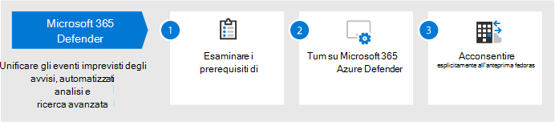

# Configurare le funzionalità di protezione dalle minacce in Microsoft 365

Seguire questa procedura per configurare la protezione dalle minacce in Microsoft 365.

## Passaggio 1: Configurare l'autenticazione a più fattori e i criteri di accesso condizionale

[L'autenticazione a più](/azure/active-directory/authentication/concept-mfa-howitworks) fattori richiede agli utenti di verificare la propria identità con una chiamata telefonica o un'app di autenticazione. [I criteri di accesso](/azure/active-directory/conditional-access/overview) condizionale definiscono determinati requisiti che devono essere soddisfatti per consentire agli utenti di accedere alle app e ai dati in Microsoft 365. I criteri MFA e Accesso condizionale funzionano insieme per proteggere l'organizzazione. Ad esempio, se un utente tenta di accedere da un dispositivo mobile utilizzando un account non abilitato per la MFA e un criterio di accesso condizionale richiede che l'autenticazione a più fattori sia attiva, l'utente non può eseguire l'accesso.  

Microsoft ha testato e consigliato un set specifico di accesso condizionale e criteri correlati per proteggere l'accesso a tutte le applicazioni SaaS, in particolare Microsoft 365. I criteri sono consigliati per la protezione di base, sensibile e altamente regolamentata. Iniziare implementando i criteri per la protezione di base. 

Vedere una versione più grande di questa 
 [immagine](https://github.com/MicrosoftDocs/microsoft-365-docs/raw/public/microsoft-365/media/microsoft-365-policies-configurations/Identity_device_access_policies_byplan.png)

### Per implementare la protezione di base per Microsoft 365

 

1. [Configurare i prerequisiti, incluso Azure AD Identity Protection.](../security/office-365-security/identity-access-prerequisites.md)
2. [Configurare i criteri comuni di identità e accesso ai dispositivi](../security/office-365-security/identity-access-policies.md) per la protezione di base.
3. Configurare i criteri [per gli utenti guest,](../security/office-365-security/identity-access-policies-guest-access.md) [Microsoft Teams,](../security/office-365-security/teams-access-policies.md) [Exchange Online](../security/office-365-security/secure-email-recommended-policies.md)e [SharePoint Online e OneDrive.](../security/office-365-security/sharepoint-file-access-policies.md)

### Ulteriori informazioni sulla protezione delle identità

- [Configurazioni di identità e accesso dei dispositivi](../security/office-365-security/microsoft-365-policies-configurations.md)
- [Indicazioni sulla sicurezza per Azure MFA](/azure/active-directory/authentication/multi-factor-authentication-security-best-practices)

## Passaggio 2: Configurare Microsoft Defender per l'identità

[Microsoft Defender for Identity](/defender-for-identity/what-is) è una soluzione di sicurezza basata sul cloud che funziona con i segnali di Servizi di dominio Active Directory (AD DS) locali per identificare, rilevare e analizzare minacce avanzate, identità compromesse e azioni insider dannose indirizzate all'organizzazione.

Microsoft Defender for Identity consente agli analisti delle operazioni di sicurezza (SecOps) e ai professionisti della sicurezza che faticano a rilevare attacchi avanzati in ambienti ibridi per:
- Monitorare gli utenti, il comportamento delle entità e le attività con l'analisi basata sull'apprendimento.
- Proteggere le identità utente e le credenziali archiviate in Active Directory.
- Identificare e analizzare le attività utente sospette e gli attacchi avanzati per tutta la kill chain.
- Fornire informazioni chiare sull'incidente in una sequenza temporale semplice per la valutazione veloce.

### Per configurare Microsoft Defender per l'identità

 

1. [Configurare Microsoft Defender for Identity per](/azure-advanced-threat-protection/install-atp-step1) proteggere gli ambienti principali.
2. Proteggere tutti i [controller di dominio e](/azure-advanced-threat-protection/atp-sensor-monitoring) le [foreste](/azure-advanced-threat-protection/atp-multi-forest).
3. Integrare [gli avvisi di Microsoft Defender for Identity](/azure-advanced-threat-protection/suspicious-activity-guide?tabs=external) nel flusso di lavoro delle operazioni di sicurezza (SecOps).

### Altre informazioni su Microsoft Defender for Identity

- [Che cosa è Microsoft Defender per identità?](/azure-advanced-threat-protection/what-is-atp)
- [Video: Introduzione a Microsoft Defender for Identity](https://www.youtube.com/watch?reload=9&v=EGY2m8yU_KE)
- [Distribuzione di Microsoft Defender for Identity](/azure-advanced-threat-protection/what-is-atp#whats-next)

## Passaggio 3: attivare Microsoft 365 Defender

[Microsoft 365 Defender](../security/defender/microsoft-365-defender.md) combina i segnali e orchestra le funzionalità in un'unica soluzione. Con la soluzione integrata Microsoft 365 Defender, i professionisti della sicurezza possono unire i segnali di minaccia che ognuno di questi prodotti riceve e determinare l'ambito e l'impatto completi della minaccia; come è entrato nell'ambiente, su cosa ne è interessato e su come attualmente influisce sull'organizzazione. Microsoft 365 Defender adotta un'azione automatica per impedire o arrestare l'attacco e auto-sanare le cassette postali, gli endpoint e le identità degli utenti interessati.

Microsoft 365 Defender unifica avvisi, incidenti, indagini e risposte automatizzate e ricerca avanzata tra i carichi di lavoro (Microsoft Defender for Identity, Microsoft Defender per Office 365, Microsoft Defender for Endpoint e Microsoft Cloud App Security) in un unico riquadro di esperienza di vetro. Nuove funzionalità vengono aggiunte continuamente a Microsoft 365 Defender; prendere in considerazione la possibilità di acconsentire esplicitamente alla ricezione delle funzionalità di anteprima.

### Per configurare Microsoft 365 Defender

 

1. [Esaminare i prerequisiti](../security/defender/prerequisites.md).
2. [Attivare Microsoft 365 Defender](../security/defender/m365d-enable.md).
3. [Acconsentire esplicitamente alle funzionalità di anteprima.](../security/defender/preview.md)

### Ulteriori informazioni su Microsoft 365 Defender

- [Che cos'è Microsoft 365 Defender?](../security/defender/microsoft-365-defender.md)
- [Novità di Microsoft 365 Defender](../security/defender/whats-new.md)

## Passaggio 4: Configurare Microsoft Defender per Office 365

[Microsoft Defender per Office 365](../security/office-365-security/defender-for-office-365.md) protegge l'organizzazione dalle minacce dannose nei messaggi di posta elettronica (allegati e URL), nei documenti di Office e negli strumenti di collaborazione. Nella tabella seguente sono elencate le funzionalità e le funzionalità di Microsoft Defender per Office 365 incluse in Microsoft 365 E5:

|Funzionalità di configurazione, protezione e rilevamento|Funzionalità di automazione, analisi, correzione ed istruzione|
|:---|:---|
|[Allegati sicuri](../security/office-365-security/safe-attachments.md) [Collegamenti sicuri](../security/office-365-security/safe-links.md) [Sicurezza documenti](../security/office-365-security/safe-docs.md) [ATP per SharePoint, OneDrive e Microsoft Teams](../security/office-365-security/mdo-for-spo-odb-and-teams.md)  [Protezione anti-phishing in Microsoft 365](../security/office-365-security/anti-phishing-protection.md)|[Tracker delle minacce](../security/office-365-security/threat-trackers.md) [Esplora minacce](../security/office-365-security/threat-explorer.md) [Analisi e risposta automatizzate](../security/office-365-security/office-365-air.md) [Simulatore di attacchi](../security/office-365-security/attack-simulator.md)|
|

Con Microsoft Defender per Office 365, gli utenti di tutta l'organizzazione possono comunicare e collaborare in modo più sicuro, con protezione dalle minacce per il contenuto della posta elettronica e i documenti di Office.

### Per configurare Microsoft Defender per Office 365

 

1. [Configurare i criteri di Microsoft Defender per Office 365.](../security/office-365-security/protect-against-threats.md)
2. [Visualizzare e usare i report di Microsoft Defender per Office 365.](../security/office-365-security/view-reports-for-mdo.md)
3. [Usare le funzionalità di analisi e risposta alle minacce.](../security/office-365-security/office-365-ti.md)

### Ulteriori informazioni su Microsoft Defender per Office 365

- [Panoramica di Microsoft Defender per Office 365](../security/office-365-security/defender-for-office-365.md)
- [Novità di Microsoft Defender per Office 365](../security/office-365-security/whats-new-in-defender-for-office-365.md)

## Passaggio 5: Configurare Microsoft Defender per Endpoint

[Microsoft Defender for Endpoint](/windows/security/threat-protection) protegge i dispositivi delle organizzazioni (denominati anche endpoint) da minacce informatiche, attacchi avanzati e violazioni dei dati. I team di sicurezza possono essere più efficienti nella gestione della sicurezza degli endpoint. Strumenti affidabili consentono alle organizzazioni di tenere il passo con i sistemi senza problemi che utilizzano il rilevamento delle vulnerabilità [con la gestione delle minacce e delle vulnerabilità.](/windows/security/threat-protection/microsoft-defender-atp/next-gen-threat-and-vuln-mgt) Le funzionalità di rilevamento e correzione automatizzate, come la riduzione della superficie  di [attacco,](/windows/security/threat-protection/microsoft-defender-atp/overview-attack-surface-reduction)la protezione di nuova [generazione,](/windows/security/threat-protection/windows-defender-antivirus/windows-defender-antivirus-in-windows-10)il rilevamento e la risposta degli [endpoint](/windows/security/threat-protection/microsoft-defender-atp/overview-endpoint-detection-response)e l'analisi e correzione automatizzate consentono di proteggere i dispositivi dal malware. Oltre a queste funzionalità, i clienti possono ricevere notifiche proattive e consultare gli esperti microsoft sulle minacce su richiesta, come parte del servizio di ricerca gestita con consenso esplicito. 

### Configurare Microsoft Defender per Endpoint

 

1. [Preparare l'ambiente per Microsoft Defender per Endpoint](../security/defender-endpoint/deployment-phases.md).
2. [Distribuire Microsoft Defender per Endpoint](../security/defender-endpoint/production-deployment.md).
3. [Onboard al servizio Microsoft Defender for Endpoint](../security/defender-endpoint/onboarding.md).
4. [Completare le attività amministrative di sicurezza principali.](../security/defender-endpoint/tvm-security-recommendation.md)

### Altre informazioni su Microsoft Defender per Endpoint

- [Altre informazioni su Microsoft Defender per Endpoint.](../security/defender-endpoint/microsoft-defender-endpoint.md)
- [Prova il laboratorio di valutazione di Microsoft Defender for Endpoint.](../security/defender-endpoint/evaluation-lab.md)

## Passaggio 6: Configurare Microsoft Cloud App Security

[Microsoft Cloud App Security](/cloud-app-security) è un Cloud Access Security Broker che supporta la raccolta di log, i connettori API e il proxy inverso. Microsoft Cloud App Security offre visibilità avanzata, controllo sui viaggi dei dati e analisi sofisticate per identificare e contrastare le minacce informatiche in tutti i servizi cloud. Con Microsoft Cloud App Security, le operazioni di sicurezza possono proteggere le informazioni riservate dell'organizzazione, proteggersi da minacce informatiche e anomalie, individuare e monitorare le app che accedono ai dati dell'organizzazione e garantire che le app cloud dell'organizzazione soddisfino i requisiti di conformità.

### Configurare Microsoft Cloud App Security

 

1. [Configurare il portale e altri requisiti di base.](/cloud-app-security/general-setup)
2. [Configurare l'individuazione cloud](/cloud-app-security/set-up-cloud-discovery) e [connettere le app](/cloud-app-security/enable-instant-visibility-protection-and-governance-actions-for-your-apps).
3. [Distribuire il controllo dell'app di accesso condizionale per le app in primo piano.](/cloud-app-security/proxy-deployment-aad)
4. [Utilizzare gli strumenti di analisi e i dashboard](/cloud-app-security/investigate).

### Ulteriori informazioni su Microsoft Cloud App Security

- [Esaminare le nuove funzionalità e le nuove funzionalità](/cloud-app-security/release-notes).
- [Altre informazioni su Microsoft Cloud App Security.](/cloud-app-security/what-is-cloud-app-security)

## Passaggio 7: monitorare lo stato ed eseguire azioni

Dopo aver configurato e distribuito i servizi e le funzionalità di protezione dalle minacce, il passaggio successivo consiste nel monitorare i rilevamenti delle minacce ed eseguire le azioni appropriate. Il punto di partenza migliore è il Centro sicurezza Microsoft 365 ( ), in cui è possibile monitorare e gestire la sicurezza tra [https://security.microsoft.com](https://security.microsoft.com) identità, dati, dispositivi, app e infrastruttura Microsoft. 

Il Centro sicurezza Microsoft 365 è destinato agli amministratori della sicurezza e ai team delle operazioni di sicurezza. Nel Centro sicurezza Microsoft 365 è possibile:
- Visualizzare l'integrità della sicurezza complessiva dell'organizzazione [con Punteggio sicuro](https://docs.microsoft.com/microsoft-365/security/defender/microsoft-secure-score).
- [Monitorare e visualizzare report](../security/defender-endpoint/threat-protection-reports.md) sullo stato delle identità, dei dati, dei dispositivi, delle app e dell'infrastruttura.
- Connettere i punti sugli avvisi tramite [eventi imprevisti.](https://docs.microsoft.com/microsoft-365/security/defender/incident-queue)
- Usa [l'analisi e la correzione automatizzate per](../security/defender/m365d-autoir.md) affrontare le minacce.
- [Ricerca proattiva di minacce,](https://docs.microsoft.com/microsoft-365/security/defender/advanced-hunting-overview)ad esempio tentativi di intrusione o attività di violazione che interessano la posta elettronica, i dati, i dispositivi e le identità.
- [Comprendere le tecniche e le campagne di attacco](https://docs.microsoft.com/microsoft-365/security/defender/latest-attack-campaigns) più recenti con l'analisi delle minacce.
- ... e altro ancora!

### Ulteriori informazioni sul Centro sicurezza Microsoft 365

- Introduzione al Centro sicurezza [Microsoft 365.](../security/defender/overview-security-center.md)
- [Monitorare e visualizzare i report](../security/defender/overview-security-center.md).
- [Vedere i portali di sicurezza in Microsoft 365](../security/defender/portals.md).

## Passaggio 8: formare gli utenti

Gli utenti della formazione possono risparmiare molto tempo e frustrazione agli utenti e al team delle operazioni di sicurezza. Gli utenti esperti hanno meno probabilità di aprire allegati o fare clic su collegamenti in messaggi di posta elettronica discutibili e sono più propensi a evitare siti Web sospetti. 

Il manuale della campagna per la [cybersecurity](https://go.microsoft.com/fwlink/?linkid=2015598&amp;clcid=0x409) della scuola Kennedy di Harvard fornisce indicazioni eccellenti su come stabilire una forte cultura della consapevolezza della sicurezza all'interno dell'organizzazione, inclusa la formazione degli utenti per identificare gli attacchi di phishing. 

Microsoft 365 fornisce le risorse seguenti per informare gli utenti dell'organizzazione:

|Concetti  |Risorse  |
|---------|---------|
|Microsoft 365     |[Percorsi di apprendimento personalizzabili](/office365/customlearning/) 
Queste risorse possono aiutare a mettere insieme la formazione per gli utenti finali nell'organizzazione        |
|Sicurezza Microsoft 365 |[Modulo di apprendimento: proteggere l'organizzazione con sicurezza intelligente integrata da Microsoft 365](/learn/modules/security-with-microsoft-365) 
Questo modulo consente di descrivere il modo in cui le funzionalità di sicurezza di Microsoft 365 funzionano insieme e di illustrare i vantaggi di queste funzionalità di sicurezza. |
|Autenticazione a più fattori     | [Verifica in due passaggi: qual è la pagina di verifica aggiuntiva?](/azure/active-directory/user-help/multi-factor-authentication-end-user-first-time) 
Questo articolo consente agli utenti finali di comprendere cos'è l'autenticazione a più fattori e perché viene utilizzata nell'organizzazione.    |

Oltre a queste indicazioni, Microsoft consiglia agli utenti di eseguire le azioni descritte in questo articolo: Proteggere [l'account](https://support.office.com/article/066d6216-a56b-4f90-9af3-b3a1e9a327d6.aspx)e i dispositivi da hacker e malware. Queste azioni includono:
- Utilizzo di password complesse
- Protezione dei dispositivi 
- Abilitazione delle funzionalità di sicurezza nei PC Windows 10 e Mac (per dispositivi non gestiti)
    
Microsoft consiglia inoltre agli utenti di proteggere i propri account di posta elettronica personali seguendo le azioni consigliate negli articoli seguenti:
- [Proteggere l'account Outlook.com di posta elettronica](https://support.microsoft.com/office/help-protect-your-outlook-com-email-account-a4f20fc5-4307-4ece-8231-6d4d4bd8a9ba)
- [Proteggere l'account Gmail con la verifica in due passaggi](https://go.microsoft.com/fwlink/?linkid=2015688&amp;clcid=0x409)
