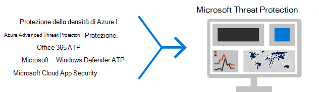

# Distribuire le funzionalità di protezione dalle minacce in Microsoft 365

I [malware](https://docs.microsoft.com/windows/security/threat-protection/intelligence/understanding-malware)e i sofisticati attacchi cibernetici, ad esempio le [minacce infile](https://docs.microsoft.com/windows/security/threat-protection/intelligence/fileless-threats), sono una circostanza comune. Le aziende devono proteggere se stessi e i propri clienti. Tali attacchi possono causare problemi importanti per la propria organizzazione, che vanno dalla perdita di fiducia alla difficoltà finanziaria, ai tempi di inattività pericolosi per le aziende e altro ancora. La protezione contro le minacce è importante, ma può essere difficile determinare dove concentrare il tempo, lo sforzo e le risorse dell'organizzazione. 

Le soluzioni di sicurezza Microsoft sono integrate nei nostri prodotti e servizi. Le funzionalità di automazione e apprendimento automatico riducono il carico nei team di sicurezza per assicurarsi che gli elementi corretti vengano risolti. La forza delle soluzioni di sicurezza Microsoft è basata su trilioni di segnali che vengono elaborati ogni giorno nel [grafico di sicurezza intelligente](https://cloud-platform-assets.azurewebsites.net/intelligent-security-graph). Microsoft 365 Security Solutions include [Microsoft Threat Protection](https://docs.microsoft.com/microsoft-365/security/mtp/microsoft-threat-protection), una soluzione che unisce segnali all'interno di posta elettronica, dati, dispositivi e identità per dipingere un'immagine di minacce avanzate per l'organizzazione.

Guardare questo video per una panoramica del processo di distribuzione.

> [!VIDEO https://www.microsoft.com/videoplayer/embed/RE4vsI7]

Utilizzare questo articolo come guida per l'implementazione della soluzione di protezione dalle minacce.

## Protezione dalle minacce in Microsoft 365 E5

[Microsoft 365 E5](https://www.microsoft.com/microsoft-365/enterprise-e5-business-software?activetab=pivot%3aoverviewtab) consente di proteggere l'organizzazione con una funzionalità di intelligence integrata e adattabile. Con le funzionalità di protezione dalle minacce in Microsoft 365 E5, è possibile rilevare ed esaminare le minacce avanzate, le identità compromesse e le azioni dannose negli ambienti locali e cloud.

In Microsoft 365 E5, le funzionalità di protezione dalle minacce sono integrate per impostazione predefinita. I segnali di ogni funzionalità aggiungono forza all'abilità complessiva di rilevare e rispondere alle minacce. Il set combinato di funzionalità offre la protezione ottimale per le organizzazioni, in particolare le organizzazioni multi-nazionali, rispetto all'esecuzione di prodotti non Microsoft. Nell'immagine seguente vengono illustrati i servizi e le funzionalità di protezione dalle minacce di Microsoft 365 E5 descritti in questo articolo.

Non appena si distribuiscono le funzionalità avanzate di protezione dalle minacce, è possibile attivare Microsoft Threat Protection, che consente di unire i segnali e i dati in un'unica posizione. 

Nella figura seguente viene illustrato un percorso consigliato per la distribuzione di queste singole funzionalità. 

|Soluzione/funzionalità  |Descrizione  |
|---------|---------|
|Autenticazione a più fattori e accesso condizionale     |Protezione da identità e dispositivi compromessi. Iniziare con questa protezione perché è fondamentale. La configurazione consigliata in queste linee guida include Azure AD Identity Protection come prerequisito.     |
|Azure Advanced Threat Protection     |  Una soluzione di sicurezza basata sul cloud che sfrutta i segnali di Active Directory locali per identificare, rilevare ed esaminare le minacce avanzate, le identità compromesse e le azioni Insider dannose indirizzate alla propria organizzazione. Si concentrerà su questo punto perché protegge l'infrastruttura di on-premi e la cloud, non ha dipendenze o prerequisiti e può fornire vantaggi immediati.       | 
|Office 365 Advanced Threat Protection     | Salvaguarda la propria organizzazione dalle minacce dannose poste da messaggi di posta elettronica, collegamenti (URL) e strumenti di collaborazione. Protezioni per malware, phishing, spoofing e altri tipi di attacco. Questa procedura è consigliata dopo, in quanto il controllo delle modifiche, la migrazione delle impostazioni del sistema incumbent e altre considerazioni possono richiedere più tempo per la distribuzione.   Nota: assicurarsi di configurare anche le funzionalità di protezione dalle minacce incluse in tutte le sottoscrizioni di Office 365 (Exchange Online Protection).       |
|Microsoft Defender Advanced Threat Protection    | Piattaforma di protezione endpoint che consente di prevenire, rilevare, esaminare e rispondere alle minacce avanzate. Questa operazione richiede più tempo per la distribuzione, ma può essere eseguita in parallelo con le altre funzionalità, se sono responsabili altri amministratori.   |
|Microsoft Cloud App Security     |   Un broker di sicurezza per l'accesso cloud per l'individuazione, l'analisi e la governance. È possibile abilitare questa operazione in anticipo per iniziare a raccogliere dati e intuizioni. L'implementazione di informazioni e di altre protezioni mirate nelle app SaaS implica la pianificazione e la possibilità di richiedere più tempo.       | 

> [!TIP]
> Le organizzazioni con più team di sicurezza possono implementare queste funzionalità in parallelo.

## Distribuire la soluzione di protezione dalle minacce

Per assicurarsi che l'organizzazione disponga della migliore protezione possibile, configurare e distribuire la soluzione di sicurezza per includere i passaggi seguenti:

1. [Impostare i criteri di autenticazione a più fattori e di accesso condizionale](deploy-threat-protection-configure.md#step-1-set-up-multi-factor-authentication-and-conditional-access-policies)
2. [Configurare la protezione avanzata dalle minacce di Azure](deploy-threat-protection-configure.md#step-2-configure-azure-advanced-threat-protection)
3. [Attivare Microsoft Threat Protection](deploy-threat-protection-configure.md#step-3-turn-on-microsoft-threat-protection)
4. [Configurare Office 365 Advanced Threat Protection](deploy-threat-protection-configure.md#step-4-configure-office-365-advanced-threat-protection)
5. [Configurare Microsoft Defender Advanced Threat Protection](deploy-threat-protection-configure.md#step-5-configure-microsoft-defender-advanced-threat-protection)
6. [Configurare Microsoft cloud app Security](deploy-threat-protection-configure.md#step-6-configure-microsoft-cloud-app-security)
7. [Monitorare lo stato e intraprendere le azioni](deploy-threat-protection-configure.md#step-7-monitor-status-and-take-actions)
8. [Formazione degli utenti](deploy-threat-protection-configure.md#step-8-train-users)

Le funzionalità di protezione dalle minacce possono essere configurate in parallelo, pertanto, se si dispone di più team di sicurezza responsabili di servizi diversi, è possibile configurare le funzionalità di protezione dell'organizzazione contemporaneamente. Nella figura seguente viene illustrato il processo di alto livello per la distribuzione delle funzionalità di protezione dalle minacce. 

 

