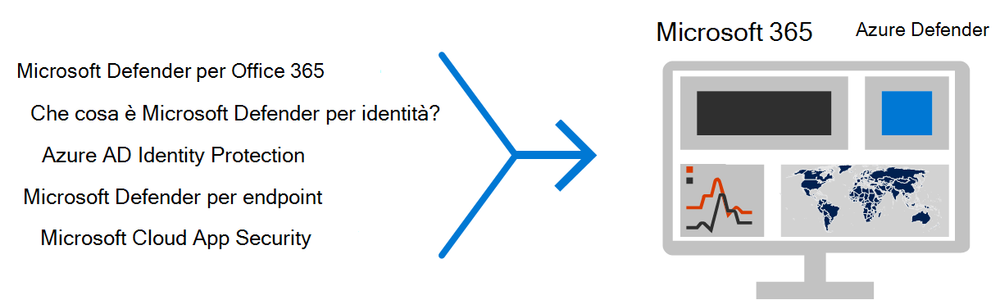
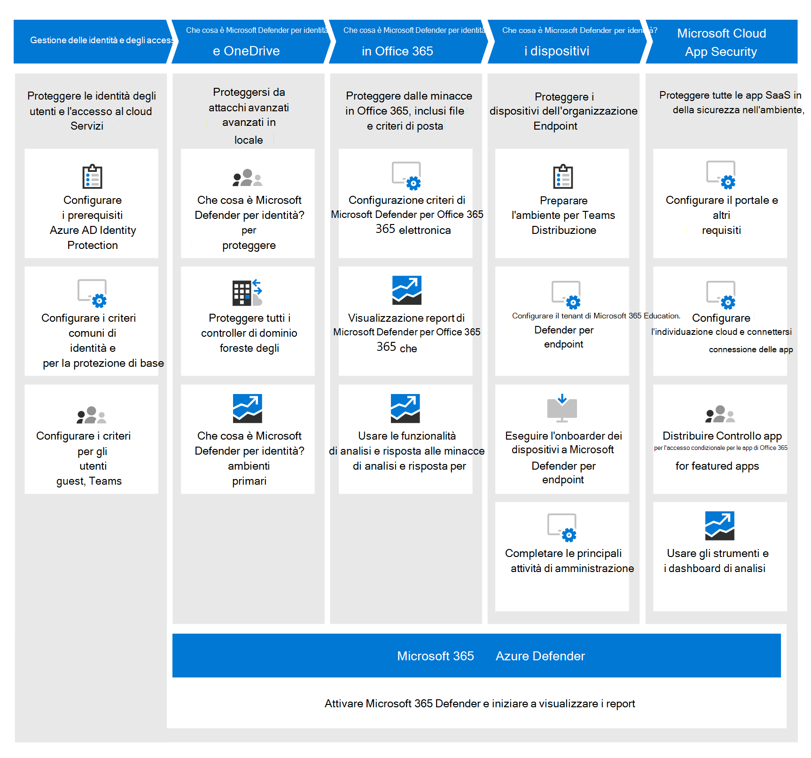

# Distribuire le funzionalità di protezione dalle minacce in Microsoft 365 E5

Questa soluzione descrive potenti funzionalità di protezione dalle minacce in Microsoft 365 E5 e spiega perché la protezione dalle minacce è importante. Leggere questo articolo per ottenere una panoramica della protezione dalle minacce in Microsoft 365 E5 e su come affrontare la configurazione e la configurazione per l'organizzazione.

## Perché la protezione dalle minacce è importante 

[Malware](/windows/security/threat-protection/intelligence/understanding-malware)e attacchi informatici sofisticati, ad esempio minacce [senza file,](/windows/security/threat-protection/intelligence/fileless-threats)sono un evento comune. Le aziende devono proteggere se stessi e i propri clienti con funzionalità di sicurezza IT efficaci. Gli attacchi informatici possono causare problemi importanti per l'organizzazione, dalla perdita di fiducia ai problemi finanziari, ai tempi di inattività che minacciano l'azienda e altro ancora. La protezione dalle minacce è importante, ma può essere difficile determinare dove concentrare il tempo, l'impegno e le risorse dell'organizzazione. Microsoft 365 E5 può essere utile. 

Le soluzioni di sicurezza Microsoft sono integrate nei nostri prodotti e servizi. Le funzionalità di automazione e machine learning riducono il carico dei team di sicurezza per assicurarsi che gli elementi siano indirizzati. Inoltre, la forza delle soluzioni di sicurezza Microsoft si basa su trilioni di segnali che eserciteremo ogni giorno nel [nostro Intelligent Security Graph.](/graph/security-concept-overview) Le soluzioni di sicurezza di Microsoft 365 includono [Microsoft 365 Defender,](../security/defender/microsoft-365-defender.md)una soluzione che riunisce i segnali attraverso la posta elettronica, i dati, i dispositivi e le identità per disegnare un'immagine delle minacce avanzate contro l'organizzazione.

Guardare il video per una panoramica del processo di distribuzione.
  
> [!VIDEO https://www.microsoft.com/videoplayer/embed/RE4vsI7]

## Protezione dalle minacce in Microsoft 365 E5

[Microsoft 365 E5](https://www.microsoft.com/microsoft-365/enterprise-e5-business-software?activetab=pivot%3aoverviewtab) consente di proteggere l'organizzazione con un'intelligence integrata adattiva. Con le funzionalità di protezione dalle minacce in Microsoft 365 E5, è possibile rilevare e analizzare minacce avanzate, identità compromesse e azioni dannose nell'ambiente locale e cloud.

In Microsoft 365 E5 le funzionalità di protezione dalle minacce sono integrate per impostazione predefinita. I segnali di ogni funzionalità aggiungono forza alla capacità complessiva di rilevare e rispondere alle minacce. L'insieme combinato di funzionalità offre la migliore protezione per le organizzazioni, in particolare per le organizzazioni multi-nazionali, rispetto all'esecuzione di prodotti non Microsoft. L'immagine seguente illustra i servizi e le funzionalità di protezione dalle minacce in Microsoft 365 E5 descritti in questo articolo.

Microsoft 365 Defender riunisce i segnali e i dati in un Centro [sicurezza Microsoft 365 unificato.](/microsoft-365/security/defender/overview-security-center) 

> [!div class="mx-imgBorder"]
> 

Nella figura seguente viene illustrato un percorso consigliato per la distribuzione di queste singole funzionalità. 

> [!div class="mx-imgBorder"]
> 

|Soluzione/funzionalità  |Descrizione  |
|---------|---------|
|Autenticazione a più fattori e accesso condizionale     |Proteggere da identità e dispositivi compromessi. Iniziare con questa protezione perché è di base. La configurazione consigliata in questa guida include Azure AD Identity Protection come prerequisito.     |
|Microsoft Defender per identità     |  Una soluzione di sicurezza basata sul cloud che utilizza i segnali di Servizi di dominio Active Directory (AD DS) locali per identificare, rilevare e analizzare minacce avanzate, identità compromesse e azioni insider dannose indirizzate all'organizzazione. Concentrarsi su Microsoft Defender per l'identità in seguito perché protegge l'infrastruttura locale e cloud, non ha dipendenze o prerequisiti e può offrire vantaggi di sicurezza immediati. | 
|Microsoft Defender per Office 365     | Protegge l'organizzazione da minacce dannose poste da messaggi di posta elettronica, collegamenti (URL) e strumenti di collaborazione. Protezioni per malware, phishing, spoofing e altri tipi di attacco. La configurazione di Microsoft Defender per Office 365 è consigliata successivamente perché il controllo delle modifiche, la migrazione delle impostazioni dal sistema in uso e altre considerazioni possono richiedere più tempo per la distribuzione. 
**NOTA:** assicurarsi di configurare le funzionalità di protezione dalle minacce incluse in tutte le sottoscrizioni di Office 365 (Exchange Online Protection).       |
|Microsoft Defender per endpoint    | Una piattaforma di endpoint protection che consente di prevenire, rilevare, analizzare e rispondere alle minacce avanzate.  Defender for Endpoint può richiedere del tempo per la distribuzione, ma la configurazione può essere eseguita in parallelo con altre funzionalità.   |
|Microsoft Cloud App Security     |   Un broker di sicurezza per l'accesso al cloud per l'individuazione, l'indagine e la governance. Puoi abilitare Microsoft Cloud App Security in anticipo per iniziare a raccogliere dati e informazioni dettagliate. L'implementazione di informazioni e altre misure di protezione mirate nelle app SaaS implica la pianificazione e può richiedere più tempo.       | 

> [!TIP]
> Le organizzazioni che dispongono di più team di sicurezza possono implementare queste funzionalità in parallelo. 

## Pianificare la distribuzione della soluzione di protezione dalle minacce

Il diagramma seguente illustra il processo di alto livello per la distribuzione delle funzionalità di protezione dalle minacce. 

Per assicurarsi che l'organizzazione abbia la migliore protezione possibile, configurare e distribuire la soluzione di sicurezza con un processo che include i passaggi seguenti:

1. [Configurare l'autenticazione a più fattori e i criteri di accesso condizionale.](deploy-threat-protection-configure.md#step-1-set-up-multi-factor-authentication-and-conditional-access-policies)
2. [Configurare Microsoft Defender per l'identità](deploy-threat-protection-configure.md#step-2-configure-microsoft-defender-for-identity).
3. [Attivare Microsoft 365 Defender](deploy-threat-protection-configure.md#step-3-turn-on-microsoft-365-defender).
4. [Configurare Defender per Office 365](deploy-threat-protection-configure.md#step-4-configure-microsoft-defender-for-office-365).
5. [Configurare Microsoft Defender per Endpoint](deploy-threat-protection-configure.md#step-5-configure-microsoft-defender-for-endpoint).
6. [Configurare Microsoft Cloud App Security](deploy-threat-protection-configure.md#step-6-configure-microsoft-cloud-app-security).
7. [Monitorare lo stato ed eseguire azioni](deploy-threat-protection-configure.md#step-7-monitor-status-and-take-actions).
8. [Formare gli utenti](deploy-threat-protection-configure.md#step-8-train-users).

Le funzionalità di protezione dalle minacce possono essere configurate in parallelo, quindi se si dispone di più team di sicurezza di rete responsabili di servizi diversi, possono configurare le funzionalità di protezione dell'organizzazione contemporaneamente.

## Passaggio successivo

Continua a [Configurare le funzionalità di protezione dalle minacce in Microsoft 365](deploy-threat-protection-configure.md).

