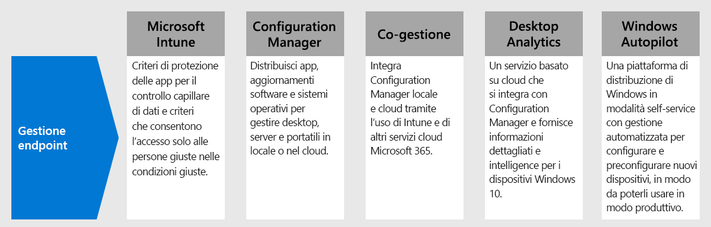

# Passaggio 4.Step 4. Distribuire la gestione degli endpoint per dispositivi, PC e altri endpointDeploy endpoint management for your devices, PCs, and other endpoints

Con i lavoratori remoti, è necessario supportare un numero crescente di dispositivi personali.With remote workers, you need to support a growing number of personal devices. La gestione degli endpoint è un approccio alla sicurezza basato su criteri che richiede che i dispositivi siano conformi a criteri specifici prima che gli venga consentito l'accesso alle risorse.Endpoint management is a policy-based approach to security that requires devices to comply with specific criteria before they are granted access to resources. Microsoft Endpoint Manager offre strumenti moderni per la gestione che garantiscono la sicurezza dei dati sia nel cloud sia in locale.Microsoft Endpoint Manager delivers modern management capabilities to keep your data secure in the cloud and on-premises. 

Endpoint Manager include servizi e strumenti che consentono di gestire dispositivi mobili, computer desktop, macchine virtuali, dispositivi incorporati e server combinando i servizi seguenti, probabilmente già noti e usati.Endpoint Manager provides services and tools for managing mobile devices, desktop computers, virtual machines, embedded devices, and servers by combining the following services you may already know and be using.

## Microsoft IntuneMicrosoft Intune

Microsoft Intune è un servizio basato sul cloud che è incentrato sulla gestione di dispositivi mobili (MDM) e sulla gestione di applicazioni mobili (MAM) incluso in Microsoft 365.Microsoft Intune is a cloud-based service that focuses on mobile device management (MDM) and mobile application management (MAM) that is included with Microsoft 365. 

- **MDM:** per i dispositivi di proprietà dell'organizzazione, è possibile esercitare un controllo completo che include impostazioni, caratteristiche e sicurezza.**MDM:** For organization-owned devices, you can exercise full control including settings, features, and security. I dispositivi sono "registrati" in Intune, dove ricevono criteri di Intune con regole e impostazioni.Devices are "enrolled" in Intune where they receive Intune policies with rules and settings. Ad esempio, è possibile impostare PIN e password, creare una connessione VPN, configurare la protezione contro le minacce e così via.For example, you can set password and PIN requirements, create a VPN connection, set up threat protection, and more.

- **MAM:** i lavoratori remoti potrebbero non voler concedere il controllo completo sui propri dispositivi personali, noti anche come dispositivi di BYOD (bring-your-own).**MAM:** Remote workers might not want you to have full control on their personal devices, also known as bring-your-own device (BYOD) devices. È possibile fornire opzioni ai lavoratori remoti e continuare a proteggere l'organizzazione.You can give your remote workers options and still protect your organization. Ad esempio, i lavoratori remoti possono registrare i propri dispositivi, per avere accesso completo alle risorse dell'organizzazione.For example, remote workers can enroll their devices if they want full access to your organization resources. In alternativa, se desiderano accedere solo alla posta elettronica o a Microsoft Teams, gli utenti possono usare i criteri di protezione delle app che richiedono l'autenticazione a più fattori (MFA) per l'uso di queste app.Or, if these users only want access to email or Microsoft Teams, then use app protection policies that require multi-factor authentication (MFA) to use these apps.

Per altre informazioni, vedere questa [panoramica di Microsoft Intune](https://docs.microsoft.com/intune/fundamentals/what-is-intune).For more information, see this [overview of Microsoft Intune](https://docs.microsoft.com/intune/fundamentals/what-is-intune).

## Configuration ManagerConfiguration Manager

Configuration Manager è una soluzione di gestione locale per gestire desktop, server e computer portatili collegati nella rete aziendale o in Internet.Configuration Manager is an on-premises management solution to manage desktops, servers, and laptops that are on your network or internet-based. Usare Configuration Manager per distribuire app, aggiornamenti software e sistemi operativi.Use Configuration Manager to deploy apps, software updates, and operating systems. È anche possibile monitorare la conformità, eseguire query, intervenire sui client in tempo reale e molto altro ancora.You can also monitor compliance, query and act on clients in real time, and much more. È possibile abilitare la soluzione per il cloud e integrarla con Intune, Azure AD, Microsoft Defender ATP e altri servizi cloud.You can cloud-enable it to integrate with Intune, Azure AD, Microsoft Defender ATP, and other cloud services. 

Per altre informazioni, vedere questa [panoramica di Configuration Manager](https://docs.microsoft.com/mem/configmgr/core/understand/introduction).For more information, see this [overview of Configuration Manager](https://docs.microsoft.com/mem/configmgr/core/understand/introduction).

## Co-gestioneCo-management

La co-gestione integra l'investimento esistente in Configuration Manager locale con il cloud, tramite l'uso di Intune e di altri servizi cloud Microsoft 365.Co-management combines your existing on-premises Configuration Manager investment with the cloud using Intune and other Microsoft 365 cloud services. È possibile scegliere Configuration Manager o Intune come autorità di gestione per carichi di lavoro diversi.You choose whether Configuration Manager or Intune is the management authority for different workload. 

La co-gestione usa funzionalità cloud basate su Intune, tra cui l'accesso condizionale e l'applicazione della conformità del dispositivo.Co-management uses Intune-based cloud features, including Conditional Access and enforcing device compliance. Alcune attività restano in locale, mentre altre vengono eseguite nel cloud.You keep some tasks on-premises, while running other tasks in the cloud.

Per altre informazioni, vedere questa [panoramica della co-gestione](https://docs.microsoft.com/mem/configmgr/comanage/overview).For more information, see this [overview of co-management](https://docs.microsoft.com/mem/configmgr/comanage/overview).

## Desktop AnalyticsDesktop Analytics

Desktop Analytics è un servizio basato sul cloud che si integra con Configuration Manager e fornisce dati analitici e intelligence utili per prendere decisioni informate sui client Windows.Desktop Analytics is a cloud-based service that integrates with Configuration Manager and provides you with insight and intelligence so you can make informed decisions about your Windows clients. Combina i dati dell'organizzazione con i dati aggregati di milioni di dispositivi connessi ai servizi cloud Microsoft.It combines data from your organization with data aggregated from millions of devices connected to Microsoft cloud services. 

Con Desktop Analytics, è possibile:With Desktop Analytics, you can:

- Creare un inventario delle app eseguite nell'organizzazione.Create an inventory of apps running in your organization.
- Valutare la compatibilità delle app con gli aggiornamenti delle caratteristiche più recenti di Windows 10.Assess app compatibility with the latest Windows 10 feature updates.
- Individuare i problemi di compatibilità e ricevere suggerimenti di mitigazione in base alle informazioni sui dati abilitati per il cloud.Identify compatibility issues, and receive mitigation suggestions based on cloud-enabled data insights.
- Creare gruppi pilota che rappresentino l'intera applicazione e le proprietà del driver in un insieme minimo di dispositivi.Create pilot groups that represent the entire application and driver estate across a minimal set of devices.
- Distribuire Windows 10 ai dispositivi pilota e gestiti dalla produzione.Deploy Windows 10 to pilot and production-managed devices.

Per altre informazioni, vedere questa [panoramica di Desktop Analytics](https://docs.microsoft.com/mem/configmgr/desktop-analytics/overview).For more information, see this [overview of Desktop Analytics](https://docs.microsoft.com/mem/configmgr/desktop-analytics/overview)

## Windows AutopilotWindows Autopilot

Windows Autopilot è una piattaforma per la distribuzione di Windows in modalità self-service con gestione automatizzata.Windows Autopilot is a zero-touch, self-service Windows deployment platform. Include una raccolta di tecnologie usate per impostare e preconfigurare nuovi dispositivi, preparandoli per l'uso.It includes a collection of technologies used to set up and pre-configure new devices, getting them ready for productive use. È anche possibile usare Windows Autopilot per reimpostare, riconfigurare e ripristinare i dispositivi.You can also use Windows Autopilot to reset, repurpose and recover devices. 

Windows Autopilot consente al reparto IT di preconfigurare dispositivi gestendo poche infrastrutture o persino nessuna, con un processo semplice e immediato.Windows Autopilot enables an IT department to pre-configure devices with little to no infrastructure to manage, with a process that's easy and simple. 

- Dal punto di vista dell'utente, bastano poche semplici operazioni per rendere il proprio dispositivo pronto per l'uso.From the user's perspective, it only takes a few simple operations to make their device ready to use. 
- Dal punto di vista dell'IT, l'unica interazione richiesta all'utente finale consiste nel connettersi a una rete e verificare le credenziali.From the IT pro's perspective, the only interaction required from the end user is to connect to a network and to verify their credentials.

Per altre informazioni, vedere questa [panoramica di Windows Autopilot](https://docs.microsoft.com/windows/deployment/windows-autopilot/windows-autopilot).For more information, see this [overview of Windows Autopilot](https://docs.microsoft.com/windows/deployment/windows-autopilot/windows-autopilot).

## Risorse amministrative tecniche per la gestione degli endpointAdmin technical resources for endpoint management

- [Il video parte 3 sulla gestione dei dispositivi Windows 10 per i lavoratori remotiThe Part 3 video on managing Windows 10 devices for remote workers](https://resources.techcommunity.microsoft.com/enabling-remote-work/#security)
- [Il video parte 5 sulla gestione dei desktop e browser dell'utente per lavoratori remotiThe Part 5 video on managing user desktops and browsers for remote workers](https://resources.techcommunity.microsoft.com/enabling-remote-work/#security)
- [Distribuzione di un'infrastruttura di mobilità per Microsoft 365Deploy a mobility infrastructure for Microsoft 365](https://docs.microsoft.com/microsoft-365/enterprise/mobility-infrastructure)
- [Come registrare tipi diversi di dispositivi per la gestione di dispositivi mobiliHow to enroll different types of devices for mobile device management](https://docs.microsoft.com/mem/intune/enrollment/device-enrollment)
- [Come formare gli utenti finali su Microsoft IntuneHow to educate your end users about Microsoft Intune](https://docs.microsoft.com/mem/intune/fundamentals/end-user-educate)
 
## Risultati del Passaggio 3Results of Step 3

Si usano le caratteristiche e le funzionalità di Endpoint Manager per gestire dispositivi mobili, computer desktop, macchine virtuali dispositivi incorporati e server.You are using the suite of Endpoint Manager features and capabilities to manage mobile devices, desktop computers, virtual machines, embedded devices, and servers.

## Passaggio successivoNext step

Proseguire con il [Passaggio 5](empower-people-to-work-remotely-teams-productivity-apps.md) per incoraggiare i lavoratori remoti a utilizzare le app di produttività Microsoft 365, come Microsoft Teams.Continue with [Step 5](empower-people-to-work-remotely-teams-productivity-apps.md) to get your remote workers using Microsoft 365 productivity apps such as Microsoft Teams.
