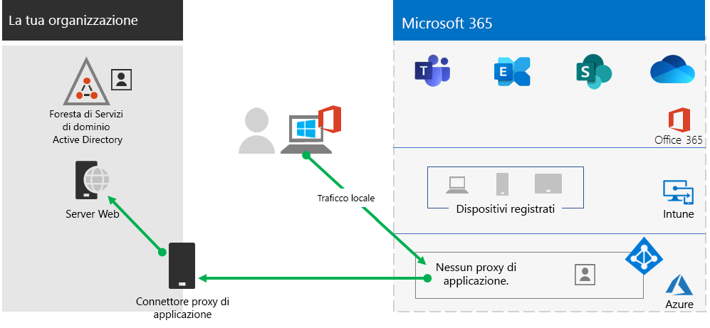

# Passaggio 2. Fornire l'accesso remoto alle app e ai servizi locali.

Se l'organizzazione usa una VPN di accesso remoto, in genere con server VPN nel perimetro della rete e dei client VPN installati nei dispositivi degli utenti, gli utenti possono usare connessioni VPN di accesso remoto per accedere alle app e ai server locali. Tuttavia, potrebbe essere necessario ottimizzare il traffico verso i servizi basati nel cloud di Microsoft 365.

Se gli utenti non scelgono una soluzione VPN, è possibile usare il proxy di applicazione di Azure Active Directory (Azure AD) e la VPN da punto a sito (point-to-site) di Azure per fornire l'accesso, nel caso in cui tutte le app siano basate sul Web.

Ecco le configurazioni principali di accesso remoto:

- Configurazione con soluzione VPN di accesso remoto.
- Configurazione senza soluzione VPN di accesso remoto e uso del computer personale da parte dei lavoratori remoti.
- Configurazione senza soluzione VPN di accesso remoto, bensì con identità ibrida e accesso remoto necessario solo alle app locali basate sul Web.
- Configurazione senza soluzione VPN di accesso remoto e accesso necessario alle app locali, alcuni delle quali non basate sul Web.

Vedere questo diagramma di flusso per le opzioni di configurazione di accesso remoto descritte in questo articolo.

Grazie alle connessioni di accesso remoto, è anche possibile usare il [Desktop remoto](https://support.microsoft.com/help/4028379/windows-10-how-to-use-remote-desktop) per connettere gli utenti a un PC locale. Ad esempio, un lavoratore remoto può usare il Desktop remoto per connettersi al PC dell'ufficio dal proprio dispositivo Windows, iOS o Android. Una volta che il lavoratore si sarà connesso in remoto, sarà come lavorare davanti al proprio PC in ufficio.

## Ottimizzare le prestazioni per i client VPN di accesso remoto verso i servizi basati nel cloud di Microsoft 365

Se i lavoratori remoti usano un client VPN tradizionale per ottenere l'accesso remoto alla rete dell'organizzazione, verificare che nel client VPN vi sia la modalità split tunneling.

Senza split tunneling, tutto il traffico di lavoro remoto viene inviato attraverso la connessione VPN, tramite la quale viene poi inoltrato ai dispositivi perimetrali dell'organizzazione per essere quindi elaborato e inviato su Internet.

Il traffico di Microsoft 365 deve avere un percorso indiretto nell'organizzazione, che potrebbe essere inoltrato a un punto di ingresso di rete Microsoft lontano dalla posizione fisica del client VPN. Questo percorso indiretto aggiunge latenza al traffico di rete e riduce le prestazioni complessive. 

Grazie alla modalità split tunneling, è possibile configurare il client VPN per escludere tipi specifici di traffico da inviare tramite la connessione VPN alla rete dell'organizzazione.

Per ottimizzare l'accesso alle risorse cloud di Microsoft 365, configurare i client VPN di split tunneling per escludere il traffico agli endpoint di Microsoft 365 di categoria **Ottimizzazione** tramite connessione VPN. Per altre informazioni, vedere [Categorie di endpoint di Office 365](../enterprise/microsoft-365-network-connectivity-principles.md#new-office-365-endpoint-categories). Consultare l'[elenco](../enterprise/urls-and-ip-address-ranges.md) degli endpoint di categoria Ottimizzazione.

Ecco il conseguente flusso di traffico, in cui la maggior parte del traffico per le app cloud di Microsoft 365 evita la connessione VPN.

Ciò consente al client VPN di inviare e ricevere il traffico di servizi cloud Microsoft 365 rilevanti direttamente tramite Internet e verso il punto di ingresso più vicino alla rete Microsoft.

Per informazioni dettagliate e per materiale sussidiario, consultare [Ottimizzare la connettività di Office 365 per gli utenti remoti tramite split tunneling per VPN](../enterprise/microsoft-365-vpn-split-tunnel.md).

## Distribuire l'accesso remoto quando si dispone solo di app Web e di un'identità ibrida

Se i lavoratori remoti non usano un client VPN tradizionale e gli account utente e i gruppi locali sono sincronizzati con Azure AD, è possibile usare il proxy di applicazione di Azure AD per fornire accesso remoto sicuro alle applicazioni basate sul Web ospitate nei server locali. Le applicazioni basate sul Web includono i siti di SharePoint Server, i server di Outlook Web Access o qualsiasi altra applicazione aziendale basata sul Web. 

Di seguito sono elencati i componenti del proxy di applicazione di Azure AD.

Per altre informazioni, vedere la [panoramica sul proxy di applicazione di Azure AD](/azure/active-directory/manage-apps/application-proxy).

>[!Note]
>Il proxy di applicazione di Azure AD non è incluso in un abbonamento a Microsoft 365. È necessario pagare per l'uso con un abbonamento di Azure diverso.
>

## Distribuire l'accesso remoto quando le app non sono solo app Web

Se i lavoratori remoti non usano un client VPN tradizionale e le app non sono basate sul Web, è possibile usare una VPN da punto a sito (point-to-site) P2S di Azure.

Una VPN da punto a sito stabilisce una connessione sicura dal dispositivo di un lavoratore remoto alla rete dell'organizzazione tramite una rete virtuale di Azure. 

Per altre informazioni, vedere la [panoramica su VPN da punto a sito](/azure/vpn-gateway/point-to-site-about).

>[!Note]
>VPN de punto a sito di Azure non è incluso in un abbonamento a Microsoft 365. È necessario pagare per l'uso con un abbonamento di Azure diverso.
>

## Distribuire il Desktop virtuale Windows per fornire l'accesso remoto ai lavoratori remoti che usano dispositivi personali 

Per assistere i lavoratori remoti che possono usare solo i propri dispositivi personali e non gestiti, usare il Desktop virtuale Windows in Azure con lo scopo di creare e assegnare i desktop virtuali che gli utenti possono usare da casa. I PC virtualizzati possono agire esattamente come i PC connessi alla rete dell’organizzazione.

Per altre informazioni, vedere la [panoramica sul Desktop virtuale Windows](/azure/virtual-desktop/overview). 

>[!Note]
>Windows Virtual Desktop non è incluso in un abbonamento a Microsoft 365. È necessario pagare per l'uso con un abbonamento di Azure diverso.
>

## Proteggere le connessioni dei servizi del desktop remoto con il gateway Servizi del desktop remoto

Se si usa Servizi del desktop remoto (SDR) per consentire ai dipendenti di entrare in un computer con Windows in una rete locale, è consigliabile usare un gateway di Servizi del desktop remoto di Microsoft nella rete perimetrale. Il gateway usa il protocollo (TLS) Transport Layer Security per crittografare le comunicazioni, ed evita che il computer locale che ospita i RDS sia direttamente connesso a Internet.

Per altre informazioni, vedere [questo articolo](https://www.microsoft.com/security/blog/2020/04/16/security-guidance-remote-desktop-adoption/).

## Risorse tecniche e amministrative per l’accesso remoto

- [Come ottimizzare rapidamente il traffico di Office 365 per il personale remoto riducendo il carico nell'infrastruttura](https://techcommunity.microsoft.com/t5/office-365-blog/how-to-quickly-optimize-office-365-traffic-for-remote-staff-amp/ba-p/1214571).
- [Ottimizzare la connettività di Office 365 per gli utenti remoti tramite split tunneling VPN](../enterprise/microsoft-365-vpn-split-tunnel.md)

## Risultati del passaggio 2

Dopo la distribuzione di una soluzione di accesso remoto per i lavoratori remoti:

| Configurazione di accesso remoto | Risultati |
|:-------|:-----|
| È disponibile una soluzione VPN di accesso remoto | Il client VPN di accesso remoto è stato configurato per la modalità split tunneling e per la categoria Ottimizzazione degli endpoint di Microsoft 365. |
| La soluzione VPN di accesso remoto non è disponibile ed è necessario l'accesso remoto solo alle app locali basate sul Web | Il proxy di applicazione di Azure è stato configurato. |
| La soluzione VPN di accesso remoto non è disponibile ed è necessario l’accesso alle app locali, alcune delle quali non basate sul Web | La rete VPN da punto a sito di Azure è stata configurata. |
| I lavoratori remoti usano i propri dispositivi personali da casa | Il Desktop virtuale Windows è stato configurato. |
| I lavoratori remoti usano connessioni di SDR per sistemi locali | Il gateway di Servizi del desktop remoto è stato distribuito nella rete perimetrale. |
|||

## Passaggio successivo

Proseguire con il [passaggio 3](empower-people-to-work-remotely-security-compliance.md) per distribuire i servizi di sicurezza e conformità di Microsoft 365 per proteggere le app, i dati e i dispositivi.