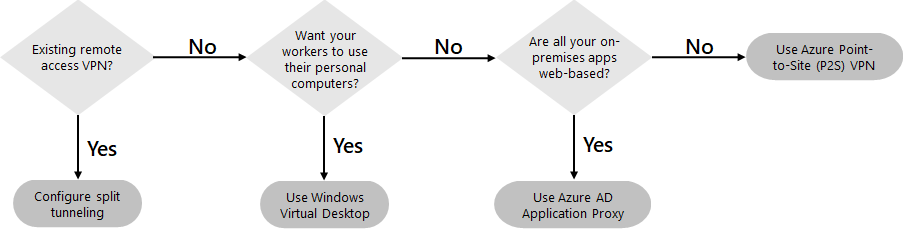
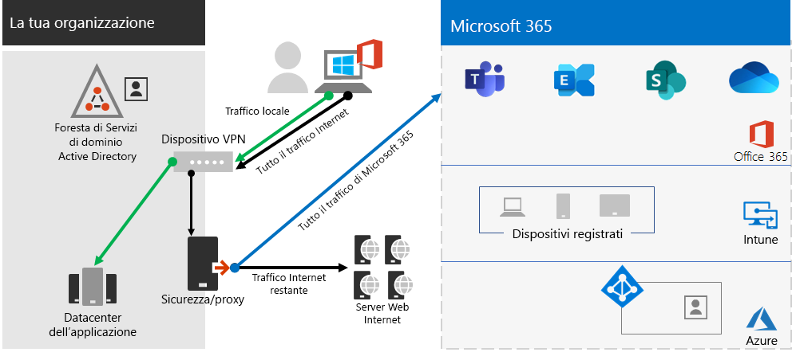

# Passaggio 2.Step 2. Fornire l'accesso remoto alle app e ai servizi locali.Provide remote access to on-premises apps and services

Se l'organizzazione usa una VPN di accesso remoto, in genere con server VPN nel perimetro della rete e dei client VPN installati nei dispositivi degli utenti, gli utenti possono usare connessioni VPN di accesso remoto per accedere alle app e ai server locali.If your organization uses a remote access VPN solution, typically with VPN servers on the edge of your network and VPN clients installed on your users' devices, your users can use remote access VPN connections to access on-premises apps and servers. Tuttavia, potrebbe essere necessario ottimizzare il traffico verso i servizi basati nel cloud di Microsoft 365.But you may need to optimize traffic to Microsoft 365 cloud-based services.

Se gli utenti non scelgono una soluzione VPN, è possibile usare il proxy di applicazione di Azure Active Directory (Azure AD) e la VPN da punto a sito (point-to-site) di Azure per fornire l'accesso, nel caso in cui tutte le app siano basate sul Web.If your users do not use a VPN solution, you can use Azure Active Directory (Azure AD) Application Proxy and Azure Point-to-Site (P2S) VPN to provide access, depending on whether all your apps are web-based.

Ecco le configurazioni principali di accesso remoto:Here are the primary configurations for remote access:

- Configurazione con soluzione VPN di accesso remoto.You are already using a remote access VPN solution.
- Configurazione senza soluzione VPN di accesso remoto e uso del computer personale da parte dei lavoratori remoti.You are not using a remote access VPN solution and you want your remote workers to use their personal computers.
- Configurazione senza soluzione VPN di accesso remoto, bensì con identità ibrida e accesso remoto necessario solo alle app locali basate sul Web.You are not using a remote access VPN solution, you have hybrid identity, and you need remote access only to on-premises web-based apps.
- Configurazione senza soluzione VPN di accesso remoto e accesso necessario alle app locali, alcuni delle quali non basate sul Web.You are not using a remote access VPN solution and you need access to on-premises apps, some of which are not web-based.

Vedere questo diagramma di flusso per le opzioni di configurazione di accesso remoto descritte in questo articolo.See this flowchart for the remote access configuration options discussed in this article.

Grazie alle connessioni di accesso remoto, è anche possibile usare il [Desktop remoto](https://support.microsoft.com/help/4028379/windows-10-how-to-use-remote-desktop) per connettere gli utenti a un PC locale.With remote access connections, you can also use [Remote Desktop](https://support.microsoft.com/help/4028379/windows-10-how-to-use-remote-desktop) to connect your users to an on-premises PC. Ad esempio, un lavoratore remoto può usare il Desktop remoto per connettersi al PC dell'ufficio dal proprio dispositivo Windows, iOS o Android.For example, a remote worker can use Remote Desktop to connect to the PC in their office from their Windows, iOS, or Android device. Una volta che il lavoratore si sarà connesso in remoto, sarà come lavorare davanti al proprio PC in ufficio.Once they are remotely connected, they can use it as if they were sitting in front of it.

## Ottimizzare le prestazioni per i client VPN di accesso remoto verso i servizi basati nel cloud di Microsoft 365Optimize performance for remote access VPN clients to Microsoft 365 cloud services

Se i lavoratori remoti usano un client VPN tradizionale per ottenere l'accesso remoto alla rete dell'organizzazione, verificare che nel client VPN vi sia la modalità split tunneling.If your remote workers are using a traditional VPN client to obtain remote access to your organization network, verify that the VPN client has split tunneling support.

Senza split tunneling, tutto il traffico di lavoro remoto viene inviato attraverso la connessione VPN, tramite la quale viene poi inoltrato ai dispositivi perimetrali dell'organizzazione per essere quindi elaborato e inviato su Internet.Without split tunneling, all of your remote work traffic gets sent across the VPN connection, where it must be forwarded to your organization’s edge devices, get processed, and then sent on the Internet.

Il traffico di Microsoft 365 deve avere un percorso indiretto nell'organizzazione, che potrebbe essere inoltrato a un punto di ingresso di rete Microsoft lontano dalla posizione fisica del client VPN.Microsoft 365 traffic must take an indirect route through your organization, which could be forwarded to a Microsoft network entry point far away from the VPN client’s physical location. Questo percorso indiretto aggiunge latenza al traffico di rete e riduce le prestazioni complessive.This indirect path adds latency to the network traffic and decreases overall performance. 

Grazie alla modalità split tunneling, è possibile configurare il client VPN per escludere tipi specifici di traffico da inviare tramite la connessione VPN alla rete dell'organizzazione.With split tunneling, you can configure your VPN client to exclude specific types of traffic from being sent over the VPN connection to the organization network.

Per ottimizzare l'accesso alle risorse cloud di Microsoft 365, configurare i client VPN di split tunneling per escludere il traffico agli endpoint di Microsoft 365 di categoria **Ottimizzazione** tramite connessione VPN.To optimize access to Microsoft 365 cloud resources, configure your split tunneling VPN clients to exclude traffic to the **Optimize** category Microsoft 365 endpoints over the VPN connection. Per altre informazioni, vedere [Categorie di endpoint di Office 365](https://docs.microsoft.com/microsoft-365/enterprise/microsoft-365-network-connectivity-principles#new-office-365-endpoint-categories).For more information, see [Office 365 endpoint categories](https://docs.microsoft.com/microsoft-365/enterprise/microsoft-365-network-connectivity-principles#new-office-365-endpoint-categories). Consultare l'[elenco](https://docs.microsoft.com/microsoft-365/enterprise/urls-and-ip-address-ranges) degli endpoint di categoria Ottimizzazione.See [this list](https://docs.microsoft.com/microsoft-365/enterprise/urls-and-ip-address-ranges) of Optimize category endpoints.

Ecco il conseguente flusso di traffico, in cui la maggior parte del traffico per le app cloud di Microsoft 365 evita la connessione VPN.Here is the resulting traffic flow, in which most of the traffic to Microsoft 365 cloud apps bypass the VPN connection.

Ciò consente al client VPN di inviare e ricevere il traffico di servizi cloud Microsoft 365 rilevanti direttamente tramite Internet e verso il punto di ingresso più vicino alla rete Microsoft.This allows the VPN client to send and receive crucial Microsoft 365 cloud service traffic directly over the Internet and to the nearest entry point into the Microsoft network.

Per informazioni dettagliate e per materiale sussidiario, consultare [Ottimizzare la connettività di Office 365 per gli utenti remoti tramite split tunneling per VPN](https://docs.microsoft.com/microsoft-365/enterprise/microsoft-365-vpn-split-tunnel??).For more information and guidance, see [Optimize Office 365 connectivity for remote users using VPN split tunneling](https://docs.microsoft.com/microsoft-365/enterprise/microsoft-365-vpn-split-tunnel??).

## Distribuire l'accesso remoto quando si dispone solo di app Web e di un'identità ibridaDeploy remote access when all your apps are web apps and you have hybrid identity

Se i lavoratori remoti non usano un client VPN tradizionale e gli account utente e i gruppi locali sono sincronizzati con Azure AD, è possibile usare il proxy di applicazione di Azure AD per fornire accesso remoto sicuro alle applicazioni basate sul Web ospitate nei server locali.If your remote workers are not using a traditional VPN client and your on-premises user accounts and groups are synchronized with Azure AD, you can use Azure AD Application Proxy to provide secure remote access for web-based applications hosted on on-premises servers. Le applicazioni basate sul Web includono i siti di SharePoint Server, i server di Outlook Web Access o qualsiasi altra applicazione aziendale basata sul Web.Web-based applications include SharePoint Server sites, Outlook Web Access servers, or any other web-based line of business applications. 

Di seguito sono elencati i componenti del proxy di applicazione di Azure AD.Here are the components of Azure AD Application Proxy.

Per altre informazioni, vedere la [panoramica sul proxy di applicazione di Azure AD](https://docs.microsoft.com/azure/active-directory/manage-apps/application-proxy).For more information, see this [overview of Azure AD Application Proxy](https://docs.microsoft.com/azure/active-directory/manage-apps/application-proxy).

>[!Note]
>Il proxy di applicazione di Azure AD non è incluso in un abbonamento a Microsoft 365.Azure AD Application Proxy is not included with a Microsoft 365 subscription. È necessario pagare per l'uso con un abbonamento di Azure diverso.You must pay for usage with a separate Azure subscription.
>

## Distribuire l'accesso remoto quando le app non sono solo app WebDeploy remote access when not all your apps are web apps

Se i lavoratori remoti non usano un client VPN tradizionale e le app non sono basate sul Web, è possibile usare una VPN da punto a sito (point-to-site) P2S di Azure.If your remote workers are not using a traditional VPN client and you have apps that are not web-based, you can use an Azure Point-to-Site (P2S) VPN.

Una VPN da punto a sito stabilisce una connessione sicura dal dispositivo di un lavoratore remoto alla rete dell'organizzazione tramite una rete virtuale di Azure.A P2S VPN connection creates a secure connection from a remote worker’s device to your organization network through an Azure virtual network. 

Per altre informazioni, vedere la [panoramica su VPN da punto a sito](https://docs.microsoft.com/azure/vpn-gateway/point-to-site-about).For more information, see this [overview of P2S VPN](https://docs.microsoft.com/azure/vpn-gateway/point-to-site-about).

>[!Note]
>VPN de punto a sito di Azure non è incluso in un abbonamento a Microsoft 365.Azure P2S VPN is not included with a Microsoft 365 subscription. È necessario pagare per l'uso con un abbonamento di Azure diverso.You must pay for usage with a separate Azure subscription.
>

## Distribuire il Desktop virtuale Windows per fornire l'accesso remoto ai lavoratori remoti che usano dispositivi personaliDeploy Windows Virtual Desktop to provide remote access for remote workers using personal devices 

Per assistere i lavoratori remoti che possono usare solo i propri dispositivi personali e non gestiti, usare il Desktop virtuale Windows in Azure con lo scopo di creare e assegnare i desktop virtuali che gli utenti possono usare da casa.To support remote workers who can only use their personal and unmanaged devices, use Windows Virtual Desktop in Azure to create and allocate virtual desktops for your users to use from home. I PC virtualizzati possono agire esattamente come i PC connessi alla rete dell’organizzazione.Virtualized PCs can act just like PCs connected to your organization network.

Per altre informazioni, vedere la [panoramica sul Desktop virtuale Windows](https://docs.microsoft.com/azure/virtual-desktop/overview).For more information, see this [overview of Windows Virtual Desktop](https://docs.microsoft.com/azure/virtual-desktop/overview). 

>[!Note]
>Windows Virtual Desktop non è incluso in un abbonamento a Microsoft 365.Windows Virtual Desktop is not included with a Microsoft 365 subscription. È necessario pagare per l'uso con un abbonamento di Azure diverso.You must pay for usage with a separate Azure subscription.
>

## Proteggere le connessioni dei servizi del desktop remoto con il gateway Servizi del desktop remotoProtect your Remote Desktop Services connections with the Remote Desktop Services Gateway

Se si usa Servizi del desktop remoto (SDR) per consentire ai dipendenti di entrare in un computer con Windows in una rete locale, è consigliabile usare un gateway di Servizi del desktop remoto di Microsoft nella rete perimetrale.If you are using Remote Desktop Services (RDS) to allow employees to connect into Windows-based computers on your on-premises network, you should use a Microsoft Remote Desktop Services gateway in your edge network. Il gateway usa il protocollo (TLS) Transport Layer Security per crittografare le comunicazioni, ed evita che il computer locale che ospita i RDS sia direttamente connesso a Internet.The gateway uses Transport Layer Security (TLS) to encrypt traffic and prevents the on-premises computer hosting RDS from being directly exposed to the Internet.

Per altre informazioni, vedere [questo articolo](https://www.microsoft.com/security/blog/2020/04/16/security-guidance-remote-desktop-adoption/).See [this article](https://www.microsoft.com/security/blog/2020/04/16/security-guidance-remote-desktop-adoption/) for more information.

## Risorse tecniche e amministrative per l’accesso remotoAdmin technical resources for remote access

- [Come ottimizzare rapidamente il traffico di Office 365 per il personale remoto riducendo il carico nell'infrastruttura](https://techcommunity.microsoft.com/t5/office-365-blog/how-to-quickly-optimize-office-365-traffic-for-remote-staff-amp/ba-p/1214571).[How to quickly optimize Office 365 traffic for remote staff & reduce the load on your infrastructure](https://techcommunity.microsoft.com/t5/office-365-blog/how-to-quickly-optimize-office-365-traffic-for-remote-staff-amp/ba-p/1214571)
- [Ottimizzare la connettività di Office 365 per gli utenti remoti tramite split tunneling VPNOptimize Office 365 connectivity for remote users using VPN split tunneling](https://docs.microsoft.com/microsoft-365/enterprise/microsoft-365-vpn-split-tunnel?)

## Risultati del passaggio 2Results of Step 2

Dopo la distribuzione di una soluzione di accesso remoto per i lavoratori remoti:After deployment of a remote access solution for your remote workers:

| Configurazione di accesso remotoRemote access configuration | RisultatiResults |
|:-------|:-----|
| È disponibile una soluzione VPN di accesso remotoA remote access VPN solution is in place | Il client VPN di accesso remoto è stato configurato per la modalità split tunneling e per la categoria Ottimizzazione degli endpoint di Microsoft 365.You have configured your remote access VPN client for split tunneling and for the Optimize category of Microsoft 365 endpoints. |
| La soluzione VPN di accesso remoto non è disponibile ed è necessario l'accesso remoto solo alle app locali basate sul WebNo remote access VPN solution and you need remote access only to on-premises web-based apps | Il proxy di applicazione di Azure è stato configurato.You have configured Azure Application Proxy. |
| La soluzione VPN di accesso remoto non è disponibile ed è necessario l’accesso alle app locali, alcune delle quali non basate sul WebNo remote access VPN solution and you need access to on-premises apps, some of which are not web-based | La rete VPN da punto a sito di Azure è stata configurata.You have configured Azure P2S VPN. |
| I lavoratori remoti usano i propri dispositivi personali da casaRemote workers are using their personal devices from home | Il Desktop virtuale Windows è stato configurato.You have configured Windows Virtual Desktop. |
| I lavoratori remoti usano connessioni di SDR per sistemi localiRemote workers are using RDS connections to on-premises systems | Il gateway di Servizi del desktop remoto è stato distribuito nella rete perimetrale.You have deployed a Remote Desktop Services gateway in your edge network. |
|||

## Passaggio successivoNext step

Proseguire con il [passaggio 3](empower-people-to-work-remotely-security-compliance.md) per distribuire i servizi di sicurezza e conformità di Microsoft 365 per proteggere le app, i dati e i dispositivi.Continue with [Step 3](empower-people-to-work-remotely-security-compliance.md) to deploy Microsoft 365 security and compliance services to protect your apps, data, and devices.

