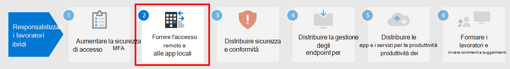

# Passaggio 1.Step 1. Aumentare la sicurezza di accesso per i lavoratori remoti con la MFA.Increase sign-in security for remote workers with MFA

Per aumentare la sicurezza degli accessi dei lavoratori remoti, utilizzare l'autenticazione a più fattori (MFA).To increase the security of sign-ins of your remote workers, use multi-factor authentication (MFA). La MFA richiede che gli accessi utente siano soggetti a un'ulteriore verifica oltre alla password dell'account utente.MFA requires that user sign-ins be subject to an additional verification beyond the user account password. Anche se un utente malintenzionato determina una password dell'account utente, deve anche essere in grado di rispondere a un'ulteriore verifica, ad esempio un SMS inviato a uno smartphone prima che venga concesso l'accesso.Even if a malicious user determines a user account password, they must also be able to respond to an additional verification, such as a text message sent to a smartphone before access is granted.

Per tutti gli utenti, inclusi i lavoratori remoti e in particolare gli amministratori, Microsoft consiglia vivamente la MFA.For all users, including remote workers and especially admins, Microsoft strongly recommends MFA.

Sono disponibili tre modi per richiedere agli utenti di utilizzare la MFA in base al piano Microsoft 365.There are three ways to require your users to use MFA based on your Microsoft 365 plan.

|PianoPlan  |ConsiglioRecommendation  |
|---------|---------|
|Tutti i piani di Microsoft 365 (senza licenze di Azure AD Premium P1 o P2)All Microsoft 365 plans (without Azure AD Premium P1 or P2 licenses)     |[Abilitare le impostazioni predefinite di sicurezza in Azure AD](/azure/active-directory/fundamentals/concept-fundamentals-security-defaults).[Enable Security defaults in Azure AD](/azure/active-directory/fundamentals/concept-fundamentals-security-defaults). Le impostazioni predefinite di sicurezza in Azure AD includono la MFA per utenti e amministratori.Security defaults in Azure AD include MFA for users and administrators.   |
|Microsoft 365 E3 (include le licenze di Azure AD Premium P1)Microsoft 365 E3 (includes Azure AD Premium P1 licenses)     | Usare i [criteri comuni di accesso condizionale](/azure/active-directory/conditional-access/concept-conditional-access-policy-common) per configurare i criteri seguenti:Use [Common Conditional Access policies](/azure/active-directory/conditional-access/concept-conditional-access-policy-common) to configure the following policies:  - [Richiedere la MFA per amministratori](/azure/active-directory/conditional-access/howto-conditional-access-policy-admin-mfa)- [Require MFA for administrators](/azure/active-directory/conditional-access/howto-conditional-access-policy-admin-mfa)  - [Richiedere la MFA per tutti gli utenti](/azure/active-directory/conditional-access/howto-conditional-access-policy-all-users-mfa)- [Require MFA for all users](/azure/active-directory/conditional-access/howto-conditional-access-policy-all-users-mfa)   - [Bloccare l'autenticazione legacy](/azure/active-directory/conditional-access/howto-conditional-access-policy-block-legacy)- [Block legacy authentication](/azure/active-directory/conditional-access/howto-conditional-access-policy-block-legacy)       |
|Microsoft 365 E5 (include le licenze di Azure AD Premium P2)Microsoft 365 E5 (includes Azure AD Premium P2 licenses)     | Sfruttando Azure AD Identity Protection, iniziare a implementare il [set raccomandato di accesso condizionale e criteri correlati](../security/defender-365-security/identity-access-policies.md) di Microsoft creando questi criteri:Taking advantage of Azure AD Identity Protection, begin to implement Microsoft's [recommended set of Conditional Access and related policies](../security/defender-365-security/identity-access-policies.md) by creating these policies:  - [Richiedere la MFA quando il rischio di accesso è considerato *medio* o *elevato*](../security/defender-365-security/identity-access-policies.md#require-mfa-based-on-sign-in-risk)- [Require MFA when sign-in risk is medium or high](../security/defender-365-security/identity-access-policies.md#require-mfa-based-on-sign-in-risk)  - [Bloccare i client che non supportano l'autenticazione moderna](../security/defender-365-security/identity-access-policies.md#block-clients-that-dont-support-multi-factor)- [Block clients that don't support modern authentication](../security/defender-365-security/identity-access-policies.md#block-clients-that-dont-support-multi-factor) - [Gli utenti a rischio elevato devono modificare la password](../security/defender-365-security/identity-access-policies.md#high-risk-users-must-change-password)- [High risk users must change password](../security/defender-365-security/identity-access-policies.md#high-risk-users-must-change-password)       |
| | |

## Impostazioni predefinite per la sicurezzaSecurity defaults

Le impostazioni predefinite di sicurezza sono una nuova funzionalità per gli abbonamenti a pagamento o di valutazione di Microsoft 365 e Office 365 creati dopo il 21 ottobre 2019.Security defaults is a new feature for Microsoft 365 and Office 365 paid or trial subscriptions created after October 21, 2019. Questi abbonamenti hanno impostazioni predefinite di sicurezza attivate, che ***richiedono a tutti gli utenti di utilizzare la MFA con l'app Microsoft Authenticator***.These subscriptions have security defaults turned on, which ***requires all of your users to use MFA with the Microsoft Authenticator app***.
 
Gli utenti hanno 14 giorni per registrarsi per la MFA con l'app Microsoft Authenticator dai propri smartphone, periodo che inizia dalla prima volta che accedono dopo aver abilitato le impostazioni predefinite di sicurezza.Users have 14 days to register for MFA with the Microsoft Authenticator app from their smart phones, which begins from the first time they sign in after security defaults has been enabled. Trascorsi 14 giorni, l'utente non sarà in grado di accedere fino al completamento della registrazione della MFA.After 14 days have passed, the user won't be able to sign in until MFA registration is completed.

Le impostazioni di sicurezza predefinite garantiscono che tutte le organizzazioni dispongano di un livello base di sicurezza per l'accesso degli utenti abilitato per impostazione predefinita.Security defaults ensure that all organizations have a basic level of security for user sign-in that is enabled by default. È possibile disabilitare le impostazioni predefinite di sicurezza a favore della MFA con criteri di accesso condizionale o per singoli account.You can disable security defaults in favor of MFA with Conditional Access policies or for individual accounts.

Per altre informazioni, vedere questa [panoramica delle impostazioni predefinite di sicurezza](/azure/active-directory/fundamentals/concept-fundamentals-security-defaults).For more information, see this [overview of security defaults](/azure/active-directory/fundamentals/concept-fundamentals-security-defaults).

## Criteri di accesso condizionaleConditional Access policies

I criteri di accesso condizionale sono un insieme di regole che specificano le condizioni in base alle quali gli accessi vengono valutati e consentiti.Conditional Access policies are a set of rules that specify the conditions under which sign-ins are evaluated and allowed. Ad esempio, è possibile creare un criterio di accesso condizionale che indichi:For example, you can create a Conditional Access policy that states:

- Se il nome dell'account utente corrisponde a un membro di un gruppo per utenti a cui sono assegnati i ruoli di amministratore di Exchange, utenti, password, sicurezza, SharePoint o globale, richiedere la MFA prima di consentire l'accesso.If the user account name is a member of a group for users that are assigned the Exchange, user, password, security, SharePoint, or global administrator roles, require MFA before allowing access.

Questo criterio consente di richiedere l'autenticazione a più fattori in base all'appartenenza al gruppo, anziché configurare i singoli account utente per l'autenticazione a più fattori quando vengono assegnati o non assegnati tramite questi ruoli di amministratore.This policy allows you to require MFA based on group membership, rather than trying to configure individual user accounts for MFA when they are assigned or unassigned from these administrator roles.

È inoltre anche utilizzare i criteri di accesso condizionale per funzionalità più avanzate, come la necessità di eseguire l'accesso da un dispositivo conforme, come il proprio portatile con Windows 10.You can also use Conditional Access policies for more advanced capabilities, such as requiring that the sign-in is done from a compliant device, such as your laptop running Windows 10.

L'accesso condizionale richiede licenze di Azure AD Premium P1, che sono incluse con Microsoft 365 E3 ed E5.Conditional Access requires Azure AD Premium P1 licenses, which are included with Microsoft 365 E3 and E5.

Per altre informazioni, vedere questa [panoramica dell'accesso condizionale](/azure/active-directory/conditional-access/overview).For more information, see this [overview of Conditional Access](/azure/active-directory/conditional-access/overview).

## Supporto di Azure AD Identity ProtectionAzure AD Identity Protection support

Con Azure AD Identity Protection è possibile creare un criterio di accesso condizionale aggiuntivo che indichi:With Azure AD Identity Protection, you can create an additional Conditional Access policy that states:

- Se il rischio di accesso corrisponde a medio o alto, è richiesta la MFA.If the risk of the sign-in is determined to be medium or high, require MFA.

Azure AD Identity Protection richiede licenze di Azure AD Premium P2, che sono incluse in Microsoft 365 E5.Azure AD Identity Protection requires Azure AD Premium P2 licenses, which are included with Microsoft 365 E5.

Per altre informazioni, vedere [Accesso condizionale basato sul rischio](/azure/active-directory/conditional-access/howto-conditional-access-policy-risk#require-mfa-medium-or-high-sign-in-risk-users).For more information, see [Risk-based Conditional Access](/azure/active-directory/conditional-access/howto-conditional-access-policy-risk#require-mfa-medium-or-high-sign-in-risk-users).

Tramite Azure AD Identity Protection è anche possibile creare un criterio per chiedere agli utenti di iscriversi per l'autenticazione a più fattori.With Azure AD Identity Protection, you can also create a policy to require your users to register for MFA. Per altre informazioni, vedere [Configurare i criteri di registrazione dell'autenticazione a più fattori di Azure](/azure/active-directory/identity-protection/howto-identity-protection-configure-mfa-policy)For more information, see [Configure the Azure AD Multi-Factor Authentication registration policy](/azure/active-directory/identity-protection/howto-identity-protection-configure-mfa-policy)

## Usare questi metodi insiemeUsing these methods together

Tenere presente quanto segue:Keep the following in mind:

- Non è possibile abilitare le impostazioni predefinite di sicurezza se sono abilitati criteri di accesso condizionale.You cannot enable security defaults if you have any Conditional Access policies enabled.
- Non è possibile abilitare alcun criterio di accesso condizionale se sono abilitate le impostazioni predefinite di sicurezza.You cannot enable any Conditional Access policies if you have security defaults enabled.

Se le impostazioni predefinite di sicurezza sono abilitate, a tutti i nuovi utenti viene richiesta la registrazione della MFA e l'utilizzo dell'app Microsoft Authenticator.If security defaults are enabled, all new users are prompted for MFA registration and the use of the Microsoft Authenticator app. 

Questa tabella mostra i risultati dell'abilitazione della MFA con impostazioni predefinite di sicurezza e criteri di accesso condizionale.This table shows the results of enabling MFA with security defaults and Conditional Access policies.

| MetodoMethod | AbilitatoEnabled | DisattivatoDisabled | Metodo di autenticazione aggiuntivoAdditional authentication method |
|:-------|:-----|:-------|:-------|
| **Impostazioni predefinite per la sicurezza****Security defaults**  | Non è possibile utilizzare i criteri di accesso condizionaleCan’t use Conditional Access policies | È possibile utilizzare i criteri di accesso condizionaleCan use Conditional Access policies | App Microsoft AuthenticatorMicrosoft Authenticator app |
| **Criteri di accesso condizionale****Conditional Access policies** | Se alcuni sono abilitati, non è possibile abilitare le impostazioni predefinite per la sicurezzaIf any are enabled, you can’t enable security defaults | Se sono tutti disabilitati, è possibile abilitare le impostazioni predefinite per la sicurezzaIf all are disabled, you can enable security defaults  | Specificato dall'utente durante la registrazione della MFAUser specifies during MFA registration  |
||||

## Consentire agli utenti di reimpostare le loro passwordLet your users reset their own passwords

La reimpostazione della password self-service consente agli utenti di reimpostare le proprie password senza bisogno dell'intervento del personale IT.Self-Service Password Reset (SSPR) enables users to reset their own passwords without impacting IT staff. Gli utenti possono reimpostare rapidamente le password in qualsiasi momento e da qualsiasi luogo.Users can quickly reset their passwords at any time and from any place. Per altre informazioni, vedere [Pianificare una distribuzione della reimpostazione della password self-service di Azure AD](/azure/active-directory/authentication/howto-sspr-deployment).For more information, see [Plan an Azure AD self-service password reset deployment](/azure/active-directory/authentication/howto-sspr-deployment).

## Accedere alle app SaaS con Azure ADSign in to SaaS apps with Azure AD

Oltre a fornire agli utenti l'autenticazione basata sul cloud, Azure AD può anche essere il modo più semplice per proteggere tutte le app, che si trovino in locale, nel cloud di Microsoft o in un altro cloud.In addition to providing cloud authentication for users, Azure AD can also be your central way to secure all your apps, whether they’re on-premises, in Microsoft’s cloud, or in another cloud. [Integrando le app in Azure AD](/azure/active-directory/manage-apps/plan-an-application-integration), i lavoratori remoti possono individuare facilmente le applicazioni di cui hanno bisogno e accedere in tutta sicurezza.By [integrating your apps into Azure AD](/azure/active-directory/manage-apps/plan-an-application-integration), you can make it easy for remote workers to discover the applications they need and sign into them securely.

## Risorse tecniche per amministratori per MFA e identitàAdmin technical resources for MFA and identity

- [5 modi principali per abilitare il lavoro remoto in Azure ADTop 5 ways your Azure AD can help you enable remote work](https://techcommunity.microsoft.com/t5/azure-active-directory-identity/top-5-ways-your-azure-ad-can-help-you-enable-remote-work/ba-p/1144691)
- [Roadmap delle identità per Microsoft 365Identity roadmap for Microsoft 365](../enterprise/identity-roadmap-microsoft-365.md)
- [Video di formazione su Azure Academy Azure ADAzure Academy Azure AD training videos](https://www.youtube.com/watch?v=pN8o0owHfI0&list=PL-V4YVm6AmwUFpC3rXr2i2piRQ708q_ia)

## Risultati del Passaggio 1Results of Step 1

Dopo la distribuzione della MFA, gli utenti:After deployment of MFA, your users:

- Devono utilizzare la MFA per gli accessi.Are required to use MFA for sign-ins.
- Hanno completato il processo di registrazione della MFA e la usano per tutti gli accessi.Have completed the MFA registration process and are using MFA for all sign-ins.
- Possono usare la reimpostazione della password self-service per reimpostare le proprie password.Can use SSPR to reset their own passwords.

## Passaggio successivoNext step

Proseguire con [Passaggio 2](empower-people-to-work-remotely-remote-access.md) per fornire l'accesso remoto alle app e ai servizi locali.Continue with [Step 2](empower-people-to-work-remotely-remote-access.md) to provide remote access to on-premises apps and services.