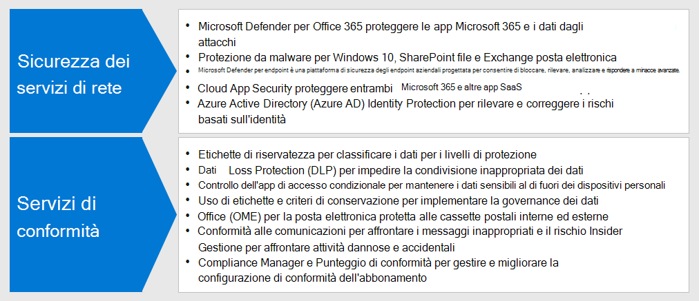
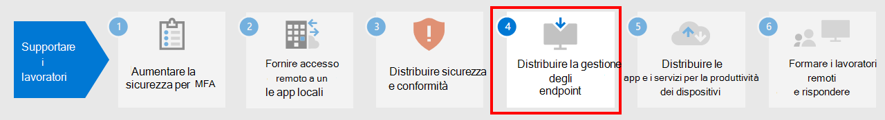

# Passaggio 3: distribuire sicurezza e conformità per i lavoratori remoti

Per i lavoratori remoti che non vanno mai in ufficio o lo fanno molto di rado, la sicurezza e la conformità sono una parte importante della soluzione complessiva. Tutte le loro comunicazioni avvengono tramite Internet anziché nel perimetro dell'Intranet dell'organizzazione. 

Sono molte le azioni che è possibile intraprendere per mantenere alta la produttività riducendo il rischio di crimini informatici e garantendo la conformità.

Ecco gli elementi necessari per mantenere sicurezza e conformità del lavoro remoto:

- Accesso controllato alle app di produttività che usano i lavoratori remoti, come Microsoft Teams 
- Accesso controllato e protezione dei dati che i lavoratori remoti creano e usano, come le conversazioni in chat o i file condivisi
- Protezione dei dispositivi con Windows 10 da malware e altri tipi di attacchi informatici
- Protezione di posta elettronica, file e sito attraverso un'etichettatura coerente in base ai livelli di riservatezza e protezione
- Prevenzione della fuga di informazioni
- Rispetto delle normative locali sui dati

Ecco le funzionalità di Microsoft 365 che forniscono servizi di sicurezza e conformità per i lavoratori remoti.

## Sicurezza

Proteggere applicazioni e dati con queste funzionalità di sicurezza di Microsoft 365.

| Capacità o funzionalità | Perché è necessario | Licenze |
|:-------|:-----|:-------|
| Microsoft Defender per Office 365 | Proteggere le app e i dati di Microsoft 365, ad esempio i messaggi di posta elettronica, i documenti di Office e gli strumenti di collaborazione, da eventuali attacchi.    Microsoft Defender per Office 365 raccoglie e analizza i segnali delle app per rilevare, analizzare e correggere i rischi per la sicurezza e tutela l'organizzazione da minacce dannose poste in essere da messaggi di posta elettronica, collegamenti (URL) e strumenti di collaborazione. Fornisce anche strumenti di valutazione e impostazione della configurazione del tenant per rispondere a requisiti di sicurezza ordinari e rigorosi. | Microsoft 365 E3 o E5 | 
| Protezione da malware | ‎Microsoft Defender Antivirus e Device Guard forniscono una protezione da malware basata sul dispositivo.    SharePoint‎ Online analizza automaticamente i file caricati per rilevare malware sconosciuto. ‎   Exchange Online Protection‎ (‎EOP‎) protegge le cassette postali sul cloud. | Microsoft 365 E3 o E5 |
| Microsoft Defender per endpoint | Proteggere i dispositivi dell'organizzazione da minacce informatiche e violazioni dei dati e rilevare, analizzare e rispondere a minacce avanzate. | Microsoft 365 E5 |
| Cloud App Security | Proteggi i tuoi servizi basati su cloud, inclusi Microsoft 365 e le tue altre app SaaS, dagli attacchi. | Microsoft 365 E5 o singole licenze di Cloud App Security |
| Azure AD Identity Protection  | Automatizzare il rilevamento e la correzione dei rischi basati sull'identità.   Creare criteri di accesso condizionale basati sul rischio per richiedere l'autenticazione a più fattori (MFA) per gli accessi rischiosi. | Microsoft 365 E5 o E3 con licenze di Azure AD Premium P2 |
||||

Per altre informazioni, vedere [12 attività principali dei team di sicurezza per supportare il lavoro da casa](../security/top-security-tasks-for-remote-work.md).

## Conformità

Garantire la conformità ai criteri interni o ai requisiti normativi con queste funzionalità di conformità di Microsoft 365.

| Capacità o funzionalità | Perché è necessario | Licenze |
|:-------|:-----|:-------|
| Etichette di riservatezza | Classificare e proteggere i dati dell'organizzazione senza compromettere la produttività degli utenti e la loro capacità di collaborare aggiungendo etichette con vari livelli di protezione a messaggi di posta elettronica, file o siti. | Microsoft 365 E3 o E5 |
| Prevenzione della perdita dei dati (DLP) | Rilevare, comunicare e bloccare la condivisione rischiosa, involontaria o inappropriata, come la condivisione di dati che contengono informazioni personali, sia all'interno che all'esterno. | Microsoft 365 E3 o E5 | 
| Controllo delle app tramite l'accesso condizionale | Evitare che i dati riservati vengano scaricati nei dispositivi personali degli utenti. | Microsoft 365 E3 o E5 |
| Etichette e criteri di conservazione dei dati | Implementare controlli di governance delle informazioni, come la durata di conservazione dei dati e i requisiti per l'archiviazione dei dati personali dei clienti, per garantire la conformità con i criteri o le normative sui dati dell'organizzazione. | Microsoft 365 E3 o E5 |
| Crittografia messaggi di Office (OME) | Inviare e ricevere messaggi di posta elettronica tra persone all'interno e all'esterno dell'organizzazione che contengono dati regolamentati, come i dati personali dei clienti. | Microsoft 365 E3 o E5 |
| Compliance Manager | Gestire le attività di conformità normative relative ai servizi cloud Microsoft con lo strumento di valutazione dei rischi basato su flussi di lavoro in Microsoft Service Trust Portal. | Microsoft 365 E3 o E5 |
| Compliance Manager | Visualizzare il punteggio complessivo della configurazione di conformità corrente e i consigli per migliorarla nel Centro conformità Microsoft 365. | Microsoft 365 E3 o E5 |
| Conformità delle comunicazioni  | Rilevare, acquisire ed eseguire azioni correttive per i messaggi non appropriati nell'organizzazione. | Microsoft 365 E5 o Microsoft 365 E3 con i componenti aggiuntivi Conformità o Gestione dei rischi Insider |
| Gestione dei rischi Insider |  Rilevare e analizzare e rischi dannosi e involontari nell'organizzazione e intraprendere azioni. Microsoft 365 può individuare questo tipo di rischi anche quando un lavoratore usa un dispositivo non gestito. | Microsoft 365 E5 o Microsoft 365 E3 con i componenti aggiuntivi Conformità o Gestione dei rischi Insider |
||||

Per altre informazioni, vedere [Attività rapide per iniziare a usare Conformità Microsoft 365](../compliance/compliance-quick-tasks.md).

## Risultati del Passaggio 3

Ecco le funzionalità implementate per i lavoratori remoti:

- Sicurezza
  - Accesso controllato ad app e dati che i lavoratori remoti usano per comunicare e collaborare
  - Protezione da malware per i dati dei servizi cloud, la posta elettronica e i dispositivi con Windows 10 
- Conformità
  - Etichettatura coerente in base ai livelli di riservatezza e protezione
  - Criteri per la prevenzione della fuga di informazioni
  - Rispetto delle normative locali sui dati

## Passaggio successivo

Proseguire con il [passaggio 4](empower-people-to-work-remotely-manage-endpoints.md) per gestire dispositivi, PC e altri endpoint.
