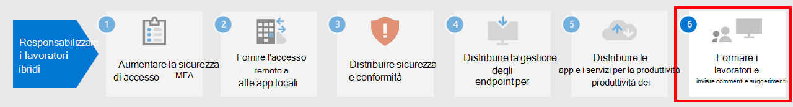

# Passaggio 5.Step 5. Distribuire le app e i servizi per la produttività dei lavoratori remotiDeploy remote worker productivity apps and services

Per essere produttivi, le persone devono comunicare e collaborare tra loro.To be productive, people need to communicate and collaborate with one another. Devono partecipare a riunioni, chattare tramite voce e testo, creare nuovi contenuti e condividere informazioni e file, scambiare messaggi di posta elettronica e gestire calendari e attività.They need to meet, chat by voice and text, create new content and share information and files, exchange email, and manage calendars and tasks. Microsoft 365 include servizi basati sul cloud per tutte queste funzionalità principali:Microsoft 365 provides cloud-based services for all of these key functions:

| Funzione ITIT function | Componenti di Microsoft 365Microsoft 365 components | DescrizioneDescription |
|:-------|:-----|:-------|
| Servizi di posta elettronicaEmail services | Exchange OnlineExchange Online | Invia messaggi e gestisci calendari, contatti e attività con il client di Outlook.Exchange email and manage calendars, contacts, and tasks with the Outlook client. |
| Chat organizzazione, protocollo VOIP e collaborazione basata su teamOrganizational chat, voice over IP (VOIP), and team-based collaboration | Microsoft TeamsMicrosoft Teams | Tieni le persone in contatto mentre lavorano a distanza con un punto di riferimento comune per le comunicazioni di riunioni e chat e l'archiviazione dei file dell'organizzazione, dei reparti, e di piccoli team e singole persone.Keep people connected while they work apart with a common hub of communication for meetings, chats, and file storage for the organization, departments, and for small teams and individuals. |
| Siti intranet, collaborazione per i documentiIntranet sites, document collaboration | SharePoint e OneDriveSharePoint and OneDrive | Archiviare e collaborare ai file con un browser o usando Teams.Store and collaborate on files within a web browser or within Teams. |
| Applicazioni di Office per desktop e dispositivi mobiliDesktop and mobile device Office applications | Microsoft 365 AppsMicrosoft 365 Apps | Crea nuovi contenuti o collabora a contenuti esistenti con le versioni di Word, PowerPoint, Excel e Outlook installate sul tuo computer locale, e ricevi aggiornamenti costanti della sicurezza e delle funzionalità.Create new content or collaborate on existing content with versions of Word, PowerPoint, Excel, and Outlook that are installed on your local computer and receive ongoing feature and security updates. |
||||

## Mantenere le persone in contatto con Microsoft TeamsKeep people connected with Microsoft Teams

Teams consente di chattare, fare riunioni, chiamate e collaborare in un'unica posizione.Teams allows you to chat, meet, call, and collaborate all in one place. Milioni di persone svolgono il proprio lavoro ogni giorno in Teams perché riunisce tutto il necessario per lavorare in remoto in un hub per il lavoro di in team.Millions of people get their work done in Teams every day because it brings together everything you need to work remotely into a hub for teamwork. 

Per istruzioni dettagliate, vedere [Supporto per i lavoratori remoti con Microsoft Teams](https://docs.microsoft.com/microsoftteams/support-remote-work-with-teams).For detailed guidance, see [Support remote workers using Microsoft Teams](https://docs.microsoft.com/microsoftteams/support-remote-work-with-teams). 

Guarda il video [Abilitare il lavoro ibrido con i webcast di Microsoft Teams](https://resources.techcommunity.microsoft.com/enabling-hybrid-work/) per linee guida e demo sull'uso di Teams per il lavoro remoto.Watch the [Enabling hybrid work with Microsoft Teams webcasts](https://resources.techcommunity.microsoft.com/enabling-hybrid-work/) for guidance and demos on using Teams for remote work.

### Chat e conversazioniChat and conversations

Le chat e le conversazioni in thread rappresentano la parte principale di Teams con supporto per chat e conversazioni individuali e di gruppo.Chat and threaded conversations are at the center of Teams with support for individual 1:1 chats and group chats and conversations. I lavoratori remoti possono condividere informazioni, opinioni ed esprimere la propria personalità usando gif, adesivi ed emoji nelle chat di gruppo o nei messaggi individuali.Remote workers can share information, opinions, and personality by using gifs, stickers, and emojis in group chats or one-to-one messages.

### Riunioni e conferenzeMeetings and conferencing 

Teams può sicuramente aiutare a mantenere vive le comunicazioni e la condivisione delle informazioni con i lavoratori remoti, in particolare tramite riunioni che supportano fino a 250 persone.Teams can certainly help maintain communications and information sharing with remote workers, especially with meetings that support up to 250 people. Le riunioni di Teams consentono riunioni interattive e collaborative con persone all'interno e all'esterno dell'organizzazione.Teams meetings enable interactive, collaborative meetings with people inside and outside your organization. I lavoratori remoti possono utilizzare le riunioni di Teams per le attività quotidiane, tra cui checkpoint ricorrenti del progetto, recupero con i colleghi, sessioni di brainstorming e promozione delle conversazioni con i clienti.Remote workers can use Teams meetings for day-to-day activities including recurring project checkpoints, catching-up with colleagues, brainstorming sessions, and facilitating conversations with customers. 

### ChiamateCalling

Teams supporta chiamate VoIP dirette tra utenti e anche altre organizzazioni che utilizzano la federazione.Teams supports direct VoIP calling between users and even other organizations using federation. Utilizza gli stessi codec delle riunioni e fornisce un audio eccezionale a livello mondiale senza costi PSTN aggiuntivi.It uses the same codecs as meetings and provide great audio world-wide without additional PSTN charges. Tuttavia, alcuni utenti potrebbero aver bisogno di un numero di telefono apposito per rispondere alle chiamate esterne quando lavorano in remoto.However, some users may need a dedicated phone number to take external calls when working remotely. Teams può fornire rapidamente un servizio telefonico cloud per questi utenti in modo che possano effettuare e ricevere chiamate telefoniche.Teams can quickly provide cloud phone service for these users to make and receive phone calls.

### App e flussi di lavoroApps and workflows

Teams offre una piattaforma per app e flussi di lavoro a cui è possibile accedere dalle versioni desktop, Web e per dispositivi mobili di Teams.Teams provides a platform for apps and workflows that can be accessed from the desktop, web, and mobile versions of Teams. Teams offre centinaia di app pubblicate da Microsoft e di terze parti per coinvolgere gli utenti, supportare la produttività e integrare i servizi commerciali di uso comune in Teams.Teams provides hundreds of apps published by Microsoft and by third parties to engage users, support productivity, and integrate commonly used business services into Teams. Gli utenti e gli amministratori possono anche creare app personalizzate e flussi di lavoro automatizzati per Teams utilizzando gli strumenti di sviluppo low code Power Apps e Power Automate.Users and Admins can also create custom apps and automated workflows for Teams using the low-code Power Apps and Power Automate development tools.

Le app e i flussi di lavoro consentono ai lavoratori remoti di essere più produttivi in Teams, perché consente di raccogliere e condividere informazioni importanti, automatizzare le attività ripetitive e di chattare con i bot interattivi.Apps and workflows let remote workers be more productive in Teams, by collecting and sharing critical information, automating repetitive tasks, and allowing them to chat with interactive bot. L'aggiunta di app su un canale o sulla barra dell'app Teams è un ottimo modo per gli utenti per renderle facilmente accessibili in uno spazio pertinente e gli amministratori possono aggiungere app per favorire la consapevolezza e l'adozione delle app che tutti dovrebbero usare.Pinning apps to a channel or the Teams app bar is a great way for users to make these apps easily accessible in a relevant space, and admins can pin apps to drive awareness and adoption of the apps that everyone should be using.

## Scambiare messaggi di posta elettronica e gestire calendari, contatti e attività con Exchange Online e OutlookExchange email and manage calendars, contacts, and tasks with Exchange Online and Outlook

Grazie a Outlook, i lavoratori remoti possono rimanere connessi e organizzati con posta elettronica, calendari, contatti, attività e altro ancora insieme in un unico posto.With Outlook, remote workers can stay connected and organized with email, calendars, contacts, tasks, and more—together in one place. Outlook aiuta a tenere sotto controllo la giornata in base ai contenuti interessati.Outlook helps you stay on track and prioritize your day based on what’s relevant to you. Outlook consente di condividere gli allegati direttamente da OneDrive, pianificare e partecipare alle riunioni di Teams, visualizzare e condividere calendari e fornire autorizzazioni delegate ad altri.Outlook enables you to share attachments right from OneDrive, plan and join Teams meetings, view and share calendars, and provide delegate permissions to others. Conoscere ciò che accadrà in seguito negli impegni lavorativi e personali e in ciò che richiede attenzione può aiutare i lavoratori remoti a concentrarsi su ciò che conta.Knowing what’s coming up next across both work and personal commitments and what needs attention can help remote workers focus on what matters. Outlook offre ai lavoratori remoti modi utili per gestire il proprio tempo e trovare facilmente ciò di cui hanno bisogno, inclusi file, persone nell'organizzazione e altro.Outlook provides helpful ways for remote workers to manage their time and to find what they need easily, including files, people in the organization, and more. 

Vedere [questo articolo](../security/office-365-security/secure-email-recommended-policies.md) per informazioni sui criteri di identità e accesso ai dispositivi consigliati per proteggere la posta elettronica dell'organizzazione e i client di posta elettronica che supportano l'autenticazione moderna e l'accesso condizionale.See [this article](../security/office-365-security/secure-email-recommended-policies.md) for the recommended identity and device access policies to protect organizational email and email clients that support modern authentication and Conditional Access.

## Archiviare e collaborare ai file con SharePoint e OneDriveStore and collaborate on files with SharePoint and OneDrive

Per la collaborazione sui contenuti, i lavoratori remoti possono utilizzare le cartelle di SharePoint e OneDrive come posizione centrale nel cloud per archiviare e condividere file, creare in modalità condivisa, comunicare e collaborare.For content collaboration, remote workers can use SharePoint and OneDrive folders as a central place in the cloud to store and share files, co-author, communicate, and collaborate. I lavoratori remoti possono lavorare in sicurezza da qualsiasi luogo da un browser Web, da Teams e dalle app di Office.Remote workers can securely work from anywhere from a web browser, from Teams, and from Office apps.

Potrebbe essere necessario eseguire la migrazione dei documenti in SharePoint o OneDrive da:You might have to migrate your documents to SharePoint or OneDrive from:

- [Siti del team di SharePoint ServerSharePoint Server Team Sites](https://docs.microsoft.com/sharepointmigration/sp-teams-sites-migration-guide)
- [MySitesMySites](https://docs.microsoft.com/sharepointmigration/mysites-to-onedrive-migration-guide)
- [Condivisioni fileFile shares](https://docs.microsoft.com/sharepointmigration/fileshare-to-odsp-migration-guide)
- [BoxBox](https://docs.microsoft.com/sharepointmigration/box-to-onedrive-and-sharepoint-migration-guide)

Per proteggere SharePoint e OneDrive, vedere [questo articolo](../security/office-365-security/sharepoint-file-access-policies.md) sui criteri di identità e accesso ai dispositivi consigliati.To protect SharePoint and OneDrive, see [this article](../security/office-365-security/sharepoint-file-access-policies.md) for the recommended identity and device access policies.

## Creare e collaborare ai contenuti con Microsoft 365 AppsCreate and collaborate on content with Microsoft 365 Apps

Microsoft 365 Apps rappresenta l'esperienza di Office più produttiva e sicura per le aziende, perché consente alle persone di collaborare facilmente ovunque e in qualsiasi momento.Microsoft 365 Apps is the most productive and secure Office experience for enterprises, allowing people to work together seamlessly from anywhere, anytime. I lavoratori remoti possono collaborare a un documento con più persone contemporaneamente, visualizzare modifiche e cambiamenti in tempo reale e creare in modalità condivisa con altri su qualsiasi portatile, PC o dispositivo mobile.Remote workers can collaborate on a document with multiple people simultaneously, see edits and changes in real time, and coauthor with others on any laptop, PC, or mobile device.

Per altre informazioni, vedere la [Guida alla distribuzione di Microsoft 365 Apps](https://docs.microsoft.com/deployoffice/deployment-guide-microsoft-365-apps).For more information, see the [Deployment guide for Microsoft 365 Apps](https://docs.microsoft.com/deployoffice/deployment-guide-microsoft-365-apps).

## Risorse amministrative tecniche per app e servizi per la produttivitàAdmin technical resources for productivity apps and services

- [Supporto per i lavoratori remoti con Microsoft TeamsSupport remote workers using Microsoft Teams](https://docs.microsoft.com/microsoftteams/support-remote-work-with-teams)
- [Abilitare il lavoro ibrido con i webcast di Microsoft TeamsEnabling hybrid work with Microsoft Teams webcasts](https://resources.techcommunity.microsoft.com/enabling-hybrid-work/)
- [Download di Teams Customer Success Kit Teams Customer Success Kit download](https://www.microsoft.com/download/details.aspx?id=54244)
- [Strumenti per favorire l'adozione di TeamsTools for driving Teams adoption](https://docs.microsoft.com/microsoftteams/adopt-tools-and-downloads) 
- [Creare una strategia di gestione del cambiamento per Microsoft TeamsCreate a change management strategy for Microsoft Teams](https://docs.microsoft.com/MicrosoftTeams/change-management-strategy)
- [Teams con tre livelli di protezioneTeams with three tiers of protection](configure-teams-three-tiers-protection.md)

## Risorse per la formazione degli utenti su servizi e app di produttivitàUser training resources for productivity apps and services

- [Formare gli utenti su Office e Microsoft 365Train your users on Office and Microsoft 365](https://support.microsoft.com/office/train-your-users-on-office-and-microsoft-365-7cba3c97-7f19-46ed-a1c6-763971a26c27)
- [Usare Office per il WebUse Office for the web](https://support.microsoft.com/office/get-started-with-office-for-the-web-in-microsoft-365-5622c7c9-721d-4b3d-8cb9-a7276c2470e5)

## Passaggio successivoNext step

Proseguire con il [passaggio 6](empower-people-to-work-remotely-train-monitor-usage.md) per formare gli utenti e monitorare i loro risultati.Continue with [Step 6](empower-people-to-work-remotely-train-monitor-usage.md) to train your users and monitor their success.
