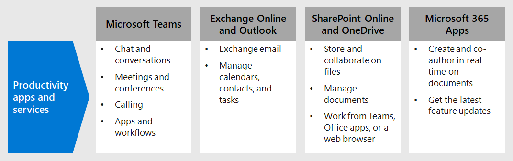

# Passaggio 5. Distribuire le app e i servizi per la produttività dei lavoratori remoti

Per essere produttivi, le persone devono comunicare e collaborare tra loro. Devono partecipare a riunioni, chattare tramite voce e testo, creare nuovi contenuti e condividere informazioni e file, scambiare messaggi di posta elettronica e gestire calendari e attività. Microsoft 365 include servizi basati sul cloud per tutte queste funzionalità principali:

| Funzione IT | Componenti di Microsoft 365 | Descrizione |
|:-------|:-----|:-------|
| Servizi di posta elettronica | Exchange Online | Invia messaggi e gestisci calendari, contatti e attività con il client di Outlook. |
| Chat organizzazione, protocollo VOIP e collaborazione basata su team | Microsoft Teams | Tieni le persone in contatto mentre lavorano a distanza con un punto di riferimento comune per le comunicazioni di riunioni e chat e l'archiviazione dei file dell'organizzazione, dei reparti, e di piccoli team e singole persone. |
| Siti intranet, collaborazione per i documenti | SharePoint e OneDrive | Archiviare e collaborare ai file con un browser o usando Teams. |
| Applicazioni di Office per desktop e dispositivi mobili | Microsoft 365 Apps | Crea nuovi contenuti o collabora a contenuti esistenti con le versioni di Word, PowerPoint, Excel e Outlook installate sul tuo computer locale, e ricevi aggiornamenti costanti della sicurezza e delle funzionalità. |
||||

## Mantenere le persone in contatto con Microsoft Teams

Teams consente di chattare, fare riunioni, chiamate e collaborare in un'unica posizione. Milioni di persone svolgono il proprio lavoro ogni giorno in Teams perché riunisce tutto il necessario per lavorare in remoto in un hub per il lavoro di in team. 

Per istruzioni dettagliate, vedere [Supporto per i lavoratori remoti con Microsoft Teams](/microsoftteams/support-remote-work-with-teams). 

Guarda il video [Abilitare il lavoro ibrido con i webcast di Microsoft Teams](https://resources.techcommunity.microsoft.com/enabling-hybrid-work/) per linee guida e demo sull'uso di Teams per il lavoro remoto.

### Chat e conversazioni

Le chat e le conversazioni in thread rappresentano la parte principale di Teams con supporto per chat e conversazioni individuali e di gruppo. I lavoratori remoti possono condividere informazioni, opinioni ed esprimere la propria personalità usando gif, adesivi ed emoji nelle chat di gruppo o nei messaggi individuali.

### Riunioni e conferenze 

Teams può sicuramente aiutare a mantenere vive le comunicazioni e la condivisione delle informazioni con i lavoratori remoti, in particolare tramite riunioni che supportano fino a 250 persone. Le riunioni di Teams consentono riunioni interattive e collaborative con persone all'interno e all'esterno dell'organizzazione. I lavoratori remoti possono utilizzare le riunioni di Teams per le attività quotidiane, tra cui checkpoint ricorrenti del progetto, recupero con i colleghi, sessioni di brainstorming e promozione delle conversazioni con i clienti. 

### Chiamate

Teams supporta chiamate VoIP dirette tra utenti e anche altre organizzazioni che utilizzano la federazione. Utilizza gli stessi codec delle riunioni e fornisce un audio eccezionale a livello mondiale senza costi PSTN aggiuntivi. Tuttavia, alcuni utenti potrebbero aver bisogno di un numero di telefono apposito per rispondere alle chiamate esterne quando lavorano in remoto. Teams può fornire rapidamente un servizio telefonico cloud per questi utenti in modo che possano effettuare e ricevere chiamate telefoniche.

### App e flussi di lavoro

Teams offre una piattaforma per app e flussi di lavoro a cui è possibile accedere dalle versioni desktop, Web e per dispositivi mobili di Teams. Teams offre centinaia di app pubblicate da Microsoft e di terze parti per coinvolgere gli utenti, supportare la produttività e integrare i servizi commerciali di uso comune in Teams. Gli utenti e gli amministratori possono anche creare app personalizzate e flussi di lavoro automatizzati per Teams utilizzando gli strumenti di sviluppo low code Power Apps e Power Automate.

Le app e i flussi di lavoro consentono ai lavoratori remoti di essere più produttivi in Teams, perché consente di raccogliere e condividere informazioni importanti, automatizzare le attività ripetitive e di chattare con i bot interattivi. L'aggiunta di app su un canale o sulla barra dell'app Teams è un ottimo modo per gli utenti per renderle facilmente accessibili in uno spazio pertinente e gli amministratori possono aggiungere app per favorire la consapevolezza e l'adozione delle app che tutti dovrebbero usare.

## Scambiare messaggi di posta elettronica e gestire calendari, contatti e attività con Exchange Online e Outlook

Grazie a Outlook, i lavoratori remoti possono rimanere connessi e organizzati con posta elettronica, calendari, contatti, attività e altro ancora insieme in un unico posto. Outlook aiuta a tenere sotto controllo la giornata in base ai contenuti interessati. Outlook consente di condividere gli allegati direttamente da OneDrive, pianificare e partecipare alle riunioni di Teams, visualizzare e condividere calendari e fornire autorizzazioni delegate ad altri. Conoscere ciò che accadrà in seguito negli impegni lavorativi e personali e in ciò che richiede attenzione può aiutare i lavoratori remoti a concentrarsi su ciò che conta. Outlook offre ai lavoratori remoti modi utili per gestire il proprio tempo e trovare facilmente ciò di cui hanno bisogno, inclusi file, persone nell'organizzazione e altro. 

Vedere [questo articolo](../security/office-365-security/secure-email-recommended-policies.md) per informazioni sui criteri di identità e accesso ai dispositivi consigliati per proteggere la posta elettronica dell'organizzazione e i client di posta elettronica che supportano l'autenticazione moderna e l'accesso condizionale.

## Archiviare e collaborare ai file con SharePoint e OneDrive

Per la collaborazione sui contenuti, i lavoratori remoti possono utilizzare le cartelle di SharePoint e OneDrive come posizione centrale nel cloud per archiviare e condividere file, creare in modalità condivisa, comunicare e collaborare. I lavoratori remoti possono lavorare in sicurezza da qualsiasi luogo da un browser Web, da Teams e dalle app di Office.

Potrebbe essere necessario eseguire la migrazione dei documenti in SharePoint o OneDrive da:

- [Siti del team di SharePoint Server](/sharepointmigration/sp-teams-sites-migration-guide)
- [MySites](/sharepointmigration/mysites-to-onedrive-migration-guide)
- [Condivisioni file](/sharepointmigration/fileshare-to-odsp-migration-guide)
- [Box](/sharepointmigration/box-to-onedrive-and-sharepoint-migration-guide)

Per proteggere SharePoint e OneDrive, vedere [questo articolo](../security/office-365-security/sharepoint-file-access-policies.md) sui criteri di identità e accesso ai dispositivi consigliati.

## Creare e collaborare ai contenuti con Microsoft 365 Apps

Microsoft 365 Apps rappresenta l'esperienza di Office più produttiva e sicura per le aziende, perché consente alle persone di collaborare facilmente ovunque e in qualsiasi momento. I lavoratori remoti possono collaborare a un documento con più persone contemporaneamente, visualizzare modifiche e cambiamenti in tempo reale e creare in modalità condivisa con altri su qualsiasi portatile, PC o dispositivo mobile.

Per altre informazioni, vedere la [Guida alla distribuzione di Microsoft 365 Apps](/deployoffice/deployment-guide-microsoft-365-apps).

## Risorse amministrative tecniche per app e servizi per la produttività

- [Supporto per i lavoratori remoti con Microsoft Teams](/microsoftteams/support-remote-work-with-teams)
- [Abilitare il lavoro ibrido con i webcast di Microsoft Teams](https://resources.techcommunity.microsoft.com/enabling-hybrid-work/)
- [Download di Teams Customer Success Kit ](https://www.microsoft.com/download/details.aspx?id=54244)
- [Strumenti per favorire l'adozione di Teams](/microsoftteams/adopt-tools-and-downloads) 
- [Creare una strategia di gestione del cambiamento per Microsoft Teams](/MicrosoftTeams/change-management-strategy)
- [Teams con tre livelli di protezione](configure-teams-three-tiers-protection.md)

## Risorse per la formazione degli utenti su servizi e app di produttività

- [Formare gli utenti su Office e Microsoft 365](https://support.microsoft.com/office/train-your-users-on-office-and-microsoft-365-7cba3c97-7f19-46ed-a1c6-763971a26c27)
- [Usare Office per il Web](https://support.microsoft.com/office/get-started-with-office-for-the-web-in-microsoft-365-5622c7c9-721d-4b3d-8cb9-a7276c2470e5)

## Passaggio successivo

Proseguire con il [passaggio 6](empower-people-to-work-remotely-train-monitor-usage.md) per formare gli utenti e monitorare i loro risultati.