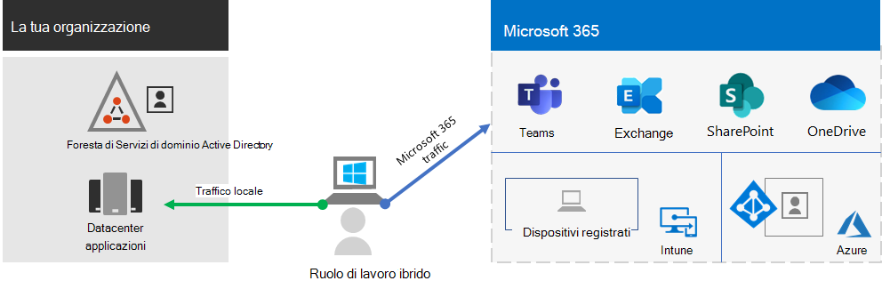

# Aumentare la produttività dei lavoratori remoti con Microsoft 365Empower remote workers with Microsoft 365

L'azienda potrebbe dover consentire ai lavoratori di avere accesso sicuro alle informazioni, agli strumenti e alle risorse locali e basate sul cloud dalle proprie case.Your business may need to enable your workers to have secure access to your organization's on-premises and cloud-based information, tools, and resources from their homes. Per molte organizzazioni, consentire al personale di lavorare fuori dall’ufficio è importante per:Allowing workers to work away from the office is important for many organizations to:

- Risparmiare spazio fisico.Save on office space.
- Assumere e trattenere dipendenti che non sono disposti al trasferimento.Hire and retain workers who are unwilling to relocate.
- Ridurre il pendolarismo, lasciando così ai lavoratori più tempo per essere produttivi e ridurre lo stress.Reduce worker commuting, leaving them with more time to be productive and for stress-reducing activities outside of work.

Microsoft 365 offre funzionalità che consentono ai tuoi dipendenti di lavorare a distanza.Microsoft 365 has the capabilities to empower your workers to work remotely.

| | |
|:-------|:-----|
| ConnessoConnected | Da qualunque parte del mondo e in qualsiasi momento, i dipendenti che lavorano a distanza possono accedere a:From anywhere in the world and at any time, remote workers are able to access: <ul><li>Dati e servizi basati su cloud tramite la propria sottoscrizione a Microsoft 365.Cloud-based services and data in your Microsoft 365 subscription. </li><li>Risorse dell'organizzazione, ad esempio quelle offerte dai data center delle applicazioni locali.Organization resources, such those offered by on-premises application datacenters.</li></ul> |
| ProtezioneSecure | Gli accessi sono garantiti con l’autenticazione a più fattori (MFA), e le caratteristiche di sicurezza predefinite di Microsoft 365 e Windows 10 proteggono contro malware, attacchi dannosi e perdite dei dati.Sign-ins are secured with multi-factor authentication (MFA) and built-in security features of Microsoft 365 and Windows 10 protect against malware, malicious attacks, and data loss. |
| GestioneManaged | I dispositivi dei lavoratori remoti possono essere gestiti dal cloud tramite le impostazioni di sicurezza, le app consentite e la richiesta della conformità con i sistemi sanitari.Your remote worker's devices can be managed from the cloud with security settings, allowed apps, and to require compliance with system health. |
| Collaborazione e produttivitàCollaborative and productive | I dipendenti che lavorano a distanza possono essere produttivi come quelli in ufficio in modi altamente collaborativi, tramite: Your remote workers can be as productive as on-premises in a highly collaborative way with: <ul><li>Riunioni online e sessioni di chat con Teams.Online meetings and chat sessions with Teams. </li><li>Aree di lavoro condivise per l’archiviazione di file basata su cloud, con l’accessibilità globale e la collaborazione in tempo reale di SharePoint e OneDrive.Shared workspaces for cloud-based file storage with global accessibility and real-time collaboration with SharePoint and OneDrive. </li><li>Attività e flussi di lavoro condivisi per suddividere il lavoro e portare a termine le attività.Shared tasks and workflows to divide up the work and get things done. </li></ul> |
|||

Per un’esperienza di accesso senza soluzione di continuità, è necessario sincronizzare gli account utente locali di Active Directory Domain Services (AD DS) con Azure Active Directory (Azure AD).For a seamless sign-in experience, your on-premises Active Directory Domain Services (AD DS) user accounts should be synchronized with Azure Active Directory (Azure AD). Per proteggere i dispositivi Windows 10, è necessario registrarli in Intune.To protect your Windows 10 devices, they should be enrolled in Intune. Ecco una panoramica generale dell'infrastruttura.Here is a high-level view of the infrastructure.

Per soddisfare i criteri per i lavoratori remoti, usare queste capacità e funzionalità di Microsoft 365.To meet the criteria for remote workers, use these Microsoft 365 capabilities and features.

| Capacità o funzionalitàCapability or feature | DescrizioneDescription | LicenzeLicensing |
|:-------|:-----|:-------|
| MFA applicata con le impostazioni predefinite per la sicurezzaMFA enforced with security defaults   | Proteggere le identità e i dispositivi dalla compromissione richiedendo una seconda forma di autenticazione per gli accessi. Le impostazioni predefinite per la sicurezza richiedono l'autenticazione a più fattori per tutti gli account utente.Protect against compromised identities and devices by requiring a second form of authentication for sign-ins. Security defaults requires MFA for all user accounts.   | Microsoft 365 E3 ed E5Microsoft 365 E3 and E5 |
| MFA applicata con l'accesso condizionaleMFA enforced with Conditional Access| Richiedere l'autenticazione a più fattori in base alle proprietà dell'accesso con i criteri di accesso condizionale.Require MFA based on the properties of the sign-in with Conditional Access policies.    | Microsoft 365 E3 ed E5Microsoft 365 E3 and E5 | 
| MFA applicata con l'accesso condizionale basato sul rischioMFA enforced with risk-based Conditional Access   | Richiedere l'autenticazione a più fattori in base al rischio di accesso dell'utente con Azure Advanced Threat Protection.Require MFA based on the risk of the user sign-in with Azure Advanced Threat Protection. | Microsoft 365 E5 o E3 con licenze di Azure AD Premium P2Microsoft 365 E5 or E3 with Azure AD Premium P2 licenses | 
| Reimpostazione della password self-serviceSelf-Service Password Reset (SSPR)    | Consentire agli utenti di reimpostare o sbloccare le password o gli account personali.Allow your users to reset or unlock their passwords or accounts.  | Microsoft 365 E3 ed E5Microsoft 365 E3 and E5 |
| Azure AD Application ProxyAzure AD Application Proxy    | Offrire un accesso remoto sicuro per le applicazioni basate sul Web ospitate nei server Intranet.Provide secure remote access for web-based applications hosted on intranet servers.   | Richiede una sottoscrizione di Azure a pagamento separataRequires separate paid Azure subscription |
| VPN da punto a sito di AzureAzure Point-to-Site VPN   | Stabilire una connessione sicura dal dispositivo di un lavoratore remoto alla Intranet aziendale tramite una rete virtuale di Azure.Create a secure connection from a remote worker’s device to your intranet through an Azure virtual network.   | Richiede una sottoscrizione di Azure a pagamento separataRequires separate paid Azure subscription |
| Desktop virtuale WindowsWindows Virtual Desktop   | Supportare i lavoratori remoti che possono usare solo i propri dispositivi personali e non gestiti con desktop virtuali in esecuzione in Azure.Support remote workers who can only use their personal and unmanaged devices with virtual desktops running in Azure. | Richiede una sottoscrizione di Azure a pagamento separataRequires separate paid Azure subscription |
| Servizi Desktop remotoRemote Desktop Services (RDS) | Consentire ai dipendenti di connettersi a computer basati su Windows nella Intranet aziendale.Allow employees to connect into Windows-based computers on your intranet. | Microsoft 365 E3 ed E5Microsoft 365 E3 and E5 | 
| Gateway di Servizi Desktop remotoRemote Desktop Services Gateway   | Crittografare le comunicazioni e impedire che gli host RDS siano esposti direttamente a Internet.Encrypt communications and prevent the RDS hosts from being directly exposed to the Internet. | Richiede licenze di Windows Server separateRequires separate Windows Server licenses |
| Microsoft IntuneMicrosoft Intune | Gestire dispositivi e applicazioni.Manage devices and applications.   | Microsoft 365 E3 ed E5Microsoft 365 E3 and E5 | 
| Configuration ManagerConfiguration Manager | Gestire installazioni, aggiornamenti e impostazioni del software nei dispositiviManage software installations, updates, and settings on your devices | Richiede licenze di Configuration Manager separateRequires separate Configuration Manager licenses |
| Desktop AnalyticsDesktop Analytics | Determinare l'adozione degli aggiornamenti dei client Windows.Determine the update readiness of your Windows clients.   | Richiede licenze di Configuration Manager separateRequires separate Configuration Manager licenses |
| Windows AutopilotWindows Autopilot | Impostare e preconfigurare nuovi dispositivi Windows 10 in modo da predisporli per l'uso.Set up and pre-configure new Windows 10 devices for productive use.   | Microsoft 365 E3 ed E5Microsoft 365 E3 and E5 |
| Microsoft Teams, Exchange Online, SharePoint Online e OneDrive, Microsoft 365 Apps, Microsoft Power Platform, Yammer, Power AppsMicrosoft Teams, Exchange Online, SharePoint Online and OneDrive, Microsoft 365 Apps, Microsoft Power Platform, Yammer, Power Apps | Creare, comunicare e collaborare.Create, communicate, and collaborate. | Microsoft 365 E3 e E5Microsoft 365 E3 and E5 |
||||

 Per un riepilogo di 2 pagine di questo scenario vedere il [poster Supportare i lavoratori remoti](../downloads/empower-remote-workers.pdf).For a 2-page summary of this scenario, see the [Empower remote workers poster](../downloads/empower-remote-workers.pdf).

È anche possibile scaricare il poster in formato [PDF](https://github.com/MicrosoftDocs/microsoft-365-docs/raw/public/microsoft-365/downloads/empower-remote-workers.pdf) o [PowerPoint](https://github.com/MicrosoftDocs/microsoft-365-docs/raw/public/microsoft-365/downloads/empower-remote-workers.pptx) e stamparlo in formato lettera, legale o tabloid (27,9 x 43,2 cm).You can also download this poster in [PDF](https://github.com/MicrosoftDocs/microsoft-365-docs/raw/public/microsoft-365/downloads/empower-remote-workers.pdf) or [PowerPoint](https://github.com/MicrosoftDocs/microsoft-365-docs/raw/public/microsoft-365/downloads/empower-remote-workers.pptx) formats and print it on letter, legal, or tabloid (11 x 17) size paper.

Utilizzare i seguenti passaggi per proteggere e ottimizzare l'accesso ai server, ai dati e ai servizi cloud dell'organizzazione e consentire la massima produttività dei lavoratori.Use these steps to secure and optimize access to your organization's servers, data, and cloud services and enable maximum worker productivity.

1. [Aumentare la sicurezza dell'accesso con la MFAIncrease sign-in security with MFA](empower-people-to-work-remotely-secure-sign-in.md)
2. [Fornire l'accesso remoto alle app e ai servizi localiProvide remote access to on-premises apps and services](empower-people-to-work-remotely-remote-access.md)
3. [Distribuire servizi di sicurezza e conformitàDeploy security and compliance services](empower-people-to-work-remotely-security-compliance.md)
4. [Distribuire la gestione degli endpoint per dispositivi, PC e altri endpointDeploy endpoint management for your devices, PCs, and other endpoints](empower-people-to-work-remotely-manage-endpoints.md)
5. [Distribuire le app e i servizi per la produttività dei lavoratori remotiDeploy remote worker productivity apps and services](empower-people-to-work-remotely-teams-productivity-apps.md)
6. [Formare i lavoratori remoti e rispondere al feedback sull'utilizzoTrain remote workers and address usage feedback](empower-people-to-work-remotely-train-monitor-usage.md)

Per le ultime informazioni da Microsoft sul supporto dei lavoratori remoti, vedere la pagina sull'[abilitazione del lavoro remoto nel sito Microsoft Tech Community](https://resources.techcommunity.microsoft.com/enabling-remote-work/).For the latest information from Microsoft about supporting remote workers, see the [Enabling remote work Tech Community site](https://resources.techcommunity.microsoft.com/enabling-remote-work/).
