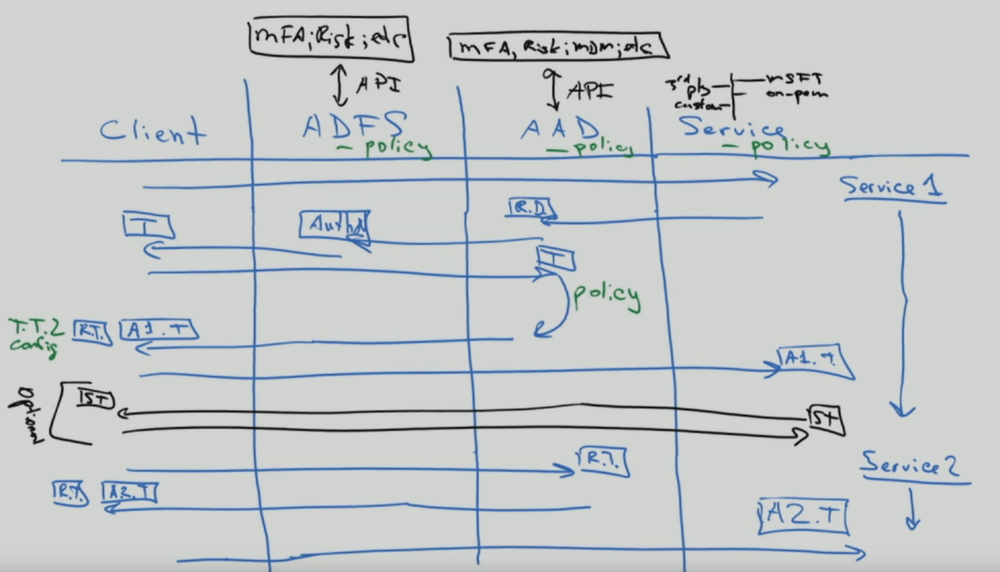
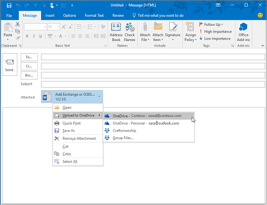
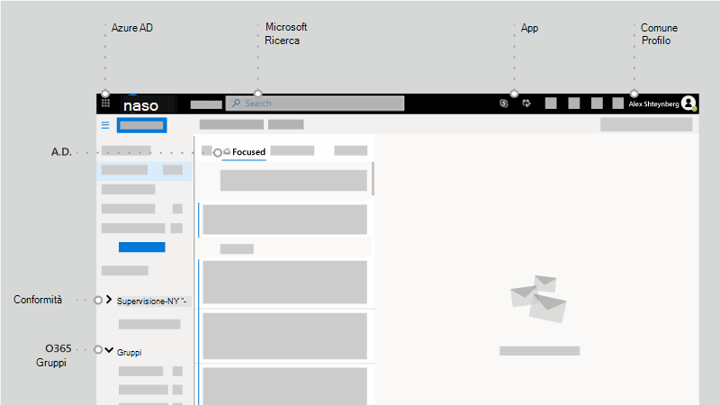

# To Identity and Beyond-punto di vista di un architetto

In questo articolo, [Alex Shteynberg](https://www.linkedin.com/in/alex-shteynberg/), Principal Technical Architect di Microsoft, discute le strategie di progettazione principali per le organizzazioni aziendali che adottano Microsoft 365 e altri servizi cloud Microsoft.

## Informazioni sull'autore

Sono un progettista tecnico principale presso il [centro tecnologico Microsoft](https://www.microsoft.com/mtc?rtc=1)di New York. Lavoro principalmente con clienti di grandi dimensioni e requisiti complessi. Il mio punto di vista e le opinioni si basano su queste interazioni e potrebbero non essere valide per tutte le situazioni. Tuttavia, se si è in grado di aiutare i clienti con le più complesse sfide, è possibile aiutare tutti i clienti.

In genere lavoro con 100 + clienti ogni anno. Anche se ogni organizzazione ha caratteristiche uniche, è interessante vedere tendenze e comunanze. Ad esempio, una tendenza è l'interesse intersettoriale per molti clienti. Dopo tutto, un branch di banche può anche essere un coffee shop e un Community Center.

Nel mio ruolo, mi concentro su come aiutare i clienti a raggiungere la migliore soluzione tecnica per risolvere i propri obiettivi aziendali unici. Ufficialmente, mi concentro sull'identità, la sicurezza, la privacy e la conformità. Mi piace il fatto che questi tocchino tutto quello che facciamo. La maggior parte dei progetti mi dà la possibilità di partecipare. Questo mi tiene molto occupato e gode di questo ruolo.

Io vivo a New York City (la migliore!) e godere davvero la diversità della sua cultura, cibo e persone (non traffico). Mi piace viaggiare quando posso e spero di vedere la maggior parte del mondo nel corso della mia vita. Attualmente sto cercando un viaggio in Africa per conoscere la fauna selvatica.

## Principi guida

- **Simple è spesso più efficace**: è possibile fare (quasi) qualsiasi cosa con la tecnologia, ma ciò non significa che sia necessario. Specialmente nello spazio di sicurezza, molte soluzioni di overengineer dei clienti. Mi piace [questo video](https://www.youtube.com/watch?v=SOQgABDSYZE) della conferenza di stripe di Google per sottolineare questo punto.
- **Persone, processo, tecnologia**: [progettazione per gli utenti](https://en.wikipedia.org/wiki/Human-centered_design) per migliorare il processo, non per primo tecnico. Non ci sono soluzioni "perfette". È necessario bilanciare vari fattori di rischio e le decisioni saranno diverse per ogni azienda. Troppi clienti progettano un approccio che gli utenti possono evitare in un secondo momento.
- **Concentrati su' perché' prima è come ' in seguito**: essere il ragazzino fastidioso da 7 anni con un milione di domande. Non è possibile arrivare alla risposta giusta se non si conoscono le domande giuste da porsi. Molti clienti si basano su come le cose devono funzionare invece di definire il problema aziendale. Esistono sempre più percorsi che è possibile eseguire.
- **Coda lunga delle procedure** consigliate precedenti: riconoscere che le procedure consigliate stanno cambiando alla velocità della luce. Se è stato esaminato Azure AD più di tre mesi fa, è probabile che sia obsoleto. Tutti gli elementi seguenti sono soggetti a modifiche dopo la pubblicazione. L'opzione "Best" oggi potrebbe non essere tra gli stessi sei mesi.

## Concetti di base

Non ignorare questa sezione. Spesso è necessario eseguire un passaggio di nuovo a questi argomenti, anche per i clienti che utilizzano i servizi cloud per anni.
Ahimè, la lingua non è uno strumento preciso. È molto frequente utilizzare la stessa parola per indicare concetti diversi o parole diverse per indicare lo stesso concetto. Questo diagramma viene spesso utilizzato in basso per stabilire una terminologia di base e "modello di gerarchia".
  

  

 

Quando si impara a nuotare, è preferibile iniziare in piscina e non in mezzo all'oceano. Non sto cercando di essere tecnicamente accurato con questo diagramma. Si tratta di un modello per discutere alcuni concetti di base.

Nel diagramma:

- Tenant = un'istanza di Azure AD. Si trova nella parte superiore di una gerarchia o livello 1 nel diagramma. È possibile considerare che questo è il "[limite](https://docs.microsoft.com/azure/active-directory/users-groups-roles/licensing-directory-independence)" in cui si verifica tutto il resto ([Azure ad B2B](https://docs.microsoft.com/azure/active-directory/b2b/what-is-b2b) a parte). Tutti i servizi cloud Microsoft Enterprise fanno parte di uno di questi tenant. I servizi consumer sono separati. "Tenant" viene visualizzato nella documentazione di Office 365 tenant, Azure tenant, WVD tenant e così via. Spesso queste varianti causano confusione per i clienti.
- Servizi/sottoscrizioni, livello 2 nel diagramma, appartengono a un solo tenant. La maggior parte dei servizi SaaS è di 1:1 e non può muoversi senza la migrazione. Azure è diverso, è possibile [spostare la fatturazione](https://docs.microsoft.com/azure/cost-management-billing/manage/billing-subscription-transfer) e/o un [abbonamento](https://docs.microsoft.com/azure/active-directory/fundamentals/active-directory-how-subscriptions-associated-directory) a un altro tenant. Esistono molti clienti che devono spostare le sottoscrizioni di Azure. Questo ha diverse implicazioni. Gli oggetti esistenti all'esterno della sottoscrizione non vengono spostati (ad esempio, il controllo di accesso basato sui ruoli o gli oggetti Azure RBAC e Azure AD, inclusi i gruppi, le app, i criteri e così via). Inoltre, alcuni servizi, ad esempio il Vault Key di Azure, i mattoni di dati e così via. Non eseguire la migrazione dei servizi senza una buona esigenza aziendale. Alcuni script che possono essere utili per la migrazione sono [condivisi su GitHub](https://github.com/lwajswaj/azure-tenant-migration).
- Un determinato servizio ha generalmente una sorta di limite di "sottolivello" o di livello 3 (L3). Questo è utile per comprendere la separazione di sicurezza, i criteri, la governance e così via. Purtroppo, non c'è un nome uniforme che conosco. Alcuni esempi di nomi per L3 sono: sottoscrizione di Azure = [risorsa](https://docs.microsoft.com/azure/azure-resource-manager/management/manage-resources-portal); Dynamics 365 CE = [instance](https://docs.microsoft.com/dynamics365/admin/new-instance-management); Power BI = [Workspace](https://docs.microsoft.com/power-bi/service-create-the-new-workspaces); Power Apps = [ambiente](https://docs.microsoft.com/power-platform/admin/environments-overview); E così via.
- Il livello 4 è il luogo in cui si trovano i dati effettivi. Questo ' piano dati ' è un argomento complesso. Alcuni servizi utilizzano Azure AD per RBAC, altri no. Ne parlerò un po' quando si arriva agli argomenti relativi alla delega.

Alcuni altri concetti che sono disponibili in molti clienti (e impiegati Microsoft) sono confusi o sono in grado di comprendere quanto segue:

- Tutti gli utenti possono [creare](https://docs.microsoft.com/azure/active-directory/fundamentals/active-directory-access-create-new-tenant) molti tenant [gratuitamente.](https://azure.microsoft.com/pricing/details/active-directory/) Non è necessario eseguire il provisioning di un servizio all'interno di esso. Ne ho dozzine. Ogni nome tenant è univoco nel servizio cloud di Microsoft in tutto il mondo (in altre parole, nessun due tenant può avere lo stesso nome). Tutte sono nel formato di TenantName.onmicrosoft.com. Esistono anche processi che creano tenant automaticamente ([tenant non gestiti](https://docs.microsoft.com/azure/active-directory/users-groups-roles/directory-self-service-signup)). Ad esempio, ciò può verificarsi quando un utente si iscrive a un servizio aziendale con un dominio di posta elettronica che non esiste in un altro tenant.
- In un tenant gestito, è possibile registrare molti [domini DNS](https://docs.microsoft.com/azure/active-directory/fundamentals/add-custom-domain) . Questo non cambia il nome originale del tenant. Attualmente non esiste un modo semplice per rinominare un tenant (oltre alla migrazione). Anche se il nome del tenant non è tecnicamente critico in questi giorni, alcuni potrebbero risultare limitativi.
- È consigliabile riservare un nome tenant per l'organizzazione anche se non si prevede di distribuire i servizi. In caso contrario, è possibile che venga eseguito da un utente e che non esista un processo semplice per riprenderlo (stesso problema dei nomi DNS). Questo metodo è troppo frequente per i clienti. Il nome del tenant dovrebbe essere anche un argomento di discussione.
- Se si dispone di uno o più spazi dei nomi DNS, è necessario aggiungerli al tenant. In caso contrario, è possibile creare un [tenant non gestito](https://docs.microsoft.com/azure/active-directory/users-groups-roles/directory-self-service-signup) con questo nome, che quindi causa la [gestione](https://docs.microsoft.com/azure/active-directory/users-groups-roles/domains-admin-takeover)del disturbo.
- Lo spazio dei nomi DNS (ad esempio contoso.com) può appartenere a un solo tenant. Questo ha delle implicazioni per diversi scenari, ad esempio la condivisione di un dominio di posta elettronica durante una fusione o un'acquisizione e così via. Esiste un modo per registrare un sub DNS (ad esempio div.contoso.com) in un tenant diverso, ma che deve essere evitato. Registrando un nome di dominio di primo livello, tutti i sottodomini vengono considerati appartenenti allo stesso tenant. Negli scenari multi-tenant (vedere di seguito) è consigliabile utilizzare un altro nome di dominio di primo livello (ad esempio, contoso.ch o ch-contoso.com).
- Chi dovrebbe "possedere" un tenant? Spesso vengono visualizzati clienti che non conoscono il proprietario del tenant corrente. Questa è una grande bandierina rossa. Chiamare il supporto tecnico Microsoft al più presto. Altrettanto problematico è il momento in cui un proprietario del servizio (spesso un amministratore di Exchange) è designato per gestire un tenant. Il tenant conterrà tutti i servizi che potrebbe essere necessario in futuro. Il proprietario del tenant deve essere un gruppo che può decidere l'abilitazione di tutti i servizi cloud in un'organizzazione. Un altro problema è il momento in cui viene richiesto a un gruppo proprietario tenant di gestire tutti i servizi. Questo non viene ridimensionato per le organizzazioni di grandi dimensioni.
- Non esiste un concetto di Sub/super tenant. Per qualche motivo, questo mito continua a ripetersi. Questo vale anche per i tenant di [Azure ad B2C](https://docs.microsoft.com/azure/active-directory-b2c/) . Si sentono troppe volte, "il mio ambiente B2C è nel mio tenant XYZ" oppure "come si sposta il tenant di Azure nel tenant di Office 365?"
- Questo documento si concentra principalmente sul cloud commerciale di tutto il mondo, in quanto questo è ciò che la maggior parte dei clienti utilizza. A volte è utile conoscere le [nubi sovrane](https://docs.microsoft.com/azure/active-directory/develop/authentication-national-cloud). Le nubi sovrane hanno implicazioni aggiuntive da discutere che non rientrano nell'ambito di questa discussione.

## Argomenti relativi all'identità di base

Sono disponibili molte documentazioni sulla piattaforma di identità di Microsoft – Azure Active Directory (Azure AD). Per coloro che sono appena all'inizio, spesso si sente schiacciante. Anche dopo aver imparato qualcosa, tenere il passo con l'innovazione costante e il cambiamento può essere difficile. Nelle interazioni con I clienti mi trovo spesso a servire come "traduttore" tra gli obiettivi aziendali e gli approcci "buoni, migliori" per affrontare queste (e "note scogliere" umane per questi argomenti). Raramente vi è una risposta perfetta e la decisione "Right" è un bilanciamento di vari fattori di rischio. Di seguito sono riportate alcune delle aree comuni di discussione e di confusione che tendono a discutere con i clienti.

### Provisioning

Azure AD non risolve la mancanza di governance nel mondo delle identità. La [governance dell'identità](https://docs.microsoft.com/azure/active-directory/governance/identity-governance-overview) deve essere un elemento critico indipendente dalle decisioni relative al cloud. I requisiti di governance cambiano nel tempo e questo è il motivo per cui si tratta di un programma e non di uno strumento.

[Azure ad Connect](https://docs.microsoft.com/azure/active-directory/hybrid/whatis-azure-ad-connect) e [Microsoft Identity Manager](https://docs.microsoft.com/microsoft-identity-manager/microsoft-identity-manager-2016) (MIM) vs qualcos'altro (di terze parti o personalizzato)? Risparmiare un sacco di mal di testa ora e in futuro e andare con Azure AD Connect. In questo strumento sono disponibili tutti i tipi di Smart per gestire le configurazioni dei clienti peculiari e le innovazioni in continua evoluzione.

Alcuni casi di Edge che possono essere indirizzati verso un'architettura più complessa:

- Sono presenti più foreste di Active Directory senza connettività di rete tra queste. È disponibile una nuova opzione denominata [cloud provisioning](https://docs.microsoft.com/azure/active-directory/cloud-provisioning/what-is-cloud-provisioning).
- Non si dispone di Active Directory e non si desidera installarlo. Azure AD Connect può essere configurato per la [sincronizzazione da LDAP](https://docs.microsoft.com/azure/active-directory/hybrid/plan-hybrid-identity-design-considerations-tools-comparison) (è possibile che sia necessario un partner).
- È necessario eseguire il provisioning degli stessi oggetti per più tenant. Questo non è tecnicamente supportato ma dipende dalla definizione di "Same".

È consigliabile personalizzare le regole di sincronizzazione predefinite ([oggetti filtro](https://docs.microsoft.com/azure/active-directory/hybrid/how-to-connect-sync-configure-filtering), [attributi di modifica](https://docs.microsoft.com/azure/active-directory/hybrid/reference-connect-sync-attributes-synchronized), [ID di accesso alternativo](https://docs.microsoft.com/azure/active-directory/hybrid/plan-connect-userprincipalname)e così via)? Evitarlo! Una piattaforma di identità è di valore solo per i servizi che lo utilizzano. Anche se è possibile eseguire tutti i tipi di configurazioni di tipo nocciola, per rispondere a questa domanda è necessario esaminare l'impatto sulle applicazioni. Se si filtrano gli oggetti abilitati alla posta elettronica, l'elenco indirizzi globale per i servizi online sarà incompleto. Se l'applicazione si basa su attributi specifici, il filtro avrà un impatto imprevedibile; E così via. Non si tratta di una decisione del team di identità.

XYZ SaaS supporta il provisioning JIT (just-in-Time), perché si richiede la sincronizzazione? Vedere sopra. Molte applicazioni necessitano di informazioni "profilo" per la funzionalità. Non è possibile avere un elenco indirizzi globale se tutti gli oggetti abilitati alla posta elettronica non sono disponibili. Lo stesso vale per il [provisioning degli utenti](https://docs.microsoft.com/azure/active-directory/app-provisioning/user-provisioning) nelle applicazioni integrate con Azure ad.

### Autenticazione

[Sincronizzazione dell'hash delle password](https://docs.microsoft.com/azure/active-directory/hybrid/how-to-connect-password-hash-synchronization) (pH) [e di autenticazione pass-through](https://docs.microsoft.com/azure/active-directory/hybrid/how-to-connect-pta-how-it-works) (PTA) contro [Federazione](https://docs.microsoft.com/azure/active-directory/hybrid/how-to-connect-fed-compatibility).

Di solito vi è un [dibattito](https://docs.microsoft.com/azure/active-directory/hybrid/choose-ad-authn) appassionato attorno alla Federazione. Simpler è in genere migliore e pertanto utilizza pH a meno che non si disponga di una buona ragione per non farlo. È anche possibile configurare diversi metodi di autenticazione per i diversi domini DNS nello stesso tenant. 

Alcuni clienti consentono la Federazione + pH principalmente per:

- Opzione di cui eseguire il [fallback](https://docs.microsoft.com/azure/active-directory/hybrid/plan-migrate-adfs-password-hash-sync) (per il ripristino di emergenza) se il servizio federativo non è disponibile.
- Funzionalità aggiuntive (es.: [Azure AD DS](https://docs.microsoft.com/azure/active-directory-domain-services/tutorial-configure-password-hash-sync)) e servizi di sicurezza (es.: [perdite di credenziali](https://docs.microsoft.com/azure/active-directory/reports-monitoring/concept-risk-events#leaked-credentials))
- Supporto per i servizi in Azure che non comprendono l'autenticazione federata (ad esempio, [i file di Azure](https://docs.microsoft.com/azure/storage/files/storage-files-active-directory-overview)).

Spesso i clienti passano attraverso il flusso di autenticazione del client per chiarire alcuni equivoci. Il risultato è simile all'immagine seguente, che non è buona come il processo interattivo di come arrivarci.

Questo tipo di disegno della lavagna illustra i casi in cui vengono applicati i criteri di sicurezza all'interno del flusso di una richiesta di autenticazione. In questo esempio, i criteri applicati tramite Active Directory Federation Services (AD FS) vengono applicate alla prima richiesta di servizio, ma non alle richieste di servizio successive. Questo è almeno uno dei motivi per spostare il più possibile i controlli di sicurezza nel cloud.

È stato inseguendo il sogno di [Single Sign-on](https://docs.microsoft.com/azure/active-directory/manage-apps/what-is-single-sign-on) (SSO) per tutto il tempo che ricordo. Alcuni clienti ritengono di poter ottenere questo risultato scegliendo il provider di Federazione "Right" (STS). Azure AD può essere di aiuto in modo significativo per abilitare le funzionalità [SSO](https://docs.microsoft.com/azure/active-directory/manage-apps/plan-sso-deployment) , ma nessun servizio token di accesso è magico. Sono presenti troppi metodi di autenticazione "Legacy" ancora utilizzati per le applicazioni critiche. L'estensione di Azure AD con [soluzioni partner](https://docs.microsoft.com/azure/active-directory/saas-apps/tutorial-list) è in grado di risolvere molti di questi scenari. SSO è una strategia e un viaggio. Non è possibile arrivarci senza andare verso [gli standard per le applicazioni](https://docs.microsoft.com/azure/active-directory/develop/v2-app-types). Relativo a questo argomento è un viaggio per l'autenticazione senza [password](https://docs.microsoft.com/azure/active-directory/authentication/concept-authentication-passwordless) , che non ha anche una risposta magica.

[L'autenticazione](https://docs.microsoft.com/azure/active-directory/authentication/concept-mfa-howitworks) a più fattori (AMF) è oggi essenziale[(per ulteriori](https://techcommunity.microsoft.com/t5/azure-active-directory-identity/your-pa-word-doesn-t-matter/ba-p/731984) informazioni). Aggiungere all' [analisi del comportamento degli utenti](https://docs.microsoft.com/azure/active-directory/authentication/tutorial-risk-based-sspr-mfa) it e si dispone di una soluzione che impedisce la maggior parte dei comuni attacchi cibernetici. Anche i servizi consumer si stanno spostando per richiedere l'AMF. Tuttavia, è ancora possibile incontrarsi con molti clienti che non desiderano passare ai metodi di [autenticazione moderni](https://docs.microsoft.com/microsoft-365/enterprise/hybrid-modern-auth-overview) . L'argomento più importante che si sente è che avrà un impatto sugli utenti e sulle applicazioni legacy. A volte un buon calcio potrebbe aiutare i clienti a spostarsi lungo-Exchange Online [ha annunciato modifiche](https://techcommunity.microsoft.com/t5/exchange-team-blog/basic-auth-and-exchange-online-february-2020-update/ba-p/1191282). Sono ora disponibili numerosi [report](https://docs.microsoft.com/azure/active-directory/fundamentals/concept-fundamentals-block-legacy-authentication) di Azure ad per consentire ai clienti di eseguire questa transizione.

### Autorizzazione

Per [Wikipedia](https://en.wikipedia.org/wiki/Authorization), "per autorizzare" è necessario definire un criterio di accesso. Molte persone lo considerano come la possibilità di definire i controlli di accesso a un oggetto (file, servizio e così via). Nel mondo attuale delle minacce informatiche, questo concetto si sta rapidamente evolvendo verso un criterio dinamico che può reagire a vari vettori di minacce e regolare rapidamente i controlli di accesso in risposta a questi. Ad esempio, se si accede al proprio account bancario da una posizione inusuale, vengono aggiunti ulteriori passaggi di conferma. Per accedere a questo approccio, è necessario considerare non solo il criterio stesso, ma anche l'ecosistema delle metodologie di rilevamento delle minacce e di correlazione dei segnali.

Il motore dei criteri di Azure AD viene implementato utilizzando [criteri di accesso condizionale](https://docs.microsoft.com/azure/active-directory/conditional-access/overview). Questo sistema dipende dalle informazioni provenienti da una serie di altri sistemi di rilevamento delle minacce per prendere decisioni dinamiche. Una visualizzazione semplice sarebbe simile alla figura seguente:

La combinazione di tutti questi segnali consente di combinare criteri dinamici come quelli seguenti:

- Se nel dispositivo viene rilevato un pericolo, l'accesso ai dati verrà ridotto al Web solo senza la possibilità di scaricare.
- Se si sta scaricando un volume insolitamente elevato di dati, tutto ciò che si vuole scaricare sarà crittografato e limitato.
- Se si accede a un servizio da un dispositivo non gestito, si verrà bloccati da dati estremamente riservati, ma è consentito l'accesso a dati non limitati senza la possibilità di copiarli in un'altra posizione.

Se si è d'accordo con questa definizione espansa di autorizzazione, è necessario implementare altre soluzioni. Le soluzioni implementate dipendono dalla dinamica desiderata per il criterio e dalle minacce che si desidera impostare come priorità. Alcuni esempi di tali sistemi sono:

- [Azure AD Identity Protection](https://docs.microsoft.com/azure/active-directory/identity-protection/) 
- [Che cosa è Microsoft Defender per identità?](https://docs.microsoft.com/azure-advanced-threat-protection/)
- [Microsoft Defender ATP](https://docs.microsoft.com/windows/security/threat-protection/microsoft-defender-atp/microsoft-defender-advanced-threat-protection)
- [Microsoft Defender per Office 365](https://docs.microsoft.com/microsoft-365/security/office-365-security/office-365-atp?view=o365-worldwide)
- [Sicurezza delle app di Microsoft Cloud](https://docs.microsoft.com/cloud-app-security/) (MCAS)
- [Microsoft 365 Defender](https://docs.microsoft.com/microsoft-365/security/mtp/microsoft-threat-protection?view=o365-worldwide)
- [Microsoft Intune](https://docs.microsoft.com/mem/intune/)
- [Microsoft Information Protection](https://docs.microsoft.com/microsoft-365/compliance/protect-information?view=o365-worldwide) (MIP)
- [Azure Sentinel](https://docs.microsoft.com/azure/sentinel/)

Naturalmente, oltre ad Azure AD, vari servizi e applicazioni dispongono di modelli di autorizzazione specifici. Alcuni di questi sono descritti in un secondo momento nella sezione delega.

### Audit

Azure AD dispone [di funzionalità di controllo e Reporting](https://docs.microsoft.com/azure/active-directory/reports-monitoring/) dettagliate. Tuttavia, non si tratta in genere dell'unica fonte di informazioni necessarie per prendere decisioni di sicurezza. Per ulteriori informazioni, vedere la sezione delega.

## Non è disponibile alcun Exchange

Non fatevi prendere dal panico. Ciò non significa che Exchange sia obsoleto (o SharePoint e così via). È ancora un servizio di base. Ciò che voglio dire è che per un po' di tempo I provider di tecnologia sono stati transitioning user experiences (UX) per includere i componenti di più servizi. In Microsoft 365, un semplice esempio è "[allegati moderni](https://support.office.com/article/Attach-files-or-insert-pictures-in-Outlook-email-messages-BDFAFEF5-792A-42B1-9A7B-84512D7DE7FC)" in cui gli allegati ai messaggi di posta elettronica vengono archiviati in SharePoint Online o OneDrive for business.

Guardando il client Outlook, è possibile visualizzare numerosi servizi che sono "connessi" come parte di questa esperienza, non solo di Exchange. Sono inclusi i gruppi di Azure AD, Microsoft Search, Apps, profile, compliance e Office 365. 

Leggere informazioni su [Microsoft Fluid Framework](https://techcommunity.microsoft.com/t5/microsoft-365-blog/microsoft-ignite-blog-microsoft-fluid-framework-preview/ba-p/978268) per visualizzare in anteprima le funzionalità future. In anteprima ora, sono in grado di leggere e rispondere a conversazioni di Team direttamente in Outlook. In realtà, il [client teams](https://products.office.com/microsoft-teams/download-app) è uno degli esempi più importanti di questa strategia. 

In generale, è sempre più difficile tracciare una linea chiara tra Office 365 e altri servizi in cloud Microsoft. È possibile visualizzarlo come un grande vantaggio per i clienti, in quanto possono trarre vantaggio dall'innovazione totale in tutto ciò che facciamo anche se utilizzano un solo componente. Piuttosto fresco e ha implicazioni di vasta portata per molti clienti.

Oggi, è possibile trovare molti gruppi IT del cliente che sono strutturati attorno a "prodotti". È logico per un mondo locale dato che è necessario un esperto per ogni prodotto specifico. Tuttavia, sono soddisfatto del fatto che non è necessario eseguire il debug di un database di Exchange o di Active Directory mai più, in quanto questi servizi sono stati spostati nel cloud. L'automazione (che è il tipo di cloud) rimuove alcuni processi manuali ripetitivi (Guarda cosa è successo alle fabbriche). Tuttavia, questi vengono sostituiti con requisiti più complessi per comprendere l'interazione tra i servizi, l'impatto, le esigenze aziendali e così via. Se si è disposti a [imparare](https://docs.microsoft.com/learn/), esistono grandi opportunità abilitate dalla trasformazione cloud. Prima di iniziare a utilizzare la tecnologia, spesso si parla ai clienti sulla gestione delle modifiche apportate alle competenze IT e alle strutture del team.

Per tutti gli utenti e gli sviluppatori di SharePoint, smettere di chiedere "come è possibile fare XYZ in SharePoint Online?" Utilizzo di [Power automatizzate](https://docs.microsoft.com/power-automate/) (o flow) per il flusso di lavoro, è una piattaforma molto più potente. Utilizzare [Azure bot Framework](https://docs.microsoft.com/azure/bot-service/?view=azure-bot-service-4.0) per creare un UX migliore per l'elenco di elementi di 500-K. Iniziare a utilizzare [Microsoft Graph](https://developer.microsoft.com/graph/) anziché CSOM. [Microsoft teams](https://docs.microsoft.com/MicrosoftTeams/Teams-overview) include SharePoint ma anche un altro mondo. Esistono molti altri esempi che è possibile elencare. C'è un universo vasto e meraviglioso là fuori. Aprire la porta e [iniziare ad esplorare](https://docs.microsoft.com).

L'altro impatto comune si trova nell'area conformità. Questo approccio tra i servizi sembra confondere completamente molti criteri di conformità. È possibile continuare a visualizzare le organizzazioni che affermano: "è necessario inserire nel journal tutte le comunicazioni di posta elettronica in un sistema eDiscovery." Cosa significa davvero quando la posta elettronica non è più solo la posta elettronica, ma una finestra in altri servizi? Office 365 ha un approccio completo per la [conformità](https://docs.microsoft.com/microsoft-365/compliance/), ma la modifica di persone e processi è spesso molto più difficile rispetto alla tecnologia.

Sono presenti molte altre persone e implicazioni dei processi. Secondo me, si tratta di un'area critica e sottoposta a discussione. Forse più in un altro articolo.

## Opzioni della struttura tenant

### Tenant singolo o multi-tenant

In generale, la maggior parte dei clienti deve disporre di un solo tenant di produzione. Esistono molti motivi per i quali più tenant sono impegnativi (è possibile [eseguire una ricerca Bing](https://www.bing.com/search?q=office%20365%20multiple%20tenants)) oppure leggere questo [white paper](https://aka.ms/multi-tenant-user). Nello stesso tempo, molti clienti aziendali con cui collaboro dispongono di un altro (piccolo) tenant per l'apprendimento, il testing e la sperimentazione. L'accesso a Azure Cross-tenant è semplificato con [Azure Lighthouse](https://azure.microsoft.com/services/azure-lighthouse/). Office 365 e molti altri servizi SaaS dispongono di limiti per gli scenari cross-tenant. Negli scenari di [Azure ad B2B](https://docs.microsoft.com/azure/active-directory/b2b/what-is-b2b) sono disponibili molte considerazioni.

Molti clienti finiscono con più tenant di produzione dopo una fusione e un'acquisizione (M&A) e desiderano consolidare. Oggi questo non è semplice e richiede servizi di consulenza Microsoft (MCS) o un partner più software di terze parti. In futuro, è in fase di progettazione che vengono affrontati diversi scenari con i clienti multi-tenant.

Alcuni clienti scelgono di andare con più tenant. Questa dovrebbe essere una decisione molto attenta e quasi sempre motivo aziendale guidato! Di seguito sono riportati alcuni esempi:

- Struttura aziendale di tipo Holding in cui non è necessaria una facile collaborazione tra diverse entità e che è necessario disporre di un isolamento amministrativo e di altre esigenze.
- Dopo un'acquisizione, viene presa una decisione aziendale per mantenere separate le due entità.
- Simulazione dell'ambiente di un cliente che non modifica l'ambiente di produzione del cliente. 
- Sviluppo del software per i clienti.

In questi scenari multi-tenant, i clienti spesso desiderano mantenere la stessa configurazione tra i tenant o segnalare le modifiche e le derive di configurazione. Questo significa spesso passare da modifiche manuali alla configurazione come codice. Il supporto di Microsoft Premiere offre un workshop per questi tipi di requisiti basati su questo IP pubblico: [https://Microsoft365dsc.com](https://Microsoft365dsc.com) .

### Multi-Geo

A [multi-Geo](https://docs.microsoft.com/microsoft-365/enterprise/microsoft-365-multi-geo) o no a multi-Geo, questa è la domanda. Con Office 365 multi-Geo, è possibile eseguire il provisioning e l'archiviazione dei dati a riposo nelle posizioni geografiche scelte per soddisfare i requisiti di [residenza dei dati](https://docs.microsoft.com/microsoft-365/enterprise/o365-data-locations) . Sono presenti molte idee sbagliate su questa funzionalità. Tenere presente quanto segue:

- Non fornisce vantaggi per le prestazioni. Potrebbe peggiorare le prestazioni se la [struttura di rete](https://aka.ms/office365networking) non è corretta. Ottenere i dispositivi "close" alla rete Microsoft, non necessariamente ai dati.
- Non si tratta di una soluzione per la [conformità GDPR](https://www.microsoft.com/trust-center/privacy/gdpr-overview). GDPR non si concentra sulla sovranità dei dati o sulle posizioni di archiviazione. Sono disponibili altri Framework di conformità.
- Non risolve la delega di amministrazione (vedere di seguito) o [barriere informative](https://docs.microsoft.com/microsoft-365/compliance/information-barriers).
- Non è uguale a multi-tenant e richiede ulteriori flussi di lavoro per il [provisioning degli utenti](https:/docs.microsoft.com/azure/active-directory/hybrid/how-to-connect-sync-feature-preferreddatalocation) .
- Non consente di [spostare il tenant](https://docs.microsoft.com/microsoft-365/enterprise/moving-data-to-new-datacenter-geos) (Azure ad) in un'altra area geografica. 

## Delega dell'amministrazione

Nella maggior parte delle organizzazioni di grandi dimensioni, la separazione dei compiti e del controllo di accesso basato sui ruoli (RBAC) è una realtà necessaria. Mi scuso in anticipo. Questo non è così semplice come alcuni clienti lo desiderano. I requisiti dei clienti, legali, di conformità e di altro tipo sono diversi e, a volte, in conflitto in tutto il mondo. La semplicità e la flessibilità sono spesso su lati opposti tra loro. Non fraintendermi, possiamo fare un lavoro migliore in questo. Vi sono stati (e saranno) miglioramenti significativi nel tempo. Visitare il [centro tecnologico Microsoft](https://www.microsoft.com/mtc) locale per risolvere il modello che soddisfa i requisiti aziendali senza leggere 379230 documenti. In questo caso, si concentrerà su cosa si dovrebbe pensare e non sul perché sia in questo modo. Di seguito sono riportate cinque aree diverse da pianificare e alcune delle domande più frequenti che ho riscontrato.

### Interfaccia di amministrazione di Azure AD e Microsoft 365

È presente un elenco di [ruoli incorporati](https://docs.microsoft.com/azure/active-directory/users-groups-roles/directory-assign-admin-roles)lungo e crescente. Ogni ruolo è costituito da un elenco di autorizzazioni di ruolo raggruppate per consentire l'esecuzione di azioni specifiche. È possibile visualizzare queste autorizzazioni nella scheda "Descrizione" all'interno di ogni ruolo. In alternativa, è possibile visualizzare una versione più leggibile di tali risorse nell'interfaccia di amministrazione di Microsoft 365. Non è possibile modificare le definizioni dei ruoli incorporati. In generale, raggrupparli in tre categorie:

- **Amministratore globale**: questo ruolo "tutto potente" deve essere [fortemente protetto](https://docs.microsoft.com/microsoft-365/enterprise/protect-your-global-administrator-accounts) come si farebbe in altri sistemi. Tra le raccomandazioni tipiche: nessuna assegnazione permanente e utilizzo di Azure AD Privileged Identity Management (PIM); autenticazione complessa. E così via. È interessante notare che questo ruolo non consente di accedere a tutto per impostazione predefinita. In genere, viene visualizzato un equivoco sull'accesso alla conformità e l'accesso di Azure, descritti in seguito. Tuttavia, questo ruolo può sempre assegnare l'accesso ad altri servizi del tenant. 
- **Amministratori** di servizi specifici: alcuni servizi (Exchange, SharePoint, Power bi e così via) consumano ruoli di amministrazione di alto livello da Azure ad. Questo non è coerente tra tutti i servizi e i ruoli specifici del servizio sono descritti in un secondo momento.
- **Funzionale**: è presente un elenco di ruoli lungo (e in crescita) incentrato su operazioni specifiche (ospite invitato e così via). Periodicamente, sono state aggiunte altre informazioni in base alle esigenze dei clienti.

Non è possibile delegare tutto (anche se il divario è in calo), il che significa che il ruolo di amministratore globale deve essere utilizzato a volte. La configurazione-come-codice e l'automazione devono essere prese in considerazione invece di appartenere alle persone di questo ruolo.

**Nota**: l'interfaccia di amministrazione di Microsoft 365 è caratterizzata da una più facile da usare, ma ha un sottoinsieme di funzionalità rispetto all'esperienza di amministrazione di Azure ad. Entrambi i portali utilizzano gli stessi ruoli di Azure AD, quindi le modifiche si verificano nello stesso luogo. Suggerimento: se si desidera che l'interfaccia utente di amministrazione di gestione delle identità sia incentrata senza tutti gli ingombri di Azure, utilizzare [https://aad.portal.azure.com](https://aad.portal.azure.com) . 

Che cos'è il nome? Non creare presupposti dal nome del ruolo. La lingua non è uno strumento molto preciso. L'obiettivo è quello di definire le operazioni che è necessario delegare prima di esaminare i ruoli necessari. L'aggiunta di un elemento al ruolo "lettore di sicurezza" non consente di visualizzare le impostazioni di sicurezza in tutto.

La possibilità di creare [ruoli personalizzati](https://docs.microsoft.com/azure/active-directory/users-groups-roles/roles-custom-overview) è una domanda comune. Questo è limitato in Azure AD oggi (vedere di seguito) ma crescerà in funzionalità nel tempo. Penso a queste come applicabili alle funzioni in Azure AD e potrebbe non essere esteso "verso il basso" il modello gerarchico (illustrato in alto). Ogni volta che si tratta di "Custom", tendo a tornare al principale di "Simple is better".

Un'altra domanda comune è la capacità di ambito dei ruoli a un sottoinsieme di una directory. Un esempio è qualcosa come "amministratore helpdesk per gli utenti solo nell'Unione europea". Le [unità amministrative](https://docs.microsoft.com/azure/active-directory/users-groups-roles/directory-administrative-units) (au) sono destinate a rispondere a questa operazione. Come sopra, penso a queste come applicabili alle funzioni in Azure AD e potrebbe non essere esteso "verso il basso". Naturalmente, alcuni ruoli non hanno senso per gli ambiti (amministratori globali, amministratori dei servizi e così via).

Oggi, tutti questi ruoli richiedono l'appartenenza diretta (o l'assegnazione dinamica se si utilizza [Azure ad PIM](https://docs.microsoft.com/azure/active-directory/privileged-identity-management/)). Questo significa che i clienti devono gestirli direttamente in Azure AD e che non possono essere basati su un'appartenenza a un gruppo di sicurezza. Non sono un fan della creazione di script per la gestione di questi come avrebbe bisogno di essere eseguito con diritti elevati. In generale, è consigliabile l'integrazione delle API con I sistemi di processo come ServiceNow o utilizzando strumenti di governance dei partner come Saviynt. Per risolvere il problema nel tempo, è possibile eseguire operazioni ingegneristiche.

Sono state riportate alcune volte il numero di [Azure ad PIM](https://docs.microsoft.com/azure/active-directory/privileged-identity-management/) . Esiste una corrispondente soluzione di [gestione degli accessi con privilegi](https://docs.microsoft.com/microsoft-identity-manager/pam/privileged-identity-management-for-active-directory-domain-services) di Microsoft Identity Manager (MIM) per i controlli locali. Potrebbe anche essere necessario esaminare le [workstation di accesso privilegiate](https://docs.microsoft.com/windows-server/identity/securing-privileged-access/privileged-access-workstations) (PAWs) e [Azure ad Identity governance](https://docs.microsoft.com/azure/active-directory/governance/identity-governance-overview). Esistono anche diversi strumenti di terze parti, che possono abilitare l'elevazione dei ruoli just-in-time, just-enough e Dynamic Role. Questo è in genere parte di una discussione più ampia per la protezione di un ambiente. 

A volte gli scenari richiedono l'aggiunta di un utente esterno a un ruolo (vedere la sezione multi-tenant, sopra). Questo funziona benissimo. [Azure ad B2B](https://docs.microsoft.com/azure/active-directory/b2b/) è un altro argomento di grandi dimensioni e divertente per i clienti, magari in un altro articolo.

### Centro sicurezza e conformità (SCC)

[Le autorizzazioni nel centro sicurezza & conformità di Office 365](https://docs.microsoft.com/microsoft-365/security/office-365-security/permissions-in-the-security-and-compliance-center) sono una raccolta di "gruppi di ruoli" separati e distinti dai ruoli di Azure ad. Questo può essere confusionario perché alcuni di questi gruppi di ruoli hanno lo stesso nome dei ruoli di Azure AD, ad esempio il lettore di sicurezza, ma possono avere un'appartenenza diversa. Preferisco l'utilizzo dei ruoli di Azure AD. Ogni gruppo di ruoli è costituito da uno o più "ruoli" (vedere cosa intendo per il riutilizzo della stessa parola?) e sono membri di Azure AD, che sono oggetti abilitati alla posta elettronica. Inoltre, è possibile creare un gruppo di ruoli con lo stesso nome di un ruolo, che può contenere o meno quel ruolo (evitare questa confusione).

In un certo senso, si tratta di un'evoluzione del modello di gruppi di ruoli di Exchange. Tuttavia, Exchange Online dispone di un'interfaccia di [gestione di gruppi di ruoli](https://docs.microsoft.com/exchange/permissions-exo) . Alcuni gruppi di ruoli in Exchange Online vengono bloccati e gestiti da Azure AD o dal centro sicurezza & Compliance, ma altri potrebbero avere lo stesso nome o nomi simili e vengono gestiti in Exchange Online (aggiunta alla confusione). È consigliabile evitare di utilizzare l'interfaccia utente di Exchange Online, a meno che non siano necessari ambiti per la gestione di Exchange.

Non è possibile creare ruoli personalizzati. I ruoli vengono definiti dai servizi creati da Microsoft e verranno aumentati Man mano che vengono introdotti nuovi servizi. Questo concetto è simile a quello [definito dalle applicazioni](https://docs.microsoft.com/azure/active-directory/develop/howto-add-app-roles-in-azure-ad-apps) in Azure ad. Quando si abilitano i nuovi servizi, è necessario creare spesso nuovi gruppi di ruoli per poter concedere o delegare l'accesso a questi (ad esempio, [gestione dei rischi Insider](https://docs.microsoft.com/microsoft-365/compliance/insider-risk-management-configure?view=o365-worldwide#step-1-required-enable-permissions-for-insider-risk-management)).

Questi gruppi di ruoli richiedono anche l'appartenenza diretta e non possono contenere gruppi di Azure AD. Purtroppo, oggi questi gruppi di ruoli non sono supportati da Azure AD PIM. Analogamente ai ruoli di Azure AD, è opportuno consigliarne la gestione tramite API o un prodotto di governance dei partner come Saviynt o altri.

I ruoli del Centro sicurezza & conformità si estendono a Microsoft 365 e non è possibile applicare questi gruppi di ruoli a un sottoinsieme dell'ambiente (come è possibile con le unità amministrative in Azure AD). Molti clienti chiedono in che modo possono sottodelegare. Ad esempio, "creare un criterio DLP solo per gli utenti dell'Unione europea". Oggi, se si hanno diritti su una funzione specifica nel centro sicurezza & conformità, è possibile disporre di diritti su tutti gli elementi coperti da questa funzione nel tenant. Tuttavia, molti criteri dispongono di funzionalità che consentono di individuare un sottoinsieme dell'ambiente (ad esempio, "rendere queste [etichette](https://docs.microsoft.com/microsoft-365/compliance/create-sensitivity-labels#publish-sensitivity-labels-by-creating-a-label-policy) disponibili solo per questi utenti"). La governance e la comunicazione appropriate sono una componente fondamentale per evitare conflitti. Alcuni clienti scelgono di implementare un approccio di "configurazione come codice" per indirizzare la sottodelegazione nel centro sicurezza & conformità. Alcuni servizi specifici supportano la sottodelegazione (vedere di seguito).

Vale la pena notare che i controlli attualmente gestiti tramite il Centro sicurezza & Compliance (protection.office.com) sono in fase di migrazione a due portali di amministrazione distinti: security.microsoft.com e compliance.microsoft.com. La modifica è l'unica costante.

### Specifico del servizio

Come indicato in precedenza, molti clienti stanno cercando di ottenere un modello di delega più granulare. Un esempio comune: "Manage XYZ service only for Division X Users and Locations" (o altre dimensioni). La possibilità di eseguire questa operazione dipende da ogni servizio e non è coerente tra i servizi e le funzionalità. In aggiunta, ogni servizio può disporre di un modello RBAC separato e univoco. Invece di discuterne tutte (sarà necessario per sempre), aggiungerò I collegamenti rilevanti per ogni servizio. Non si tratta di un elenco completo, ma è possibile iniziare.

- **Exchange Online** - [https://docs.microsoft.com/exchange/permissions-exo/permissions-exo](https://docs.microsoft.com/exchange/permissions-exo/permissions-exo) 
- **SharePoint Online** - [https://docs.microsoft.com/sharepoint/manage-site-collection-administrators](https://docs.microsoft.com/sharepoint/manage-site-collection-administrators) 
- **Microsoft teams**  -  [https://docs.microsoft.com/microsoftteams/itadmin-readiness](https://docs.microsoft.com/microsoftteams/itadmin-readiness )
- **eDiscovery** - [https://docs.microsoft.com/microsoft-365/compliance/assign-ediscovery-permissions](https://docs.microsoft.com/microsoft-365/compliance/) 
  + **Filtro**  -  delle autorizzazioni [https://docs.microsoft.com/microsoft-365/compliance/permissions-filtering-for-content-search](https://docs.microsoft.com/microsoft-365/compliance/)
  + **Limiti**  -  di conformità [https://docs.microsoft.com/microsoft-365/compliance/set-up-compliance-boundaries](https://docs.microsoft.com/microsoft-365/compliance/set-up-compliance-boundaries )
  + **Advanced eDiscovery**  -  [https://docs.microsoft.com/microsoft-365/compliance/overview-ediscovery-20](https://docs.microsoft.com/microsoft-365/compliance/overview-ediscovery-20 )
- **Yammer** - [https://docs.microsoft.com/yammer/manage-yammer-users/manage-yammer-admins](https://docs.microsoft.com/yammer/manage-yammer-users/manage-yammer-admins) 
- **Multi-Geo** - [https://docs.microsoft.com/microsoft-365/enterprise/add-a-sharepoint-geo-admin](https://docs.microsoft.com/microsoft-365/enterprise/add-a-sharepoint-geo-admin) 
- **Dynamics 365** – [https://docs.microsoft.com/dynamics365/](https://docs.microsoft.com/dynamics365/)  
  Nota: questo collegamento si trova nella radice della documentazione. Sono disponibili più tipi di servizi con varianti del modello di amministrazione/delega.
- **Piattaforma**  -  di alimentazione [https://docs.microsoft.com/power-platform/admin/admin-documentation](https://docs.microsoft.com/power-platform/admin/admin-documentation )
  + **Applicazioni**  -  di alimentazione [https://docs.microsoft.com/power-platform/admin/wp-security](https://docs.microsoft.com/power-platform/admin/wp-security )  
    Nota: esistono più tipi con varianti nei modelli di amministrazione/delega.
  + **Automatizzare**  -  la potenza [https://docs.microsoft.com/power-automate/environments-overview-admin](https://docs.microsoft.com/power-automate/environments-overview-admin )
  + **Power bi**  -  [https://docs.microsoft.com/power-bi/service-admin-governance](https://docs.microsoft.com/power-bi/service-admin-governance )  
Nota: la sicurezza e la delega della piattaforma dati (che è un componente di Power BI) è un'area complessa.
- **MEM/Intune**  -  [https://docs.microsoft.com/mem/intune/fundamentals/role-based-access-control](https://docs.microsoft.com/mem/intune/fundamentals/role-based-access-control )
- **Microsoft Defender per endpoint**  -  [https://docs.microsoft.com/windows/security/threat-protection/microsoft-defender-atp/user-roles](https://docs.microsoft.com/windows/security/threat-protection/microsoft-defender-atp/user-roles )
- **Microsoft 365 Defender** - [https://docs.microsoft.com/microsoft-365/security/mtp/mtp-permissions](https://docs.microsoft.com/microsoft-365/security/mtp/mtp-permissions)
- **Sicurezza delle app di Microsoft Cloud** - [https://docs.microsoft.com/cloud-app-security/manage-admins](https://docs.microsoft.com/cloud-app-security/manage-admins)
- Oggetto **Stream**  -  [https://docs.microsoft.com/stream/assign-administrator-user-role](https://docs.microsoft.com/stream/assign-administrator-user-role )
- **Barriere**  -  informative [https://docs.microsoft.com/microsoft-365/compliance/information-barriers](https://docs.microsoft.com/microsoft-365/compliance/information-barriers )

Per il resto, la ricerca nei documenti è stata molto buona ultimamente [https://docs.microsoft.com/](https://docs.microsoft.com/microsoft-365/compliance/information-barriers) . 

### Registri attività

Office 365 è dotato di un [log di controllo unificato](https://docs.microsoft.com/microsoft-365/compliance/search-the-audit-log-in-security-and-compliance). Si tratta di un [registro molto dettagliato](https://docs.microsoft.com/office/office-365-management-api/office-365-management-activity-api-schema), ma non leggere troppo il nome. Potrebbe non contenere tutto ciò che si desidera o è necessario per le esigenze di sicurezza e conformità. Inoltre, alcuni clienti sono veramente interessati all' [Audit avanzato](https://docs.microsoft.com/microsoft-365/compliance/advanced-audit).

Di seguito sono riportati alcuni esempi di registri di Microsoft 365 a cui si accede tramite altre API:

- [Azure ad](https://docs.microsoft.com/azure/azure-monitor/platform/diagnostic-settings) (attività non correlate a Office 365)
- [Verifica messaggi di Exchange](https://docs.microsoft.com/powershell/module/exchange/get-messagetrace)
- Sistemi di minacce/UEBA descritti in alto (ad esempio, Azure AD Identity Protection, Microsoft cloud app Security, Microsoft Defender for endpoint e così via)
- [Microsoft Information Protection](https://docs.microsoft.com/microsoft-365/compliance/data-classification-activity-explorer?view=o365-worldwide)
- [Microsoft Defender ATP](https://docs.microsoft.com/windows/security/threat-protection/microsoft-defender-atp/api-power-bi)
- [Microsoft Graph](https://graph.microsoft.com)

È importante innanzitutto identificare tutte le origini dei registri necessarie per un programma di sicurezza e conformità. Si noti inoltre che i registri diversi hanno limiti di conservazione in linea diversi. 

Dal punto di vista della delega di amministratore, la maggior parte dei log attività di Microsoft 365 non dispone di un modello RBAC incorporato. Se si dispone dell'autorizzazione per visualizzare un registro, è possibile visualizzarne tutti gli elementi. Un esempio comune di requisito del cliente è: "Desidero essere in grado di eseguire query solo per gli utenti dell'Unione europea" (o per altre dimensioni). Per ottenere questo requisito, è necessario trasferire i log a un altro servizio. Nel cloud Microsoft, è consigliabile trasferirlo in [Azure Sentinel](https://docs.microsoft.com/azure/sentinel/overview) o [log Analytics](https://docs.microsoft.com/azure/azure-monitor/learn/quick-create-workspace). 

Diagramma di livello elevato:

  

Il diagramma sopra riportato rappresenta le funzionalità predefinite per l'invio di registri a hub eventi e/o archiviazione Azure e/o analisi dei log di Azure. Non tutti i sistemi includono ancora questo out-of-the-box. Tuttavia, esistono altri approcci per inviare questi registri allo stesso repository. Ad esempio, vedere [Protecting Your teams with Azure Sentinel](https://techcommunity.microsoft.com/t5/azure-sentinel/protecting-your-teams-with-azure-sentinel/ba-p/1265761).

La combinazione di tutti i log in una posizione di archiviazione include un vantaggio aggiuntivo, ad esempio le correlazioni incrociate, i tempi di conservazione personalizzati, l'aumento dei dati necessari per il supporto del modello RBAC e così via. Una volta che i dati sono presenti in questo sistema di archiviazione, è possibile creare un dashboard Power BI (o un altro tipo di visualizzazione) con un modello RBAC appropriato.

I registri non devono essere indirizzati a una sola posizione. Potrebbe anche essere utile integrare i [log di Office 365 con Microsoft cloud app Security](https://docs.microsoft.com/cloud-app-security/connect-office-365-to-microsoft-cloud-app-security) o un modello RBAC personalizzato in [Power bi](https://docs.microsoft.com/microsoft-365/admin/usage-analytics/usage-analytics?view=o365-worldwide). Gli archivi diversi hanno diversi vantaggi e gruppi di destinatari.

È opportuno ricordare che esiste un sistema di analisi integrato molto ricco per la sicurezza, le minacce, le vulnerabilità e così via in un servizio denominato [Microsoft 365 Defender](https://docs.microsoft.com/microsoft-365/security/mtp/microsoft-threat-protection?view=o365-worldwide).

Molti clienti di grandi dimensioni desiderano trasferire i dati di log a un sistema di terze parti (ad esempio, SIEM). Esistono diversi approcci per questo, ma in generale l'hub e il [grafico](https://docs.microsoft.com/graph/security-integration) degli [eventi di Azure](https://docs.microsoft.com/azure/azure-monitor/platform/stream-monitoring-data-event-hubs) sono buoni punti di partenza.

### Azure

Spesso viene chiesto se esiste un modo per separare i ruoli con privilegi elevati tra Azure AD, Azure e SaaS (ex.: amministratore globale di Office 365 ma non di Azure).  Non proprio.  L'architettura multi-tenant è necessaria se è necessaria una separazione amministrativa completa, ma questo aggiunge una [complessità](https://aka.ms/multi-tenant-user) significativa (vedere sopra). Tutti questi servizi fanno parte dello stesso limite di sicurezza/identità (vedere il modello gerarchico sopra riportato).  

È importante comprendere le relazioni tra vari servizi nello stesso tenant. Sto lavorando con molti clienti che stanno costruendo soluzioni aziendali che coprono Azure, Office 365 e Power Platform (e spesso anche servizi cloud locali e di terze parti). Un esempio comune:

1. Voglio collaborare su un set di documenti/immagini/etc (Office 365)
2. Inviare ognuno di essi tramite un processo di approvazione (Power Platform)
3.  Dopo che tutti i componenti sono stati approvati, assemblarli in un' [API di Microsoft Graph](https://docs.microsoft.com/azure/active-directory/develop/microsoft-graph-intro) (Azure) recapitabile unificato è il miglior amico per questi.  Non impossibile, ma significativamente più complessa per progettare una soluzione che si estende su [più tenant](https://docs.microsoft.com/azure/active-directory/develop/single-and-multi-tenant-apps).

Il controllo di accesso di Azure Role-Based (RBAC) consente la gestione di accessi specifici per Azure. Se si utilizza RBAC, è possibile gestire l'accesso alle risorse concedendo agli utenti le autorizzazioni necessarie per eseguire i propri processi. Per ulteriori informazioni su RBAC, vedere [che cos'è il controllo di accesso basato sui ruoli (RBAC) in Azure?](https://docs.microsoft.com/azure/role-based-access-control/overview) RBAC è importante, ma è solo una parte delle considerazioni sulla governance di Azure. [Cloud Adoption Framework](https://docs.microsoft.com/azure/cloud-adoption-framework/govern/) è un ottimo punto di partenza per ulteriori informazioni. Mi piace come il mio amico, Andres Ravinet cammina clienti passo dopo passo, anche se diversi componenti per decidere l'approccio. Visualizzazione di alto livello per diversi elementi (non buono come il processo per ottenere il modello del cliente effettivo) è qualcosa di simile al seguente:

Come si può vedere dall'immagine precedente, molti altri servizi dovrebbero essere considerati come parte del progetto (ad esempio, i [criteri](https://docs.microsoft.com/azure/governance/policy/overview)di Azure, i [progetti di Azure](https://docs.microsoft.com/azure/governance/blueprints/overview), i [gruppi di gestione](https://docs.microsoft.com/azure/governance/management-groups/)e così via).

## Conclusione

È stato avviato un breve riepilogo, più lungo di quanto mi aspettassi.  Spero che ora si è pronti per avventurarsi in una profonda vista della creazione di un modello di delega per la propria organizzazione.  Questa conversazione è molto comune con i clienti. Non esiste un modello che funzioni per tutti. In attesa di alcuni miglioramenti pianificati da Microsoft Engineering prima di documentare i modelli comuni che vengono visualizzati tra i clienti. Nel frattempo, è possibile collaborare con il team dell'account Microsoft per organizzare una visita al [centro tecnologico Microsoft](https://www.microsoft.com/mtc)più vicino.  Ci vediamo lì!
