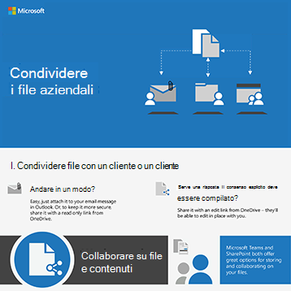
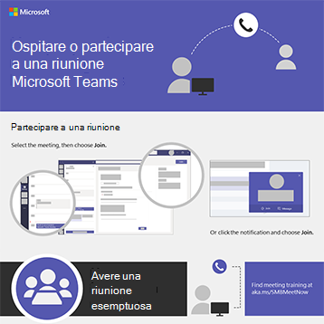
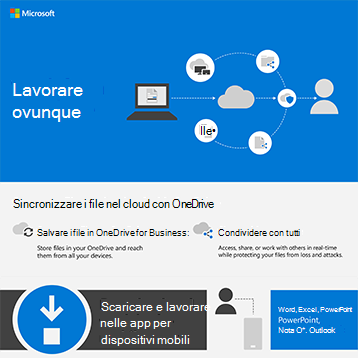
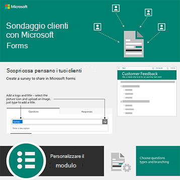

# Infografiche di Microsoft 365 per gli utenti

Queste infografiche rappresentano le procedure consigliate per lavorare e collaborare in Microsoft 365. Condividerli con gli utenti per assicurarsi di sfruttare l'archiviazione e la condivisione sicure per i file, tenere riunioni di collaborazione e altro ancora.

Altre [infografiche di Office scaricabili](https://support.microsoft.com/office/great-ways-to-work-with-office-6fe70269-b9a4-4ef0-a96e-7a5858b3bd5a) sono nel sito di formazione [di Microsoft 365.](https://support.microsoft.com/training)

## Suggerimenti per la sicurezza

Scarica questa infografica con suggerimenti per la sicurezza per i membri del team, sia che il team sia un'organizzazione aziendale o no profit, ad esempio una campagna politica:

| Elemento | Descrizione |
|:-----|:-----|
|   [Download in formato PDF](../campaigns/downloads/M365CampaignsWhatCanUsersDoToSecure.pdf)  \  [Scaricare come PowerPoint](../campaigns/downloads/M365CampaignsWhatCanUsersDoToSecure.pptx)| Condividere queste procedure consigliate per proteggere le informazioni dell'organizzazione. Questa infografica è stata creata per supportare lo staff delle campagne politiche perché sono mirate da sofisticati hacker. È possibile utilizzare PowerPoint per personalizzare questa infografica per la propria organizzazione. Articolo correlato: [In che modo gli elementi consigliati per la sicurezza di Microsoft 365 influiscono sugli utenti](../campaigns/m365-campaigns-users.md)|

## Condividere i file aziendali

Scarica un'infografica per ottenere una rapida panoramica dei modi per condividere i file aziendali:
  
| Elemento | Descrizione |
|:-----|:-----|
|   [Download in formato PDF](https://go.microsoft.com/fwlink/?linkid=2079435)  \  [Scaricare come PowerPoint](https://go.microsoft.com/fwlink/?linkid=2079438) | Utilizzare queste procedure consigliate quando si condividono e collaborano ai file aziendali in modo da mantenere le informazioni protette e protette. Articolo correlato: [Panoramica della condivisione di file aziendali](../business-video/overview-file-sharing.md)|

## Ospitare riunioni online

Scarica un'infografica per ottenere una breve panoramica di come partecipare o ospitare una riunione online con Microsoft Teams:

| Elemento | Descrizione |
|:-----|:-----|
|   [Download in formato PDF](https://go.microsoft.com/fwlink/?linkid=2078712)  \  [Scaricare come PowerPoint](https://go.microsoft.com/fwlink/?linkid=2079515) | Breve introduzione su come ospitare o partecipare a una riunione online con Microsoft Teams. Articolo correlato: [Ospitare riunioni online per la propria azienda](../business-video/overview-online-meetings.md)|

## Lavorare ovunque

Scarica un'infografica per ottenere suggerimenti per lavorare ovunque:

| Elemento | Descrizione |
|:-----|:-----|
|   [Download in formato PDF](https://go.microsoft.com/fwlink/?linkid=2079451)  \  [Scaricare come PowerPoint](https://go.microsoft.com/fwlink/?linkid=2079455) | Vedi suggerimenti su come configurare i dispositivi mobili per consentirti di lavorare ovunque. Articolo correlato: [Lavorare ovunque](../business-video/work-from-anywhere.md)|

## Sondaggio dei clienti con i moduli

Scarica un'infografica per scoprire come effettuare sondaggi sui clienti (interni o esterni) con Microsoft Forms:

| Elemento | Descrizione |
|:-----|:-----|
|   [Download in formato PDF](https://go.microsoft.com/fwlink/?linkid=2079526)  \  [Scaricare come PowerPoint](https://go.microsoft.com/fwlink/?linkid=2079446) | Utilizzare Microsoft Forms per scoprire cosa pensano i clienti. Articolo correlato: [Raccogliere informazioni con Microsoft Forms](https://support.microsoft.com/topic/collect-information-with-microsoft-forms-a55d6e0d-04f6-45b8-b05f-b141b8ecb4d5)|
