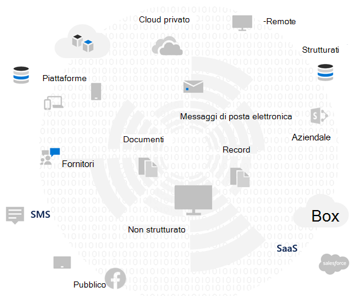
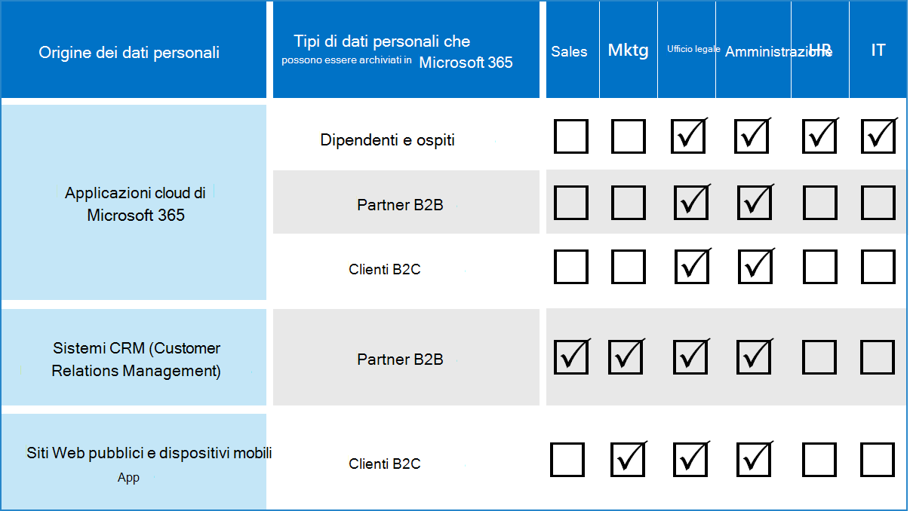

# Valutare i rischi per la privacy dei dati e identificare gli elementi sensibili con Microsoft 365

Valutare le normative sulla privacy dei dati e i rischi a cui l'organizzazione è soggetta è un primo passo fondamentale prima di implementare eventuali azioni di miglioramento correlate, compresi quelli ottenibili con le caratteristiche e i servizi di Microsoft 365. 

## Normativa sulla privacy dei dati potenzialmente applicabile

Per un buon riferimento al quadro normativo più ampio per le normative sulla privacy dei dati, vedere il [portale di Microsoft Services Trust](https://servicetrust.microsoft.com/) e la [serie di articoli sulla normativa generale sulla protezione dei dati (GDPR)](../compliance/gdpr.md), nonché altri materiali sui regolamenti che possono essere soggetti al settore o all'area geografica.

### GDPR

La GDPR, la più nota e citata delle normative sulla privacy dei dati, regola la raccolta, l'archiviazione, l'elaborazione e la condivisione dei dati personali che riguardano una persona fisica identificata o identificabile residente nell'Unione europea (UE). 

Secondo l'articolo 4 di GDPR: 

- ' dati personali ': tutte le informazioni relative a una persona fisica identificata o identificabile (' oggetto dei dati '); una persona fisica identificabile è quella che può essere identificata, direttamente o indirettamente, in particolare con riferimento a un identificatore come un nome, un numero di identificazione, i dati di posizione, un identificatore online o a uno o più fattori specifici dell'identità fisica, fisiologica, genetica, mentale, economica, culturale o sociale di quella persona fisica.

### ISO 27001

L'aderenza ad altri standard come ISO 27001 è stata riconosciuta anche da diverse autorità di vigilanza europee come un valido proxy di intenti in tutti gli utenti, processi e spettro tecnologico. Gli standard che specifica la sovrapposizione e l'aderenza ai meccanismi di protezione basati su ISO-27001 possono essere considerati un proxy che soddisfi alcuni obblighi di privacy in determinate circostanze.

### Altre normative sulla privacy dei dati

Altre importanti normative sulla privacy dei dati specificano anche i requisiti per la gestione dei dati personali.

Negli Stati Uniti, sono inclusi il California Consumer Protection Act ([CCPA](../compliance/ccpa-faq.md)), HIPAA-HITECH (United States Health Care Privacy Act) e Graham Leach Bliley Act (GLBA). Altre normative specifiche dello stato sono anche sul posto o in fase di sviluppo. 

In tutto il mondo, altri esempi includono la National GDPR implementation Act (BDSG), la Brazilian Data Protection Act (LGPD) e molte altre.

## Mapping di regolamento alle categorie di controllo tecnico Microsoft 365

Molte delle normative relative alla privacy dei dati hanno requisiti di sovrapposizione, pertanto è necessario comprendere quali normative sono soggette prima dello sviluppo di qualsiasi schema di controllo tecnico. 

Per informazioni di riferimento successive negli articoli di questa soluzione complessiva, questa tabella fornisce estratti da un campionamento delle normative sulla privacy dei dati. 

| Regolamento | Articolo/sezione | Estratto | Categorie di controllo tecnico applicabili |
|:-------|:-----|:-------|:-------|
| GDPR | Articolo 5, paragrafo 1, lettera f | I dati personali devono essere elaborati in modo da garantire una sicurezza adeguata dei dati personali, inclusa la protezione contro l'elaborazione non autorizzata o illecita e contro la perdita accidentale, la distruzione o il danneggiamento, usando misure tecniche o organizzative appropriate ("integrità e riservatezza".  |  Tutti   Identità   Dispositivo   Protezione dalle minacce   Proteggere le informazioni   Informazioni di governance   Individuazione e risposta |
|  | Articolo (32) (1) (a) | Tenendo conto dello stato dell'arte, dei costi di attuazione e della natura, della portata, del contesto e delle finalità del trattamento, nonché del rischio di variare la probabilità e la gravità dei diritti e delle libertà delle persone fisiche, il responsabile del trattamento e del processore deve implementare appropriate misure tecniche e organizzative per garantire un livello di sicurezza adeguato ai rischi , tra cui, tra l'altro, come appropriato: (a) lo pseudonimo e la crittografia dei dati personali. | Proteggere le informazioni |
|  | Articolo (13) (2) (a) | "... nel momento in cui vengono ottenuti i dati personali, il titolare del trattamento fornisce all'interessato le seguenti ulteriori informazioni necessarie per garantire l'elaborazione equa e trasparente: a il periodo per il quale verranno archiviati i dati personali o, se ciò non è possibile, i criteri utilizzati per determinare tale periodo. | Informazioni di governance |
|  | Articolo (15) (1) (e) | La persona interessata ha il diritto di ottenere dalla conferma del responsabile del trattamento se sono stati elaborati o meno i dati personali che lo riguardano. e dove è il caso, l'accesso ai dati personali e le seguenti informazioni: (e) l'esistenza del diritto di chiedere alla rettifica del controllore o alla cancellazione dei dati personali o la limitazione del trattamento dei dati personali relativi all'interessato o a opporsi a tale trattamento | Individuazione e risposta |
| LGPD | Articolo 46 | Gli agenti di elaborazione adottano misure di sicurezza, tecniche e amministrative in grado di proteggere i dati personali da accessi non autorizzati e da situazioni accidentali o illegali di distruzione, perdita, alterazione, comunicazione o qualsiasi tipo di elaborazione impropria o illecita. | Proteggere le informazioni   Informazioni di governance   Individuazione e risposta|
|  | Articolo 48 | Il titolare del trattamento dei dati deve comunicare all'autorità nazionale e all'interessato il verificarsi di un incidente di sicurezza che potrebbe comportare rischi o danni rilevanti agli interessati. | Individuazione e risposta |
| HIPPA-HITECH | 45 CFR 164.312(e)(1) | Attuare misure di sicurezza tecniche per impedire l'accesso non autorizzato alle informazioni sanitarie elettroniche protette che vengono trasmesse su una rete di comunicazione elettronica. | Proteggere le informazioni |
|  | 45 C.F.R. 164.312(e)(2)(II) | Implementare un meccanismo per crittografare le informazioni sanitarie protette elettroniche ogni qualvolta si ritenga opportuno. | Proteggere le informazioni |
|  | 45 CFR 164.312(c)(2) | Implementare meccanismi elettronici per confermare che le informazioni sanitarie protette elettroniche non siano state modificate né distrutte in modo non autorizzato. | Informazioni di governance |
|  | 45 CFR 164.316(b)(1)(i) | Se un'azione, un'attività o una valutazione è richiesta da questo capitolo per essere documentata, mantenere un record scritto (che potrebbe essere elettronico) dell'azione, dell'attività o della valutazione | Informazioni di governance |
|  | 45 CFR 164.316(b)(1)(ii) | Conservare la documentazione richiesta dal paragrafo (b)(1) della presente sezione per 6 anni dalla data di creazione o dalla data in cui era in vigore l'ultima volta, se posteriore. | Informazioni di governance |
|  | 45 C.F.R. 164.308(a)(1)(ii)(D) | Implementare procedure per la revisione periodica dei record dell'attività del sistema informativo, ad esempio i registri di controllo, i report di accesso e i rapporti di verifica degli incidenti | Individuazione e risposta |
|  | 45 C.F.R. 164.308(a)(6)(ii) | Identificare e rispondere a incidenti di sicurezza sospetti o noti; mitigare, per quanto possibile, gli effetti dannosi di incidenti di sicurezza noti all'entità coperta o al consulente professionale e documentare incidenti di sicurezza e i relativi risultati. | Individuazione e risposta |
|  | 45 C.F.R. 164.312(b) | Implementare meccanismi hardware, software e procedurali che registrano ed esaminano le attività nei sistemi informativi che contengono o utilizzano informazioni sanitarie protette elettronicamente. | Individuazione e risposta |
| CCPA | 1798.105(c) | Un'azienda che riceve una richiesta verificabile da un utente per eliminare le informazioni personali del consumer ai sensi della suddivisione (a) di questa sezione deve eliminare i dati personali del consumer dai propri record e indirizzare eventuali provider di servizi per eliminare le informazioni personali del consumer dai propri record. | Individuazione e risposta |
|  | 1798.105(d) | (eccezioni a 1798.105 (c)   Un'azienda o un provider di servizi non è tenuto a conformarsi alla richiesta del consumatore di eliminare le informazioni personali del consumatore, se è necessario che l'azienda o il provider di servizi mantengano le informazioni personali del consumatore per: (fare riferimento alla normativa vigente per ulteriori informazioni). | Individuazione e risposta |
|||||

>[!Important]
>Questo non è destinato a essere un elenco esaustivo. Fare riferimento a [Compliance Manager](../compliance/compliance-manager-overview.md) o ai consulenti legali o di conformità per ulteriori informazioni sull'applicabilità delle sezioni citate alle categorie di controllo tecnico elencate.
>

## Conoscenza dei dati

Indipendentemente dalle normative a cui si è soggetti, in cui diversi tipi di dati utente all'interno e all'esterno dell'organizzazione interagiscono con i sistemi sono tutti fattori importanti che possono influire sulla strategia globale di protezione dei dati personali, soggetta alle normative del settore e del governo che si applicano all'organizzazione. Questo include la posizione in cui vengono archiviati i dati personali, il tipo e la quantità di esso presenti e in quali circostanze sono state raccolte.
 

### Portabilità dei dati 

I dati si muovono anche nel tempo mentre vengono elaborati, affinati e altre versioni ne derivano. Lo snapshot iniziale non è mai sufficiente. Il processo di conoscenza dei dati deve essere in corso. Questo rappresenta una delle maggiori sfide per le organizzazioni di grandi dimensioni che gestiscono volumi significativi di dati personali. Le organizzazioni che non si occupano del problema del "know your data" potrebbero potenzialmente finire con rischi molto elevati e multe possibili dalle agenzie di regolamentazione.

 
### Dove si trovano i dati personali

Per soddisfare le normative sulla privacy dei dati, non è possibile fare affidamento su nozioni generali su dove si ritiene che i dati personali possano esistere, sia ora che in futuro. Le normative sulla privacy dei dati richiedono che le organizzazioni dimostrino di sapere dove si trovano i dati personali su base continuativa. In questo modo è importante prendere uno snapshot iniziale di tutte le origini dati per l'eventuale archiviazione di informazioni personali, incluso l'ambiente Microsoft 365, e stabilire meccanismi per il monitoraggio e il rilevamento in continuazione.

Se non è stato ancora valutato il livello di preparazione e rischio associati alle normative sulla privacy dei dati, utilizzare il seguente Framework in tre passaggi per iniziare. 

>[!Note]
>Questo articolo e il relativo contenuto non sono destinati a prendere il posto dei servizi di consulenza legale. Sono disponibili solo alcune informazioni di base e collegamenti a strumenti che possono essere di aiuto nelle fasi iniziali della valutazione.
>
 
## Passaggio 1: sviluppare una conoscenza di base degli scenari dei dati personali dell'organizzazione 

È necessario valutare l'esposizione ai rischi per la privacy dei dati in base al tipo di dati personali attualmente gestiti, in cui sono archiviati, quali controlli di protezione vengono applicati, come viene gestito il ciclo di vita e chi può accedervi. 

Come punto di partenza, è importante inventariare i tipi di dati personali presenti nell'ambiente Microsoft 365. Utilizzare queste categorie:

- Dati relativi ai dipendenti necessari per svolgere le funzioni aziendali quotidiane
- Dati che l'organizzazione ha sui clienti aziendali, i partner e altre relazioni nello scenario business-to-business (B2B)
- Dati che l'organizzazione ha riguardo ai consumatori che forniscono informazioni ai servizi online che l'organizzazione gestisce nello scenario business-to-Customer (B2C)

Di seguito è riportato un esempio dei diversi tipi di dati per i reparti tipici di un'organizzazione.

Gran parte dei dati personali che sono soggetti alla normativa sulla privacy dei dati in genere vengono raccolti e archiviati all'esterno di Microsoft 365. Tutti i dati personali provenienti da applicazioni Web o per dispositivi mobili rivolti ai consumatori devono essere stati esportati da tali applicazioni a Microsoft 365 per essere soggetti al controllo della privacy dei dati all'interno di Microsoft 365. 

L'esposizione alla privacy dei dati in Microsoft 365 può essere più limitata rispetto alle applicazioni Web e ai sistemi CRM, che questa soluzione non risolve.

È inoltre importante considerare i seguenti problemi comuni relativi alla conformità alla privacy dei dati durante la valutazione del profilo di rischio:

 - **Distribuzione dei dati personali.** In che modo sono diffuse informazioni su un determinato argomento? È noto abbastanza per convincere gli organi di regolamentazione che sono in vigore controlli adeguati? Se necessario, è possibile indagare e correggere i propri interventi.
- **Protezione da exfiltration.** In che modo è possibile proteggere i dati personali di un tipo o di un'origine specifica e come risponderne se lo fosse?
- **Protezione contro rischio.** Quali sono i meccanismi di protezione delle informazioni appropriate rispetto al rischio e come mantenere la continuità aziendale e la produttività e ridurre al minimo l'impatto dell'utente finale se è necessario l'intervento dell'utente finale? Ad esempio, è necessario utilizzare la classificazione o la crittografia manuale?
- **Conservazione dei dati personali.** Per quanto tempo devono essere conservate informazioni che contengono dati personali per motivi aziendali validi e come evitare le procedure di Keep-it-Forever passate, bilanciate con esigenze di conservazione per la continuità aziendale?
- **Gestione delle richieste del soggetto dei dati.** Quali sono i meccanismi necessari per gestire le richieste del soggetto dei dati (richieste DSR) e tutte le azioni correttive, ad esempio Anonymization, redazione ed eliminazione?
- **Monitoraggio e creazione di report in continuo.** Che tipo di monitoraggio giornaliero, di analisi e di creazione di report sono disponibili per i diversi tipi di dati e le origini?
- **Limitazioni relative all'elaborazione dei dati.** Esistono limitazioni sull'utilizzo dei dati per informazioni raccolte o archiviate tramite questi metodi che l'organizzazione deve riflettere nei controlli sulla privacy? Ad esempio, gli impegni che i dati personali non verranno utilizzati dal personale di vendita potrebbero richiedere all'organizzazione di applicare meccanismi per impedire il trasferimento o l'archiviazione di tali informazioni nei sistemi associati all'organizzazione di vendita.

### Dati relativi ai dipendenti necessari per svolgere le funzioni aziendali quotidiane

Le organizzazioni per natura devono raccogliere dati sui dipendenti per scopi di identità elettronica e HR, in base a ciò che accettano nei contratti con i dipendenti. A condizione che una persona funzioni per una società, in genere non è un problema. L'organizzazione può decidere di applicare meccanismi per impedire agli utenti malintenzionati di exfiltration o di perdere i dati personali dei dipendenti. 

Se una persona lascia una società, le organizzazioni presentano in genere processi, procedure e pianificazioni di conservazione ed eliminazione per la rimozione degli account utente, la disattivazione delle cassette postali e le unità personali e la modifica dello stato dei dipendenti in cose come i sistemi di risorse umane. Per le situazioni in cui è coinvolta una controversia legale, un dipendente o un'altra parte di un'indagine giudiziaria può avere validi motivi per ottenere informazioni sui dati personali archiviati nei sistemi dell'organizzazione. In alcuni casi, tale parte può richiedere che tali dati vengano rimossi o anonimi. 

Per rispondere a tali esigenze, le organizzazioni devono disporre di processi e procedure che affrontino preventivamente, detective e correttivi per facilitare tali richieste, rilevando che alcune informazioni su un dipendente possono essere ragionevolmente considerate cruciali per la continuità aziendale. Ad esempio, informazioni che un individuo ha creato un file o ha eseguito una funzione. 

>[!Note]
>Per le tecniche di analisi e correzione dei dati personali in Microsoft 365, vedere l' [articolo monitoraggio e risposta](information-protection-deploy-monitor-respond.md). È inoltre possibile utilizzare schemi di classificazione e protezione automatizzati per assicurarsi che i dati personali vengano controllati all'interno dell'organizzazione, oltre a impedirne l'uscita dall'organizzazione in situazioni di attore malevolo. Per ulteriori informazioni, vedere l' [articolo Protect Information](information-protection-deploy-protect-information.md) .
>
 
### Dati che l'organizzazione ha sui clienti aziendali nello scenario B2B

Raccolta di informazioni B2B è anche una sfida perché l'organizzazione potrebbe dover mantenere i record dei nomi di clienti e delle transazioni nei suoi vari sistemi per scopi di continuità aziendale ma proteggere tali informazioni da exfiltration involontario o dannoso. Analogamente ai dati dei dipendenti, le organizzazioni devono disporre di criteri, procedure e controlli tecnici per proteggere tali dati, nonché invecchiare in base a pianificazioni di conservazione e di eliminazione definite. 

In genere, i contratti con clienti esterni, partner e le altre entità con cui l'organizzazione svolge attività commerciali avranno la lingua per risolvere la gestione di tali dati, tra cui la protezione, la conservazione e l'eliminazione sia durante che dopo l'entità ha una relazione con l'organizzazione. 

### Dati che l'organizzazione ha riguardo ai consumatori che forniscono informazioni ai servizi online gestiti dall'organizzazione nello scenario B2C

Questa categoria è quella che la maggior parte delle persone pensa per la privacy dei dati, a causa di molte istanze pubbliche di perdita dei dati del cliente. Questo può essere intenzionale, ad esempio una terza parte sotto contratto per il provider o non intenzionale, ad esempio exfiltration da un attore malintenzionato. La protezione dei dati dei consumatori è uno dei motivi principali per cui l'Unione europea e gli altri hanno emanato queste normative. Le normative sulla privacy dei dati, come GDPR e CCPA, richiedono la pianificazione per:

- [Elenchi di controllo di conformità](../compliance/gdpr-arc-office365.md) e piani di [azione](../compliance/gdpr-action-plan.md)
- [Valutazioni dell'impatto sulla protezione dei dati](../compliance/gdpr-data-protection-impact-assessments.md)
- [Notifiche di violazione](../compliance/gdpr-breach-office365.md)
- [Richieste dell'interessato](../compliance/gdpr-dsr-office365.md)

Se l'organizzazione non esegue numerose raccolte dati direttamente da consumer, questa categoria potrebbe essere meno problematica. Tuttavia, potrebbe essere comunque necessario passare attraverso i processi descritti in questi articoli per ottenere la conformità.

### Riepilogo del passaggio 1

Understanding Your Exposure to risk and data privacy regulation è un primo passo importante basato su una conoscenza di base degli scenari dei dati personali dell'organizzazione.

Se non si dispone di dati personali provenienti da utenti dell'ambiente Microsoft 365 o se sono limitati a determinate parti dell'ambiente e la necessità di disporre di un controllo tecnico è basata sull'esposizione dei dati di tipo consumer, il controllo tecnico potrebbe essere necessario solo per le aree a rischio elevato dell'ambiente e non ovunque.

Anche se una raccomandazione relativa all'organizzazione esterna o al set di controlli standard, ad esempio dal punteggio di conformità in Microsoft 365, può contribuire a informare la strategia di controllo, la scelta dell'implementazione dovrebbe essere determinata dalla consapevolezza dell'inventario dei dati per quantificare l'esposizione reale al rischio.

La maggior parte delle organizzazioni avrà un certo livello di esposizione a uno degli scenari precedenti. L'adozione di un approccio olistico alla valutazione è importante.

## Passaggio 2: valutare la conformità con le normative sulla privacy dei dati

Anche se specifica per GDPR, le domande poste nello [strumento di valutazione di Microsoft GDPR](https://www.microsoft.com/cyberassessment/en/gdpr/uso365) gratuito forniscono un buon inizio per comprendere la conformità globale dei dati sulla privacy. 

Le organizzazioni soggette ad altre normative sulla privacy dei dati, ad esempio CCPA negli Stati Uniti o LGPD del Brasile, possono anche trarre vantaggio dall'inventario di questo strumento per la conformità con la GDPR.

La valutazione di GDPR è costituita da queste sezioni:

| | |
|:-------|:-----|
| Governance | <ol><li>Il criterio di privacy indica in modo esplicito quali informazioni sui dati vengono elaborate? </li><li>Eseguire regolarmente le valutazioni dell'impatto sulla privacy (PIA)? </li><li> È possibile utilizzare uno strumento per gestire le informazioni personali (PI)? </li><li> Si dispone di un'autorità legale per condurre attività commerciali utilizzando dati PI su un determinato individuo? È possibile monitorare il consenso per i dati? </li><li> È possibile monitorare, implementare e gestire i controlli di controllo? È possibile monitorare le perdite di dati? </li></ol>|
| Eliminazione e notifica | <ol><li>Vengono fornite istruzioni esplicite sulla modalità di accesso ai dati degli utenti? </li><li> Sono stati elaborati processi documentati per la gestione del consenso opt-out? </li><li> Si dispone di un processo di eliminazione automatizzato per i dati? </li><li>   Si dispone di un processo per convalidare l'identità quando si utilizza un cliente? </li></ol>|
| Attenuazione dei rischi e sicurezza delle informazioni | <ol><li>È possibile utilizzare gli strumenti per l'analisi dei dati non strutturati? </li><li>Tutti i server sono aggiornati e si sfruttano i firewall per proteggerli? </li><li>Si eseguono backup regolari dei server? </li><li>È possibile monitorare attivamente le perdite di dati? </li><li>I dati vengono crittografati a riposo e in trasmissione? </li></ol>|
| Gestione dei criteri | <ol><li>In che modo è possibile gestire le regole di Binding Corporate (BCRs)? </li><li>È possibile monitorare il consenso per i dati? </li><li> In base a una scala da 1 a 5, il livello di copertura dei contratti di classificazione dei dati e i requisiti di gestione sono tutti di 5. </li><li>È necessario testare periodicamente un piano di risposta per gli incidenti? </li><li>Quali criteri è possibile utilizzare per gestire l'accesso? </li></ol>|
|||
 
## Passaggio 3: identificare i tipi di informazioni riservate che si verificano nell'ambiente Microsoft 365. 

Questo passaggio implica l'identificazione di particolari tipi di informazioni riservate soggette a controlli normativi specifici, nonché la loro presenza nell'ambiente Microsoft 365. 

La ricerca di contenuti nell'ambiente che contengono personale può essere un'attività formidabile, che implica una combinazione di utilizzo di ricerca di conformità, eDiscovery, Advanced eDiscovery, DLP e auditing. 

Con la nuova soluzione di **classificazione dei dati** nell'interfaccia di amministrazione di Microsoft Compliance, è molto più semplice con la funzionalità [Content Explorer](../compliance/data-classification-content-explorer.md) , che funziona con i tipi di informazioni riservate o personalizzati incorporati, inclusi quelli relativi ai dati personali.
 
### Tipi di informazioni sensibili

L'interfaccia di amministrazione di Microsoft Compliance è precaricata con oltre 100 tipi di informazioni riservate, la maggior parte dei quali è relativa all'identificazione e all'individuazione dei dati personali. Questi tipi di informazioni riservate incorporate consentono di identificare e proteggere i numeri di carta di credito, i numeri di conto corrente bancario, i numeri di passaporto e altro ancora, in base a schemi definiti da un'espressione regolare (Regex) o da una funzione. Per altre informazioni, vedere [Elementi cercati dai tipi di informazioni sensibili](../compliance/what-the-sensitive-information-types-look-for.md).

Se è necessario identificare e proteggere un tipo di elementi sensibili specifici dell'organizzazione o regionale, ad esempio un formato personalizzato per gli ID dei dipendenti o altre informazioni personali non già coperte da un tipo di informazioni riservate incorporato, è possibile creare un tipo di informazioni riservate personalizzato con i metodi seguenti: 

- PowerShell
- Regole personalizzate con corrispondenza dati esatta (EDM)
- Tramite l'interfaccia utente di amministrazione del centro conformità, come evidenziato nell' [articolo Use Compliance score and Compliance Manager](information-protection-deploy-compliance.md)

È inoltre possibile personalizzare un tipo di informazioni riservate esistente incorporato.

Per ulteriori informazioni, vedere gli articoli seguenti:

- [Personalizzare una tipologia integrata di informazioni sensibili](../compliance/customize-a-built-in-sensitive-information-type.md)
- [Tipi di informazioni sensibili personalizzati](../compliance/custom-sensitive-info-types.md)
- [Creare un tipo di informazione sensibile personalizzato nel Centro sicurezza e conformità](../compliance/create-a-custom-sensitive-information-type.md)
- [Creare un tipo di informazioni sensibili personalizzato in PowerShell per Centro sicurezza e conformità](../compliance/create-a-custom-sensitive-information-type-in-scc-powershell.md)
- [Creare tipi di informazioni sensibili personalizzati con classificazione esatta basata su Exact Data Match](../compliance/create-custom-sensitive-information-types-with-exact-data-match-based-classification.md)

### Esplora contenuto

Uno strumento importante che per determinare l'occorrenza degli elementi sensibili nell'ambiente è la nuova finestra di [gestione dei contenuti](../compliance/data-classification-content-explorer.md) nell'interfaccia di amministrazione di conformità di Microsoft 365. Si tratta di uno strumento automatizzato per l'analisi iniziale e continua dell'intera sottoscrizione Microsoft 365 per l'occorrenza di tipi di informazioni riservate e la visualizzazione dei risultati.
 
Il nuovo strumento Esplora contenuto consente di identificare rapidamente le posizioni degli elementi sensibili nell'ambiente, utilizzando tipi di informazioni riservate incorporate o personalizzate. Ciò può comportare l'instaurazione di un processo e la responsabilità attribuita all'analisi periodica della presenza e della posizione degli elementi sensibili.

Insieme agli altri passaggi evidenziati in questo articolo, questo è il punto di partenza per identificare l'esposizione al rischio generale, la disponibilità e la posizione degli elementi sensibili per la protezione tramite la configurazione e il monitoraggio pianificati di Microsoft 365. 

### Altri metodi per identificare i dati personali nell'ambiente

Oltre all'esploratore contenuto, le organizzazioni hanno accesso alla funzionalità di ricerca contenuto per produrre ricerche personalizzate per individuare i dati personali nel proprio ambiente, utilizzando criteri di ricerca avanzati e filtri personalizzati.

In [questo articolo](../compliance/search-for-and-find-personal-data.md)vengono fornite indicazioni dettagliate sull'utilizzo della ricerca contenuto per l'individuazione dei dati personali. La ricerca di contenuto e altre tecniche di individuazione sono esplorate anche in [richieste DSR per GDPR e CCPA](../compliance/gdpr-dsr-office365.md#introduction-to-dsrs).

Ulteriori informazioni su tecniche di analisi e correzione dei dati personali in Microsoft 365 sono disponibili nell' [articolo monitoraggio e risposta](information-protection-deploy-monitor-respond.md).
