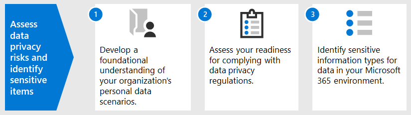

# Valutare i rischi per la privacy dei dati e identificare gli elementi sensibili con Microsoft 365

La valutazione delle normative sulla privacy dei dati e dei rischi a cui l'organizzazione è soggetta è un primo passo fondamentale prima di implementare eventuali azioni di miglioramento correlate, incluse quelle raggiungibili con funzionalità e servizi Microsoft 365 dati. 

## Normative sulla privacy dei dati potenzialmente applicabili

Per una buona guida di riferimento sul più ampio quadro normativo per le normative sulla privacy dei dati, vedere il Portale microsoft [per](https://servicetrust.microsoft.com/) la protezione dei servizi e la serie di articoli sul regolamento generale sulla protezione dei dati [(GDPR),](/compliance/regulatory/gdpr)nonché altri materiali sulle normative a cui potresti essere soggetto nel tuo settore o area geografica.

### GDPR

Il GDPR, il più noto e citato delle normative sulla privacy dei dati, regola la raccolta, l'archiviazione, l'elaborazione e la condivisione di tutti i dati personali relativi a una persona naturale identificata o identificabile residente nell'Unione Europea . 

Secondo l'articolo 4 del GDPR: 

- "dati personali" si intende qualsiasi informazione relativa a una persona naturale identificata o identificabile ('soggetto dei dati'); una persona fisica identificabile è una persona che può essere identificata, direttamente o indirettamente, in particolare facendo riferimento a un identificatore come un nome, un numero di identificazione, dati sulla posizione, un identificatore online o a uno o più fattori specifici dell'identità fisica, fisiologico, genetica, mentale, economica, culturale o sociale di tale persona fisica.

### ISO 27001

L'adesione ad altri standard come ISO 27001 è stata riconosciuta anche da diverse autorità di vigilanza europee come un valido proxy di intento tra le persone, i processi e lo spettro tecnologico. Gli standard che specificano la sovrapposizione e l'adesione ai meccanismi di protezione basata su ISO-27001 possono essere considerati un proxy che adempie ad alcuni obblighi di privacy in determinate circostanze.

### Altre normative sulla privacy dei dati

Altre importanti normative sulla privacy dei dati specificano anche i requisiti per la gestione dei dati personali.

Negli Stati Uniti, questi includono il California Consumer Protection Act[(CCPA),](/compliance/regulatory/ccpa-faq)HIPAA-HITECH (United States health care privacy act) e il Graham Leach Bliley Act (GLBA). Altre normative specifiche dello stato sono anche sul posto o in fase di sviluppo. 

In tutto il mondo, altri esempi includono il National GDPR Implementation Act (BDSG) della Germania, il Brazil Data Protection Act (LGPD) e molti altri.

## Mapping delle normative alle Microsoft 365 di controllo tecnico

Molte delle normative relative alla privacy dei dati hanno requisiti sovrapposti, quindi è consigliabile comprendere quali normative sono soggette a prima di sviluppare qualsiasi schema di controllo tecnico. 

Per riferimenti successivi negli articoli di questa soluzione complessiva, questa tabella fornisce estratti di un campionamento delle normative sulla privacy dei dati. 

| Regolamento | Articolo/sezione | Estratto | Categorie di controllo tecnico applicabili |
|:-------|:-----|:-------|:-------|
| GDPR | Articolo 5(1)(f) | I dati personali devono essere trattati in modo da garantire la sicurezza appropriata dei dati personali, compresa la protezione contro il trattamento non autorizzato o illecito e contro la perdita accidentale, la distruzione o il danneggiamento, utilizzando misure tecniche o organizzative appropriate ("integrità e riservatezza".  |  (Tutti)   Identità   Dispositivo   Protezione dalle minacce   Protezione delle informazioni   Governance delle informazioni   Individuazione e risposta |
|  | Articolo (32)(1)(a) | Tenendo conto dello stato dell'arte, dei costi di implementazione e della natura, dell'ambito, del contesto e degli scopi del trattamento, nonché del rischio di probabilità e gravità variabili per i diritti e le libertà delle persone fisiche, il controllore e il trattamento devono implementare misure tecniche e organizzative appropriate per garantire un livello di sicurezza adeguato al rischio , inclusi tra l'altro, se appropriato: (a) lo pseudonimo e la crittografia dei dati personali. | Protezione delle informazioni |
|  | Articolo (13)(2)(a) | "... il controllore, nel momento in cui vengono ottenuti i dati personali, fornisce all'oggetto dei dati le seguenti ulteriori informazioni necessarie per garantire un trattamento equo e trasparente: (a) il periodo per il quale i dati personali verranno archiviati o, se ciò non è possibile, i criteri utilizzati per determinare tale periodo. | Governance delle informazioni |
|  | Articolo (15)(1)(e) | L'oggetto dei dati ha il diritto di ottenere dal controllore la conferma dell'eventuale trattamento o meno dei dati personali che lo riguardano e, in tal caso, l'accesso ai dati personali e alle seguenti informazioni: (e) l'esistenza del diritto di richiedere al controllore la rettifica o la cancellazione dei dati personali o la restrizione del trattamento dei dati personali relativi all'oggetto dei dati o all'oggetto a tale riguardo elaborazione | Individuazione e risposta |
| LGPD | Articolo 46 | Gli agenti di trattamento adottano misure di sicurezza, tecniche e amministrative in grado di proteggere i dati personali da accessi non autorizzati e situazioni accidentali o illecite di distruzione, perdita, alterazione, comunicazione o qualsiasi tipo di trattamento improprio o illecito. | Protezione delle informazioni   Governance delle informazioni   Individuazione e risposta|
|  | Articolo 48 | Il titolare del trattamento dei dati deve comunicare all'autorità nazionale e all'interessato il verificarsi di un incidente di sicurezza che potrebbe comportare rischi o danni rilevanti agli interessati. | Individuazione e risposta |
| HIPPA-HITECH | 45 CFR 164.312(e)(1) | Attuare misure di sicurezza tecniche per impedire l'accesso non autorizzato alle informazioni sanitarie elettroniche protette che vengono trasmesse su una rete di comunicazione elettronica. | Protezione delle informazioni |
|  | 45 C.F.R. 164.312(e)(2)(II) | Implementare un meccanismo per crittografare le informazioni sanitarie protette elettroniche ogni qualvolta si ritenga opportuno. | Protezione delle informazioni |
|  | 45 CFR 164.312(c)(2) | Implementare meccanismi elettronici per confermare che le informazioni sanitarie protette elettroniche non siano state modificate né distrutte in modo non autorizzato. | Governance delle informazioni |
|  | 45 CFR 164.316(b)(1)(i) | Se questa sottoparte richiede la documentazione di un'azione, un'attività o una valutazione, mantenere un record scritto (che può essere elettronico) dell'azione, dell'attività o della valutazione | Governance delle informazioni |
|  | 45 CFR 164.316(b)(1)(ii) | Conservare la documentazione richiesta dal paragrafo (b)(1) della presente sezione per 6 anni dalla data di creazione o dalla data in cui era in vigore l'ultima volta, se posteriore. | Governance delle informazioni |
|  | 45 C.F.R. 164.308(a)(1)(ii)(D) | Implementare procedure per esaminare regolarmente i record delle attività del sistema di informazioni, ad esempio i log di controllo, i report di accesso e i report di verifica degli incidenti di sicurezza | Individuazione e risposta |
|  | 45 C.F.R. 164.308(a)(6)(ii) | Identificare e rispondere a incidenti di sicurezza sospetti o noti; mitigare, per quanto possibile, gli effetti dannosi di incidenti di sicurezza noti all'entità coperta o al consulente professionale e documentare incidenti di sicurezza e i relativi risultati. | Individuazione e risposta |
|  | 45 C.F.R. 164.312(b) | Implementare meccanismi hardware, software e procedurali che registrano ed esaminano l'attività nei sistemi in informazioni che contengono o utilizzano informazioni sanitarie protette elettroniche. | Individuazione e risposta |
| CCPA | 1798.105(c) | Un'azienda che riceve una richiesta verificabile da un utente di eliminare le informazioni personali dell'utente ai sensi della suddivisione (a) di questa sezione deve eliminare le informazioni personali dell'utente dai propri record e instradare qualsiasi provider di servizi a eliminare le informazioni personali dell'utente dai propri record | Individuazione e risposta |
|  | 1798.105(d) | (eccezioni a 1798.105(c)   Un'azienda o un provider di servizi non è tenuti a conformarsi alla richiesta di un utente di eliminare le informazioni personali dell'utente se è necessario che l'azienda o il provider di servizi mantenga le informazioni personali dell'utente per: (fare riferimento al regolamento corrente per ulteriori informazioni). | Individuazione e risposta |
|||||

>[!Important]
>Non si tratta di un elenco esaustivo. Per ulteriori informazioni sull'applicabilità delle sezioni citate, fare riferimento a [Compliance Manager](../compliance/compliance-manager.md) o al consulente legale o di conformità per le categorie di controllo tecnico elencate.
>

## Conoscere i dati

Indipendentemente dalle normative a cui si è soggetti, i diversi tipi di dati degli utenti all'interno e all'esterno dell'organizzazione interagiscono con i sistemi sono tutti fattori importanti che possono influire sulla strategia complessiva di protezione dei dati personali, in base alle normative del settore e del governo applicabili all'organizzazione. Ciò include la posizione in cui vengono archiviati i dati personali, il tipo e la quantità di tali dati e in quali circostanze sono stati raccolti.
 

### Portabilità dei dati 

I dati si spostano anche nel tempo durante l'elaborazione, la perfezione e altre versioni derivano da esso. Uno snapshot iniziale non è mai sufficiente. È necessario un processo continuo per conoscere i dati. Questo rappresenta una delle principali sfide per le organizzazioni di grandi dimensioni che gestiscono volumi significativi di dati personali. Le organizzazioni che non affrontano il problema "conoscere i dati" potrebbero potenzialmente avere rischi molto elevati e possibili sanzioni da parte delle agenzie di regolamentazione.

 
### Dove si trova il dato personale

Per affrontare le normative sulla privacy dei dati, non è possibile basarsi su nozioni generali su dove si pensa che i dati personali possano esistere, ora o in futuro. Le normative sulla privacy dei dati richiedono che le organizzazioni dimostrino di sapere dove si trova i dati personali su base continuativa. Ciò rende importante scattare uno snapshot iniziale di tutte le origini dati per l'archiviazione possibile delle informazioni personali, incluso l'ambiente Microsoft 365, e stabilire meccanismi per il monitoraggio e il rilevamento continui.

Se non hai ancora valutato la preparazione complessiva e i rischi associati alle normative sulla privacy dei dati, usa il framework in 3 passaggi seguente per iniziare. 

>[!Note]
>Questo articolo e il relativo contenuto non hanno lo scopo di prendere il posto dei servizi di consulenza legale. Fornisce solo alcune linee guida di base e collegamenti a strumenti che potrebbero essere di aiuto nelle prime fasi della valutazione.
>
 
## Passaggio 1: sviluppare una conoscenza di base degli scenari di dati personali dell'organizzazione 

È necessario valutare l'esposizione al rischio per la privacy dei dati in base al tipo di dati personali attualmente gestiti, dove vengono archiviati, quali controlli di protezione vengono posizionati su di esso, come viene gestito il ciclo di vita e chi ha accesso ad esso. 

Come punto di partenza, è importante creare un inventario dei tipi di dati personali presenti nell'ambiente Microsoft 365 locale. Usa queste categorie:

- Dati dei dipendenti necessari per svolgere le funzioni aziendali quotidiane
- Dati dell'organizzazione relativi a clienti aziendali, partner e altre relazioni nello scenario business-to-business (B2B)
- Dati dell'organizzazione relativi agli utenti che forniscono informazioni ai servizi online gestiti dall'organizzazione nello scenario business-to-customer (B2C)

Ecco un esempio dei diversi tipi di dati per i reparti tipici di un'organizzazione.

La maggior parte dei dati personali soggetti alla normativa sulla privacy dei dati viene in genere raccolta e archiviata al di fuori Microsoft 365. Tutti i dati personali provenienti da applicazioni web o per dispositivi mobili per i consumatori devono essere stati esportati da tali applicazioni a Microsoft 365 per essere soggetti al controllo della privacy dei dati all'interno di Microsoft 365. 

L'esposizione alla privacy dei Microsoft 365 potrebbe essere più limitata rispetto alle applicazioni Web e ai sistemi CRM, che questa soluzione non è in grado di risolvere.

Durante la valutazione del profilo di rischio, è inoltre importante tenere presente le seguenti problematiche comuni relative alla conformità della privacy dei dati:

 - **Distribuzione dei dati personali.** Quanto sono disperse le informazioni su un determinato argomento? È abbastanza noto per convincere gli organismi normativi che sono in atto controlli adeguati? Se necessario, è possibile eseguire indagini e correzioni?
- **Protezione dall'esfiltrazione.** Come si proteggono i dati personali di un determinato tipo o origine dall'essere compromessi e come rispondere in caso di compromissione?
- **Protezione e rischio.** Quali meccanismi di protezione delle informazioni sono appropriati in relazione al rischio e come mantenere la continuità e la produttività aziendali e ridurre al minimo l'impatto dell'utente finale se è necessario un intervento da parte dell'utente finale? Ad esempio, è consigliabile utilizzare la classificazione o la crittografia manuale?
- **Conservazione dei dati personali.** Per quanto tempo è necessario conservare le informazioni contenenti dati personali per motivi aziendali validi e come evitare le procedure di conservazione precedenti, bilanciate con le esigenze di conservazione per la continuità aziendale?
- **Gestione delle richieste dell'oggetto dei dati.** Quali meccanismi saranno necessari per gestire le richieste degli utenti di dati (DSR) ed eventuali azioni correttive, ad esempio l'anonimizzazione, la redazione e l'eliminazione?
- **Monitoraggio e report in corso.** Che tipo di tecniche quotidiane di monitoraggio, indagine e creazione di report sono disponibili per i diversi tipi di dati e origini?
- **Limitazioni relative all'elaborazione dei dati.** Esistono limitazioni relative all'utilizzo dei dati per le informazioni raccolte o archiviate tramite questi metodi che l'organizzazione deve riflettere nei controlli della privacy? Ad esempio, gli impegni che i dati personali non verranno utilizzati dal personale di vendita potrebbero richiedere all'organizzazione di mettere in atto meccanismi per impedire il trasferimento o l'archiviazione di tali informazioni nei sistemi associati all'organizzazione di vendita.

### Dati dei dipendenti necessari per svolgere le funzioni aziendali quotidiane

Per natura, le organizzazioni devono raccogliere dati sui dipendenti per l'identità elettronica e le risorse umane, a seconda di ciò che accettano nei contratti dei dipendenti. Finché una persona lavora per un'azienda, in genere non si tratta di un problema. L'organizzazione potrebbe voler mettere in atto meccanismi per impedire a malintenzionati di esfiltrare o di perdere dati personali dei dipendenti. 

Se una persona lascia un'azienda, le organizzazioni in genere dispongono di processi, procedure e pianificazioni di conservazione ed eliminazione per la rimozione degli account utente, la rimozione delle cassette postali e le unità personali e la modifica dello stato dei dipendenti in elementi come i sistemi delle risorse umane. Per le situazioni in cui è coinvolta una controversia legale, un dipendente o un'altra parte di un'indagine legale può avere motivi validi per ottenere informazioni sui dati personali archiviati nei sistemi dell'organizzazione. In alcune occasioni, tale parte può richiedere che tali dati siano rimossi o anonimi. 

Per soddisfare tali esigenze, le organizzazioni devono disporre di processi e procedure che rivolano le esigenze preventive, investigative e correttive per facilitare tali richieste, notando che alcune informazioni su un dipendente possono essere ragionevolmente considerate cruciali per la continuità aziendale. Ad esempio, informazioni che un singolo utente ha creato un file o ha eseguito una funzione. 

>[!Note]
>Per le tecniche di indagine e correzione per i dati personali in Microsoft 365, vedere l'articolo [monitoraggio e risposta.](information-protection-deploy-monitor-respond.md) È inoltre possibile utilizzare schemi di classificazione e protezione automatizzati per assicurarsi che i dati personali siano controllati all'interno dell'organizzazione, oltre a impedirne l'uscita dall'organizzazione in situazioni di attore dannoso. Per ulteriori [informazioni, vedere](information-protection-deploy-protect-information.md) l'articolo sulla protezione delle informazioni.
>
 
### Dati dell'organizzazione relativi ai clienti aziendali nello scenario B2B

La raccolta di informazioni B2B è anche una sfida perché l'organizzazione potrebbe dover conservare i record dei nomi dei clienti e delle transazioni nei vari sistemi per motivi di continuità aziendale, proteggendo tuttavia le informazioni da esfiltrazioni accidentali o dannose. Come per i dati dei dipendenti, le organizzazioni devono disporre di criteri, procedure e controlli tecnici per proteggere tali dati, oltre a definire l'età in base a pianificazioni di conservazione ed eliminazione definite. 

In genere, i contratti con clienti esterni, partner e altre entità con cui l'organizzazione fa affari avranno una lingua per gestire tali dati, tra cui protezione, conservazione ed eliminazione sia durante che dopo che l'entità ha una relazione con l'organizzazione. 

### Dati dell'organizzazione relativi agli utenti che forniscono informazioni ai servizi online gestiti dall'organizzazione nello scenario B2C

Questa categoria è quella a cui la maggior parte delle persone pensa per la privacy dei dati, a causa di molte istanze pubbliche di perdita di dati dei clienti. Può essere intenzionale, ad esempio una terza parte sotto contratto con il provider, o involontaria, ad esempio l'esfiltrazione da parte di un attore malintenzionato. La protezione dei dati dei consumatori è uno dei motivi principali per cui l'UE e altri hanno promulgato queste normative. Le normative sulla privacy dei dati come GDPR e CCPA richiedono la pianificazione per:

- [Piani d'azione](/compliance/regulatory/gdpr-action-plan) [e elenchi di controllo per la conformità](/compliance/regulatory/gdpr-arc-Office365)
- [Valutazioni dell'impatto sulla protezione dei dati](/compliance/regulatory/gdpr-data-protection-impact-assessments)
- [Notifiche di violazione](/compliance/regulatory/gdpr-breach-Office365)
- [Richieste dell'interessato](/compliance/regulatory/gdpr-dsr-Office365)

Se l'organizzazione non esegue molte raccolte di dati dirette dall'utente, questa categoria potrebbe non essere un problema. Tuttavia, potrebbe essere comunque necessario eseguire i processi descritti in questi articoli per ottenere la conformità.

### Riepilogo passaggio 1

Comprendere la normativa sull'esposizione ai rischi e alla privacy dei dati è un primo passo importante che si basa su una conoscenza fondamentale degli scenari di dati personali dell'organizzazione.

Se nell'ambiente di Microsoft 365 non si dispone di dati personali degli utenti o se sono limitati a determinate parti dell'ambiente e la necessità di un controllo tecnico è basata sull'esposizione dei dati di tipo consumer, il controllo tecnico potrebbe dover essere utilizzato solo in parti ad alto rischio dell'ambiente, non ovunque.

Anche se un'organizzazione esterna o un insieme di controlli standard consigliato, ad esempio da Compliance Manager in Microsoft 365, può contribuire a informare la strategia di controllo, la scelta dell'implementazione deve essere guidata dalla consapevolezza dell'inventario dei dati per quantificare l'esposizione al rischio reale.

La maggior parte delle organizzazioni avrà una certa esposizione a uno degli scenari precedenti. L'approccio olistico alla valutazione è importante.

## Passaggio 2: valutare la conformità per la conformità alle normative sulla privacy dei dati

Anche se specifiche del GDPR, le domande poste nello strumento gratuito di valutazione del [GDPR di Microsoft](https://www.microsoft.com/cyberassessment/en/gdpr/uso365) forniscono un buon inizio per comprendere la preparazione generale alla privacy dei dati. 

Anche le organizzazioni soggette ad altre normative sulla privacy dei dati, come il CCPA negli Stati Uniti o nel Gpl del Brasile, possono trarre vantaggio dall'inventario di conformità di questo strumento a causa di disposizioni sovrapposte con il GDPR.

La valutazione GDPR è costituita dalle sezioni seguenti:

| Sezione | Descrizione |
|:-------|:-----|
| Governance | <ol><li>L'informativa sulla privacy specifica esplicitamente quali informazioni sui dati vengono elaborate? </li><li>Eseguire regolarmente valutazioni di impatto sulla privacy (PIA)? </li><li> Si utilizza uno strumento per gestire le informazioni personali? </li><li> Si dispone dell'autorità legale per condurre attività aziendali utilizzando i dati pi su un determinato individuo? Tenere traccia del consenso per i dati? </li><li> Tenere traccia, implementare e gestire i controlli? Si monitorano le perdite di dati? </li></ol>|
| Eliminazione e notifica | <ol><li>Vengono fornite istruzioni esplicite su come è possibile accedere ai dati degli utenti? </li><li> Sono presenti processi documentati per la gestione del consenso esplicito? </li><li> Si dispone di un processo di eliminazione automatica per i dati? </li><li>   Si dispone di un processo per convalidare l'identità quando si interagisce con un cliente? </li></ol>|
| Mitigazione dei rischi e sicurezza delle informazioni | <ol><li>Si usano strumenti per analizzare i dati non strutturati? </li><li>Tutti i server sono aggiornati e si utilizzano firewall per proteggerli? </li><li>Eseguire backup regolari dei server? </li><li>Si monitorano attivamente le perdite di dati? </li><li>Crittografare i dati in pausa e in trasmissione? </li></ol>|
| Gestione dei criteri | <ol><li>Come si gestiscono le regole aziendali di binding (BCR)? </li><li>Tenere traccia del consenso per i dati? </li><li> Su una scala da 1 a 5, 5 completamente coperti, i contratti riguardano le classificazioni dei dati e i requisiti di gestione? </li><li>Si dispone e si testa regolarmente un piano di risposta agli incidenti? </li><li>Quale criterio viene utilizzato per gestire l'accesso? </li></ol>|
|||
 
## Passaggio 3: Identificare i tipi di informazioni riservate che si verificano nell'Microsoft 365 locale. 

Questo passaggio prevede l'identificazione di particolari tipi di informazioni riservate soggetti a controlli normativi specifici, nonché l'occorrenza di tali tipi nell'ambiente Microsoft 365 locale. 

Trovare contenuto nell'ambiente contenente dati personali può essere un'attività formidabile, che in precedenza prevedeva una combinazione di ricerca di conformità, eDiscovery, Advanced eDiscovery, DLP e controllo. 

Con la nuova soluzione **classificazione** dei dati nell'interfaccia di amministrazione di Conformità Microsoft, questo è diventato molto più semplice con la funzionalità [Esplora](../compliance/data-classification-content-explorer.md) contenuto, che funziona con tipi di informazioni riservate incorporati o personalizzati, inclusi quelli relativi ai dati personali.
 
### Tipi di informazioni sensibili

L'interfaccia di amministrazione di Conformità Microsoft viene precaricata con oltre 100 tipi di informazioni riservate, la maggior parte dei quali correlati all'identificazione e all'individuazione dei dati personali. Questi tipi di informazioni riservate predefiniti consentono di identificare e proteggere numeri di carta di credito, numeri di conto corrente bancario, numeri di passaporto e altro ancora, in base a modelli definiti da un'espressione regolare (regex) o da una funzione. Per altre informazioni, vedere [Elementi cercati dai tipi di informazioni sensibili](../compliance/sensitive-information-type-entity-definitions.md).

Se è necessario identificare e proteggere un tipo specifico dell'organizzazione o regionale di elementi sensibili, ad esempio un formato personalizzato per gli ID dei dipendenti o altre informazioni personali non già coperte da un tipo di informazioni riservate predefinito, è possibile creare un tipo di informazioni riservate personalizzato con questi metodi: 

- PowerShell
- Regole personalizzate con corrispondenza esatta dei dati (EDM)
- Tramite l'interfaccia utente di amministrazione del Centro conformità, come evidenziato [nell'articolo Use Compliance Score and Compliance Manager](information-protection-deploy-compliance.md)

È inoltre possibile personalizzare un tipo di informazioni riservate predefinito esistente.

Per ulteriori informazioni, vedere questi articoli:

- [Personalizzare un tipo di informazioni sensibili predefinito](../compliance/customize-a-built-in-sensitive-information-type.md)
- [Informazioni sui tipi di informazioni riservate](../compliance/sensitive-information-type-learn-about.md)
- [Creare un tipo di informazione sensibile personalizzato nel Centro sicurezza e conformità](../compliance/create-a-custom-sensitive-information-type.md)
- [Creare un tipo di informazioni sensibili personalizzato in PowerShell per Centro sicurezza e conformità](../compliance/create-a-custom-sensitive-information-type-in-scc-powershell.md)
- [Creare tipi di informazioni sensibili personalizzati con classificazione esatta basata su Exact Data Match](../compliance/create-custom-sensitive-information-types-with-exact-data-match-based-classification.md)

### Esplora contenuto

Uno strumento importante per determinare l'occorrenza di elementi sensibili nell'ambiente è il nuovo [Esplora](../compliance/data-classification-content-explorer.md) contenuto nell'interfaccia di amministrazione Microsoft 365 conformità. Si tratta di uno strumento automatizzato per l'analisi iniziale e continua dell'intero abbonamento Microsoft 365 per l'occorrenza di tipi di informazioni riservate e la visualizzazione dei risultati.
 
Il nuovo strumento Esplora contenuto consente di identificare rapidamente le posizioni degli elementi sensibili nell'ambiente, utilizzando tipi di informazioni riservate incorporati o personalizzati. Ciò può comportare la definizione di un processo e la responsabilità assegnata di analizzare regolarmente la presenza e la posizione di elementi sensibili.

Insieme agli altri passaggi evidenziati in questo articolo, questo rappresenta un punto di partenza per identificare l'esposizione al rischio globale, la preparazione e la posizione degli elementi sensibili da proteggere tramite la configurazione e il monitoraggio Microsoft 365 pianificazione. 

### Altri metodi per identificare i dati personali nell'ambiente

Oltre a Esplora contenuto, le organizzazioni hanno accesso alla funzionalità Ricerca contenuto per produrre ricerche personalizzate per trovare i dati personali nel proprio ambiente, utilizzando criteri di ricerca avanzati e filtri personalizzati.

In questo articolo vengono fornite istruzioni dettagliate sull'utilizzo di Ricerca contenuto per l'individuazione [dei dati personali.](/compliance/regulatory/gdpr) Ricerca contenuto e altre tecniche di individuazione sono inoltre esaminate nelle [DSR per il GDPR e il CCPA.](/compliance/regulatory/gdpr-dsr-Office365#introduction-to-dsrs)

Ulteriori approfondimenti sulle tecniche di indagine e correzione per i dati personali in Microsoft 365 sono disponibili nell'articolo [monitor and respond](information-protection-deploy-monitor-respond.md).

> [!NOTE]
> Per trovare le informazioni riservate presenti nei file archiviati in locale, fare riferimento a [Azure Information Protection.](/azure/information-protection/quickstart-findsensitiveinfo)