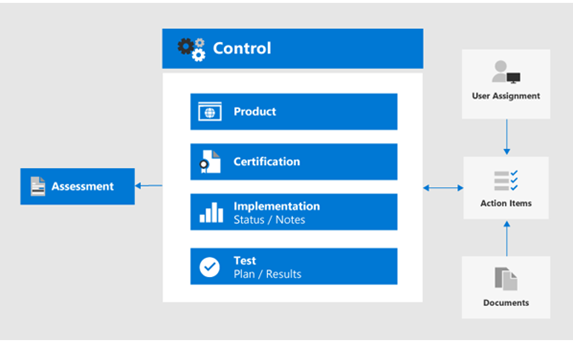

# Utilizzare la conformità score e Compliance Manager per gestire le azioni di miglioramento

Microsoft Compliance score and Compliance Manager può essere utilizzato insieme per gestire i miglioramenti relativi alle normative sulla privacy dei dati, come il [regolamento generale sulla protezione dei dati (GDPR)](../compliance/gdpr.md), la [California Consumer Protection Act CCPA)](../compliance/ccpa-faq.md), HIPAA-HITECH (US Health Care Privacy Act) e il Brazil Data Protection Act (LGPD). 

In questo articolo vengono fornite indicazioni sull'utilizzo di questi strumenti per la privacy dei dati.

>[!Note]
>Le azioni dei clienti fornite in Compliance Manager sono raccomandazioni. È necessario valutare l'efficacia di tali raccomandazioni negli ambienti normativi precedenti all'implementazione. I suggerimenti di Compliance Manager non devono essere interpretati come garanzia di conformità.
>

## Aggiornamenti pianificati per il Punteggio di conformità e Compliance Manager

[Punteggio di conformità](../compliance/compliance-score.md) (attualmente in anteprima) richiede l'aggiunta di valutazioni di destinazione per un regolamento (ad esempio GDPR) da [Compliance Manager](../compliance/compliance-manager-overview.md). In una versione futura, molte delle funzionalità di Compliance Manager verranno unite in un'esperienza di Punteggio di conformità unificata, riducendo la necessità di strumenti multipli.

Di seguito sono riportati gli strumenti per l'abbonamento, che richiedono l'accesso:

- [Punteggio di conformità nell'interfaccia di amministrazione di Microsoft Compliance](https://compliance.microsoft.com/compliancescore)
- [Compliance Manager nel portale Microsoft Services Trust](https://servicetrust.microsoft.com/ComplianceManager/V3)

## Guida introduttiva a Compliance Manager 

[Compliance Manager](../compliance/working-with-compliance-manager.md) (attualmente in anteprima) è uno strumento gratuito di valutazione dei rischi basato sul flusso di lavoro in Microsoft Service Trust Portal per la gestione delle attività di conformità alle normative relative ai servizi cloud di Microsoft. Come parte dell'abbonamento a Microsoft 365 o Azure Active Directory (Azure AD), Compliance Manager consente di gestire la conformità normativa all'interno del modello di responsabilità condivisa per i servizi cloud Microsoft.

Anche se è possibile visualizzare il Punteggio di conformità globale ed eseguire una serie di altre funzioni nella pagina **Punteggio** di conformità del centro conformità, è necessario utilizzare Compliance Manager tramite il portale dei servizi di trust per configurare prima le valutazioni per le normative sulla privacy dei dati. I dati provenienti da tali valutazioni verranno visualizzati in Score Compliance per ulteriori funzionalità di visualizzazione e filtraggio. 

Utilizzando l'interfaccia di Compliance Manager, è possibile selezionare uno o più modelli di regolamento relativi alla privacy dei dati e raggrupparli per valutare e monitorare le azioni di miglioramento richieste nel set. È inoltre possibile visualizzare le informazioni sui controlli che ogni regolamento richiede specifica per il servizio di destinazione, separati da Microsoft e dai controlli gestiti dal cliente.

Le valutazioni e lo stato di miglioramento selezionati in questo articolo vengono visualizzati anche nel punteggio di conformità nel centro conformità Microsoft, in cui viene sottolineata la priorità dell'installazione iniziale in Compliance Manager. Queste relazioni sono illustrate in questa figura.
 

Di seguito sono riportati i passaggi principali che consentono di iniziare.

### 1. modelli di valutazione

Da Compliance Manager, il primo passaggio consiste nell'aggiungere valutazioni specifiche per le normative sulla privacy dei dati di interesse e includerle in un gruppo definito "normativa sulla privacy dei dati".

I [gruppi](../compliance/working-with-compliance-manager.md#groups) sono contenitori che consentono di organizzare valutazioni e condividere le informazioni comuni e le attività del flusso di lavoro tra le valutazioni che dispongono dello stesso o dei controlli gestiti dal cliente. Quando due diverse valutazioni nello stesso gruppo condividono il controllo gestito dal cliente, il completamento dei dettagli dell'implementazione, il testing e lo stato del controllo vengono sincronizzati automaticamente allo stesso controllo in qualsiasi altra valutazione del gruppo. Questo unifica gli elementi di azione assegnati per ogni controllo nel gruppo e riduce il lavoro di duplicazione. 

È inoltre possibile scegliere di utilizzare i gruppi da organizzare. Valutazioni per anno, area, standard di conformità o altri raggruppamenti per facilitare l'organizzazione del lavoro di conformità.

### 2. elementi azione

Dopo aver aggiunto Le valutazioni, è possibile visualizzare gli elementi azione specifici di ogni gruppo o regolamentazione individuale:

- **Elenco delle azioni di miglioramento.** Passare all'elenco elementi azione e visualizzare le azioni di miglioramento associate a tutte le normative incluse nel gruppo. Molte azioni si estendono alle normative in modo che una singola voce di elenco possa rappresentare più regolamenti. 
 
- **Filtro per l'azione di miglioramento.** Per molte normative sulla privacy dei dati e gruppi di regolamenti, l'elenco delle azioni di miglioramento può essere piuttosto elevato, quindi è consigliabile filtrare l'elenco utilizzando il menu a discesa del filtro. Ad esempio, se si seleziona "controlli tecnici", l'elenco verrà ridotto solo a quelli che dispongono di un'implementazione tecnica nell'organizzazione, in quanto molte azioni sono correlate alle operazioni amministrative in vari aspetti dell'azienda, documentate anche in Compliance Manager. In questo articolo si concentrerà sui controlli tecnici, quindi è consigliabile questo approccio di filtro.
 
- **Ulteriori informazioni e revisione.** Per ogni azione, è possibile fare clic sul collegamento per **saperne di più**, in cui vengono fornite ulteriori informazioni sull'attività consigliata o sulla **Revisione**, che apre un modulo che consente di eseguire le operazioni seguenti:
 
   - Assegnare l'azione a un utente dell'organizzazione da gestire
   - Gestire i documenti relativi alla risoluzione dell'azione
   - Specificare lo stato per l'elemento
   - Specificare le date di implementazione e di testing
   - Registrare altre informazioni, Note sull'implementazione e note sul piano di test per l'azione Subject
  
- **Elementi non applicabili come fuori ambito.** Alcune azioni di miglioramento incluse nell'elenco degli elementi di azione potrebbero non essere valide per l'implementazione pianificata. È possibile specificare che non rientrano nell'ambito di Compliance Manager e rimuovere l'azione e le relative evidenze dal calcolo del valore del Punteggio di conformità. 

Ad esempio, se l'organizzazione ha scelto di utilizzare Microsoft Managed Key ", una raccomandazione per l'utilizzo della chiave del cliente non è applicabile alla distribuzione. In questo caso, l'organizzazione lo contrassegnerà come **non nell'ambito** nelle **azioni di controllo** per il modello normativo applicabile.
 
### 3. informazioni sui controlli

Per una visualizzazione specifica della valutazione, visualizzare le [informazioni sui controlli](../compliance/compliance-manager-overview.md#controls) per ogni gruppo di valutazione. In questo modo viene fornita una visualizzazione specifica del calcolo, che è la differenza rispetto all'elenco di elementi di azione, che fornisce una visualizzazione specifica del controllo tecnico.
 

Passare all'elenco delle **informazioni sui controlli** e visualizzare l'elenco dei servizi nell'ambito per il regolamento in questione. 
 
I gruppi di controlli specifici del regolamento elencano le azioni fornite dall'area di controllo per ogni area di servizio. Per ogni serie di azioni, Compliance Manager fornisce ulteriori informazioni sull'azione e può suggerire o fornire opzioni di revisione per assistere l'organizzazione nella scelta di un approccio di controllo.
 
Si noti che questa interfaccia fornisce la possibilità di visualizzare i dettagli specifici dell'azione tecnica, insieme allo stato delle azioni relative al controllo e al contesto supplementare in merito ai regolamenti a cui è correlata l'azione.

### 4. download del modello

Per coloro che hanno familiarità con l'analisi regolamentare basata su foglio di calcolo, un altro approccio consiste nel scaricare il modello per ogni valutazione corrispondente utilizzando l'elenco dei modelli. I modelli scaricati elencano sia le informazioni di controllo regolamentare che quelle tecniche per ogni modello e potrebbero essere più facili da individuare e filtrare e generare visualizzazioni specifiche per le aziende.
 
È inoltre possibile aggiungere un nuovo modello personalizzato per l'organizzazione in base a un modello esistente, utilizzando **Aggiungi modello**. In questo modo è necessario scaricare un modello di scelta (ad esempio HIPAA/HITECH)), quindi modificarlo per i propri scopi e ricaricarlo nello strumento Compliance Manager, in cui sarà ora possibile eseguire valutazioni e punteggi simili ad altri modelli e valutazioni come parte del set di strumenti di Compliance Manager and Compliance score.
 
>[!Tip]
>Se si ha a che fare con un gran numero di regolamenti o interventi di miglioramento sovrapposti, è consigliabile scaricare ogni modello e combinare i set di dati, rimuovere azioni di miglioramento o tipi di controllo che non si applicano all'organizzazione e ricaricare. Potrebbe essere più facile che esplorare ogni sezione delle informazioni di controllo e contrassegnare ciascuna di esse come fuori ambito.
>

## Punteggio di conformità

Dopo aver eseguito le valutazioni e le specifiche di revisione in Compliance Manager, è ora possibile accedere allo strumento [Punteggio di conformità](../compliance/compliance-score.md) ed esaminare il punteggio e suddividere i dati in modo più approfondito, tra cui l'area di controllo.

Lo strumento di valutazione della conformità nell'interfaccia di amministrazione di Microsoft 365 Compliance fornisce diversi approcci per esaminare e filtrare i dati di conformità ottenuti da Compliance Manager e vari servizi di Microsoft 365. Questo strumento viene aggiornato automaticamente quando vengono implementate varie impostazioni di configurazione e condivide i segnali con il Punteggio sicuro di Microsoft in modo che vengano visualizzate molte azioni di miglioramento in entrambi i punteggi. 
 
Il Punteggio di conformità fornisce:

- Un punteggio raccolto, suddiviso per Microsoft e per i controlli gestiti dal cliente
- Rollup delle azioni di miglioramento e dello stato di completamento
- Un elenco di soluzioni Microsoft 365 che influiscono sul Punteggio

### Modalità di calcolo del Punteggio di conformità

In breve, il punteggio viene calcolato in base a una combinazione di implementazioni di Microsoft e di controllo gestito dal cliente, come spiegato più dettagliatamente nell' [articolo di calcolo del Punteggio di conformità di Microsoft](../compliance/compliance-score-methodology.md).

Ai controlli viene assegnato un valore di punteggio in base al fatto che siano obbligatori o discrezionali e siano essi preventivo, investigativo o correttivo. Tali collettivamente rappresentano il rischio di non implementarlo in relazione ad altri controlli.

Come illustrato nell'articolo di calcolo del Punteggio di conformità di Microsoft, i controlli preventivi ottengono un punteggio più alto rispetto a quelli di detective e correttivi e i controlli obbligatori ottengono un punteggio più alto rispetto a quelli discrezionali.
 
Si noti che l'interfaccia utente di amministrazione del Punteggio di conformità non elenca questi parametri, né fornisce la possibilità di filtrarli. Tuttavia, se si Scarica il modello associato dallo strumento Compliance Manager, il set di dati risultante elenca questi parametri per la maggior parte delle normative.

Per i controlli tecnici, il Punteggio di conformità aggiornerà automaticamente il punteggio dell'azione di miglioramento dopo che la funzionalità correlata è stata attivata. Altre azioni di controllo non tecnico, come &mdash; quelle operative o correlate alla documentazione, &mdash; devono essere registrate manualmente nello strumento Compliance Manager nel portale dei servizi attendibili. 

È inoltre possibile implementare alcune azioni di miglioramento per altri scopi &mdash; , ad esempio l'utilizzo di etichette di conservazione per motivi diversi dalla conformità alla normativa sulla privacy dei dati in &mdash; modo da ottenere credito per l'utilizzo di tale caratteristica anche se viene utilizzato per altri scopi e non parte di un'azione di conformità deliberata.

Il Punteggio di conformità deve essere considerato una misura relativa per tenere conto del miglioramento su vasta scala. Non è necessario perseguire un punteggio perfetto. 

### Indicazioni aggiuntive

Di seguito sono riportate alcune importanti suggerimenti per l'utilizzo di Score compliance e Compliance Manager per ottenere la conformità alla normativa sulla privacy dei dati:

- Ogni normativa sulla privacy dei dati contiene una combinazione di controlli tecnici, specifiche della documentazione e requisiti operativi, di processo e di creazione di report. Tutte queste operazioni vengono visualizzate nelle azioni di miglioramento. 

- Questo articolo si concentra su un sottoinsieme dei controlli tecnici specificati per la privacy dei dati in Compliance Manager and Compliance score. Per ulteriori informazioni sui controlli amministrativi non tecnici, vedere lo strumento e la [documentazione](../compliance/compliance-score.md) di Compliance Manager.

- Per concentrare la visualizzazione delle azioni di miglioramento nell'area di interesse, è possibile filtrare in base al tipo di azione nella scheda **soluzioni** dell'amministratore del Punteggio di conformità.

- L'importanza relativa e la priorità delle azioni di miglioramento identificate nel punteggio di conformità devono essere considerate come parte di una più ampia revisione dei rischi insieme al rischio di privacy dei dati che è stato determinato dall'organizzazione. 

- Se si è un'organizzazione globale e si aggiungono più modelli di normativa sulla privacy dei dati in Compliance Manager come valutazioni, il Punteggio di conformità combinerà ognuno applicabile in un elenco di campi per ogni azione di miglioramento.
 
- Anche con l'aggregazione delle azioni di miglioramento tra più requisiti normativi, se vengono selezionati i modelli di valutazione della regolamentazione per GDPR, LGPD, CCPA e HIPAA-HITECH, ad esempio, quasi 400 azioni di miglioramento verranno elencate in Score Compliance. Per gestire meglio questo lungo elenco, utilizzare il filtro azione miglioramento per ridurre il set di risultati a un elenco più gestibile.

- Il filtro categorie fornisce un mezzo per filtrare le azioni di miglioramento tramite raggruppamento logico, in cui la pista, prevenire, proteggere, conservare ed esaminare gli articoli in questa soluzione complessiva è allineata a. 

- Alcuni dei controlli elencati nelle azioni di miglioramento possono essere considerati più direttamente associati a un determinato articolo normativo, mentre altri controlli possono essere più indirettamente connessi allo spirito di un regolamento e sono molte volte solo cose che è opportuno prendere in considerazione.

