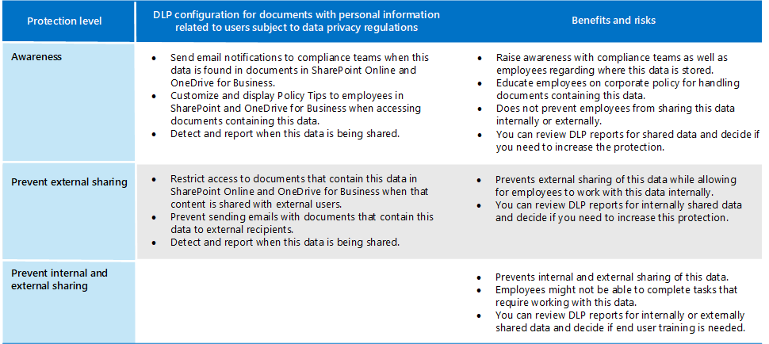
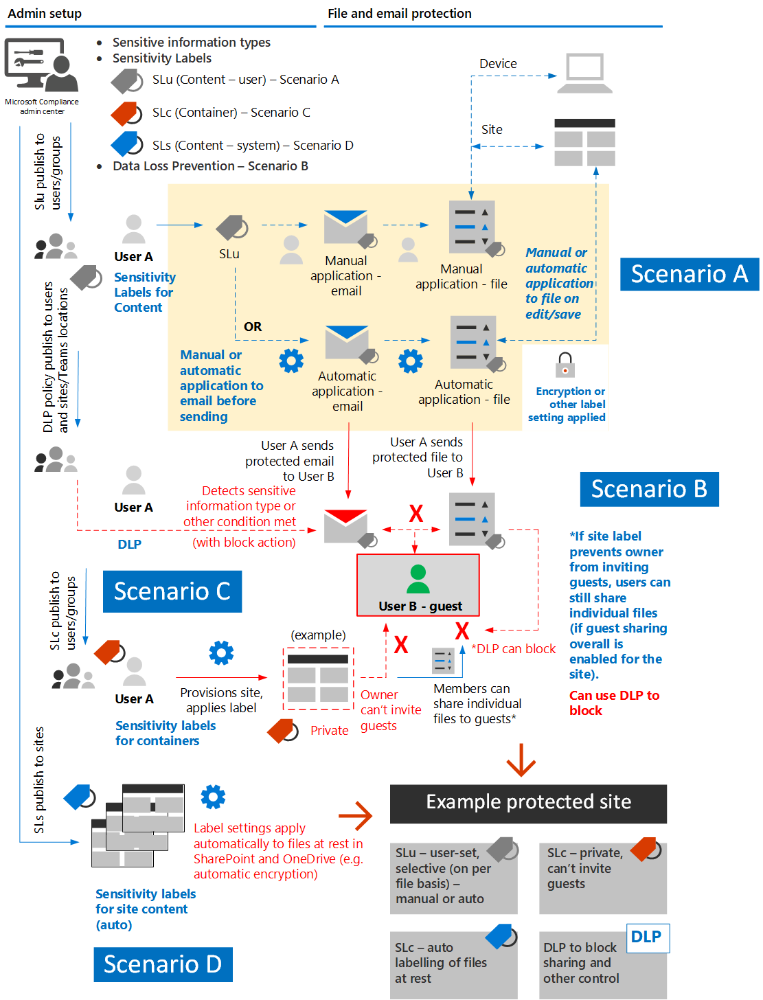

# Proteggere le informazioni soggette alle normative sulla privacy dei datiProtect information subject to data privacy regulation

Nell'abbonamento è possibile utilizzare diversi controlli di protezione delle informazioni per soddisfare le esigenze e le normative di conformità alla privacy dei dati.A number of information protection controls can be employed in your subscription to help address data privacy compliance needs and regulations. Questi includono il Regolamento generale sulla protezione dei dati (GDPR), HIPAA-HITECH (united States health care privacy act), California Consumer Protection Act (CCPA) e il Brazil Data Protection Act (LGPD).These include General Data Protection Regulation (GDPR), HIPAA-HITECH (the United States health care privacy act), California Consumer Protection Act (CCPA), and the Brazil Data Protection Act (LGPD).

Questi controlli sono all'interno delle aree della soluzione seguenti:These controls are within following solution areas:

- Etichette di riservatezzaSensitivity labels
- Prevenzione della perdita di dati (DLP)Data loss prevention (DLP)
- Crittografia messaggi di Office (OME)Office message encryption (OME)
- Controlli di accesso a Teams e sitiTeams and sites access controls

>[!Note]
>Questa soluzione descrive le funzionalità di sicurezza e conformità per proteggere le informazioni soggette alle normative sulla privacy dei dati.This solution describes security and compliance features to protect information subject to data privacy regulations. Per un elenco completo delle funzionalità di sicurezza in Microsoft 365, vedere la documentazione sulla sicurezza [di Microsoft 365.](https://docs.microsoft.com/microsoft-365/security/)For a complete list of security features in Microsoft 365, see [Microsoft 365 security documentation](https://docs.microsoft.com/microsoft-365/security/). Per un elenco completo delle funzionalità di conformità in Microsoft 365, vedere la [documentazione di conformità di Microsoft 365.](https://docs.microsoft.com/microsoft-365/compliance/)For a complete list of compliance features in Microsoft 365, see [Microsoft 365 compliance documentation](https://docs.microsoft.com/microsoft-365/compliance/).
>

## Normative sulla privacy dei dati che influiscono sui controlli di protezione delle informazioniData privacy regulations that impact information protection controls

Ecco un elenco di esempio di normative sulla privacy dei dati che possono riguardare i controlli di protezione delle informazioni:Here is a sample list of data privacy regulations that may relate to information protection controls:

- ARTICOLO 5(1)(f))GDPR Article 5(1)(f))
- Articolo GDPR (32)(1)(a)GDPR Article (32)(1)(a)
- Articolo LGPD 46LGPD Article 46
- HIPAA-HITECH (45 CFR 164.312(e)(1))HIPAA-HITECH (45 CFR 164.312(e)(1))
- HIPAA-HITECH (45 C.F.R.HIPAA-HITECH (45 C.F.R. 164.312(e)(2)(ii))164.312(e)(2)(ii))

Vedere [l'articolo valutare i rischi](information-protection-deploy-assess.md) per la privacy dei dati e identificare gli elementi sensibili per ulteriori informazioni su ognuno di questi articoli.See the [assess data privacy risks and identify sensitive items article](information-protection-deploy-assess.md) for more information on each of the above.

Le normative sulla privacy dei dati per la protezione delle informazioni consigliano:Data privacy regulations for information protection recommend:

- Protezione contro la perdita o l'accesso non autorizzato, l'utilizzo e/o la trasmissione.Protection against loss or unauthorized access, usage and/or transmission.
- Applicazione basata sul rischio di meccanismi di protezione.Risk-based application of protective mechanisms.
- Utilizzo della crittografia, se appropriato.Use of encryption where appropriate.

L'organizzazione potrebbe anche voler proteggere i contenuti di Microsoft 365 per altri scopi, ad esempio per altre esigenze di conformità o per motivi aziendali.Your organization may also want to protect Microsoft 365 content for other purposes, such as other compliance needs or for business reasons. La definizione dello schema di protezione delle informazioni per la privacy dei dati deve essere effettuata nell'ambito della pianificazione, dell'implementazione e della gestione generali della protezione delle informazioni.Establishing your information protection scheme for data privacy should be done as part of overall information protection planning, implementation, and management.

Per iniziare a usare uno schema di protezione delle informazioni in Microsoft 365, la sezione seguente include un breve elenco delle funzionalità correlate e delle azioni di miglioramento per Microsoft 365.To help you get started with an information protection scheme in Microsoft 365, the following section includes a short list of related capabilities and improvement actions for Microsoft 365. L'elenco include funzionalità e azioni di miglioramento applicabili alle normative sulla privacy dei dati.The list includes capabilities and improvement actions that are applicable to data privacy regulations. Tuttavia, l'elenco non include le tecnologie meno recenti se è presente una funzionalità più recente che sostituisce in gran parte quella precedente.However, the list doesn't include older technologies if there's a newer capability that largely supersedes the older one. Ad esempio, Information Rights Management (IRM) per SharePoint e OneDrive non è incluso nell'elenco, ma sono incluse le etichette di riservatezza.For example, Information Rights Management (IRM) for SharePoint and OneDrive is not included in the list but sensitivity labels are included.

## Gestione della protezione delle informazioni in Microsoft 365Managing information protection in Microsoft 365

Le [soluzioni microsoft di protezione delle](../compliance/information-protection.md) informazioni includono una serie di funzionalità integrate in Microsoft 365, Microsoft Azure e Microsoft Windows.Microsoft [information protection solutions](../compliance/information-protection.md) include a number of integrated capabilities across Microsoft 365, Microsoft Azure, and Microsoft Windows. In Microsoft 365, le soluzioni di protezione delle informazioni includono:In Microsoft 365, information protection solutions include:

- [Crittografia del servizio con Customer KeyService encryption with Customer Key](../compliance/customer-key-overview.md)
- [Tipi di informazioni riservate](../compliance/what-the-sensitive-information-types-look-for.md) (descritti nell'articolo valutare i rischi per la privacy dei [dati e identificare gli elementi sensibili)](information-protection-deploy-assess.md)[Sensitive information types](../compliance/what-the-sensitive-information-types-look-for.md) (described in the [assess data privacy risks and identify sensitive items article](information-protection-deploy-assess.md))
- [Etichette di riservatezzaSensitivity labels](../compliance/sensitivity-labels.md) 
  - Servizio/livello contenitoreService/container-level
  - Lato client/livello di contenutoClient-side/content-level
  - Automatizzato per i dati in pausa in SharePoint e OneDriveAutomated for data-at-rest in SharePoint and OneDrive
- Prevenzione della perdita dei dati (DLP)Data Loss Prevention (DLP)
- [Prevenzione della perdita dei dati degli endpoint di Microsoft 365Microsoft 365 Endpoint data loss prevention](../compliance/endpoint-dlp-learn-about.md)
- [Office 365 Message Encryption new capabilities (OME)](../compliance/ome.md) and OME [Advanced Message Encryption](../compliance/ome-advanced-message-encryption.md)[Office 365 Message Encryption new capabilities (OME)](../compliance/ome.md) and OME [Advanced Message Encryption](../compliance/ome-advanced-message-encryption.md)

Inoltre, la protezione a livello di sito e raccolta è un meccanismo importante da includere in qualsiasi schema di protezione.In addition, site and library level protection are important mechanisms to include in any protection scheme.

Per informazioni su altre funzionalità di protezione delle informazioni esterne a Microsoft 365, vedere:For information on other information protection capabilities outside of Microsoft 365, see:

- [Microsoft Cloud Application Security (MCAS)Microsoft Cloud Application Security (MCAS)](https://docs.microsoft.com/cloud-app-security/)
- [Azure Information ProtectionAzure Information Protection](https://docs.microsoft.com/azure/information-protection/what-is-information-protection)
- [Microsoft Endpoint ManagerMicrosoft Endpoint Manager](https://www.microsoft.com/microsoft-365/microsoft-endpoint-manager)
- [Windows Information ProtectionWindows Information Protection](https://docs.microsoft.com/windows/security/information-protection/windows-information-protection/protect-enterprise-data-using-wip)

## Etichette di riservatezzaSensitivity labels

Le etichette di riservatezza del framework di Microsoft Information Protection consentono di classificare e proteggere i dati dell'organizzazione senza ostacolare la produttività degli utenti e la loro capacità di collaborare.Sensitivity labels from the Microsoft Information Protection framework let you classify and protect your organization's data without hindering the productivity of users and their ability to collaborate.

### Prerequisiti per le etichette di riservatezzaPrerequisites for sensitivity labels

Completare queste attività prima di implementare una qualsiasi delle funzionalità basate su etichette di riservatezza evidenziate di seguito:Complete these activities prior to implementing any of the sensitivity label-based capabilities highlighted below:

1. Comprendere quanto segue:Understand the following:
   - **Requisiti aziendali.****Business requirements.** Stabilire i motivi aziendali per l'applicazione delle etichette di riservatezza nell'organizzazione.Establish the business reasons for applying sensitivity labels in your enterprise. Ad esempio, i requisiti di privacy dei dati per la protezione delle informazioni.For example, your data privacy requirements for information protection.
   - **Funzionalità delle etichette di riservatezza.****Sensitivity label capabilities.** L'etichettatura di riservatezza può essere complessa, quindi assicurati di leggere la documentazione relativa alle etichette [di](../compliance/sensitivity-labels.md) riservatezza prima di iniziare.Sensitivity labeling can get complex, so make sure to read the [sensitivity labels documentation](../compliance/sensitivity-labels.md) before getting started.
   - **Aspetti principali da ricordare** Le etichette di riservatezza vengono gestite nell'interfaccia di amministrazione di Conformità Microsoft, ma le opzioni di destinazione e applicazione variano in modo significativo.**Key things to remember** Sensitivity labels are managed in the Microsoft Compliance admin center but the targeting and application options vary significantly.
      - Esistono etichette di riservatezza per siti, gruppi e Teams a livello di contenitore (le impostazioni non si applicano al contenuto all'interno del contenitore).There are sensitivity labels for sites, groups, and Teams at the container level (the settings do not apply to content inside the container). Vengono pubblicati per gli utenti e i gruppi che li applicano quando viene eseguito il provisioning di un sito, un gruppo o un team.These are published to users and groups who apply them when a site, group or Team is provisioned.
      - Sono disponibili etichette di riservatezza per il contenuto attivo.There are sensitivity labels for active content. Vengono pubblicati anche per utenti o gruppi, che possono applicarli manualmente o vengono applicati automaticamente quando:These are also published to user or groups, who either manually apply them, or they get applied automatically when:
        - Il file viene aperto,modificato/salvato sul desktop dell'utente o in un sito di SharePoint.The file is opened/edited/saved, either to the user’s desktop or a SharePoint site.
        - Un messaggio di posta elettronica viene redatto e inviato.An email is drafted and sent.
      - Esistono etichette di riservatezza per l'applicazione automatica ai file in pausa in SharePoint e OneDrive oltre ai messaggi di posta elettronica in transito tramite Exchange.There are sensitivity labels for automatic application to files at rest in SharePoint and OneDrive in addition to emails in transit through Exchange. Sono destinati a tutti i siti o a quelli specifici e vengono applicati automaticamente ai file in stato di inquieto in questi ambienti.These are targeted to either all sites or specific ones and automatically apply to the files at rest in these environments.

2. Razionalizzare l'etichettatura di riservatezza corrente con metodi precedenti o alternativiRationalize current sensitivity labeling with past or alternative methods

   - Azure Information ProtectionAzure Information Protection

      Lo schema di etichettatura di riservatezza corrente potrebbe dover essere riconciliato con qualsiasi implementazione di [etichettatura](../compliance/sensitivity-labels.md#sensitivity-labels-and-azure-information-protection) di Azure Information Protection esistente.The current sensitivity labeling scheme may need to be reconciled with any existing [Azure Information Protection](../compliance/sensitivity-labels.md#sensitivity-labels-and-azure-information-protection) labeling implementation.
   - OMEOME

      Se si prevede di utilizzare l'etichettatura di riservatezza moderna per la protezione della posta elettronica e sono stati applicati metodi di crittografia della posta elettronica esistenti come OME, questi possono coesistere, ma è necessario comprendere gli scenari in cui devono essere applicati.If you are planning to use modern sensitivity labeling for email protection and existing email encryption methods like OME are in place, they can co-exist, but you should understand the scenarios in which either should be applied. Vedere [Office 365 Message Encryption new capabilities (OME),](#office-365-message-encryption-ome-new-capabilities)che include una tabella che confronta la protezione moderna del tipo di etichetta di riservatezza con la protezione basata su OME.See [Office 365 Message Encryption new capabilities (OME)](#office-365-message-encryption-ome-new-capabilities), which includes a table comparing modern sensitivity label-type protection with OME-based protection.

3. Pianificare l'integrazione in uno schema di protezione delle informazioni più ampio.Plan for integration into a broader information protection scheme. Oltre alla coesistenza con OME, le etichette di riservatezza correnti possono essere usate insieme a funzionalità come la prevenzione della perdita di dati (DLP) di Microsoft 365 e Microsoft Cloud App Security.On top of coexistence with OME, current sensitivity labels can be used along-side capabilities like Microsoft 365 data loss prevention (DLP) and Microsoft Cloud App Security. Vedere [Etichette di riservatezza e Microsoft Cloud App Security](../compliance/sensitivity-labels.md#sensitivity-labels-and-microsoft-cloud-app-security) per raggiungere gli obiettivi di protezione delle informazioni correlati alla privacy dei dati.See [Sensitivity Labels and Microsoft Cloud App Security](../compliance/sensitivity-labels.md#sensitivity-labels-and-microsoft-cloud-app-security) to achieve your data privacy-related information protection goals.

4. Sviluppare una classificazione e uno schema di controllo delle etichette di riservatezza.Develop a sensitivity label classification and control scheme. Vedere [Classificazione dei dati e tassonomia delle etichette di riservatezza.](https://aka.ms/dataclassificationwhitepaper)See [Data Classification and Sensitivity Label Taxonomy](https://aka.ms/dataclassificationwhitepaper).

### Indicazioni generaliGeneral guidance

1. **Definizione dello schema.****Schema definition.** Prima di usare le funzionalità tecniche per applicare etichette e protezione, lavorare all'interno dell'organizzazione per definire uno schema di classificazione.Before using technical capabilities to apply labels and protection, work across your organization to define a classification schema. Potrebbe essere già presente uno schema di classificazione, che semplifica l'aggiunta di dati personali.You might already have a classification schema, which makes it easier to add personal data. 
2. **Guida introduttiva.****Getting started.** Iniziare decidendo il numero e i nomi delle etichette da implementare.Begin by deciding on the number and names of labels to implement. Eseguire questa attività senza preoccuparsi della tecnologia da usare e della modalità di applicazione delle etichette.Do this activity without worrying about which technology to use and how labels will be applied. Applicare questo schema universalmente all'interno dell'organizzazione, inclusi i dati che risiedono in locale e in altri servizi cloud.Apply this schema universally throughout your organization, including data that resides on premises and in other cloud services.
3. **Suggerimenti aggiuntivi** Durante la progettazione e l'implementazione di criteri, etichette e condizioni, è consigliabile seguire questi suggerimenti:**Additional recommendations** When designing and implementing policies, labels, and conditions, consider following these recommendations:

   - **Utilizzare uno schema di classificazione esistente (se presente).****Use existing classification schema (if any).** Molte organizzazioni usano già la classificazione dei dati in qualche modo.Many organizations already are using data classification in some form. Valutare attentamente lo schema di etichette esistente e, se possibile, utilizzarlo così come è.Carefully evaluate the existing label schema and if possible, use it as is. L'uso di etichette familiari riconoscibili per gli utenti finali inseporterà l'adozione.Using familiar labels that are recognizable to your end-users will drive adoption.
   - **Iniziare con un valore piccolo.****Start small.** Il numero di etichette che è possibile creare è praticamente illimitato.There is virtually no limit to the number of labels that you can create. Tuttavia, un numero elevato di etichette ed etichette secondarie può rallentare l'adozione.However, large numbers of labels and sub-labels can slow adoption.
   - **Utilizzare scenari e casi d'uso.****Use scenarios and use cases.** Identificare i casi d'uso comuni all'interno dell'organizzazione e gli scenari di utilizzo derivati dalle normative sulla privacy dei dati a cui si è soggetti.Identify common use cases within your organization and use scenarios derived from the data privacy regulations to which you are subject. Verificare se la configurazione dell'etichetta e della classificazione previsto funzionerà nella pratica.Verify if the envisioned label and classification configuration will work in practice.
   - **Interrogare ogni richiesta di una nuova etichetta.****Question every request for a new label.** Ogni scenario o caso d'uso ha effettivamente bisogno di una nuova etichetta o è possibile usare ciò che si ha già?Does every scenario or use case really need a new label or can you use what you already have? Mantenere il numero minimo di etichette migliora l'adozione.Keeping the number of labels to a minimum improves adoption.
   - **Utilizzare etichette secondarie per i reparti chiave.****Use sub-labels for key departments.** Alcuni reparti hanno esigenze specifiche che richiedono etichette specifiche.Some departments will have specific needs that require specific labels. Definire queste etichette come etichette secondarie a un'etichetta esistente e prendere in considerazione l'uso di criteri con ambito assegnati ai gruppi di utenti anziché a livello globale.Define these labels as sub-labels to an existing label and consider using scoped policies that are assigned to user groups instead of globally.
   - **Considerare i criteri con ambito.****Consider scoped policies.** I criteri destinati a sottoinsiemi di utenti impediranno il sovraccarico delle etichette.Policies targeted at subsets of users will prevent label overload. Un criterio con ambito consente di assegnare etichette o etichette secondarie specifiche del ruolo o del reparto solo ai dipendenti che lavorano per quel reparto specifico.A scoped policy enables assigning role or department specific labels or sub-labels to just employees that work for that specific department. 
   - **Utilizzare nomi di etichetta significativi.****Use meaningful label names.** Cerca di non usare il gergo, gli standard o gli acronimi come nomi di etichetta.Try not to use jargon, standards, or acronyms as label names. Prova a usare nomi che risuonano con l'utente finale per migliorare l'adozione.Try to use names that resonate with the end user to improve adoption. Invece di usare etichette come PII, PCI, HIPAA, LBI, MBI e HBI, prendi in considerazione nomi come Non aziendale, Pubblico, Generale, Riservato ed Estremamente riservato.Instead of using labels like PII, PCI, HIPAA, LBI, MBI and HBI, consider names like Non-Business, Public, General, Confidential and Highly Confidential.

### Creare e distribuire etichette di riservatezza per siti, gruppi e teamCreate and deploy sensitivity labels for sites, groups, and teams

Quando si creano [etichette di](../compliance/sensitivity-labels-teams-groups-sites.md) riservatezza nel Centro conformità Microsoft 365, è ora possibile applicarle a questi contenitori:When you create [sensitivity labels](../compliance/sensitivity-labels-teams-groups-sites.md) in the Microsoft 365 compliance center, you can now apply them to these containers:

- Siti di Microsoft TeamsMicrosoft Teams sites
- Gruppi di Microsoft 365 (in precedenza gruppi di Office 365)Microsoft 365 groups (formerly Office 365 groups)
- Siti di SharePointSharePoint sites

Usare le impostazioni di etichetta seguenti per proteggere il contenuto in tali contenitori:Use the following label settings to help protect the content in those containers:

- Privacy (pubblica o privata) dei siti di Teams connessi al gruppo di Microsoft 365Privacy (public or private) of Microsoft 365 group-connected Teams sites
- Accesso utenti esterniExternal user access
- Accesso da dispositivi non gestitiAccess from unmanaged devices

Per la privacy dei dati, per impedire la condivisione esterna per i contenitori che verranno utilizzati per l'archiviazione di contenuto con dati personali sensibili, contrassegnare i file contenenti i dati come privati e richiedere dispositivi gestiti.For data privacy, to prevent external sharing for containers that will be used for storing content with sensitive personal data, mark the files containing the data as private, and require managed devices.

### Creare e distribuire etichette di riservatezza per il contenutoCreate and deploy sensitivity labels for content

Le etichette di riservatezza applicate ai file consentono di crittografarne il contenuto, applicare filigrane al contenuto e definire altri controlli per il contenuto delle applicazioni di Office, tra cui Outlook e Office sul Web.Sensitivity labels applied to files allow you to encrypt their content, watermark the content, and define other controls for Office applications content, including Outlook and Office on the web.

Quando si è pronti per iniziare a proteggere i dati dell'organizzazione con etichette di riservatezza:When you're ready to start protecting your organization's data with sensitivity labels:

1. **Creare le etichette.****Create the labels.** Creare e assegnare un nome alle etichette di riservatezza in base alla tassonomia di classificazione dell'organizzazione per i diversi livelli di riservatezza del contenuto.Create and name your sensitivity labels according to your organization's classification taxonomy for different sensitivity levels of content. Per ulteriori informazioni sullo sviluppo di una tassonomia di classificazione, vedere il white paper Classificazione dei dati e [tassonomia](https://aka.ms/dataclassificationwhitepaper)delle etichette di riservatezza.For more information on developing a classification taxonomy, see the [Data Classification and Sensitivity Label Taxonomy white paper](https://aka.ms/dataclassificationwhitepaper).
2. **Definire le caratteristiche di ogni etichetta.****Define what each label can do.** Configurare le impostazioni di protezione che si vogliono associare a ciascuna etichetta.Configure the protection settings you want associated with each label. Ad esempio, potrebbe essere necessario applicare solo un'intestazione o un piè di pagina a contenuto con riservatezza inferiore (ad esempio un'etichetta "Generale"), mentre a un contenuto con maggiore riservatezza (ad esempio un'etichetta "Riservato") deve essere applicata una filigrana e la crittografia è abilitata.For example, you might want lower sensitivity content (such as a "General" label) to have just a header or footer applied, while higher sensitivity content (such as a "Confidential" label) should have a watermark and have encryption enabled.
3. **Pubblicare le etichette.****Publish the labels.** Dopo aver configurato le etichette di riservatezza, pubblicarle usando un criterio di etichetta.After your sensitivity labels are configured, publish them by using a label policy. Decidere quali utenti e gruppi devono avere le etichette e quali impostazioni dei criteri usare.Decide which users and groups should have the labels and what policy settings to use. Una singola etichetta è riutilizzabile.A single label is reusable. È possibile definirla una sola volta e quindi includerla in diversi criteri di etichetta assegnati a utenti diversi.You define it once and then you can include it in several label policies assigned to different users.

Dopo aver pubblicato le etichette di riservatezza dal Centro conformità Microsoft 365, iniziano a comparire nelle app di [Office](../compliance/sensitivity-labels-office-apps.md) per consentire agli utenti di classificare e proteggere il contenuto durante la creazione o la modifica.Once you publish sensitivity labels from the Microsoft 365 compliance center, they start to appear in [Office apps](../compliance/sensitivity-labels-office-apps.md) for users to classify and protect content as it's created or edited.

Per la privacy dei dati, si applica manualmente un'etichetta di riservatezza con crittografia e altre regole alla posta elettronica o al contenuto contenente informazioni personali riservate.For data privacy, you manually apply a sensitivity label with encryption and other rules to email or content containing sensitive personal information.

>[!Note]
>Le etichette di riservatezza con la crittografia abilitata alla posta elettronica hanno alcune funzionalità sovrapposte con OME.Sensitivity labels with encryption enabled applied to email have some overlapping functionality with OME. Vedere [Confronto tra scenari di posta elettronica sicura e OME e etichette di riservatezza.](#secure-email-scenarios-comparison-with-ome-and-sensitivity-labels)See [Secure email scenarios comparison with OME and sensitivity labels](#secure-email-scenarios-comparison-with-ome-and-sensitivity-labels).

### Applicazione automatica di etichette sul lato client quando gli utenti modificano documenti o compongono messaggi di posta elettronicaClient-side auto-labeling when users edit documents or compose emails

Quando si crea un'etichetta  di riservatezza, è possibile assegnarla automaticamente al contenuto, incluso il messaggio di posta elettronica, quando soddisfa le condizioni specificate.When you create a sensitivity label, you can [automatically assign that label](../compliance/apply-sensitivity-label-automatically.md) to content including email when it matches conditions that you specify.

La possibilità di applicare automaticamente etichette di riservatezza al contenuto è importante perché:The ability to apply sensitivity labels to content automatically is important because:

- Non è necessario spiegare agli utenti quando usare le singole classificazioni.You don't need to train your users when to use each of your classifications.
- Non è necessario affidarsi solo agli utenti per la classificazione corretta di tutto il contenuto.You don't need to rely on users to classify all content correctly.
- Gli utenti non hanno più bisogno di conoscere i criteri e possono concentrarsi sul loro lavoro.Users no longer need to know about your policies—they can instead focus on their work.

L'applicazione automatica di etichette supporta la raccomandazione di un'etichetta agli utenti, nonché l'applicazione automatica di un'etichetta.Auto-labeling supports recommending a label to users, as well as automatically applying a label. In entrambi i casi, comunque, l'utente decide se accettarla o rifiutarla, per garantire la corretta etichettatura del contenuto.But in both cases, the user decides whether to accept or reject the label, to help ensure the correct labeling of content.

Questa etichettatura lato client ha un ritardo minimo per i documenti perché l'etichetta può essere applicata anche prima di salvare il documento.This client-side labeling has minimal delay for documents because the label can be applied even before the document is saved. Tuttavia, non tutte le app client supportano l'etichettatura automatica.However, not all client apps support auto-labeling. Questa funzionalità è supportata dal client di etichettatura unificata di Azure Information Protection e da [alcune versioni delle app di Office.](../compliance/sensitivity-labels-office-apps.md#support-for-sensitivity-label-capabilities-in-apps)This capability is supported by the Azure Information Protection unified labeling client, and [some versions of Office apps](../compliance/sensitivity-labels-office-apps.md#support-for-sensitivity-label-capabilities-in-apps).

Per istruzioni sulla configurazione, vedere [Come configurare l'etichettatura automatica per le app di Office.](../compliance/sensitivity-labels-office-apps.md#support-for-sensitivity-label-capabilities-in-apps)For configuration instructions, see [How to configure auto-labeling for Office apps](../compliance/sensitivity-labels-office-apps.md#support-for-sensitivity-label-capabilities-in-apps).

Per la privacy dei dati, si applicano automaticamente etichette di riservatezza per il contenuto contenente informazioni personali riservate.For data privacy, you auto-apply sensitivity labels for content containing sensitive personal information.

### Etichettatura automatica sul lato servizio quando il contenuto è già salvatoService-side auto-labeling when content is already saved

Questo metodo è denominato classificazione automatica con etichette di riservatezza.This method is referred to as auto classification with sensitivity labels. Si potrebbe anche sentire che si parla di etichettatura automatica per i dati in stato di inquieto (per i documenti in SharePoint e OneDrive) e i dati in transito (per i messaggi di posta elettronica inviati o ricevuti da Exchange).You might also hear it referred to as auto-labeling for data at rest (for documents in SharePoint and OneDrive) and data in transit (for email that is sent or received by Exchange). Per Exchange, non include i messaggi di posta elettronica nelle cassette postali in stato di inquieto.For Exchange, it doesn't include emails in mailboxes at rest.
 
Poiché questa etichettatura viene applicata dal servizio stesso anziché dall'applicazione utente, non è necessario preoccuparsi delle app di cui dispongono gli utenti e della versione.Because this labeling is applied by the service itself rather than by user application, you don't need to worry about what apps users have and what version. Di conseguenza, questa funzionalità è immediatamente disponibile nell'intera organizzazione ed è adatta per l'applicazione di etichette su vasta scala.As a result, this capability is immediately available throughout your organization and suitable for labeling at scale. I criteri di applicazione automatica di etichette non supportano l'applicazione di etichette consigliate perché l'utente non interagisce con il processo di etichettatura.Auto-labeling policies don't support recommended labeling because the user doesn't interact with the labeling process. L'amministratore esegue invece i criteri in modalità di simulazione per garantire la corretta etichettatura del contenuto prima dell'applicazione effettiva dell'etichetta.Instead, the administrator runs the policies in simulation mode to help ensure the correct labeling of content before actually applying the label.

Per istruzioni sulla configurazione, vedere Come configurare i criteri di applicazione automatica di etichette [per SharePoint, OneDrive ed Exchange.](../compliance/apply-sensitivity-label-automatically.md#how-to-configure-auto-labeling-policies-for-sharepoint-onedrive-and-exchange)For configuration instructions, see [How to configure auto-labeling policies for SharePoint, OneDrive, and Exchange](../compliance/apply-sensitivity-label-automatically.md#how-to-configure-auto-labeling-policies-for-sharepoint-onedrive-and-exchange).

Per la privacy dei dati all'interno dei siti di interesse, inserire etichette di riservatezza per la crittografia automatica dei contenuti contenenti informazioni personali riservate.For data privacy within sites of concern, push sensitivity labels for automatic encryption of content containing sensitive personal information.

## Prevenzione della perdita di datiData loss prevention 

È possibile utilizzare la prevenzione della perdita dei dati [(DLP)](../compliance/data-loss-prevention-policies.md) in Microsoft 365 per rilevare, avvisare e bloccare la condivisione rischiosa, involontaria o inappropriata, ad esempio la condivisione di dati contenenti informazioni personali, sia internamente che esternamente.You can use [data loss prevention (DLP)](../compliance/data-loss-prevention-policies.md) in Microsoft 365 to detect, warn, and block risky, inadvertent, or inappropriate sharing, such as sharing of data containing personal information, both internally and externally.

DLP consente di:DLP allows you to:

- Identificare e monitorare le attività di condivisione rischiose.Identify and monitor risky sharing activities.
- Formare gli utenti con indicazioni nel contesto per prendere le decisioni giuste.Educate users with in-context guidance to make the right decisions.
- Applicare criteri di utilizzo dei dati al contenuto senza inibire la produttività.Enforce data use policies upon content without inhibiting productivity.
- Integrare con la classificazione e l'etichettatura per rilevare e proteggere i dati quando vengono condivisi.Integrate with classification and labeling to detect and protect data when it is shared.

### Carichi di lavoro supportati per DLPSupported workloads for DLP

Con un criterio DLP nel Centro conformità Microsoft 365, è possibile identificare, monitorare e proteggere automaticamente gli elementi sensibili in molte posizioni in Microsoft 365, ad esempio Exchange Online, SharePoint, OneDrive e Microsoft Teams.With a DLP policy in the Microsoft 365 compliance center, you can identify, monitor, and automatically protect sensitive items across many locations in Microsoft 365, such as Exchange Online, SharePoint, OneDrive, and Microsoft Teams.

Ad esempio, è possibile identificare qualsiasi documento contenente un numero di carta di credito archiviato in qualsiasi sito di OneDrive oppure monitorare solo i siti di OneDrive di persone specifiche.For example, you can identify any document containing a credit card number that's stored in any OneDrive site, or you can monitor just the OneDrive sites of specific people.

È inoltre possibile monitorare e proteggere gli elementi sensibili nelle versioni installate localmente di Excel, PowerPoint e Word, che includono la possibilità di identificare gli elementi sensibili e applicare i criteri DLP.You can also monitor and protect sensitive items in the locally-installed versions of Excel, PowerPoint, and Word, which include the ability to identify sensitive items and apply DLP policies. DLP fornisce il monitoraggio continuo quando gli utenti condividono il contenuto di queste app di Office.DLP provides continuous monitoring when people share content from these Office apps.

Questa figura mostra un esempio di prevenzione della perdita dei dati (DLP) che protegge i dati personali.This figure shows an example of DLP protecting personal data.

DLP viene utilizzato per identificare un documento o un messaggio di posta elettronica contenente un record di integrità e quindi blocca automaticamente l'accesso a tale documento o impedisce l'invio del messaggio di posta elettronica.DLP is used to identify a document or email containing a health record and then automatically blocks access to that document or blocks the email from being sent. Dlp invia quindi una notifica al destinatario con un suggerimento per i criteri e invia un avviso all'utente finale e all'amministratore.DLP then notifies the recipient with a policy tip and sends an alert to the end-user and admin.

### Pianificazione della prevenzione della perdita dei datiPlanning for DLP

Pianificare i criteri DLP per:Plan your DLP policies for: 

- Requisiti aziendali.Your business requirements.

- Una valutazione basata sui rischi dell'organizzazione, come descritto nell'articolo valutare i rischi per la privacy dei [dati e identificare gli elementi sensibili.](information-protection-deploy-assess.md)A risk-based assessment of the organization as described in the [assess data privacy risks and identify sensitive items article](information-protection-deploy-assess.md).

- Altri meccanismi di protezione delle informazioni e governance in atto o nella pianificazione della privacy dei dati.Other information protection and governance mechanisms in place or in planning for data privacy.

- I tipi di informazioni riservate identificati per i dati personali in base al lavoro di valutazione, come descritto nell'articolo valutare i rischi per la privacy dei dati e [identificare gli elementi sensibili.](information-protection-deploy-assess.md)The sensitive information types that you’ve identified for personal data based on your assessment work as described in the [assess data privacy risks and identify sensitive items article](information-protection-deploy-assess.md). Le condizioni dei criteri DLP possono essere basate sia sui tipi di informazioni riservate che sulle etichette di conservazione.DLP policy conditions can be based on both sensitive information types and retention labels.

- Le etichette di conservazione necessarie per specificare le condizioni DLP.The retention labels you'll need to specify DLP conditions. Per ulteriori [informazioni, vedere l'articolo](information-protection-deploy-govern.md) sulla governance delle informazioni soggette alla normativa sulla privacy dei dati nell'articolo dell'organizzazione.See the [govern information subject to data privacy regulation in your organization](information-protection-deploy-govern.md) article for more information.

- Gestione continua dei criteri DLP, che richiede a un utente dell'organizzazione di operare e ottimizzare i criteri per le modifiche ai tipi di informazioni riservate, alle etichette di conservazione, alle normative e ai criteri di conformità.Ongoing DLP policy management, which requires someone in the organization to operate and tune policies for changes in sensitive information types, retention labels, regulations, and compliance policies.

Anche se le etichette di riservatezza non possono essere utilizzate nelle condizioni dei criteri DLP, alcuni scenari di protezione per impedire l'accesso possono essere raggiungibili solo con etichette di riservatezza che possono essere applicate automaticamente in base ai tipi di informazioni riservate.Although sensitivity labels can’t be used in DLP policy conditions, certain protection scenarios to prevent access may be achievable with just sensitivity labels that can be auto-applied based on sensitive information types. Se è presente un'etichettatura di riservatezza affidabile, valutare se utilizzare DLP per aumentare la protezione perché:If robust sensitivity labeling is in place, consider whether DLP should be used to augment protection because:

  - DLP può impedire la condivisione di file.DLP can prevent sharing of files. Le etichette di riservatezza possono semplicemente impedire l'accesso.Sensitivity labels can just prevent access.

  - DLP ha livelli di controllo più granulari in termini di regole, condizioni e azioni.DLP has more granular levels of control in terms of rules, conditions, and actions.

  - I criteri DLP possono essere applicati ai messaggi di chat e canali di Teams.DLP policies can be applied to Teams chat and channel messages. Le etichette di riservatezza possono essere applicate solo a documenti e messaggi di posta elettronica.Sensitivity labels can only be applied to documents and email.

### Criteri di prevenzione della perdita di dati (DLP)DLP policies

I criteri DLP vengono configurati nell'interfaccia di amministrazione di Conformità Microsoft e specificano il livello di protezione, il tipo di informazioni riservate ricercate dal criterio e i carichi di lavoro di destinazione.DLP policies are configured in the Microsoft Compliance admin center and specify the level of protection, the sensitive information type the policy is looking for, and the target workloads. I componenti di base sono costituiti dall'identificazione della protezione e dei tipi di dati.Their basic components consist of identifying the protection and the types of data.

Ecco un esempio di criterio DLP per la consapevolezza del GDPR.Here is an example DLP policy for awareness of GDPR.

Vedere [questo articolo](../compliance/create-test-tune-dlp-policy.md) per ulteriori informazioni sulla creazione e l'applicazione di criteri DLP.See [this article](../compliance/create-test-tune-dlp-policy.md) for more information about creating and applying DLP policies.

### Livelli di protezione per la privacy dei datiProtection levels for data privacy

Nella tabella seguente sono elencate tre configurazioni per aumentare la protezione tramite DLP.The following table lists three configurations of increasing protection using DLP.

La prima configurazione, Consapevolezza, può essere usata come punto di partenza e livello minimo di protezione per soddisfare le esigenze di conformità per le normative sulla privacy dei dati.The first configuration, Awareness, can be used as a starting point and minimum level of protection to address compliance needs for data privacy regulations.

>[!Note]
>Con l'aumentare dei livelli di protezione, la capacità degli utenti di condividere e accedere alle informazioni diminuisce in alcuni casi e potrebbe influire potenzialmente sulla produttività o sulla capacità di completare le attività quotidiane.As the levels of protection increase, the ability of users to share and access information will decrease in some cases and could potentially impact their productivity or ability to complete daily tasks.
>

Per aiutare i dipendenti a continuare a essere produttivi in un ambiente più sicuro quando aumentano i livelli di protezione, prendere il tempo necessario per formarli ed educarli su nuovi criteri e procedure di sicurezza.To help your employees continue to be productive in a more secure environment when increasing protection levels, take the time to train and educate them on new security policies and procedures.

### Esempio di utilizzo delle etichette di riservatezza con DLPExample of using sensitivity labels with DLP

Le etichette di riservatezza possono collaborare con DLP per garantire la privacy dei dati in un ambiente altamente regolamentato.Sensitivity labels can work together with DLP to provide data privacy in a highly regulated environment. Ecco i passaggi principali della distribuzione integrata:Here are the key steps of the integrated deployment:

1. Sono documentati i requisiti normativi e aziendali per la privacy dei dati.Regulatory and otherwise business requirements for data privacy are documented.
2. Le origini dati, i tipi e la proprietà di destinazione sono caratterizzati da problematiche relative alla privacy dei dati.Target data sources, types, and ownership are characterized relative to data privacy concerns.
3. Viene stabilita una strategia generale per soddisfare i requisiti e proteggere e gestire gli hotspot di privacy dei dati.An overall strategy to address requirements and protect and govern data privacy hotspots is established.
4. È stato messo in atto un piano d'azione in più fasi per affrontare la strategia di controllo della privacy dei dati.A phased action plan to address the data privacy control strategy is put into place.

Una volta determinati questi elementi, è possibile utilizzare i tipi di informazioni riservate, la tassonomia di etichettatura di riservatezza e i criteri DLP insieme.Once these elements are determined, you can use sensitive information types, your sensitivity labeling taxonomy, and DLP policies together. Questa figura mostra un esempio.This figure shows an example.

[Vedere una versione più grande di questa immagineSee a larger version of this image](https://github.com/MicrosoftDocs/microsoft-365-docs/raw/public/microsoft-365/media/information-protection-deploy-protect-information/information-protection-deploy-protect-information-sensitivity-lables-dlp.png)

Di seguito sono riportati alcuni scenari di protezione dei dati che utilizzano le etichette di riservatezza e DLP insieme, come illustrato nella figura.Here are some data protection scenarios using DLP and sensitivity labels together as shown in the figure.

| ScenarioScenario | ProceduraProcess |
|:-------|:-----|
| AA | <ol><li>Le etichette di riservatezza per il contenuto vengono pubblicate da un amministratore per utenti e gruppi per l'applicazione manuale o automatica al contenuto e alla posta elettronica.Sensitivity labels for content are published by an administrator to users and groups for manual or automatic application to content and email. </li><li>L'utente A applica le etichette manualmente o automaticamente quando interagisce con il contenuto, con la crittografia o altre impostazioni applicate.User A applies the labels manually or automatically when interacting with content, with encryption or other settings applied. </li><li>L'utente A invia un messaggio di posta elettronica o un file protetto all'utente B, un utente guest.User A sends a protected email or file to User B, a guest user. </li></ol> |
| BB | Il criterio DLP pubblicato da un amministratore per l'utente A impedisce all'utente A di inviare la posta elettronica e/o il file all'utente B.DLP policy published by an administrator to User A blocks User A from sending the email and/or file to User B. |
| CC |  L'etichetta di riservatezza con l'impostazione "Il proprietario non può invitare utenti guest" viene pubblicata nell'utente A, che effettua il provisioning di un team di Teams o di un sito di SharePoint.Sensitivity label with “owner can’t invite guests” setting is published to User A, who provisions a Teams team or SharePoint site. Un altro utente del sito tenta in modo selettivo di condividere un file con l'utente B, ma DLP lo blocca.Another user of the site selectively tries sharing a file with User B, but DLP blocks it. |
| DD | L'etichetta di riservatezza per l'applicazione automatica al contenuto del sito viene pubblicata in uno o più siti, fornendo un altro livello di protezione, con conseguente creazione di un sito protetto.Sensitivity label for auto-application to site content is published to one or more sites, providing another layer of protection, resulting in a protected site. |
|||

## Nuove funzionalità di Office 365 Message Encryption (OME)Office 365 Message Encryption (OME) new capabilities

Le persone spesso usano la posta elettronica per scambiare elementi sensibili, ad esempio informazioni sulla salute dei pazienti o informazioni su clienti e dipendenti.People often use email to exchange sensitive items, such as patient health information or customer and employee information. La crittografia dei messaggi di posta elettronica garantisce che solo i destinatari previsti possano visualizzare il contenuto del messaggio.Email message encryption helps ensure that only intended recipients can view message content.

Con [OME,](../compliance/ome.md)è possibile inviare e ricevere messaggi crittografati tra persone all'interno e all'esterno dell'organizzazione.With [OME](../compliance/ome.md), you can send and receive encrypted messages between people inside and outside your organization. OME funziona con Outlook.com, Yahoo!, Gmail e altri servizi di posta elettronica.OME works with Outlook.com, Yahoo!, Gmail, and other email services. OME garantisce che solo i destinatari previsti possano visualizzare il contenuto dei messaggi.OME helps ensure that only intended recipients can view message content.

Per la privacy dei dati, utilizzare OME per proteggere i messaggi interni contenenti elementi sensibili.For data privacy, you use OME to protect internal messages containing sensitive items. Crittografia messaggi di Office 365 è un servizio online basato su Microsoft Azure Rights Management (Azure RMS) che fa parte di Azure Information Protection.Office 365 Message Encryption is an online service that's built on Microsoft Azure Rights Management (Azure RMS) which is part of Azure Information Protection. Sono inclusi i criteri di crittografia, identità e autorizzazione per proteggere la posta elettronica.This includes encryption, identity, and authorization policies to help secure your email. È possibile crittografare i messaggi utilizzando i modelli di rights management, l'opzione Non inoltrare e l'opzione solo crittografia.You can encrypt messages by using rights management templates, the Do Not Forward option, and the encrypt-only option.

È inoltre possibile definire le regole del flusso di posta per applicare questa protezione.You can also define mail flow rules to apply this protection. Ad esempio, è possibile creare una regola che richiede la crittografia di tutti i messaggi indirizzati a un destinatario specifico o che contiene parole chiave specifiche nella riga dell'oggetto e inoltre specificare che i destinatari non possono copiare o stampare il contenuto del messaggio.For example, you can create a rule that requires the encryption of all messages addressed to a specific recipient, or that contains specific keywords words in the subject line, and also specify that recipients can't copy or print the contents of the message.

Inoltre, OME [Advanced Message Encryption](../compliance/ome-advanced-message-encryption.md) consente di soddisfare gli obblighi di conformità che richiedono controlli più flessibili sui destinatari esterni e il loro accesso ai messaggi di posta elettronica crittografati.In addition, OME [Advanced Message Encryption](../compliance/ome-advanced-message-encryption.md) helps you meet compliance obligations that require more flexible controls over external recipients and their access to encrypted emails. Con OME Advanced Message Encryption in Microsoft 365, è possibile controllare i messaggi di posta elettronica sensibili condivisi all'esterno dell'organizzazione con criteri automatici che rilevano i tipi di informazioni riservate.With OME Advanced Message Encryption in Microsoft 365, you can control sensitive emails shared outside the organization with automatic policies that detect sensitive information types. 

Per la privacy dei dati, se è necessario condividere la posta elettronica con una parte esterna, è possibile specificare una data di scadenza e revocare i messaggi.For data privacy, if you need to share email with an external party, you can specify an expiration date and revoke messages. È possibile revocare e impostare una data di scadenza solo per i messaggi inviati a destinatari esterni.You can only revoke and set an expiration date for messages sent to external recipients.

### Confronto tra scenari di posta elettronica sicuri e OME e etichette di riservatezzaSecure email scenarios comparison with OME and sensitivity labels

Le etichette di riservatezza e OME applicate alla posta elettronica con crittografia si sovrappongono, quindi è importante comprendere a quali scenari possono applicarsi, come illustrato in questa tabella.OME and sensitivity labels applied to email with encryption have some overlap, so it’s important to understand which scenarios that either might apply to, as shown in this table.

| ScenarioScenario | Etichette di riservatezzaSensitivity Labels | OMEOME |
|:-------|:-----|:-------|
| Internal + partnersInternal + partners   Comunicare e collaborare in modo sicuro tra utenti interni e partner attendibiliSecurely communicate and collaborate between internal users and trusted partners | Consigliato: etichette con classificazione e protezione completamente personalizzateRecommend – labels with fully customized classification and protection | Sì: crittografa solo la protezione o Non inoltrare senza classificazioneYes – Encrypt only or Do Not Forward protection with no classification |
| Parti esterneExternal parties   Comunicare e collaborare in modo sicuro con qualsiasi utente esterno/consumerSecurely communicate and collaborate with any external/consumer users | Sì: predefinire i destinatari nell'etichettaYes – predefine recipients in label | Consigliato: protezione just-in-time in base ai destinatariRecommend – just-in-time protection based on recipients |
| Interno + partner, con scadenza/revocaInternal + partners, with expiration/revocation   Controllare l'accesso alla posta e al contenuto con utenti interni e partner attendibili con scadenza e revocaControl access of mail and content with internal users and trusted partners with expiration and revocation | Consigliato: protezione completamente personalizzata con durata dell'accesso, l'utente può tenere traccia e revocare manualmente i fileRecommend - fully customized protection with access duration, user can manually track and revoke files | No: nessuna revoca o scadenza per la posta internaNo – no revocation or expiration for internal mail |
| Parti esterne con scadenza/revocaExternal parties with expiration/revocation   Controllare l'accesso alla posta e al contenuto con utenti esterni/consumer con scadenza e revocaControl access of mail and content with external/consumer users with expiration and revocation | Sì: l'utente può tenere traccia manualmente dei fileYes – user can manually track files | Consigliato (E5): l'amministratore può revocare la posta dal Centro sicurezza & conformitàRecommend (E5) – admin can revoke mail from Security & Compliance Center |
| Etichettatura automaticaAuto-labeling   L'organizzazione desidera proteggere automaticamente la posta/gli allegati con contenuti sensibili specifici e/o destinatari specificiOrganization wants to automatically protect mail/attachments with specific sensitive content and/or specific recipients | Consigliato (E5) - Applicazione automatica di etichette nei client Exchange e Outlook, aumenta le regole del flusso di posta e i criteri DLPRecommend (E5) - Auto-labeling in Exchange and Outlook clients, augments mail flow rules and DLP policy | Sì: regole del flusso di posta e criteri DLP con protezione Solo crittografia o Non inoltrareYes - mail flow rules and DLP policy with Encrypt only or Do Not Forward protection |
||||

Tra questi due metodi ci saranno anche differenze nell'esperienza degli utenti finali e degli amministratori.There will also be differences in end-user and admin experiences between these two methods.

## Teams con protezione per i dati altamente sensibiliTeams with protection for highly sensitive data

Per le organizzazioni che pianificano di archiviare i dati personali soggetti alle normative sulla privacy dei dati in Teams, vedere Configurare un [team](secure-teams-security-isolation.md)con isolamento della sicurezza, che fornisce istruzioni dettagliate e procedure di configurazione per:For organizations that plan to store personal data subject to data privacy regulations in Teams, see [Configure a team with security isolation](secure-teams-security-isolation.md), which provides detailed guidance and configuration steps for:

- Accesso a identità e dispositiviIdentity and device access
- Creazione di un team privatoCreation of a private team
- Blocco delle autorizzazioni del sito del team sottostanteLockdown of underlying team site permissions
- Un'etichetta di riservatezza basata su gruppo con crittografiaA group-based sensitivity label with encryption
