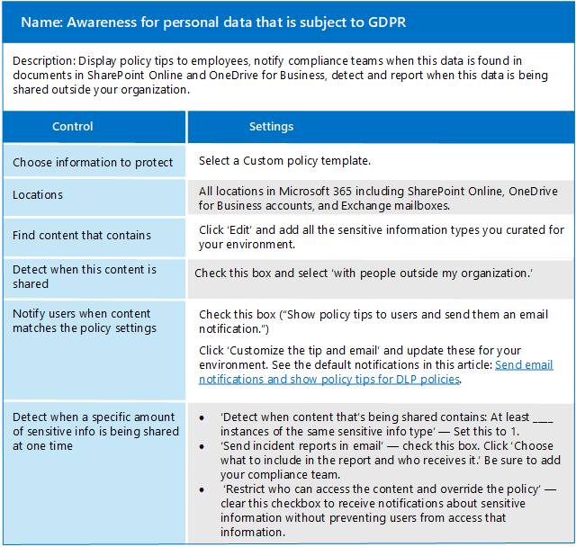

# Proteggere le informazioni soggette alla normativa sulla privacy dei dati

Un certo numero di controlli di protezione delle informazioni possono essere impiegati nell'abbonamento per contribuire a soddisfare i requisiti di conformità e le normative sulla privacy dei dati. Sono inclusi il regolamento generale sulla protezione dei dati (GDPR), HIPAA-HITECH (gli Stati Uniti Health Care Privacy Act), California Consumer Protection Act (CCPA) e Brasile Data Protection Act (LGPD).

Questi controlli si trovano all'interno delle aree della soluzione seguenti:

- Etichette di riservatezza
- Prevenzione della perdita di dati (DLP)
- Crittografia dei messaggi di Office (OME)
- Controlli di accesso a team e siti

>[!Note]
>Questa soluzione descrive le funzionalità di sicurezza e conformità per proteggere le informazioni soggette alle normative sulla privacy dei dati. Per un elenco completo delle funzionalità di sicurezza in Microsoft 365, vedere [documentazione sulla sicurezza di microsoft 365](https://docs.microsoft.com/microsoft-365/security/). Per un elenco completo delle funzionalità di conformità in Microsoft 365, vedere [microsoft 365 Compliance Documentation](https://docs.microsoft.com/microsoft-365/compliance/).
>

## Normative sulla privacy dei dati che incidono sui controlli di protezione delle informazioni

Di seguito è un elenco di esempi di normative sulla privacy dei dati che possono riguardare i controlli di protezione delle informazioni:

- GDPR articolo 5 (1) (f))
- Articolo di GDPR (32) (1) (a)
- LGPD articolo 46
- HIPAA-HITECH (45 CFR 164.312 (e) (1))
- HIPAA-HITECH (45 C.F.R. 164.312 (e) (2) (II))

Per ulteriori informazioni su ognuna di queste attività, vedere l' [articolo valutare i rischi per la privacy dei dati e identificare gli elementi sensibili](information-protection-deploy-assess.md) .

Le norme sulla privacy dei dati per la protezione delle informazioni raccomandano:

- Protezione da perdite o accessi non autorizzati, utilizzo e/o trasmissione.
- Applicazione basata sui rischi dei meccanismi di protezione.
- Utilizzo della crittografia, se necessario.

L'organizzazione potrebbe anche voler proteggere il contenuto di Microsoft 365 per altri scopi, ad esempio altre esigenze di conformità o per motivi aziendali. La definizione del sistema di protezione delle informazioni per la privacy dei dati deve essere svolta nell'ambito di pianificazione, implementazione e gestione di protezione delle informazioni complessive.

Per iniziare a utilizzare uno schema di protezione delle informazioni in Microsoft 365, nella sezione seguente è incluso un breve elenco di funzionalità correlate e azioni di miglioramento per Microsoft 365. L'elenco include le funzionalità e le azioni di miglioramento applicabili alle normative sulla privacy dei dati. Tuttavia, l'elenco non include le tecnologie meno recenti se esiste una funzionalità più recente che sostituisce in gran parte quella precedente. Ad esempio, Information Rights Management (IRM) per SharePoint e OneDrive non è incluso nell'elenco ma sono incluse le etichette di riservatezza.

## Gestione della protezione delle informazioni in Microsoft 365

[Le soluzioni](../compliance/protect-information.md) Microsoft per la protezione delle informazioni includono una serie di funzionalità integrate tra Microsoft 365, Microsoft Azure e Microsoft Windows. In Microsoft 365, le soluzioni di protezione delle informazioni includono:

- [Crittografia del servizio con la chiave del cliente](../compliance/customer-key-overview.md)
- [Tipi di informazioni riservate](../compliance/what-the-sensitive-information-types-look-for.md) (descritti nell' [articolo valutare i rischi per la privacy dei dati e identificare gli elementi sensibili](information-protection-deploy-assess.md))
- [Etichette di riservatezza](../compliance/sensitivity-labels.md) 
  - Service/Container-Level
  - Client-Side/Content-Level
  - Automatizzato per data-at-rest in SharePoint e OneDrive
- Prevenzione della perdita dei dati (DLP)
- [Office 365 Message Encryption new capabilities (OME)](../compliance/ome.md) e [crittografia avanzata dei messaggi](../compliance/ome-advanced-message-encryption.md) ome

Inoltre, la protezione a livello di sito e libreria sono meccanismi importanti da includere in qualsiasi schema di protezione.

Per informazioni su altre funzionalità di protezione delle informazioni al di fuori di Microsoft 365, vedere:

- [Sicurezza delle applicazioni cloud Microsoft (MCAS)](https://docs.microsoft.com/cloud-app-security/)
- [Azure Information Protection](https://docs.microsoft.com/azure/information-protection/what-is-information-protection)
- [Microsoft Endpoint Manager](https://www.microsoft.com/microsoft-365/microsoft-endpoint-manager)
- [Windows Information Protection](https://docs.microsoft.com/windows/security/information-protection/windows-information-protection/protect-enterprise-data-using-wip)

## Etichette di riservatezza

Le etichette di riservatezza di Microsoft Information Protection Framework consentono di classificare e proteggere i dati dell'organizzazione senza ostacolare la produttività degli utenti e la loro capacità di collaborare.

### Prerequisiti per le etichette di riservatezza

Completare queste attività prima di implementare una qualsiasi delle funzionalità basate sulle etichette di riservatezza evidenziate di seguito:

1. Comprendere quanto segue:
   - **Requisiti aziendali.** Stabilire i motivi aziendali per l'applicazione delle etichette di riservatezza nell'organizzazione. Ad esempio, i requisiti per la privacy dei dati per la protezione delle informazioni.
   - **Capacità delle etichette di riservatezza.** L'etichetta di riservatezza può diventare complessa, quindi leggere la [documentazione relativa alle etichette di riservatezza](../compliance/sensitivity-labels.md) prima di iniziare.
   - **Elementi principali da ricordare** Le etichette di riservatezza vengono gestite nell'interfaccia di amministrazione di Microsoft Compliance, ma le opzioni di targeting e applicazione variano in modo significativo.
      - Sono presenti etichette di riservatezza per i siti, i gruppi e i team a livello di contenitore (le impostazioni non si applicano al contenuto all'interno del contenitore). Vengono pubblicati su utenti e gruppi che li applicano quando viene eseguito il provisioning di un sito, di un gruppo o di un team.
      - Sono presenti etichette di riservatezza per il contenuto attivo. Questi vengono pubblicati anche all'utente o ai gruppi, che li applicano manualmente oppure vengono applicati automaticamente quando:
        - Il file viene aperto/modificato/salvato, sia sul desktop dell'utente o su un sito di SharePoint.
        - Viene redatto e inviato un messaggio di posta elettronica.
      - Sono disponibili etichette di riservatezza per l'applicazione automatica ai file di Rest in SharePoint e OneDrive oltre ai messaggi di posta elettronica in transito tramite Exchange. Questi sono indirizzati a tutti i siti o a quelli specifici e si applicano automaticamente ai file a riposo in questi ambienti.

2. Razionalizzazione dell'etichettatura della sensibilità corrente con metodi precedenti o alternativi

   - Azure Information Protection

      Potrebbe essere necessario riconciliare lo schema di etichettatura per la sensibilità corrente con qualsiasi implementazione dell'etichettatura di [Azure Information Protection](../compliance/sensitivity-labels.md#sensitivity-labels-and-azure-information-protection) esistente.
   - OME

      Se si prevede di utilizzare l'etichettatura di sensibilità moderna per la protezione della posta elettronica e i metodi di crittografia della posta elettronica esistenti come OME sono sul posto, possono coesistere, ma è necessario comprendere gli scenari in cui devono essere applicati. Vedere [Office 365 Message Encryption new capabilities (OME)](#office-365-message-encryption-ome-new-capabilities), che include una tabella che confronta la protezione dei tipi di etichette di sensibilità moderna con la protezione basata su ome.

3. Pianificare l'integrazione in uno schema di protezione delle informazioni più ampio. Oltre alla coesistenza con OME, le etichette di riservatezza correnti possono essere utilizzate come Microsoft 365 Data Loss Prevention (DLP) e Microsoft cloud app Security. Vedere le [etichette di riservatezza e Microsoft cloud app Security](../compliance/sensitivity-labels.md#sensitivity-labels-and-microsoft-cloud-app-security) per raggiungere gli obiettivi di protezione delle informazioni relative alla privacy dei dati.

4. Sviluppare uno schema di classificazione e controllo delle etichette di riservatezza. Vedere [classificazione dei dati e tassonomia delle etichette di riservatezza](https://aka.ms/dataclassificationwhitepaper).

### Indicazioni generali

1. **Definizione dello schema.** Prima di utilizzare le funzionalità tecniche per applicare etichette e protezione, è possibile utilizzare l'organizzazione per definire uno schema di classificazione. Potrebbe essere già presente uno schema di classificazione, che semplifica l'aggiunta dei dati personali. 
2. **Guida introduttiva.** Iniziare decidendo il numero e i nomi delle etichette da implementare. Eseguire questa attività senza preoccuparsi della tecnologia da utilizzare e del modo in cui verranno applicate le etichette. Applicare lo schema universalmente all'intera organizzazione, inclusi i dati che si trovano in locale e in altri servizi cloud.
3. **Suggerimenti aggiuntivi** Durante la progettazione e l'implementazione di criteri, etichette e condizioni, prendere in considerazione i seguenti suggerimenti:

   - **Utilizzare lo schema di classificazione esistente (se presente).** Molte organizzazioni già utilizzano la classificazione dei dati in una forma. Valutare attentamente lo schema di etichetta esistente e, se possibile, utilizzarlo come è. L'utilizzo di etichette familiari riconoscibili per gli utenti finali guiderà l'adozione.
   - **Inizio piccolo.** Non esiste praticamente alcun limite al numero di etichette che è possibile creare. Tuttavia, un numero elevato di etichette e di etichette secondarie può rallentare l'adozione.
   - **Utilizzare scenari e casi di utilizzo.** Identificare i casi di utilizzo comuni all'interno dell'organizzazione e gli scenari di utilizzo derivanti dalle normative sulla privacy dei dati a cui si è soggetti. Verificare che l'etichetta e la configurazione di classificazione prevedenti funzionino in pratica.
   - **Mettere in discussione ogni richiesta di una nuova etichetta.** Ogni scenario o caso di utilizzo ha davvero bisogno di una nuova etichetta o è possibile utilizzare ciò che si è già in uso? Mantenere il numero di etichette al minimo migliora l'adozione.
   - **Utilizzare le etichette secondarie per i reparti principali.** Alcuni reparti avranno esigenze specifiche che richiedono etichette specifiche. Definire queste etichette come etichette secondarie di un'etichetta esistente e valutare l'utilizzo di criteri con ambito assegnati ai gruppi di utenti invece che a livello globale.
   - **Prendere in considerazione i criteri con ambito.** I criteri mirati a sottoinsiemi di utenti impediscono l'overload dell'etichetta. Un criterio con ambito consente di assegnare etichette o sottoetichette di ruolo o di reparto specifiche solo ai dipendenti che lavorano per quel reparto specifico. 
   - **Utilizzare nomi di etichette significativi.** Provare a non utilizzare il gergo, gli standard o gli acronimi come nomi delle etichette. Provare a utilizzare nomi che risuonano con l'utente finale per migliorare l'adozione. Invece di usare etichette come PII, PCI, HIPAA, LBI, MBI e le, prendere in considerazione nomi come non commerciali, pubblici, generali, riservati e altamente riservati.

### Creare e distribuire etichette di riservatezza per siti, gruppi e team

Quando si creano [etichette di riservatezza](../compliance/sensitivity-labels-teams-groups-sites.md) nel centro conformità di Microsoft 365, è ora possibile applicarle a questi contenitori:

- Siti di Microsoft Teams
- Microsoft 365 groups (in precedenza gruppi di Office 365)
- Siti di SharePoint

Usare le impostazioni di etichetta seguenti per proteggere il contenuto in tali contenitori:

- Privacy (pubblico o privato) dei siti di Team connessi a Microsoft 365 gruppi
- Accesso utente esterno
- Accesso da dispositivi non gestiti

Per la privacy dei dati, per impedire la condivisione esterna per i contenitori che verranno utilizzati per l'archiviazione del contenuto con dati personali sensibili, contrassegnare i file che contengono i dati come privati e richiedere i dispositivi gestiti.

### Creare e distribuire etichette di riservatezza per il contenuto

Le etichette di riservatezza applicate ai file consentono di crittografare il contenuto, filigranare il contenuto e definire altri controlli per il contenuto delle applicazioni di Office, tra cui Outlook e Office sul Web.

Quando si è pronti per iniziare a proteggere i dati dell'organizzazione con etichette di riservatezza:

1. **Creare le etichette.** Creare e assegnare un nome alle etichette di riservatezza in base alla tassonomia di classificazione dell'organizzazione per i diversi livelli di riservatezza del contenuto. Per ulteriori informazioni sullo sviluppo di una tassonomia di classificazione, vedere il [white paper sulla classificazione dei dati e la tassonomia delle etichette di riservatezza](https://aka.ms/dataclassificationwhitepaper).
2. **Definire le caratteristiche di ogni etichetta.** Configurare le impostazioni di protezione che si vogliono associare a ciascuna etichetta. Ad esempio, è possibile che si desideri abbassare il contenuto di sensibilità, ad esempio un'etichetta "generale", affinché venga applicata solo un'intestazione o un piè di pagina, mentre un livello di sensibilità maggiore, ad esempio un'etichetta "riservata", deve disporre di una filigrana e la crittografia è abilitata.
3. **Pubblicare le etichette.** Dopo aver configurato le etichette di riservatezza, pubblicarle usando un criterio di etichetta. Decidere quali utenti e gruppi devono avere le etichette e quali impostazioni dei criteri usare. Una singola etichetta è riutilizzabile. È possibile definirla una volta e quindi includerla in diversi criteri di etichetta assegnati a diversi utenti.

Dopo aver pubblicato le etichette di riservatezza dal centro conformità di Microsoft 365, queste vengono visualizzate nelle [app di Office](../compliance/sensitivity-labels-office-apps.md) per consentire agli utenti di classificare e proteggere il contenuto creato o modificato.

Per la privacy dei dati, è possibile applicare manualmente un'etichetta di riservatezza con crittografia e altre regole per la posta elettronica o il contenuto contenente informazioni personali sensibili.

>[!Note]
>Le etichette di riservatezza con crittografia abilitate applicate al messaggio di posta elettronica presentano alcune funzionalità sovrapposte con OME. Vedere [secure email Scenarios comparison with ome and sensitivity labels](#secure-email-scenarios-comparison-with-ome-and-sensitivity-labels).

### Etichettatura automatica sul retro del client quando gli utenti modificano documenti o compongono messaggi di posta elettronica

Quando si crea un'etichetta di riservatezza, è possibile [assegnare automaticamente tale etichetta](../compliance/apply-sensitivity-label-automatically.md) al contenuto, incluso il messaggio di posta elettronica quando corrisponde alle condizioni specificate.

La possibilità di applicare automaticamente etichette di riservatezza al contenuto è importante perché:

- Non è necessario spiegare agli utenti quando usare le singole classificazioni.
- Non è necessario affidarsi solo agli utenti per la classificazione corretta di tutto il contenuto.
- Gli utenti non hanno più bisogno di conoscere i criteri e possono concentrarsi sul loro lavoro.

L'etichettatura automatica supporta la raccomandazione di un'etichetta per gli utenti, nonché l'applicazione automatica di un'etichetta. In entrambi i casi, comunque, l'utente decide se accettarla o rifiutarla, per garantire la corretta etichettatura del contenuto.

Questa etichettatura lato client ha un ritardo minimo per i documenti perché l'etichetta può essere applicata anche prima di salvare il documento. Tuttavia, non tutte le app client supportano l'etichettatura automatica. Questa funzionalità è supportata dal client di etichettatura unificata di Azure Information Protection e da [alcune versioni delle app di Office](../compliance/sensitivity-labels-office-apps.md#support-for-sensitivity-label-capabilities-in-apps).

Per istruzioni sulla configurazione, vedere [How to configure auto-Labeling for Office Apps](../compliance/sensitivity-labels-office-apps.md#support-for-sensitivity-label-capabilities-in-apps).

Per la privacy dei dati, è possibile applicare automaticamente le etichette di riservatezza per il contenuto contenente informazioni personali sensibili.

### Etichettatura automatica sul fianco del servizio quando il contenuto è già salvato

Questo metodo è denominato classificazione automatica con etichette di riservatezza. È anche possibile sentirla come etichetta automatica per i dati a riposo (per i documenti in SharePoint e OneDrive) e i dati in transito (per la posta elettronica inviata o ricevuta da Exchange). Per Exchange, non include messaggi di posta elettronica nelle cassette postali a riposo.
 
Poiché questa etichettatura viene applicata dal servizio stesso anziché dall'applicazione utente, non è necessario preoccuparsi di cosa hanno gli utenti delle app e di quale versione. Di conseguenza, questa funzionalità è immediatamente disponibile nell'intera organizzazione ed è adatta per l'applicazione di etichette su vasta scala. I criteri di applicazione automatica di etichette non supportano l'applicazione di etichette consigliate perché l'utente non interagisce con il processo di etichettatura. L'amministratore esegue invece i criteri in modalità di simulazione per garantire la corretta etichettatura del contenuto prima dell'applicazione effettiva dell'etichetta.

Per istruzioni sulla configurazione, vedere [How to configure auto-Labeling Policies for SharePoint, OneDrive, and Exchange](../compliance/apply-sensitivity-label-automatically.md#how-to-configure-auto-labeling-policies-for-sharepoint-onedrive-and-exchange).

Per la privacy dei dati all'interno dei siti di interesse, premere etichette di riservatezza per la crittografia automatica del contenuto contenente informazioni personali sensibili.

## Prevenzione della perdita di dati 

È possibile utilizzare la [prevenzione della perdita di dati (DLP, Data Loss Prevention)](../compliance/data-loss-prevention-policies.md) in Microsoft 365 per rilevare, avvisare e bloccare la condivisione rischiosa, involontaria o inappropriata, ad esempio la condivisione di dati che contengono informazioni personali, sia internamente che esternamente.

DLP consente di:

- Identificare e monitorare le attività di condivisione a rischio.
- Informare gli utenti con le indicazioni in contesto per prendere le decisioni giuste.
- Applicare i criteri di utilizzo dei dati al contenuto senza intralciare la produttività.
- Integrazione con la classificazione e l'etichettatura per rilevare e proteggere i dati quando viene condiviso.

### Carichi di lavoro supportati per DLP

Con un criterio DLP nel centro conformità di Microsoft 365, è possibile identificare, monitorare e proteggere automaticamente gli elementi sensibili in molte posizioni di Microsoft 365, ad esempio Exchange Online, SharePoint, OneDrive e Microsoft teams.

Ad esempio, è possibile identificare qualsiasi documento contenente un numero di carta di credito memorizzato in qualsiasi sito di OneDrive oppure è possibile monitorare solo i siti di OneDrive di persone specifiche.

È inoltre possibile monitorare e proteggere gli elementi sensibili nelle versioni di Excel, PowerPoint e Word installate localmente, che includono la possibilità di identificare gli elementi sensibili e applicare i criteri DLP. DLP fornisce un monitoraggio continuo quando le persone condividono contenuto da queste app di Office.

In questa figura viene mostrato un esempio di protezione DLP dei dati personali.

DLP viene utilizzato per identificare un documento o un messaggio di posta elettronica contenente un record di integrità e quindi blocca automaticamente l'accesso a tale documento o blocca l'invio della posta elettronica. DLP notifica quindi al destinatario un suggerimento per i criteri e invia un avviso all'utente finale e all'amministratore.

### Pianificazione di DLP

Pianificare i criteri DLP per: 

- Requisiti aziendali.

- Valutazione basata sul rischio dell'organizzazione, come descritto nell' [articolo valutare i rischi per la privacy dei dati e identificare gli elementi sensibili](information-protection-deploy-assess.md).

- Altri meccanismi di protezione delle informazioni e governance sul posto o nella pianificazione della privacy dei dati.

- I tipi di informazioni riservate che sono stati identificati per i dati personali in base al lavoro di valutazione, come descritto nell' [articolo valutare i rischi per la privacy dei dati e identificare gli elementi sensibili](information-protection-deploy-assess.md). Le condizioni dei criteri DLP possono basarsi su entrambi i tipi di informazioni riservate e sulle etichette di conservazione.

- Le etichette di conservazione necessarie per specificare le condizioni DLP. Per ulteriori informazioni, vedere l'articolo [relativo alla normativa sulla privacy dei dati dell'organizzazione](information-protection-deploy-govern.md) .

- Gestione dei criteri DLP in esecuzione, che richiede a un utente dell'organizzazione di utilizzare e ottimizzare i criteri per le modifiche apportate ai tipi di informazioni riservate, alle etichette di conservazione, ai regolamenti e ai criteri di conformità.

Anche se non è possibile utilizzare le etichette di riservatezza nelle condizioni dei criteri DLP, alcuni scenari di protezione che impediscono l'accesso possono essere ottenibili con solo etichette di riservatezza che possono essere applicate automaticamente in base ai tipi di informazioni riservate. Se è attiva l'etichettatura con sensibilità robusta, valutare se DLP deve essere utilizzato per aumentare la protezione perché:

  - DLP è in grado di impedire la condivisione dei file. Le etichette di riservatezza possono impedire solo l'accesso.

  - DLP ha livelli di controllo più granulari in termini di regole, condizioni e azioni.

  - I criteri DLP possono essere applicati a chat di team e messaggi di canale. Le etichette di riservatezza possono essere applicate solo a documenti e messaggi di posta elettronica.

### Criteri di prevenzione della perdita di dati (DLP)

I criteri DLP sono configurati nell'interfaccia di amministrazione della conformità di Microsoft e specificano il livello di protezione, il tipo di informazioni riservate che il criterio sta cercando e i carichi di lavoro di destinazione. I componenti di base sono costituiti dall'identificazione della protezione e dei tipi di dati.

Di seguito è riportato un esempio di criteri DLP per la consapevolezza di GDPR.

Per ulteriori informazioni sulla creazione e sull'applicazione di criteri DLP, vedere [questo articolo](../compliance/create-test-tune-dlp-policy.md) .

### Livelli di protezione per la privacy dei dati

Nella tabella seguente sono elencate tre configurazioni per aumentare la protezione tramite DLP.

La prima configurazione, Awareness, può essere utilizzata come punto di partenza e livello minimo di protezione per soddisfare le esigenze di conformità per le normative sulla privacy dei dati.

>[!Note]
>Man mano che i livelli di protezione aumentano, la capacità degli utenti di condividere e accedere alle informazioni diminuirà in alcuni casi e potrebbe potenzialmente influire sulla produttività o sulla capacità di completare le attività quotidiane.
>

Per aiutare i dipendenti a continuare a essere produttivi in un ambiente più sicuro quando aumentano i livelli di protezione, è necessario prendere tempo per addestrarli ed educarli sui nuovi criteri e procedure di sicurezza.

### Esempio di utilizzo di etichette di riservatezza con DLP

Le etichette di riservatezza possono collaborare con DLP per garantire la privacy dei dati in un ambiente altamente regolamentato. Di seguito sono riportati i passaggi principali della distribuzione integrata:

1. I requisiti normativi e altrimenti aziendali per la privacy dei dati sono documentati.
2. Le origini dati di destinazione, i tipi e la proprietà sono caratterizzati rispetto ai problemi relativi alla privacy dei dati.
3. Viene stabilita una strategia complessiva per soddisfare i requisiti e proteggere e gestire gli hotspot sulla privacy dei dati.
4. Viene messo in atto un piano d'azione graduale per risolvere la strategia di controllo della privacy dei dati.

Dopo aver determinato questi elementi, è possibile utilizzare i tipi di informazioni riservate, la tassonomia dell'etichettatura della sensibilità e i criteri DLP insieme. Figura che illustra un esempio.

[Visualizzazione di una versione più grande di questa immagine](https://github.com/MicrosoftDocs/microsoft-365-docs/raw/public/microsoft-365/media/information-protection-deploy-protect-information/information-protection-deploy-protect-information-sensitivity-lables-dlp.png)

Ecco alcuni scenari di protezione dei dati che utilizzano le etichette DLP e sensitivity insieme come mostrato nella figura.

| Scenario | Procedura |
|:-------|:-----|
| A | <ol><li>Le etichette di riservatezza per il contenuto vengono pubblicate da un amministratore per gli utenti e i gruppi per l'applicazione manuale o automatica al contenuto e alla posta elettronica. </li><li>L'utente A applica le etichette manualmente o automaticamente quando interagisce con il contenuto, con la crittografia o altre impostazioni applicate. </li><li>L'utente A invia un file o un messaggio di posta elettronica protetto all'utente B, un utente ospite. </li></ol> |
| B | Criteri DLP pubblicati da un amministratore all'utente a blocca l'utente a dall'invio della posta elettronica e/o del file all'utente B. |
| C |  Etichetta di riservatezza con "owner can ' t invitare guests" l'impostazione viene pubblicata nell'utente a, che prevede un team o un sito di SharePoint. Un altro utente del sito Cerca selettivamente la condivisione di un file con l'utente B, ma lo blocca DLP. |
| D | L'etichetta di riservatezza per l'applicazione automatica al contenuto del sito viene pubblicata in uno o più siti, fornendo un altro livello di protezione, risultante in un sito protetto. |
|||

## Nuove funzionalità di crittografia messaggi di Office 365 (OME)

Gli utenti utilizzano spesso la posta elettronica per scambiare elementi sensibili, ad esempio informazioni sull'integrità dei pazienti o informazioni su clienti e dipendenti. La crittografia dei messaggi di posta elettronica consente di verificare che solo i destinatari previsti possano visualizzare il contenuto del messaggio.

Con [ome](../compliance/ome.md), è possibile inviare e ricevere messaggi crittografati tra persone all'interno e all'esterno dell'organizzazione. OME è compatibile con Outlook.com, Yahoo!, Gmail e altri servizi di posta elettronica. OME garantisce che solo i destinatari previsti possano visualizzare il contenuto del messaggio.

Per la privacy dei dati, è possibile utilizzare OME per proteggere i messaggi interni che contengono elementi sensibili. La crittografia dei messaggi di Office 365 è un servizio online basato su Microsoft Azure Rights Management (Azure RMS) che fa parte di Azure Information Protection. Sono inclusi i criteri di crittografia, identità e autorizzazione che consentono di proteggere il messaggio di posta elettronica. È possibile crittografare i messaggi utilizzando i modelli Rights Management, l'opzione non inoltrare e l'opzione solo crittografia.

È inoltre possibile definire le regole del flusso di posta per applicare la protezione. Ad esempio, è possibile creare una regola che richiede la crittografia di tutti i messaggi indirizzati a un destinatario specifico o che contiene parole parole chiave specifiche nella riga dell'oggetto e specificare anche che i destinatari non possono copiare o stampare il contenuto del messaggio.

Inoltre, la [crittografia dei messaggi avanzata](../compliance/ome-advanced-message-encryption.md) di ome consente di soddisfare gli obblighi di conformità che richiedono controlli più flessibili su destinatari esterni e l'accesso ai messaggi di posta elettronica crittografati. Grazie alla crittografia avanzata dei messaggi OME in Microsoft 365, è possibile controllare i messaggi di posta elettronica riservati condivisi all'esterno dell'organizzazione con criteri automatici che consentono di rilevare tipi di informazioni riservate. 

Per la privacy dei dati, se è necessario condividere la posta elettronica con una parte esterna, è possibile specificare una data di scadenza e revocare i messaggi. È possibile revocare e impostare solo una data di scadenza per i messaggi inviati a destinatari esterni.

### Confronto degli scenari di posta elettronica sicuri con OME e etichette di riservatezza

Le etichette OME e sensitivity applicate ai messaggi di posta elettronica con crittografia presentano una sovrapposizione, quindi è importante comprendere quali scenari possono essere applicati a, come illustrato in questa tabella.

| Scenario | Etichette di riservatezza | OME |
|:-------|:-----|:-------|
| Internal + Partners   Comunicare e collaborare in modo sicuro tra utenti interni e partner attendibili | Recommend-etichette con classificazione e protezione completamente personalizzate | Sì – solo crittografare o non inoltrare la protezione senza alcuna classificazione |
| Parti esterne   Comunicare in modo sicuro e collaborare con tutti gli utenti esterni/consumer | Yes-predefine Recipients in Label | Consigliare – protezione just-in-Time in base ai destinatari |
| Internal + Partners, con scadenza/revoca   Controllare l'accesso alla posta e al contenuto con utenti interni e partner attendibili con scadenza e revoca | Recommend-protezione completamente personalizzata con durata di accesso, l'utente può monitorare e revocare manualmente i file | No – nessuna revoca o scadenza per la posta interna |
| Parti esterne con scadenza/revoca   Controllare l'accesso alla posta e al contenuto con utenti esterni/consumer con scadenza e revoca | Yes-l'utente può registrare manualmente i file | Recommend (E5) – l'amministratore può revocare la posta dal centro sicurezza & conformità |
| Etichettatura automatica   L'organizzazione vuole proteggere automaticamente la posta/gli allegati con specifici contenuti sensibili e/o destinatari specifici | Recommend (E5)-auto-Labeling nei client di Exchange e Outlook, aumenta le regole del flusso di posta e i criteri DLP | Sì-regole del flusso di posta e criteri DLP con solo crittografia o non inoltrare la protezione |
||||

Vi saranno anche differenze nelle esperienze degli utenti finali e degli amministratori tra questi due metodi.

## Team con protezione per dati altamente riservati

Per le organizzazioni che pianificano l'archiviazione dei dati personali soggetti alle normative sulla privacy dei dati nei team, vedere [Configure a team with security isolation](secure-teams-security-isolation.md), in cui vengono fornite istruzioni dettagliate e procedure di configurazione per:

- Accesso a identità e dispositivi
- Creazione di un team privato
- Blocco delle autorizzazioni del sito del team sottostante
- Etichetta di riservatezza basata su gruppo con crittografia
