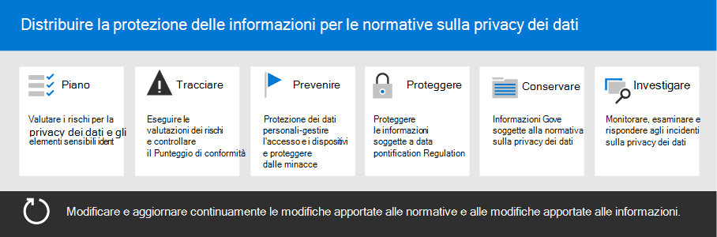

# Distribuire la protezione delle informazioni per le normative sulla privacy dei dati con Microsoft 365

L'organizzazione potrebbe essere soggetta a normative regionali sulla privacy dei dati che richiedono di proteggere, gestire e fornire diritti e controllo sulle informazioni personali archiviate nell'infrastruttura IT, sia in locale che nel cloud. L'esempio migliore di una normativa sulla privacy dei dati è il regolamento generale sulla protezione dei dati (GDPR) dell'Unione europea. La mancata conformità alle normative sulla privacy dei dati può comportare sanzioni sostanziali.

Esempi di tipi di dati in Microsoft 365 includono sessioni di chat in Microsoft Teams, messaggi di posta elettronica in Exchange e file in SharePoint e OneDrive. Questa soluzione fornisce indicazioni su come valutare i rischi e intraprendere azioni appropriate per proteggere i dati personali in Microsoft 365. Ciò include l'identificazione delle informazioni personali in modo da poter proteggere, regolamentare e rispondere a incidenti di privacy dei dati.

Vengono inoltre fornite ulteriori informazioni sull'uso di controlli Microsoft 365 identità, dispositivo e protezione dalle minacce per le esigenze di privacy dei dati.

Queste Microsoft 365 e funzionalità consentono di soddisfare i criteri per la protezione delle informazioni.

| Capacità o funzionalità | Descrizione | Licenze |
|:-------|:-----|:-------|
| Compliance Manager | Gestire le attività di conformità normativa, ottenere un punteggio complessivo della configurazione di conformità corrente e trovare suggerimenti per il miglioramento. Si tratta di uno strumento di valutazione dei rischi basato sul flusso di lavoro nella Centro conformità Microsoft 365. | Microsoft 365 E3 e E5 |
| Microsoft Defender per Office 365 | Proteggere le app e i dati di Microsoft 365, ad esempio i messaggi di posta elettronica, i documenti di Office e gli strumenti di collaborazione, da eventuali attacchi. | Microsoft 365 E3 e E5 |
| Etichette di riservatezza | Classificare e proteggere i dati dell'organizzazione senza ostacolare la produttività degli utenti e la loro capacità di collaborare. Inserire etichette con vari livelli di protezione per la posta elettronica, i file o i siti. | Microsoft 365 E3 ed E5 |
| Prevenzione della perdita dei dati (DLP) | Rilevare, avvisare e bloccare la condivisione rischiosa, involontaria o inappropriata di dati contenenti informazioni personali, sia internamente che esternamente. | Microsoft 365 E3 ed E5 |
| Etichette e criteri di conservazione dei dati | Implementare i controlli di governance delle informazioni. Questi possono includere la determinazione del tempo di conservazione dei dati (ad esempio i dati personali relativi ai clienti) per conformarsi ai criteri o alle normative sui dati dell'organizzazione. | Microsoft 365 E3 ed E5 |
| Crittografia della posta elettronica | Proteggere i dati personali inviando e ricevendo messaggi di posta elettronica crittografati tra persone interne ed esterne all'organizzazione. | Microsoft 365 E3 e E5 |
||||

## Organizzazione delle linee guida in questa soluzione

Per comprendere meglio gli Microsoft 365 disponibili per soddisfare una o più normative relative alla privacy, queste indicazioni sono organizzate in sezioni.

Ognuna di queste sezioni corrisponde a un articolo separato in questa soluzione.

> [!NOTE]
> Se si ha già familiarità con gli obblighi di privacy dei dati e si sta eseguendo in base a un piano esistente, è possibile concentrarsi sulla guida Impedisci, Proteggi, Conserva e Analizza.

> [!IMPORTANT]
> Seguire queste indicazioni non ti rende necessariamente conforme a qualsiasi normativa sulla privacy dei dati, soprattutto considerando il numero di passaggi necessari che non sono nel contesto delle funzionalità. L'utente è responsabile di garantire la conformità e di consultare i team legali e di conformità o di richiedere indicazioni e consigli da terze parti che si specializzano nella conformità.

## Pianificare: valutare i rischi per la privacy dei dati e identificare gli elementi sensibili

La valutazione delle normative sulla privacy dei dati e dei rischi a cui l'organizzazione è soggetta è un primo passo fondamentale da eseguire prima di iniziare a implementare miglioramenti, tra cui la configurazione delle funzionalità in Microsoft 365. Questo lavoro può includere una valutazione generale della conformità o l'identificazione di particolari tipi di informazioni riservate soggetti ai controlli normativi che l'organizzazione deve rispettare.

Per ulteriori informazioni, vedere [Valutare i rischi per la privacy dei dati e identificare gli elementi sensibili.](information-protection-deploy-assess.md)

## Tenere traccia: eseguire valutazioni dei rischi e controllare il punteggio di conformità

Compliance Manager, disponibile nel Centro conformità Microsoft 365, offre una capacità predefinita di tenere traccia e gestire le azioni di miglioramento nel complesso, nonché quelle relative a più normative sulla privacy dei dati che si applicano all'utente.

È possibile utilizzare modelli di valutazione predefiniti specifici per ogni regolamento, in cui è possibile tenere traccia degli elementi di azione per ogni modello di valutazione selezionato, nonché visualizzare controlli normativi specifici e correlarli ad azioni specifiche.

Per ulteriori informazioni, vedere [Utilizzare Compliance Manager per gestire le azioni di miglioramento.](information-protection-deploy-compliance.md)

## Impedisci: proteggere i dati personali

Microsoft 365 offre funzionalità di protezione da identità, dispositivi e minacce che puoi usare per rispettare la conformità alle normative sulla privacy dei dati.

Per ulteriori informazioni, vedere [Use identity, device, and threat protection for data privacy regulation](information-protection-deploy-identity-device-threat.md).

In questo articolo vengono brevemente descritte le norme sulla privacy dei dati generalmente richieste in queste aree e viene fornito un elenco delle soluzioni Microsoft 365 correlate, con collegamenti a ulteriori informazioni utili per risolvere eventuali requisiti di implementazione.

## Proteggere le informazioni soggette alla normativa sulla privacy dei dati

Le normative sulla privacy dei dati stabiliscino una serie di controlli sulla protezione delle informazioni personali che possono essere utilizzati nel tuo ambiente, inclusi più di 40 controlli per la protezione delle informazioni solo attraverso le quattro normative sulla privacy dei dati nel nostro set di esempio di GDPR, California Consumer Protection Act (CCPA), HIPAA-HITECH (United States health care privacy act) e il Brazil Data Protection Act (LGPD).

Per ulteriori informazioni, vedere [Proteggere le informazioni soggette alla normativa sulla privacy dei dati nell'organizzazione.](information-protection-deploy-protect-information.md)

Questo articolo illustra i principali schemi di controllo che possono essere utilizzati per affrontare le esigenze di protezione delle informazioni per la privacy dei dati nell'organizzazione.

## Retain: Govern information subject to data privacy regulation

Le normative sulla privacy dei dati sono necessarie per i controlli di governance delle informazioni personali che possono essere utilizzati nel tuo ambiente, inclusi più di 24 controlli nelle quattro normative sulla privacy dei dati nel nostro set di esempi di GDPR, CCPA, HIPAA-HITECH e LGPD.

Per ulteriori informazioni, vedere [Govern information subject to data privacy regulation in your organization](information-protection-deploy-govern.md).

Anche se le normative sulla privacy dei dati possono essere vaghe per quanto riguarda la governance delle informazioni, come la conservazione, l'eliminazione e l'archiviazione, questo articolo illustra gli schemi di controllo principali che è possibile utilizzare per soddisfare le esigenze di governance delle informazioni per la privacy dei dati &mdash; &mdash; nell'organizzazione.

## Analizzare: monitorare, analizzare e rispondere a eventi imprevisti sulla privacy dei dati

Sono disponibili Microsoft 365 che consentono di monitorare, analizzare e rispondere agli incidenti relativi alla privacy dei dati nell'organizzazione durante l'operatività delle funzionalità correlate.

La presenza di processi, procedure e altra documentazione per l'utilizzo di queste funzionalità può essere importante per dimostrare la conformità agli organismi normativi.

Per ulteriori informazioni, vedere [Monitor and respond to data privacy incidents in your organization](information-protection-deploy-monitor-respond.md).
