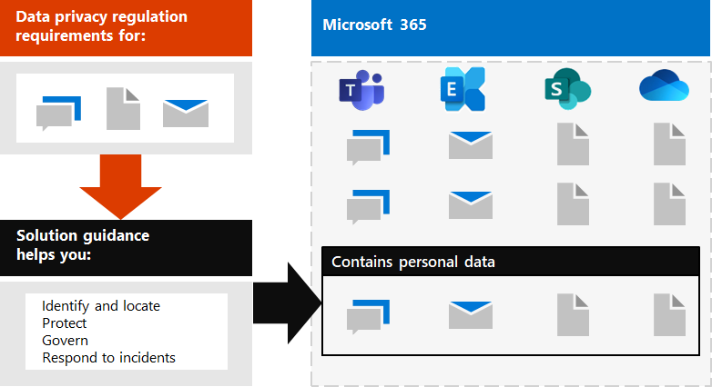
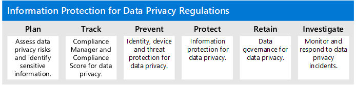

# Distribuire la protezione delle informazioni per le normative sulla privacy dei dati con Microsoft 365

L'organizzazione può essere soggetta alle normative sulla privacy dei dati regionali che richiedono la protezione, la gestione e la fornitura di diritti e controllo su informazioni personali archiviate nell'infrastruttura IT, tra cui sia in locale che nel cloud. Il miglior esempio di una normativa sulla privacy dei dati è il regolamento generale sulla protezione dei dati (GDPR) dell'Unione europea. La mancata conformità con le normative sulla privacy dei dati può provocare ammende sostanziali.

Esempi di tipi di dati in Microsoft 365 includono sessioni di chat in Microsoft teams, messaggi di posta elettronica in Exchange e file in SharePoint e OneDrive. Questa soluzione fornisce indicazioni su come identificare, individuare, proteggere, governare e rispondere agli incidenti sulla privacy dei dati per i dati personali archiviati nei servizi Microsoft 365 che sono soggetti alle normative sulla privacy dei dati.

Sono inoltre disponibili ulteriori informazioni sull'utilizzo dei controlli di identità, dispositivo e protezione delle minacce di Microsoft 365 per le esigenze di privacy dei dati. 

Per soddisfare i criteri di protezione delle informazioni per la conformità con le normative sulla privacy dei dati, utilizzare queste funzionalità e funzionalità di Microsoft 365.

| Capacità o funzionalità | Descrizione | Licenze |
|:-------|:-----|:-------|
| Compliance Manager | Gestire le attività di conformità alle normative, ottenere un punteggio complessivo della configurazione di conformità corrente e trovare suggerimenti per il miglioramento di questo strumento di valutazione dei rischi basato sul flusso di lavoro nel centro conformità di Microsoft 365. | Microsoft 365 E3 e E5 |
| Office Advanced Threat Protection (ATP) | Proteggere le app e i dati di Microsoft 365, ad esempio i messaggi di posta elettronica, i documenti di Office e gli strumenti di collaborazione, da eventuali attacchi. | Microsoft 365 E3 e E5 | 
| Etichette di riservatezza | Classificare e proteggere i dati dell'organizzazione senza compromettere la produttività degli utenti e la loro capacità di collaborare aggiungendo etichette con vari livelli di protezione a messaggi di posta elettronica, file o siti. | Microsoft 365 E3 ed E5 |
| Prevenzione della perdita dei dati (DLP) | Rilevare, comunicare e bloccare la condivisione rischiosa, involontaria o inappropriata, come la condivisione di dati che contengono informazioni personali, sia all'interno che all'esterno. | Microsoft 365 E3 ed E5 | 
| Etichette e criteri di conservazione dei dati | Implementare controlli di governance delle informazioni, come la durata di conservazione dei dati e i requisiti per l'archiviazione dei dati personali dei clienti, per garantire la conformità con i criteri o le normative sui dati dell'organizzazione. | Microsoft 365 E3 ed E5 |
| Crittografia della posta elettronica | Inviare e ricevere messaggi di posta elettronica tra persone all'interno e all'esterno dell'organizzazione che contengono dati regolamentati, come i dati personali dei clienti. | Microsoft 365 E3 ed E5 |
||||

## Organizzazione delle linee guida in questa soluzione

Per facilitare la comprensione degli strumenti di Microsoft 365 disponibili per identificare, gestire, controllare e monitorare i dati personali soggetti a una o più normative relative alla privacy, queste linee guida sono organizzate in sezioni.
 

Ognuna di queste sezioni corrisponde a un articolo distinto della soluzione.

>[!Note]
>Se si ha già familiarità con gli obblighi relativi alla privacy dei dati e si esegue in base a un piano esistente, potrebbe essere necessario concentrarsi sulle indicazioni di prevenzione, protezione, conservazione e analisi.

>[!Important]
>Seguendo queste indicazioni non sarà necessariamente conforme a qualsiasi normativa sulla privacy dei dati, in particolare considerando il numero di passaggi necessari che non rientrano nel contesto delle caratteristiche. L'utente è responsabile per garantire la conformità e per consultare i propri team legali e di conformità o per richiedere indicazioni e consigli da terze parti specializzate in conformità.
>

## Pianificare: valutare i rischi per la privacy dei dati e identificare gli elementi sensibili 

Valutare le normative sulla privacy dei dati e i rischi a cui l'organizzazione è soggetta è un primo passo importante da intraprendere prima di iniziare a implementare i miglioramenti, compresi quelli ottenibili tramite la configurazione di Microsoft 365. Ciò può includere una valutazione generale della conformità o l'identificazione di particolari tipi di informazioni sensibili che sono soggetti ai controlli normativi che l'organizzazione deve soddisfare, nonché la loro occorrenza nell'ambiente Microsoft 365.

Per ulteriori informazioni, vedere [valutare i rischi per la privacy dei dati e identificare gli elementi sensibili](information-protection-deploy-assess.md).

## Track: utilizzare Compliance Manager

Compliance Manager, disponibile nel centro conformità Microsoft 365, fornisce una capacità integrata di monitorare e gestire le azioni di miglioramento in generale, nonché quelle relative a più normative sulla privacy dei dati che si applicano all'utente.

Sfruttare i modelli di valutazione specifici di ogni norma, in cui è possibile monitorare gli elementi di azione per ogni modello di valutazione selezionato, nonché visualizzare controlli normativi specifici e relazionarli con azioni specifiche.

Per ulteriori informazioni, vedere [use Compliance Manager to Manage Improvement actions](information-protection-deploy-compliance.md).

## Impedisci: utilizzare l'identità, il dispositivo e la protezione dalle minacce per la normativa sulla privacy dei dati

Microsoft 365 fornisce una serie di funzionalità di protezione delle minacce e delle identità che è possibile utilizzare per conformarsi alla conformità alle normative sulla privacy dei dati. 

Per ulteriori informazioni, vedere [use Identity, Device, and Threat Protection for data privacy Regulation](information-protection-deploy-identity-device-threat.md).

Questo articolo descrive brevemente cosa richiedono generalmente le normative sulla privacy dei dati in queste aree e fornisce un elenco delle soluzioni Microsoft 365 correlate, con collegamenti a ulteriori informazioni che consentono di soddisfare i requisiti di implementazione. 

## Proteggere le informazioni soggette alla normativa sulla privacy dei dati

Le normative sulla privacy dei dati prevedono una serie di controlli di protezione delle informazioni personali che possono essere utilizzati nel proprio ambiente, tra cui oltre 40 proteggere i controlli delle informazioni in tutte le quattro normative sulla privacy dei dati nel nostro set di GDPR, California Consumer Protection Act (CCPA), HIPAA-HITECH (United States Health Care Act) e Brasile Data Protection Act (LGPD)

Per ulteriori informazioni, vedere [Protect Information subject to data privacy Regulation nell'organizzazione](information-protection-deploy-protect-information.md).

In questo articolo vengono illustrati i principali schemi di controllo che è possibile utilizzare per soddisfare le esigenze di protezione delle informazioni per la privacy dei dati nell'organizzazione.

## Mantieni: regola le informazioni soggette alla normativa sulla privacy dei dati

Le normative sulla privacy dei dati richiedono controlli per la governance delle informazioni personali che possono essere utilizzati nel proprio ambiente, tra cui oltre ventiquattro controlli nelle quattro normative sulla privacy dei dati nel nostro set di esempi di GDPR, CCPA, HIPAA-HITECH e LGPD.

Per ulteriori informazioni, vedere [govern Information subject to data privacy Regulation nell'organizzazione](information-protection-deploy-govern.md).

Anche se le normative sulla privacy dei dati possono essere vaghe per quanto riguarda la governance delle informazioni &mdash; , come la conservazione, l'eliminazione e l'archiviazione mirate &mdash; in questo articolo vengono illustrati gli schemi di controllo principali che è possibile utilizzare per la privacy dei dati nell'organizzazione.

## Esaminare: monitorare e rispondere alla normativa sulla privacy dei dati

Sono disponibili funzionalità di Microsoft 365 che consentono di monitorare, esaminare e rispondere agli incidenti sulla privacy dei dati nell'organizzazione durante la operazionalizzare delle funzionalità correlate. 

L'utilizzo di processi, procedure e altre documentazioni per ognuna di queste operazioni può essere importante per dimostrare la conformità agli organismi di regolamentazione.

Per ulteriori informazioni, vedere [monitorare e rispondere agli incidenti sulla privacy dei dati nell'organizzazione](information-protection-deploy-monitor-respond.md).
