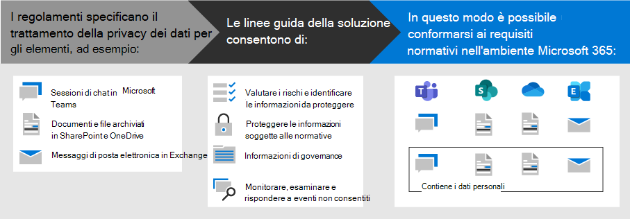

# Distribuire la protezione delle informazioni per le normative sulla privacy dei dati con Microsoft 365Deploy information protection for data privacy regulations with Microsoft 365

L'organizzazione può essere soggetta alle normative sulla privacy dei dati regionali che richiedono la protezione, la gestione e la fornitura di diritti e controllo su informazioni personali archiviate nell'infrastruttura IT, tra cui sia in locale che nel cloud.Your organization may be subject to regional data privacy regulations that require you to protect, manage, and provide rights and control over personal information stored in your IT infrastructure, including both on-premises and in the cloud. Il miglior esempio di una normativa sulla privacy dei dati è il regolamento generale sulla protezione dei dati (GDPR) dell'Unione europea.The best example of a data privacy regulation is the European Union's General Data Protection Regulation (GDPR). La mancata conformità con le normative sulla privacy dei dati può provocare ammende sostanziali.Failure to comply with data privacy regulations can result in substantial fines.

Esempi di tipi di dati in Microsoft 365 includono sessioni di chat in Microsoft teams, messaggi di posta elettronica in Exchange e file in SharePoint e OneDrive.Examples of the types of data in Microsoft 365 include chat sessions in Microsoft Teams, emails in Exchange, and files in SharePoint and OneDrive. Questa soluzione fornisce indicazioni su come valutare i rischi e identificare informazioni, proteggere, governare e rispondere agli incidenti sulla privacy dei dati per i dati personali archiviati nei servizi Microsoft 365 che sono soggetti alle normative sulla privacy dei dati.This solution provides guidance on how to assess risks and identify information, protect, govern, and respond to data privacy incidents for personal data stored in Microsoft 365 services that is subject to data privacy regulations.

Sono inoltre disponibili ulteriori informazioni sull'utilizzo dei controlli di identità, dispositivo e protezione delle minacce di Microsoft 365 per le esigenze di privacy dei dati.Additional information is also provided on the use of Microsoft 365 identity, device, and threat protection controls for your data privacy needs. 

Per soddisfare i criteri di protezione delle informazioni per la conformità con le normative sulla privacy dei dati, utilizzare queste funzionalità e funzionalità di Microsoft 365.To meet the criteria for protecting information for compliance with data privacy regulations, use these Microsoft 365 capabilities and features.

| Capacità o funzionalitàCapability or feature | DescrizioneDescription | LicenzeLicensing |
|:-------|:-----|:-------|
| Compliance ManagerCompliance Manager | Gestire le attività di conformità alle normative, ottenere un punteggio complessivo della configurazione di conformità corrente e trovare suggerimenti per il miglioramento di questo strumento di valutazione dei rischi basato sul flusso di lavoro nel centro conformità di Microsoft 365.Manage regulatory compliance activities, get an overall score of your current compliance configuration, and find recommendations for improvement in this workflow-based risk assessment tool in the Microsoft 365 compliance center. | Microsoft 365 E3 e E5Microsoft 365 E3 and E5 |
| Microsoft Defender per Office 365Microsoft Defender for Office 365 | Proteggere le app e i dati di Microsoft 365, ad esempio i messaggi di posta elettronica, i documenti di Office e gli strumenti di collaborazione, da eventuali attacchi.Protect your Microsoft 365 apps and data—such as email messages, Office documents, and collaboration tools—from attack. | Microsoft 365 E3 e E5Microsoft 365 E3 and E5 | 
| Etichette di riservatezzaSensitivity labels | Classificare e proteggere i dati dell'organizzazione senza compromettere la produttività degli utenti e la loro capacità di collaborare aggiungendo etichette con vari livelli di protezione a messaggi di posta elettronica, file o siti.Classify and protect your organization's data without hindering the productivity of users and their ability to collaborate by placing labels with various levels of protection on email, files, or sites. | Microsoft 365 E3 ed E5Microsoft 365 E3 and E5 |
| Prevenzione della perdita dei dati (DLP)Data Loss Protection (DLP) | Rilevare, comunicare e bloccare la condivisione rischiosa, involontaria o inappropriata, come la condivisione di dati che contengono informazioni personali, sia all'interno che all'esterno.Detect, warn, and block risky, inadvertent, or inappropriate sharing, such as sharing of data containing personal information, both internally and externally. | Microsoft 365 E3 ed E5Microsoft 365 E3 and E5 | 
| Etichette e criteri di conservazione dei datiData retention labels and policies | Implementare controlli di governance delle informazioni, come la durata di conservazione dei dati e i requisiti per l'archiviazione dei dati personali dei clienti, per garantire la conformità con i criteri o le normative sui dati dell'organizzazione.Implement information governance controls, such as how long to keep data and requirements on the storage of personal data on customers, to comply with your organization's policies or data regulations. | Microsoft 365 E3 ed E5Microsoft 365 E3 and E5 |
| Crittografia della posta elettronicaEmail encryption | Inviare e ricevere messaggi di posta elettronica tra persone all'interno e all'esterno dell'organizzazione che contengono dati regolamentati, come i dati personali dei clienti.Send and receive encrypted email messages between people inside and outside your organization that contains regulated data, such as personal data on customers. | Microsoft 365 E3 ed E5Microsoft 365 E3 and E5 |
||||

## Organizzazione delle linee guida in questa soluzioneOrganization of the guidance in this solution

Per facilitare la comprensione degli strumenti di Microsoft 365 disponibili per identificare, gestire, controllare e monitorare i dati personali soggetti a una o più normative relative alla privacy, queste linee guida sono organizzate in sezioni.To help you understand the Microsoft 365 tools available to identify, manage, control, and monitor personal data subject to one or more privacy-related regulations, this guidance is organized into sections.
 

Ognuna di queste sezioni corrisponde a un articolo distinto della soluzione.Each of these sections correspond to a separate article in this solution.

>[!Note]
>Se si ha già familiarità con gli obblighi relativi alla privacy dei dati e si esegue in base a un piano esistente, potrebbe essere necessario concentrarsi sulle indicazioni di prevenzione, protezione, conservazione e analisi.If you are already familiar with your data privacy obligations and are executing against an existing plan, you may want to focus on the Prevent, Protect, Retain, and Investigate guidance.

>[!Important]
>Seguendo queste indicazioni non sarà necessariamente conforme a qualsiasi normativa sulla privacy dei dati, in particolare considerando il numero di passaggi necessari che non rientrano nel contesto delle caratteristiche.Following this guidance will not necessarily make you compliant with any data privacy regulation, especially considering the number of steps required that are outside the context of the features. L'utente è responsabile per garantire la conformità e per consultare i propri team legali e di conformità o per richiedere indicazioni e consigli da terze parti specializzate in conformità.You are responsible for ensuring your compliance and to consult your legal and compliance teams or to seek guidance and advice from third parties that specialize in compliance.
>

## Pianificare: valutare i rischi per la privacy dei dati e identificare gli elementi sensibiliPlan: Assess data privacy risks and identify sensitive items

Valutare le normative sulla privacy dei dati e i rischi a cui l'organizzazione è soggetta è un primo passo importante da intraprendere prima di iniziare a implementare i miglioramenti, compresi quelli ottenibili tramite la configurazione di Microsoft 365.Assessing data privacy regulations and risks that your organization is subject to is a key first step to take before starting to implement improvements, including those achievable through Microsoft 365 configuration. Ciò può includere una valutazione generale della conformità o l'identificazione di particolari tipi di informazioni sensibili che sono soggetti ai controlli normativi che l'organizzazione deve soddisfare, nonché la loro occorrenza nell'ambiente Microsoft 365.This may include an overall readiness assessment or identification of particular sensitive information types that are subject to regulatory controls your organization needs to comply with, as well as the occurrence of them in your Microsoft 365 environment.

Per ulteriori informazioni, vedere [valutare i rischi per la privacy dei dati e identificare gli elementi sensibili](information-protection-deploy-assess.md).For more information, see [Assess data privacy risks and identify sensitive items](information-protection-deploy-assess.md).

## Track: eseguire le valutazioni dei rischi e controllare il Punteggio di conformitàTrack: Run risk assessments and check your compliance score

Compliance Manager, disponibile nel centro conformità Microsoft 365, fornisce una capacità integrata di monitorare e gestire le azioni di miglioramento in generale, nonché quelle relative a più normative sulla privacy dei dati che si applicano all'utente.Compliance Manager, available in the Microsoft 365 compliance center, provides you with a built-in ability to track and manage improvement actions overall as well as those related to multiple data privacy regulations that apply to you.

Sfruttare i modelli di valutazione specifici di ogni norma, in cui è possibile monitorare gli elementi di azione per ogni modello di valutazione selezionato, nonché visualizzare controlli normativi specifici e relazionarli con azioni specifiche.Leverage built in assessment templates specific to each regulation, where you can track action items for each assessment template selected, as well as view specific regulatory controls, and relate them to specific actions.

Per ulteriori informazioni, vedere [use Compliance Manager to Manage Improvement actions](information-protection-deploy-compliance.md).For more information, see [Use Compliance Manager to manage improvement actions](information-protection-deploy-compliance.md).

## Impedisci: Proteggi i dati personaliPrevent: Protect personal data

Microsoft 365 fornisce una serie di funzionalità di protezione delle minacce e delle identità che è possibile utilizzare per conformarsi alla conformità alle normative sulla privacy dei dati.Microsoft 365 provides a number of identity, device, and threat protection capabilities that you can use to help comply with data privacy regulatory compliance. 

Per ulteriori informazioni, vedere [use Identity, Device, and Threat Protection for data privacy Regulation](information-protection-deploy-identity-device-threat.md).For more information, see [Use identity, device, and threat protection for data privacy regulation](information-protection-deploy-identity-device-threat.md).

Questo articolo descrive brevemente cosa richiedono generalmente le normative sulla privacy dei dati in queste aree e fornisce un elenco delle soluzioni Microsoft 365 correlate, con collegamenti a ulteriori informazioni che consentono di soddisfare i requisiti di implementazione.This article briefly describes what the data privacy regulations generally call for in these areas and provides a listing of related Microsoft 365 solutions, with links to more information to help you address any implementation requirements. 

## Proteggere le informazioni soggette alla normativa sulla privacy dei datiProtect information subject to data privacy regulation

Le normative sulla privacy dei dati prevedono una serie di controlli di protezione delle informazioni personali che possono essere utilizzati nel proprio ambiente, tra cui oltre 40 proteggere i controlli delle informazioni in tutte le quattro normative sulla privacy dei dati nel nostro set di GDPR, California Consumer Protection Act (CCPA), HIPAA-HITECH (United States Health Care Act) e Brasile Data Protection Act (LGPD)Data privacy regulations dictate a number of personal information protection controls that can be employed in your environment, including more than forty Protect Information controls across just the four data privacy regulations in our sample set of GDPR, California Consumer Protection Act (CCPA), HIPAA-HITECH (United States health care privacy act), and the Brazil Data Protection Act (LGPD).

Per ulteriori informazioni, vedere [Protect Information subject to data privacy Regulation nell'organizzazione](information-protection-deploy-protect-information.md).For more information, see [Protect information subject to data privacy regulation in your organization](information-protection-deploy-protect-information.md).

In questo articolo vengono illustrati i principali schemi di controllo che è possibile utilizzare per soddisfare le esigenze di protezione delle informazioni per la privacy dei dati nell'organizzazione.This article lays out the main control schemes that can be used for addressing information protection needs for data privacy in your organization.

## Mantieni: regola le informazioni soggette alla normativa sulla privacy dei datiRetain: Govern information subject to data privacy regulation

Le normative sulla privacy dei dati richiedono controlli per la governance delle informazioni personali che possono essere utilizzati nel proprio ambiente, tra cui oltre ventiquattro controlli nelle quattro normative sulla privacy dei dati nel nostro set di esempi di GDPR, CCPA, HIPAA-HITECH e LGPD.Data privacy regulations call for personal information governance controls that can be employed in your environment, including more than twenty-four controls across the four data privacy regulations in our sample set of GDPR, CCPA, HIPAA-HITECH, and LGPD.

Per ulteriori informazioni, vedere [govern Information subject to data privacy Regulation nell'organizzazione](information-protection-deploy-govern.md).For more information, see [Govern information subject to data privacy regulation in your organization](information-protection-deploy-govern.md).

Anche se le normative sulla privacy dei dati possono essere vaghe per quanto riguarda la governance delle informazioni &mdash; , come la conservazione, l'eliminazione e l'archiviazione mirate &mdash; in questo articolo vengono illustrati gli schemi di controllo principali che è possibile utilizzare per la privacy dei dati nell'organizzazione.While the data privacy regulations can be vague regarding information governance&mdash;such as purposeful retention, deletion and archiving&mdash;this article lays out the primary control schemes that you can use address information governance needs for data privacy in your organization.

## Esaminare: monitorare, esaminare e rispondere agli incidenti sulla privacy dei datiInvestigate: Monitor, investigate, and respond to data privacy incidents

Sono disponibili funzionalità di Microsoft 365 che consentono di monitorare, esaminare e rispondere agli incidenti sulla privacy dei dati nell'organizzazione durante la operazionalizzare delle funzionalità correlate.There are Microsoft 365 features available to help you monitor, investigate, and respond to data privacy incidents in your organization as you operationalize related capabilities. 

L'utilizzo di processi, procedure e altre documentazioni per ognuna di queste operazioni può essere importante per dimostrare la conformità agli organismi di regolamentazione.Having processes, procedures, and other documentation for each of these can be important to demonstrate compliance to regulatory bodies.

Per ulteriori informazioni, vedere [monitorare e rispondere agli incidenti sulla privacy dei dati nell'organizzazione](information-protection-deploy-monitor-respond.md).For more information, see [Monitor and respond to data privacy incidents in your organization](information-protection-deploy-monitor-respond.md).
