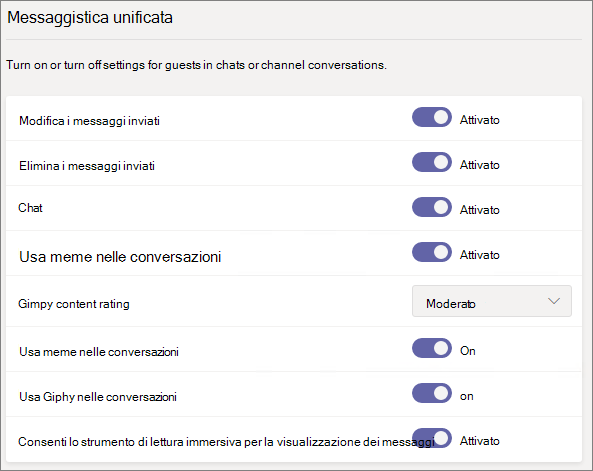
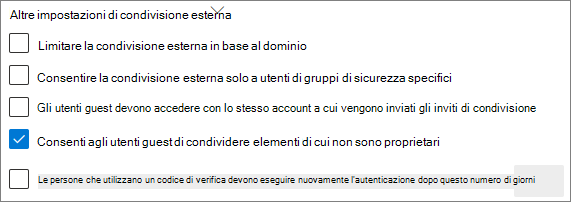

# Riferimento alle impostazioni di condivisione guest di Microsoft 365

Questo articolo fornisce informazioni di riferimento per le varie impostazioni che possono interessare la condivisione con persone esterne all'organizzazione per i carichi di lavoro di Microsoft 365: Teams, Gruppi di Microsoft 365, SharePoint e OneDrive. Queste impostazioni si trovano nelle interfacce di amministrazione di Azure Active Directory, Microsoft 365, Teams e SharePoint admin centers.

## Azure Active Directory

**Ruolo di amministratore:** Amministratore globale

Azure Active Directory è il servizio directory utilizzato da Microsoft 365. Le impostazioni delle relazioni aziendali di Azure Active Directory interessano direttamente la condivisione in Teams, Gruppi di Microsoft 365, SharePoint e OneDrive.

> [!NOTE]
> Queste impostazioni influiscono su SharePoint solo se è stata configurata [l'integrazione di SharePoint e OneDrive con Azure AD B2B ](/sharepoint/sharepoint-azureb2b-integration-preview). Nella tabella seguente si presuppone che sia stata configurata.

### Impostazioni di collaborazione esterna

**Navigazione:** [Interfaccia di amministrazione di Azure Active Directory](https://aad.portal.azure.com) > Azure Active Directory > Identità esterne > Impostazioni collaborazione esterna

| Impostazione | Impostazione predefinita | Descrizione |
|:-----|:-----|:-----|
|Accesso degli utenti guest|Gli utenti guest hanno accesso limitato alle proprietà e alle appartenenze degli oggetti directory|Determina le [autorizzazioni che un utente guest ha in Azure Active Directory](/azure/active-directory/fundamentals/users-default-permissions).|
|Impostazioni per gli inviti degli utenti guest|Tutti gli utenti dell'organizzazione possono invitare gli utenti guest, inclusi gli utenti guest e gli utenti non amministratori|Determina se gli utenti guest, i membri e gli amministratori possono invitare utenti guest nell'organizzazione. 
 Questa impostazione influisce sulle esperienze di condivisione di Microsoft 365, ad esempio Teams e SharePoint.|
|Abilita la registrazione self-service degli utenti guest tramite i flussi utente|No|Determina se è possibile creare flussi utenti che consentono a un utente di registrarsi a un'app e creare un nuovo account guest.|
|Restrizioni di collaborazione|Consenti l'invio di inviti a qualsiasi dominio|Questa impostazione consente di specificare un elenco di domini autorizzati o bloccati per la condivisione. Se si specificano domini autorizzati, gli inviti di condivisione possono essere inviati solo a tali domini. Se si specificano domini non autorizzati, gli inviti di condivisione non possono essere inviati a tali domini. 
 Questa impostazione interessa le esperienze di condivisione di Microsoft 365 come Teams e SharePoint. È possibile autorizzare o bloccare i domini a un livello più granulare utilizzando i filtri per i domini in SharePoint o Teams.|

Questa impostazione influisce sul modo in cui gli utenti sono invitati nella directory. Non influisce sulla condivisione con gli utenti guest già presenti nella directory.

## Microsoft 365

**Ruolo di amministratore:** Amministratore globale

L'interfaccia di amministrazione di Microsoft 365 presenta delle impostazioni a livello di organizzazione per la condivisione e per Gruppi di Microsoft 365.

### Condivisione

**Navigazione:** [Interfaccia di amministrazione di Microsoft 365](https://admin.microsoft.com) > Impostazioni > Impostazioni > Impostazioni organizzazione > Scheda sicurezza e privacy > Condivisione

| Impostazione | Impostazione predefinita | Descrizione |
|:-----|:-----|:-----|
|Consenti agli utenti di aggiungere nuovi utenti guest all'organizzazione|Attivato|Se l'impostazione è su **Sì**, i membri di Azure AD possono invitare utenti guest tramite Azure AD; se l'impostazione è su **No**, non possono farlo. Se l'impostazione è su **Sì**, i membri dei gruppi di Microsoft 365 possono invitare guest con l'approvazione dei proprietari; se l'impostazione è su **No**, i membri dei gruppi di Microsoft 365 possono invitare guest con l'approvazione dei proprietari ma i proprietari devono essere amministratori globali per concedere l'approvazione. 
 Tenere presente che **I membri possono invitare** si riferisce ai membri di Azure AD (anziché agli utenti guest) e non ai membri di siti o gruppi in Microsoft 365. 
 È identica all'impostazione **I membri possono invitare** nelle impostazioni delle relazioni aziendali di Azure Active Directory.|

### Gruppi di Microsoft 365

**Spostamento:** [Interfaccia di amministrazione di Microsoft 365](https://admin.microsoft.com) > Impostazioni > Impostazioni > Gruppi di Microsoft 365

| Impostazione | Impostazione predefinita | Descrizione |
|:-----|:-----|:-----|
|Consenti ai membri del gruppo esterni all'organizzazione di accedere al contenuto del gruppo|Attivato|Se l'impostazione è su **Attivato**, gli utenti guest possono accedere al contenuto del gruppo; se l'impostazione è su **Disattivato**, non possono farlo. Questa impostazione deve essere su **Attivato** per qualsiasi scenario in cui gli utenti guest interagiscono con Teams o i Gruppi di Microsoft 365.|
|Consenti ai proprietari del gruppo di aggiungere persone esterne all'organizzazione ai gruppi|Attivato|Se è su **Attivato**, i proprietari di Teams o Gruppi di Microsoft 365 possono invitare nuovi guest al gruppo. Se è su **Disattivato**, i proprietari possono invitare solo utenti guest già presenti nella directory.|

Queste impostazioni sono a livello di organizzazione. Vedere [Creare impostazioni per un gruppo specifico](/azure/active-directory/users-groups-roles/groups-settings-cmdlets#create-settings-for-a-specific-group) per informazioni sulle modifiche di queste impostazioni a livello di gruppo con PowerShell.

## Teams

L'opzione di accesso guest principale di Teams, **Consenti accesso ospite in Teams**, deve essere **attivata** affinché le altre impostazioni guest siano disponibili.

**Ruolo di amministratore:** Amministratore del servizio Teams

### Accesso guest

**Navigazione:** [Interfaccia di amministrazione di Teams](https://admin.teams.microsoft.com) > Impostazioni organizzazione > Accesso guest

| Impostazione | Impostazione predefinita | Descrizione |
|:-----|:-----|:-----|
|Consenti accesso ospite in Teams|Disattivato|Attiva o disattiva l'accesso guest per Teams. L'applicazione di questa impostazione può richiedere 24 ore una volta modificata.|

### Chiamate guest

**Navigazione:** [Interfaccia di amministrazione di Teams](https://admin.teams.microsoft.com) > Impostazioni organizzazione > Accesso guest

| Impostazione | Impostazione predefinita | Descrizione |
|:-----|:-----|:-----|
|Effettua chiamate private|Attivato|Se è su **Attivato**, gli utenti guest possono effettuare chiamate peer-to-peer in Teams; se è su **Disattivato**, non possono farlo.|

### Riunioni guest

**Navigazione:** [Interfaccia di amministrazione di Teams](https://admin.teams.microsoft.com) > Impostazioni organizzazione > Accesso guest

| Impostazione | Impostazione predefinita | Descrizione |
|:-----|:-----|:-----|
|Consenti video IP|Attivato|Se è su **Attivato**, gli utenti guest possono utilizzare i video nelle chiamate e nelle riunioni; se è su **Disattivato**, non possono farlo.|
|Modalità di condivisione dello schermo|Schermo intero|Se **disabilitato**, gli utenti guest non possono condividere gli schermi in Teams. Se impostato su **Applicazione singola**, gli utenti guest possono condividere solo una singola applicazione sullo schermo. Se impostato su **Schermo intero**, i guest possono scegliere di condividere un'applicazione o lo schermo interno.|
|Consenti Riunione immediata|Attivato|Se è su **Attivato**, gli utenti guest possono utilizzare la funzionalità Riunione immediata in Teams; se è su **Disattivato**, non possono farlo.|

### Messaggistica guest

**Navigazione:** [Interfaccia di amministrazione di Teams](https://admin.teams.microsoft.com) > Impostazioni organizzazione > Accesso guest

| Impostazione | Impostazione predefinita | Descrizione |
|:-----|:-----|:-----|
|Modifica i messaggi inviati|Attivato|Se è su **Attivato**, gli utenti guest possono modificare i messaggi inviati in precedenza; se è su **Disattivato**, non possono farlo.|
|Elimina i messaggi inviati|Attivato|Se è su **Attivato**, gli utenti guest possono eliminare i messaggi inviati in precedenza; se è su **Disattivato**, non possono farlo.|
|Chat|Attivato|Se è su **Attivato**, gli utenti guest possono utilizzare la chat in Teams; se è su **Disattivato**, non possono farlo.|
|Usa Giphy nelle conversazioni|Attivato|Se è su **Attivato**, gli utenti guest possono usare Giphy nelle conversazioni; se è su **Disattivato**, non possono farlo.|
|Classificazione contenuto Giphy|Moderato|Se impostato su **Consenti tutti i contenuti**, gli utenti guest possono inserire tutti i contenuti Giphy nelle chat, indipendentemente dalla loro classificazione. Se impostato su **Moderato**, i guest possono inserire contenuti Giphy nelle chat, ma i contenuti per adulti saranno moderatamente limitati. Se impostato su **Rigido**, gli utenti guest possono inserire contenuti Giphy nelle chat, ma i contenuti per adulti saranno vietati.|
|Usa meme nelle conversazioni|Attivato|Se è su **Attivato**, gli utenti guest possono usare meme nelle conversazioni; se è su **Disattivato**, non possono farlo.|
|Usa sticker nelle conversazioni|Attivato|Se è su **Attivato**, gli utenti guest possono usare sticker nelle conversazioni; se è su **Disattivato**, non possono farlo.|
|Consenti lo strumento di lettura immersiva per la visualizzazione dei messaggi|Attivato|Se è su **Attivato**, gli utenti guest possono visualizzare i messaggi con lo strumento di lettura immersiva; se è su **Disattivato**, non possono farlo.|

## SharePoint e OneDrive (livello organizzazione)

**Ruolo di amministratore:** Amministratore di SharePoint

Queste impostazioni influiscono su tutti i siti dell'organizzazione. Non influiscono direttamente su Teams o Gruppi di Microsoft 365, ma è consigliabile allineare queste impostazioni a quelle di Teams e Gruppi di Microsoft 365 per evitare problemi con l'esperienza utente. Se, ad esempio, la condivisione guest è consentita in Teams ma non in SharePoint, gli utenti guest in Teams non avranno accesso alla scheda File perché i file di Teams sono archiviati in SharePoint.

### Impostazioni di condivisione in SharePoint e OneDrive

Poiché OneDrive è una gerarchia di siti all'interno di SharePoint, le impostazioni di condivisione a livello di organizzazione influiscono direttamente su OneDrive come per altri siti di SharePoint.

**Navigazione:** Interfaccia di amministrazione di SharePoint > Condivisione

| Impostazione | Impostazione predefinita | Descrizione |
|:-----|:-----|:-----|
|SharePoint|Chiunque|Specifica le autorizzazioni di condivisione più permissive consentite per i siti di SharePoint.|
|OneDrive|Chiunque|Specifica le autorizzazioni di condivisione più permissive consentite per i siti di OneDrive. Questa impostazione non può essere più permissiva dell'impostazione di SharePoint.|

### Impostazioni di condivisione avanzate in SharePoint e OneDrive

**Navigazione:** Interfaccia di amministrazione di SharePoint > Condivisione

| Impostazione | Impostazione predefinita | Descrizione |
|:-----|:-----|:-----|
|Limita condivisione esterna in base al dominio|Disattivato|Questa impostazione consente di specificare un elenco di domini autorizzati o bloccati per la condivisione. Se si specificano domini autorizzati, gli inviti di condivisione possono essere inviati solo a tali domini. Se si specificano domini non autorizzati, gli inviti di condivisione non possono essere inviati a tali domini. 
 Questa impostazione influisce su tutti i siti di SharePoint e OneDrive nell'organizzazione.|
|Consentire la condivisione esterna solo a utenti di gruppi di sicurezza specifici|Disattivato|Se si desidera limitare chi può condividere contenuti con utenti guest in SharePoint e OneDrive, è possibile farlo limitando la condivisione alle persone in gruppi di sicurezza specifici. Queste impostazioni non influiscono sulla condivisione tramite Teams o Gruppi di Microsoft 365. Gli utenti guest invitati tramite un gruppo o un team hanno accesso anche al sito associato, anche se la condivisione di documenti e cartelle può essere eseguita solo da persone nei gruppi di sicurezza specificati. 
 Per ogni gruppo specificato, puoi scegliere gli utenti che possono condividere con i collegamenti di tipo "Chiunque".|
|Gli utenti guest devono accedere con lo stesso account a cui vengono inviati gli inviti di condivisione|Disattivato|Impedisce agli utenti guest di utilizzare gli inviti di condivisione dei siti con un indirizzo di posta elettronica diverso da quello al quale è stato inviato l'invito. 
 [L'integrazione di SharePoint e OneDrive con Azure AD B2B (anteprima)](/sharepoint/sharepoint-azureb2b-integration-preview) non usa questa impostazione perché tutti gli utenti guest vengono aggiunti alla directory in base all'indirizzo di posta elettronica al quale è stato inviato l'invito. Non è possibile utilizzare indirizzi di posta elettronica alternativi per accedere al sito.|
|Consenti agli utenti guest di condividere elementi che non possiedono|Attivato|Se è su **Attivato**, gli utenti guest possono condividere elementi che non possiedono con altri utenti o utenti guest; se è su **Disattivato**, non possono farlo. Gli utenti guest possono sempre condividere elementi di cui hanno il controllo completo.|
|Le persone che usano un codice di verifica devono ripetere l'autenticazione dopo questo numero di giorni|Disattivato|Questa impostazione consente di richiedere agli utenti che eseguono l'autenticazione con un passcode monouso di eseguire nuovamente l'autenticazione dopo un determinato numero di giorni.|

### Impostazioni dei collegamenti a file e cartelle di SharePoint e OneDrive

Quando si condividono file e cartelle in SharePoint e OneDrive, ai destinatari della condivisione viene inviato un collegamento con le autorizzazioni per il file o la cartella, anziché l'autorizzazione di accesso diretto al file o alla cartella. Sono disponibili diversi tipi di collegamenti ed è possibile scegliere quello predefinito presentato agli utenti quando condividono un file o una cartella. È inoltre possibile impostare autorizzazioni e opzioni di scadenza per i collegamenti *Chiunque*.

**Navigazione:** Interfaccia di amministrazione di SharePoint > Condivisione

| Impostazione | Impostazione predefinita | Descrizione |
|:-----|:-----|:-----|
|Collegamenti di file e cartelle|Chiunque abbia il collegamento|Specifica quale collegamento di condivisione viene visualizzato per impostazione predefinita quando un utente condivide un file o una cartella. Se lo desiderano, gli utenti possono modificare l'opzione prima di condividere. Se l'impostazione predefinita è su **Chiunque abbia il collegamento** e *Chiunque*, la condivisione non è consentita per un determinato sito, **Solo persone nell'organizzazione** sarà visualizzata come impostazione predefinita per tale sito.|
|Questi collegamenti devono scadere entro questo numero di giorni|Disattivato (nessuna scadenza)|Specifica il numero di giorni dopo che un collegamento *Chiunque* creato scade. I collegamenti scaduti non possono essere rinnovati. Creare un nuovo collegamento se è necessario continuare a condividere dopo la scadenza.|
|Autorizzazioni per i file|Visualizzazione e modifica|Specifica i livelli di autorizzazione per i file disponibili per gli utenti quando si crea un collegamento *Chiunque*. Se si seleziona **Visualizzazione**, gli utenti possono creare collegamenti ai file *Chiunque* solo con autorizzazioni di visualizzazione. Se si seleziona **Visualizzazione e modifica**, gli utenti possono scegliere tra le autorizzazioni di visualizzazione e le autorizzazioni di visualizzazione e modifica quando creano il collegamento.|
|Autorizzazioni per le cartelle|Visualizzazione, modifica e caricamento|Specifica i livelli di autorizzazione per le cartelle disponibili per gli utenti quando si crea un collegamento *Chiunque*. Se si seleziona **Visualizzazione**, gli utenti possono creare collegamenti alle cartelle *Chiunque* solo con autorizzazioni di visualizzazione. Se si seleziona **Visualizzazione, modifica e caricamento**, gli utenti possono scegliere tra le autorizzazioni di visualizzazione e le autorizzazioni di visualizzazione, modifica e caricamento quando creano il collegamento.|

## SharePoint (livello sito)

**Ruolo di amministratore:** Amministratore di SharePoint

Poiché queste impostazioni sono soggette alle impostazioni a livello di organizzazione per SharePoint, l'impostazione di condivisione effettiva per il sito potrebbe cambiare se l'impostazione a livello di organizzazione cambia. Se si sceglie un'impostazione qui e il livello di organizzazione viene impostato successivamente su un valore più restrittivo, a questo sito sarà applicato tale livello più restrittivo. Ad esempio, se si sceglie **Chiunque** e l'impostazione a livello di organizzazione viene in seguito impostata su **Utenti guest nuovi ed esistenti**, il sito consentirà solo utenti guest nuovi ed esistenti. Se l'impostazione a livello di organizzazione viene quindi reimpostata su **Chiunque**, il sito consentirà di nuovo i collegamenti *Chiunque*.

### Condivisione di siti

È possibile impostare le autorizzazioni di condivisione guest per ogni sito di SharePoint. Questa impostazione è valida sia per la condivisione di siti che per la condivisione di file e cartelle. La condivisione *Chiunque* non è disponibile per la condivisione di siti. Se si sceglie **Chiunque**, gli utenti possono condividere file e cartelle utilizzando i collegamenti *Chiunque* e il sito stesso con utenti guest nuovi ed esistenti.

Se al sito è applicata un'etichetta di riservatezza, tale etichetta può controllare le impostazioni di condivisione esterna. Per altre informazioni, vedere [Usare le etichette di riservatezza per proteggere i contenuti in Microsoft Teams, gruppi di Microsoft 365 e siti di SharePoint](../compliance/sensitivity-labels-teams-groups-sites.md).

**Navigazione:** Interfaccia di amministrazione di SharePoint > Siti attivi > selezionare il sito > scheda Criteri > Modifica le impostazioni di condivisione esterna

| Impostazione | Impostazione predefinita | Descrizione |
|:-----|:-----|:-----|
|Il contenuto del sito può essere condiviso con:|Varia in base al tipo di sito (vedere la tabella seguente)|Indica il tipo di condivisione esterna consentito per il sito. Le opzioni disponibili qui sono soggette alle impostazioni di condivisione a livello di organizzazione per SharePoint.|

### Impostazioni dei collegamenti a file e cartelle dei siti

È possibile configurare impostazioni predefinite per il tipo di collegamento, le autorizzazioni e la scadenza dei collegamenti *Chiunque* per ogni sito. Se configurate al livello del sito, queste impostazioni sostituiscono le impostazioni a livello di organizzazione. Si noti che se i collegamenti *Chiunque* sono disabilitati a livello dell'organizzazione, *Chiunque* non sarà un tipo di collegamento disponibile a livello di sito.

**Navigazione:** Interfaccia di amministrazione di SharePoint > Siti attivi > selezionare il sito > scheda Criteri > Modifica le impostazioni di condivisione esterna

| Impostazione | Impostazione predefinita | Descrizione |
|:-----|:-----|:-----|
|Limita la condivisione esterna in base al dominio|Off|Questa impostazione consente di specificare un elenco di domini autorizzati o bloccati per la condivisione. Se si specificano domini autorizzati, gli inviti di condivisione possono essere inviati solo a tali domini. Se si specificano domini non autorizzati, gli inviti di condivisione non possono essere inviati a tali domini. 
 Questa impostazione non può essere usata per ignorare le restrizioni sul dominio impostate a livello di organizzazione o di Azure AD.|
|Tipo di collegamento di condivisione predefinito|Uguale all'impostazione a livello di organizzazione|Questa impostazione consente di specificare il collegamento di condivisione predefinito presentato agli utenti del sito. L'opzione *Uguale all'impostazione a livello di organizzazione* è definita da una combinazione di impostazioni di condivisione a livello di organizzazione e di sito.|
|Impostazioni avanzate per i collegamenti di tipo "Chiunque"|Uguale all'impostazione a livello di organizzazione|Specifica il numero di giorni dopo cui scade un collegamento *Chiunque* creato per un file di questo sito. I collegamenti scaduti non possono essere rinnovati. Creare un nuovo collegamento se è necessario continuare a condividere dopo la scadenza.|
|Autorizzazione collegamento predefinita|Uguale all'impostazione a livello di organizzazione|Questa impostazione consente di specificare l'autorizzazione predefinita (Visualizzazione o Modifica) per la i collegamenti di condivisione creati per i file nel sito.|

### Impostazioni di condivisione del sito predefinite

Nella tabella seguente viene mostrata l'impostazione di condivisione predefinita per ogni tipo di sito.

| Tipo di sito | Impostazione di condivisione predefinita |
|:-----|:-----|
|Classico|**Solo gli utenti dell'organizzazione**|
|OneDrive|**Chiunque**|
|Siti collegati ai gruppi (tra cui Teams)|**Guest nuovi ed esistenti** se l'impostazione di Gruppi di Microsoft 365 **Consenti ai proprietari di gruppi di aggiungere persone esterne all'organizzazione ai gruppi** è su **Attivato**; altrimenti, **Solo utenti guest esistenti**|
|Comunicazione|**Solo gli utenti dell'organizzazione**|
|Siti moderni senza gruppo (#STS3 TeamSite)|**Solo gli utenti dell'organizzazione**|

> [!NOTE]
> Il sito radice di comunicazione (tenant-name.sharepoint.com) include un'opzione di condivisione predefinita impostata su **Chiunque**.

## Vedere anche

[Panoramica sulla condivisione esterna in SharePoint e OneDrive](/sharepoint/external-sharing-overview)

[Accesso guest in Microsoft Teams](/MicrosoftTeams/guest-access)

[Aggiunta di guest a Gruppi di Microsoft 365](https://support.office.com/article/bfc7a840-868f-4fd6-a390-f347bf51aff6)
