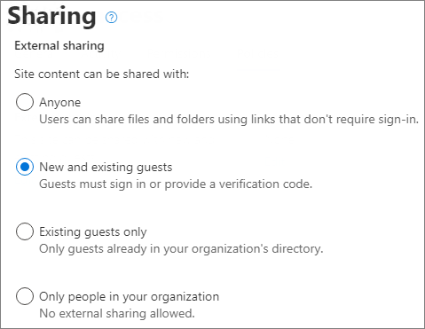

# <a name="limit-sharing-in-microsoft-365"></a><span data-ttu-id="93d92-103">Limitare la condivisione in Microsoft 365</span><span class="sxs-lookup"><span data-stu-id="93d92-103">Limit sharing in Microsoft 365</span></span>

<span data-ttu-id="93d92-104">Anche se non è possibile disabilitare completamente la condivisione interna o rimuovere il pulsante Condividi dai siti, esistono diversi modi per limitare la condivisione in Microsoft 365 per soddisfare le esigenze dell'organizzazione.</span><span class="sxs-lookup"><span data-stu-id="93d92-104">While you can't disable internal sharing entirely or remove the Share button from sites, there are a variety of ways that you can limit sharing in Microsoft 365 to meet the needs of your organization.</span></span>

<span data-ttu-id="93d92-105">I metodi di condivisione dei file sono elencati nella tabella seguente.</span><span class="sxs-lookup"><span data-stu-id="93d92-105">The methods of sharing files are listed in the table below.</span></span> <span data-ttu-id="93d92-106">Per informazioni dettagliate, fare clic sul collegamento nella colonna **Metodo di condivisione**.</span><span class="sxs-lookup"><span data-stu-id="93d92-106">Click the link in the **Sharing method** column for detailed information.</span></span>

|<span data-ttu-id="93d92-107">Metodo di condivisione</span><span class="sxs-lookup"><span data-stu-id="93d92-107">Sharing method</span></span>|<span data-ttu-id="93d92-108">Descrizione</span><span class="sxs-lookup"><span data-stu-id="93d92-108">Description</span></span>|<span data-ttu-id="93d92-109">Opzioni di limitazione</span><span class="sxs-lookup"><span data-stu-id="93d92-109">Limiting options</span></span>|
|:-------------|:----------|:-------------|
|[<span data-ttu-id="93d92-110">Gruppo o team di Microsoft 365</span><span class="sxs-lookup"><span data-stu-id="93d92-110">Microsoft 365 group or team</span></span>](#microsoft-365-group-or-team)|<span data-ttu-id="93d92-111">Gli utenti che hanno accesso a un team di Microsoft Teams o a un gruppo di Microsoft 365 hanno accesso in modifica ai file nel sito di SharePoint associato.</span><span class="sxs-lookup"><span data-stu-id="93d92-111">People granted access to a Microsoft Teams team or Microsoft 365 group have edit access to files in the associated SharePoint site.</span></span>|<span data-ttu-id="93d92-112">Se il gruppo o il team è privato, gli inviti di condivisione per partecipare al team devono essere approvati dal proprietario.</span><span class="sxs-lookup"><span data-stu-id="93d92-112">If the group or team is private, sharing invitations to join the team go to the owner for approval.</span></span> <span data-ttu-id="93d92-113">Gli amministratori possono disabilitare l'accesso guest o usare le etichette di riservatezza per impedire l'accesso da parte di utenti esterni all'organizzazione.</span><span class="sxs-lookup"><span data-stu-id="93d92-113">Admins can disable guest access or use sensitivity labels to prevent access by people from outside the organization.</span></span>|
|[<span data-ttu-id="93d92-114">Sito di SharePoint</span><span class="sxs-lookup"><span data-stu-id="93d92-114">SharePoint site</span></span>](#sharepoint-site)|<span data-ttu-id="93d92-115">Agli utenti può essere concesso l'accesso come proprietari, membri o visitatori di un sito di SharePoint e avranno quel livello di accesso ai file nel sito.</span><span class="sxs-lookup"><span data-stu-id="93d92-115">People can be granted Owner, Member, or Visitor access to a SharePoint site and will have that level of access to files in the site.</span></span>|<span data-ttu-id="93d92-116">È possibile limitare le autorizzazioni per il sito in modo che solo i proprietari possano condividere il sito.</span><span class="sxs-lookup"><span data-stu-id="93d92-116">Site permissions can be restricted so that only site owners can share the site.</span></span> <span data-ttu-id="93d92-117">Gli amministratori possono configurare un sito come di sola lettura, o bloccare del tutto l’accesso.</span><span class="sxs-lookup"><span data-stu-id="93d92-117">Admins can set a site to read-only or block access entirely.</span></span>|
|[<span data-ttu-id="93d92-118">Condivisione con persone specifiche</span><span class="sxs-lookup"><span data-stu-id="93d92-118">Sharing with specific people</span></span>](#sharing-with-specific-people)|<span data-ttu-id="93d92-119">I membri del sito e le persone con autorizzazioni di modifica possono concedere autorizzazioni dirette ai file e alle cartelle o condividerli con collegamenti *Persone specifiche*.</span><span class="sxs-lookup"><span data-stu-id="93d92-119">Site members and people with edit permissions can give direct permissions to files and folders or share them by using *Specific people* links.</span></span>|<span data-ttu-id="93d92-120">È possibile limitare le autorizzazioni per il sito in modo che solo i proprietari possano condividere file e cartelle.</span><span class="sxs-lookup"><span data-stu-id="93d92-120">Site permissions can be restricted so that only site owners can share files and folders.</span></span> <span data-ttu-id="93d92-121">In questo caso, l'accesso diretto e la condivisione di collegamenti *Persone specifiche* da parte dei membri del sito passano dal proprietario del sito per l'approvazione.</span><span class="sxs-lookup"><span data-stu-id="93d92-121">In this case, direct access and *Specific people* link sharing by site members goes to site owner for approval.</span></span>|
|[<span data-ttu-id="93d92-122">Condivisione guest di SharePoint e OneDrive</span><span class="sxs-lookup"><span data-stu-id="93d92-122">SharePoint and OneDrive guest sharing</span></span>](#sharepoint-guest-sharing)|<span data-ttu-id="93d92-123">I proprietari e i membri dei siti di SharePoint e OneDrive possono condividere file e cartelle con persone esterne all'organizzazione.</span><span class="sxs-lookup"><span data-stu-id="93d92-123">SharePoint site owners and members and OneDrive owners can share files and folders with people outside the organization.</span></span>|<span data-ttu-id="93d92-124">La condivisione guest può essere disabilitata per l'intera organizzazione o per singoli siti.</span><span class="sxs-lookup"><span data-stu-id="93d92-124">Guest sharing can be disabled for the entire organization or for individual sites.</span></span>|
|[<span data-ttu-id="93d92-125">Collegamenti di condivisione *Persone nell'organizzazione*</span><span class="sxs-lookup"><span data-stu-id="93d92-125">*People in your organization* sharing links</span></span>](#people-in-your-organization-sharing-links)|<span data-ttu-id="93d92-126">I proprietari e i membri dei siti di SharePoint possono condividere file usando collegamenti di tipo *Persone nell'organizzazione*, che funzioneranno per chiunque si trovi all'interno dell'organizzazione.</span><span class="sxs-lookup"><span data-stu-id="93d92-126">SharePoint site owners and members can share files using *People in your organization* links, which will work for anyone inside the organization.</span></span>|<span data-ttu-id="93d92-127">I collegamenti *Persone nell'organizzazione* possono essere disattivati a livello di sito.</span><span class="sxs-lookup"><span data-stu-id="93d92-127">*People in your organization* links can be disabled at the site level.</span></span>|
|[<span data-ttu-id="93d92-128">Condividere siti, gruppi e team</span><span class="sxs-lookup"><span data-stu-id="93d92-128">Create sites, groups, and teams</span></span>](#create-sites-groups-and-teams)|<span data-ttu-id="93d92-129">Per impostazione predefinita, gli utenti possono creare nuovi siti, gruppi e team da cui possono condividere i contenuti.</span><span class="sxs-lookup"><span data-stu-id="93d92-129">By default, users can create new sites, groups, and teams from which they can share content.</span></span>|<span data-ttu-id="93d92-130">Gli amministratori possono limitare chi può creare siti, gruppi e team.</span><span class="sxs-lookup"><span data-stu-id="93d92-130">Admins can restrict who can create sites, groups, and teams.</span></span>|
|[<span data-ttu-id="93d92-131">Posta elettronica</span><span class="sxs-lookup"><span data-stu-id="93d92-131">Email</span></span>](#email)|<span data-ttu-id="93d92-132">Le persone che hanno accesso a un file possono inviarlo ad altri tramite posta elettronica.</span><span class="sxs-lookup"><span data-stu-id="93d92-132">People with access to a file can send it to others via email.</span></span>|<span data-ttu-id="93d92-133">Gli amministratori possono crittografare i file usando etichette di riservatezza per evitare che vengano condivisi con persone non autorizzate.</span><span class="sxs-lookup"><span data-stu-id="93d92-133">Admins can encrypt files by using sensitivity labels to prevent them being shared with unauthorized people.</span></span>|
|[<span data-ttu-id="93d92-134">Download o copia di file</span><span class="sxs-lookup"><span data-stu-id="93d92-134">Download or file copy</span></span>](#download-or-file-copy)|<span data-ttu-id="93d92-135">Le persone che hanno accesso a un file possono scaricarlo o copiarlo e condividerlo con altri utenti esterni all'ambito di Microsoft 365.</span><span class="sxs-lookup"><span data-stu-id="93d92-135">People with access to a file can download or copy it and share it with others outside the scope of Microsoft 365.</span></span>|<span data-ttu-id="93d92-136">Gli amministratori possono crittografare i file usando etichette di riservatezza per evitare che vengano condivisi con persone non autorizzate.</span><span class="sxs-lookup"><span data-stu-id="93d92-136">Admins can encrypt files by using sensitivity labels to prevent them being shared with unauthorized people.</span></span>|

<span data-ttu-id="93d92-137">È anche possibile limitare le condizioni in cui gli utenti accedono ai contenuti condivisi.</span><span class="sxs-lookup"><span data-stu-id="93d92-137">You can also restrict the conditions under which people access shared content.</span></span> <span data-ttu-id="93d92-138">Per altre informazioni, vedere [accesso condizionale](#conditional-access) più avanti in questo articolo.</span><span class="sxs-lookup"><span data-stu-id="93d92-138">See [conditional access](#conditional-access) later in this article for more information.</span></span>

<span data-ttu-id="93d92-139">Anche se è possibile usare i controlli amministrativi descritti in questo articolo per limitare la condivisione all'interno dell'organizzazione, è consigliabile usare le funzionalità di sicurezza e conformità disponibili in Microsoft 365 per creare un ambiente di condivisione sicura.</span><span class="sxs-lookup"><span data-stu-id="93d92-139">While you can use the admin controls described in this article to limit sharing in your organization, we highly recommend that you consider using the security and compliance features available in Microsoft 365 to create a secure sharing environment.</span></span> <span data-ttu-id="93d92-140">Per informazioni, vedere [Collaborazione ai file in SharePoint con Microsoft 365](/sharepoint/deploy-file-collaboration) e [Configurare team con isolamento di sicurezza](secure-teams-security-isolation.md).</span><span class="sxs-lookup"><span data-stu-id="93d92-140">See [File collaboration in SharePoint with Microsoft 365](/sharepoint/deploy-file-collaboration) and [Configure a team with security isolation](secure-teams-security-isolation.md) for information.</span></span>

<span data-ttu-id="93d92-141">Per informazioni su come viene usata la condivisione all'interno dell'organizzazione, [eseguire un report sulla condivisione di file e cartelle](/sharepoint/sharing-reports).</span><span class="sxs-lookup"><span data-stu-id="93d92-141">To understand how sharing is being used in your organization, [run a report on file and folder sharing](/sharepoint/sharing-reports).</span></span>

## <a name="microsoft-365-group-or-team"></a><span data-ttu-id="93d92-142">Gruppo o team di Microsoft 365</span><span class="sxs-lookup"><span data-stu-id="93d92-142">Microsoft 365 group or team</span></span>

<span data-ttu-id="93d92-143">Se si vuole limitare la condivisione in un gruppo di Microsoft 365 o un team di Microsoft Teams, è importante rendere privato il gruppo o il team.</span><span class="sxs-lookup"><span data-stu-id="93d92-143">If you want to limit sharing in a Microsoft 365 group or Microsoft Teams team, it's important to make the group or team private.</span></span> <span data-ttu-id="93d92-144">Gli utenti all'interno dell'organizzazione possono entrare a far parte di un gruppo pubblico o di un team in qualsiasi momento.</span><span class="sxs-lookup"><span data-stu-id="93d92-144">People inside your organization can join a public group or team anytime.</span></span> <span data-ttu-id="93d92-145">A meno che il gruppo o il team non sia privato, non è possibile limitare la condivisione del team o dei relativi file all'interno dell'organizzazione.</span><span class="sxs-lookup"><span data-stu-id="93d92-145">Unless the group or team is private, there's no way to limit sharing of the team or its files within the organization.</span></span>

### <a name="guest-sharing"></a><span data-ttu-id="93d92-146">Condivisione con gli utenti guest</span><span class="sxs-lookup"><span data-stu-id="93d92-146">Guest sharing</span></span>

<span data-ttu-id="93d92-147">Se si vuole impedire l'accesso guest in Teams, è possibile disattivare la condivisione guest nell'interfaccia di amministrazione di Teams.</span><span class="sxs-lookup"><span data-stu-id="93d92-147">If you want to prevent guest access in Teams, you can turn off guest sharing in the Teams admin center.</span></span>

<span data-ttu-id="93d92-148">Per disattivare la condivisione guest per Teams</span><span class="sxs-lookup"><span data-stu-id="93d92-148">To turn off guest sharing for Teams</span></span>
1. <span data-ttu-id="93d92-149">Nell'interfaccia di amministrazione di Teams espandere **Impostazioni a livello di organizzazione** e quindi fare clic su **Accesso guest**.</span><span class="sxs-lookup"><span data-stu-id="93d92-149">In the Teams admin center, expand **Org-wide settings**, and then click **Guest access**.</span></span>
2. <span data-ttu-id="93d92-150">Disattivare **Consenti accesso ospite in Teams**.</span><span class="sxs-lookup"><span data-stu-id="93d92-150">Turn off **Allow guest access in Teams**.</span></span>
3. <span data-ttu-id="93d92-151">Fare clic su **Salva**.</span><span class="sxs-lookup"><span data-stu-id="93d92-151">Click **Save**.</span></span>

<span data-ttu-id="93d92-152">Se si vuole impedire l'accesso guest nei gruppi di Microsoft 365, è possibile disattivare le impostazioni di accesso guest dei gruppi nell'interfaccia di amministrazione di Microsoft 365.</span><span class="sxs-lookup"><span data-stu-id="93d92-152">If you want to prevent guest access in Microsoft 365 Groups, you can turn off the groups guest access settings in the Microsoft 365 admin center.</span></span>

<span data-ttu-id="93d92-153">Per disattivare la condivisione guest nei gruppi di Microsoft 365</span><span class="sxs-lookup"><span data-stu-id="93d92-153">To turn off guest sharing in Microsoft 365 Groups</span></span>
1. <span data-ttu-id="93d92-154">Nell'interfaccia di amministrazione di Microsoft 365 fare clic su **Impostazioni** poi ancora su **Impostazioni dell'organizzazione**.</span><span class="sxs-lookup"><span data-stu-id="93d92-154">In the Microsoft 365 admin center, click **Settings**, and then click **Org Settings**.</span></span>
2. <span data-ttu-id="93d92-155">Nella scheda **Servizi** fare clic su **Gruppi di Microsoft 365**.</span><span class="sxs-lookup"><span data-stu-id="93d92-155">On the **Services** tab, click **Microsoft 365 Groups**.</span></span>
3. <span data-ttu-id="93d92-156">Deselezionare le caselle di controllo **Consenti ai membri del gruppo esterni all'organizzazione di accedere al contenuto del gruppo** e **Consenti ai proprietari del gruppo di aggiungere persone esterne all'organizzazione ai gruppi**.</span><span class="sxs-lookup"><span data-stu-id="93d92-156">Clear the **Let group members outside your organization access group content** and **Let group owners add people outside your organization to groups** check boxes.</span></span>
4. <span data-ttu-id="93d92-157">Fare clic su **Salva modifiche**.</span><span class="sxs-lookup"><span data-stu-id="93d92-157">Click **Save changes**.</span></span>

    

> [!NOTE]
> <span data-ttu-id="93d92-159">Se si vuole impedire la condivisione guest per uno specifico gruppo o team, si può usare [Microsoft PowerShell](per-group-guest-access.md) o le [etichette di riservatezza](../compliance/sensitivity-labels-teams-groups-sites.md).</span><span class="sxs-lookup"><span data-stu-id="93d92-159">If you want to prevent guest sharing for a particular group or team, you can do so by using [Microsoft PowerShell](per-group-guest-access.md) or [sensitivity labels](../compliance/sensitivity-labels-teams-groups-sites.md).</span></span>

<span data-ttu-id="93d92-160">È possibile limitare la condivisione guest agli utenti di domini specifici consentendo o bloccando domini in Azure Active Directory.</span><span class="sxs-lookup"><span data-stu-id="93d92-160">You can limit guest sharing to users from specific domains by allowing or blocking domains in Azure Active Directory.</span></span> <span data-ttu-id="93d92-161">Questo influirà anche sulla condivisione guest in SharePoint se si è abilitata l'[integrazione di SharePoint e OneDrive con Azure AD B2B](/sharepoint/sharepoint-azureb2b-integration-preview).</span><span class="sxs-lookup"><span data-stu-id="93d92-161">This will also affect guest sharing in SharePoint if you have enabled [SharePoint and OneDrive integration with Azure AD B2B](/sharepoint/sharepoint-azureb2b-integration-preview).</span></span>

<span data-ttu-id="93d92-162">Per consentire la condivisione di inviti solo dai domini specificati</span><span class="sxs-lookup"><span data-stu-id="93d92-162">To allow sharing invitations only from specified domains</span></span>
1. <span data-ttu-id="93d92-163">Nella pagina Panoramica di Azure Active Directory fare clic su **Relazioni aziendali**.</span><span class="sxs-lookup"><span data-stu-id="93d92-163">In Azure Active Directory, on the Overview page, click **Organizational relationships**.</span></span>
2. <span data-ttu-id="93d92-164">Fare clic su **Impostazioni**.</span><span class="sxs-lookup"><span data-stu-id="93d92-164">Click **Settings**.</span></span>
3. <span data-ttu-id="93d92-165">In **Restrizioni di collaborazione** selezionare **Nega gli inviti ai domini specificati** o **Consenti l'invio di inviti solo ai domini specificati** e quindi digitare i domini che si vogliono usare.</span><span class="sxs-lookup"><span data-stu-id="93d92-165">Under **Collaboration restrictions**, select **Deny invitations to the specified domains** or **Allow invitations only to the specified domains**, and then type the domains that you want to use.</span></span>
4. <span data-ttu-id="93d92-166">Fare clic su **Salva**.</span><span class="sxs-lookup"><span data-stu-id="93d92-166">Click **Save**.</span></span>

    

## <a name="sharepoint-site"></a><span data-ttu-id="93d92-168">Sito di SharePoint</span><span class="sxs-lookup"><span data-stu-id="93d92-168">SharePoint site</span></span>

<span data-ttu-id="93d92-169">È possibile limitare la condivisione dei siti di SharePoint ai soli proprietari dei siti.</span><span class="sxs-lookup"><span data-stu-id="93d92-169">You can limit SharePoint site sharing to site owners only.</span></span> <span data-ttu-id="93d92-170">Questo impedisce ai membri del sito di condividerlo.</span><span class="sxs-lookup"><span data-stu-id="93d92-170">This prevents site members from sharing the site.</span></span> <span data-ttu-id="93d92-171">Tenere presente che se il sito è connesso a un gruppo di Microsoft 365, i membri del gruppo possono invitare altri utenti nel gruppo e questi utenti avranno accesso al sito.</span><span class="sxs-lookup"><span data-stu-id="93d92-171">Keep in mind that if the site is connected to a Microsoft 365 group, group members can invite others to the group and those users will have site access.</span></span>

<span data-ttu-id="93d92-172">Per limitare la condivisione del sito ai proprietari</span><span class="sxs-lookup"><span data-stu-id="93d92-172">To limit site sharing to owners</span></span>
1. <span data-ttu-id="93d92-173">Nel sito fare clic sull'icona a forma di ingranaggio e quindi su **Autorizzazioni sito**.</span><span class="sxs-lookup"><span data-stu-id="93d92-173">In the site, click the gear icon, and then click **Site permissions**.</span></span>
2. <span data-ttu-id="93d92-174">In **Impostazioni di condivisione** fare clic su **Modifica impostazioni di condivisione**.</span><span class="sxs-lookup"><span data-stu-id="93d92-174">Under **Sharing settings**, click **Change sharing settings**.</span></span>
3. <span data-ttu-id="93d92-175">Selezionare **I proprietari e i membri del sito e gli utenti con autorizzazioni di modifica possono condividere file e cartelle, ma solo i proprietari del sito possono condividere il sito**.</span><span class="sxs-lookup"><span data-stu-id="93d92-175">Select **Site owners and members, and people with Edit permissions can share files and folders, but only site owners can share the site**.</span></span>
4. <span data-ttu-id="93d92-176">Fare clic su **Salva**.</span><span class="sxs-lookup"><span data-stu-id="93d92-176">Click **Save**.</span></span>

    

<span data-ttu-id="93d92-178">È possibile impedire agli utenti che non sono membri del sito di richiedere l'accesso disattivando le richieste di accesso.</span><span class="sxs-lookup"><span data-stu-id="93d92-178">You can prevent users who are not members of the site from requesting access by turning off access requests.</span></span>

<span data-ttu-id="93d92-179">Per disattivare le richieste di accesso</span><span class="sxs-lookup"><span data-stu-id="93d92-179">To turn off access requests</span></span>
1. <span data-ttu-id="93d92-180">Nel sito fare clic sull'icona a forma di ingranaggio e quindi su **Autorizzazioni sito**.</span><span class="sxs-lookup"><span data-stu-id="93d92-180">In the site, click the gear icon, and then click **Site permissions**.</span></span>
2. <span data-ttu-id="93d92-181">In **Impostazioni di condivisione** fare clic su **Modifica impostazioni di condivisione**.</span><span class="sxs-lookup"><span data-stu-id="93d92-181">Under **Sharing settings**, click **Change sharing settings**.</span></span>
3. <span data-ttu-id="93d92-182">Disattivare **Consenti richieste di accesso** e quindi fare clic su **Salva**.</span><span class="sxs-lookup"><span data-stu-id="93d92-182">Turn off **Allow access requests**, and then click **Save**.</span></span>

<span data-ttu-id="93d92-183">È possibile limitare la condivisione del sito in base a domini specifici consentendo o bloccando domini per il sito.</span><span class="sxs-lookup"><span data-stu-id="93d92-183">You can limit site sharing to specific domains by allowing or blocking domains for the site.</span></span>

<span data-ttu-id="93d92-184">Per limitare la condivisione del sito in base al dominio</span><span class="sxs-lookup"><span data-stu-id="93d92-184">To limit site sharing by domain</span></span>
1. <span data-ttu-id="93d92-185">Nell'interfaccia di amministrazione di SharePoint, in **Siti** fare clic su **Siti attivi**.</span><span class="sxs-lookup"><span data-stu-id="93d92-185">In the SharePoint admin center, under **Sites**, click **Active sites**.</span></span>
2. <span data-ttu-id="93d92-186">Fare clic sul sito che si vuole configurare.</span><span class="sxs-lookup"><span data-stu-id="93d92-186">Click the site that you want to configure.</span></span>
3. <span data-ttu-id="93d92-187">Nella scheda **Criteri**, in **Condivisione esterna** fare clic su **Modifica**.</span><span class="sxs-lookup"><span data-stu-id="93d92-187">On the **Policies** tab, under **External sharing** click **Edit**.</span></span>
4. <span data-ttu-id="93d92-188">In **Impostazioni avanzate per la condivisione esterna** selezionare **Limita la condivisione esterna in base al dominio**.</span><span class="sxs-lookup"><span data-stu-id="93d92-188">Under **Advanced settings for external sharing**, select the **Limit sharing by domain**.</span></span>
5. <span data-ttu-id="93d92-189">Aggiungere i domini da consentire o bloccare e quindi fare clic su **Salva**.</span><span class="sxs-lookup"><span data-stu-id="93d92-189">Add the domains that you want to allow or block, and then click **Save**.</span></span>
6. <span data-ttu-id="93d92-190">Fare clic su **Salva**.</span><span class="sxs-lookup"><span data-stu-id="93d92-190">Click **Save**.</span></span>

    

### <a name="block-access-to-a-site"></a><span data-ttu-id="93d92-192">Bloccare l'accesso ai siti</span><span class="sxs-lookup"><span data-stu-id="93d92-192">Block access to a site</span></span>

<span data-ttu-id="93d92-193">È possibile bloccare l'accesso a un sito o creare un sito di sola lettura modificando lo stato di blocco del sito.</span><span class="sxs-lookup"><span data-stu-id="93d92-193">You can block access to a site or make a site read-only by changing the lock state of the site.</span></span> <span data-ttu-id="93d92-194">Per i dettagli, vedere [Bloccare e sbloccare i siti](/sharepoint/manage-lock-status).</span><span class="sxs-lookup"><span data-stu-id="93d92-194">For details, see [Lock and unlock sites](/sharepoint/manage-lock-status).</span></span>

### <a name="permissions-inheritance"></a><span data-ttu-id="93d92-195">Ereditarietà delle autorizzazioni</span><span class="sxs-lookup"><span data-stu-id="93d92-195">Permissions inheritance</span></span>

<span data-ttu-id="93d92-196">Benché non sia raccomandato, si può usare [Ereditarietà delle autorizzazioni di SharePoint](/sharepoint/what-is-permissions-inheritance) per personalizzare il livello di accesso a siti e sottositi.</span><span class="sxs-lookup"><span data-stu-id="93d92-196">While not recommended, you can use [SharePoint permissions inheritance](/sharepoint/what-is-permissions-inheritance) to customize access levels to sites and subsites.</span></span>

## <a name="sharing-with-specific-people"></a><span data-ttu-id="93d92-197">Condivisione con persone specifiche</span><span class="sxs-lookup"><span data-stu-id="93d92-197">Sharing with specific people</span></span>

<span data-ttu-id="93d92-198">Se si vuole limitare la condivisione di un sito o del relativo contenuto, è possibile configurare il sito in modo da consentire solo ai proprietari di condividere file, cartelle e il sito.</span><span class="sxs-lookup"><span data-stu-id="93d92-198">if you want to limit the sharing of a site or its contents, you can configure the site to only allow site owners to share files, folders, and the site.</span></span> <span data-ttu-id="93d92-199">Quando si configura questa opzione, i tentativi dei membri del sito di condividere file o cartelle con collegamenti *Persone specifiche* andranno al proprietario del sito per l'approvazione.</span><span class="sxs-lookup"><span data-stu-id="93d92-199">When this is configured, site members' attempts to share files or folders by using *Specific people* links will go to the site owner for approval.</span></span>

<span data-ttu-id="93d92-200">Per limitare la condivisione di sito, file e cartelle ai proprietari</span><span class="sxs-lookup"><span data-stu-id="93d92-200">To limit site, file, and folder sharing to owners</span></span>
1. <span data-ttu-id="93d92-201">Nel sito fare clic sull'icona a forma di ingranaggio e quindi su **Autorizzazioni sito**.</span><span class="sxs-lookup"><span data-stu-id="93d92-201">In the site, click the gear icon, and then click **Site permissions**.</span></span>
2. <span data-ttu-id="93d92-202">In **Impostazioni di condivisione** fare clic su **Modifica impostazioni di condivisione**.</span><span class="sxs-lookup"><span data-stu-id="93d92-202">Under **Sharing settings**, click **Change sharing settings**.</span></span>
3. <span data-ttu-id="93d92-203">Selezionare **Solo i proprietari del sito possono condividere file, cartelle e il sito**.</span><span class="sxs-lookup"><span data-stu-id="93d92-203">Select **Only site owners can share files, folders, and the site**.</span></span>
4. <span data-ttu-id="93d92-204">Fare clic su **Salva**.</span><span class="sxs-lookup"><span data-stu-id="93d92-204">Click **Save**.</span></span>

    

## <a name="sharepoint-guest-sharing"></a><span data-ttu-id="93d92-206">Condivisione guest di SharePoint</span><span class="sxs-lookup"><span data-stu-id="93d92-206">SharePoint guest sharing</span></span>

<span data-ttu-id="93d92-207">Se si vuole impedire la condivisione di file e cartelle di SharePoint o OneDrive con persone esterne all'organizzazione, è possibile disattivare la condivisione guest per l'intera organizzazione o per un singolo sito.</span><span class="sxs-lookup"><span data-stu-id="93d92-207">If you want to prevent sharing SharePoint or OneDrive files and folders with people outside your organization, you can turn off guest sharing for the entire organization or for an individual site.</span></span>

<span data-ttu-id="93d92-208">Per disattivare la condivisione guest di SharePoint per l'organizzazione</span><span class="sxs-lookup"><span data-stu-id="93d92-208">To turn off SharePoint guest sharing for your organization</span></span>
1. <span data-ttu-id="93d92-209">Nell'interfaccia di amministrazione di SharePoint, in **Criteri** fare clic su **Condivisione**.</span><span class="sxs-lookup"><span data-stu-id="93d92-209">In the SharePoint admin center, under **Policies**, click **Sharing**.</span></span>
2. <span data-ttu-id="93d92-210">In **Condivisione esterna** trascinare il dispositivo di scorrimento di SharePoint verso il basso fino a **Solo persone nell'organizzazione**.</span><span class="sxs-lookup"><span data-stu-id="93d92-210">Under **External sharing**, drag the SharePoint slider down to **Only people in your organization**.</span></span>
3. <span data-ttu-id="93d92-211">Fare clic su **Salva**.</span><span class="sxs-lookup"><span data-stu-id="93d92-211">Click **Save**.</span></span>

    


<span data-ttu-id="93d92-213">Per disattivare la condivisione guest per un sito</span><span class="sxs-lookup"><span data-stu-id="93d92-213">To turn off guest sharing for a site</span></span>
1. <span data-ttu-id="93d92-214">Nell'interfaccia di amministrazione di SharePoint, in **Siti** fare clic su **Siti attivi**.</span><span class="sxs-lookup"><span data-stu-id="93d92-214">In the SharePoint admin center, under **Sites**, click **Active sites**.</span></span>
2. <span data-ttu-id="93d92-215">Fare clic sul sito che si vuole configurare.</span><span class="sxs-lookup"><span data-stu-id="93d92-215">Click the site that you want to configure.</span></span>
3. <span data-ttu-id="93d92-216">Nella scheda **Criteri**, in **Condivisione esterna** fare clic su **Modifica**.</span><span class="sxs-lookup"><span data-stu-id="93d92-216">On the **Policies** tab, under **External sharing** click **Edit**.</span></span>
4. <span data-ttu-id="93d92-217">In **Condivisione esterna** scegliere **Solo persone nell'organizzazione** e quindi fare clic su **Salva**.</span><span class="sxs-lookup"><span data-stu-id="93d92-217">Under **External sharing**, choose **Only people in your organization**, and then click **Save**.</span></span>

    

<span data-ttu-id="93d92-219">È possibile disattivare la condivisione guest per un singolo OneDrive facendo clic sull'utente nell'interfaccia di amministrazione di Microsoft 365 e selezionando **Gestisci condivisione esterna** nella scheda **OneDrive**.</span><span class="sxs-lookup"><span data-stu-id="93d92-219">You can turn off guest sharing for an individual OneDrive by clicking the user in the Microsoft 365 admin center and selecting **Manage external sharing** on the **OneDrive** tab.</span></span>

<span data-ttu-id="93d92-220">Se si vuole consentire la condivisione con persone esterne all'organizzazione, assicurandosi però che tutti gli utenti siano autenticati, è possibile disabilitare i collegamenti *Chiunque* (condivisione anonima) per l'intera organizzazione o per un singolo sito.</span><span class="sxs-lookup"><span data-stu-id="93d92-220">If you would like to allow sharing with people outside your organization but you want to make sure that everyone authenticates, you can disable *Anyone* (anonymous sharing) links for the entire organization or for an individual site.</span></span>

<span data-ttu-id="93d92-221">Per disattivare i collegamenti di tipo *Chiunque* a livello di organizzazione</span><span class="sxs-lookup"><span data-stu-id="93d92-221">To turn off *Anyone* links at the organization level</span></span>
1. <span data-ttu-id="93d92-222">Nell'interfaccia di amministrazione di SharePoint, in **Criteri** fare clic su **Condivisione**.</span><span class="sxs-lookup"><span data-stu-id="93d92-222">In the SharePoint admin center, under **Policies**, click **Sharing**.</span></span>
2. <span data-ttu-id="93d92-223">In **Condivisione esterna** trascinare il dispositivo di scorrimento di SharePoint verso il basso fino a **Utenti guest nuovi ed esistenti**.</span><span class="sxs-lookup"><span data-stu-id="93d92-223">Under **External sharing**, drag the SharePoint slider down to **New and existing guests**.</span></span>
3. <span data-ttu-id="93d92-224">Fare clic su **Salva**.</span><span class="sxs-lookup"><span data-stu-id="93d92-224">Click **Save**.</span></span>

    

<span data-ttu-id="93d92-226">Per disattivare i collegamenti di tipo *Chiunque* per un sito</span><span class="sxs-lookup"><span data-stu-id="93d92-226">To turn off *Anyone* links for a site</span></span>
1. <span data-ttu-id="93d92-227">Nell'interfaccia di amministrazione di SharePoint, in **Siti** fare clic su **Siti attivi**.</span><span class="sxs-lookup"><span data-stu-id="93d92-227">In the SharePoint admin center, under **Sites**, click **Active sites**.</span></span>
2. <span data-ttu-id="93d92-228">Fare clic sul sito che si vuole configurare.</span><span class="sxs-lookup"><span data-stu-id="93d92-228">Click the site that you want to configure.</span></span>
3. <span data-ttu-id="93d92-229">Nella scheda **Criteri**, in **Condivisione esterna** fare clic su **Modifica**.</span><span class="sxs-lookup"><span data-stu-id="93d92-229">On the **Policies** tab, under **External sharing** click **Edit**.</span></span>
4. <span data-ttu-id="93d92-230">In **Condivisione esterna** scegliere **Utenti guest nuovi ed esistenti** e quindi fare clic su **Salva**.</span><span class="sxs-lookup"><span data-stu-id="93d92-230">Under **External sharing**, choose **New and existing guests**, and then click **Save**.</span></span>

    

## <a name="people-in-your-organization-sharing-links"></a><span data-ttu-id="93d92-232">Collegamenti di condivisione *Persone nell'organizzazione*</span><span class="sxs-lookup"><span data-stu-id="93d92-232">*People in your organization* sharing links</span></span>

<span data-ttu-id="93d92-233">Per impostazione predefinita, i membri di un sito possono condividere file e cartelle con altre persone dell'organizzazione usando un collegamento di tipo *Persone nell'organizzazione*.</span><span class="sxs-lookup"><span data-stu-id="93d92-233">By default, members of a site can share files and folders with other people in your organization by using a *People in your organization* link.</span></span> <span data-ttu-id="93d92-234">È possibile disabilitare i collegamenti *Persone nell'organizzazione* usando PowerShell:</span><span class="sxs-lookup"><span data-stu-id="93d92-234">You can disable *People in your organization* links by using PowerShell:</span></span>

```powershell
Set-SPOSite -Identity <site> -DisableCompanyWideSharingLinks
```

<span data-ttu-id="93d92-235">Ad esempio:</span><span class="sxs-lookup"><span data-stu-id="93d92-235">For example:</span></span>

```powershell
Set-SPOSite -Identity https://contoso.sharepoint.com -DisableCompanyWideSharingLinks
```

## <a name="create-sites-groups-and-teams"></a><span data-ttu-id="93d92-236">Creare siti, gruppi e team</span><span class="sxs-lookup"><span data-stu-id="93d92-236">Create sites, groups, and teams</span></span>

<span data-ttu-id="93d92-237">Per impostazione predefinita, gli utenti possono creare nuovi siti, gruppi e team da cui possono condividere contentuti (in base alle impostazioni di condivisione).</span><span class="sxs-lookup"><span data-stu-id="93d92-237">By default, users can create new sites, groups, and teams from which they may be able to share content (depending on your sharing settings).</span></span> <span data-ttu-id="93d92-238">L’utente può limitare chi può creare siti, gruppi e team.</span><span class="sxs-lookup"><span data-stu-id="93d92-238">You can restrict who can create sites, groups, and teams.</span></span> <span data-ttu-id="93d92-239">Vedere i seguenti riferimenti:</span><span class="sxs-lookup"><span data-stu-id="93d92-239">See the following references:</span></span>

- [<span data-ttu-id="93d92-240">Gestire la creazione di siti in SharePoint</span><span class="sxs-lookup"><span data-stu-id="93d92-240">Manage site creation in SharePoint</span></span>](/sharepoint/manage-site-creation)
- [<span data-ttu-id="93d92-241">Gestire chi può creare gruppi in Microsoft 365</span><span class="sxs-lookup"><span data-stu-id="93d92-241">Manage who can create Microsoft 365 Groups</span></span>](./manage-creation-of-groups.md)

> [!NOTE]
> <span data-ttu-id="93d92-242">Limitare la creazione di gruppo condiziona la creazione di team.</span><span class="sxs-lookup"><span data-stu-id="93d92-242">Restricting group creation restricts team creation.</span></span>

## <a name="email"></a><span data-ttu-id="93d92-243">Posta elettronica</span><span class="sxs-lookup"><span data-stu-id="93d92-243">Email</span></span>

<span data-ttu-id="93d92-244">È possibile impedire la condivisione indesiderata dei messaggi di posta elettronica usando la crittografia.</span><span class="sxs-lookup"><span data-stu-id="93d92-244">You can prevent unwanted sharing of emails by using encryption.</span></span> <span data-ttu-id="93d92-245">In questo modo si evita che i messaggi vengano inoltrati o altrimenti condivisi con utenti non autorizzati.</span><span class="sxs-lookup"><span data-stu-id="93d92-245">This prevents emails being forwarded or otherwise shared with unauthorized users.</span></span> <span data-ttu-id="93d92-246">La crittografia della posta elettronica può essere abilitata usando etichette di riservatezza.</span><span class="sxs-lookup"><span data-stu-id="93d92-246">Email encryption can be enabled by using sensitivity labels.</span></span> <span data-ttu-id="93d92-247">Per informazioni. vedere [Limitare l'accesso al contenuto usando la crittografia nelle etichette di riservatezza](../compliance/encryption-sensitivity-labels.md).</span><span class="sxs-lookup"><span data-stu-id="93d92-247">See [Restrict access to content by using encryption in sensitivity labels](../compliance/encryption-sensitivity-labels.md) for details.</span></span>

## <a name="download-or-file-copy"></a><span data-ttu-id="93d92-248">Download o copia di file</span><span class="sxs-lookup"><span data-stu-id="93d92-248">Download or file copy</span></span>

<span data-ttu-id="93d92-249">Gli utenti che hanno accesso ai file e alle cartelle in Microsoft 365 possono scaricare file e copiarli in un supporto esterno.</span><span class="sxs-lookup"><span data-stu-id="93d92-249">Users who have access to files and folders in Microsoft 365 can download files and copy them to external media.</span></span> <span data-ttu-id="93d92-250">Per ridurre il rischio di condivisione indesiderata dei file, è possibile crittografare il contenuto usando le etichette di riservatezza.</span><span class="sxs-lookup"><span data-stu-id="93d92-250">To reduce the risk of unwanted file sharing, you can encrypt the content by using sensitivity labels.</span></span>

## <a name="conditional-access"></a><span data-ttu-id="93d92-251">Accesso condizionale</span><span class="sxs-lookup"><span data-stu-id="93d92-251">Conditional access</span></span>

<span data-ttu-id="93d92-252">L’accesso condizionale di Azure Active Directory offre opzioni per limitare o prevenire la condivisione con altre persone in base alla posizione della rete, all’integrità del dispositivo, ai rischi legati all’accesso e altri fattori.</span><span class="sxs-lookup"><span data-stu-id="93d92-252">Azure Active Directory conditional access provides options to limit or prevent sharing with people based on network location, device health, sign-in risk, and other factors.</span></span> <span data-ttu-id="93d92-253">Vedere [Che cos’è l’accesso condizionale?](/azure/active-directory/conditional-access/overview).</span><span class="sxs-lookup"><span data-stu-id="93d92-253">See [What is Conditional Access?](/azure/active-directory/conditional-access/overview).</span></span>

<span data-ttu-id="93d92-p117">SharePoint offre l’integrazione diretta con l’accesso condizionale di Azure AD sia per i dispositivi non gestiti che per le posizioni di rete. Consultare i riferimenti che seguono per altri dettagli:</span><span class="sxs-lookup"><span data-stu-id="93d92-p117">SharePoint provides direct integration with Azure AD conditional access for both unmanaged devices and network location. See the following references for details:</span></span>

- [<span data-ttu-id="93d92-256">Controllare l'accesso da dispositivi non gestiti</span><span class="sxs-lookup"><span data-stu-id="93d92-256">Control access from unmanaged devices</span></span>](/sharepoint/control-access-from-unmanaged-devices)
- [<span data-ttu-id="93d92-257">Controllare l'accesso ai dati di SharePoint e OneDrive in base al percorso di rete</span><span class="sxs-lookup"><span data-stu-id="93d92-257">Control access to SharePoint and OneDrive data based on network location</span></span>](/sharepoint/control-access-based-on-network-location)

## <a name="see-also"></a><span data-ttu-id="93d92-258">Vedere anche</span><span class="sxs-lookup"><span data-stu-id="93d92-258">See also</span></span>

[<span data-ttu-id="93d92-259">Riferimento alle impostazioni di condivisione guest di Microsoft 365</span><span class="sxs-lookup"><span data-stu-id="93d92-259">Microsoft 365 guest sharing settings reference</span></span>](microsoft-365-guest-settings.md)