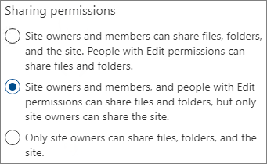

# Limitare la condivisione in Microsoft 365

Anche se non è possibile disabilitare completamente la condivisione interna o rimuovere il pulsante Condividi dai siti, esistono diversi modi per limitare la condivisione in Microsoft 365 per soddisfare le esigenze dell'organizzazione.

I metodi di condivisione dei file sono elencati nella tabella seguente. Per informazioni dettagliate, fare clic sul collegamento nella colonna **Metodo di condivisione**.

|Metodo di condivisione|Descrizione|Opzioni di limitazione|
|:-------------|:----------|:-------------|
|[Gruppo o team di Microsoft 365](#microsoft-365-group-or-team)|Gli utenti che hanno accesso a un team di Microsoft Teams o a un gruppo di Microsoft 365 hanno accesso in modifica ai file nel sito di SharePoint associato.|Se il gruppo o il team è privato, gli inviti di condivisione per partecipare al team devono essere approvati dal proprietario. Gli amministratori possono disabilitare l'accesso guest o usare le etichette di riservatezza per impedire l'accesso da parte di utenti esterni all'organizzazione.|
|[Sito di SharePoint](#sharepoint-site)|Agli utenti può essere concesso l'accesso come proprietari, membri o visitatori di un sito di SharePoint e avranno quel livello di accesso ai file nel sito.|È possibile limitare le autorizzazioni per il sito in modo che solo i proprietari possano condividere il sito. Gli amministratori possono configurare un sito come di sola lettura, o bloccare del tutto l’accesso.|
|[Condivisione con persone specifiche](#sharing-with-specific-people)|I membri del sito e le persone con autorizzazioni di modifica possono concedere autorizzazioni dirette ai file e alle cartelle o condividerli con collegamenti *Persone specifiche*.|È possibile limitare le autorizzazioni per il sito in modo che solo i proprietari possano condividere file e cartelle. In questo caso, l'accesso diretto e la condivisione di collegamenti *Persone specifiche* da parte dei membri del sito passano dal proprietario del sito per l'approvazione.|
|[Condivisione guest di SharePoint](#sharepoint-guest-sharing)|I proprietari e i membri dei siti di SharePoint possono condividere file e cartelle con persone esterne all'organizzazione.|La condivisione guest può essere disabilitata per l'intera organizzazione o per singoli siti.|
|[Collegamenti di condivisione *Persone nell'organizzazione*](#people-in-your-organization-sharing-links)|I proprietari e i membri dei siti di SharePoint possono condividere file usando collegamenti di tipo *Persone nell'organizzazione*, che funzioneranno per chiunque si trovi all'interno dell'organizzazione.|I collegamenti *Persone nell'organizzazione* possono essere disattivati a livello di sito.|
|[Condividere siti, gruppi e team](#create-sites-groups-and-teams)|Per impostazione predefinita, gli utenti possono creare nuovi siti, gruppi e team da cui possono condividere i contenuti.|Gli amministratori possono limitare chi può creare siti, gruppi e team.|
|[Posta elettronica](#email)|Le persone che hanno accesso a un file possono inviarlo ad altri tramite posta elettronica.|Gli amministratori possono crittografare i file usando etichette di riservatezza per evitare che vengano condivisi con persone non autorizzate.|
|[Download o copia di file](#download-or-file-copy)|Le persone che hanno accesso a un file possono scaricarlo o copiarlo e condividerlo con altri utenti esterni all'ambito di Microsoft 365.|Gli amministratori possono crittografare i file usando etichette di riservatezza per evitare che vengano condivisi con persone non autorizzate.|

È anche possibile limitare le condizioni in cui gli utenti accedono ai contenuti condivisi. Per altre informazioni, vedere [accesso condizionale](#conditional-access) più avanti in questo articolo.

Anche se è possibile usare i controlli amministrativi descritti in questo articolo per limitare la condivisione all'interno dell'organizzazione, è consigliabile usare le funzionalità di sicurezza e conformità disponibili in Microsoft 365 per creare un ambiente di condivisione sicura. Per informazioni, vedere [Collaborazione ai file in SharePoint con Microsoft 365](https://docs.microsoft.com/sharepoint/deploy-file-collaboration) e [Configurare team con isolamento di sicurezza](secure-teams-security-isolation.md).

Per informazioni su come viene usata la condivisione all'interno dell'organizzazione, [eseguire un report sulla condivisione di file e cartelle](https://docs.microsoft.com/sharepoint/sharing-reports).

## Gruppo o team di Microsoft 365

Se si vuole limitare la condivisione in un gruppo di Microsoft 365 o un team di Microsoft Teams, è importante rendere privato il gruppo o il team. Gli utenti all'interno dell'organizzazione possono entrare a far parte di un gruppo pubblico o di un team in qualsiasi momento. A meno che il gruppo o il team non sia privato, non è possibile limitare la condivisione del team o dei relativi file all'interno dell'organizzazione.

### Condivisione con gli utenti guest

Se si vuole impedire l'accesso guest in Teams, è possibile disattivare la condivisione guest nell'interfaccia di amministrazione di Teams.

Per disattivare la condivisione guest per Teams
1. Nell'interfaccia di amministrazione di Teams espandere **Impostazioni a livello di organizzazione** e quindi fare clic su **Accesso guest**.
2. Disattivare **Consenti accesso ospite in Teams**.
3. Fare clic su **Salva**.

Se si vuole impedire l'accesso guest nei gruppi di Microsoft 365, è possibile disattivare le impostazioni di accesso guest dei gruppi nell'interfaccia di amministrazione di Microsoft 365.

Per disattivare la condivisione guest nei gruppi di Microsoft 365
1. Nell'interfaccia di amministrazione di Microsoft 365 fare clic su **Impostazioni** poi ancora su **Impostazioni dell'organizzazione**.
2. Nella scheda **Servizi** fare clic su **Gruppi di Microsoft 365**.
3. Deselezionare le caselle di controllo **Consenti ai membri del gruppo esterni all'organizzazione di accedere al contenuto del gruppo** e **Consenti ai proprietari del gruppo di aggiungere persone esterne all'organizzazione ai gruppi**.
4. Fare clic su **Salva modifiche**.

    

> [!NOTE]
> Se si vuole impedire la condivisione guest per uno specifico gruppo o team, si può usare [Microsoft PowerShell](per-group-guest-access.md) o le [etichette di riservatezza](https://docs.microsoft.com/microsoft-365/compliance/sensitivity-labels-teams-groups-sites).

È possibile limitare la condivisione guest agli utenti di domini specifici consentendo o bloccando domini in Azure Active Directory. Questo influirà anche sulla condivisione guest in SharePoint se si è abilitata l'[integrazione di SharePoint e OneDrive con Azure AD B2B](https://docs.microsoft.com/sharepoint/sharepoint-azureb2b-integration-preview).

Per consentire la condivisione di inviti solo dai domini specificati
1. Nella pagina Panoramica di Azure Active Directory fare clic su **Relazioni aziendali**.
2. Fare clic su **Impostazioni**.
3. In **Restrizioni di collaborazione** selezionare **Nega gli inviti ai domini specificati** o **Consenti l'invio di inviti solo ai domini specificati** e quindi digitare i domini che si vogliono usare.
4. Fare clic su **Salva**.

    

## Sito di SharePoint

È possibile limitare la condivisione dei siti di SharePoint ai soli proprietari dei siti. Questo impedisce ai membri del sito di condividerlo. Tenere presente che se il sito è connesso a un gruppo di Microsoft 365, i membri del gruppo possono invitare altri utenti nel gruppo e questi utenti avranno accesso al sito.

Per limitare la condivisione del sito ai proprietari
1. Nel sito fare clic sull'icona a forma di ingranaggio e quindi su **Autorizzazioni sito**.
2. In **Impostazioni di condivisione** fare clic su **Modifica impostazioni di condivisione**.
3. Selezionare **I proprietari e i membri del sito e gli utenti con autorizzazioni di modifica possono condividere file e cartelle, ma solo i proprietari del sito possono condividere il sito**.
4. Fare clic su **Salva**.

    

È possibile impedire agli utenti che non sono membri del sito di richiedere l'accesso disattivando le richieste di accesso.

Per disattivare le richieste di accesso
1. Nel sito fare clic sull'icona a forma di ingranaggio e quindi su **Autorizzazioni sito**.
2. In **Impostazioni di condivisione** fare clic su **Modifica impostazioni di condivisione**.
3. Disattivare **Consenti richieste di accesso** e quindi fare clic su **Salva**.

È possibile limitare la condivisione del sito in base a domini specifici consentendo o bloccando domini per il sito.

Per limitare la condivisione del sito in base al dominio
1. Nell'interfaccia di amministrazione di SharePoint, in **Siti** fare clic su **Siti attivi**.
2. Fare clic sul sito che si vuole configurare.
3. Nella scheda **Criteri**, in **Condivisione esterna** fare clic su **Modifica**.
4. In **Impostazioni avanzate per la condivisione esterna** selezionare **Limita la condivisione esterna in base al dominio**.
5. Aggiungere i domini da consentire o bloccare e quindi fare clic su **Salva**.
6. Fare clic su **Salva**.

    

### Bloccare l'accesso ai siti

È possibile bloccare l'accesso a un sito o creare un sito di sola lettura modificando lo stato di blocco del sito. Per i dettagli, vedere [Bloccare e sbloccare i siti](https://docs.microsoft.com/sharepoint/manage-lock-status).

### Ereditarietà delle autorizzazioni

Benché non sia raccomandato, si può usare [Ereditarietà delle autorizzazioni di SharePoint](https://docs.microsoft.com/sharepoint/what-is-permissions-inheritance) per personalizzare il livello di accesso a siti e sottositi.

## Condivisione con persone specifiche

Se si vuole limitare la condivisione di un sito o del relativo contenuto, è possibile configurare il sito in modo da consentire solo ai proprietari di condividere file, cartelle e il sito. Quando si configura questa opzione, i tentativi dei membri del sito di condividere file o cartelle con collegamenti *Persone specifiche* andranno al proprietario del sito per l'approvazione.

Per limitare la condivisione di sito, file e cartelle ai proprietari
1. Nel sito fare clic sull'icona a forma di ingranaggio e quindi su **Autorizzazioni sito**.
2. In **Impostazioni di condivisione** fare clic su **Modifica impostazioni di condivisione**.
3. Selezionare **Solo i proprietari del sito possono condividere file, cartelle e il sito**.
4. Fare clic su **Salva**.

    

## Condivisione guest di SharePoint

Se si vuole impedire la condivisione di file e cartelle di SharePoint o OneDrive con persone esterne all'organizzazione, è possibile disattivare la condivisione guest per l'intera organizzazione o per un singolo sito.

Per disattivare la condivisione guest di SharePoint per l'organizzazione
1. Nell'interfaccia di amministrazione di SharePoint, in **Criteri** fare clic su **Condivisione**.
2. In **Condivisione esterna** trascinare il dispositivo di scorrimento di SharePoint verso il basso fino a **Solo persone nell'organizzazione**.
3. Fare clic su **Salva**.

    

Per disattivare la condivisione guest per un sito
1. Nell'interfaccia di amministrazione di SharePoint, in **Siti** fare clic su **Siti attivi**.
2. Fare clic sul sito che si vuole configurare.
3. Nella scheda **Criteri**, in **Condivisione esterna** fare clic su **Modifica**.
4. In **Condivisione esterna** scegliere **Solo persone nell'organizzazione** e quindi fare clic su **Salva**.

    

Se si vuole consentire la condivisione con persone esterne all'organizzazione, assicurandosi però che tutti gli utenti siano autenticati, è possibile disabilitare i collegamenti *Chiunque* (condivisione anonima) per l'intera organizzazione o per un singolo sito.

Per disattivare i collegamenti di tipo *Chiunque* a livello di organizzazione
1. Nell'interfaccia di amministrazione di SharePoint, in **Criteri** fare clic su **Condivisione**.
2. In **Condivisione esterna** trascinare il dispositivo di scorrimento di SharePoint verso il basso fino a **Utenti guest nuovi ed esistenti**.
3. Fare clic su **Salva**.

    

Per disattivare i collegamenti di tipo *Chiunque* per un sito
1. Nell'interfaccia di amministrazione di SharePoint, in **Siti** fare clic su **Siti attivi**.
2. Fare clic sul sito che si vuole configurare.
3. Nella scheda **Criteri**, in **Condivisione esterna** fare clic su **Modifica**.
4. In **Condivisione esterna** scegliere **Utenti guest nuovi ed esistenti** e quindi fare clic su **Salva**.

    

## Collegamenti di condivisione *Persone nell'organizzazione*

Per impostazione predefinita, i membri di un sito possono condividere file e cartelle con altre persone dell'organizzazione usando un collegamento di tipo *Persone nell'organizzazione*. È possibile disabilitare i collegamenti *Persone nell'organizzazione* usando PowerShell:

`Set-SPOSite -Identity <site> -DisableCompanyWideSharingLinks`

Ad esempio:

`Set-SPOSite -Identity https://contoso.sharepoint.com -DisableCompanyWideSharingLinks`

## Creare siti, gruppi e team

Per impostazione predefinita, gli utenti possono creare nuovi siti, gruppi e team da cui possono condividere contentuti (in base alle impostazioni di condivisione). L’utente può limitare chi può creare siti, gruppi e team. Vedere i seguenti riferimenti:

- [Gestire la creazione di siti in SharePoint](https://docs.microsoft.com/sharepoint/manage-site-creation)
- [Gestire chi può creare gruppi in Microsoft 365](https://docs.microsoft.com/microsoft-365/solutions/manage-creation-of-groups)

Notare che limitare la creazione dei gruppi limita la creazione dei team.

## Posta elettronica

È possibile impedire la condivisione indesiderata dei messaggi di posta elettronica usando la crittografia. In questo modo si evita che i messaggi vengano inoltrati o altrimenti condivisi con utenti non autorizzati. La crittografia della posta elettronica può essere abilitata usando etichette di riservatezza. Per informazioni. vedere [Limitare l'accesso al contenuto usando la crittografia nelle etichette di riservatezza](https://docs.microsoft.com/microsoft-365/compliance/encryption-sensitivity-labels).

## Download o copia di file

Gli utenti che hanno accesso ai file e alle cartelle in Microsoft 365 possono scaricare file e copiarli in un supporto esterno. Per ridurre il rischio di condivisione indesiderata dei file, è possibile crittografare il contenuto usando le etichette di riservatezza.

## Accesso condizionale

L’accesso condizionale di Azure Active Directory offre opzioni per limitare o prevenire la condivisione con altre persone in base alla posizione della rete, all’integrità del dispositivo, ai rischi legati all’accesso e altri fattori. Vedere [Che cos’è l’accesso condizionale?](https://docs.microsoft.com/azure/active-directory/conditional-access/overview).

SharePoint offre l’integrazione diretta con l’accesso condizionale di Azure AD sia per i dispositivi non gestiti che per le posizioni di rete. Vedere i seguenti riferimenti per i dettagli:

- [Controllare l'accesso da dispositivi non gestiti](https://docs.microsoft.com/sharepoint/control-access-from-unmanaged-devices)
- [Controllare l'accesso ai dati di SharePoint e OneDrive in base al percorso di rete](https://docs.microsoft.com/sharepoint/control-access-based-on-network-location)

## Vedere anche

[Riferimento alle impostazioni di condivisione guest di Microsoft 365](microsoft-365-guest-settings.md)
