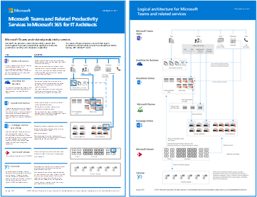

# Illustrazioni sulla produttività di Microsoft 365Microsoft 365 productivity illustrations

La serie di soluzioni di Microsoft 365 Enterprise fornisce indicazioni per l'implementazione delle funzionalità di Microsoft 365, in particolare quando si combinano funzionalità e tecnologie.The Microsoft 365 enterprise solution series provides guidance for implementing Microsoft 365 capabilities, especially where capabilities cross technologies.

### Microsoft Teams e servizi di produttività correlati in Microsoft 365 per architetti ITMicrosoft Teams and related productivity services in Microsoft 365 for IT architects
L'architettura logica dei servizi di produttività in Microsoft 365, con Microsoft Teams.The logical architecture of productivity services in Microsoft 365, leading with Microsoft Teams.

|**Elemento****Item**|**Descrizione****Description**|
|:-----|:-----|
|   [PDF](https://github.com/MicrosoftDocs/microsoft-365-docs/raw/public/microsoft-365/downloads/msft-m365-teams-logical-architecture.pdf) \| [Visio](https://github.com/MicrosoftDocs/OfficeDocs-Enterprise/raw/live/Enterprise/downloads/msft-m365-teams-logical-architecture.vsdx)[PDF](https://github.com/MicrosoftDocs/microsoft-365-docs/raw/public/microsoft-365/downloads/msft-m365-teams-logical-architecture.pdf) \| [Visio](https://github.com/MicrosoftDocs/OfficeDocs-Enterprise/raw/live/Enterprise/downloads/msft-m365-teams-logical-architecture.vsdx)   Aggiornato nell'aprile 2019Updated April 2019   |Microsoft offre una serie di servizi di produttività che interagiscono tra loro per offrire esperienze di collaborazione con governance dei dati, sicurezza e conformità integrate.Microsoft provides a suite of productivity services that work together to provide collaboration experiences with data governance, security, and compliance capabilities.    Questa serie di immagini consente di visualizzare l'architettura logica di servizi di produttività per enterprise architect, con Microsoft Teams.This series of illustrations provides a view into the logical architecture of productivity services for enterprise architects, leading with Microsoft Teams.|

### Gruppi in Microsoft 365 per architetti ITGroups in Microsoft 365 for IT Architects
Cosa devono sapere gli architetti IT sui gruppi di Microsoft 365What IT architects need to know about groups in Microsoft 365

|**Elemento****Item**|**Descrizione****Description**|
|:-----|:-----|
|   [PDF](https://github.com/MicrosoftDocs/microsoft-365-docs/raw/public/microsoft-365/downloads/msft-m365-groups.pdf) \| [Visio](https://github.com/MicrosoftDocs/OfficeDocs-Enterprise/raw/live/Enterprise/downloads/msft-m365-groups.vsdx)[PDF](https://github.com/MicrosoftDocs/microsoft-365-docs/raw/public/microsoft-365/downloads/msft-m365-groups.pdf) \| [Visio](https://github.com/MicrosoftDocs/OfficeDocs-Enterprise/raw/live/Enterprise/downloads/msft-m365-groups.vsdx)   Aggiornato nel giugno 2019Updated June 2019|Queste immagini mostrano dettagliatamente i diversi gruppi, come questi vengono creati e gestiti, e alcuni consigli di governance.These illustrations detail the different types of groups, how these are created and managed, and a few governance recommendations.|

### Protezione della sicurezza e delle informazioni per le organizzazioni multi-areaSecurity and Information Protection for Multi-Region Organizations
Protezione della sicurezza e delle informazioni per le organizzazioni multi-area con un singolo tenant di Microsoft 365Security and information protection for multi-region organizations with a single microsoft 365 tenant

|**Elemento****Item**|**Descrizione****Description**|
|:-----|:-----|
|   [PDF](https://github.com/MicrosoftDocs/microsoft-365-docs/raw/public/microsoft-365/downloads/msft-security-info-protect-multi-region.pdf) \| [Visio](https://github.com/MicrosoftDocs/microsoft-365-docs/raw/public/microsoft-365/downloads/msft-security-info-protect-multi-region.vsdx)[PDF](https://github.com/MicrosoftDocs/microsoft-365-docs/raw/public/microsoft-365/downloads/msft-security-info-protect-multi-region.pdf) \| [Visio](https://github.com/MicrosoftDocs/microsoft-365-docs/raw/public/microsoft-365/downloads/msft-security-info-protect-multi-region.vsdx) Aggiornato nel marzo 2020Updated March 2020 |L'uso di un singolo tenant di Microsoft 365 per l'organizzazione globale rappresenta la scelta e l'esperienza migliori per vari motivi.Using a single Microsoft 365 tenant for your global organization is the best choice and experience for many reasons. Tuttavia, molti architetti fanno fatica a trovare il modo di soddisfare i requisiti di sicurezza e di protezione delle informazioni nelle varie aree geografiche.However, many architects wrestle with how to meet security and information protection objectives across different regions. Questa serie di argomenti offre alcuni suggerimenti.This set of topics provides recommendations. |

### Strategia di distribuzione di Microsoft Defender ATPMicrosoft Defender ATP deployment strategy

Alcuni strumenti sono più adatti per determinate architetture, a seconda dell'ambiente.Depending on your environment, some tools are better suited for certain architectures.

|**Elemento****Item**|**Descrizione****Description**|
|:-----|:-----|
|  [PDF](https://github.com/MicrosoftDocs/windows-itpro-docs/raw/public/windows/security/threat-protection/microsoft-defender-atp/downloads/mdatp-deployment-strategy.pdf)  \| [Visio](https://github.com/MicrosoftDocs/windows-itpro-docs/raw/public/windows/security/threat-protection/microsoft-defender-atp/downloads/mdatp-deployment-strategy.vsdx)[PDF](https://github.com/MicrosoftDocs/windows-itpro-docs/raw/public/windows/security/threat-protection/microsoft-defender-atp/downloads/mdatp-deployment-strategy.pdf)  \| [Visio](https://github.com/MicrosoftDocs/windows-itpro-docs/raw/public/windows/security/threat-protection/microsoft-defender-atp/downloads/mdatp-deployment-strategy.vsdx)  Aggiornato nel febbraio 2020Updated February 2020| Il materiale sull'architettura consente di pianificare la distribuzione per le architetture seguenti:The architectural material helps you plan your deployment for the following architectures: <ul><li> Nativa del cloudCloud-native </li><li> Co-gestioneCo-management </li><li> LocaleOn-premise</li><li>Valutazione e onboarding localeEvaluation and local onboarding</li>

### Infrastruttura di base di Microsoft 365 EnterpriseMicrosoft 365 Enterprise Foundation Infrastructure

Ottenere una visualizzazione immediata dell'[infrastruttura di base](https://docs.microsoft.com/microsoft-365/enterprise/deploy-foundation-infrastructure) per Microsoft 365 Enterprise per avviare la distribuzione.Get an at-a-glance view of the [foundation infrastructure](https://docs.microsoft.com/microsoft-365/enterprise/deploy-foundation-infrastructure) for Microsoft 365 Enterprise to begin your deployment.
  
|**Elemento****Item**|**Descrizione****Description**|
|:-----|:-----|
|   [Visualizza online](https://aka.ms/m365efoundinfraposter) \| [PDF](https://github.com/MicrosoftDocs/microsoft-365-docs/raw/public/microsoft-365/downloads/Microsoft365EnterpriseFoundInfra.pdf)[View online](https://aka.ms/m365efoundinfraposter) \| [PDF](https://github.com/MicrosoftDocs/microsoft-365-docs/raw/public/microsoft-365/downloads/Microsoft365EnterpriseFoundInfra.pdf)   Aggiornato nel dicembre 2019Updated December 2019| Questo poster riepiloga ogni fase dell'infrastruttura di base in termini di obiettivi, funzionalità e strumenti, scelte progettuali, risultati della configurazione, onboarding, monitoraggio continuo e aggiornamenti.This poster summarizes each phase of the foundation infrastructure in terms of goals, features and tools, design decisions, configuration results, onboarding, and ongoing monitoring and updates.  | 

   

### Protezione di dispositivi e identità per Office 365Identity and device protection for Office 365

Funzionalità consigliate per proteggere le identità e i dispositivi che accedono a Office 365, ad altri servizi SaaS e ad applicazioni locali pubblicate con proxy di applicazione Azure AD.Recommended capabilities for protecting identities and devices that access Office 365, other SaaS services, and on-premises applications published with Azure AD Application Proxy.

|**Elemento****Item**|**Descrizione****Description**|
|:-----|:-----|
|[          ](https://www.microsoft.com/download/details.aspx?id=55032)[          ](https://www.microsoft.com/download/details.aspx?id=55032)   [PDF](https://go.microsoft.com/fwlink/p/?linkid=841656) \| [Visio](https://go.microsoft.com/fwlink/p/?linkid=841657) \| [Altre lingue](https://www.microsoft.com/download/details.aspx?id=55032)[PDF](https://go.microsoft.com/fwlink/p/?linkid=841656)  \| [Visio](https://go.microsoft.com/fwlink/p/?linkid=841657)  \| [More languages](https://www.microsoft.com/download/details.aspx?id=55032)   Aggiornato nel novembre 2018Updated November 2018|È importante utilizzare livelli di protezione coerenti tra dati, identità e dispositivi. Questo documento illustra quali funzionalità sono confrontabili con ulteriori informazioni sulle capacità per proteggere identità e dispositivi.It's important to use consistent levels of protection across your data, identities, and devices. This document shows you which capabilities are comparable with more information on capabilities to protect identities and devices.    |
   
<!--

### File protection solutions in Office 365

Recommended capabilities for protecting files in Office 365 based on three different sensitivity levels.
  
|**Item**|**Description**|
|:-----|:-----|
|[          ](https://www.microsoft.com/download/details.aspx?id=55523)   [PDF](https://go.microsoft.com/fwlink/?linkid=2004320)  \| [Visio](https://download.microsoft.com/download/7/8/9/789645A5-BD10-4541-BC33-F8D1EFF5E911/MSFT_cloud_architecture_O365%20file%20protection.vsdx)   |It's important to use consistent levels of protection across your data, identities, and devices. This document shows you which capabilities are comparable with more information on capabilities to protect files in Office 365.    |
   

### Office 365 Information Protection for GDPR

Prescriptive recommendations for discovering, classifying, protecting, and monitoring personal data. This solution uses General Data Protection Regulation (GDPR) as an example, but you can apply the same process to achieve compliance with many other regulations.

|**Item**|**Description**|
|:-----|:-----|
|    [PDF](https://download.microsoft.com/download/E/C/D/ECD5A339-EF10-4420-B3A9-99098884D716/MSFT_Cloud_architecture_information%20protection%20for%20GDPR.pdf) \| [Visio](https://download.microsoft.com/download/E/C/D/ECD5A339-EF10-4420-B3A9-99098884D716/MSFT_Cloud_architecture_information%20protection%20for%20GDPR.vsdx)    |To see this content in article format, see [Office 365 Information Protection for GDPR](https://docs.microsoft.com/Office365/SecurityCompliance/office-365-information-protection-for-gdpr).      |

### Microsoft Security Guidance for Political Campaigns, Nonprofits, and Other Agile Organizations 

This guidance describes how to implement a secure cloud environment. The solution guidance can be used by any organization. It includes extra help for agile organizations with BYOD access and guest accounts. You can use this guidance as a starting-point for designing your own environment.

|**Item**|**Description**|
|:-----|:-----|
|**Microsoft Security Guidance for Political Campaigns**   [          ](https://download.microsoft.com/download/B/4/D/B4D520C3-4D0C-4B4D-BFB9-09F0651C2775/MSFT_Cloud_architecture_security%20for%20political%20campaigns.pdf)   [PDF](https://download.microsoft.com/download/B/4/D/B4D520C3-4D0C-4B4D-BFB9-09F0651C2775/MSFT_Cloud_architecture_security%20for%20political%20campaigns.pdf)  \| [Visio](https://download.microsoft.com/download/B/4/D/B4D520C3-4D0C-4B4D-BFB9-09F0651C2775/MSFT_Cloud_architecture_security%20for%20political%20campaigns.vsdx)   |This guidance uses a political campaign organization as an example. Use this guidance as a starting point for any environment.    |
|**Microsoft Security Guidance for Nonprofits**   [          ](https://download.microsoft.com/download/9/4/3/94389612-C679-4061-8DF2-D9A15D72B65F/Microsoft_Cloud%20Architecture_Security%20for%20Nonprofits.pdf)   [PDF](https://download.microsoft.com/download/9/4/3/94389612-C679-4061-8DF2-D9A15D72B65F/Microsoft_Cloud%20Architecture_Security%20for%20Nonprofits.pdf)  \| [Visio](https://download.microsoft.com/download/9/4/3/94389612-C679-4061-8DF2-D9A15D72B65F/Microsoft_Cloud%20Architecture_Security%20for%20Nonprofits.vsdx)   |This guide is slightly revised for nonprofit organizations. For example, it references Office 365 Nonprofit plans. The technical guidance is the same as the political campaign solution guide.    |

This guidance includes Test Lab Guides. For more information, see [Microsoft Security Guidance for Political Campaigns, Nonprofits, and Other Agile Organizations](https://docs.microsoft.com/Office365/SecurityCompliance/microsoft-security-guidance-for-political-campaigns-nonprofits-and-other-agile-o).

-->

### Soluzioni di telefonia MicrosoftMicrosoft Telephony Solutions

Microsoft supporta diverse opzioni per iniziare il viaggio verso l'implementazione di Teams nel cloud Microsoft. Questo poster è utile per decidere la soluzione di telefonia Microsoft (Sistema telefonico nel cloud o VoIP aziendale in locale) più adatta per gli utenti dell'organizzazione e per stabilire in che modo l'organizzazione si connetterà alla rete PSTN (Public Switched Telephone Network).Microsoft supports several options as you begin your journey to Teams in the Microsoft cloud. This poster helps you decide which Microsoft telephony solution (Phone System in the cloud or Enterprise Voice on-premises) is right for users in your organization, and how your organization can connect to the Public Switched Telephone Network (PSTN).

  
[PDF](https://github.com/MicrosoftDocs/OfficeDocs-SkypeForBusiness/raw/live/Teams/downloads/telephony-solutions/microsoft-telephony-solutions-12-19.pdf) | [Visio](https://github.com/MicrosoftDocs/OfficeDocs-SkypeForBusiness/raw/live/Teams/downloads/telephony-solutions/microsoft-telephony-solutions-12-18.vsdx)[PDF](https://github.com/MicrosoftDocs/OfficeDocs-SkypeForBusiness/raw/live/Teams/downloads/telephony-solutions/microsoft-telephony-solutions-12-19.pdf) | [Visio](https://github.com/MicrosoftDocs/OfficeDocs-SkypeForBusiness/raw/live/Teams/downloads/telephony-solutions/microsoft-telephony-solutions-12-18.vsdx)  
Aggiornato nel gennaio 2019Updated January 2019

Per altre informazioni, vedere l'articolo correlato a questo poster: [Soluzioni di telefonia Microsoft](https://docs.microsoft.com/SkypeForBusiness/hybrid/msft-telephony-solutions).For more information, see the article for this poster: [Microsoft Telephony Solutions](https://docs.microsoft.com/SkypeForBusiness/hybrid/msft-telephony-solutions).
  
  
## Vedere ancheSee Also

[Modelli architetturali per SharePoint, Exchange, Skype for Business e LyncArchitectural models for SharePoint, Exchange, Skype for Business, and Lync](https://docs.microsoft.com/office365/enterprise/architectural-models-for-sharepoint-exchange-skype-for-business-and-lync)
  
[Guida al lab test (TLG) per adozione del cloudCloud adoption Test Lab Guides (TLGs)](https://docs.microsoft.com/office365/enterprise/cloud-adoption-test-lab-guides-tlgs)
