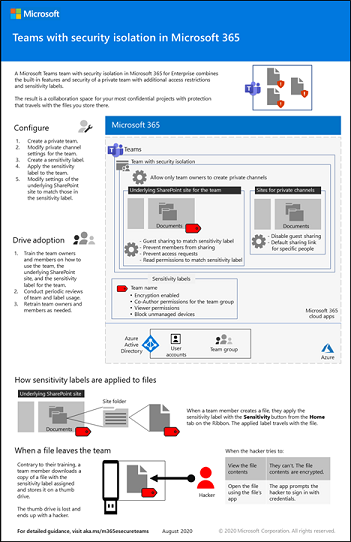

# Configurare un team con l'isolamento di sicurezzaConfigure a team with security isolation

Questo articolo fornisce suggerimenti e procedure per configurare un team privato in Microsoft Teams e usare un'etichetta di riservatezza univoca per crittografare i file in modo che solo i membri del team possano decrittografarli.This article provides you with recommendations and steps to configure a private team in Microsoft Teams and use a unique sensitivity label to encrypt files so that only team members can decrypt them.

Oltre all'accesso privato, questo articolo descrive come configurare il sito del team di SharePoint associato, a cui è possibile accedere dalla sezione **File** di un canale del team, per implementare la sicurezza aggiuntiva necessaria per archiviare dati altamente regolamentati.Beyond the private access, this article describes how to configure the associated SharePoint site, which you can access from the **Files** section of a team channel, for the additional security needed to store highly regulated data.

Gli elementi della configurazione di un team con l’isolamento di sicurezza sono:The elements of configuration for a team with security isolation are:

- Un team privatoA private team
- Sicurezza aggiuntiva nel sito di SharePoint associato per il team che:Additional security on the associated SharePoint site for the team that:
  - Impedisce ai membri del sito di condividere il sito con altri utenti.Prevents members of the site from sharing the site with others.
  - Impedisce ai non membri del sito di richiedere accesso al sito.Prevents non-members of the site from requesting access to the site.
- Un'etichetta di riservatezza specifica per il team:A sensitivity label specifically for this team that:
    - Impedisce l'accesso al contenuto di SharePoint da dispositivi non gestitiPrevents access to SharePoint content from unmanaged devices
    - Consente o nega l'accesso guest al team, a seconda dei requisitiAllows or denies guest access to the team, depending on your requirements
    - Crittografa i documenti a cui è applicata l'etichettaEncrypts documents to which the label is applied

> [!IMPORTANT]
> Assicurarsi di avere abilitato i [criteri di riservatezza per proteggere il contenuto in Microsoft Teams, gruppi di Office 365 e siti di SharePoint](https://docs.microsoft.com/microsoft-365/compliance/sensitivity-labels-teams-groups-sites) prima di procedere con i passaggi descritti in questo articolo.Be sure you have enabled [sensitivity labels to protect content in Microsoft Teams, Office 365 groups, and SharePoint sites](https://docs.microsoft.com/microsoft-365/compliance/sensitivity-labels-teams-groups-sites) before you proceed with the steps in this article.

Guardare il video per una panoramica del processo di distribuzione.Watch this video for an overview of the deployment process.
 
> [!VIDEO https://www.microsoft.com/videoplayer/embed/RE4mGHf]

 Per un riepilogo di 1 pagina di questo scenario, vedere il [poster Microsoft Teams con isolamento della sicurezza](../downloads/team-security-isolation-poster.pdf).For a 1-page summary of this scenario, see the [Microsoft Teams with security isolation poster](../downloads/team-security-isolation-poster.pdf).

È anche possibile scaricare il poster in formato [PDF](https://github.com/MicrosoftDocs/microsoft-365-docs/raw/public/microsoft-365/downloads/team-security-isolation-poster.pdf) o [PowerPoint](https://download.microsoft.com/download/8/0/5/8057fc16-c044-40b6-a652-7ed555ba2895/team-security-isolation-poster.pptx) e stamparlo in formato lettera, legale o tabloid (27,9 x 43,2 cm).You can also download this poster in [PDF](https://github.com/MicrosoftDocs/microsoft-365-docs/raw/public/microsoft-365/downloads/team-security-isolation-poster.pdf) or [PowerPoint](https://download.microsoft.com/download/8/0/5/8057fc16-c044-40b6-a652-7ed555ba2895/team-security-isolation-poster.pptx) formats and print it on letter, legal, or tabloid (11 x 17) size paper.

## Protezioni inizialiInitial protections

Per proteggere l'accesso al team e al sito di SharePoint sottostante, vedere le procedure consigliate seguenti:To help protect access to the team and its underlying SharePoint site, review the following best practices:
- [Criteri di identità e accesso ai dispositiviIdentity and device access policies](../security/office-365-security/identity-access-policies.md)
- [Criteri di accesso di SharePoint OnlineSharePoint Online access policies](../security/office-365-security/sharepoint-file-access-policies.md)
- [Distribuire i team con la protezione di baseDeploy teams with baseline protection](configure-teams-baseline-protection.md)

## Condivisione con gli utenti guestGuest sharing

A seconda del tipo di attività, è possibile abilitare la condivisione guest per il team.Depending on the nature of your business, you may or may not want to enable guest sharing for this team. Se si prevede di collaborare con persone esterne all'organizzazione nel team, abilitare la condivisione guest.If you do plan to collaborate with people outside your organization in the team, enable guest sharing. 

Per informazioni dettagliate sulla condivisione sicura di con gli utenti guest, vedere le risorse seguenti:For details about sharing with guests securely, see the following resources:

- [Limitare l'esposizione accidentale ai file durante la condivisione con persone esterne all'organizzazioneLimit accidental exposure to files when sharing with people outside your organization](https://docs.microsoft.com/microsoft-365/solutions/share-limit-accidental-exposure)
- [Creare un ambiente di condivisione guest sicuroCreate a secure guest sharing environment](https://docs.microsoft.com/microsoft-365/solutions/create-secure-guest-sharing-environment)

Per consentire o impedire la condivisione guest, è possibile usare una combinazione di un'etichetta di riservatezza per il team e di controlli di condivisione a livello di team per il sito di SharePoint associato, entrambi illustrati più avanti.To allow or block guest sharing, we use a combination of a sensitivity label for the team and site-level sharing controls for the associated SharePoint site, both discussed later.

## Creare un team privatoCreate a private team

Dato che si sta creando un'etichetta di riservatezza specifica per questo team, il passaggio successivo consiste nel creare il team.Since we are creating a sensitivity label specifically for this team, the next step is to create the team. Se si ha già un team, è possibile usarlo.If you have an existing team, you can use that.

Per creare un team per le informazioni sensibiliTo create a team for sensitive information
1. In Teams fare clic su **Team** sul lato sinistro dell'app, quindi fare clic su **Partecipa o crea un team** in fondo all'elenco dei team.In Teams, click **Teams** on the left side of the app, then click **Join or create a team** at the bottom of the teams list.
2. Fare clic su **Crea team** (prima scheda nell'angolo in alto a sinistra).Click **Create team** (first card, top left corner).
3. Scegliere **Crea un team da zero**.Choose **Build a team from scratch**.
4. Nell'elenco **Riservatezza** mantenere l'impostazione predefinita.In the **Sensitivity** list, keep the default.
5. In **Privacy** fare clic **Privato**.Under **Privacy**, click **Private**.
6. Digitare un nome per il team che sia correlato al progetto sensibile.Type a name for the team that is related to your sensitive project. Ad esempio, **Progetto Saturno**.For example, **Project Saturn**.
7. Fare clic su **Crea**.Click **Create**.
8. Aggiungere gli utenti al team, quindi fare clic su **Chiudi**.Add users to the team, and then click **Close**.

## Impostazioni per i canali privatiPrivate channel settings

È consigliabile limitare la creazione di canali privati ai proprietari dei team.We recommend restricting creating private channels to team owners.

Per limitare la creazione di canali privatiTo restrict private channel creation
1. Nel team fare clic su **Altre opzioni** e quindi su **Gestisci team**.In the team, click **More options**, and then click **Manage team**.
2. Nella scheda **Impostazioni** espandere **Autorizzazioni dei membri**.On the **Settings** tab, expand **Member permissions**.
3. Deselezionare la casella di controllo **Consenti ai membri di creare canali privati**.Clear the **Allow members to create private channels** check box.

È anche possibile usare i [criteri dei team](https://docs.microsoft.com/MicrosoftTeams/teams-policies) per controllare chi può creare canali privati.You can also use [teams policies](https://docs.microsoft.com/MicrosoftTeams/teams-policies) to control who can create private channels.

## Creare un'etichetta di riservatezzaCreate a sensitivity label

Per configurare un team per l'isolamento di sicurezza, verrà usata un'etichetta di riservatezza creata appositamente per il team.To configure a team for security isolation, we'll be using a sensitivity label created specifically for this team. Questa etichetta viene usata a livello del team per controllare la condivisione guest e bloccare l'accesso da dispositivi non gestiti.This label is used at the team level to control guest sharing and to block access from unmanaged devices. Può essere usata anche per classificare e crittografare singoli file nel team, in modo che possano essere aperti solo dai proprietari e dai membri del team.It can also be used to classify and encrypt individual files in the team so that only team owners and members can open them.

Se un partner interno o un gruppo di stakeholder deve poter visualizzare i documenti crittografati ma non modificarli, è possibile aggiungerlo all'etichetta con le autorizzazioni di sola visualizzazione.If you have an internal partner or stakeholder group who should be able to view encrypted documents but not edit them, you can add them to the label with view-only permissions. In seguito è possibile aggiungere queste persone al sito di SharePoint del team con autorizzazioni di lettura, affinché possano accedere in sola lettura al sito in cui sono conservati i documenti, ma non al team stesso.You can then add these people to the team's SharePoint site with Reader permissions, and they will have read-only access to the site where the documents are kept, but not the team itself.

Per creare un'etichetta di riservatezzaTo create a sensitivity label
1. Aprire il [Centro conformità Microsoft 365](https://compliance.microsoft.com).Open the [Microsoft 365 compliance center](https://compliance.microsoft.com).
2. In **Soluzioni** fare clic su **Protezione delle informazioni**.Under **Solutions**, click **Information protection**.
3. Fare clic su **Crea un'etichetta**.Click **Create a label**.
4. Assegnare un nome all'etichetta.Give the label a name. Si consiglia di assegnargli il nome del team con cui verrà usato.We suggest naming it after the team that you'll be using it with.
5. Aggiungere un nome visualizzato e una descrizione, quindi fare clic su **Avanti**.Add a display name and description, and then click **Next**.
6. Nella **pagina Definire l'ambito di questa etichetta**, selezionare **File ed e-mail** e **Gruppi e siti**, quindi fare clic su **Avanti**.On the **Define the scope for this label page**, select **Files & emails** and **Groups & sites** and click **Next**.
7. Nella pagina **Scegliere le impostazioni di protezione per file ed e-mail**, selezionare **Crittografare file ed e-mail**, quindi fare clic su **Avanti**.On the **Choose protection settings for files and emails** page, select **Encrypt files and emails**, and then click **Next**.
8. Nella pagina **Crittografia**, scegliere **Configurare le impostazioni di crittografia**.On the **Encryption** page, choose **Configure encryption settings**.
9. Fare clic su **Aggiungi utenti o gruppi**, selezionare il team creato e quindi fare clic su **Aggiungi**.Click **Add users or groups**, select the team that you created, and then click **Add**
10. Fare clic su **Seleziona autorizzazioni**.Click **Choose permissions**.
11. Scegliere **Coautore** nell'elenco a discesa, quindi fare clic su **Salva**.Choose **Co-Author** from the dropdown list, and then click **Save**.
12. Se si vogliono includere utenti o gruppi con accesso in sola lettura ai file con l'etichetta:If you want to include users or groups with read-only access to files with the label:
    1. Fare clic su **Assegna autorizzazioni**.Click **Assign permissions**.
    1. Fare clic su **Aggiungi utenti o gruppi**, selezionare gli utenti o i gruppi da aggiungere e quindi fare clic su **Aggiungi**.Click **Add users or groups**, select the users or groups that you want to add, and then click **Add**.
    1. Fare clic su **Seleziona autorizzazioni**.Click **Choose permissions**.
    1. Scegliere **Visualizzatore** nell'elenco a discesa, quindi fare clic su **Salva**.Choose **Viewer** from the dropdown list, and then click **Save**.
13.  Fare clic su **Salva**, quindi fare clic su **Avanti**.Click **Save**, and then click **Next**.
14. Nella pagina \*Etichettatura automatica di file ed e-mail\*\*, fare clic su **Avanti**.On the *Auto-labeling for files and emails*\* page, click **Next**.
15. Nella pagina **Definire le impostazioni di protezione per gruppi e siti**, selezionare **Impostazioni di privacy e accesso utenti esterni** e **Impostazioni di accesso del dispositivo e condivisione esterna**, quindi fare clic su **Avanti**.On the **Define protection settings for groups and sites** page, select **Privacy and external user access settings** and **Device access and external sharing settings** and click **Next**.
16. Nella pagina **Definire le impostazioni di privacy e accesso utenti esterni**, in **Privacy**, selezionare l'opzione **Privato**.On the **Define privacy and external user access settings** page, under **Privacy**, select the **Private** option.
17. Se si desidera consentire l'accesso a utenti guest, in **Accesso utenti esterni**, selezionare **Consentire ai proprietari di gruppi di Microsoft 365 di aggiungere persone esterne all'organizzazione ai gruppi come ospiti**.If you want to allow guest access, under **External user access**, select **Let Microsoft 365 Group owners add people outside your organization to the group as guests**.
18. Fare clic su **Avanti**.Click **Next**.
19. Nella pagina **Definire le impostazioni di condivisione esterna e di accesso del dispositivo**, selezionare **Controllare la condivisione esterna da siti SharePoint con etichetta**.On the **Define external sharing and device access settings** page, select **Control external sharing from labeled SharePoint sites**.
20. In **Il contenuto può essere condiviso con**, scegliere **Utenti ospiti nuovi ed esistenti** se si sta consentendo l'accesso a utenti guest o **Solo persone nell'organizzazione** in caso contrario.Under **Content can be shared with**, choose **New and existing guests** if you're allowing guest access or **Only people in your organization** if not.
21. In **Accesso da dispositivi non gestiti** scegliere **Blocca accesso**.Under **Access from unmanaged devices**, choose **Block access**.
22. Fare clic su **Avanti**.Click **Next**.
23. Nella pagina **Applicazione automatica di etichette per le colonne del database**, fare clic su **Avanti**.On the **Auto-labeling for database columns** page, click **Next**.
24. Fare clic su **Crea etichetta**, quindi su **Fine**.Click **Create label**, and then click **Done**.

Dopo avere creato l'etichetta, è necessario pubblicarla per gli utenti che lo useranno.Once you've created the label, you need to publish it to the users who will use it. In questo caso, l'etichetta verrà resa disponibile solo alle persone nel team.In this case, we'll make the label available only to people in the team.

Per pubblicare un'etichetta di riservatezzaTo publish a sensitivity label
1. Nella pagina **Protezione delle informazioni** del Centro conformità Microsoft 365 scegliere la scheda **Criteri delle etichette**.In the Microsoft 365 compliance center, on the **Information protection** page, choose the **Label policies** tab.
2. Fare clic su **Pubblica etichette**.Click **Publish labels**.
3. Nella pagina **Scegliere le etichette di riservatezza da pubblicare** fare clic **Scegliere le etichette di riservatezza da pubblicare**.On the **Choose sensitivity labels to publish** page, click **Choose sensitivity labels to publish**.
4. Selezionare l'etichetta creata, quindi fare clic su **Aggiungi**.Select the label that you created, and then click **Add**.
5. Fare clic su **Avanti**.Click **Next**.
6. Nella pagina Pubblicare per utenti e gruppi fare clic su **Scegli utenti e gruppi**.On the Publish to users and groups page, click **Choose users and groups**.
7. Fare clic **Aggiungi** e quindi selezionare il team creato.Click **Add**, and then select the team that you created.
8. Fare clic su **Aggiungi**, quindi su **Fine**.Click **Add**, and then click **Done**.
9. Fare clic su **Avanti**.Click **Next**.
10. Nella pagina Impostazioni dei criteri selezionare la casella di controllo **Gli utenti devono fornire una giustificazione per la rimozione di un'etichetta o la riduzione di un livello di classificazione** e quindi fare clic su **Avanti**.On the Policy settings page, select the **Users must provide justification to remove a label or lower classification label** check box, and then click **Next**.
11. Digitare un nome per il criterio, quindi fare clic su **Avanti**.Type a name for the policy, and then click **Next**.
12. Fare clic su **Invia**, quindi su **Fine**.Click **Submit** and then click **Done**.

## Applicare l'etichetta al teamApply the label to the team

Una volta pubblicata l'etichetta, è necessario applicarla al team per rendere effettive le impostazioni relative alla condivisione guest e ai dispositivi gestiti.Once the label has been published, you must apply it to the team in order for the guest sharing and managed devices settings to take effect. A questo scopo, si usa l'interfaccia di amministrazione di SharePoint.This is done in the SharePoint admin center. Tenere presente che l'etichetta potrebbe essere disponibile qualche tempo dopo la pubblicazione.Note, it may take some time for the label to become available after it's been published.

Per applicare l'etichetta di riservatezzaTo apply the sensitivity label
1. Aprire l'[interfaccia di amministrazione di SharePoint](https://admin.microsoft.com/sharepoint).Open the [SharePoint admin center](https://admin.microsoft.com/sharepoint).
2. In **Siti** fare clic su **Siti attivi**.Under **Sites**, click **Active sites**.
3. Fare clic sul sito associato al team.Click the site that is associated with team.
4. Nella scheda **Criteri**, in **Riservatezza** fare clic su **Modifica**.On the **Policies** tab, under **Sensitivity**, click **Edit**.
5. Selezionare l'etichetta creata, quindi fare clic su **Salva**.Select the label that you created, and then click **Save**.

## Impostazioni di SharePointSharePoint settings

In SharePoint è necessario effettuare tre passaggi:There are three steps to do in SharePoint:

- Aggiornare le impostazioni di condivisione guest per il sito nell'interfaccia di amministrazione di SharePoint in base a ciò che è stato scelto al momento della creazione dell'etichetta e aggiornare il collegamento di condivisione predefinito in *Persone con accesso esistente*.Update the guest sharing settings for the site in the SharePoint admin center to match what you chose when you created the label, and update the default sharing link to *People with existing access*.
- Aggiornare le impostazioni di condivisione del sito nel sito stesso per impedire ai membri di condividere file, cartelle o siti e disattivare le richieste di accesso.Update the site sharing settings in the site itself to prevent members from sharing files, folders, or the site, and turn off access requests.
- Se sono stati aggiunti utenti o gruppi all'etichetta con le autorizzazioni di visualizzazione, è possibile aggiungerli al sito di SharePoint con autorizzazioni di lettura.If you added people or groups to the label with Viewer permissions, you can add them to the SharePoint site with Read permissions.

### Impostazioni guest di SharePointSharePoint guest settings

L'impostazione di condivisione guest che si sceglie durante la creazione dell'etichetta (che influisce solo sull'appartenenza al team) deve corrispondere alle impostazioni di condivisione guest per il sito di SharePoint associato, come indicato di seguito:The guest sharing setting that you chose when you created the label (which only affects team membership) should match the guest sharing settings for the associated SharePoint site as follows:

|Impostazione etichettaLabel setting|Impostazione del sito di SharePointSharePoint site setting|
|:------------|:----------------------|
|**Consentire ai proprietari del gruppo Office 365 di aggiungere al gruppo persone esterne all'organizzazione** selezionata**Let Office 365 group owners add people outside the organization to the group** selected|**Guest nuovi ed esistenti** (impostazione predefinita per i nuovi team)**New and existing guests** (default for new teams)|
|**Consentire ai proprietari del gruppo Office 365 di aggiungere al gruppo persone esterne all'organizzazione** non selezionata**Let Office 365 group owners add people outside the organization to the group** not selected|**Solo persone nell'organizzazione****Only people in your organization**|

Verrà aggiornato anche il tipo di collegamento di condivisione predefinito per ridurre il rischio di condivisione accidentale di file e cartelle con un gruppo di destinatari più ampio del previsto.We'll also update the default sharing link type to reduce the risk of accidentally sharing files and folders to a wider audience than intended.

Per aggiornare le impostazioni dei sitiTo update site settings
1. Aprire l'[interfaccia di amministrazione di SharePoint](https://admin.microsoft.com/sharepoint).Open the [SharePoint admin center](https://admin.microsoft.com/sharepoint).
2. In **Siti** fare clic su **Siti attivi**.Under **Sites**, click **Active sites**.
3. Fare clic sul sito associato al team.Click the site that is associated with team.
4. Nella scheda **Criteri**, in **Condivisione esterna** fare clic su **Modifica**.On the **Policies** tab, under **External sharing**, click **Edit**.
5. Se la condivisione guest è stata consentita al momento della creazione dell'etichetta di riservatezza, assicurarsi che sia selezionata l'opzione **Guest nuovi ed esistenti**.If you allowed guest sharing when you created the sensitive label, ensure that **New and existing guests** is selected. In caso contrario, scegliere **Solo persone nell'organizzazione**.If you didn't allow sharing when you created the label, choose **Only people in your organization**.
6. In Tipo di collegamento di condivisione predefinito deselezionare la casella di controllo **Uguale all'impostazione a livello di organizzazione** e selezionare **Persone con accesso esistente**.Under Default sharing link type, clear the **Same as organization-level setting** check box, and select **People with existing access**.
7. Fare clic su **Salva**.Click **Save**.

#### Canali privatiPrivate channels

Se si aggiungono canali privati al team, ogni canale privato crea un nuovo sito di SharePoint con le impostazioni di condivisione predefinite.If you add private channels to the team, each private channel creates a new SharePoint site with the default sharing settings. Questi siti non sono visibili nell'interfaccia di amministrazione di SharePoint, quindi è necessario usare il cmdlet di PowerShell [Set-SPOSite](https://docs.microsoft.com/powershell/module/sharepoint-online/set-sposite) con i parametri seguenti per aggiornare le impostazioni di condivisione guest:These sites are not visible in the SharePoint admin center, so you must use the [Set-SPOSite](https://docs.microsoft.com/powershell/module/sharepoint-online/set-sposite) PowerShell cmdlet with the following parameters to update the guest sharing settings:

- `-SharingCapability Disabled` per disattivare la condivisione guest (per impostazione predefinita è attivata)`-SharingCapability Disabled` to turn off guest sharing (it's on by default)
- `-DefaultSharingLinkType Internal` per impostare il collegamento di condivisione predefinito su *Persone specifiche*`-DefaultSharingLinkType Internal` to change the default sharing link to *Specific people*

Se non si prevede di usare canali privati con il team, è consigliabile disabilitarne la creazione da parte dei membri del team in **Autorizzazioni dei membri** nelle [impostazioni del team](https://support.microsoft.com/office/ce053b04-1b8e-4796-baa8-90dc427b3acc).If you don't plan to use private channels with your team, consider turning off the ability for team members to create them under **Member permissions** in [team settings](https://support.microsoft.com/office/ce053b04-1b8e-4796-baa8-90dc427b3acc).

### Impostazioni di condivisione del sitoSite sharing settings

Per fare in modo che il sito di SharePoint non venga condiviso con persone che non fanno parte del team, limitiamo la condivisione ai proprietari.To help ensure that the SharePoint site does not get shared with people who are not members of the team, we limit such sharing to owners. Limitiamo anche la condivisione di file e cartelle ai proprietari del team.We also limit sharing of files and folders to team owners. In questo modo, i proprietari saranno informati ogni volta che un file viene condiviso con utenti esterni al team.This helps ensure that owners are aware whenever a file is shared with someone outside the team.

Per fare in modo che solo i proprietari possano condividere il sitoTo configure owners-only site sharing
1. In Teams passare alla scheda **Generale** del team da aggiornare.In Teams, navigate to the **General** tab of the team you want to update.
2. Nella barra degli strumenti per il team fare clic su **File**.In the tool bar for the team, click **Files**.
3. Fare clic sui puntini di sospensione, quindi selezionare **Apri in SharePoint**.Click the ellipsis, and then click **Open in SharePoint**.
4. Nella barra degli strumenti del sito di SharePoint sottostante fare clic sull'icona delle impostazioni, quindi su **Autorizzazioni sito**.In the tool bar of the underlying SharePoint site, click the settings icon, and then click **Site permissions**.
5. Nel riquadro Autorizzazioni sito fare clic su **Modifica impostazioni di condivisione** in **Impostazioni di condivisione**.In the Site permissions pane, under **Sharing Settings**, click **Change sharing settings**.
6. In **Impostazioni di condivisione** scegliere **Solo i proprietari del sito possono condividere file, cartelle e il sito**, quindi fare clic su **Salva**.Under **Sharing permissions**, choose **Only site owners can share files, folders, and the site**, and then click **Save**.

### Autorizzazioni personalizzate per il sitoCustom site permissions

Se sono state aggiunte persone con autorizzazioni di visualizzazione all'etichetta di riservatezza, è possibile aggiungerle al sito di SharePoint con accesso in lettura in modo che possano accedere facilmente ai file.If you added people with Viewer permissions to the sensitivity label, you can add them to the SharePoint site with Read access so they have easy access to the files.

Per invitare utenti al sitoTo add users to the site
1. Nella sito fare clic sull'icona delle impostazioni e quindi su **Autorizzazioni sito**.In the site, click the settings icon, and then click **Site permissions**.
2. Fare clic su **Invita persone** e quindi su **Condividi solo il sito**.Click **Invite people**, and then click **Share site only**.
3. Digitare i nomi degli utenti e dei gruppi da invitare.Type the names of the users and groups that you want to invite.
4. Per ogni persona o gruppo che si aggiunge, cambiare le autorizzazioni da **Modifica** a **Lettura**.For each person or group that you add, change their permissions from **Edit** to **Read**.
5. Scegliere se si vuole inviare un messaggio di posta elettronica con un collegamento al sito.Choose if you want to send them an email with a link to the site.
6. Fare clic su **Aggiungi**.Click **Add**.

## Protezioni aggiuntiveAdditional protections

In Microsoft 365 sono disponibili altri metodi per proteggere i contenuti.Microsoft 365 offers additional methods for securing your content. Valutare se le opzioni seguenti possono migliorare la sicurezza per l'organizzazione.Consider if the following options would help improve security for your organization.

- Chiedere agli utenti guest di accettare le [condizioni per l'utilizzo](https://docs.microsoft.com/azure/active-directory/conditional-access/terms-of-use).Have your guests agree to a [terms of use](https://docs.microsoft.com/azure/active-directory/conditional-access/terms-of-use).
- Configurare un [criterio di timeout della sessione](https://docs.microsoft.com/azure/active-directory/conditional-access/howto-conditional-access-session-lifetime) per gli utenti guest.Configure a [session timeout policy](https://docs.microsoft.com/azure/active-directory/conditional-access/howto-conditional-access-session-lifetime) for guests.
- Creare [tipi di informazioni sensibili](https://docs.microsoft.com/microsoft-365/compliance/custom-sensitive-info-types) e usare la [prevenzione della perdita dei dati](https://docs.microsoft.com/microsoft-365/compliance/data-loss-prevention-policies) per impostare criteri per l'accesso alle informazioni riservate.Create [sensitive information types](https://docs.microsoft.com/microsoft-365/compliance/custom-sensitive-info-types) and use [data loss protection](https://docs.microsoft.com/microsoft-365/compliance/data-loss-prevention-policies) to set policies around accessing sensitive information.
- Usare le [verifiche di accesso di Azure Active Directory](https://docs.microsoft.com/azure/active-directory/governance/access-reviews-overview) per verificare periodicamente l'accesso e l'appartenenza al team.Use [Azure Active Directory access](https://docs.microsoft.com/azure/active-directory/governance/access-reviews-overview) reviews to periodically review team access and membership.

## Incoraggiare l'adozione da parte dei membri del teamDrive user adoption for team members

Dopo aver predisposto il team è opportuno incoraggiare i membri dei team ad adottare il team e le relative misure di sicurezza aggiuntive.With the team in place, it's time to drive the adoption of this team and its additional security to team members.

### Formare gli utentiTrain your users

I membri del team possono accedere al team e a tutte le relative risorse, tra cui chat, riunioni e altre app.Members of the team can access the team and all of its resources, including chats, meetings, and other apps. Quando usano file dalla sezione **File** di un canale, i membri del team devono assegnare l'etichetta di riservatezza ai file che creano.When working with files from the **Files** section of a channel, members of the team should assign the sensitivity label to the files they create.

Quando l'etichetta viene applicata al file, questo viene crittografato.When the label gets applied to the file, it is encrypted. I membri del team possono aprirlo e collaborare in tempo reale.Members of the team can open it and collaborate in real time. Se il file esce dal sito e viene inoltrato a un utente malintenzionato, quest'ultimo dovrà specificare le credenziali di un account utente membro del team per aprire il file e visualizzarne il contenuto.If the file leaves the site and gets forwarded to a malicious user, they will have to supply credentials of a user account that is member of the team to open the file and view its contents. 

Formare i membri del team sugli aspetti seguenti:Train your team members:

- Importanza dell'uso del nuovo team per chat, riunioni, file e altre risorse del sito di SharePoint e conseguenze di una perdita di dati altamente regolamentati, come implicazioni legali, sanzioni per inadempimento alle normative, ransomware o perdita di vantaggi competitivi.On the importance of using the new team for chats, meetings, files, and the other resources of the SharePoint site and the consequences of a highly regulated data leak, such as legal ramifications, regulatory fines, ransomware, or loss of competitive advantage.
- Come accedere al team.How to access the team.
- Come creare nuovi file sul sito e caricare nuovi file memorizzati localmente.How to create new files on the site and upload new files stored locally.
- Come assegnare ai file l'etichetta di riservatezza appropriata per il team.How to label files with the correct sensitivity label for the team.
- In che modo l'etichetta protegge i file anche se vengono diffusi all'esterno del sito.How the label protects files even when they are leaked off the site.

Questa formazione dovrebbe includere esercizi pratici in modo che i membri del team possano sperimentare queste funzionalità e i loro risultati.This training should include hands-on exercises so that your team members can experience these capabilities and their results.

### Effettuare revisioni periodiche dell'utilizzo e rispondere al feedback dei membri del teamConduct periodic reviews of usage and address team member feedback

Nelle settimane successive alla formazione:In the weeks after training:

- Rispondere rapidamente al feedback dei membri del team e ottimizzare i criteri e le configurazioni.Quickly address team member feedback and fine tune polices and configurations.
- Analizzare l'utilizzo del team e confrontarlo con le aspettative di utilizzo.Analyze usage for the team and compare it with usage expectations.
- Verificare che i file altamente regolamentati siano stati etichettati correttamente con l'etichetta di riservatezza.Verify that highly regulated files have been properly labeled with the sensitivity label. Per vedere a quali file è assegnata un'etichetta, è possibile visualizzare una cartella in SharePoint e aggiungere la colonna **Riservatezza** con l'opzione **Aggiungi colonna** in **Mostra/Nascondi colonne**.(You can see which files have a label assigned by viewing a folder in SharePoint and adding the **Sensitivity** column through the **Show/hide columns** option of **Add column**.

Ripetere la formazione degli utenti se necessario.Retrain your users as needed.

## Vedere ancheSee also

[Azure AD Privileged Identity ManagementAzure AD Privileged Identity Management](https://docs.microsoft.com/azure/active-directory/privileged-identity-management/pim-configure)
