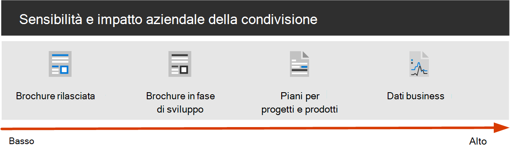
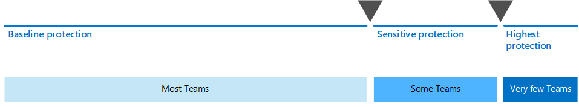

# Proteggere la collaborazione con Microsoft 365

Essere in grado di condividere facilmente le informazioni con gli utenti giusti impedendo la sovracondivisione è la chiave del successo di un'organizzazione. Questo include la possibilità di condividere i dati sensibili in modo sicuro solo con gli utenti che devono accedervi. A seconda del progetto, potrebbe essere possibile includere la condivisione di dati riservati con persone esterne all'organizzazione.

Questa guida per la soluzione include due componenti che consentono di:
- Distribuire Microsoft teams con il livello di protezione appropriato per ogni progetto
- Configurare la condivisione esterna con le impostazioni di sicurezza appropriate per ogni progetto

Se non sono disponibili strumenti di collaborazione versatili e di facile utilizzo, gli utenti spesso collaborano tramite la posta elettronica dei documenti. Si tratta di un metodo di collaborazione noioso e incline all'errore e può aumentare il rischio di una condivisione inadeguata delle informazioni. Se le informazioni sulla condivisione sono troppo difficili, è possibile ripristinare l'utilizzo di prodotti consumer non disciplinati da esso. Ciò può comportare un rischio ancora maggiore.

Con Microsoft 365, è possibile distribuire Team con una vasta gamma di configurazioni che consentono di:

- Proteggi la tua proprietà intellettuale
- Abilitare una collaborazione semplice
- Creare un equilibrio tra sicurezza e usabilità che aumenta la soddisfazione degli utenti e riduce il rischio di Shadow IT

La maggior parte delle organizzazioni ha diverse informazioni, con vari gradi di sensibilità e diversi livelli di impatto aziendale se le informazioni vengono condivise in modo inappropriato. A seconda della sensibilità di una determinata informazione, è possibile che si desideri consentire la condivisione con:

- Tutti gli utenti (non autenticati)
- Persone all'interno dell'organizzazione
- Persone specifiche all'interno dell'organizzazione
- Persone specifiche all'interno e all'esterno dell'organizzazione

Informazioni quali brochure di marketing sono destinate alla condivisione generale all'esterno dell'organizzazione. Le informazioni, ad esempio i menu di caffetteria non sono destinate alla condivisione esterna, ma non hanno un impatto aziendale se sono state condivise esternamente. Questi tipi di informazioni richiedono una protezione minima o minima.

Le stesse brochure di marketing, mentre in fase di sviluppo, possono essere condivise solo all'interno dell'organizzazione. In questo caso, è possibile che le impostazioni di condivisione predefinite dei team siano sufficienti.

Le informazioni relative a un nuovo prodotto in fase di sviluppo potrebbero essere considerate sensibili anche all'interno dell'organizzazione. Un maggiore grado di protezione potrebbe essere appropriato in questo caso. È possibile, ad esempio, limitare l'accesso a queste informazioni ai membri di un team specifico. A seconda del progetto, potrebbe essere necessario collaborare con persone esterne all'organizzazione, ad esempio un fornitore o un'organizzazione partner.

Le informazioni che sono fondamentali per il successo dell'organizzazione o che hanno requisiti di sicurezza o conformità rigorosi potrebbero richiedere livelli di protezione ancora maggiori.

Per tutti gli scenari descritti in alto, è possibile utilizzare Team di Microsoft teams per archiviare, condividere e collaborare alle informazioni. 

Per configurare Secure collabration, è possibile utilizzare le funzionalità e le funzionalità di Microsoft 365.

| Prodotto o componente | Capacità o funzionalità | Licenze |
|:-------|:-----|:-------|
| Microsoft Defender per Office 365 | Allegati sicuri per SPO, OneDrive e teams; Documenti attendibili; Collegamenti sicuri per i team    | Microsoft 365 E1, E3 ed E5 |
| SharePoint    | Criteri di condivisione siti e file, autorizzazioni di condivisione siti, collegamenti di condivisione, richieste di accesso, impostazioni di condivisione Guest site | Microsoft 365 E1, E3 ed E5 |
| Microsoft Teams   | Accesso guest, team privati, canali privati | Microsoft 365 E1, E3 ed E5 |
| Conformità di Microsoft 365  | Etichette di riservatezza    | Microsoft 365 E3 e E5 |

### Utilizzo di team per tutti i tipi di dati

Per gestire l'accesso alle informazioni con sensibilità diverse, sono stati sviluppati [tre diversi livelli di protezione per i team](configure-teams-three-tiers-protection.md). È possibile personalizzare uno qualsiasi di questi livelli per soddisfare al meglio le esigenze o la propria azienda. 

Questi livelli- *linee di base* , *sensibili* e *altamente sensibili* -aumentano gradualmente le protezioni che impediscono la sovracondivisione e la potenziale perdita di informazioni, come illustrato nella tabella seguente.

||**Livello di base**|**Livello di riservatezza**|**Livello estremamente riservato**|
|:--|:-----------|:------------|:-------------------|
|Team pubblico o privato|Sia|Private|Private|
|Condivisione non autenticata|Bloccato|Bloccato|Bloccato|
|Condivisione di file|Consentito|Consentito|Solo i proprietari del team possono condividerli.|
|Appartenenza al team|Tutti gli utenti possono partecipare a squadre pubbliche. Approvazione del proprietario del team per l'aggiunta di team privati.|Approvazione del proprietario del team necessaria per partecipare.|Approvazione del proprietario del team necessaria per partecipare.|
|Crittografia dei documenti|||Disponibile con etichetta di riservatezza|
|Condivisione con gli utenti guest|Consentito|Può essere consentito o bloccato|Può essere consentito o bloccato|
|Dispositivi non gestiti|Nessuna restrizione|Accesso solo Web|Bloccato|

La configurazione di questi livelli comporta quanto segue:

- Configurazione delle impostazioni in teams per l'accesso guest e i canali privati
- Configurazione delle impostazioni nel sito di SharePoint associato di un team per la condivisione interna e Guest, le richieste di accesso e i collegamenti di condivisione
- Per i livelli *sensibili* e *altamente sensibili* , configurare le etichette di riservatezza per classificare i team e controllare la condivisione Guest e l'accesso da dispositivi non gestiti
- Per il livello *estremamente riservato* , configurare un'etichetta di riservatezza per crittografare i documenti a cui è applicato

Iniziare con il livello di base e quindi aggiungere i team che utilizzano i livelli *sensibili* e *altamente sensibili* , se necessario, per proteggere le informazioni nell'organizzazione. Per iniziare, vedere le risorse seguenti:

- [Configurare team con la protezione di base](configure-teams-baseline-protection.md)
- [Configurare team con la protezione dei dati sensibili](configure-teams-sensitive-protection.md)
- [Configurare team con la protezione dei dati altamente sensibili](configure-teams-highly-sensitive-protection.md)

Se si dispone di un progetto estremamente riservato che richiede ulteriore protezione dalla condivisione anche all'interno dell'organizzazione, è possibile configurare un team che utilizza la propria etichetta di riservatezza per crittografare i file in modo che solo i membri del team possano leggerli. Per informazioni dettagliate, vedere [configurare un team con isolamento della sicurezza](secure-teams-security-isolation.md) .

### Condivisione con utenti esterni all'organizzazione

Potrebbe essere necessario [condividere informazioni di qualsiasi sensibilità con persone esterne all'organizzazione](collaborate-with-people-outside-your-organization.md). Questo potrebbe variare dalla condivisione di un singolo documento con una singola persona per collaborare a un progetto importante con un'organizzazione partner di grandi dimensioni o liberi professionisti di tutto il mondo. In Microsoft 365, questa gamma di condivisione esterna può essere svolta facilmente e con le misure di salvaguardia appropriate per proteggere le informazioni riservate.

Queste risorse consentono di iniziare a configurare l'ambiente per la collaborazione con persone esterne all'organizzazione:

- [Collaborare ai documenti](collaborate-on-documents.md) per la condivisione di singoli file di cartelle.
- [Collaborare in un sito](collaborate-in-site.md) per la collaborazione con gli utenti in un sito di SharePoint.
- [Collaborare come team](collaborate-as-team.md) per collaborare con gli ospiti di un team.

A seconda della sensibilità delle informazioni condivise, è possibile aggiungere misure di sicurezza per impedire la sovracondivisione. Queste risorse consentiranno di configurare le protezioni necessarie per l'organizzazione:

- [Procedure consigliate per la condivisione di file e cartelle con utenti non autenticati](best-practices-anonymous-sharing.md)
- [Limitare l'esposizione accidentale ai file durante la condivisione con persone esterne all'organizzazione](share-limit-accidental-exposure.md)
- [Creare un ambiente di condivisione guest sicuro](create-secure-guest-sharing-environment.md)

Se si dispone di un progetto importante con un'organizzazione partner, è possibile utilizzare la gestione dei diritti di Azure per gestire gli ospiti dall'organizzazione in un team configurato per il progetto. Per ulteriori informazioni, vedere [Create a B2B Extranet with Managed guests](b2b-extranet.md) .

## Distribuire la soluzione di collaborazione sicura

Quando si è pronti per la distribuzione di questa soluzione, procedere come segue:
1. Configurare i [tre diversi livelli di protezione per i team](configure-teams-three-tiers-protection.md).
2. Configurare le impostazioni per la [condivisione delle informazioni di qualsiasi sensibilità con gli utenti esterni all'organizzazione](collaborate-with-people-outside-your-organization.md).

## Vedere anche

[Documentazione sulla sicurezza di Microsoft 365](https://docs.microsoft.com/microsoft-365/security)

[Documentazione sulla conformità di Microsoft 365](https://docs.microsoft.com/microsoft-365/compliance)

[Benvenuto in Microsoft Teams](https://docs.microsoft.com/MicrosoftTeams/Teams-overview)
