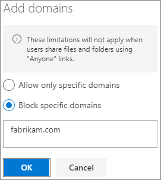

# Limitare l'esposizione accidentale ai file durante la condivisione con persone esterne all'organizzazioneLimit accidental exposure to files when sharing with people outside your organization

Quando si condividono file e cartelle con persone esterne all'organizzazione sono disponibili varie opzioni per ridurre le possibilità di condivisione accidentale di informazioni sensibili.When sharing files and folders with people outside your organization, there are a variety of options to reduce the chances of accidentally sharing sensitive information. È possibile scegliere tra le opzioni disponibili in questo articolo per soddisfare al meglio le esigenze dell'organizzazione.You can choose from the options in this article to best meet the needs of your organization.

## Usare le procedure consigliate per i collegamenti di tipo “Chiunque”Use best practices for Anyone links

Se le persone dell'organizzazione devono eseguire la condivisione non autenticata, ma si teme che il contenuto venga modificato da utenti non autenticati, vedere [Procedure consigliate per la condivisione non autenticata](best-practices-anonymous-sharing.md) per istruzioni su come gestire la condivisione non autenticata nell'organizzazione.If people in your organization need to do unauthenticated sharing, but you're concerned about unauthenticated people modifying content, read [Best practices for unauthenticated sharing](best-practices-anonymous-sharing.md) for guidance on how to work with unauthenticated sharing in your organization.

## Disattivare i collegamenti di tipo “Chiunque”Turn off Anyone links

È consigliabile lasciare abilitati i collegamenti di tipo *Chiunque* per il contenuto appropriato, perché è il modo più semplice per condividere informazioni e contribuisce a ridurre il rischio che gli utenti cerchino altre soluzioni fuori dal controllo del reparto IT.We recommend leaving *Anyone* links enabled for appropriate content because it's the easiest way to share and can help reduce the risk of users seeking other solutions that are outside the control of your IT department. I collegamenti di tipo *Chiunque* possono essere inoltrati ad altri, ma l'accesso ai file è disponibile solo per gli utenti che dispongono del collegamento.*Anyone* links can be forwarded to others, but file access is only available to those who have the link.

Se si vuole che le persone esterne all'organizzazione eseguano sempre l'autenticazione per accedere al contenuto di SharePoint, Groups o Teams, è possibile disattivare la condivisione *Chiunque*.If you always want people outside your organization to authenticate when accessing content in SharePoint, Groups, or Teams, you can turn off *Anyone* sharing. In questo modo si impedisce agli utenti di condividere il contenuto senza autenticazione.This will prevent users from unauthenticated sharing of content.

Se si disabilitano i collegamenti di tipo *Chiunque*, gli utenti potranno comunque condividerli facilmente con gli utenti guest utilizzando i collegamenti di tipo *Persone specifiche*.If you disable *Anyone* links, users can still easily share with guests using *Specific people* links. In questo caso, per poter accedere al contenuto condiviso, tutte le persone esterne all'organizzazione dovranno eseguire l'autenticazione.In this case, all people outside your organization will be required to authenticate before they can access the shared content.

In base alle proprie esigenze, è possibile disabilitare i collegamenti di tipo *Chiunque* per siti specifici o per l'intera organizzazione.Depending on your needs, you can disable *Anyone* links for specific sites, or for your whole organization.

Per disattivare i collegamenti di tipo *Chiunque* per l'organizzazioneTo turn off *Anyone* links for your organization
1. Nella parte sinistra dell'interfaccia di amministrazione di SharePoint, fare clic su **Condivisione**.In the SharePoint admin center, in the left navigation, click **Sharing**.
2. Impostare le impostazioni di condivisione esterna di SharePoint su **Utenti guest nuovi ed esistenti**.Set the SharePoint external sharing settings to **New and existing guests**.

   

3. Fare clic su **Salva**.Click **Save**.

Per disattivare i collegamenti di tipo *Chiunque* per un sitoTo turn off *Anyone* links for a site
1. Nella parte sinistra dell'interfaccia di amministrazione di SharePoint, espandere **Siti** e fare clic su **Siti attivi**.In the SharePoint admin center, in the left navigation, expand **Sites** and click **Active sites**.
2. Selezionare il sito che si vuole configurare.Select the site that you want to configure.
3. Sulla barra multifunzione fare clic su **Condivisione**.In the ribbon, click **Sharing**.
4. Verificare che la condivisione sia impostata su **Utenti guest nuovi ed esistenti**.Ensure that sharing is set to **New and existing guests**.

   

5. Se si apportano modifiche, fare clic su **Salva**.If you made changes, click **Save**.

## Filtro dominiDomain filtering

È possibile usare gli elenchi di domini consentiti o non consentiti per specificare i domini che gli utenti possono usare quando condividono con persone esterne all'organizzazione.You can use domain allow or deny lists to specify which domains your users can use when sharing with people outside your organization.

Con un elenco di domini consentiti è possibile specificare un elenco di domini in cui gli utenti dell'organizzazione possono condividere con persone esterne all'organizzazione.With an allow list, you can specify a list of domains where users in your organization can share with people outside your organization. La condivisione con altri domini è bloccata.Sharing with to other domains is blocked. Se l'organizzazione collabora solo con persone da un elenco di domini specifici, è possibile usare questa funzionalità per impedire la condivisione con altri domini.If your organization only collaborates with people from a list of specific domains, you can use this feature to prevent sharing with other domains.

Con un elenco di domini non consentiti è possibile specificare un elenco di domini da cui gli utenti dell'organizzazione non possono condividere con persone esterne all'organizzazione.With a deny list, you can specify a list of domains from which users in your organization cannot share with people outside your organization. La condivisione con i domini elencati è bloccata.Sharing with the listed domains is blocked. Questa opzione può essere utile, ad esempio, se si vuole impedire che alcuni concorrenti possano accedere a contenuto della propria organizzazione.This can be useful if you have competitors, for example, who you want to prevent from accessing content in your organization.

Gli elenchi di domini consentiti e non consentiti influiscono solo sulle condivisioni con utenti guest.The allow and deny lists only affect sharing with guests. Gli utenti possono continuare a condividere contenuti con persone da domini non consentiti tramite i collegamenti di tipo *Chiunque*, se questi non sono stati disabilitati.Users can still share with people from prohibited domains by using *Anyone* links if you haven't disabled them. Per ottenere risultati ottimali con gli elenchi di domini consentiti e non consentiti, è consigliabile disabilitare i collegamenti di tipo *Chiunque* come descritto sopra.For best results with domain allow and deny lists, consider disabling *Anyone* links as described above.

Per creare un elenco di domini consentiti o non consentitiTo set up a domain allow or deny list
1. Nella parte sinistra dell'interfaccia di amministrazione di SharePoint, fare clic su **Condivisione**.In the SharePoint admin center, in the left navigation, click **Sharing**.
2. In **Impostazioni avanzate per la condivisione esterna** selezionare la casella di controllo **Limitare la condivisione esterna in base al dominio**.Under **Advanced settings for external sharing**, select the **Limit external sharing by domain** check box.
3. Fare clic su **Aggiungi domini**.Click **Add domains**.
4. Selezionare se si vogliono bloccare i domini, digitare i domini e quindi fare clic su **OK**.Select whether you want to block domains, type the domains, and click **OK**.

   

5. Fare clic su **Salva**.Click **Save**.

Se si vuole limitare la condivisione in base al dominio a un livello superiore rispetto a SharePoint e OneDrive, è possibile [consentire o bloccare gli inviti agli utenti B2B da organizzazioni specifiche](/azure/active-directory/b2b/allow-deny-list) in Azure Active Directory.If you want to limit sharing by domain at a higher level than SharePoint and OneDrive, you can [allow or block invitations to B2B users from specific organizations](/azure/active-directory/b2b/allow-deny-list) in Azure Active Directory. (È necessario configurare l’[anteprima dell'integrazione di SharePoint e OneDrive con Azure AD B2B](/sharepoint/sharepoint-azureb2b-integration-preview) perché queste impostazioni influiscano su SharePoint e OneDrive.)(You must configure the [SharePoint and OneDrive integration with Azure AD B2B Preview](/sharepoint/sharepoint-azureb2b-integration-preview) for these settings to affect SharePoint and OneDrive.)

## Limitare la condivisione di file, cartelle e siti con persone esterne all'organizzazione a gruppi di sicurezza specificiLimit sharing of files, folders, and sites with people outside your organization to specified security groups

È possibile limitare la condivisione di file, cartelle e siti con persone esterne all'organizzazione ai membri di un gruppo di sicurezza specifico.You can restrict sharing of files, folders, and sites with people outside your organization to members of a specific security group. Questa opzione è utile se si vuole abilitare la condivisione esterna, ma con un flusso di lavoro di approvazione o un processo di richiesta.This is useful if you want to enable external sharing, but with an approval workflow or request process. In alternativa, è possibile richiedere agli utenti di completare un corso di formazione prima che vengano aggiunti al gruppo di sicurezza e sia consentita la condivisione esterna.Alternatively, you might require your users to complete a training course before they're added to the security group and are allowed to share externally.

Per limitare la condivisione esterna ai membri di un gruppo di sicurezzaTo limit external sharing to members of a security group
1. Nella parte sinistra dell'[interfaccia di amministrazione di SharePoint](https://admin.microsoft.com/sharepoint), in **Criteri**, fare clic su **Condivisione**.In the [SharePoint admin center](https://admin.microsoft.com/sharepoint), in the left navigation, under **Policies**, click **Sharing**.
2. In **Condivisione esterna**, espandere **Altre impostazioni condivisione esterna**.Under **External sharing**, expand **More external sharing settings**.

3. Selezionare **Consenti solo agli utenti di gruppi di sicurezza specifici di condividere esternamente** e quindi selezionare **Gestisci i gruppi di sicurezza**.Select **Allow only users in specific security groups to share externally**, and then select **Manage security groups**.

    

4. Nella casella **Aggiungi un gruppo di sicurezza** immettere un nome per un gruppo di sicurezza.In the **Add a security group** box, enter a name for a security group. Viene visualizzata la finestra del gruppo di sicurezza.The security group box appears.

5. Accanto al nome del gruppo di sicurezza, dall’elenco a discesa **Può condividere con** selezionare:Next to the security group name, from the **Can share with** dropdown, select either:

    - **Solo utenti autenticati** (impostazione predefinita)**Authenticated guests only** (default)
    - **Chiunque****Anyone**

6. Selezionare **Salva**.Select **Save**.

Si noti che questo influisce su file, cartelle e siti, ma non sui gruppi di Microsoft 365 o su Teams.Note that this affects files, folders, and sites, but not Microsoft 365 groups or Teams. Quando i membri invitano gli utenti guest a un gruppo di Microsoft 365 privato o a un team privato in Microsoft Teams, l'invito viene inviato al proprietario del gruppo o del team per l'approvazione.When members invite guests to a private Microsoft 365 group or a private team in Microsoft Teams, the invitation is sent to the group or team owner for approval.

## Vedere ancheSee Also

[Creare un ambiente di condivisione guest sicuroCreate a secure guest sharing environment](create-secure-guest-sharing-environment.md)

[Procedure consigliate per la condivisione di file e cartelle con utenti anonimiBest practices for sharing files and folders with anonymous users](best-practices-anonymous-sharing.md)