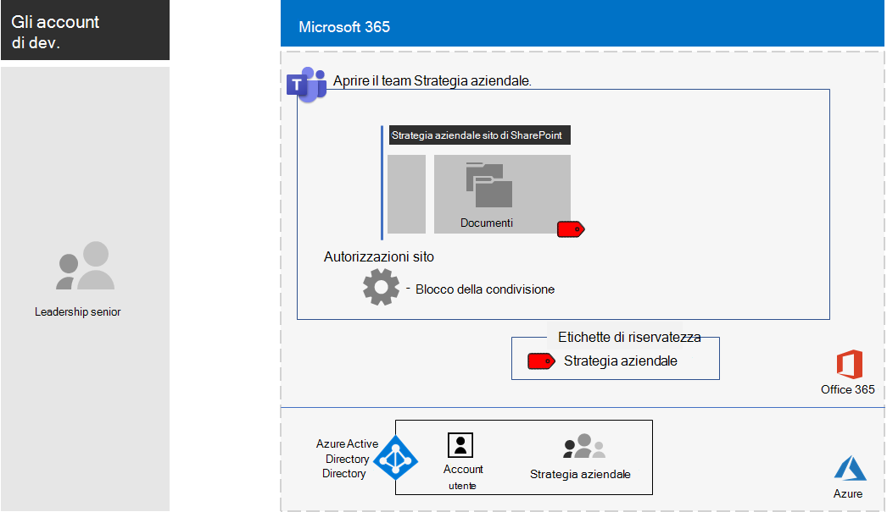

# <a name="configure-a-team-with-security-isolation-in-a-devtest-environment"></a><span data-ttu-id="e3b93-103">Configurare un team con l'isolamento di sicurezza in ambiente di sviluppo/test</span><span class="sxs-lookup"><span data-stu-id="e3b93-103">Configure a team with security isolation in a dev/test environment</span></span>

<span data-ttu-id="e3b93-104">Questo articolo fornisce istruzioni dettagliate per creare un [team con isolamento di sicurezza](secure-teams-security-isolation.md) in un ambiente di sviluppo/test.</span><span class="sxs-lookup"><span data-stu-id="e3b93-104">This article provides step-by-step instructions to create a [team with security isolation](secure-teams-security-isolation.md) in a dev/test environment.</span></span>



<span data-ttu-id="e3b93-106">Usare questo ambiente di sviluppo/test per sperimentare e perfezionare le impostazioni secondo le proprie necessità specifiche prima di distribuire questo tipo di team in produzione.</span><span class="sxs-lookup"><span data-stu-id="e3b93-106">Use this dev/test environment to experiment and fine-tune settings for your specific needs before deploying this type of team in production.</span></span>

## <a name="phase-1-build-out-your-microsoft-365-enterprise-test-environment"></a><span data-ttu-id="e3b93-107">Fase 1: Creare l'ambiente di testing di Microsoft 365 Enterprise</span><span class="sxs-lookup"><span data-stu-id="e3b93-107">Phase 1: Build out your Microsoft 365 Enterprise test environment</span></span>

<span data-ttu-id="e3b93-108">Se si desidera semplicemente testare i team sensibili ed estremamente riservati con i requisiti minimi, seguire le istruzioni in [Configurazione di base](../enterprise/lightweight-base-configuration-microsoft-365-enterprise.md).</span><span class="sxs-lookup"><span data-stu-id="e3b93-108">If you just want to test sensitive and highly sensitive teams in a lightweight way with the minimum requirements, follow the instructions in [Lightweight base configuration](../enterprise/lightweight-base-configuration-microsoft-365-enterprise.md).</span></span>

<span data-ttu-id="e3b93-109">Se si desidera testare i team sensibili ed estremamente riservati in un'organizzazione simulata, seguire le istruzioni in [Sincronizzazione dell'hash delle password](../enterprise/password-hash-sync-m365-ent-test-environment.md).</span><span class="sxs-lookup"><span data-stu-id="e3b93-109">If you want to test sensitive and highly sensitive teams in a simulated enterprise, follow the instructions in [Password hash synchronization](../enterprise/password-hash-sync-m365-ent-test-environment.md).</span></span>

> [!NOTE]
> <span data-ttu-id="e3b93-110">Il test di un team con isolamento di sicurezza non richiede l'ambiente di testing aziendale simulato, che include una rete Intranet simulata connessa a Internet e la sincronizzazione della directory per una foresta di Active Directory Domain Services (AD DS) attiva.</span><span class="sxs-lookup"><span data-stu-id="e3b93-110">Testing a team with security isolation does not require the simulated enterprise test environment, which includes a simulated intranet connected to the Internet and directory synchronization for an Active Directory Domain Services (AD DS) forest.</span></span> <span data-ttu-id="e3b93-111">Qui viene fornito come un'opzione in modo da poter testare un team con isolamento di sicurezza e sperimentarlo in un ambiente che rappresenta un'organizzazione tipica.</span><span class="sxs-lookup"><span data-stu-id="e3b93-111">It is provided here as an option so that you can test a team with security isolation and experiment with it in an environment that represents a typical organization.</span></span>

## <a name="phase-2-create-and-configure-your-azure-active-directory-azure-ad-group-and-users"></a><span data-ttu-id="e3b93-112">Fase 2: Creare e configurare i gruppi e gli utenti di Azure Active Directory (Azure AD)</span><span class="sxs-lookup"><span data-stu-id="e3b93-112">Phase 2: Create and configure your Azure Active Directory (Azure AD) group and users</span></span>

<span data-ttu-id="e3b93-113">In questa fase vengono creati e configurati i gruppi e gli utenti di Azure AD per l'organizzazione fittizia.</span><span class="sxs-lookup"><span data-stu-id="e3b93-113">In this phase, you create and configure an Azure AD group and users for your fictional organization.</span></span>

<span data-ttu-id="e3b93-114">Innanzitutto, creare un gruppo di sicurezza con il portale di Azure.</span><span class="sxs-lookup"><span data-stu-id="e3b93-114">First, create a security group with the Azure portal.</span></span>

1. <span data-ttu-id="e3b93-115">Creare una scheda separata nel browser e accedere al portale di Azure all'indirizzo [https://portal.azure.com](https://portal.azure.com).</span><span class="sxs-lookup"><span data-stu-id="e3b93-115">Create a separate tab in your browser, and then go to the Azure portal at [https://portal.azure.com](https://portal.azure.com).</span></span> <span data-ttu-id="e3b93-116">Se necessario, accedere con le credenziali dell'account amministratore globale dell'abbonamento a pagamento o di valutazione di Microsoft 365 E5.</span><span class="sxs-lookup"><span data-stu-id="e3b93-116">If needed, sign in with the credentials of the global administrator account for your Microsoft 365 E5 trial or paid subscription.</span></span>

2. <span data-ttu-id="e3b93-117">Nel portale di Azure fare clic su **Azure Active Directory > Gruppi**.</span><span class="sxs-lookup"><span data-stu-id="e3b93-117">In the Azure portal, click **Azure Active Directory > Groups**.</span></span>

3. <span data-ttu-id="e3b93-118">Nel pannello **Gruppi - Tutti i gruppi** fare clic su **+ Nuovo gruppo**.</span><span class="sxs-lookup"><span data-stu-id="e3b93-118">On the **Groups - All groups** blade, click **+ New group**.</span></span>

4. <span data-ttu-id="e3b93-119">Nel pannello **Gruppo**:</span><span class="sxs-lookup"><span data-stu-id="e3b93-119">On the **Group** blade:</span></span>

  - <span data-ttu-id="e3b93-120">Selezionare **Sicurezza** in **Tipo di gruppo**.</span><span class="sxs-lookup"><span data-stu-id="e3b93-120">Select **Security** in **Group type**.</span></span>

  - <span data-ttu-id="e3b93-121">Digitare **C-Suite** in **Nome**.</span><span class="sxs-lookup"><span data-stu-id="e3b93-121">Type **C-Suite** in **Name**.</span></span>

  - <span data-ttu-id="e3b93-122">Selezionare **Assegnato** in **Tipo di appartenenza**.</span><span class="sxs-lookup"><span data-stu-id="e3b93-122">Select **Assigned** in **Membership type**.</span></span>

5. <span data-ttu-id="e3b93-123">Fare clic su **Crea** e quindi chiudere il pannello **Gruppo**.</span><span class="sxs-lookup"><span data-stu-id="e3b93-123">Click **Create**, and then close the **Group** blade.</span></span>

<span data-ttu-id="e3b93-124">Quindi, configurare la licenza automatica in modo che i membri del nuovo gruppo **C-Suite** vengano assegnati automaticamente a una licenza di Microsoft 365 E5.</span><span class="sxs-lookup"><span data-stu-id="e3b93-124">Next, configure automatic licensing so that members of the new **C-Suite** group are automatically assigned a Microsoft 365 E5 license.</span></span>

1. <span data-ttu-id="e3b93-125">Nel portale di Azure fare clic su **Azure Active Directory > Licenze > Tutti i prodotti**.</span><span class="sxs-lookup"><span data-stu-id="e3b93-125">In the Azure portal, click **Azure Active Directory > Licenses > All products**.</span></span>

2. <span data-ttu-id="e3b93-126">Nell'elenco, selezionare **Microsoft 365 Enterprise E5**, quindi fare clic su **Assegna**.</span><span class="sxs-lookup"><span data-stu-id="e3b93-126">In the list, select **Microsoft 365 Enterprise E5**, and then click **Assign**.</span></span>

3. <span data-ttu-id="e3b93-127">Nel pannello **Assegnare licenza** fare clic su **Utenti e gruppi**.</span><span class="sxs-lookup"><span data-stu-id="e3b93-127">In the **Assign license** blade, click **Users and groups**.</span></span>

4. <span data-ttu-id="e3b93-128">Nell'elenco dei gruppi, selezionare il gruppo **C-Suite**.</span><span class="sxs-lookup"><span data-stu-id="e3b93-128">In the list of groups, select the **C-Suite** group.</span></span>

5. <span data-ttu-id="e3b93-129">Fare clic su **Seleziona**, quindi su **Assegna**.</span><span class="sxs-lookup"><span data-stu-id="e3b93-129">Click **Select**, and then click **Assign**.</span></span>

6. <span data-ttu-id="e3b93-130">Chiudere la scheda del portale di Azure nel browser.</span><span class="sxs-lookup"><span data-stu-id="e3b93-130">Close the Azure portal tab in your browser.</span></span>

<span data-ttu-id="e3b93-131">Quindi, [connettersi con il modulo di Azure Active Directory PowerShell per Graph](../enterprise/connect-to-microsoft-365-powershell.md#connect-with-the-azure-active-directory-powershell-for-graph-module).</span><span class="sxs-lookup"><span data-stu-id="e3b93-131">Next, [connect with the Azure Active Directory PowerShell for Graph module](../enterprise/connect-to-microsoft-365-powershell.md#connect-with-the-azure-active-directory-powershell-for-graph-module).</span></span>

<span data-ttu-id="e3b93-132">Inserire il nome dell'organizzazione, la posizione e una password comune; eseguire quindi questi comandi dal prompt dei comandi di PowerShell o Integrated Script Environment (ISE) per creare nuovi account utente e aggiungerli ai rispettivi gruppi C-Suite:</span><span class="sxs-lookup"><span data-stu-id="e3b93-132">Fill in your organization name, your location, and a common password, and then run these commands from the PowerShell command prompt or Integrated Script Environment (ISE) to create new user accounts and add them to the C-Suite group:</span></span>

```powershell
$orgName="<organization name, such as contoso-test for the contoso-test.onmicrosoft.com trial subscription domain name>"
$location="<the ISO ALPHA2 country code, such as US for the United States>"
$commonPassword="<common password for all the new accounts>"

$PasswordProfile=New-Object -TypeName Microsoft.Open.AzureAD.Model.PasswordProfile
$PasswordProfile.Password=$commonPassword

$groupName="C-Suite"
$userNames=@("CEO","CFO","CIO")
$groupID=(Get-AzureADGroup | Where { $_.DisplayName -eq $groupName }).ObjectID
ForEach ($element in $userNames){
New-AzureADUser -DisplayName $element -PasswordProfile $PasswordProfile -UserPrincipalName ($element + "@" + $orgName + ".onmicrosoft.com") -AccountEnabled $true -MailNickName $element -UsageLocation $location
Add-AzureADGroupMember -RefObjectId (Get-AzureADUser | Where { $_.DisplayName -eq $element }).ObjectID -ObjectId $groupID
}
```

> [!NOTE]
> <span data-ttu-id="e3b93-p103">L'utilizzo di una password comune in questo caso è per rendere automatica e facile la configurazione per un ambiente di sviluppo/test. Naturalmente, non è una scelta consigliata per le sottoscrizioni di produzione.</span><span class="sxs-lookup"><span data-stu-id="e3b93-p103">The use of a common password here is for automation and ease of configuration for a dev/test environment. Obviously, this is highly discouraged for production subscriptions.</span></span>

<span data-ttu-id="e3b93-135">Seguire questi passaggi per verificare che le licenze basate su gruppo funzionino correttamente.</span><span class="sxs-lookup"><span data-stu-id="e3b93-135">Use these steps to verify that group-based licensing is working correctly.</span></span>

1. <span data-ttu-id="e3b93-136">Accedere all'[interfaccia di amministrazione di Microsoft 365](https://admin.microsoft.com).</span><span class="sxs-lookup"><span data-stu-id="e3b93-136">Sign in to the [Microsoft 365 admin center](https://admin.microsoft.com).</span></span>

2. <span data-ttu-id="e3b93-137">Dalla nuova scheda **Interfaccia di amministrazione di Microsoft 365** del browser fare clic su **Utenti**.</span><span class="sxs-lookup"><span data-stu-id="e3b93-137">From the new **Microsoft 365 admin center** tab of your browser, click **Users**.</span></span>

3. <span data-ttu-id="e3b93-138">Fare clic su **CEO** nell'elenco degli utenti.</span><span class="sxs-lookup"><span data-stu-id="e3b93-138">In the list of users, click **CEO**.</span></span>

4. <span data-ttu-id="e3b93-139">Nel riquadro in cui sono elencate le proprietà dell'account utente **CEO** verificare che all'account sia stata assegnata la licenza **Microsoft 365 Enterprise E5** in **Licenze dei prodotti**.</span><span class="sxs-lookup"><span data-stu-id="e3b93-139">In the pane that lists the properties of the **CEO** user account, verify that it has been assigned the **Microsoft 365 Enterprise E5** license in **Product licenses**.</span></span>

## <a name="phase-3-create-your-team"></a><span data-ttu-id="e3b93-140">Fase 3: Creare il team</span><span class="sxs-lookup"><span data-stu-id="e3b93-140">Phase 3: Create your team</span></span>

<span data-ttu-id="e3b93-141">In questa fase, è possibile creare e si configurare un team con isolamento di sicurezza affinché i membri del team di dirigenti senior possano collaborare alla strategia aziendale.</span><span class="sxs-lookup"><span data-stu-id="e3b93-141">In this phase, you create and configure a team with security isolation for members of the senior leadership team to collaborate on company strategy.</span></span>

<span data-ttu-id="e3b93-142">Innanzitutto, abilitare i criteri di riservatezza per proteggere il contenuto in Microsoft Teams, gruppi di Office 365 e siti di SharePoint prima di procedere con i passaggi descritti in [questo articolo](../compliance/sensitivity-labels-teams-groups-sites.md).</span><span class="sxs-lookup"><span data-stu-id="e3b93-142">First, enable sensitivity labels to protect content in Microsoft Teams, Office 365 groups, and SharePoint sites before you proceed with the steps in [this article](../compliance/sensitivity-labels-teams-groups-sites.md).</span></span>

<span data-ttu-id="e3b93-143">Quindi, creare il team:</span><span class="sxs-lookup"><span data-stu-id="e3b93-143">Next, create the team:</span></span>

1. <span data-ttu-id="e3b93-144">In Teams fare clic su **Team** sul lato sinistro dell'app, quindi fare clic su **Partecipa o crea un team** in fondo all'elenco dei team.</span><span class="sxs-lookup"><span data-stu-id="e3b93-144">In Teams, click **Teams** on the left side of the app, then click **Join or create a team** at the bottom of the teams list.</span></span>
2. <span data-ttu-id="e3b93-145">Fare clic su **Crea team** (prima scheda nell'angolo in alto a sinistra).</span><span class="sxs-lookup"><span data-stu-id="e3b93-145">Click **Create team** (first card, top left corner).</span></span>
3. <span data-ttu-id="e3b93-146">Scegliere **Crea un team da zero**.</span><span class="sxs-lookup"><span data-stu-id="e3b93-146">Choose **Build a team from scratch**.</span></span>
4. <span data-ttu-id="e3b93-147">Nell'elenco **Riservatezza** mantenere l'impostazione predefinita.</span><span class="sxs-lookup"><span data-stu-id="e3b93-147">In the **Sensitivity** list, keep the default.</span></span>
5. <span data-ttu-id="e3b93-148">In **Privacy** fare clic su **Privato**.</span><span class="sxs-lookup"><span data-stu-id="e3b93-148">Under **Privacy**, click **Private**.</span></span>
6. <span data-ttu-id="e3b93-149">Digitare **Strategia aziendale**, quindi fare clic su **Crea** > **Chiudi**.</span><span class="sxs-lookup"><span data-stu-id="e3b93-149">Type **Company Strategy**, and then click **Create** > **Close**.</span></span>

<span data-ttu-id="e3b93-150">Quindi, limitare la creazione di canali privati ai proprietari del gruppo di strategia aziendale.</span><span class="sxs-lookup"><span data-stu-id="e3b93-150">Next, restrict the creation of private channels to owners of the Company Strategy group.</span></span>

1. <span data-ttu-id="e3b93-151">Nel team fare clic su **Altre opzioni** e quindi su **Gestisci team**.</span><span class="sxs-lookup"><span data-stu-id="e3b93-151">In the team, click **More options**, and then click **Manage team**.</span></span>
2. <span data-ttu-id="e3b93-152">Nella scheda **Impostazioni** espandere **Autorizzazioni dei membri**.</span><span class="sxs-lookup"><span data-stu-id="e3b93-152">On the **Settings** tab, expand **Member permissions**.</span></span>
3. <span data-ttu-id="e3b93-153">Deselezionare la casella di controllo **Consenti ai membri di creare canali privati**.</span><span class="sxs-lookup"><span data-stu-id="e3b93-153">Clear the **Allow members to create private channels** check box.</span></span>

<span data-ttu-id="e3b93-154">Quindi è necessario configurare un'etichetta di riservatezza con le impostazioni seguenti:</span><span class="sxs-lookup"><span data-stu-id="e3b93-154">Next, you need to configure a sensitivity label with the following settings:</span></span>

- <span data-ttu-id="e3b93-155">Il nome è Strategia aziendale</span><span class="sxs-lookup"><span data-stu-id="e3b93-155">The name is Company Strategy</span></span>
- <span data-ttu-id="e3b93-156">La crittografia è abilitata</span><span class="sxs-lookup"><span data-stu-id="e3b93-156">Encryption is enabled</span></span>
- <span data-ttu-id="e3b93-157">Il gruppo Strategia aziendale ha autorizzazioni di creazione condivisa</span><span class="sxs-lookup"><span data-stu-id="e3b93-157">The Company Strategy group has Co-Author permissions</span></span>

<span data-ttu-id="e3b93-158">Eseguire la procedura seguente:</span><span class="sxs-lookup"><span data-stu-id="e3b93-158">Follow these steps:</span></span>

1. <span data-ttu-id="e3b93-159">Aprire il [Centro conformità Microsoft 365](https://compliance.microsoft.com).</span><span class="sxs-lookup"><span data-stu-id="e3b93-159">Open the [Microsoft 365 compliance center](https://compliance.microsoft.com).</span></span>
2. <span data-ttu-id="e3b93-160">In **Soluzioni** fare clic su **Protezione delle informazioni**.</span><span class="sxs-lookup"><span data-stu-id="e3b93-160">Under **Solutions**, click **Information protection**.</span></span>
3. <span data-ttu-id="e3b93-161">Fare clic su **Crea un'etichetta**.</span><span class="sxs-lookup"><span data-stu-id="e3b93-161">Click **Create a label**.</span></span>
4. <span data-ttu-id="e3b93-162">Digitare **Strategia aziendale** come nome dell'etichetta.</span><span class="sxs-lookup"><span data-stu-id="e3b93-162">Type **Company Strategy** for the label name.</span></span>
5. <span data-ttu-id="e3b93-163">Digitare **Documenti di strategia aziendale di dirigenti senior** come descrizione comando, quindi fare clic su **Avanti**.</span><span class="sxs-lookup"><span data-stu-id="e3b93-163">Type **Senior leadership company strategy documents** as the tool tip, and then click **Next**.</span></span>
6. <span data-ttu-id="e3b93-164">Nella pagina **Crittografia** scegliere **Applica** nell'elenco a discesa **Crittografia**.</span><span class="sxs-lookup"><span data-stu-id="e3b93-164">On the **Encryption** page, in the **Encryption** dropdown, choose **Apply**.</span></span>
7. <span data-ttu-id="e3b93-165">Per aggiungere le autorizzazioni del team:</span><span class="sxs-lookup"><span data-stu-id="e3b93-165">To add the team permissions:</span></span><br>
  <span data-ttu-id="e3b93-166">a.</span><span class="sxs-lookup"><span data-stu-id="e3b93-166">a.</span></span> <span data-ttu-id="e3b93-167">Fare clic su **Assegna autorizzazioni**.</span><span class="sxs-lookup"><span data-stu-id="e3b93-167">Click **Assign permissions**.</span></span><br>
  <span data-ttu-id="e3b93-168">b.</span><span class="sxs-lookup"><span data-stu-id="e3b93-168">b.</span></span> <span data-ttu-id="e3b93-169">Fare clic su **Aggiungi utenti o gruppi**, selezionare **Strategia aziendale**, quindi fare clic su **Aggiungi**.</span><span class="sxs-lookup"><span data-stu-id="e3b93-169">Click **Add users or groups**, select **Company Strategy**, and then click **Add**.</span></span><br>
  <span data-ttu-id="e3b93-170">c.</span><span class="sxs-lookup"><span data-stu-id="e3b93-170">c.</span></span> <span data-ttu-id="e3b93-171">Fare clic su **Seleziona autorizzazioni**.</span><span class="sxs-lookup"><span data-stu-id="e3b93-171">Click **Choose permissions**.</span></span><br>
  <span data-ttu-id="e3b93-172">d.</span><span class="sxs-lookup"><span data-stu-id="e3b93-172">d.</span></span> <span data-ttu-id="e3b93-173">Scegliere **Coautore** nell'elenco a discesa, quindi fare clic su **Salva**.</span><span class="sxs-lookup"><span data-stu-id="e3b93-173">Choose **Co-Author** from the dropdown list, and then click **Save**.</span></span><br>
8. <span data-ttu-id="e3b93-174">Fare clic su **Avanti**.</span><span class="sxs-lookup"><span data-stu-id="e3b93-174">Click **Next**.</span></span>
9. <span data-ttu-id="e3b93-175">Nella pagina **Contrassegno contenuti** fare clic su **Avanti**.</span><span class="sxs-lookup"><span data-stu-id="e3b93-175">On the **Content marking** page, click **Next**.</span></span>
10. <span data-ttu-id="e3b93-176">Nella pagina **Impostazioni sito e gruppo** impostare **Impostazioni sito e gruppo** su **Sì**.</span><span class="sxs-lookup"><span data-stu-id="e3b93-176">On the **Site and group settings** page, set **Site and group settings** to **On**.</span></span>
11. <span data-ttu-id="e3b93-177">Nell'elenco a discesa **Privacy dei siti dei team collegati ai gruppi di Office 365** scegliere **Privato: solo i membri possono accedere al sito**.</span><span class="sxs-lookup"><span data-stu-id="e3b93-177">In the **Privacy of Office 365 group-connected team sites** dropdown, choose **Private - only members can access the site**.</span></span>
12. <span data-ttu-id="e3b93-178">In **Dispositivi non gestiti** scegliere **Blocca l'accesso**.</span><span class="sxs-lookup"><span data-stu-id="e3b93-178">Under **Unmanaged devices**, choose **Block access**.</span></span>
13. <span data-ttu-id="e3b93-179">Fare clic su **Avanti**.</span><span class="sxs-lookup"><span data-stu-id="e3b93-179">Click **Next**.</span></span>
14. <span data-ttu-id="e3b93-180">Nella pagina **Applicazione automatica di etichette per le app di Office** fare clic su **Avanti**.</span><span class="sxs-lookup"><span data-stu-id="e3b93-180">On the **Auto-labeling for Office apps** page, click **Next**.</span></span>
15. <span data-ttu-id="e3b93-181">Fare clic su **Invia**, quindi su **Fine**.</span><span class="sxs-lookup"><span data-stu-id="e3b93-181">Click **Submit**, and then click **Done**.</span></span>

<span data-ttu-id="e3b93-182">In seguito, pubblicare la nuova etichetta seguendo questi passaggi:</span><span class="sxs-lookup"><span data-stu-id="e3b93-182">Next, publish the new label with these steps:</span></span>

1. <span data-ttu-id="e3b93-183">Nella pagina **Protezione delle informazioni** del Centro conformità Microsoft 365 scegliere la scheda **Criteri delle etichette**.</span><span class="sxs-lookup"><span data-stu-id="e3b93-183">In the Microsoft 365 compliance center, on the **Information protection** page, choose the **Label policies** tab.</span></span>
2. <span data-ttu-id="e3b93-184">Fare clic su **Pubblica etichette**.</span><span class="sxs-lookup"><span data-stu-id="e3b93-184">Click **Publish labels**.</span></span>
3. <span data-ttu-id="e3b93-185">Nella pagina **Scegliere le etichette di riservatezza da pubblicare** fare clic **Scegliere le etichette di riservatezza da pubblicare**.</span><span class="sxs-lookup"><span data-stu-id="e3b93-185">On the **Choose sensitivity labels to publish** page, click **Choose sensitivity labels to publish**.</span></span>
4. <span data-ttu-id="e3b93-186">Digitare **Strategia aziendale**, quindi fare clic su **Aggiungi**.</span><span class="sxs-lookup"><span data-stu-id="e3b93-186">Select **Company Strategy**, and then click **Add**.</span></span>
5. <span data-ttu-id="e3b93-187">Fare clic su **Avanti**.</span><span class="sxs-lookup"><span data-stu-id="e3b93-187">Click **Next**.</span></span>
6. <span data-ttu-id="e3b93-188">Nella pagina **Pubblicare per utenti e gruppi** fare clic su **Scegli utenti e gruppi**.</span><span class="sxs-lookup"><span data-stu-id="e3b93-188">On the **Publish to users and groups** page, click **Choose users and groups**.</span></span>
7. <span data-ttu-id="e3b93-189">Fare clic su **Aggiungi** e quindi selezionare **Strategia aziendale**.</span><span class="sxs-lookup"><span data-stu-id="e3b93-189">Click **Add**, and then select **Company Strategy**.</span></span>
8. <span data-ttu-id="e3b93-190">Fare clic su **Aggiungi**, quindi su **Fine**.</span><span class="sxs-lookup"><span data-stu-id="e3b93-190">Click **Add**, and then click **Done**.</span></span>
9. <span data-ttu-id="e3b93-191">Fare clic su **Avanti**.</span><span class="sxs-lookup"><span data-stu-id="e3b93-191">Click **Next**.</span></span>
10. <span data-ttu-id="e3b93-192">Nella pagina Impostazioni dei criteri selezionare la casella di controllo **Gli utenti devono fornire una giustificazione per la rimozione di un'etichetta o la riduzione di un livello di classificazione** e quindi fare clic su **Avanti**.</span><span class="sxs-lookup"><span data-stu-id="e3b93-192">On the Policy settings page, select the **Users must provide justification to remove a label or lower classification label** check box, and then click **Next**.</span></span>
11. <span data-ttu-id="e3b93-193">Digitare **Strategia aziendale** come nome del criterio, quindi fare clic su **Avanti**.</span><span class="sxs-lookup"><span data-stu-id="e3b93-193">Type **Company Strategy** for the policy name, and then click **Next**.</span></span>
12. <span data-ttu-id="e3b93-194">Fare clic su **Invia**, quindi su **Fine**.</span><span class="sxs-lookup"><span data-stu-id="e3b93-194">Click **Submit** and then click **Done**.</span></span>

<span data-ttu-id="e3b93-195">L'etichetta **Strategia aziendale** potrebbe essere disponibile qualche tempo dopo la pubblicazione.</span><span class="sxs-lookup"><span data-stu-id="e3b93-195">It may take some time for the **Company Strategy** label to become available after it's been published.</span></span>

<span data-ttu-id="e3b93-196">Successivamente, applicare la nuova etichetta al team **Strategia aziendale** e aggiornare il tipo di collegamento di condivisione predefinito per ridurre il rischio di condivisione accidentale di file e cartelle con un gruppo di destinatari più ampio del previsto.</span><span class="sxs-lookup"><span data-stu-id="e3b93-196">Next, apply your new label to the **Company Strategy** team and update the default sharing link type to reduce the risk of accidentally sharing files and folders to a wider audience than intended.</span></span>

1. <span data-ttu-id="e3b93-197">Aprire l'[interfaccia di amministrazione di SharePoint](https://admin.microsoft.com/sharepoint).</span><span class="sxs-lookup"><span data-stu-id="e3b93-197">Open the [SharePoint admin center](https://admin.microsoft.com/sharepoint).</span></span>
2. <span data-ttu-id="e3b93-198">In **Siti** fare clic su **Siti attivi**.</span><span class="sxs-lookup"><span data-stu-id="e3b93-198">Under **Sites**, click **Active sites**.</span></span>
3. <span data-ttu-id="e3b93-199">Fare clic sul sito **Strategia aziendale**.</span><span class="sxs-lookup"><span data-stu-id="e3b93-199">Click the **Company Strategy** site.</span></span>
4. <span data-ttu-id="e3b93-200">Nella scheda **Criteri**, in **Riservatezza** fare clic su **Modifica**.</span><span class="sxs-lookup"><span data-stu-id="e3b93-200">On the **Policies** tab, under **Sensitivity**, click **Edit**.</span></span>
5. <span data-ttu-id="e3b93-201">Selezionare l'etichetta **Strategia aziendale** e quindi fare clic su **Salva**.</span><span class="sxs-lookup"><span data-stu-id="e3b93-201">Select the **Company Strategy** label, and then click **Save**.</span></span>
6. <span data-ttu-id="e3b93-202">Nella scheda **Criteri**, in **Condivisione esterna** fare clic su **Modifica**.</span><span class="sxs-lookup"><span data-stu-id="e3b93-202">On the **Policies** tab, under **External sharing**, click **Edit**.</span></span>
5. <span data-ttu-id="e3b93-203">Scegliere **Solo persone nell'organizzazione**.</span><span class="sxs-lookup"><span data-stu-id="e3b93-203">Choose **Only people in your organization**.</span></span>
6. <span data-ttu-id="e3b93-204">In Tipo di collegamento di **condivisione predefinito** deselezionare la casella di controllo **Uguale all'impostazione a livello di organizzazione** e selezionare **Persone con accesso esistente**.</span><span class="sxs-lookup"><span data-stu-id="e3b93-204">Under **Default sharing** link type, clear the **Same as organization-level setting** check box, and select **People with existing access**.</span></span>
7. <span data-ttu-id="e3b93-205">Fare clic su **Salva**.</span><span class="sxs-lookup"><span data-stu-id="e3b93-205">Click **Save**.</span></span>

<span data-ttu-id="e3b93-206">Quindi, configurare la condivisione del sito solo per i proprietari per il team **Strategia aziendale**.</span><span class="sxs-lookup"><span data-stu-id="e3b93-206">Next, configure owners-only site sharing for the **Company Strategy** team.</span></span>

1. <span data-ttu-id="e3b93-207">In Teams passare alla scheda **Generale** del team **Strategia aziendale**.</span><span class="sxs-lookup"><span data-stu-id="e3b93-207">In Teams, navigate to the **General** tab of the **Company Strategy** team.</span></span>
2. <span data-ttu-id="e3b93-208">Nella barra degli strumenti per il team fare clic su **File**.</span><span class="sxs-lookup"><span data-stu-id="e3b93-208">In the tool bar for the team, click **Files**.</span></span>
3. <span data-ttu-id="e3b93-209">Fare clic sui puntini di sospensione, quindi selezionare **Apri in SharePoint**.</span><span class="sxs-lookup"><span data-stu-id="e3b93-209">Click the ellipsis, and then click **Open in SharePoint**.</span></span>
4. <span data-ttu-id="e3b93-210">Nella barra degli strumenti del sito di SharePoint sottostante fare clic sull'icona delle impostazioni, quindi su **Autorizzazioni sito**.</span><span class="sxs-lookup"><span data-stu-id="e3b93-210">In the tool bar of the underlying SharePoint site, click the settings icon, and then click **Site permissions**.</span></span>
5. <span data-ttu-id="e3b93-211">Nel riquadro Autorizzazioni, in **Condivisione sito**, fare clic su **Modifica il metodo di condivisione dei membri**.</span><span class="sxs-lookup"><span data-stu-id="e3b93-211">In the Site permissions pane, under **Site Sharing**, click **Change how members can share**.</span></span>
6. <span data-ttu-id="e3b93-212">In **Impostazioni di condivisione** scegliere **Solo i proprietari del sito possono condividere file, cartelle e il sito**, quindi fare clic su **Salva**.</span><span class="sxs-lookup"><span data-stu-id="e3b93-212">Under **Sharing permissions**, choose **Only site owners can share files, folders, and the site**, and then click **Save**.</span></span>
7. <span data-ttu-id="e3b93-213">Chiudere i riquadri **Autorizzazioni** e **Impostazioni**.</span><span class="sxs-lookup"><span data-stu-id="e3b93-213">Close the **Permissions** and **Settings** panes.</span></span>

<span data-ttu-id="e3b93-214">Se si accede come membro del gruppo Strategia aziendale, sarà possibile visualizzare **Strategia aziendale** nell'opzione **Riservatezza** nella barra degli strumenti Home di Word, Excel e PowerPoint.</span><span class="sxs-lookup"><span data-stu-id="e3b93-214">If you sign in as a member of the Company Strategy group, you will see **Company Strategy** in the **Sensitivity** option in the Home toolbar of Word, Excel, and PowerPoint.</span></span> <span data-ttu-id="e3b93-215">Selezionare l'etichetta **Strategia aziendale** dall'opzione **Riservatezza** per assegnare l'etichetta a un file.</span><span class="sxs-lookup"><span data-stu-id="e3b93-215">Select the **Company Strategy** label from the **Sensitivity** option to assign the label to a file.</span></span>

<span data-ttu-id="e3b93-216">Ecco la configurazione ottenuta per il team Strategia aziendale.</span><span class="sxs-lookup"><span data-stu-id="e3b93-216">Here is the resulting configuration for the Company Strategy team.</span></span>


## <a name="next-step"></a><span data-ttu-id="e3b93-218">Passaggio successivo</span><span class="sxs-lookup"><span data-stu-id="e3b93-218">Next step</span></span>

<span data-ttu-id="e3b93-219">Quando si è pronti per la distribuzione di produzione, vedere le [istruzioni di configurazione](secure-teams-security-isolation.md).</span><span class="sxs-lookup"><span data-stu-id="e3b93-219">When you're ready for production deployment, see these [configuration instructions](secure-teams-security-isolation.md).</span></span>
