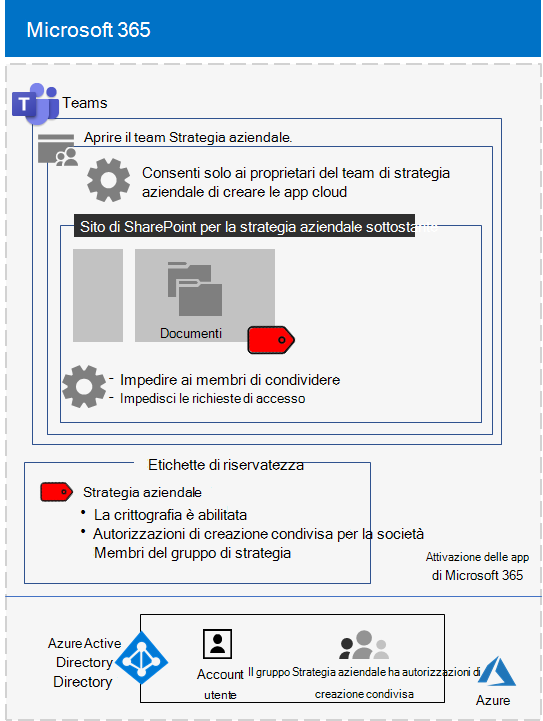

# <a name="configure-a-team-with-security-isolation-in-a-devtest-environment"></a>Configurare un team con l'isolamento di sicurezza in ambiente di sviluppo/test

Questo articolo fornisce istruzioni dettagliate per creare un [team con isolamento di sicurezza](secure-teams-security-isolation.md) in un ambiente di sviluppo/test.



Usare questo ambiente di sviluppo/test per sperimentare e perfezionare le impostazioni secondo le proprie necessità specifiche prima di distribuire questo tipo di team in produzione.
  
## <a name="phase-1-build-out-your-microsoft-365-enterprise-test-environment"></a>Fase 1: Creare l'ambiente di testing di Microsoft 365 Enterprise

Se si desidera semplicemente testare i team sensibili ed estremamente riservati con i requisiti minimi, seguire le istruzioni in [Configurazione di base](../enterprise/lightweight-base-configuration-microsoft-365-enterprise.md).

Se si desidera testare i team sensibili ed estremamente riservati in un'organizzazione simulata, seguire le istruzioni in [Sincronizzazione dell'hash delle password](../enterprise/password-hash-sync-m365-ent-test-environment.md).

>[!Note]
>Il test di un team con isolamento di sicurezza non richiede l'ambiente di testing aziendale simulato, che include una rete Intranet simulata connessa a Internet e la sincronizzazione della directory per una foresta di Active Directory Domain Services (AD DS) attiva. Qui viene fornito come un'opzione in modo da poter testare un team con isolamento di sicurezza e sperimentarlo in un ambiente che rappresenta un'organizzazione tipica.
>
    
## <a name="phase-2-create-and-configure-your-azure-active-directory-azure-ad-group-and-users"></a>Fase 2: Creare e configurare i gruppi e gli utenti di Azure Active Directory (Azure AD)

In questa fase vengono creati e configurati i gruppi e gli utenti di Azure AD per l'organizzazione fittizia.
  
Innanzitutto, creare un gruppo di sicurezza con il portale di Azure.
  
1. Creare una scheda separata nel browser e accedere al portale di Azure all'indirizzo [https://portal.azure.com](https://portal.azure.com). Se necessario, accedere con le credenziali dell'account amministratore globale dell'abbonamento a pagamento o di valutazione di Microsoft 365 E5.
    
2. Nel portale di Azure fare clic su **Azure Active Directory > Gruppi**.
    
3. Nel pannello **Gruppi - Tutti i gruppi** fare clic su **+ Nuovo gruppo**.
    
4. Nel pannello **Gruppo**:
    
  - Selezionare **Sicurezza** in **Tipo di gruppo**.
    
  - Digitare **C-Suite** in **Nome**.
    
  - Selezionare **Assegnato** in **Tipo di appartenenza**.
      
5. Fare clic su **Crea** e quindi chiudere il pannello **Gruppo**.
    
Quindi, configurare la licenza automatica in modo che i membri del nuovo gruppo **C-Suite** vengano assegnati automaticamente a una licenza di Microsoft 365 E5.
  
1. Nel portale di Azure fare clic su **Azure Active Directory > Licenze > Tutti i prodotti**.
    
2. Nell'elenco, selezionare **Microsoft 365 Enterprise E5**, quindi fare clic su **Assegna**.
    
3. Nel pannello **Assegnare licenza** fare clic su **Utenti e gruppi**.
    
4. Nell'elenco dei gruppi, selezionare il gruppo **C-Suite**.
    
5. Fare clic su **Seleziona**, quindi su **Assegna**.
    
6. Chiudere la scheda del portale di Azure nel browser.
    
Quindi, [connettersi con il modulo di Azure Active Directory PowerShell per Graph](../enterprise/connect-to-microsoft-365-powershell.md#connect-with-the-azure-active-directory-powershell-for-graph-module).
  
Inserire il nome dell'organizzazione, la posizione e una password comune; eseguire quindi questi comandi dal prompt dei comandi di PowerShell o Integrated Script Environment (ISE) per creare nuovi account utente e aggiungerli ai rispettivi gruppi C-Suite:
  
```powershell
$orgName="<organization name, such as contoso-test for the contoso-test.onmicrosoft.com trial subscription domain name>"
$location="<the ISO ALPHA2 country code, such as US for the United States>"
$commonPassword="<common password for all the new accounts>"

$PasswordProfile=New-Object -TypeName Microsoft.Open.AzureAD.Model.PasswordProfile
$PasswordProfile.Password=$commonPassword

$groupName="C-Suite"
$userNames=@("CEO","CFO","CIO") 
$groupID=(Get-AzureADGroup | Where { $_.DisplayName -eq $groupName }).ObjectID
ForEach ($element in $userNames){ 
New-AzureADUser -DisplayName $element -PasswordProfile $PasswordProfile -UserPrincipalName ($element + "@" + $orgName + ".onmicrosoft.com") -AccountEnabled $true -MailNickName $element -UsageLocation $location 
Add-AzureADGroupMember -RefObjectId (Get-AzureADUser | Where { $_.DisplayName -eq $element }).ObjectID -ObjectId $groupID
}
```

> [!NOTE]
> L'uso di una password comune qui consente l'automazione e agevola la configurazione per un ambiente di sviluppo e test. Ovviamente, questo approccio è sconsigliato per le sottoscrizioni di produzione. 
  
Seguire questi passaggi per verificare che le licenze basate su gruppo funzionino correttamente.
  
1. Accedere all'[interfaccia di amministrazione di Microsoft 365](https://admin.microsoft.com).
    
2. Dalla nuova scheda **Interfaccia di amministrazione di Microsoft 365** del browser fare clic su **Utenti**.
    
3. Fare clic su **CEO** nell'elenco degli utenti.
    
4. Nel riquadro in cui sono elencate le proprietà dell'account utente **CEO** verificare che all'account sia stata assegnata la licenza **Microsoft 365 Enterprise E5** in **Licenze dei prodotti**.
    
## <a name="phase-3-create-your-team"></a>Fase 3: Creare il team

In questa fase, è possibile creare e si configurare un team con isolamento di sicurezza affinché i membri del team di dirigenti senior possano collaborare alla strategia aziendale.

Innanzitutto, abilitare i criteri di riservatezza per proteggere il contenuto in Microsoft Teams, gruppi di Office 365 e siti di SharePoint prima di procedere con i passaggi descritti in [questo articolo](../compliance/sensitivity-labels-teams-groups-sites.md).

Quindi, creare il team:

1. In Teams fare clic su **Team** sul lato sinistro dell'app, quindi fare clic su **Partecipa o crea un team** in fondo all'elenco dei team.
2. Fare clic su **Crea team** (prima scheda nell'angolo in alto a sinistra).
3. Scegliere **Crea un team da zero**.
4. Nell'elenco **Riservatezza** mantenere l'impostazione predefinita.
5. In **Privacy** fare clic su **Privato**.
6. Digitare **Strategia aziendale**, quindi fare clic su **Crea** > **Chiudi**.

Quindi, limitare la creazione di canali privati ai proprietari del gruppo di strategia aziendale.

1. Nel team fare clic su **Altre opzioni** e quindi su **Gestisci team**.
2. Nella scheda **Impostazioni** espandere **Autorizzazioni dei membri**.
3. Deselezionare la casella di controllo **Consenti ai membri di creare canali privati**.

Quindi è necessario configurare un'etichetta di riservatezza con le impostazioni seguenti:

- Il nome è Strategia aziendale
- La crittografia è abilitata
- Il gruppo Strategia aziendale ha autorizzazioni di creazione condivisa

Eseguire la procedura seguente:

1. Aprire il [Centro conformità Microsoft 365](https://compliance.microsoft.com).
2. In **Soluzioni** fare clic su **Protezione delle informazioni**.
3. Fare clic su **Crea un'etichetta**.
4. Digitare **Strategia aziendale** come nome dell'etichetta.
5. Digitare **Documenti di strategia aziendale di dirigenti senior** come descrizione comando, quindi fare clic su **Avanti**.
6. Nella pagina **Crittografia** scegliere **Applica** nell'elenco a discesa **Crittografia**.
7. Per aggiungere le autorizzazioni del team:<br>
  a. Fare clic su **Assegna autorizzazioni**.<br>
  b. Fare clic su **Aggiungi utenti o gruppi**, selezionare **Strategia aziendale**, quindi fare clic su **Aggiungi**.<br>
  c. Fare clic su **Seleziona autorizzazioni**.<br>
  d. Scegliere **Coautore** nell'elenco a discesa, quindi fare clic su **Salva**.<br>
8. Fare clic su **Avanti**.
9. Nella pagina **Contrassegno contenuti** fare clic su **Avanti**.
10. Nella pagina **Impostazioni sito e gruppo** impostare **Impostazioni sito e gruppo** su **Sì**.
11. Nell'elenco a discesa **Privacy dei siti dei team collegati ai gruppi di Office 365** scegliere **Privato: solo i membri possono accedere al sito**.
12. In **Dispositivi non gestiti** scegliere **Blocca l'accesso**.
13. Fare clic su **Avanti**.
14. Nella pagina **Applicazione automatica di etichette per le app di Office** fare clic su **Avanti**.
15. Fare clic su **Invia**, quindi su **Fine**.

In seguito, pubblicare la nuova etichetta seguendo questi passaggi: 

1. Nella pagina **Protezione delle informazioni** del Centro conformità Microsoft 365 scegliere la scheda **Criteri delle etichette**.
2. Fare clic su **Pubblica etichette**.
3. Nella pagina **Scegliere le etichette di riservatezza da pubblicare** fare clic **Scegliere le etichette di riservatezza da pubblicare**.
4. Digitare **Strategia aziendale**, quindi fare clic su **Aggiungi**.
5. Fare clic su **Avanti**.
6. Nella pagina **Pubblicare per utenti e gruppi** fare clic su **Scegli utenti e gruppi**.
7. Fare clic su **Aggiungi** e quindi selezionare **Strategia aziendale**.
8. Fare clic su **Aggiungi**, quindi su **Fine**.
9. Fare clic su **Avanti**.
10. Nella pagina Impostazioni dei criteri selezionare la casella di controllo **Gli utenti devono fornire una giustificazione per la rimozione di un'etichetta o la riduzione di un livello di classificazione** e quindi fare clic su **Avanti**.
11. Digitare **Strategia aziendale** come nome del criterio, quindi fare clic su **Avanti**.
12. Fare clic su **Invia**, quindi su **Fine**.

L'etichetta **Strategia aziendale** potrebbe essere disponibile qualche tempo dopo la pubblicazione.

Successivamente, applicare la nuova etichetta al team **Strategia aziendale** e aggiornare il tipo di collegamento di condivisione predefinito per ridurre il rischio di condivisione accidentale di file e cartelle con un gruppo di destinatari più ampio del previsto. 

1. Aprire l'[interfaccia di amministrazione di SharePoint](https://admin.microsoft.com/sharepoint).
2. In **Siti** fare clic su **Siti attivi**.
3. Fare clic sul sito **Strategia aziendale**.
4. Nella scheda **Criteri**, in **Riservatezza** fare clic su **Modifica**.
5. Selezionare l'etichetta **Strategia aziendale** e quindi fare clic su **Salva**.
6. Nella scheda **Criteri**, in **Condivisione esterna** fare clic su **Modifica**.
5. Scegliere **Solo persone nell'organizzazione**.
6. In Tipo di collegamento di **condivisione predefinito** deselezionare la casella di controllo **Uguale all'impostazione a livello di organizzazione** e selezionare **Persone con accesso esistente**.
7. Fare clic su **Salva**.

Quindi, configurare la condivisione del sito solo per i proprietari per il team **Strategia aziendale**.

1. In Teams passare alla scheda **Generale** del team **Strategia aziendale**.
2. Nella barra degli strumenti per il team fare clic su **File**.
3. Fare clic sui puntini di sospensione, quindi selezionare **Apri in SharePoint**.
4. Nella barra degli strumenti del sito di SharePoint sottostante fare clic sull'icona delle impostazioni, quindi su **Autorizzazioni sito**.
5. Nel riquadro Autorizzazioni, in **Condivisione sito**, fare clic su **Modifica il metodo di condivisione dei membri**.
6. In **Impostazioni di condivisione** scegliere **Solo i proprietari del sito possono condividere file, cartelle e il sito**, quindi fare clic su **Salva**.
7. Chiudere i riquadri **Autorizzazioni** e **Impostazioni**.

Se si accede come membro del gruppo Strategia aziendale, sarà possibile visualizzare **Strategia aziendale** nell'opzione **Riservatezza** nella barra degli strumenti Home di Word, Excel e PowerPoint. Selezionare l'etichetta **Strategia aziendale** dall'opzione **Riservatezza** per assegnare l'etichetta a un file.

Ecco la configurazione ottenuta per il team Strategia aziendale.


## <a name="next-step"></a>Passaggio successivo

Quando si è pronti per la distribuzione di produzione, vedere le [istruzioni di configurazione](secure-teams-security-isolation.md).
