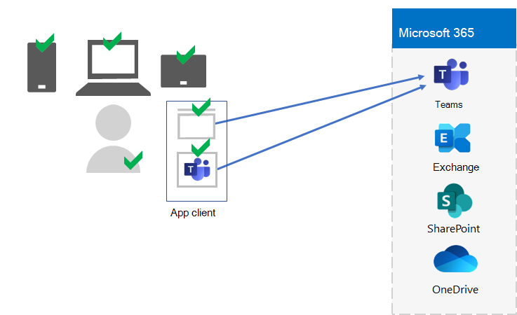
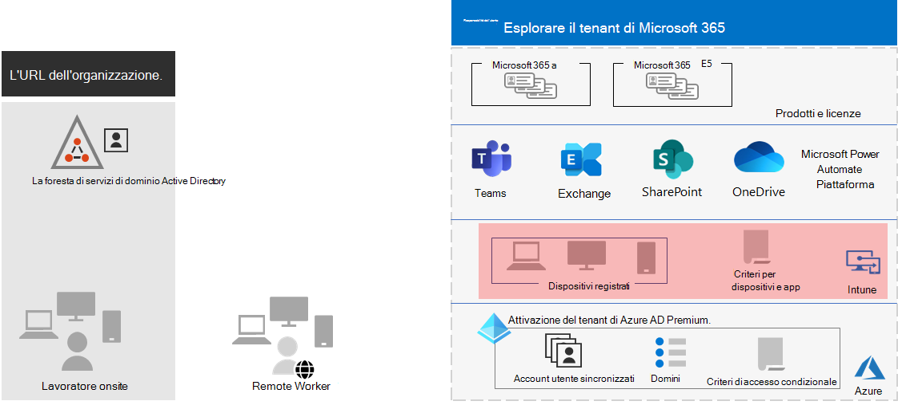

# Passaggio 5.Step 5. Gestione di dispositivi e app per i tenant di Microsoft 365 per EnterpriseDevice and app management for your Microsoft 365 for enterprise tenants

Microsoft 365 for Enterprise include funzionalità che consentono di gestire i dispositivi e l'utilizzo di app su tali dispositivi all'interno dell'organizzazione con la gestione dei dispositivi mobili (MDM) e la gestione delle applicazioni mobili (MAM).Microsoft 365 for enterprise includes features to help manage devices and the use of apps on those devices within your organization with mobile device management (MDM) and mobile application management (MAM). È possibile gestire i dispositivi iOS, Android, macOS e Windows per proteggere l'accesso alle risorse dell'organizzazione, inclusi i dati.You can manage iOS, Android, macOS, and Windows devices to protect access to your organization's resources, including your data. Ad esempio, è possibile impedire l'invio di messaggi di posta elettronica a persone esterne all'organizzazione o isolare i dati dell'organizzazione dai dati personali dei dispositivi personali del lavoratore.For example, you can prevent emails from being sent to people outside your organization or isolate organization data from personal data on your worker's personal devices.

Di seguito è riportato un esempio di convalida e gestione degli utenti, dei loro dispositivi e del loro utilizzo delle applicazioni locali e di produttività cloud come Microsoft teams.Here is an example of the validation and management of users, their devices, and their use of local and cloud productivity apps like Microsoft Teams.

Per garantire la sicurezza e la protezione delle risorse dell'organizzazione, Microsoft 365 for Enterprise include funzionalità che consentono di gestire i dispositivi e l'accesso alle app.To help you secure and protect your organization's resources, Microsoft 365 for enterprise includes features to help manage devices and their access to apps. Sono disponibili due opzioni per la gestione dei dispositivi:There are two options for device management:

- Microsoft Intune, che è una soluzione completa per la gestione di dispositivi e app per le aziende.Microsoft Intune, which is a comprehensive device and app management solution for enterprises.
- Mobilità e sicurezza di base, un sottoinsieme di servizi di Intune incluso con tutti i prodotti Microsoft 365 per la gestione dei dispositivi nell'organizzazione.Basic Mobility and Security, which is a subset of Intune services included with all Microsoft 365 products for managing devices in your organization. Per ulteriori informazioni, vedere [funzionalità di base per dispositivi mobili e sicurezza](https://docs.microsoft.com/microsoft-365/admin/basic-mobility-security/capabilities).For more information, see [Capabilities of Basic Mobility and Security](https://docs.microsoft.com/microsoft-365/admin/basic-mobility-security/capabilities).

Se si dispone di Microsoft 365 E3 o E5, è consigliabile utilizzare Intune.If you have Microsoft 365 E3 or E5, you should use Intune.

## Microsoft IntuneMicrosoft Intune

È possibile utilizzare [Microsoft Intune](https://docs.microsoft.com/mem/intune/fundamentals/planning-guide) per gestire l'accesso all'organizzazione tramite MDM o mam.You use [Microsoft Intune](https://docs.microsoft.com/mem/intune/fundamentals/planning-guide) to manage access to your organization using MDM or MAM. MDM è il momento in cui gli utenti "iscrivono" i propri dispositivi in Intune.MDM is when users "enroll" their devices in Intune. Dopo la registrazione di un dispositivo, si tratta di un dispositivo gestito che può ricevere i criteri, le regole e le impostazioni dell'organizzazione.After a device is enrolled, it is a managed device and can receive your organization's  policies, rules, and settings. Ad esempio, è possibile installare app specifiche, creare un criterio password, installare una connessione VPN e altro ancora.For example, you can install specific apps, create a password policy, install a VPN connection, and more.

Gli utenti che dispongono di dispositivi personali potrebbero non voler registrare i propri dispositivi o essere gestiti da Intune e dai criteri dell'organizzazione.Users with their own personal devices may not want to enroll their devices or be managed by Intune and your organization's policies. Tuttavia, è comunque necessario proteggere le risorse e i dati dell'organizzazione.But you still need to protect your organization's resources and data. In questo scenario, è possibile proteggere le app utilizzando MAM.In this scenario, you can protect your apps using MAM. Ad esempio, è possibile utilizzare un criterio MAM che richiede a un utente di immettere un PIN quando si accede a SharePoint nel dispositivo.For example, you can use an MAM policy that requires a user to enter a PIN when accessing SharePoint on the device.

È inoltre possibile determinare come gestire i dispositivi personali e i dispositivi di proprietà dell'organizzazione.You'll also determine how you're going to manage personal devices and organization-owned devices. Potrebbe essere opportuno trattare i dispositivi in modo diverso, a seconda dell'utilizzo.You might want to treat devices differently, depending on their uses.

## Configurazioni di identità e accesso dei dispositiviIdentity and device access configurations

Microsoft fornisce una serie di configurazioni per [l'accesso a identità e dispositivi](../security/office-365-security/microsoft-365-policies-configurations.md) per garantire una forza lavoro sicura e produttiva.Microsoft provides a set of configurations for [identity and device access](../security/office-365-security/microsoft-365-policies-configurations.md) to ensure a secure and productive workforce. Tali configurazioni includono l'utilizzo di:These configurations include the use of:

- Criteri di Accesso condizionale di Azure ADAzure AD Conditional Access policies
- Criteri di conformità del dispositivo e di protezione delle app di Microsoft IntuneMicrosoft Intune device compliance and app protection policies
- Criteri di rischio per gli utenti di Azure AD Identity ProtectionAzure AD Identity Protection user risk policies
- Criteri aggiuntivi delle app CloudAdditional policies of cloud apps

Di seguito è riportato un esempio dell'applicazione di queste impostazioni e dei criteri per convalidare e limitare gli utenti, i propri dispositivi e l'utilizzo delle applicazioni locali e di produttività cloud come Microsoft teams.Here is an example of the application of these settings and policies to validate and restrict users, their devices, and their use of local and cloud productivity apps like Microsoft Teams.

Per l'accesso ai dispositivi e la gestione delle app, utilizzare le configurazioni disponibili in questi articoli:For device access and app management, use the configurations in these articles:

- [PrerequisitiPrerequisites](../security/office-365-security/identity-access-prerequisites.md)
- [Criteri comuni di identità e accesso dei dispositiviCommon identity and device access policies](../security/office-365-security/identity-access-policies.md)

## Risultati del passaggio 5Results of Step 5

Per la gestione di dispositivi e app per il tenant Microsoft 365, sono state determinate le impostazioni e i criteri di Intune per convalidare e limitare gli utenti, i loro dispositivi e l'utilizzo delle app di produttività locali e cloud.For device and app management for your Microsoft 365 tenant, you have determined the Intune settings and policies to validate and restrict users, their devices, and their use of local and cloud productivity apps.

Di seguito è riportato un esempio di tenant con il dispositivo Intune e la gestione delle app con i nuovi elementi evidenziati.Here is an example of a tenant with Intune device and app management with the new elements highlighted.

In questa figura, il tenant ha:In this illustration, the tenant has:

- I dispositivi di proprietà dell'organizzazione sono stati registrati in Intune.Organization-owned devices enrolled in Intune.
- Criteri del dispositivo e delle app di Intune per i dispositivi registrati e personali.Intune device and app policies for enrolled and personal devices.

## Manutenzione continua per la gestione di dispositivi e appOngoing maintenance for device and app management

Su base continuativa, potrebbe essere necessario eseguire le operazioni seguenti:On an ongoing basis, you might need to: 

- Gestire la registrazione del dispositivo.Manage device enrollment.
- Rivedere le impostazioni e i criteri per le app, i dispositivi e i requisiti di sicurezza aggiuntivi.Revise your settings and policies for additional apps, devices, and security requirements.
