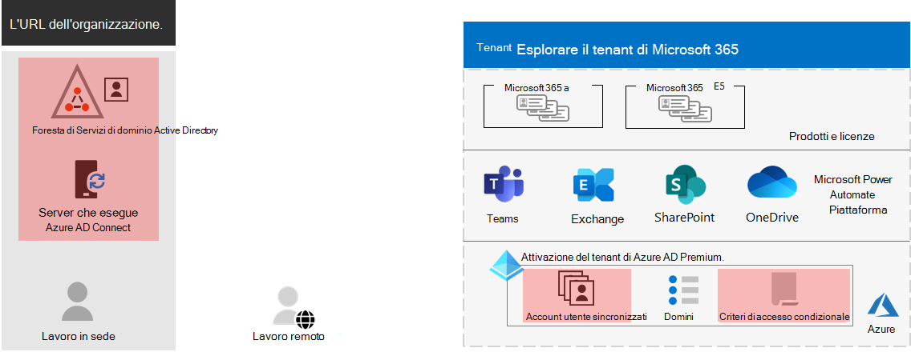
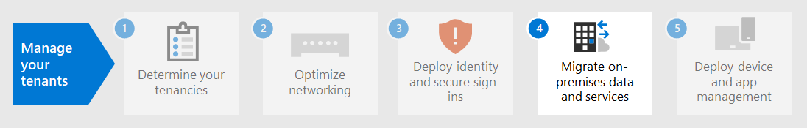

# Passaggio 3. Identità per i tenant di Microsoft 365 per Enterprise

Il tenant di Microsoft 365 include un tenant di Azure Active Directory (Azure AD) per la gestione delle identità e l'autenticazione per gli accessi. Ottenere l'infrastruttura di identità configurata in modo corretto è fondamentale per la gestione dell'accesso utente e delle autorizzazioni di Microsoft 365 per l'organizzazione.

## Solo cloud vs ibrido

Di seguito sono illustrati i due tipi di modelli di identità e i loro vantaggi e adattamenti migliori.

| Modello | Descrizione | Autenticazione delle credenziali utente in Microsoft 365 | Indicato per | Principale vantaggio |
|:-------|:-----|:-----|:-----|:-----|
| Solo cloud | L'account utente esiste solo nel tenant di Azure AD per il tenant di Microsoft 365. | Il tenant di Azure AD per il tenant di Microsoft 365 esegue l'autenticazione con l'account di identità cloud. | Organizzazioni che non hanno o necessitano di un'istanza locale di AD DS. | Semplice da usare. Non richiede altri strumenti o server di directory. |
| Ibrido |  L'account utente è presente nei servizi di dominio Active Directory locali (AD DS) e una copia è anche nel tenant di Azure AD per il tenant di Microsoft 365. Azure AD Connect viene eseguito su un server locale per sincronizzare le modifiche di servizi di dominio Active Directory al tenant di Azure AD. L'account utente in Azure AD potrebbe includere anche una versione con hash della password dell'account utente di AD DS già sottoposto a hash. | Il tenant di Azure AD per il tenant di Microsoft 365 gestisce il processo di autenticazione oppure reindirizza l'utente a un altro provider di identità. | Organizzazioni che usano AD DS o un altro provider di identità. | Gli utenti possono usare le stesse credenziali per accedere a risorse locali o basate sul cloud. |
||||||

Ecco i componenti di base dell'identità solo cloud.
 

In questa illustrazione, gli utenti locali e remoti eseguono l'accesso con account nel tenant di Azure AD del tenant Microsoft 365.

Di seguito sono ripartiti i componenti di base dell'identità ibrida.

In questa illustrazione, gli utenti locali e remoti eseguono l'accesso al tenant Microsoft 365 con account nel tenant di Azure AD che sono stati copiati dal servizio di dominio Active Directory locale.

## Sincronizzazione di servizi di dominio Active Directory locali

A seconda delle esigenze aziendali e dei requisiti tecnici, il modello di identità ibrido e la sincronizzazione della directory rappresentano la scelta più comune per i clienti aziendali che stanno adottando Microsoft 365. La sincronizzazione della directory consente di gestire le identità in AD DS e tutti gli aggiornamenti per gli account utente, i gruppi e i contatti vengono sincronizzati con il tenant di Azure AD del tenant di Microsoft 365.

>[!Note]
>Quando gli account utente di servizi di dominio Active Directory vengono sincronizzati per la prima volta, non viene assegnata automaticamente una licenza Microsoft 365 e non possono accedere ai servizi Microsoft 365, ad esempio la posta elettronica. Prima di tutto, è necessario assegnare loro una posizione di utilizzo. Assegnare quindi una licenza a questi account utente, sia singolarmente che dinamicamente tramite l'appartenenza al gruppo.
>

Di seguito sono disponibili i due tipi di autenticazione quando si utilizza il modello di identità ibrido.

| Tipo di autenticazione | Descrizione |
|:-------|:-----|
| Autenticazione gestita | Azure AD gestisce il processo di autenticazione utilizzando una versione con hash archiviati localmente della password o invia le credenziali a un agente software locale per essere autenticato da servizi di dominio Active Directory locale.      Esistono due tipi di autenticazione gestita: la sincronizzazione dell'hash delle password (pH) e l'autenticazione pass-through (PTA). Con pH, Azure AD esegue l'autenticazione stessa. Con PTA, Azure AD ha servizi di dominio Active Directory per eseguire l'autenticazione. |
| Autenticazione federata | Azure AD reindirizza il computer client che richiede l'autenticazione a un altro provider di identità. |
|  |  |

Per ulteriori informazioni, vedere [scelta del metodo di autenticazione appropriato](https://docs.microsoft.com/azure/active-directory/hybrid/choose-ad-authn) .

## Applicazione di accessi sicuri

Per aumentare la sicurezza degli accessi degli utenti, utilizzare le funzionalità e le funzionalità nella tabella seguente.

| Funzionalità | Descrizione | Ulteriori informazioni | Requisiti per la licenza |
|:-------|:-----|:-----|:-----|:-----|
| Windows Hello for Business | Sostituisce le password con una forte autenticazione a due fattori quando si effettua l'accesso a un dispositivo Windows. I due fattori sono un nuovo tipo di credenziale utente che è associato a un dispositivo e a una biometria o a un PIN. | [Panoramica di Windows Hello for Business](https://docs.microsoft.com/windows/security/identity-protection/hello-for-business/hello-overview) | Microsoft 365 E3 o E5 |
| Protezione delle password di Azure AD | Rileva e blocca le password deboli note e le relative varianti e può anche bloccare ulteriori termini deboli specifici per l'organizzazione. | [Configurare la protezione delle password di Azure AD](https://docs.microsoft.com/azure/active-directory/authentication/concept-password-ban-bad) | Microsoft 365 E3 o E5 |
| Usare l'autenticazione a più fattori | AMF richiede che gli accessi degli utenti siano soggetti a una verifica supplementare oltre la password dell'account utente, ad esempio la verifica con un'app per smartphone o un SMS inviato a uno smartphone. Vedere [questo video](https://support.microsoft.com/office/set-up-multi-factor-authentication-in-microsoft-365-business-a32541df-079c-420d-9395-9d59354f7225) per istruzioni su come gli utenti configurano l'AMF. | [Mae per Microsoft 365 per Enterprise](../enterprise/microsoft-365-secure-sign-in.md#mfa) | Microsoft 365 E3 o E5 |
| Configurazioni di identità e accesso dei dispositivi | Impostazioni e criteri che consistono nelle caratteristiche prerequisite consigliate e nelle relative impostazioni, combinati con i criteri di accesso condizionale, Intune e Azure AD Identity Protection, che determinano se una determinata richiesta di accesso deve essere concessa e in quali condizioni.  | [Configurazioni di identità e accesso dei dispositivi](../security/office-365-security/microsoft-365-policies-configurations.md) | Microsoft 365 E3 o E5 |
| Azure AD Identity Protection | Proteggersi dal compromesso delle credenziali, in cui un utente malintenzionato determina il nome e la password dell'account e l'accesso ai dati e ai servizi cloud dell'organizzazione. | [Azure AD Identity Protection](https://docs.microsoft.com/azure/active-directory/active-directory-identityprotection) | Microsoft 365 E5 o Microsoft 365 E3 con il componente aggiuntivo Identity & Threat Protection |
|  |  |  |

## Risultati del Passaggio 3

Per l'identità del tenant Microsoft 365, è stato determinato quanto segue:

- Modello di identità da utilizzare.
- Modalità di applicazione di un utilizzo sicuro degli utenti e del dispositivo.

Di seguito è riportato un esempio di tenant con i nuovi elementi Identity ibridi evidenziati.

In questa figura, il tenant ha:

- Una foresta di servizi di dominio Active Directory che viene sincronizzata con il tenant di Azure AD utilizzando un server DirSync e Azure AD Connect.
- Copia degli account utente di servizi di dominio Active Directory e di altri oggetti dalla foresta di servizi di dominio Active Directory.
- Un set di criteri di accesso condizionale per applicare gli accessi e l'accesso degli utenti sicuri in base all'account utente. 

## Manutenzione continua per l'identità

Su base continuativa, potrebbe essere necessario eseguire le operazioni seguenti:

- Aggiungere o modificare gli account utente e i gruppi. Per l'identità solo cloud, è possibile gestire gli utenti e i gruppi basati sul cloud con gli strumenti di Azure AD, ad esempio l'interfaccia di amministrazione di Microsoft 365 o PowerShell. Per l'identità ibrida, è possibile gestire gli utenti e i gruppi locali con gli strumenti di servizi di dominio Active Directory.
- Aggiungere o modificare la configurazione dell'identità e dell'accesso ai dispositivi per applicare i requisiti di sicurezza di accesso.

## Passaggio successivo

Continuare con la [migrazione](tenant-management-migration.md) per migrare i server di Office locali e i relativi dati a Microsoft 365.
