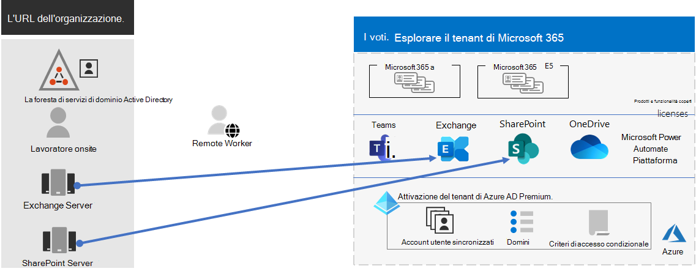
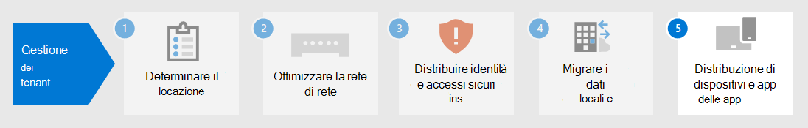

# Passaggio 4.Step 4. Migrazione per i tenant di Microsoft 365 per le aziendeMigration for your Microsoft 365 for enterprise tenants

La maggior parte delle organizzazioni aziendali dispone di un ambiente eterogeneo che include più versioni di sistemi operativi, software client e software server.Most enterprise organizations have a heterogeneous environment that includes multiple releases of operating systems, client software, and server software. Microsoft 365 per le aziende include le versioni più sicure dei componenti chiave dell'infrastruttura IT.Microsoft 365 for enterprise includes the most secure versions of the key components of your IT infrastructure. Include anche funzionalità di produttività progettate per sfruttare le tecnologie cloud.It also includes productivity features that are designed to take advantage of cloud technologies.

Per ottimizzare il valore aziendale della famiglia di prodotti integrata di Microsoft 365 per le aziende, iniziare a pianificare e implementare una strategia per eseguire la migrazione di queste versioni:To maximize the business value of the Microsoft 365 for enterprise integrated suite of products, begin planning and implementing a strategy to migrate these releases:

| DaFrom | ATo |
|:-------|:-----|
| Windows 7 e Windows 8.1Windows 7 and Windows 8.1 | Windows 10 EnterpriseWindows 10 Enterprise |
| Prodotti client di Office installati nei dispositivi dei lavoratoriOffice client products installed on your worker's devices | Microsoft 365 Apps for enterpriseMicrosoft 365 Apps for enterprise |
| Prodotti server di Office installati nei server localiOffice server products installed on on-premises servers | Servizi basati su cloud equivalenti in Microsoft 365Their equivalent cloud-based services in Microsoft 365 |
|  |  |

## Migrazione a Windows 10Migrating to Windows 10

Ogni licenza di Microsoft 365 per le aziende include una licenza per Windows 10 Enterprise.Each Microsoft 365 for enterprise license includes a license for Windows 10 Enterprise. Per eseguire la migrazione dei dispositivi che eseguono Windows 7 o Windows 8.1, puoi eseguire un aggiornamento sul posto.To migrate your devices that run Windows 7 or Windows 8.1, you can do an in-place upgrade. Il supporto per Windows 7 è terminato *il 14 gennaio 2020.*Support ended for Windows 7 on *January 14, 2020*. 

Per altri metodi di installazione di Windows 10 Enterprise oltre a un aggiornamento sul posto, vedi Scenari di distribuzione [di Windows 10.](https://docs.microsoft.com/windows/deployment/windows-10-deployment-scenarios)For additional methods of installing Windows 10 Enterprise beyond an in-place upgrade, see [Windows 10 deployment scenarios](https://docs.microsoft.com/windows/deployment/windows-10-deployment-scenarios). È anche possibile [pianificare la distribuzione di Windows 10](https://aka.ms/planforwin10deployment) autonomamente.You can also [plan for Windows 10 deployment](https://aka.ms/planforwin10deployment) on your own.

## Migrazione a Microsoft 365 Apps for enterpriseMigrating to Microsoft 365 Apps for enterprise

Microsoft 365 per le aziende include Microsoft 365 Apps for enterprise, una versione dei prodotti client di Office (Word, PowerPoint, Excel e Outlook) installata e aggiornata dal cloud Microsoft.Microsoft 365 for enterprise includes Microsoft 365 Apps for enterprise, a version of the Office client products (Word, PowerPoint, Excel, and Outlook) that is installed and updated from the Microsoft cloud. Per altre informazioni, vedere [Informazioni su Microsoft 365 Apps for enterprise.](https://docs.microsoft.com/deployoffice/about-microsoft-365-apps)For more information, see [About Microsoft 365 Apps for enterprise](https://docs.microsoft.com/deployoffice/about-microsoft-365-apps).

Anziché mantenere i computer correnti per Office 2019 o versioni precedenti, eseguire la procedura seguente:Rather than keeping your computers current for Office 2019 or older versions, take the following steps:

1. Ottenere e assegnare una licenza di Microsoft 365 per gli utenti.Get and assign a Microsoft 365 license for your users.
2. Disinstallare Office 2013 o Office 2016 nei propri computer.Uninstall Office 2013 or Office 2016 on their computers.
3. Installare Microsoft 365 Apps for enterprise, singolarmente o durante un'implementazione IT.Install Microsoft 365 Apps for enterprise, either individually or during an IT rollout. Per altre informazioni, vedere [Guida alla distribuzione di Microsoft 365 Apps.](https://docs.microsoft.com/deployoffice/deployment-guide-microsoft-365-apps)For more information, see [Deployment guide for Microsoft 365 Apps](https://docs.microsoft.com/deployoffice/deployment-guide-microsoft-365-apps).

Microsoft 365 Apps for enterprise installa automaticamente gli aggiornamenti della sicurezza e i nuovi aggiornamenti delle funzionalità e può sfruttare i servizi basati sul cloud in Microsoft 365 per una maggiore sicurezza e produttività.Microsoft 365 Apps for enterprise installs both security updates and new feature updates automatically and can take advantage of cloud-based services in Microsoft 365 for enhanced security and productivity.

## Migrazione di dati e server locali a Microsoft 365Migrating on-premises servers and data to Microsoft 365

Microsoft 365 per le aziende include versioni basate sul cloud dei servizi server di Office che utilizzano alcuni degli stessi strumenti delle versioni locali del software server di Office, ad esempio i Web browser e il client Outlook.Microsoft 365 for enterprise includes cloud-based versions of Office server services that use some of the same tools as on-premises versions of Office server software, such as web browsers and the Outlook client. Questi servizi basati sul cloud vengono aggiornati automaticamente per la sicurezza e le nuove funzionalità.These cloud-based services are automatically updated for security and new features. Dopo la migrazione, il reparto IT può risparmiare tempo necessario per gestire e aggiornare i server locali.After migration, your IT department can save the time it takes to maintain and update on-premises servers.

Utilizzare le risorse seguenti per informazioni sulla migrazione di utenti e dati per carichi di lavoro di Microsoft 365 specifici:Use the following resources for information about migrating users and data for specific Microsoft 365 workloads:

- [Spostare le cassette postali dai Exchange Server locali a Exchange OnlineMove mailboxes from on-premises Exchange Server to Exchange Online](https://docs.microsoft.com/exchange/hybrid-deployment/move-mailboxes)
- [Eseguire la migrazione dei dati di SharePoint da SharePoint Server a SharePoint OnlineMigrate SharePoint data from SharePoint Server to SharePoint Online](https://docs.microsoft.com/sharepointmigration/migrate-to-sharepoint-online)
- [Eseguire la migrazione di Skype for Business online a Microsoft TeamsMigrate Skype for Business Online to Microsoft Teams](https://docs.microsoft.com/microsoftteams/migration-interop-guidance-for-teams-with-skype)

## Transizione dell'intera organizzazioneTransition your entire organization

Per ottenere un quadro migliore di come spostare l'intera organizzazione nei prodotti e servizi in Microsoft 365 per le aziende, scaricare questo poster di transizione:To get a better picture of how to move your entire organization to the products and services in Microsoft 365 for enterprise, download this transition poster:

Questo poster di due pagine è modo rapido per inventariare l'infrastruttura esistente.This two-page poster is a quick way to inventory your existing infrastructure. Usarlo per ottenere indicazioni per il passaggio a un prodotto o un servizio in Microsoft 365 per le aziende.Use it to get guidance for moving to a product or service in Microsoft 365 for enterprise. Mostra i prodotti Windows e Office e altri elementi di infrastruttura e sicurezza come la gestione dei dispositivi, la protezione da identità e minacce, la protezione e la conformità delle informazioni.It shows Windows and Office products and other infrastructure and security elements such as device management, identity and threat protection, and information protection and compliance.

## Risultati del Passaggio 4Results of Step 4

Per la migrazione per il tenant di Microsoft 365, è stato determinato:For migration for your Microsoft 365 tenant, you have determined:

- Quali dispositivi eseguono Windows 7 o Windows 8.1 e il piano per aggiornarli a Windows 10 Enterprise.Which devices are running Windows 7 or Windows 8.1 and the plan to update them to Windows 10 Enterprise.
- Quali dispositivi eseguono le app client di Office e il piano per aggiornarli alle app di Microsoft 365 per le aziende.Which devices are running the Office client apps and the plan to update them to Microsoft 365 apps for enterprise.
- Quali servizi server di Office locali devono essere migrati nell'equivalente di Microsoft 365 e il piano per eseguirne la migrazione e i relativi dati.Which on-premises Office server services should be migrated to their Microsoft 365 equivalent and the plan to migrate them and their data.

Ecco un esempio di tenant con una migrazione completa dei server locali.Here is an example of a tenant with a completed migration of on-premises servers.

In questa figura, l'organizzazione ha:In this illustration, the organization has:

- È stata eseguita la migrazione delle cassette postali Exchange Server locali a Exchange Online.Migrated its on-premises Exchange Server mailboxes to Exchange Online.
- È stata eseguita la migrazione dei siti e dei dati di SharePoint Server locali a SharePoint in Microsoft 365.Migrated its on-premises SharePoint Server sites and data to SharePoint in Microsoft 365.

## Manutenzione continua per la migrazioneOngoing maintenance for migration

Su base continuativa, potrebbe essere necessario:On an ongoing basis, you might need to:

- A seconda dello stato della migrazione delle cassette postali di Exchange, continuare a eseguire la transizione a Exchange Online nell'organizzazione.Depending on the state of your Exchange mailbox migration, continue rolling the transition to Exchange Online out to your organization.
- A seconda dello stato della migrazione del sito di SharePoint locale, continuare a eseguire la transizione a SharePoint in Microsoft 365 all'organizzazione.Depending on the state of your on-premises SharePoint site migration, continue rolling the transition to SharePoint in Microsoft 365 out to your organization.

## Passaggio successivoNext step

Continua con la [gestione di dispositivi e app](tenant-management-device-management.md) per distribuire la gestione di dispositivi e app.Continue with [device and app management](tenant-management-device-management.md) to deploy device and app management.
