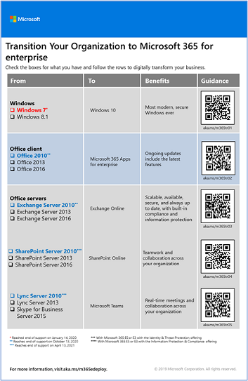

# Passaggio 4. Migrazione per i Microsoft 365 per i tenant aziendali

La maggior parte delle organizzazioni aziendali dispone di un ambiente eterogeneo che include più versioni di sistemi operativi, software client e software server. Microsoft 365 per le aziende include le versioni più sicure dei componenti chiave dell'infrastruttura IT. Include inoltre funzionalità di produttività progettate per sfruttare le tecnologie cloud.

Per ottimizzare il valore aziendale del Microsoft 365 di prodotti integrati per le aziende, iniziare a pianificare e implementare una strategia per la migrazione di queste versioni:

| Da | A |
|:-------|:-----|
| Windows 7 e Windows 8.1 | Windows 10 Enterprise |
| Office prodotti client installati nei dispositivi del lavoratore | Microsoft 365 Apps for enterprise |
| Office server installati nei server locali | I servizi basati su cloud equivalenti in Microsoft 365 |
|  |  |

## Migrazione a Windows 10

Ogni Microsoft 365 per le aziende include una licenza per Windows 10 Enterprise. Per eseguire la migrazione dei dispositivi che Windows 7 o Windows 8.1, è possibile eseguire un aggiornamento sul posto. Il supporto è terminato Windows 7 il *14 gennaio 2020.* 

Per ulteriori metodi di installazione Windows 10 Enterprise un aggiornamento sul posto, vedere Windows 10 [di distribuzione.](/windows/deployment/windows-10-deployment-scenarios) È anche possibile [pianificare la distribuzione di Windows 10](/windows/deployment/planning/) autonomamente.

## Migrazione a Microsoft 365 Apps for enterprise

Microsoft 365 per le aziende include Microsoft 365 Apps for enterprise, una versione dei prodotti client Office (Word, PowerPoint, Excel e Outlook) che viene installata e aggiornata dal cloud Microsoft. Per ulteriori informazioni, vedere [About Microsoft 365 Apps for enterprise](/deployoffice/about-microsoft-365-apps).

Anziché mantenere i computer correnti per Office 2019 o versioni precedenti, eseguire la procedura seguente:

1. Ottenere e assegnare una Microsoft 365 per gli utenti.
2. Disinstallare Office 2013 o Office 2016 nei propri computer.
3. Installare Microsoft 365 Apps for enterprise, singolarmente o durante un'implementazione IT. Per altre informazioni, consulta la [Guida alla distribuzione di Microsoft 365 Apps](/deployoffice/deployment-guide-microsoft-365-apps).

Microsoft 365 Apps for enterprise gli aggiornamenti della sicurezza e i nuovi aggiornamenti delle funzionalità vengono installati automaticamente e possono sfruttare i servizi basati su cloud in Microsoft 365 per migliorare la sicurezza e la produttività.

## Migrazione di dati e server locali a Microsoft 365

Microsoft 365 per le aziende include versioni basate su cloud dei servizi server di Office che utilizzano alcuni degli stessi strumenti delle versioni locali del software server Office, ad esempio i Web browser e il client Outlook. Questi servizi basati sul cloud vengono aggiornati automaticamente per la sicurezza e le nuove funzionalità. Dopo la migrazione, il reparto IT può risparmiare il tempo necessario per la manutenzione e l'aggiornamento dei server locali.

Utilizzare le risorse seguenti per informazioni sulla migrazione di utenti e dati per carichi di Microsoft 365 specifici:

- [Spostare le cassette postali da un Exchange Server locale a Exchange Online](/exchange/hybrid-deployment/move-mailboxes)
- [Eseguire SharePoint dati da SharePoint Server a SharePoint Online](/sharepointmigration/migrate-to-sharepoint-online)
- [Eseguire la Skype for Business online a Microsoft Teams](/microsoftteams/migration-interop-guidance-for-teams-with-skype)

## Transizione dell'intera organizzazione

Per ottenere un'immagine migliore di come spostare l'intera organizzazione nei prodotti e servizi di Microsoft 365 per le aziende, scaricare questo poster di transizione:

Questo poster di due pagine è modo rapido per inventariare l'infrastruttura esistente. Usalo per ottenere indicazioni per il passaggio a un prodotto o un servizio in Microsoft 365 per le aziende. Mostra i Windows e Office e altri elementi dell'infrastruttura e della sicurezza, come la gestione dei dispositivi, la protezione delle identità e delle minacce, la protezione delle informazioni e la conformità.

## Risultati del Passaggio 4

Per la migrazione per Microsoft 365 tenant, è stato determinato:

- Quali dispositivi eseguono Windows 7 o Windows 8.1 e il piano per aggiornarli Windows 10 Enterprise.
- Quali dispositivi eseguono le app client Office e il piano per aggiornarle alle app Microsoft 365 per le aziende.
- Quali servizi server Office locali devono essere migrati nel Microsoft 365 equivalente e il piano per eseguirne la migrazione e i relativi dati.

Ecco un esempio di tenant con una migrazione completata di server locali.

In questa figura, l'organizzazione dispone di:

- È stata eseguita la migrazione delle cassette postali Exchange Server locali a Exchange Online.
- È stata eseguita la migrazione dei siti e dei dati di SharePoint Server locali in SharePoint in Microsoft 365.

## Manutenzione continua per la migrazione

Su base continuativa, potrebbe essere necessario:

- A seconda dello stato della migrazione Exchange cassetta postale, continuare a eseguire la transizione Exchange Online'organizzazione.
- A seconda dello stato della migrazione del sito SharePoint locale, continuare a eseguire la transizione a SharePoint in Microsoft 365 all'organizzazione.

## Passaggio successivo

Continua con [la gestione di dispositivi e app](tenant-management-device-management.md) per distribuire la gestione di dispositivi e app.