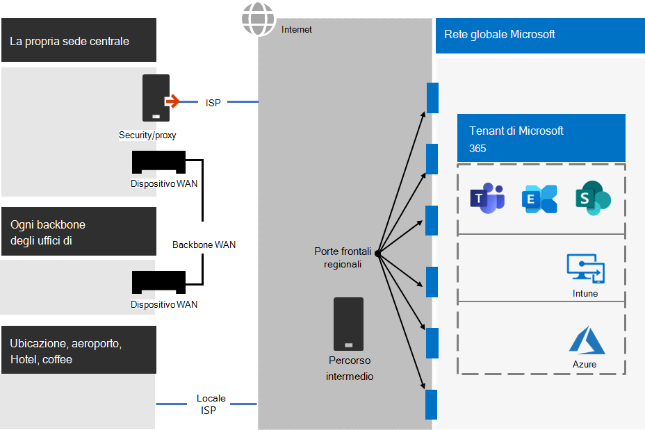
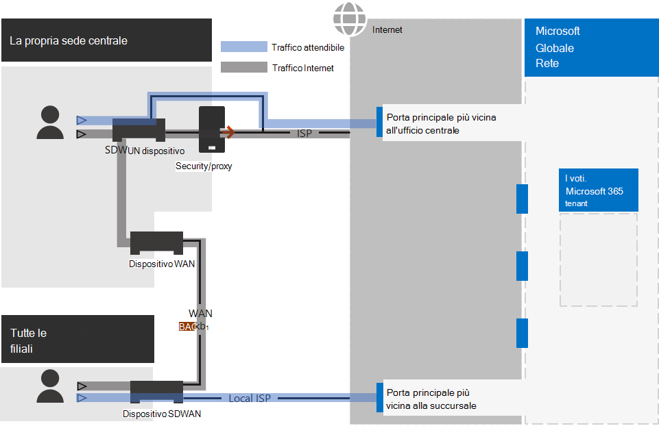
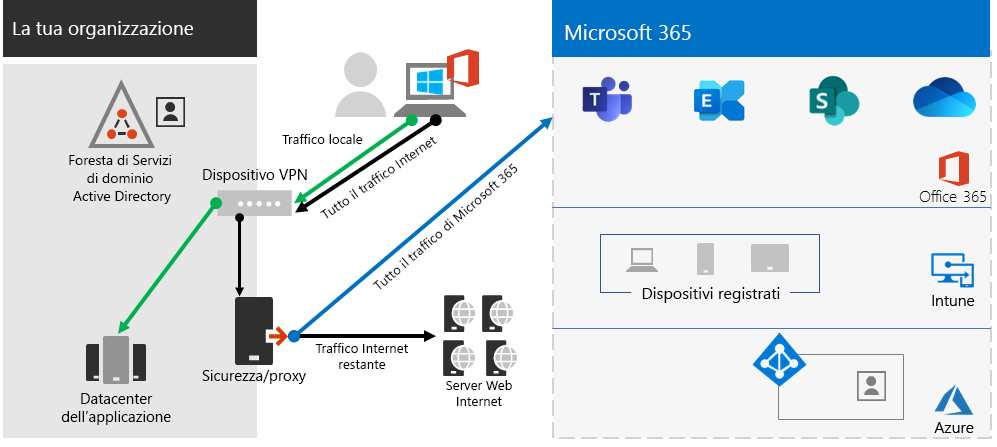
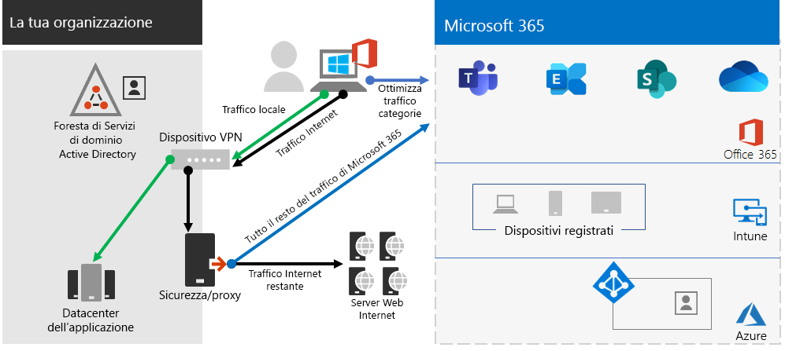
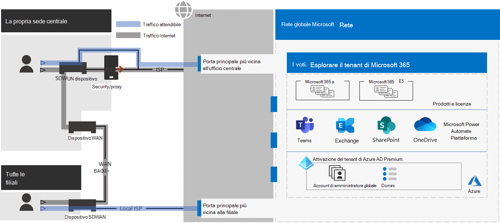
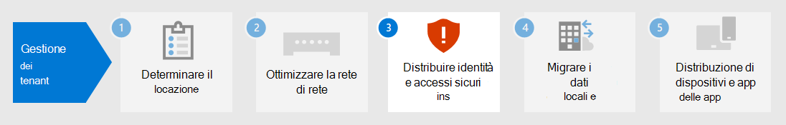

# Passaggio 2. Rete ottimale per i tenant di Microsoft 365 per le aziende

Microsoft 365 per le aziende include app per la produttività cloud come Teams ed Exchange Online e Microsoft Intune, insieme a molti servizi di identità e sicurezza di Microsoft Azure. Tutti questi servizi basati sul cloud si basano sulla sicurezza, sulle prestazioni e sull'affidabilità delle connessioni dai dispositivi client nella rete locale o in qualsiasi posizione su Internet. 

Per ottimizzare l'accesso alla rete per il tenant, è necessario:

- Ottimizzare il percorso tra gli utenti locali e la posizione più vicina alla rete globale Microsoft.
- Ottimizzare l'accesso alla rete globale Microsoft per gli utenti remoti che utilizzano una soluzione VPN di accesso remoto.
- Usare Network Insights per progettare il perimetro di rete per le posizioni degli uffici.
- Ottimizzare l'accesso a risorse specifiche ospitate nei siti di SharePoint con la rete CDN di Office 365.
- Configurare i dispositivi proxy e perimetrali di rete per ignorare l'elaborazione del traffico attendibile di Microsoft 365 con l'elenco degli endpoint e automatizzare l'aggiornamento dell'elenco quando vengono apportate modifiche.

## Lavoratori locali aziendali

Per le reti aziendali, è consigliabile ottimizzare l'esperienza dell'utente finale abilitando l'accesso di rete con le massime prestazioni tra i client e gli endpoint di Microsoft 365 più vicini. La qualità dell'esperienza utente finale è direttamente correlata alle prestazioni e alla velocità di risposta dell'applicazione utilizzata dall'utente. Ad esempio, Microsoft Teams si basa su una bassa latenza in modo che le chiamate telefoniche, le conferenze e le collaborazioni su schermo condivise degli utenti siano senza problemi.

L'obiettivo principale nella progettazione della rete dovrebbe essere ridurre al minimo la latenza riducendo il tempo di andata e ritorno (RTT) dai dispositivi client alla rete globale Microsoft, la backbone di rete pubblica di Microsoft che collega tutti i datacenter Di Microsoft con bassa latenza, punti di ingresso dell'applicazione cloud a disponibilità elevata, noti come porte anteriori, distribuiti in tutto il mondo.

Ecco un esempio di rete aziendale tradizionale.

In questa figura le succursali si connettono a una sede centrale tramite dispositivi WAN (Wide Area Network) e una backbone WAN. L'accesso a Internet è tramite un dispositivo proxy o di sicurezza nel perimetro di rete della sede centrale e un provider di servizi Internet (ISP). Su Internet, Microsoft Global Network ha una serie di porte anteriori nelle aree geografiche di tutto il mondo. Le organizzazioni possono inoltre utilizzare posizioni intermedie per l'elaborazione e la sicurezza dei pacchetti aggiuntive per il traffico. Il tenant di Microsoft 365 di un'organizzazione si trova all'interno di Microsoft Global Network.

I problemi relativi a questa configurazione per i servizi cloud di Microsoft 365 sono:

- Per gli utenti nelle succursali, il traffico viene inviato alle porte anteriori non locali, aumentando la latenza.
- L'invio del traffico a posizioni intermedie crea hairpin di rete che eseguono l'elaborazione di pacchetti duplicati sul traffico attendibile, aumentando la latenza.
- I dispositivi perimetrali di rete eseguono l'elaborazione dei pacchetti non richiesta e duplicata sul traffico attendibile, aumentando la latenza.

L'ottimizzazione delle prestazioni di rete di Microsoft 365 non deve essere complicata. È possibile ottenere le migliori prestazioni possibili seguendo alcuni principi chiave:

- Identificare il traffico di rete di Microsoft 365, ovvero il traffico attendibile destinato ai servizi cloud Microsoft.
- Consentire l'uscita succursale locale del traffico di rete di Microsoft 365 verso Internet da ogni posizione in cui gli utenti si connettono a Microsoft 365.
- Evitare hairpin di rete.
- Consentire al traffico di Microsoft 365 di ignorare proxy e dispositivi di ispezione dei pacchetti.

Se si implementano questi principi, si ottiene una rete aziendale ottimizzata per Microsoft 365.

In questa illustrazione, le succursali dispongono di una propria connessione Internet tramite un dispositivo WAN (SDWAN) software-defined, che invia il traffico attendibile di Microsoft 365 al front door più vicino a livello regionale. Nella sede centrale, il traffico attendibile di Microsoft 365 ignora il dispositivo di sicurezza o proxy e i dispositivi intermedi non vengono più utilizzati.

Ecco come la configurazione ottimizzata risolve i problemi di latenza di una rete aziendale tradizionale:

- Il traffico attendibile di Microsoft 365 ignora la backbone WAN e viene inviato alle porte anteriori locali per tutti gli uffici, riducendo la latenza.
- Gli hairpin di rete che eseguono l'elaborazione di pacchetti duplicati vengono ignorati per il traffico attendibile di Microsoft 365, riducendo la latenza.
- I dispositivi perimetrali di rete che eseguono l'elaborazione dei pacchetti non necessario e duplicato vengono ignorati per il traffico attendibile di Microsoft 365, riducendo la latenza.

Per ulteriori informazioni, vedere Panoramica della connettività di rete [di Microsoft 365.](../enterprise/microsoft-365-networking-overview.md)

## Lavoratori remoti

Se i lavoratori remoti usano un client VPN tradizionale per ottenere l'accesso remoto alla rete dell'organizzazione, verificare che nel client VPN vi sia la modalità split tunneling. Senza split tunneling, tutto il traffico di lavoro remoto viene inviato attraverso la connessione VPN, tramite la quale viene poi inoltrato ai dispositivi perimetrali dell'organizzazione per essere quindi elaborato e inviato su Internet. Ecco un esempio.

In questa illustrazione, il traffico di Microsoft 365 deve intraprendere un percorso indiretto attraverso l'organizzazione, che potrebbe essere inoltrato a un frontdoio di Microsoft Global Network lontano dalla posizione fisica del client VPN. Questo percorso indiretto aggiunge latenza al traffico di rete e riduce le prestazioni complessive. 

Grazie alla modalità split tunneling, è possibile configurare il client VPN per escludere tipi specifici di traffico da inviare tramite la connessione VPN alla rete dell'organizzazione.

Per ottimizzare l'accesso alle risorse cloud di Microsoft 365, configurare i client VPN di split tunneling per escludere il traffico agli endpoint di Microsoft 365 di categoria **Ottimizzazione** tramite connessione VPN. Per altre informazioni, vedere le categorie  di [endpoint di Office 365](../enterprise/microsoft-365-network-connectivity-principles.md#new-office-365-endpoint-categories) e gli elenchi degli endpoint di categoria Optimize per lo split tunneling.

Ecco il flusso di traffico risultante per lo split tunneling, in cui la maggior parte del traffico verso le app cloud di Microsoft 365 ignora la connessione VPN.

In questa illustrazione, il client VPN invia e riceve il traffico fondamentale del servizio cloud di Microsoft 365 direttamente tramite Internet e verso la porta principale più vicina alla rete globale Microsoft.

Per informazioni dettagliate e per materiale sussidiario, consultare [Ottimizzare la connettività di Office 365 per gli utenti remoti tramite split tunneling per VPN](../enterprise/microsoft-365-vpn-split-tunnel.md).

## Uso di Network Insights (anteprima)

Le informazioni dettagliate sulla rete sono metriche sulle prestazioni raccolte dal tenant di Microsoft 365 che consentono di progettare i perimetri di rete per le sedi degli uffici. Ogni approfondimento fornisce dettagli in tempo reale sulle caratteristiche delle prestazioni per un problema specifico per ogni posizione geografica in cui gli utenti locali accedono al tenant.

Esistono due informazioni dettagliate sulla rete a livello di tenant che possono essere visualizzate per il tenant:

- [Connessioni campionate di Exchange influenzate da problemi di connettività](../enterprise/office-365-network-mac-perf-insights.md#exchange-sampled-connections-impacted-by-connectivity-issues)
- [Connessioni campionate di SharePoint influenzate da problemi di connettività](../enterprise/office-365-network-mac-perf-insights.md#sharepoint-sampled-connections-impacted-by-connectivity-issues)

Di seguito sono disponibili informazioni dettagliate sulla rete specifiche per ogni posizione dell'ufficio:

- [Uscita dalla rete con backhauled](../enterprise/office-365-network-mac-perf-insights.md#backhauled-network-egress)
- [Prestazioni migliori rilevate per i clienti nelle vicinanze](../enterprise/office-365-network-mac-perf-insights.md#better-performance-detected-for-customers-near-you)
- [Utilizzo di una porta d'ingresso del servizio Exchange Online non ottimale](../enterprise/office-365-network-mac-perf-insights.md#use-of-a-non-optimal-exchange-online-service-front-door)
- [Uso di un front door del servizio SharePoint Online non ottimale](../enterprise/office-365-network-mac-perf-insights.md#use-of-a-non-optimal-sharepoint-online-service-front-door)
- [Bassa velocità di download dalla porta d'ingresso di SharePoint](../enterprise/office-365-network-mac-perf-insights.md#low-download-speed-from-sharepoint-front-door)
- [Uscita di rete ottimale per gli utenti della Cina](../enterprise/office-365-network-mac-perf-insights.md#china-user-optimal-network-egress)

>[!IMPORTANT]
>Le informazioni dettagliate sulla rete, i consigli sulle prestazioni e le valutazioni nell'interfaccia di amministrazione di Microsoft 365 sono attualmente in stato di anteprima. È disponibile solo per i tenant di Microsoft 365 che sono stati registrati nel programma di anteprima delle funzionalità.

Per ulteriori informazioni, vedere [Microsoft 365 Network Insights.](../enterprise/office-365-network-mac-perf-insights.md)

## Prestazioni di SharePoint con la rete CDN di Office 365

Una rete per la distribuzione di contenuti (CDN) basata sul cloud consente di ridurre i tempi di caricamento, risparmiare larghezza di banda e velocità di risposta. Una rete CDN migliora le prestazioni memorizzando nella cache asset statici come file grafici o video più vicini ai browser che li richiedono, in modo da velocizzare i download e ridurre la latenza. È possibile utilizzare la rete per la distribuzione di contenuti (CDN) di Office 365 integrata, inclusa in SharePoint in Microsoft 365 E3 ed E5, per ospitare asset statici che offrono prestazioni migliori per le pagine di SharePoint.

La rete per la distribuzione di contenuti di Office 365 è costituita da diverse reti per la distribuzione di contenuti che consentono di ospitare le risorse statiche in più località o _origini_ e gestirle da reti globali ad alta velocità. A seconda del tipo di contenuto che si desidera ospitare nella  rete CDN di Office 365, è possibile aggiungere origini **pubbliche,** origini private o entrambe.

Quando viene distribuita e configurata, la rete CDN di Office 365 carica le risorse da origini pubbliche e private e le rende disponibili per l'accesso rapido agli utenti che si trovano su Internet.

Per ulteriori informazioni, vedere Usare la rete CDN di [Office 365 con SharePoint Online.](../enterprise/use-microsoft-365-cdn-with-spo.md)

## Presentazione automatica degli endpoint

Per fare in modo che i client locali, i dispositivi perimetrali e i servizi di analisi dei pacchetti basati su cloud saltino l'elaborazione del traffico attendibile di Microsoft 365, è necessario configurarli con il set di endpoint (intervalli di indirizzi IP e nomi DNS) corrispondenti ai servizi di Microsoft 365. Questi endpoint possono essere configurati manualmente nei firewall e in altri dispositivi di sicurezza perimetrale, nei file PAC per i computer client per ignorare i proxy o nei dispositivi SD-WAN nelle succursali. Tuttavia, gli endpoint cambiano nel tempo, richiedendo una manutenzione manuale continua degli elenchi di endpoint in queste posizioni.

Per automatizzare la gestione della presentazione e delle modifiche per gli endpoint di Microsoft 365 nei file PAC client e nei dispositivi di rete, usare il servizio Web basato su REST dell'indirizzo IP e dell'URL di [Office 365.](../enterprise/microsoft-365-ip-web-service.md) Questo servizio consente di identificare e differenziare meglio il traffico di rete di Microsoft 365, facilitando la valutazione, la configurazione e il rispetto delle modifiche più recenti.

Puoi usare PowerShell, Python o altri linguaggi per determinare le modifiche apportate agli endpoint nel tempo e configurare i file PAC e i dispositivi di rete perimetrale.

Il processo di base è il seguente:

1. Usare il servizio Web Url e indirizzo IP di Office 365 e il meccanismo di configurazione scelto per configurare i file PAC e i dispositivi di rete con il set corrente di endpoint di Microsoft 365.
2. Esegui un'operazione ricorrente giornaliera per verificare la presenza di modifiche negli endpoint o usare un metodo di notifica.
3. Quando vengono rilevate modifiche, rigenerare e ridistribuire il file PAC per i computer client e apportare le modifiche ai dispositivi di rete.

Per ulteriori informazioni, vedere Servizio Web url e indirizzo IP di [Office 365.](../enterprise/microsoft-365-ip-web-service.md)

## Risultati del passaggio 2

Per il tenant di Microsoft 365 con una rete ottimale, è stato determinato:

- Come ottimizzare le prestazioni di rete per gli utenti locali aggiungendo connessioni Internet a tutte le succursali ed eliminando gli hairpin di rete.
- Come implementare la presentazione automatica degli endpoint attendibili per i file PAC basati su client e i dispositivi e i servizi di rete, inclusi gli aggiornamenti continui (più adatti per le reti aziendali).
- Come supportare l'accesso dei lavoratori remoti alle risorse locali.
- Come usare Network Insights
- Come distribuire la rete CDN di Office 365.

Ecco un esempio di un'organizzazione aziendale e del relativo tenant con una rete ottimale.

[Vedere una versione più grande di questa immagine](https://github.com/MicrosoftDocs/microsoft-365-docs/raw/public/microsoft-365/media/tenant-management-overview/tenant-management-tenant-build-step2.png)

In questa figura, il tenant per questa organizzazione aziendale dispone di:

- Accesso a Internet locale per ogni succursale con un dispositivo SDWAN che inoltra il traffico attendibile di Microsoft 365 a un front door locale.
- Nessun hairpin di rete.
- Dispositivi perimetrali proxy e di sicurezza dell'ufficio centrale che inoltrano il traffico attendibile di Microsoft 365 a una porta principale locale.

## Manutenzione continua per una rete ottimale

Su base continuativa, potrebbe essere necessario:

- Aggiorna i dispositivi perimetrali e i file PAC distribuiti per le modifiche negli endpoint o verifica che il processo automatizzato funzioni correttamente.
- Gestire le risorse nella rete CDN di Office 365.
- Aggiornare la configurazione di split tunneling nei client VPN per le modifiche negli endpoint.

## Passaggio successivo

Continuare con [l'identità](tenant-management-identity.md) per sincronizzare gli account e i gruppi locali e applicare gli accesso degli utenti sicuri.
