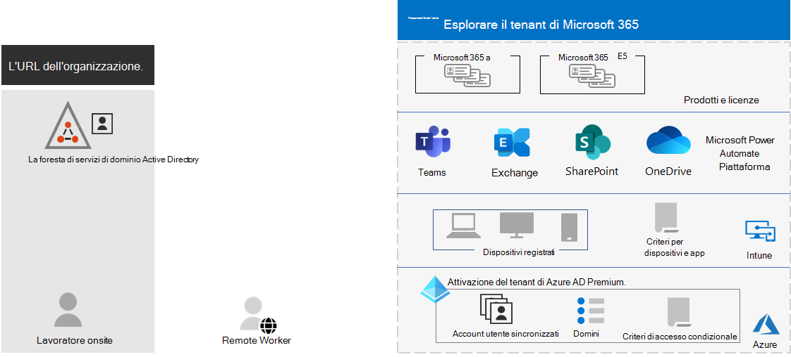
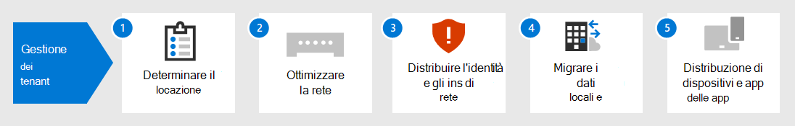

# Gestione tenant per Microsoft 365 per le aziendeTenant management for Microsoft 365 for enterprise

La creazione di un percorso per la trasformazione digitale dell'organizzazione con il cloud computing richiede una base solida su cui i dipendenti possono fare affidamento su produttività, collaborazione, prestazioni, privacy, conformità e sicurezza.Creating a path to your organization's digital transformation with cloud computing requires a firm foundation upon which your workers can rely for productivity, collaboration, performance, privacy, compliance, and security.

La corretta configurazione dei tenant di Microsoft 365 fornisce questa base, lasciando ai dipendenti di concentrarsi sul lavoro svolto e sul reparto IT per concentrarsi sulle soluzioni end-to-end che forniscono ulteriore valore aziendale.Correct configuration of your Microsoft 365 tenants provides that foundation, leaving your workers to focus on getting their work done and your IT department to focus on end-to-end solutions that provide additional business value. 

Questa soluzione illustra la configurazione di tale base nei passaggi seguenti:This solution takes you through the configuration of that foundation in these steps:

1. Determinare i tenantDetermine your tenants
2. Ottimizzare la reteOptimize your networking
3. Sincronizzare le identità e applicare gli accesso sicuriSynchronize your identities and enforce secure sign-ins
4. Eseguire la migrazione di dispositivi Windows, client di Office e server e dati di Office localiMigrate your Windows devices, Office clients, and on-premises Office servers and data
5. Distribuire la gestione di dispositivi e appDeploy device and app management

Ma prima di tutto, prendiamoci un momento per capire che cos'è un tenant e che aspetto ha un tenant che fornisce una base ferma.But first, let's take a moment to understand what a tenant is and what a tenant that provides a firm foundation looks like.

## Un tenant di Microsoft 365 definitoA Microsoft 365 tenant defined

Un tenant di Microsoft 365 è un'istanza dedicata dei servizi di Microsoft 365 e dei dati dell'organizzazione archiviati in una posizione predefinita specifica, ad esempio Europa o Nord America.A Microsoft 365 tenant is a dedicated instance of the services of Microsoft 365 and your organization data stored within a specific default location, such as Europe or North America. Questa posizione viene specificata quando si crea il tenant per l'organizzazione.This location is specified when you create the tenant for your organization. Ogni tenant di Microsoft 365 è distinto, univoco e separato da tutti gli altri tenant di Microsoft 365.Each Microsoft 365 tenant is distinct, unique, and separate from all other Microsoft 365 tenants. Si crea un tenant di Microsoft 365 quando si acquistano uno o più prodotti da Microsoft, ad esempio Microsoft 365 E3 o E5, e un set di licenze per ognuno.You create a Microsoft 365 tenant when you purchase one or more products from Microsoft, such as Microsoft 365 E3 or E5, and a set of licenses for each.

Il tenant di Microsoft 365 include anche un tenant di Azure Active Directory (Azure AD), che è un'istanza dedicata di Azure AD per gli account utente, i gruppi e altri oggetti.Your Microsoft 365 tenant also includes an Azure Active Directory (Azure AD) tenant, which is a dedicated instance of Azure AD for user accounts, groups, and other objects. Ogni tenant di Azure AD è distinto, univoco e separato da tutti gli altri tenant di Azure AD.Each Azure AD tenant is distinct, unique, and separate from all other Azure AD tenants. Anche se l'organizzazione può avere più tenant di Azure AD che è possibile configurare con le sottoscrizioni di Azure, i tenant di Microsoft 365 possono usare solo un singolo tenant di Azure AD, quello creato al momento della creazione del tenant.While your organization can have multiple Azure AD tenants that you can set up with Azure subscriptions, Microsoft 365 tenants can only use a single Azure AD tenant, the one that was created when you created the tenant. 

Ecco un esempio:Here is an example:

*La gestione* tenant è la pianificazione, la distribuzione e il funzionamento continuo dei tenant di Microsoft 365.*Tenant management* is the planning, deployment, and ongoing operation of your Microsoft 365 tenants. 

## Attributi di un tenant ben progettato e operativoAttributes of a well-designed and operating tenant

Oltre al nome e alla posizione corretti per il tenant, esistono altri elementi da pianificare, distribuire e gestire per garantire che le esperienze utente con le app di produttività cloud come Microsoft Teams ed Exchange Online siano efficaci, sicure ed &mdash; &mdash; efficienti.Beyond the correct name and location for your tenant, there are additional elements to plan, deploy, and manage to ensure that your user experiences with cloud productivity apps&mdash;such as Microsoft Teams and Exchange Online&mdash;are effective, secure, and performant.

Ecco gli elementi:Here are the elements:

- Si dispone del set corretto di prodotti (sottoscrizioni) e licenze.You have the correct set of products (subscriptions) and licenses.
  - Il set di prodotti corrisponde alle esigenze aziendali, IT e di sicurezza.The set of products match your business, IT, and security needs.
  - Esiste un numero adeguato di licenze per i dipendenti e cambiamenti previsti nel personale.There is an adequate number of licenses for your workers and anticipated changes in staffing.
- Per la rete:For networking:
  - Sono stati configurati i nomi di dominio DNS corretti.You have configured the correct DNS domain names.
  - Per le reti aziendali, il traffico di rete verso la rete Microsoft è stato ottimizzato per i lavoratori sul posto.For enterprise networks, you have optimized network traffic to the Microsoft network for onsite workers.
  - Il traffico di rete è stato ottimizzato per i lavoratori remoti che usano un client VPN.You have optimized network traffic for remote workers who are using a VPN client.
- Gli account, i gruppi e altri oggetti di Servizi di dominio Active Directory sono stati sincronizzati.You have synchronized your Active Directory Domain Services (AD DS) accounts, groups, and other objects.
  - Gli account tenant di Azure AD sono mappati alle cassette postali di Exchange Online con i domini DNS corretti per gli indirizzi di posta elettronica.Your Azure AD tenant accounts are mapped to Exchange Online mailboxes with the correct DNS domains for email addresses.
  - Agli account utente sono state assegnate le licenze corrette dai prodotti acquistati corretti (ad esempio Microsoft 365 E3 o E5).Your user accounts have been assigned the correct licenses from the correct purchased products (such as Microsoft 365 E3 or E5).
- La gestione delle identità e degli accessi è stata configurata.You have configured strong identity and access management.
  - È necessario l'accesso utente sicuro con autenticazione a più fattori o senza password.You are requiring secure user sign-in with passwordless or multi-factor authentication (MFA).
  - Si dispone di criteri di accesso condizionale che applicano i requisiti di accesso e le restrizioni per livelli di sicurezza più elevati.You have Conditional Access policies that enforce sign-in requirements and restrictions for higher levels of security.
- I server Office locali e i relativi dati sono stati migrati nelle app cloud o vengono usati in una configurazione ibrida.On-premises Office servers and their data have been migrated to cloud apps or are being used in a hybrid configuration.
- Si esegue la gestione dei dispositivi con Intune o Basic Mobility and Security integrato in Microsoft 365.You are doing device management with Intune or Basic Mobility and Security built into Microsoft 365.
  - I dispositivi di proprietà dell'organizzazione vengono registrati e gestiti.Your organization-owned devices are enrolled and managed.
  - Le app per i dispositivi personali vengono gestite.The apps for personal devices are managed.

Ecco un esempio di un tenant di Microsoft 365 con tutti questi elementi sul posto.Here is an example of a Microsoft 365 tenant with all these elements in place.

In questa illustrazione, il tenant di Microsoft 365 include:In this illustration, the Microsoft 365 tenant includes:

- Prodotti e licenze per Microsoft 365 E3 ed E5.Products and licenses for Microsoft 365 E3 and E5.
- App di produttività di Microsoft 365.Microsoft 365 productivity apps.
- Intune con i dispositivi registrati e i criteri di dispositivi e applicazioni.Intune with enrolled devices and device and application policies.
- Un tenant di Azure AD con account utente sincronizzato (non vengono visualizzati i gruppi e altri oggetti directory), i domini e i criteri di accesso condizionale.An Azure AD tenant that has synchronized user account (groups and other directory objects are not shown), domains, and Conditional Access policies.

## Funzionalità tenant per Microsoft 365 per le aziendeTenant capabilities for Microsoft 365 for enterprise

Nelle sezioni e nella tabella seguenti sono elencate le funzionalità principali e le licenze per i passaggi di questa soluzione.The following sections and table list the key capabilities and licensing for the steps in this solution.

### TenantTenant

| Capacità o funzionalitàCapability or feature | DescrizioneDescription | LicenzeLicensing |
|:-------|:-----|:-------|
| Più tenantMultiple tenants | Ogni tenant di Microsoft 365 è distinto, univoco e separato da tutti gli altri tenant di Microsoft 365.Each Microsoft 365 tenant is distinct, unique, and separate from all other Microsoft 365 tenants. Con più tenant, esistono restrizioni e considerazioni aggiuntive per la gestione e la fornitura di servizi agli utenti.With multiple tenants, there are restrictions and additional considerations when managing them and providing services to your users. | Microsoft 365 E3 o E5Microsoft 365 E3 or E5 | 
| Migrazione delle cassette postali tra tenantCross-tenant mailbox migration | Gli amministratori tenant possono spostare le cassette postali tra tenant con dipendenze dell'infrastruttura minime nei sistemi locali.Tenant administrators can move mailboxes between tenants with minimal infrastructure dependencies in their on-premises systems. In questo modo si elimina la necessità di eseguire l'offboard e l'onboard delle cassette postali.This removes the need to off-board and onboard mailboxes. | Microsoft 365 E3 o E5Microsoft 365 E3 or E5 | 
| Multi-GeoMulti-Geo | Il tenant può archiviare i dati in pausa nelle altre posizioni geografiche del datacenter scelte per soddisfare i requisiti di residenza dei dati.Your tenant can store data at rest in the other datacenter geo locations that you've chosen to meet data residency requirements. | Microsoft 365 E3 o E5Microsoft 365 E3 or E5 | 
| Spostare i dati di base in un nuovo data center geograficoMove core data to a new datacenter geo | Poiché Microsoft aggiunge nuove posizioni geografiche del datacenter per ulteriori risorse di capacità e calcolo, è possibile richiedere uno spostamento geografico del datacenter per la residenza dei dati in-geo per i dati principali dei clienti.As Microsoft adds new datacenter geos for additional capacity and compute resources, you can request a datacenter geo move for in-geo data residency for your core customer data. | Microsoft 365 E3 o E5Microsoft 365 E3 or E5 | 
||||

### ReteNetworking

| Capacità o funzionalitàCapability or feature | DescrizioneDescription | LicenzeLicensing |
|:-------|:-----|:-------|
| Network InsightsNetwork Insights | Metriche delle prestazioni di rete raccolte dal tenant di Microsoft 365 per facilitare la progettazione dei perimetri di rete per le sedi degli uffici.Network performance metrics collected from your Microsoft 365 tenant to help you design network perimeters for your office locations. | Microsoft 365 E3 o E5Microsoft 365 E3 or E5 | 
| Automatizzare gli aggiornamenti degli endpointAutomate endpoint updates | Automatizzare la configurazione e gli aggiornamenti continui per gli endpoint di Microsoft 365 nei file PAC client e nei dispositivi e servizi di rete.Automate the configuration and ongoing updates for Microsoft 365 endpoints in your client PAC files and network devices and services. | Microsoft 365 E3 o E5Microsoft 365 E3 or E5 | 
||||

### IdentitàIdentity

| Capacità o funzionalitàCapability or feature | DescrizioneDescription | LicenzeLicensing |
|:-------|:-----|:-------|
| Sincronizzare Active Directory Domain Services (AD DS) locale con il tenant di Azure ADSynchronize on-premises Active Directory Domain Services (AD DS) with your Azure AD tenant    | Sfruttare il provider di identità locale per account utente, gruppi e altri oggetti.Leverage your on-premises identity provider for user accounts, groups, and other objects. | Microsoft 365 E3 o E5Microsoft 365 E3 or E5 |
| MFA applicata con le impostazioni predefinite per la sicurezzaMFA enforced with security defaults   | Proteggere le identità e i dispositivi dalla compromissione richiedendo una seconda forma di autenticazione per gli accessi. Le impostazioni predefinite per la sicurezza richiedono l'autenticazione a più fattori per tutti gli account utente.Protect against compromised identities and devices by requiring a second form of authentication for sign-ins. Security defaults requires MFA for all user accounts.   | Microsoft 365 E3 o E5Microsoft 365 E3 or E5 |
| MFA applicata con l'accesso condizionaleMFA enforced with Conditional Access| Richiedere l'autenticazione a più fattori in base agli attributi dell'accesso con i criteri di accesso condizionale.Require MFA based on the attributes of the sign-in with Conditional Access policies.    | Microsoft 365 E3 o E5Microsoft 365 E3 or E5 | 
| MFA applicata con l'accesso condizionale basato sul rischioMFA enforced with risk-based Conditional Access   | Richiedere l'autenticazione a più fattori in base al rischio di accesso dell'utente con Microsoft Defender per identità.Require MFA based on the risk of the user sign-in with Microsoft Defender for Identity. | Microsoft 365 E5 o E3 con licenze di Azure AD Premium P2Microsoft 365 E5 or E3 with Azure AD Premium P2 licenses | 
| Reimpostazione della password self-serviceSelf-Service Password Reset (SSPR)    | Consentire agli utenti di reimpostare o sbloccare le password o gli account personali.Allow your users to reset or unlock their passwords or accounts.  | Microsoft 365 E3 o E5Microsoft 365 E3 or E5 |
||||

### MigrazioneMigration

| Capacità o funzionalitàCapability or feature | DescrizioneDescription | LicenzeLicensing |
|:-------|:-----|:-------|
| Eseguire la migrazione a Windows 10Migrate to Windows 10 | Eseguire la migrazione dei dispositivi che eseguono Windows 7 o Windows 8.1 a Windows 10 Enterprise.Migrate your devices that run Windows 7 or Windows 8.1 to Windows 10 Enterprise. | Licenze di Windows 10 Enterprise incluse in Microsoft 365 E3 o E5Windows 10 Enterprise licenses included with Microsoft 365 E3 or E5 | 
| Eseguire la migrazione a Microsoft 365 Apps for enterpriseMigrate to Microsoft 365 Apps for enterprise | Eseguire la migrazione delle app client di Office, ad esempio Word e PowerPoint, alle versioni installate dal cloud aggiornate con nuove funzionalità.Migrate your Office client apps such as Word and PowerPoint to the versions installed from the cloud that are updated with new features. | Microsoft 365 E3 o E5Microsoft 365 E3 or E5 | 
| Eseguire la migrazione di server e dati locali a Microsoft 365Migrate on-premises servers and data to Microsoft 365 | Eseguire la migrazione delle cassette postali di Exchange, dei siti di SharePoint e di Skype for Business online ai servizi cloud di Microsoft 365.Migrate your Exchange mailboxes, SharePoint sites, and Skype for Business Online to Microsoft 365 cloud services. | Microsoft 365 E3 o E5Microsoft 365 E3 or E5 | 
||||

### Gestione di dispositivi e appDevice and app management

| Capacità o funzionalitàCapability or feature | DescrizioneDescription | LicenzeLicensing |
|:-------|:-----|:-------|
| Microsoft IntuneMicrosoft Intune | Un servizio basato sul cloud che fornisce la gestione dei dispositivi mobili (MDM) e la gestione delle applicazioni mobili (MAM) per controllare il modo in cui vengono usati l'applicazione e i dispositivi dell'organizzazione, inclusi telefoni cellulari, tablet e portatili.A cloud-based service that provides mobile device management (MDM) and mobile application management (MAM) to control how your organization’s application and the devices are used, including mobile phones, tablets, and laptops. | Microsoft 365 E3 o E5Microsoft 365 E3 or E5 | 
| Basic Mobility + SecurityBasic Mobility and Security | Proteggere e gestire i dispositivi mobili degli utenti come iPhone, iPad, Android e telefoni Windows con questo servizio incorporato.Secure and manage your users' mobile devices like iPhones, iPads, Androids, and Windows phones with this built-in service.  | Microsoft 365 E3 o E5Microsoft 365 E3 or E5 | 
||||

## Passaggi successiviNext steps

Seguire questa procedura per configurare e gestire i tenant di Microsoft 365.Use these steps to set up and manage your Microsoft 365 tenants.

1. [Determinare i tenantDetermine your tenants](tenant-management-tenants.md)
2. [Ottimizzare la reteOptimize your networking](tenant-management-networking.md)
3. [Sincronizzare le identità e applicare gli accesso sicuriSynchronize your identities and enforce secure sign-ins](tenant-management-identity.md)
4. [Eseguire la migrazione dei server e dei dati di Office localiMigrate your on-premises Office servers and data](tenant-management-migration.md)
5. [Distribuire la gestione di dispositivi e appDeploy device and app management](tenant-management-device-management.md)

Ogni passaggio descrive le opzioni di distribuzione, riepiloga i risultati e le attività di manutenzione in corso.Each step describes deployment options, summarizes the results, and ongoing maintenance tasks.

Per comprendere in che modo un'organizzazione fittizia ma rappresentativa multi-nazionale ha distribuito gli elementi del tenant di Microsoft 365, vedere il [case study Contoso.](../enterprise/contoso-case-study.md)To understand how a fictional but representative multi-national organization deployed the elements of their Microsoft 365 tenant, see the [Contoso case study](../enterprise/contoso-case-study.md).
