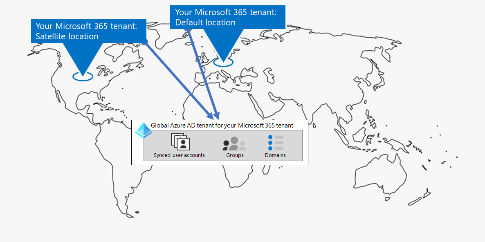

# Passaggio 1. Tenant di Microsoft 365 per le aziende

Una delle prime decisioni del tenant è il numero necessario. Ogni tenant di Microsoft 365 è distinto, univoco e separato da tutti gli altri tenant di Microsoft 365. Il tenant di Azure AD corrispondente è anche distinto, univoco e separato da tutti gli altri tenant di Microsoft 365.

## Tenant singolo
La presenza di un singolo tenant semplifica molti aspetti dell'uso di Microsoft 365 da parte dell'organizzazione. Un singolo tenant significa un singolo tenant di Azure AD con un singolo set di account, gruppi e criteri. Le autorizzazioni e la condivisione delle risorse all'interno dell'organizzazione possono essere eseguite tramite questo provider di identità centrale.

Un singolo tenant offre agli utenti l'esperienza di collaborazione e produttività più ricca di funzionalità e semplificata.

Ecco un esempio che mostra la posizione predefinita e il tenant di Azure AD di un tenant di Microsoft 365.

## Più tenant

Esistono molti motivi per cui l'organizzazione potrebbe avere più tenant:

- Isolamento amministrativo
- IT decentralizzato
- Decisioni cronologiche
- Fusioni, acquisizioni o disinvestizioni
- Chiara separazione della personalizzazione per le organizzazioni conglomerate
- Tenant di pre-produzione, test o sandbox

Ecco un esempio di un'organizzazione con due tenant (Tenant A e Tenant B) nella stessa posizione geografica del datacenter predefinito. Ogni tenant come tenant di Azure AD separato.

Quando si dispone di più tenant, esistono limitazioni e considerazioni aggiuntive per la gestione e la fornitura di servizi agli utenti.

### Collaborazione tra tenant

Se si desidera che gli utenti collaborino in modo più efficace tra tenant di Microsoft 365 diversi in modo sicuro, le opzioni di collaborazione tra tenant includono l'uso di una posizione centrale per file e conversazioni, la condivisione di calendari, l'utilizzo di messaggistica istantanea, chiamate audio/video per la comunicazione e la protezione dell'accesso a risorse e applicazioni.

Per ulteriori informazioni, vedere Collaborazione tra tenant di [Microsoft 365.](../enterprise/microsoft-365-inter-tenant-collaboration.md)

### Migrazione delle cassette postali tra tenant (anteprima)

Prima della migrazione delle cassette postali tra tenant (in anteprima), quando si spostano le cassette postali di Exchange Online tra tenant, è necessario eseguire completamente l'offboarder di una cassetta postale utente dal tenant corrente (il tenant di origine) a quello locale e quindi eseguire l'onboardboard delle cassette postali in un nuovo tenant (il tenant di destinazione). Con la nuova funzionalità di migrazione delle cassette postali tra tenant, gli amministratori tenant nei tenant di origine e di destinazione possono spostare le cassette postali tra i tenant con dipendenze dell'infrastruttura minime nei sistemi locali. In questo modo si elimina la necessità di eseguire l'offboard e l'onboard delle cassette postali.

Ecco due tenant di esempio e le relative cassette postali prima della migrazione delle cassette postali tra tenant.

In questa figura, due tenant separati hanno i propri domini e un set di cassette postali di Exchange.

Ecco il tenant di destinazione (Tenant A) dopo la migrazione delle cassette postali tra tenant.

In questa figura, un singolo tenant dispone di entrambi i domini e di entrambi i set di cassette postali di Exchange.

Per ulteriori informazioni, vedere [Migrazione di cassette postali tra tenant.](../enterprise/cross-tenant-mailbox-migration.md)

### Migrazioni da tenant a tenant

Esistono diversi approcci architetturali per fusioni, acquisizioni, dismisshe e altri scenari che potrebbero portare alla migrazione di un tenant di Microsoft 365 esistente in un nuovo tenant. 

Per istruzioni dettagliate, vedere [Migrazioni da tenant a tenant di Microsoft 365.](../enterprise/microsoft-365-tenant-to-tenant-migrations.md)

## Multi-Geo per un tenant

Con Microsoft 365 Multi-Geo, è possibile effettuare il provisioning e archiviare i dati a riposo nelle altre posizioni geografiche del datacenter scelte per soddisfare i requisiti di residenza dei dati e allo stesso tempo sbloccare l'implementazione globale delle esperienze di produttività moderne per i dipendenti.

In un ambiente Multi-Geo, il tenant di Microsoft 365 è costituito da una posizione predefinita o centrale in cui è stato originariamente creato l'abbonamento a Microsoft 365 e da una o più posizioni satellite. In un tenant multi-geografico, le informazioni su posizioni geografiche, gruppi e informazioni utente vengono masterate in un tenant di Azure AD globale. Poiché le informazioni del tenant vengono masterate centralmente e sincronizzate in ogni posizione geografica, le esperienze di collaborazione che coinvolgono chiunque dell'azienda vengono condivise tra le posizioni.

Ecco un esempio di un'organizzazione che ha la sua posizione predefinita in Europa e una posizione satellite in Nord America. Entrambe le posizioni condividono lo stesso tenant di Azure AD globale per il singolo tenant di Microsoft 365.

Per ulteriori informazioni, vedere [Microsoft 365 Multi-Geo](../enterprise/microsoft-365-multi-geo.md).

## Spostamento dei dati di base in un nuovo data center geografico

Microsoft continua ad aprire nuovi centri dati geografici per i servizi di Microsoft 365. Questi nuovi centri dati geografici aggiungono capacità e risorse di calcolo per supportare la crescita continua della domanda e dell'utilizzo dei clienti. Inoltre, le nuove posizioni geografiche del datacenter offrono la residenza dei dati in-geo per i dati principali dei clienti.

Anche se l'apertura di un nuovo data center geografico non influisce sull'utente e sui dati di base archiviati in una posizione geografica del datacenter già esistente, Microsoft consente di richiedere una migrazione anticipata dei dati principali dei clienti dell'organizzazione a riposo in un nuovo data center geografico.

Ecco un esempio in cui un tenant di Microsoft 365 è stato spostato dalla posizione geografica del datacenter dell'Unione Europea (UE) a quella che si trova nel Regno Unito.

Per ulteriori informazioni, vedere Spostamento dei dati di base in nuove posizioni geografiche del [datacenter di Microsoft 365.](../enterprise/moving-data-to-new-datacenter-geos.md)

## Prodotti e licenze per un tenant

Il tenant di Microsoft 365 viene creato quando si acquista il primo prodotto, ad esempio Microsoft 365 E3. Insieme al prodotto sono presenti licenze, a cui viene addebitata una tariffa mensile o annuale. Un amministratore assegna quindi una licenza disponibile da uno dei prodotti a un account utente, direttamente o tramite l'appartenenza al gruppo. A seconda delle esigenze aziendali dell'organizzazione, potrebbe essere necessario un set di prodotti, ognuno con il proprio pool di licenze. 

Per determinare il set di prodotti e il numero di licenze per ognuno di essi, è necessario pianificare quanto prima:

- Assicurarsi di disporre di licenze sufficienti per gli account utente che necessitano di funzionalità avanzate.
- Impedisci l'eserzione delle licenze o la presenza di troppe licenze non assegnate, in base alle modifiche apportate al personale dell'organizzazione.

## Risultati del Passaggio 1

Per i tenant di Microsoft 365 per le aziende, è stato determinato:

- Numero di tenant di cui si ha o bisogno.
- Per ogni tenant, quali prodotti e licenze devono essere acquistati.
- Indica se un tenant deve essere Multi-Geo per soddisfare i requisiti di residenza dei dati.
- Se è necessario configurare la collaborazione tra tenant.
- Se è necessario eseguire la migrazione di un tenant a un altro.
- Se è necessario spostare i dati di base da una posizione geografica del datacenter a una nuova.

Ecco un esempio di un nuovo tenant.

In questa figura, il tenant ha:

- Posizione predefinita corrispondente a una posizione geografica del datacenter di Microsoft 365.
- Un set di prodotti e licenze.
- Set di app per la produttività cloud, alcune delle quali sono specifiche dei prodotti.
- Un tenant di Azure AD che contiene gli account di amministratore globale e un nome di dominio DNS iniziale.

Durante lo spostamento tra i passaggi aggiuntivi di questa soluzione, verrà compilata questa figura.

## Manutenzione continua per i tenant

Su base continuativa, potrebbe essere necessario:

- Aggiungere un nuovo tenant.
- Aggiungere nuovi prodotti a un tenant con un numero iniziale di licenze.
- Modificare il set di licenze per un prodotto in un tenant per adattare i requisiti del personale.
- Spostare i dati principali da un tenant a una nuova posizione geografica del datacenter.
- Aggiungere Multi-Geo per i requisiti di residenza dei dati.
- Configurare la collaborazione tra tenant.

## Passaggio successivo

Continuare con [la rete](tenant-management-networking.md) per fornire una rete ottimale dai dipendenti ai servizi cloud di Microsoft 365.
