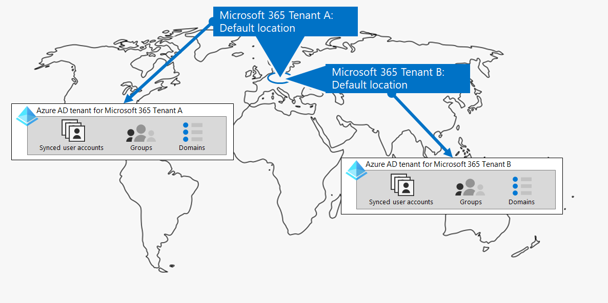

# Passaggio 1. Il Microsoft 365 per i tenant aziendali

Una delle prime decisioni del tenant è il numero di utenti. Ogni Microsoft 365 tenant è distinto, univoco e separato da tutti gli Microsoft 365 tenant. Il tenant di Azure AD corrispondente è anche distinto, univoco e separato da tutti gli Microsoft 365 tenant.

## Tenant singolo
La presenza di un singolo tenant semplifica molti aspetti dell'uso delle Microsoft 365. Un singolo tenant indica un singolo tenant di Azure AD con un singolo set di account, gruppi e criteri. Le autorizzazioni e la condivisione delle risorse nell'organizzazione possono essere eseguite tramite questo provider di identità centrale.

Un singolo tenant offre agli utenti l'esperienza di collaborazione e produttività più ricca di funzionalità e semplificata.

Ecco un esempio che mostra la posizione predefinita e il tenant di Azure AD di un tenant Microsoft 365 locale.

## Più tenant

Esistono molti motivi per cui l'organizzazione potrebbe avere più tenant:

- Isolamento amministrativo
- IT decentralizzato
- Decisioni cronologiche
- Fusioni, acquisizioni o cessioni
- Separazione chiara della personalizzazione per le organizzazioni conglomerate
- Tenant di pre-produzione, test o sandbox

Ecco un esempio di un'organizzazione che dispone di due tenant (Tenant A e Tenant B) nello stesso datacenter geo predefinito. Ogni tenant come tenant di Azure AD separato.

Quando si dispone di più tenant, esistono restrizioni e considerazioni aggiuntive per la gestione e la fornitura di servizi agli utenti.

### Collaborazione tra tenant

Se si desidera che gli utenti collaborino in modo più efficace tra tenant di Microsoft 365 diversi in modo sicuro, le opzioni di collaborazione tra tenant includono l'utilizzo di una posizione centrale per file e conversazioni, la condivisione di calendari, l'utilizzo di messaggistica istantanea, chiamate audio/video per la comunicazione e la protezione dell'accesso a risorse e applicazioni.

Per ulteriori informazioni, vedere [Microsoft 365 collaborazione tra tenant.](../enterprise/microsoft-365-inter-tenant-collaboration.md)

### Migrazione delle cassette postali tra tenant (anteprima)

Prima della migrazione delle cassette postali tra tenant (in anteprima), quando si spostano le cassette postali di Exchange Online tra tenant, è necessario eseguire completamente l'offboard di una cassetta postale utente dal tenant corrente (il tenant di origine) a quello locale e quindi eseguire l'onboardboard in un nuovo tenant (il tenant di destinazione). Con la nuova funzionalità di migrazione delle cassette postali tra tenant, gli amministratori tenant nei tenant di origine e di destinazione possono spostare le cassette postali tra i tenant con dipendenze minime dell'infrastruttura nei sistemi locali. In questo modo viene rimossa la necessità di eseguire l'offboard e l'onboard delle cassette postali.

Ecco due tenant di esempio e le relative cassette postali prima della migrazione delle cassette postali tra tenant.

In questa figura, due tenant separati hanno i propri domini e un set di Exchange cassette postali.

Ecco il tenant di destinazione (Tenant A) dopo la migrazione delle cassette postali tra tenant.

In questa figura, un singolo tenant include sia domini che entrambi i set di Exchange cassette postali.

Per ulteriori informazioni, vedere [Cross-tenant mailbox migration](../enterprise/cross-tenant-mailbox-migration.md).

### Migrazioni da tenant a tenant

Esistono diversi approcci architetturali per fusioni, acquisizioni, cessioni e altri scenari che potrebbero portare alla migrazione di un tenant Microsoft 365 esistente a un nuovo tenant. 

Per istruzioni dettagliate, vedere [Microsoft 365 migrazioni da tenant a tenant](../enterprise/microsoft-365-tenant-to-tenant-migrations.md).

## Multi-Geo per un tenant

Con Microsoft 365 Multi-Geo, è possibile effettuare il provisioning e archiviare i dati a riposo nelle altre posizioni geografiche del datacenter scelte per soddisfare i requisiti di residenza dei dati e allo stesso tempo sbloccare l'implementazione globale delle esperienze di produttività moderne per i dipendenti.

In un ambiente Multi-Geo, il tenant di Microsoft 365 è costituito da una posizione predefinita o centrale in cui è stata originariamente creata la sottoscrizione Microsoft 365 e da una o più posizioni satellite. In un tenant multi-geografico, le informazioni sulle posizioni geografiche, sui gruppi e sulle informazioni utente sono master in un tenant globale di Azure AD. Poiché le informazioni del tenant vengono masterate centralmente e sincronizzate in ogni posizione geografica, le esperienze di collaborazione che coinvolgono tutti gli utenti dell'azienda vengono condivise tra le posizioni.

Ecco un esempio di un'organizzazione che ha la sua posizione predefinita in Europa e una posizione satellite in Nord America. Entrambe le posizioni condividono lo stesso tenant globale di Azure AD per il tenant Microsoft 365 singolo.

Per ulteriori informazioni, vedere [Microsoft 365 Multi-Geo](../enterprise/microsoft-365-multi-geo.md).

## Spostamento dei dati di base in un nuovo data center geo

Microsoft continua ad aprire nuovi dati geografici del datacenter per Microsoft 365 servizi. Questi nuovi geo datacenter aggiungono capacità e risorse di calcolo per supportare la crescita continua della domanda e dell'utilizzo dei clienti. Inoltre, i nuovi dati geografici del datacenter offrono la residenza dei dati in-geo per i dati principali dei clienti.

Sebbene l'apertura di un nuovo data center geo non influisca sull'utente e sui dati di base archiviati in un data center geo già esistente, Microsoft consente di richiedere una migrazione anticipata dei dati dei clienti principali dell'organizzazione in fase di riposo a un nuovo data center geo.

Ecco un esempio in cui un tenant di Microsoft 365 è stato spostato dall'area geografica del datacenter dell'Unione Europea (UE) a quello situato nel Regno Unito (Regno Unito).

Per ulteriori informazioni, vedere [Moving core data to new Microsoft 365 datacenter geos](../enterprise/moving-data-to-new-datacenter-geos.md).

## Prodotti e licenze per un tenant

Il Microsoft 365 tenant viene creato quando si acquista il primo prodotto, ad esempio Microsoft 365 E3. Insieme al prodotto sono presenti licenze, a cui viene addebitata una tariffa mensile o annuale. Un amministratore assegna quindi una licenza disponibile da uno dei prodotti a un account utente, direttamente o tramite l'appartenenza al gruppo. A seconda delle esigenze aziendali dell'organizzazione, è possibile disporre di un set di prodotti, ognuno con il proprio pool di licenze. 

Per determinare il set di prodotti e il numero di licenze per ognuno di essi, è necessario pianificare quanto prima:

- Assicurarsi di disporre di licenze sufficienti per gli account utente che necessitano di funzionalità avanzate.
- Impedisci l'evaso delle licenze o la presenza di troppe licenze non assegnate, in base alle modifiche apportate al personale dell'organizzazione.

## Risultati del Passaggio 1

Per il Microsoft 365 per i tenant aziendali, sono stati determinati:

- Numero di tenant necessari o di cui si ha bisogno.
- Per ogni tenant, quali prodotti e licenze devono essere acquistati.
- Indica se un tenant deve essere Multi-Geo per soddisfare i requisiti di residenza dei dati.
- Indica se è necessario configurare la collaborazione tra tenant.
- Se è necessario eseguire la migrazione di un tenant a un altro.
- Indica se è necessario spostare i dati di base da un datacenter geografico a uno nuovo.

Ecco un esempio di nuovo tenant.

In questa illustrazione, il tenant ha:

- Posizione predefinita corrispondente a una posizione geografica Microsoft 365 datacenter.
- Un set di prodotti e licenze.
- Set di app di produttività cloud, alcune delle quali specifiche per i prodotti.
- Tenant di Azure AD che contiene account di amministratore globale e un nome di dominio DNS iniziale.

Durante lo spostamento tra i passaggi aggiuntivi di questa soluzione, verrà compilata questa figura.

## Manutenzione continua per i tenant

Su base continuativa, potrebbe essere necessario:

- Aggiungere un nuovo tenant.
- Aggiungere nuovi prodotti a un tenant con un numero iniziale di licenze.
- Modificare il set di licenze per un prodotto in un tenant per adattare i requisiti del personale.
- Spostare i dati di base da un tenant a una nuova posizione geografica del datacenter.
- Aggiungere Multi-Geo per i requisiti di residenza dei dati.
- Configurare la collaborazione tra tenant.

## Passaggio successivo

Continuare con [la rete](tenant-management-networking.md) per fornire una rete ottimale dai lavoratori ai Microsoft 365 cloud.
