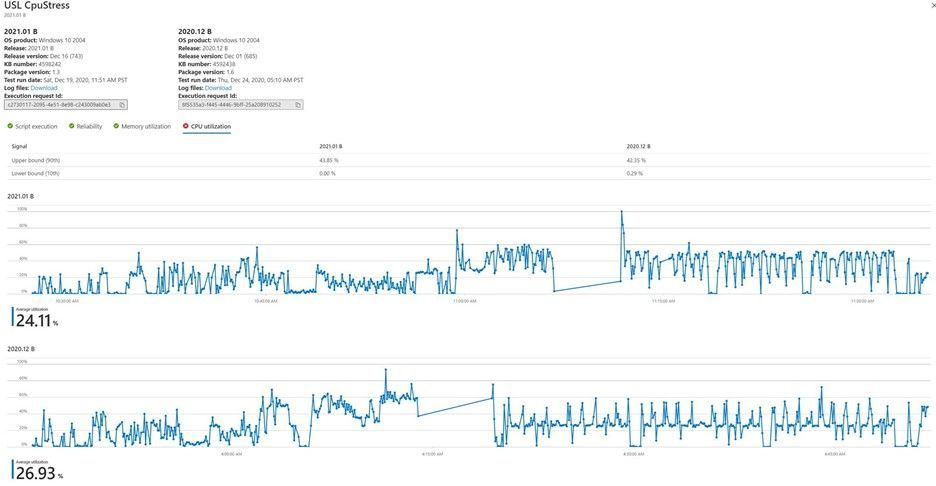

# Analisi intelligente della regressione della CPU

L'utilizzo della CPU può indicare se un'applicazione è interessata da un aggiornamento del sistema operativo. 

Test Base for Microsoft 365 fornisce agli sviluppatori di software informazioni approfondite sulle regressioni delle prestazioni della CPU che si verificano quando l'applicazione è in esecuzione su versioni diverse di un aggiornamento del sistema operativo (OS) di Windows. 

Queste regressioni della CPU consentono agli sviluppatori di rilevare e risolvere i problemi delle applicazioni (e i potenziali errori) prima della distribuzione generale dell'aggiornamento del sistema operativo, impedendo così un'esperienza negativa per l'utente finale.

### Funzionamento dell'analisi di regressione della CPU ###

In quanto utente della base di test, è possibile caricare i file binari dell'applicazione (in un singolo file .zip), insieme agli script di test associati e selezionare la versione del sistema operativo Windows in base alla quale si desidera testare l'applicazione nel portale test di base in Azure. 

Il servizio Test Base esegue quindi gli script di test ed esegue l'analisi **di regressione della CPU.** 

Il servizio verifica se l'utilizzo della CPU per l'applicazione nella versione non definitiva dell'aggiornamento per il sistema operativo di destinazione è in linea con l'utilizzo della CPU per la versione rilasciata del sistema operativo. 

L'utilizzo della CPU non è un confronto simile al 100% perché i processi in esecuzione nelle due versioni del sistema operativo possono corrispondere o meno a una corrispondenza esatta a causa di versioni diverse del sistema operativo. Tuttavia, l'analisi eseguita da Test Base può indicare se l'utilizzo della CPU per l'applicazione è stato intasato da un aggiornamento del sistema operativo imminente e in particolare quali processi sono gressi dalle esecuzioni dei test precedenti.

Nello snapshot seguente sono disponibili due rilasci del sistema operativo rispetto ai quali vengono confrontati gli utilizzo della CPU per la stessa applicazione. 
-   La scheda Utilizzo CPU mostra i limiti superiore e inferiore di utilizzo per entrambe le versioni rispettivamente al 90° e al 10° percentile. 
-   I grafici mostrano la serie temporale di utilizzo della CPU insieme all'utilizzo medio. 

I clienti possono ora usare la funzionalità per determinare se l'utilizzo della CPU dell'applicazione è stato intasato dagli aggiornamenti del sistema operativo e in particolare quali processi sono stati regressi dall'esecuzione precedente.

### Identificazione del processo pertinente ###

In questo argomento viene illustrato come identificare i processi regressi nell'applicazione. 

L'analisi della regressione delle prestazioni richiede il rilevamento di diversi tipi di contatori delle prestazioni per ogni processo in esecuzione su una macchina virtuale durante l'esecuzione dei test. 

Tale analisi acquisisce molte variabili per molti processi per una determinata applicazione. Non tutti i processi sono associati a un'esecuzione o a un'applicazione. Per risolvere questo problema, viene applicato un algoritmo di classificazione reciproca delle informazioni che usa la teoria della probabilità e delle informazioni per capire quali processi sono più rilevanti per una determinata applicazione. 

Un'applicazione può essere considerata un tipo di variabile casuale discreta mentre un processo è considerato un altro tipo di variabile casuale discreta. L'associazione delle due variabili casuali viene misurata utilizzando probabilità condizionali per la pertinenza. 

I processi vengono quindi visualizzati nell'ordine di pertinenza per ogni applicazione. È inoltre possibile scegliere tra i preferiti un sottoinsieme di processi che possono essere monitorati, per impostazione predefinita, insieme ai processi rilevanti per l'analisi della regressione della CPU. Una volta rilevata una regressione, è possibile scaricare il toolkit analizzatore Windows prestazioni e analizzare i motivi delle regressioni delle prestazioni della CPU. 

L Windows Performance Analyzer accetta il registro di traccia eventi (ETL) come input e questi file etl sono disponibili nei file di registro scaricabili per le esecuzioni di test nel portale. Per ulteriori informazioni sul debug delle prestazioni della CPU, vedere la documentazione relativa Windows Performance Analyzer.

