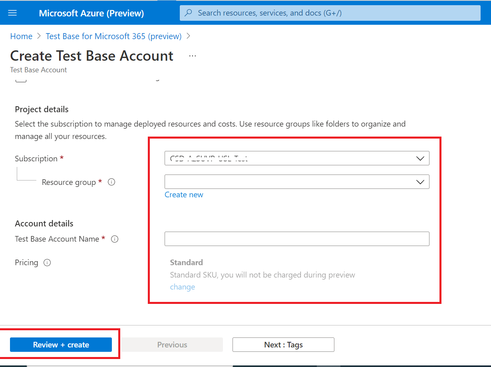

# <a name="step-1-create-a-test-base-account"></a>Passaggio 1: Creare un account di base di test

Se non si dispone di una sottoscrizione di Azure, creare un [account gratuito](https://azure.microsoft.com/en-us/free/) prima di iniziare.

## <a name="enter-details-for-test-base-account"></a>Immettere i dettagli per l'account di base di test
 
1. Cercare **"Base di test"** nel portale di Azure.


2. Fare **clic su "Aggiungi"** per creare un account di base di test.


3.  Leggi la casella ```Terms of Use``` di controllo e quindi seleziona la casella di controllo per confermare la tua soddisfazione per il ```Terms of Use``` file .


4.  Compilare le informazioni corrette in base ai requisiti seguenti: 
    -   Sottoscrizione: Gruppo di risorse
    -   Dettagli istanza: Nome.

**Attualmente, Test Base supporta solo il livello prezzi standard.**



5.  Infine, fai clic ```Review + Create``` su per convalidare e abilitare l'account appena creato.

## <a name="next-steps"></a>Passaggi successivi

Passa all'articolo successivo per iniziare con passaggio 2: **informazioni su come caricare il pacchetto.**
> [!div class="nextstepaction"]
> [Passaggio successivo](uploadApplication.md)

<!---
Add button for next page
-->
