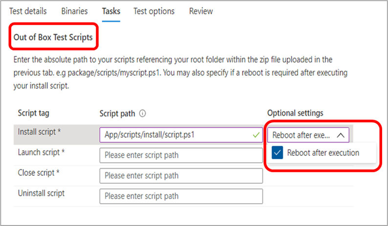
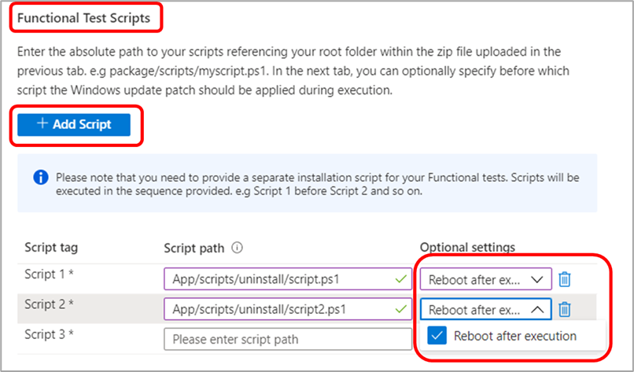

# Domande frequenti sulla base di test

**D: Come si inviano i pacchetti al team di test di base?**

**A:** Invia i pacchetti direttamente all'ambiente di base di test usando il portale self-service.

Per inviare il pacchetto dell'applicazione, passare al portale di [Azure](https://www.aka.ms/testbaseportal "Home page di base dei test") e caricare una cartella compressa contenente i file binari, le dipendenze e gli script di test dell'applicazione tramite il dashboard del portale della base di test self-service. 

Per ulteriori informazioni, vedere il manuale dell'utente per l'onboarding o contattare il team all'indirizzo per <testbasepreview@microsoft.com> assistenza e altre informazioni.

**D: Cosa sono i test out-of-box (OOB) ?**

**A:** I test out-of-box (OOB) sono standardizzati, le esecuzioni di test predefinite in cui i pacchetti dell'applicazione vengono installati, avviati e chiusi trenta (30) volte e quindi disinstallati. 

I pacchetti creati per Test Base avranno gli script di test seguenti: install, launch, close e facoltativamente lo script di disinstallazione. 

I test out-of-box (OOB) forniscono telemetria standardizzata nell'applicazione da confrontare tra Windows build.

**D: È possibile inviare test al di fuori dei test out-of-box (installare, avviare, chiudere, disinstallare script di test)?**

**A:** Sì, i clienti possono anche caricare pacchetti di applicazioni per test **funzionali** tramite il dashboard del portale self-service.
**I test funzionali** sono test che consentono ai clienti di eseguire i propri script per eseguire funzionalità personalizzate nell'applicazione.

## Test

**D: Sono supportati i test funzionali?**

**A:** Sì, Test Base supporta i test funzionali. I test funzionali sono test che consentono ai clienti di eseguire i propri script per eseguire funzionalità personalizzate nell'applicazione. 

Per inviare il pacchetto dell'applicazione per i test funzionali, è sufficiente caricare la cartella compressa contenente i file binari, le dipendenze e gli script di test dell'applicazione tramite il dashboard del portale self-service. 

Per ulteriori informazioni, vedere il manuale dell'utente per l'onboarding o contattare il team all'indirizzo per <testbasepreview@microsoft.com> assistenza e altre informazioni.

**D: In che modo Test Base gestisce i dati di test?**

**A:** Test Base raccoglie e gestisce in modo sicuro i dati di test nell'ambiente Azure. 

**D: Test Base può supportare i test automatizzati?**

Sì, test base supporta test automatizzati, tuttavia, non sono supportati test manuali in questo momento a causa delle funzionalità del servizio.

**D: Quali linguaggi e framework di test automatizzati sono supportati?**

**A:** Supportiamo tutti i linguaggi e i framework. Tutti gli script vengono richiamati tramite PowerShell. 

Dovrai anche fornire (caricare) i file binari dipendenti del framework richiesto.

**D: Quanto tempo base di test fornisce i risultati dei test?**

**A:** Per ogni test eseguito con le build non definitiva, forniremo risultati entro 48 ore nel dashboard del portale [di Azure.](https://www.aka.ms/testbaseportal "Home page di base dei test")

**D: È possibile riavviare dopo l'installazione?**

**A:** Sì, il processo supporta il riavvio dopo l'installazione. Assicurarsi di selezionare questa opzione nell'elenco a discesa "Impostazioni facoltative" quando si **impostano** le attività nel portale di onboarding.

Per i test out-of-box (OOB), è possibile specificare se è necessario un riavvio per lo _script di installazione._

Durante i test funzionali, è possibile specificare se è necessario un riavvio per ogni script aggiunto.

**D: Quali Windows supportate?**

**A:** Attualmente sono supportati Windows 10 client, Windows Server 2016, Windows Server 2016 Core, Windows Server 2019 e Windows Server 2019 Core.

**D: Qual è la differenza tra i test di aggiornamento della sicurezza e i test di aggiornamento delle funzionalità?**

**A:** Per i test di aggiornamento della sicurezza, vengono testati gli aggiornamenti della sicurezza **<ins>non</ins>** definitiva mensili su Windows che sono incentrati sulla protezione e la protezione degli utenti. Per i test di aggiornamento delle funzionalità, vengono testati gli aggiornamenti delle funzionalità **<ins>pre-rilascio bi</ins>** annuali che introducono nuove funzionalità e funzionalità in Windows.

## Opzioni di debug

**D: Si ottiene l'accesso alle macchine virtuali (VM) in caso di errori? Cosa condivide Test Base?**

**A:** Perché il servizio sia conforme e gli aggiornamenti non definitiva siano sicuri, solo Microsoft ha accesso alle macchine virtuali. Tuttavia, i clienti possono visualizzare i risultati dei test e altre metriche di test nel dashboard del portale, tra cui segnali di arresto anomalo e blocco, metriche di affidabilità, utilizzo della memoria e CPU e così via. Vengono inoltre generati e forniti log delle esecuzioni dei test nel dashboard per il download e ulteriori analisi. 

Possiamo anche fornire dump di memoria per il debug di arresto anomalo in base alle esigenze.

**D: Se durante il test vengono rilevati problemi, quali sono i passaggi successivi per risolverli?**

**A:** Il team test base eseguirà un processo di analisi iniziale per determinare la causa principale dell'errore e quindi, a seconda dei risultati, verrà eseguito il routing al cliente o ai team interni di Microsoft per il debug. 

Lavoriamo sempre a stretto contatto con i clienti per risolvere eventuali problemi. 

**D: Microsoft ha il rilascio della patch di sicurezza fino a quando il problema non viene risolto? Quali risoluzioni alternative sono disponibili?**

**A:** L'obiettivo di Test Base è quello di garantire che i nostri clienti finali congiunti non facciano fronte ad alcun problema. We will work hard with Software Vendors to address any issues before the release, but in case the fix is not feasible we have other resolutions such as shims and blocks.

## Varie

**D: Come funziona il servizio con un server locale?**

**A:** Attualmente non è disponibile il supporto per i server locali. Tuttavia, se il server espone l'endpoint HTTP, è possibile connettersi ad esso tramite Internet.

**D: Who ospita le macchine virtuali?**

**A:** Microsoft esegue il provisioning della macchina virtuale per questo servizio, prendendo il carico di farlo dal cliente.

**D: Questo servizio supporta applicazioni Web, mobili o desktop?**

**A:** Attualmente, l'attenzione è concentrata sulle applicazioni desktop, tuttavia, abbiamo in programma di eseguire l'onboardboard delle applicazioni Web in futuro, ma al momento non supportiamo le applicazioni per dispositivi mobili.

**D: Qual è la differenza tra Test Base e SUVP?**

**A:** La differenza principale tra Test Base e SUVP consiste nel fatto che i nostri partner eserciteranno le loro applicazioni nell'ambiente di Azure di base di test per la convalida eseguiti in base agli aggiornamenti non definitiva invece di eseguire i test stessi. 

Oltre al test degli aggiornamenti della sicurezza non definitiva, supportiamo i test degli aggiornamenti delle funzionalità non definitiva sulla nostra piattaforma. Nella nostra roadmap sono disponibili molti altri tipi di aggiornamenti e test del sistema operativo.

**D: Il servizio è associato a un costo?**

**A:** Il servizio Di base di test sarà gratuito per gli utenti fino a disponibilità generale (GA). In quel momento, annunceremo una struttura dei costi che sarà in vigore per tutti i clienti. 

**D: Come posso fornire feedback sulla base di test?**

**A:** Per condividere il feedback sulla base di test, selezionare **l'icona Feedback** nella parte inferiore sinistra del portale. Includi uno screenshot con il tuo invio per aiutare Microsoft a comprendere meglio il tuo feedback. 

Puoi anche inviare suggerimenti sul prodotto e inviare altre idee all'indirizzo <testbasepreview@microsoft.com> .
