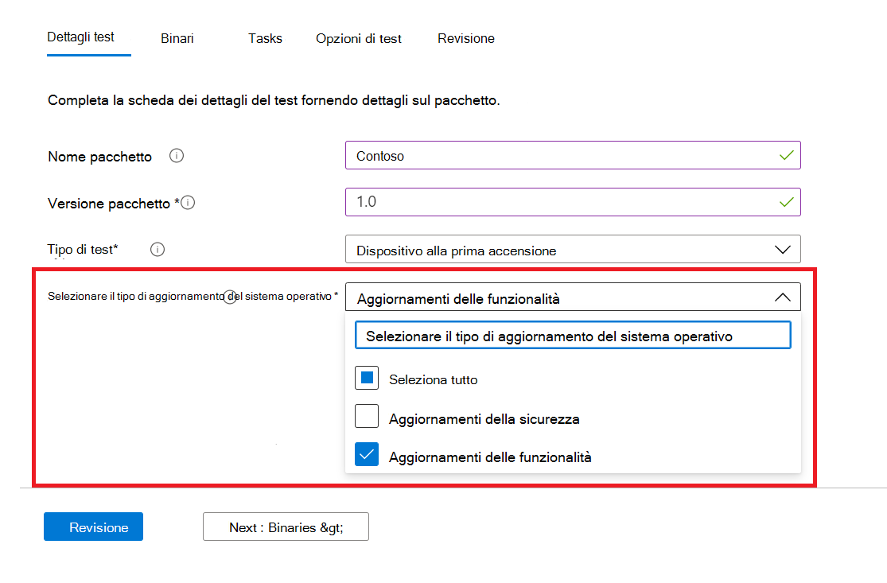
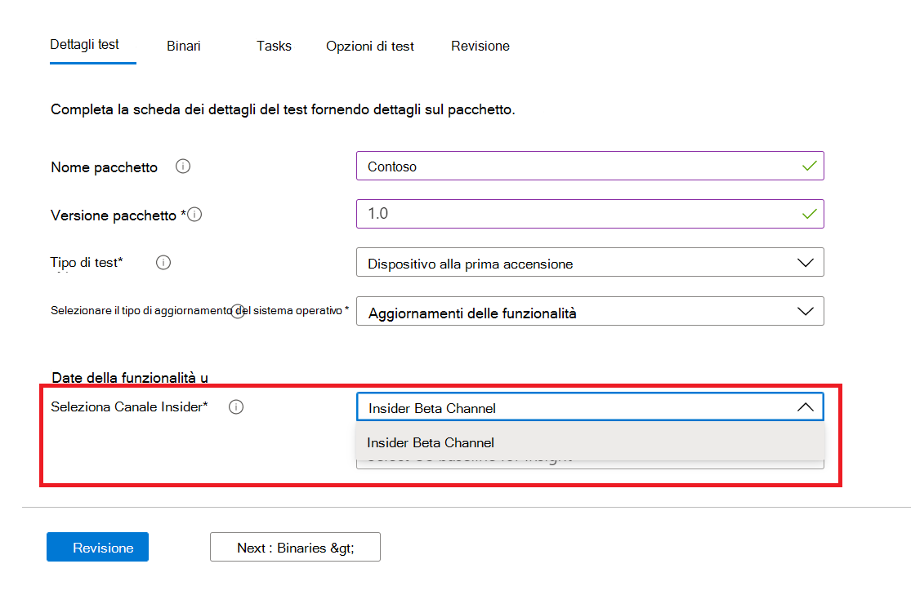

# <a name="windows-feature-update-validation"></a><span data-ttu-id="398f3-103">Windows Convalida dell'aggiornamento delle funzionalità</span><span class="sxs-lookup"><span data-stu-id="398f3-103">Windows Feature update validation</span></span>

<span data-ttu-id="398f3-104">Sono necessarie informazioni dettagliate sulle prestazioni delle applicazioni con la prossima versione di Windows 10 o Windows 11, senza mantenere un ambiente per convalidare le nuove funzionalità Windows?</span><span class="sxs-lookup"><span data-stu-id="398f3-104">Do you need insights on how your applications will perform with the next release of Windows 10 or Windows 11 - without you maintaining an environment to validate new Windows features?</span></span> 

<span data-ttu-id="398f3-105">Si desidera eseguire i test di convalida Windows build del programma Insider nell'ambiente Azure?</span><span class="sxs-lookup"><span data-stu-id="398f3-105">Do you want to run your validation tests against Windows Insider Program builds in our Azure environment?</span></span>

<span data-ttu-id="398f3-106">**La convalida degli** aggiornamenti delle funzionalità in Test Base per M365 può aiutarti a ottenere tutti questi e molto altro ancora!</span><span class="sxs-lookup"><span data-stu-id="398f3-106">**Feature update** validation on Test Base for M365 can help you achieve all these and more!</span></span>

<span data-ttu-id="398f3-107">Per informazioni su come accedere a questa nuova funzionalità, vedere la struttura dettagliata riportata di seguito in Test Base per il servizio M365.</span><span class="sxs-lookup"><span data-stu-id="398f3-107">Check out the step-by-step outline below to find out how to access this new capability in Test Base for M365 service.</span></span>

<span data-ttu-id="398f3-108">Per iniziare in Test Base per M365, caricare le applicazioni (e i file correlati) tramite il portale di ```Feature update validation``` onboarding self-service.</span><span class="sxs-lookup"><span data-stu-id="398f3-108">To get started with ```Feature update validation``` in Test Base for M365, upload your applications (and related files) through the self-service onboarding portal.</span></span> 

<span data-ttu-id="398f3-109">Di seguito sono evidenziati i passaggi da eseguire durante la compilazione dei **dettagli del test:**</span><span class="sxs-lookup"><span data-stu-id="398f3-109">Highlighted below are the steps to take as you fill out the **Test details**:</span></span>

1. <span data-ttu-id="398f3-110">Selezionare **Aggiornamento funzionalità come** tipo di aggiornamento del sistema operativo:</span><span class="sxs-lookup"><span data-stu-id="398f3-110">Select **Feature Update** as your OS update type:</span></span>



2. <span data-ttu-id="398f3-112">Scegli il Windows Insider Channel in base al quale vuoi convalidare l'applicazione.</span><span class="sxs-lookup"><span data-stu-id="398f3-112">Choose the Windows Insider Channel against which you want your application validated.</span></span>  



3. <span data-ttu-id="398f3-115">Seleziona una versione sul mercato di Windows 10 o Windows 11 come base per il test (e le informazioni dettagliate risultanti)e fornisci gli altri dettagli necessari per eseguire correttamente l'onboardboard del pacchetto.</span><span class="sxs-lookup"><span data-stu-id="398f3-115">Select an in-market release of Windows 10 or Windows 11 as the baseline for your test (and resulting insights!) and provide the other details required to onboard your package successfully.</span></span>


4. <span data-ttu-id="398f3-117">Per visualizzare i risultati della convalida dell'applicazione rispetto agli aggiornamenti Windows 10 funzionalità non rilasciati, visitare il ```Feature Updates Test Results``` sito Web .</span><span class="sxs-lookup"><span data-stu-id="398f3-117">To view the results from the validation of your application against pre-released Windows 10 feature updates, visit the ```Feature Updates Test Results```.</span></span>


## <a name="next-steps"></a><span data-ttu-id="398f3-119">Passaggi successivi</span><span class="sxs-lookup"><span data-stu-id="398f3-119">Next steps</span></span>

<span data-ttu-id="398f3-120">Passare all'articolo successivo per iniziare a comprendere l'analisi di regressione della memoria.</span><span class="sxs-lookup"><span data-stu-id="398f3-120">Advance to the next article to get started with understanding Memory regression analysis.</span></span>
> [!div class="nextstepaction"]
> [<span data-ttu-id="398f3-121">Passaggio successivo</span><span class="sxs-lookup"><span data-stu-id="398f3-121">Next step</span></span>](memory.md)

<!---
Add button for next page
-->
