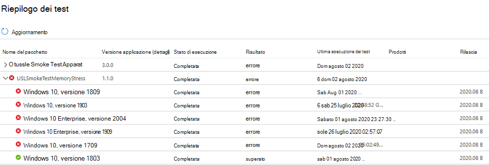

# <a name="memory-regression-analysis"></a>Analisi di regressione della memoria

Test Base consente di notare con maggiore chiarezza un aumento significativo dell'utilizzo della memoria nelle macchine virtuali di test che eseguono le app. Le metriche delle prestazioni, ad esempio l'utilizzo della memoria, possono essere indicative dell'integrità complessiva dell'applicazione e riteniamo che questa aggiunta aiuterà notevolmente a mantenere le prestazioni ottimali delle tue app.

Continua a leggere per altri dettagli o guarda questo video per una breve panoramica dei miglioramenti più recenti. 

Per ulteriori informazioni sulla base di test per la capacità di M365 di facilitare l'analisi di regressione, vedere Risultati di regressione basati sull'affidabilità del processo.

<b>Analisi più ravvicinata delle regressioni della memoria</b>

La base di test per il dashboard di M365 mostra la memoria utilizzata dall'applicazione in un nuovo aggiornamento Windows pre-rilasciato e la confronta con la memoria utilizzata dall'ultimo aggiornamento Windows rilasciato. 

Con i miglioramenti di questo mese, l'analisi di regressione della memoria è ora disponibile nei processi preferiti. Le applicazioni possono contenere più processi ed è possibile selezionare manualmente i processi preferiti tramite la scheda Affidabilità. Il servizio identificherà quindi le regressioni di memoria in questi processi preferiti confrontando le esecuzioni dei test tra Windows versioni di aggiornamento. Se viene rilevata una regressione, i dettagli sulla regressione sono facilmente disponibili.

Esamini ora questa funzionalità in dettaglio e discutono come risolvere i problemi relativi alle regressioni della memoria usando Windows Performance Analyzer.

Il segnale di errore causato da una regressione della memoria viene visualizzato nel dashboard Test Base per M365 nella pagina Risultati dei test in Utilizzo memoria:


L'errore dell'applicazione a causa di un consumo di memoria maggiore verrà visualizzato anche come ```Fail``` nella pagina Riepilogo test:



Fornendo questi segnali di errore in anticipo, il nostro obiettivo è contrassegnare chiaramente i potenziali problemi che possono interrompere e influire sull'esperienza dell'utente finale per l'applicazione. 

È quindi possibile scaricare i file di registro e usare l Windows Performance Analyzer o il toolkit preferito per analizzare ulteriormente. È inoltre possibile collaborare con il team test di base per M365 per risolvere il problema e evitare problemi che influiscono sugli utenti finali.

I segnali di memoria vengono acquisiti nella scheda Utilizzo memoria nella base di test per il servizio M365 per tutte le esecuzioni dei test. L'esempio seguente mostra una recente esecuzione dei test con l'applicazione onboarded "Smoke Test Memory Stress" rispetto all'aggiornamento della sicurezza di agosto 2020 non definitiva. Questa applicazione è stata scritta dal team per illustrare le regressioni della memoria.


In questo esempio, il processo preferito "USLTestMemoryStress.exe" ha utilizzato una media di circa 100 MB nell'aggiornamento di agosto non definitiva rispetto all'aggiornamento di luglio rilasciato, quindi la base di test per M365 ha identificato una regressione. 

Anche gli altri processi, indicati come "USLTestMemoryStress_Aux1.exe" e "USLTestMemoryStress_Aux2.exe", appartengono alla stessa applicazione, ma hanno consumato circa la stessa quantità di memoria per le due versioni in modo che "superano" e siano considerati integri.

La regressione nel processo principale è stata determinata come "statisticamente significativa" in modo che il servizio comunicava ed evidenziava questa differenza per l'utente. Se il confronto non fosse statisticamente significativo, non verrà evidenziato. L'utilizzo della memoria può essere rumoroso, quindi usiamo modelli statistici per distinguere, tra build e rilasci, differenze significative dalle differenze inconsequenziali. 

Un confronto può essere raramente contrassegnato quando non esiste alcuna differenza reale (un falso positivo), ma si tratta di un compromesso necessario per migliorare la probabilità di identificare correttamente le regressioni (o i veri positivi).

Il passaggio successivo consiste nel comprendere cosa ha causato la regressione della memoria. È possibile scaricare i file ZIP per entrambe le esecuzioni dall'opzione Scarica file di registro, come illustrato di seguito. 

Questi file ZIP contengono i risultati dell'esecuzione dei test, inclusi i risultati dello script e i dati sulle prestazioni di memoria e CPU inclusi nel file ETL.


È possibile scaricare e decomprimere i log per le due esecuzioni dei test, quindi individuare il file ETL all'interno di ogni cartella e rinominarli come target.etl (per l'esecuzione dei test nell'aggiornamento non definitiva) e baseline.etl (per l'esecuzione dei test nell'ultimo aggiornamento rilasciato) per semplificare l'esplorazione e l'esplorazione.
 
## <a name="next-steps"></a>Passaggi successivi

Passare all'articolo successivo per iniziare a comprendere l'analisi intelligente della regressione della CPU.
> [!div class="nextstepaction"]
> [Passaggio successivo](cpu.md)

<!---
Add button for next page
-->
