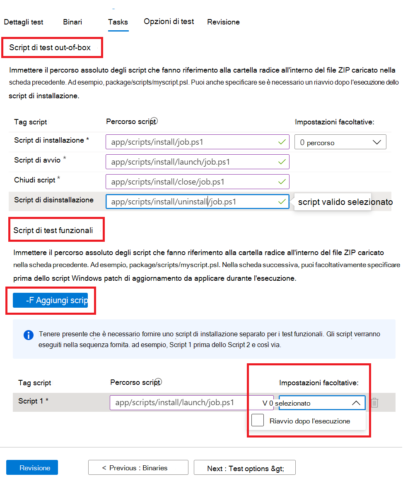

# <a name="step-4-the-tasks-tab"></a>Passaggio 4: scheda Attività

Nella scheda attività è previsto che si forniranno i percorsi degli script di test presenti nella cartella zip caricata nella scheda file binari.

  - **Script di test out-of-box:** Digitare i percorsi relativi agli script di installazione, avvio, chiusura e disinstallazione. È inoltre possibile selezionare impostazioni aggiuntive per lo script di installazione.
  - **Script di test funzionali:** Digitare il percorso relativo di ogni script di test funzionale caricato. È possibile aggiungere ulteriori script di test funzionali utilizzando il ```Add Script``` pulsante. È necessario un minimo di uno (1) script e può aggiungere fino a otto (8) script di test funzionali. 
  
    Gli script vengono eseguiti in sequenza di caricamento e un errore in uno script specifico interrompe l'esecuzione degli script successivi.
    È inoltre possibile selezionare impostazioni aggiuntive per ogni script fornito.

## <a name="set-script-path"></a>Imposta percorso script



Di seguito è riportato un esempio di come fornire il percorso relativo in una struttura di cartelle:

_**Zip_file_uploaded**_
~~~
├── file1.exe

├── ScriptX.ps1

├── folder1

│   ├── file3.exe

│   ├── script.ps1
~~~
  - **ScriptX.ps1** avrebbe. _ScriptX.ps1_ come percorso relativo.
  - **Script.ps1** _cartella1/script.ps1_ come percorso relativo.


## <a name="next-steps"></a>Passaggi successivi

Visualizzare i dettagli della scheda Opzioni di test nell'articolo successivo 
> [!div class="nextstepaction"]
> [Passaggio successivo](testoptions.md)
