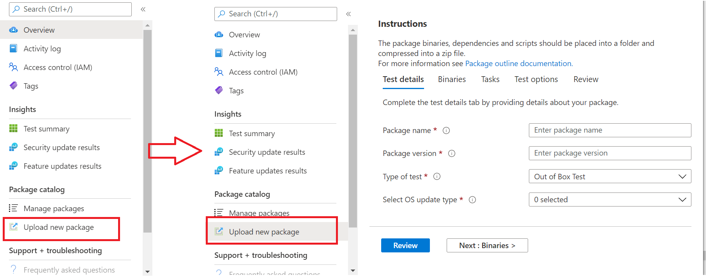

# <a name="step-2-uploading-a-package"></a><span data-ttu-id="7cedd-103">Passaggio 2: Caricamento di un pacchetto</span><span class="sxs-lookup"><span data-stu-id="7cedd-103">Step 2: Uploading a Package</span></span>

<span data-ttu-id="7cedd-104">Nella pagina Del portale di base di test passare all'opzione "Upload nuovo pacchetto sulla barra di spostamento sinistra, come illustrato di seguito: Upload </span><span class="sxs-lookup"><span data-stu-id="7cedd-104">On the Test Base portal page, navigate to the ‘Upload new package option on the left navigation bar as shown below: </span></span>

<span data-ttu-id="7cedd-105">Una volta lì, segui i passaggi seguenti per caricare un nuovo pacchetto.</span><span class="sxs-lookup"><span data-stu-id="7cedd-105">Once there, follow the steps below to upload a new package.</span></span>

## <a name="enter-details-for-your-package"></a><span data-ttu-id="7cedd-106">Immetti i dettagli per il pacchetto</span><span class="sxs-lookup"><span data-stu-id="7cedd-106">Enter details for your package</span></span>

<span data-ttu-id="7cedd-107">Nella scheda Dettagli test digita il nome, la versione e altri dettagli del pacchetto come richiesto.</span><span class="sxs-lookup"><span data-stu-id="7cedd-107">On the Test details tab, type in your package's name, version and other details as requested.</span></span> 

<span data-ttu-id="7cedd-108">**I test out-of-box** **e funzionali** possono essere evasi tramite questo dashboard.</span><span class="sxs-lookup"><span data-stu-id="7cedd-108">**Out-of-Box** and **Functional testing** can be done via this dashboard.</span></span>

<span data-ttu-id="7cedd-109">La procedura seguente fornisce una guida su come compilare i dettagli del pacchetto:</span><span class="sxs-lookup"><span data-stu-id="7cedd-109">The steps below provides a guide on how to fill out your package details:</span></span>

1.  <span data-ttu-id="7cedd-110">**Immetti il nome a cui assegnare il pacchetto nel ```“Package name``` campo.**</span><span class="sxs-lookup"><span data-stu-id="7cedd-110">**Enter the name to be given your package in the ```“Package name``` field.**</span></span>

> [!Note]  
> <span data-ttu-id="7cedd-111">Il nome del pacchetto e la combinazione di versione immessi devono essere univoci all'interno dell'organizzazione.</span><span class="sxs-lookup"><span data-stu-id="7cedd-111">The package name and version combination entered must be unique within your organization.</span></span> <span data-ttu-id="7cedd-112">Questo viene convalidato dal segno di spunta, come illustrato di seguito.</span><span class="sxs-lookup"><span data-stu-id="7cedd-112">This is validated by the checkmark as shown below.</span></span>
  
  - <span data-ttu-id="7cedd-113">Se scegli di usare di nuovo il nome di un pacchetto, il numero di versione deve essere univoco (ad esempio, non è mai stato usato con un pacchetto con quel particolare nome).</span><span class="sxs-lookup"><span data-stu-id="7cedd-113">If you choose to re-use an package's name, then the version number must be unique (i.e. never been used with an package bearing that particular name).</span></span>
  - <span data-ttu-id="7cedd-114">Se la combinazione del nome del pacchetto + versione non supera il controllo di univocità, verrà visualizzato un messaggio di errore che indica che il pacchetto con questa versione del pacchetto *esiste già.*</span><span class="sxs-lookup"><span data-stu-id="7cedd-114">If the combination of the package name + version does not pass the uniqueness check, you will see an error message which reads, *“Package with this package version already exists”*.</span></span> 


2. <span data-ttu-id="7cedd-116">**Immetti una versione nel campo "Versione pacchetto".**</span><span class="sxs-lookup"><span data-stu-id="7cedd-116">**Enter a version in the “Package version” field.**</span></span>


3.  <span data-ttu-id="7cedd-118">**Selezionare il tipo di test che si desidera eseguire nel pacchetto**</span><span class="sxs-lookup"><span data-stu-id="7cedd-118">**Select the type of test you want to run on this package**</span></span>

    <span data-ttu-id="7cedd-119">Un **test OOB (Out-of-Box)** esegue un'installazione,  *avvia,* *chiudi* e *disinstalla* il pacchetto.</span><span class="sxs-lookup"><span data-stu-id="7cedd-119">An **Out-of-Box (OOB)** test performs an *install*, *launch*, *close* and *uninstall* of your package.</span></span> <span data-ttu-id="7cedd-120">Dopo l'installazione, la routine di avvio-chiusura viene ripetuta 30 volte prima dell'esecuzione di una singola disinstallazione.</span><span class="sxs-lookup"><span data-stu-id="7cedd-120">After the install, the launch-close routine is repeated 30 times before a single uninstall is run.</span></span> 
    
    <span data-ttu-id="7cedd-121">Questo test OOB fornisce telemetria standardizzata nel pacchetto da confrontare tra Windows build.</span><span class="sxs-lookup"><span data-stu-id="7cedd-121">This OOB test provides you with standardized telemetry on your package to compare across Windows builds.</span></span>

    <span data-ttu-id="7cedd-122">Un **test funzionale** esegue gli script di test caricati nel pacchetto.</span><span class="sxs-lookup"><span data-stu-id="7cedd-122">A **Functional test** would execute your uploaded test script(s) on your package.</span></span> <span data-ttu-id="7cedd-123">Gli script vengono eseguiti in sequenza di caricamento e un errore in uno script specifico interrompe l'esecuzione degli script successivi.</span><span class="sxs-lookup"><span data-stu-id="7cedd-123">The scripts are run in upload sequence and a failure in a particular script will stop subsequent scripts from executing.</span></span>

> [!Note]
> <span data-ttu-id="7cedd-124">**Tutti** gli script vengono eseguiti al massimo per 80 minuti.</span><span class="sxs-lookup"><span data-stu-id="7cedd-124">**All** scripts run for 80 minutes at the most.</span></span> 
    
4.  <span data-ttu-id="7cedd-125">**Selezionare il tipo di aggiornamento del sistema operativo**</span><span class="sxs-lookup"><span data-stu-id="7cedd-125">**Select the OS update type**</span></span>

   - <span data-ttu-id="7cedd-126">Gli "aggiornamenti della sicurezza" consentono di testare il pacchetto in base a varianza incrementale Windows aggiornamenti della sicurezza mensili non rilasciati.</span><span class="sxs-lookup"><span data-stu-id="7cedd-126">The ‘Security updates’ enables your package to be tested against incremental churns of Windows pre-release monthly security updates.</span></span> 
   - <span data-ttu-id="7cedd-127">Gli "aggiornamenti delle funzionalità" consentono di testare il pacchetto Windows build di aggiornamenti delle funzionalità bi-annuali non definitiva del programma Insider Windows.</span><span class="sxs-lookup"><span data-stu-id="7cedd-127">The ‘Feature updates’ enables your package to be tested against Windows pre-release bi-annual feature updates builds from the Windows Insider Program.</span></span>
<!---
Change to the correct picture
-->


5.  <span data-ttu-id="7cedd-129">**Selezionare le versioni del sistema operativo per i test di aggiornamento della sicurezza.**</span><span class="sxs-lookup"><span data-stu-id="7cedd-129">**Select the OS version(s) for Security update tests.**</span></span>

<span data-ttu-id="7cedd-130">Nell'elenco a discesa a selezione multipla seleziona le versioni del sistema operativo Windows in cui verrà installato il pacchetto.</span><span class="sxs-lookup"><span data-stu-id="7cedd-130">In the multi-select dropdown, select the OS version(s) of Windows your package will be installed on.</span></span> 

  - <span data-ttu-id="7cedd-131">Per testare il pacchetto solo Windows sistemi operativo client, seleziona le versioni Windows 11 del sistema operativo applicabili nell'elenco dei menu.</span><span class="sxs-lookup"><span data-stu-id="7cedd-131">To test your package against Windows Client OSes only, select the applicable Windows 11 OS versions from the menu list.</span></span>
  - <span data-ttu-id="7cedd-132">Per testare il pacchetto solo Windows sistema operativo Server, selezionare le versioni del sistema operativo Windows Server applicabili nell'elenco dei menu.</span><span class="sxs-lookup"><span data-stu-id="7cedd-132">To test your package against Windows Server OSes only, select the applicable Windows Server OS versions from the menu list.</span></span>
  - <span data-ttu-id="7cedd-133">Per testare il pacchetto Windows sistemi operativo client e server, selezionare tutti i sistemi operativo applicabili nell'elenco dei menu.</span><span class="sxs-lookup"><span data-stu-id="7cedd-133">To test your package against Windows Client and Server OSes, select all applicable OSes from the menu list.</span></span> 

> [!Note]
> <span data-ttu-id="7cedd-134">Se si sceglie di testare il pacchetto in entrambi i sistemi operativo server e client, verificare che il pacchetto sia compatibile e che possa essere eseguito su entrambi i sistemi operativo</span><span class="sxs-lookup"><span data-stu-id="7cedd-134">If you select to test your package against both Server and Client OSes, please make sure that the package is compatible and can run on both OSes</span></span>


<!---
Change to the correct picture
-->
6.  <span data-ttu-id="7cedd-136">**Selezionare le opzioni per i test di aggiornamento delle funzionalità:**</span><span class="sxs-lookup"><span data-stu-id="7cedd-136">**Select options for Feature update tests:**</span></span>

  - <span data-ttu-id="7cedd-137">Nell'opzione "Seleziona canale Insider", seleziona la build con cui ```Windows Insider Program Channel``` testare i pacchetti.</span><span class="sxs-lookup"><span data-stu-id="7cedd-137">On the option to “Select Insider Channel”, select the ```Windows Insider Program Channel``` as the build which your packages should be tested against.</span></span>
  
    <span data-ttu-id="7cedd-138">Attualmente usiamo le build in anteprima nel Canale Insider Beta.</span><span class="sxs-lookup"><span data-stu-id="7cedd-138">We currently use builds flighted in the Insider Beta Channel.</span></span>

  - <span data-ttu-id="7cedd-139">Nell'opzione "Seleziona baseline del sistema operativo per Insight", seleziona la versione del sistema operativo Windows da usare come base per confrontare i risultati dei test.</span><span class="sxs-lookup"><span data-stu-id="7cedd-139">On the option to “Select OS baseline for Insight”, select the Windows OS version to be used as a baseline in comparing your test results.</span></span> 

> [!Note]
> <span data-ttu-id="7cedd-140">Non sono supportati i test degli aggiornamenti delle funzionalità per i sistema operativo server in questo momento</span><span class="sxs-lookup"><span data-stu-id="7cedd-140">We DO NOT support Feature update testing for Server OSes at this time</span></span>
<!---
Note to actual note format for markdown
-->
<!---
Change to the correct picture
-->


7.  <span data-ttu-id="7cedd-142">Una pagina dei dettagli del test completata dovrebbe essere simile alla seguente:</span><span class="sxs-lookup"><span data-stu-id="7cedd-142">A completed Test details page should look like this:</span></span> 


## <a name="next-steps"></a><span data-ttu-id="7cedd-144">Passaggi successivi</span><span class="sxs-lookup"><span data-stu-id="7cedd-144">Next steps</span></span>

<span data-ttu-id="7cedd-145">L'articolo successivo illustra come caricare i file binari nel nostro serivce.</span><span class="sxs-lookup"><span data-stu-id="7cedd-145">Our next article covers Uploading your Binaries to our serivce.</span></span>
> [!div class="nextstepaction"]
> [<span data-ttu-id="7cedd-146">Passaggio successivo</span><span class="sxs-lookup"><span data-stu-id="7cedd-146">Next step</span></span>](binaries.md)

<!---
Add button for next page
-->

