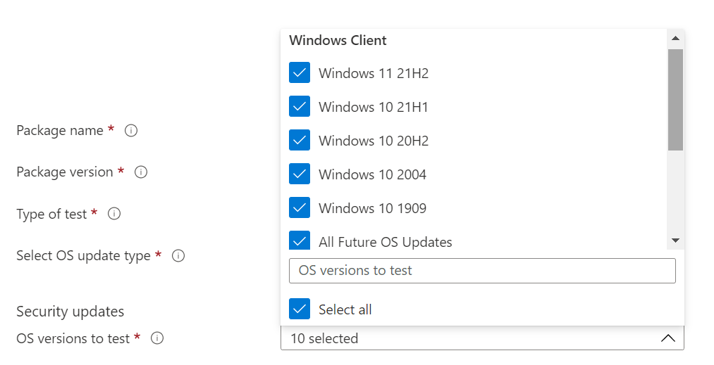

# <a name="step-2-uploading-a-package"></a>Passaggio 2: Caricamento di un pacchetto

Nella pagina Del portale di base di test passare all'opzione "Upload nuovo pacchetto sulla barra di spostamento sinistra, come illustrato di seguito: Upload 

Una volta lì, segui i passaggi seguenti per caricare un nuovo pacchetto.

## <a name="enter-details-for-your-package"></a>Immetti i dettagli per il pacchetto

Nella scheda Dettagli test digita il nome, la versione e altri dettagli del pacchetto come richiesto. 

**I test out-of-box** **e funzionali** possono essere evasi tramite questo dashboard.

La procedura seguente fornisce una guida su come compilare i dettagli del pacchetto:

1.  **Immetti il nome a cui assegnare il pacchetto nel ```“Package name``` campo.**

> [!Note]  
> Il nome del pacchetto e la combinazione di versione immessi devono essere univoci all'interno dell'organizzazione. Questo viene convalidato dal segno di spunta, come illustrato di seguito.
  
  - Se scegli di usare di nuovo il nome di un pacchetto, il numero di versione deve essere univoco (ad esempio, non è mai stato usato con un pacchetto con quel particolare nome).
  - Se la combinazione del nome del pacchetto + versione non supera il controllo di univocità, verrà visualizzato un messaggio di errore che indica che il pacchetto con questa versione del pacchetto *esiste già.* 


2. **Immetti una versione nel campo "Versione pacchetto".**


3.  **Selezionare il tipo di test che si desidera eseguire nel pacchetto**

    Un **test OOB (Out-of-Box)** esegue un'installazione,  *avvia,* *chiudi* e *disinstalla* il pacchetto. Dopo l'installazione, la routine di avvio-chiusura viene ripetuta 30 volte prima dell'esecuzione di una singola disinstallazione. 
    
    Questo test OOB fornisce telemetria standardizzata nel pacchetto da confrontare tra Windows build.

    Un **test funzionale** esegue gli script di test caricati nel pacchetto. Gli script vengono eseguiti in sequenza di caricamento e un errore in uno script specifico interrompe l'esecuzione degli script successivi.

> [!Note]
> **Tutti** gli script vengono eseguiti al massimo per 80 minuti. 
    
4.  **Selezionare il tipo di aggiornamento del sistema operativo**

   - Gli "aggiornamenti della sicurezza" consentono di testare il pacchetto in base a varianza incrementale Windows aggiornamenti della sicurezza mensili non rilasciati. 
   - Gli "aggiornamenti delle funzionalità" consentono di testare il pacchetto Windows build di aggiornamenti delle funzionalità bi-annuali non definitiva del programma Insider Windows.
<!---
Change to the correct picture
-->


5.  **Selezionare le versioni del sistema operativo per i test di aggiornamento della sicurezza.**

Nell'elenco a discesa a selezione multipla seleziona le versioni del sistema operativo Windows in cui verrà installato il pacchetto. 

  - Per testare il pacchetto solo Windows sistemi operativo client, seleziona le versioni Windows 11 del sistema operativo applicabili nell'elenco dei menu.
  - Per testare il pacchetto solo Windows sistema operativo Server, selezionare le versioni del sistema operativo Windows Server applicabili nell'elenco dei menu.
  - Per testare il pacchetto Windows sistemi operativo client e server, selezionare tutti i sistemi operativo applicabili nell'elenco dei menu. 

> [!Note]
> Se si sceglie di testare il pacchetto in entrambi i sistemi operativo server e client, verificare che il pacchetto sia compatibile e che possa essere eseguito su entrambi i sistemi operativo



<!---
Change to the correct picture
-->
6.  **Selezionare le opzioni per i test di aggiornamento delle funzionalità:**

  - Nell'opzione "Seleziona canale Insider", seleziona la build con cui ```Windows Insider Program Channel``` testare i pacchetti.
  
    Attualmente usiamo le build in anteprima nel Canale Insider Beta.

  - Nell'opzione "Seleziona baseline del sistema operativo per Insight", seleziona la versione del sistema operativo Windows da usare come base per confrontare i risultati dei test. 

> [!Note]
> Non sono supportati i test degli aggiornamenti delle funzionalità per i sistema operativo server in questo momento
<!---
Note to actual note format for markdown
-->
<!---
Change to the correct picture
-->


7.  Una pagina dei dettagli del test completata dovrebbe essere simile alla seguente: 


## <a name="next-steps"></a>Passaggi successivi

L'articolo successivo illustra come caricare i file binari nel nostro serivce.
> [!div class="nextstepaction"]
> [Passaggio successivo](binaries.md)

<!---
Add button for next page
-->

